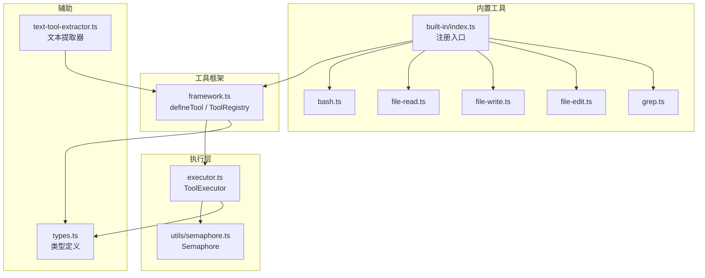
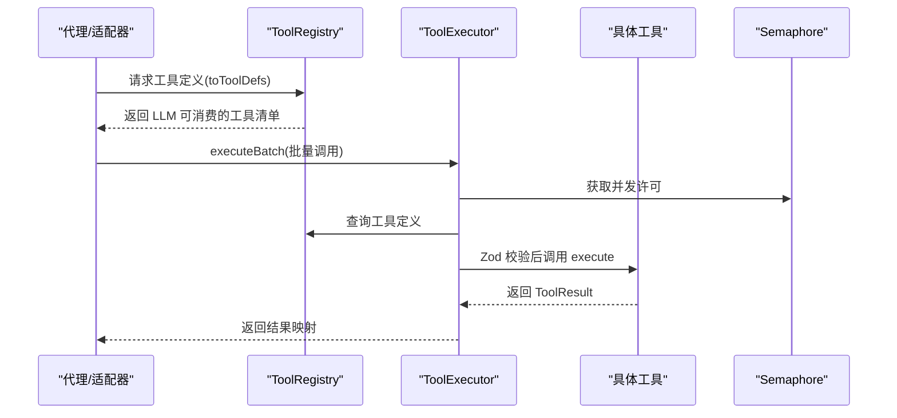
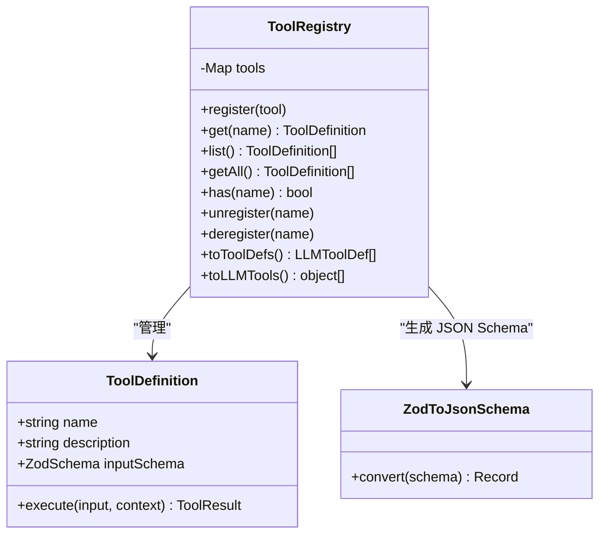
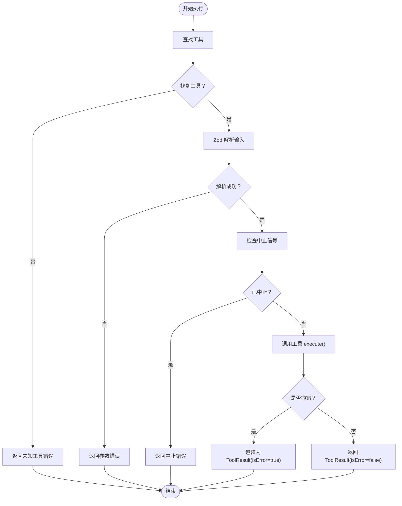
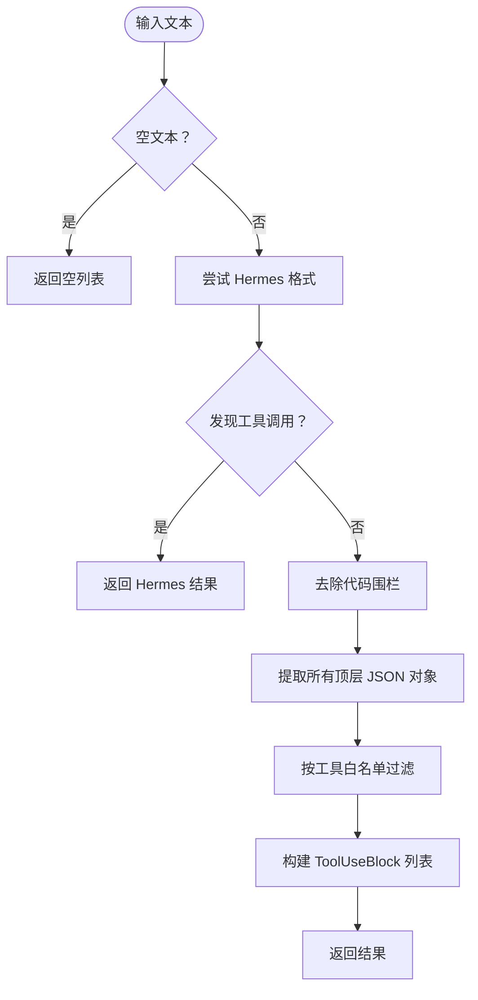
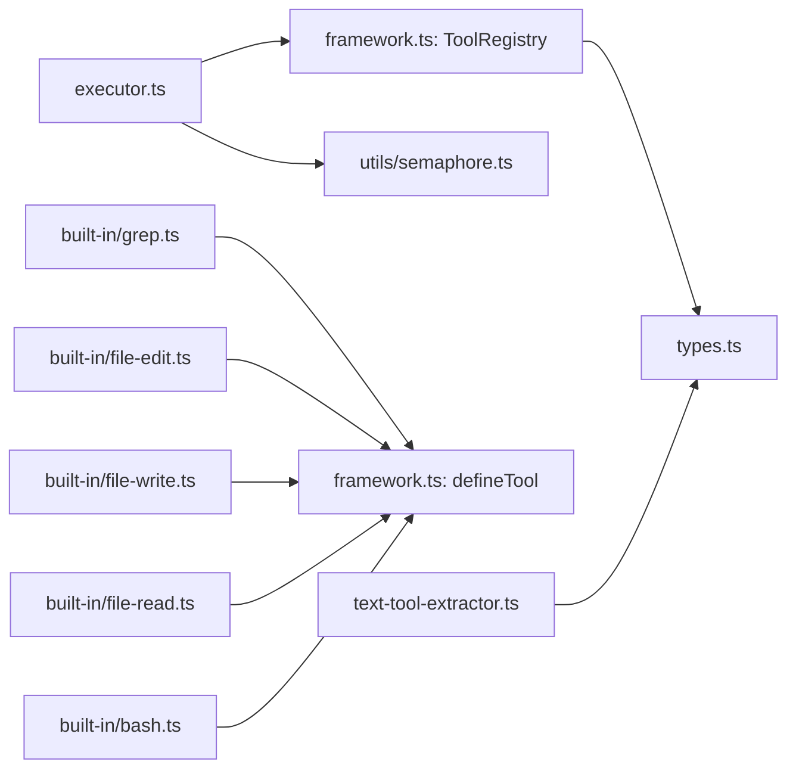

# 工具系统

<cite>
**本文引用的文件**
- [src/tool/framework.ts](file://src/tool/framework.ts)
- [src/tool/executor.ts](file://src/tool/executor.ts)
- [src/tool/text-tool-extractor.ts](file://src/tool/text-tool-extractor.ts)
- [src/tool/built-in/index.ts](file://src/tool/built-in/index.ts)
- [src/tool/built-in/bash.ts](file://src/tool/built-in/bash.ts)
- [src/tool/built-in/file-read.ts](file://src/tool/built-in/file-read.ts)
- [src/tool/built-in/file-write.ts](file://src/tool/built-in/file-write.ts)
- [src/tool/built-in/file-edit.ts](file://src/tool/built-in/file-edit.ts)
- [src/tool/built-in/grep.ts](file://src/tool/built-in/grep.ts)
- [src/utils/semaphore.ts](file://src/utils/semaphore.ts)
- [src/types.ts](file://src/types.ts)
- [tests/built-in-tools.test.ts](file://tests/built-in-tools.test.ts)
- [tests/tool-executor.test.ts](file://tests/tool-executor.test.ts)
- [examples/06-local-model.ts](file://examples/06-local-model.ts)
- [examples/12-grok.ts](file://examples/12-grok.ts)
</cite>

## 目录
1. [简介](#简介)
2. [项目结构](#项目结构)
3. [核心组件](#核心组件)
4. [架构总览](#架构总览)
5. [详细组件分析](#详细组件分析)
6. [依赖关系分析](#依赖关系分析)
7. [性能考量](#性能考量)
8. [故障排查指南](#故障排查指南)
9. [结论](#结论)
10. [附录](#附录)

## 简介
本文件系统性阐述 Open Multi-Agent 框架中的工具系统，覆盖工具定义与注册机制、内置工具功能与配置、工具执行器的参数校验与错误处理、文本工具提取器的回退策略，以及自定义工具开发的最佳实践与安全注意事项。目标是帮助开发者快速理解并正确使用工具系统，同时在需要时扩展或替换内置工具。

## 项目结构
工具系统位于 src/tool 目录下，包含：
- 定义与注册：framework.ts 提供 defineTool 工厂与 ToolRegistry 注册表
- 执行器：executor.ts 提供并发控制、批量执行与错误隔离
- 文本提取器：text-tool-extractor.ts 针对本地模型输出的回退解析
- 内置工具：built-in 目录下的 bash、file-read/write/edit、grep
- 并发控制：utils/semaphore.ts 提供轻量计数信号量
- 类型定义：types.ts 提供工具相关的类型与上下文

**图表来源**
- [src/tool/framework.ts:1-558](file://src/tool/framework.ts#L1-L558)
- [src/tool/executor.ts:1-179](file://src/tool/executor.ts#L1-L179)
- [src/tool/text-tool-extractor.ts:1-220](file://src/tool/text-tool-extractor.ts#L1-L220)
- [src/tool/built-in/index.ts:1-51](file://src/tool/built-in/index.ts#L1-L51)
- [src/utils/semaphore.ts:1-90](file://src/utils/semaphore.ts#L1-L90)
- [src/types.ts:1-543](file://src/types.ts#L1-L543)

**章节来源**
- [src/tool/framework.ts:1-558](file://src/tool/framework.ts#L1-L558)
- [src/tool/executor.ts:1-179](file://src/tool/executor.ts#L1-L179)
- [src/tool/text-tool-extractor.ts:1-220](file://src/tool/text-tool-extractor.ts#L1-L220)
- [src/tool/built-in/index.ts:1-51](file://src/tool/built-in/index.ts#L1-L51)
- [src/utils/semaphore.ts:1-90](file://src/utils/semaphore.ts#L1-L90)
- [src/types.ts:1-543](file://src/types.ts#L1-L543)

## 核心组件
- defineTool 工厂函数：用于声明强类型工具，返回满足 ToolDefinition 接口的对象，包含名称、描述、输入模式与执行函数。
- ToolRegistry 注册表：集中管理工具，支持注册、查询、列出、注销，并可导出 LLM 期望的 JSON Schema 工具定义。
- ToolExecutor 执行器：负责单次与批量工具调用，进行 Zod 输入校验、并发限制、异常捕获与结果归一化。
- 文本工具提取器：针对本地模型（如 Ollama）输出非标准 JSON 的回退解析，尝试从纯文本中提取工具调用块。
- 内置工具集合：bash、file_read、file_write、file_edit、grep，均通过 defineTool 定义并通过 registerBuiltInTools 一次性注册。

**章节来源**
- [src/tool/framework.ts:51-83](file://src/tool/framework.ts#L51-L83)
- [src/tool/framework.ts:93-203](file://src/tool/framework.ts#L93-L203)
- [src/tool/executor.ts:47-178](file://src/tool/executor.ts#L47-L178)
- [src/tool/text-tool-extractor.ts:196-220](file://src/tool/text-tool-extractor.ts#L196-L220)
- [src/tool/built-in/index.ts:46-50](file://src/tool/built-in/index.ts#L46-L50)

## 架构总览
工具系统围绕“定义-注册-执行-回退”四条主线工作：
- 定义与注册：defineTool + ToolRegistry 将工具暴露给 LLM，生成 JSON Schema
- 执行：ToolExecutor 负责并发、校验、异常捕获与结果统一
- 回退：当本地模型未按标准返回 tool_calls 时，text-tool-extractor 从文本中提取工具调用
- 内置工具：提供常用能力，开箱即用

**图表来源**
- [src/tool/framework.ts:162-171](file://src/tool/framework.ts#L162-L171)
- [src/tool/executor.ts:105-121](file://src/tool/executor.ts#L105-L121)
- [src/utils/semaphore.ts:71-78](file://src/utils/semaphore.ts#L71-L78)

## 详细组件分析

### defineTool 与 ToolRegistry
- defineTool：接收 name、description、inputSchema（Zod）、execute 函数，返回 ToolDefinition。该对象作为注册单元进入 ToolRegistry。
- ToolRegistry：提供 register/get/list/unregister 等方法；toToolDefs 将工具转换为 LLM 期望的 LLMToolDef 数组；toLLMTools 输出 Anthropic 风格 input_schema。
- zodToJsonSchema：将 Zod 模式递归转换为 JSON Schema 对象，覆盖常见类型与修饰符，不支持类型回退为空对象。

**图表来源**
- [src/tool/framework.ts:71-83](file://src/tool/framework.ts#L71-L83)
- [src/tool/framework.ts:93-203](file://src/tool/framework.ts#L93-L203)
- [src/tool/framework.ts:221-433](file://src/tool/framework.ts#L221-L433)

**章节来源**
- [src/tool/framework.ts:51-83](file://src/tool/framework.ts#L51-L83)
- [src/tool/framework.ts:93-203](file://src/tool/framework.ts#L93-L203)
- [src/tool/framework.ts:221-433](file://src/tool/framework.ts#L221-L433)

### ToolExecutor：参数验证、错误处理与并发控制
- 单次执行：先查注册表，再进行 Zod 校验，随后调用工具 execute；任何阶段异常均转为 ToolResult isError=true。
- 批量执行：基于 Semaphore 控制最大并发，每个调用独立捕获错误，保证其他任务不受影响。
- 中止信号：在解析前与执行前检查 context.abortSignal，避免浪费资源。
- 结果归一化：所有错误统一包装为 ToolResult，便于上层继续对话或重试。

**图表来源**
- [src/tool/executor.ts:70-90](file://src/tool/executor.ts#L70-L90)
- [src/tool/executor.ts:132-169](file://src/tool/executor.ts#L132-L169)

**章节来源**
- [src/tool/executor.ts:47-178](file://src/tool/executor.ts#L47-L178)
- [src/utils/semaphore.ts:24-89](file://src/utils/semaphore.ts#L24-L89)

### 文本工具提取器：回退机制
- 当本地模型未按标准返回 tool_calls 时，从纯文本中提取工具调用块：
  - 支持多种形态：Hermes 标签、裸 JSON、代码围栏包裹 JSON
  - 白名单过滤：仅接受已知工具名
  - 多策略尝试：优先 Hermes，其次剥离围栏后提取 JSON 对象
- 生成唯一 ID：为提取到的工具调用分配唯一标识，便于后续执行与追踪

**图表来源**
- [src/tool/text-tool-extractor.ts:196-220](file://src/tool/text-tool-extractor.ts#L196-L220)
- [src/tool/text-tool-extractor.ts:159-177](file://src/tool/text-tool-extractor.ts#L159-L177)
- [src/tool/text-tool-extractor.ts:108-153](file://src/tool/text-tool-extractor.ts#L108-L153)

**章节来源**
- [src/tool/text-tool-extractor.ts:1-220](file://src/tool/text-tool-extractor.ts#L1-L220)

### 内置工具：功能与配置

#### bash（命令执行）
- 功能：在非交互式 shell 中执行命令，返回 stdout/stderr 与退出码
- 关键配置：
  - command：必填，待执行的 bash 命令
  - timeout：可选，毫秒，默认约 30 秒
  - cwd：可选，工作目录
- 行为要点：
  - 使用子进程捕获输出与退出码
  - 超时与中止信号均触发强制终止
  - 输出合并为统一字符串，必要时标注退出码

**章节来源**
- [src/tool/built-in/bash.ts:22-63](file://src/tool/built-in/bash.ts#L22-L63)
- [src/tool/built-in/bash.ts:84-154](file://src/tool/built-in/bash.ts#L84-L154)
- [src/tool/built-in/bash.ts:161-187](file://src/tool/built-in/bash.ts#L161-L187)

#### file_read（文件读取）
- 功能：读取文件内容并带行号输出，支持分片读取（offset/limit）
- 关键配置：
  - path：绝对路径
  - offset：1 基始行号起点（可选）
  - limit：最大行数（可选）
- 行为要点：
  - 自动处理尾随换行
  - 越界时返回错误
  - 分片读取时附加元信息提示

**章节来源**
- [src/tool/built-in/file-read.ts:16-105](file://src/tool/built-in/file-read.ts#L16-L105)

#### file_write（文件写入）
- 功能：创建或覆盖文件，自动创建父目录
- 关键配置：
  - path：绝对路径
  - content：完整内容
- 行为要点：
  - 统计行数与字节数
  - 区分新建与更新

**章节来源**
- [src/tool/built-in/file-write.ts:17-81](file://src/tool/built-in/file-write.ts#L17-L81)

#### file_edit（文件编辑）
- 功能：在现有文件内进行精确字符串替换
- 关键配置：
  - path：绝对路径
  - old_string：必须完全匹配
  - new_string：替换内容
  - replace_all：可选，是否全部替换
- 行为要点：
  - 默认要求唯一匹配，否则报错
  - 支持全局替换

**章节来源**
- [src/tool/built-in/file-edit.ts:17-112](file://src/tool/built-in/file-edit.ts#L17-L112)
- [src/tool/built-in/file-edit.ts:123-154](file://src/tool/built-in/file-edit.ts#L123-L154)

#### grep（内容搜索）
- 功能：在文件中按正则搜索，优先使用 ripgrep，否则回退 Node 实现
- 关键配置：
  - pattern：正则表达式
  - path：文件或目录（默认当前工作目录）
  - glob：文件过滤通配（仅目录场景）
  - maxResults：最大返回行数（默认 100）
- 行为要点：
  - 无效正则立即报错
  - 目录递归遍历，跳过常见无用目录
  - 支持中断与超时

**章节来源**
- [src/tool/built-in/grep.ts:38-109](file://src/tool/built-in/grep.ts#L38-L109)
- [src/tool/built-in/grep.ts:121-191](file://src/tool/built-in/grep.ts#L121-L191)
- [src/tool/built-in/grep.ts:203-271](file://src/tool/built-in/grep.ts#L203-L271)
- [src/tool/built-in/grep.ts:281-344](file://src/tool/built-in/grep.ts#L281-L344)
- [src/tool/built-in/grep.ts:350-362](file://src/tool/built-in/grep.ts#L350-L362)

### 自定义工具开发指南
- 工具接口规范
  - 使用 defineTool 定义工具，提供 name、description、inputSchema（Zod）、execute
  - execute 接收输入与 ToolUseContext，返回 ToolResult（data + isError）
- 最佳实践
  - 输入严格使用 Zod 校验，确保类型安全与错误前置
  - 在长耗时操作中定期检查 context.abortSignal
  - 对外部进程或文件系统操作，捕获异常并返回清晰的错误信息
  - 合理设置超时与结果上限，避免输出过大
- 安全考虑
  - bash 等命令执行工具应限制可执行范围与权限，避免危险命令
  - 文件操作工具需校验路径合法性，防止越权访问
  - 正则搜索工具注意正则复杂度，避免 ReDoS
- 注册与使用
  - 将工具注册到 ToolRegistry，或使用 registerBuiltInTools 一键注册内置工具
  - 在 AgentConfig.tools 中声明可用工具名，以便 LLM 调用

**章节来源**
- [src/tool/framework.ts:71-83](file://src/tool/framework.ts#L71-L83)
- [src/tool/built-in/index.ts:46-50](file://src/tool/built-in/index.ts#L46-L50)
- [src/types.ts:162-179](file://src/types.ts#L162-L179)

## 依赖关系分析
- ToolExecutor 依赖 ToolRegistry 与 Semaphore
- 内置工具均依赖 defineTool 与 Zod
- 文本提取器依赖类型定义 ToolUseBlock
- 测试覆盖了工具注册、执行、并发与回退解析

**图表来源**
- [src/tool/executor.ts:12-15](file://src/tool/executor.ts#L12-L15)
- [src/tool/built-in/bash.ts:8-10](file://src/tool/built-in/bash.ts#L8-L10)
- [src/tool/built-in/file-read.ts:8-10](file://src/tool/built-in/file-read.ts#L8-L10)
- [src/tool/built-in/file-write.ts:8-11](file://src/tool/built-in/file-write.ts#L8-L11)
- [src/tool/built-in/file-edit.ts:9-11](file://src/tool/built-in/file-edit.ts#L9-L11)
- [src/tool/built-in/grep.ts:10-16](file://src/tool/built-in/grep.ts#L10-L16)
- [src/tool/text-tool-extractor.ts](file://src/tool/text-tool-extractor.ts#L18)
- [src/types.ts:105-179](file://src/types.ts#L105-L179)

**章节来源**
- [src/tool/executor.ts:1-179](file://src/tool/executor.ts#L1-L179)
- [src/tool/built-in/index.ts:1-51](file://src/tool/built-in/index.ts#L1-L51)
- [src/tool/text-tool-extractor.ts:1-220](file://src/tool/text-tool-extractor.ts#L1-L220)
- [src/types.ts:1-543](file://src/types.ts#L1-L543)

## 性能考量
- 并发控制：ToolExecutor 默认并发为 4，可通过构造参数调整；Semaphore 保证公平与队列有序释放
- I/O 优化：grep 优先使用 ripgrep，不可用时采用纯 Node 实现；文件读取支持分片，避免一次性加载大文件
- 资源回收：子进程与事件监听在超时或中止时及时清理
- 输出裁剪：grep 支持 maxResults 限制，避免响应过大

**章节来源**
- [src/tool/executor.ts:21-27](file://src/tool/executor.ts#L21-L27)
- [src/tool/executor.ts:105-121](file://src/tool/executor.ts#L105-L121)
- [src/utils/semaphore.ts:24-89](file://src/utils/semaphore.ts#L24-L89)
- [src/tool/built-in/grep.ts:22-32](file://src/tool/built-in/grep.ts#L22-L32)
- [src/tool/built-in/grep.ts:66-74](file://src/tool/built-in/grep.ts#L66-L74)

## 故障排查指南
- 工具未注册：execute 返回“未注册”错误；确认已通过 ToolRegistry.register 或 registerBuiltInTools 注册
- 参数校验失败：execute 返回“参数错误”，检查 Zod 模式与传入字段
- 工具执行异常：execute 抛错会被捕获并包装为 ToolResult，查看 data 中的错误消息
- 中止与超时：若在解析或执行前被中止，会返回“已中止”；bash/grep 等支持超时，超时会强制终止子进程
- 本地模型回退：若模型未按标准返回 tool_calls，使用 extractToolCallsFromText 进行文本提取；确保已提供已知工具名白名单

**章节来源**
- [src/tool/executor.ts:70-90](file://src/tool/executor.ts#L70-L90)
- [src/tool/executor.ts:132-169](file://src/tool/executor.ts#L132-L169)
- [src/tool/text-tool-extractor.ts:196-220](file://src/tool/text-tool-extractor.ts#L196-L220)
- [src/tool/built-in/bash.ts:120-137](file://src/tool/built-in/bash.ts#L120-L137)
- [src/tool/built-in/grep.ts:151-177](file://src/tool/built-in/grep.ts#L151-L177)

## 结论
工具系统通过 defineTool 与 ToolRegistry 提供强类型的工具定义与导出，借助 ToolExecutor 实现安全、可控的批量执行与错误隔离，并通过文本提取器增强对本地模型的兼容性。内置工具覆盖文件系统与内容检索等高频需求，适合直接使用；自定义工具遵循统一接口与最佳实践即可无缝集成。

## 附录

### 使用示例与参考
- 示例：本地模型与云模型混合团队，展示工具在不同模型上的使用
  - [examples/06-local-model.ts:35-68](file://examples/06-local-model.ts#L35-L68)
- 示例：多智能体团队协作，使用 bash、file_*、grep 等工具
  - [examples/12-grok.ts:20-53](file://examples/12-grok.ts#L20-L53)

### 测试参考
- 内置工具行为测试：覆盖注册、文件读写、bash、grep 等
  - [tests/built-in-tools.test.ts:36-51](file://tests/built-in-tools.test.ts#L36-L51)
- 工具执行器测试：覆盖单次/批量、并发、错误隔离、中止
  - [tests/tool-executor.test.ts:45-158](file://tests/tool-executor.test.ts#L45-L158)