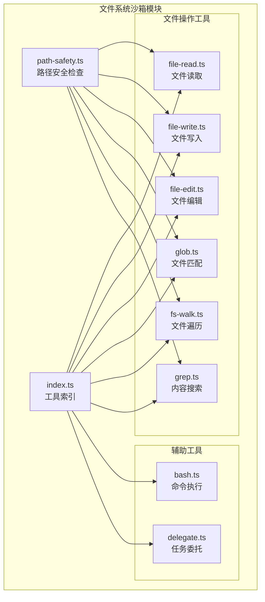
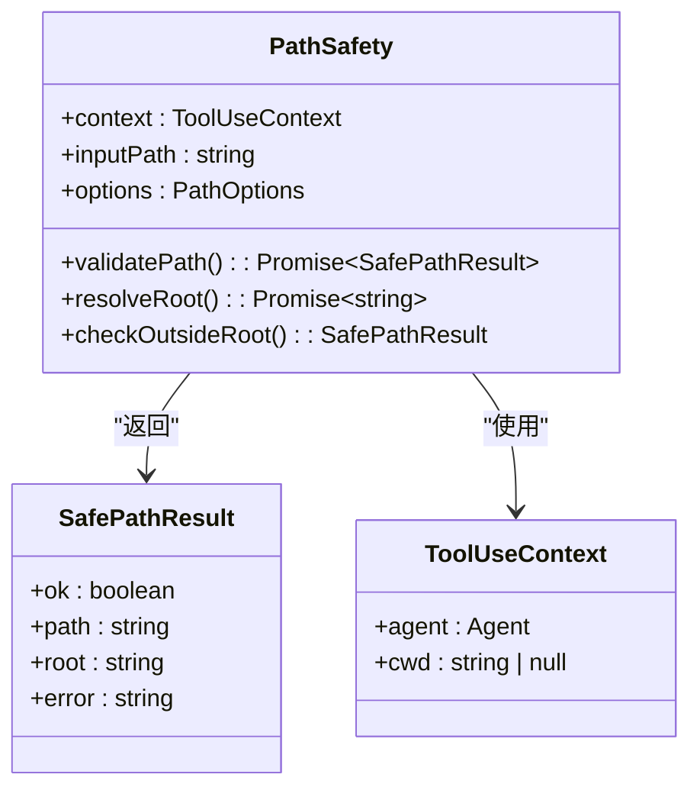
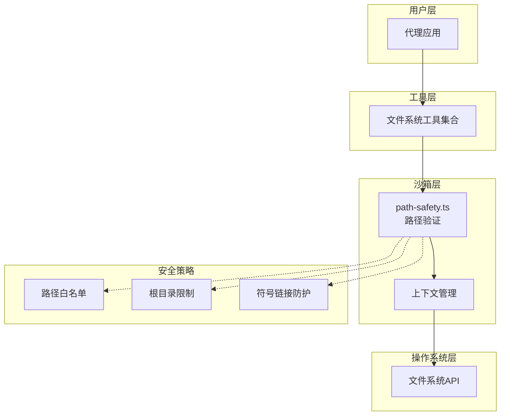
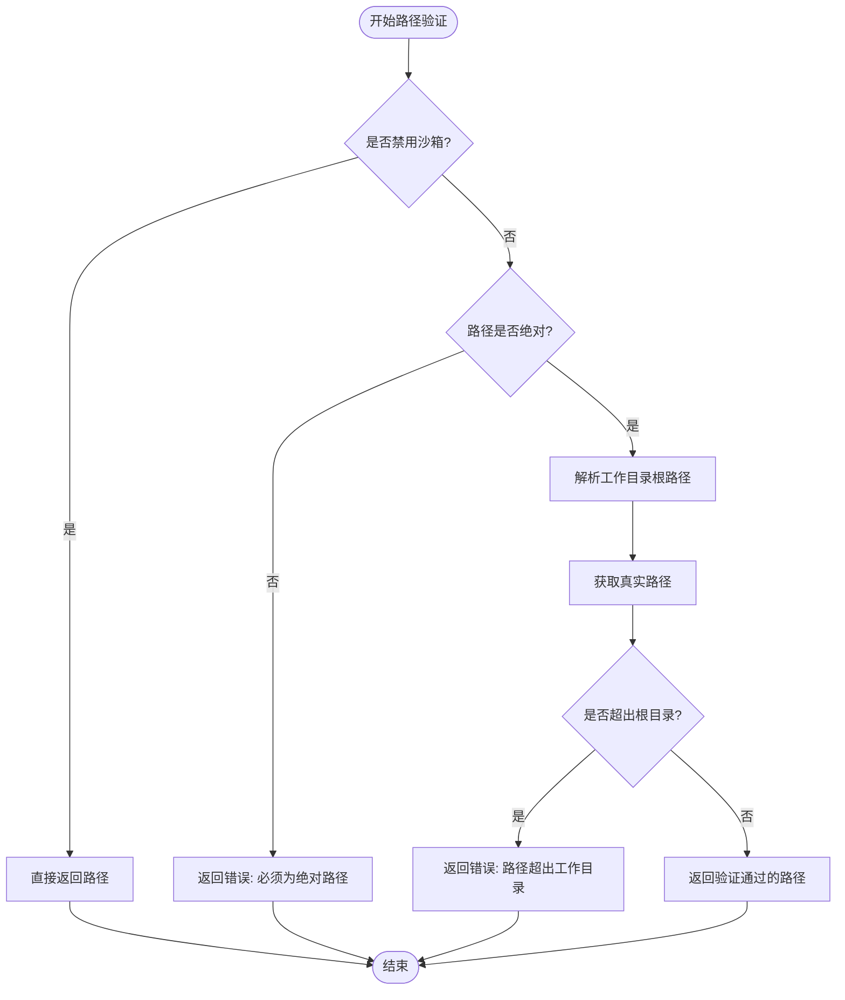
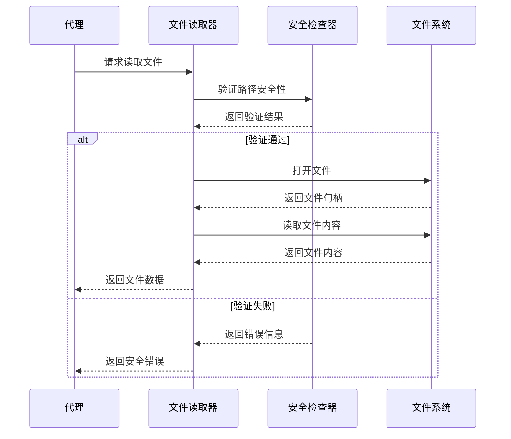
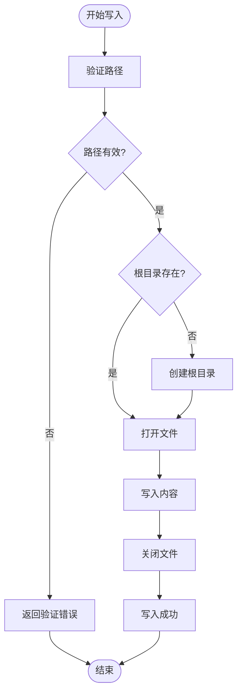
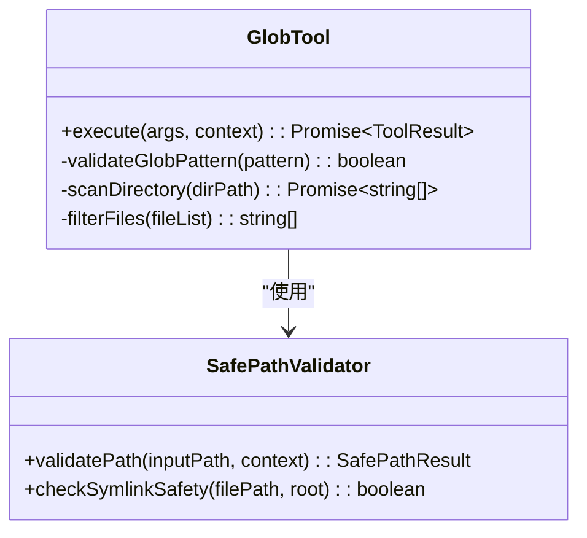
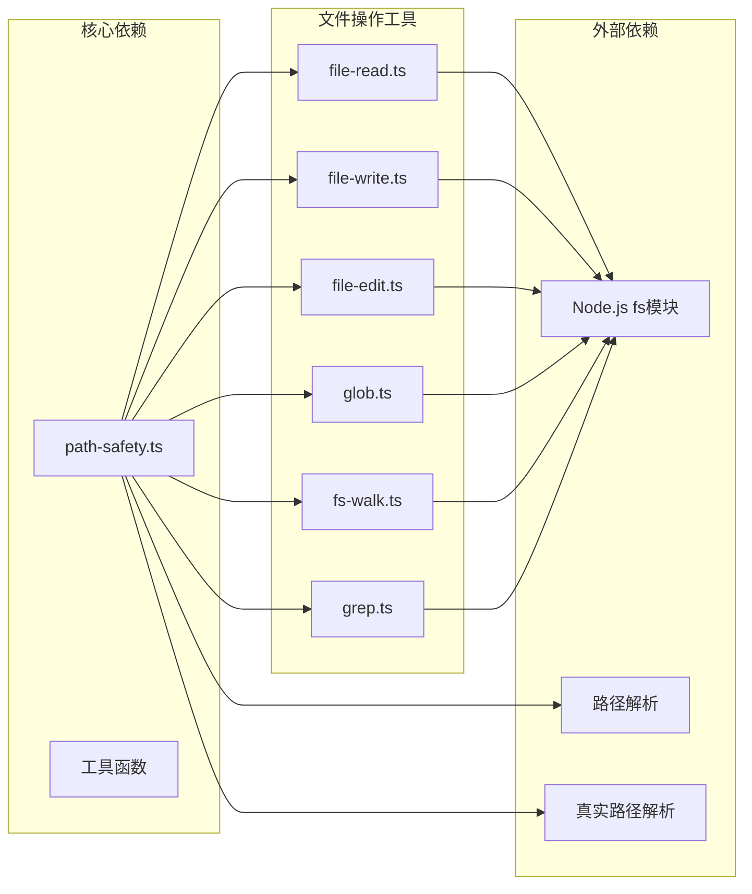

# 文件系统沙箱

<cite>
**本文档引用的文件**
- [path-safety.ts](file://src/tool/built-in/path-safety.ts)
- [built-in/index.ts](file://src/tool/built-in/index.ts)
- [built-in/file-read.ts](file://src/tool/built-in/file-read.ts)
- [built-in/file-write.ts](file://src/tool/built-in/file-write.ts)
- [built-in/glob.ts](file://src/tool/built-in/glob.ts)
- [built-in/fs-walk.ts](file://src/tool/built-in/fs-walk.ts)
- [built-in/bash.ts](file://src/tool/built-in/bash.ts)
- [built-in/grep.ts](file://src/tool/built-in/grep.ts)
- [built-in/file-edit.ts](file://src/tool/built-in/file-edit.ts)
- [built-in/delegate.ts](file://src/tool/built-in/delegate.ts)
- [built-in-tools.test.ts](file://tests/built-in-tools.test.ts)
</cite>

## 目录
1. [简介](#简介)
2. [项目结构](#项目结构)
3. [核心组件](#核心组件)
4. [架构概览](#架构概览)
5. [详细组件分析](#详细组件分析)
6. [依赖关系分析](#依赖关系分析)
7. [性能考虑](#性能考虑)
8. [故障排除指南](#故障排除指南)
9. [结论](#结论)

## 简介

文件系统沙箱是 Open Multi-Agent 项目中的一个关键安全机制，用于限制代理对主机文件系统的访问权限。该沙箱确保代理只能访问预定义的工作目录及其子目录，防止恶意或意外的文件系统操作。

沙箱的核心目标包括：
- 防止代理访问工作目录之外的文件
- 提供受控的文件系统操作接口
- 支持只读和读写两种模式
- 允许在特定情况下禁用沙箱保护

## 项目结构

文件系统沙箱主要位于 `src/tool/built-in/` 目录下，包含以下关键文件：

**图表来源**
- [path-safety.ts:1-150](file://src/tool/built-in/path-safety.ts#L1-L150)
- [built-in/index.ts:1-200](file://src/tool/built-in/index.ts#L1-L200)

**章节来源**
- [path-safety.ts:1-150](file://src/tool/built-in/path-safety.ts#L1-L150)
- [built-in/index.ts:1-200](file://src/tool/built-in/index.ts#L1-L200)

## 核心组件

### 路径安全检查器

路径安全检查器是沙箱的核心组件，负责验证所有文件系统操作的合法性。

**图表来源**
- [path-safety.ts:33-124](file://src/tool/built-in/path-safety.ts#L33-L124)

### 工具上下文管理

工具上下文决定了沙箱的行为模式：

- **启用沙箱** (`cwd !== null`): 严格限制文件访问范围
- **禁用沙箱** (`cwd === null`): 允许任意文件访问

**章节来源**
- [path-safety.ts:33-75](file://src/tool/built-in/path-safety.ts#L33-L75)

## 架构概览

文件系统沙箱采用分层架构设计，确保安全性与可用性的平衡：

**图表来源**
- [path-safety.ts:33-124](file://src/tool/built-in/path-safety.ts#L33-L124)
- [built-in/file-read.ts:1-200](file://src/tool/built-in/file-read.ts#L1-L200)
- [built-in/file-write.ts:1-200](file://src/tool/built-in/file-write.ts#L1-L200)

## 详细组件分析

### 路径验证流程

路径验证是沙箱安全性的关键环节，采用多层验证机制：

**图表来源**
- [path-safety.ts:33-124](file://src/tool/built-in/path-safety.ts#L33-L124)

### 文件读取工具

文件读取工具提供安全的文件访问能力：

**图表来源**
- [built-in/file-read.ts:1-200](file://src/tool/built-in/file-read.ts#L1-L200)
- [path-safety.ts:33-124](file://src/tool/built-in/path-safety.ts#L33-L124)

### 文件写入工具

文件写入工具支持自动创建工作目录：

**图表来源**
- [built-in/file-write.ts:1-200](file://src/tool/built-in/file-write.ts#L1-L200)
- [path-safety.ts:67-75](file://src/tool/built-in/path-safety.ts#L67-L75)

### 文件匹配工具

文件匹配工具提供安全的文件搜索功能：

**图表来源**
- [built-in/glob.ts:1-200](file://src/tool/built-in/glob.ts#L1-L200)
- [path-safety.ts:115-124](file://src/tool/built-in/path-safety.ts#L115-L124)

**章节来源**
- [built-in/file-read.ts:1-200](file://src/tool/built-in/file-read.ts#L1-L200)
- [built-in/file-write.ts:1-200](file://src/tool/built-in/file-write.ts#L1-L200)
- [built-in/glob.ts:1-200](file://src/tool/built-in/glob.ts#L1-L200)

## 依赖关系分析

文件系统沙箱的依赖关系体现了模块化设计的优势：

**图表来源**
- [path-safety.ts:1-150](file://src/tool/built-in/path-safety.ts#L1-L150)
- [built-in/file-read.ts:1-200](file://src/tool/built-in/file-read.ts#L1-L200)
- [built-in/file-write.ts:1-200](file://src/tool/built-in/file-write.ts#L1-L200)

**章节来源**
- [path-safety.ts:1-150](file://src/tool/built-in/path-safety.ts#L1-L150)
- [built-in/index.ts:1-200](file://src/tool/built-in/index.ts#L1-L200)

## 性能考虑

文件系统沙箱在保证安全性的同时，也考虑了性能优化：

### 缓存策略
- 路径解析结果缓存，避免重复计算
- 符号链接检查结果缓存
- 工作目录状态缓存

### 异步处理
- 所有文件系统操作采用异步模式
- 并发访问控制，防止资源竞争
- 超时机制，避免长时间阻塞

### 内存管理
- 大文件读取采用流式处理
- 及时释放文件句柄和内存
- 垃圾回收优化

## 故障排除指南

### 常见问题及解决方案

#### 路径验证错误
**症状**: 文件操作被拒绝，提示路径不在工作目录内
**原因**: 使用相对路径或访问超出工作目录的文件
**解决**: 
- 使用绝对路径
- 检查工作目录设置
- 调整 `cwd` 配置

#### 权限不足错误
**症状**: 文件写入失败，提示权限错误
**原因**: 工作目录不可写或权限不足
**解决**:
- 检查目录权限
- 确认目录存在性
- 联系系统管理员

#### 符号链接安全警告
**症状**: 符号链接访问被阻止
**原因**: 防护机制检测到潜在的安全风险
**解决**:
- 避免使用符号链接
- 使用相对路径替代
- 检查链接目标的安全性

**章节来源**
- [built-in-tools.test.ts:429-674](file://tests/built-in-tools.test.ts#L429-L674)

## 结论

文件系统沙箱为 Open Multi-Agent 项目提供了强大的安全保护机制。通过严格的路径验证、符号链接防护和工作目录限制，确保代理只能在受控环境中进行文件操作。

### 主要优势
- **安全性**: 有效防止越权文件访问
- **可控性**: 灵活的沙箱配置选项
- **兼容性**: 支持多种文件操作场景
- **可维护性**: 清晰的代码结构和测试覆盖

### 最佳实践
- 合理设置工作目录范围
- 定期审查文件访问日志
- 使用相对路径优先于绝对路径
- 在开发环境中谨慎使用沙箱禁用模式

文件系统沙箱的设计体现了现代软件安全工程的核心原则：在保证功能完整性的同时，最大化地提升系统的安全性。