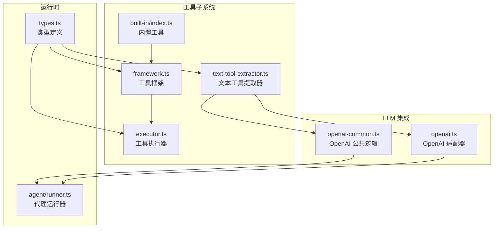
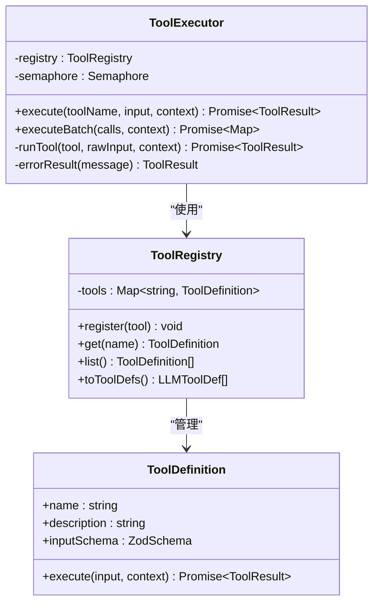
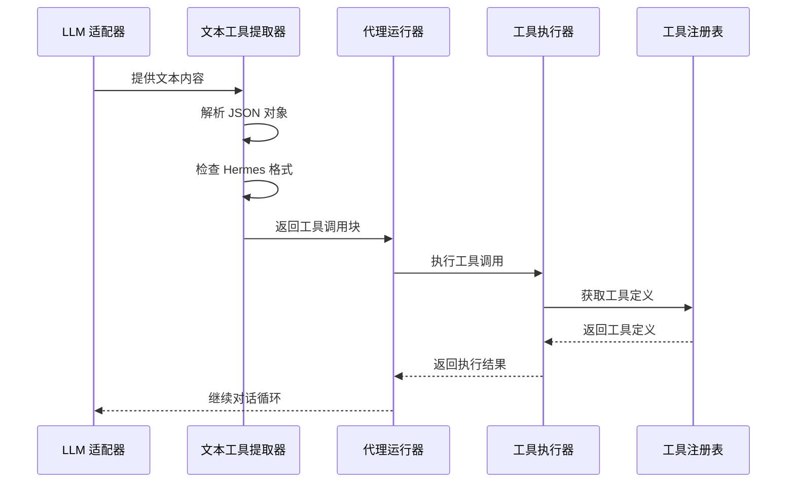
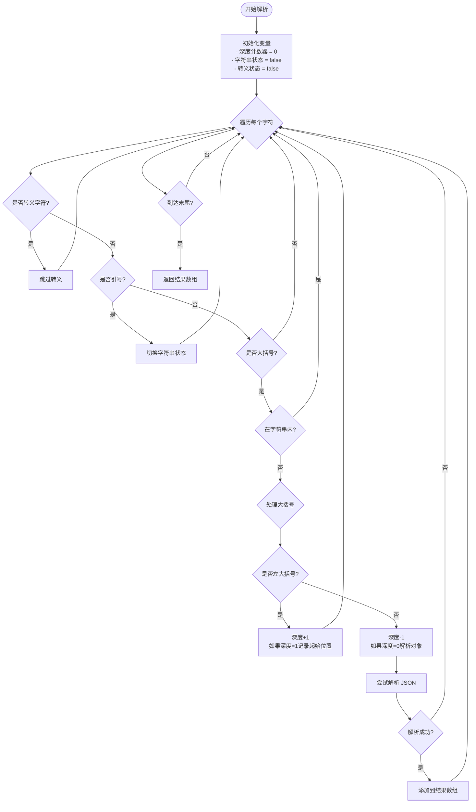
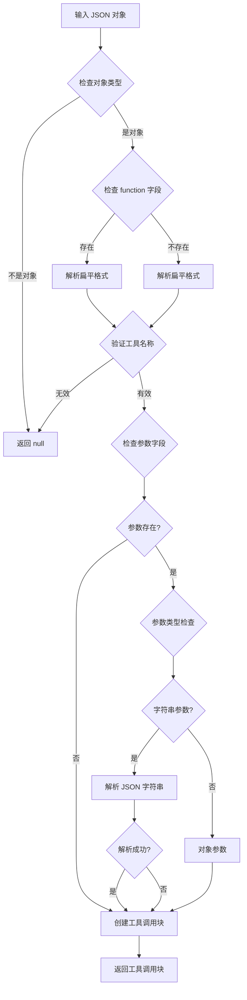
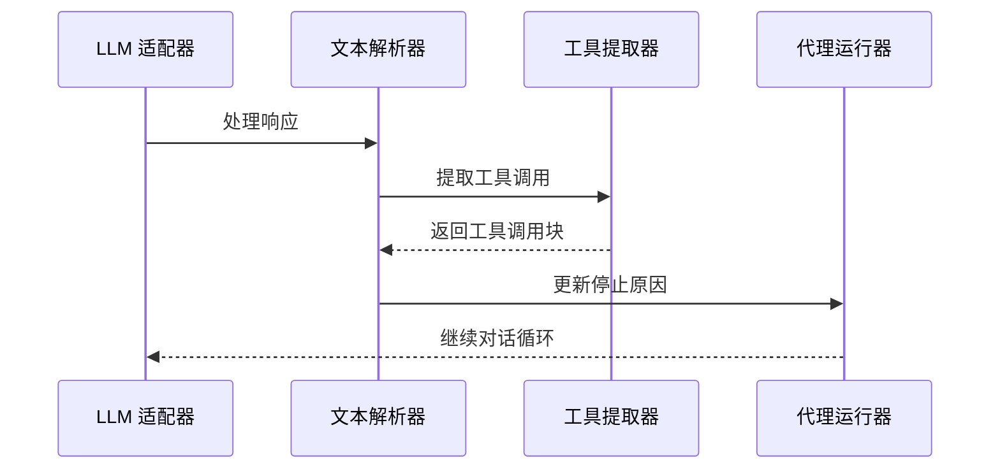
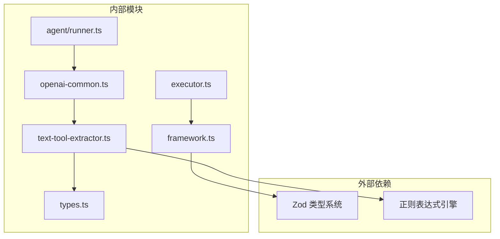
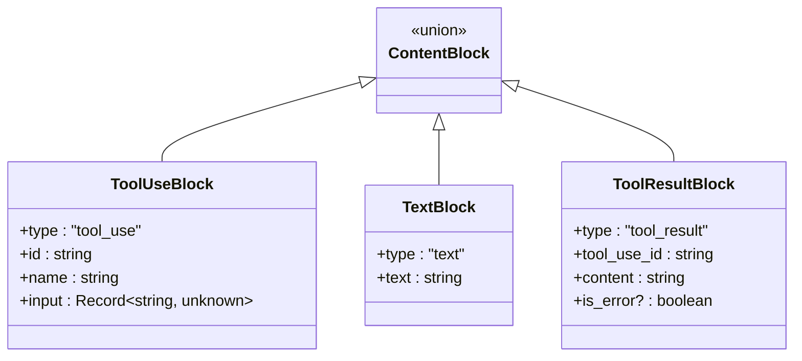
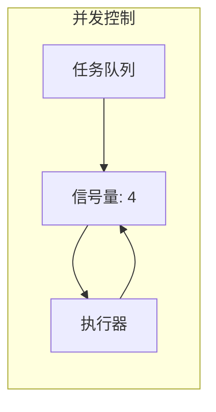

# 文本工具提取器

<cite>
**本文档引用的文件**
- [src/tool/text-tool-extractor.ts](file://src/tool/text-tool-extractor.ts)
- [tests/text-tool-extractor.test.ts](file://tests/text-tool-extractor.test.ts)
- [src/tool/executor.ts](file://src/tool/executor.ts)
- [src/tool/framework.ts](file://src/tool/framework.ts)
- [src/types.ts](file://src/types.ts)
- [src/llm/openai-common.ts](file://src/llm/openai-common.ts)
- [src/llm/openai.ts](file://src/llm/openai.ts)
- [src/agent/runner.ts](file://src/agent/runner.ts)
- [src/tool/built-in/index.ts](file://src/tool/built-in/index.ts)
- [tests/openai-adapter.test.ts](file://tests/openai-adapter.test.ts)
</cite>

## 目录
1. [简介](#简介)
2. [项目结构](#项目结构)
3. [核心组件](#核心组件)
4. [架构概览](#架构概览)
5. [详细组件分析](#详细组件分析)
6. [依赖关系分析](#依赖关系分析)
7. [性能考虑](#性能考虑)
8. [故障排除指南](#故障排除指南)
9. [结论](#结论)
10. [附录](#附录)

## 简介

文本工具提取器是 Open Multi-Agent 框架中的一个关键组件，专门用于从大型语言模型（LLM）返回的纯文本中识别和提取工具调用指令。当本地模型（如 Ollama、vLLM、LM Studio）无法正确生成标准的 OpenAI `tool_calls` 格式时，该提取器作为安全网发挥作用，确保工具调用能够被正确识别和执行。

该组件设计的核心理念是提供一个灵活的回退机制，支持多种工具调用格式：
- 原生 JSON 格式
- 自然语言格式
- 混合格式（JSON + 自然语言）

## 项目结构

文本工具提取器位于框架的工具子系统中，与工具注册表、工具执行器和 LLM 适配器紧密集成：

**图表来源**
- [src/tool/text-tool-extractor.ts:1-220](file://src/tool/text-tool-extractor.ts#L1-L220)
- [src/llm/openai-common.ts:220-255](file://src/llm/openai-common.ts#L220-L255)
- [src/agent/runner.ts:166-176](file://src/agent/runner.ts#L166-L176)

**章节来源**
- [src/tool/text-tool-extractor.ts:1-220](file://src/tool/text-tool-extractor.ts#L1-L220)
- [src/tool/framework.ts:1-558](file://src/tool/framework.ts#L1-L558)

## 核心组件

### 文本工具提取器主模块

文本工具提取器的核心功能由以下主要组件构成：

#### 主要导出函数
- `extractToolCallsFromText`: 主要的提取函数，接受文本输出和已知工具名称列表
- 内部解析器：处理不同格式的工具调用 JSON

#### 支持的工具调用格式
1. **标准 JSON 格式**
   - `{ "name": "tool_name", "arguments": { ... } }`
   - `{ "name": "tool_name", "parameters": { ... } }`
   - `{ "name": "tool_name", "input": { ... } }`
   - `{ "function": { "name": "tool_name", "arguments": { ... } } }`

2. **Hermes 格式**
   - 使用 `` 标签包裹的工具调用

3. **Markdown 代码块格式**
   - 包含 JSON 的代码块（支持带或不带语言标识符）

**章节来源**
- [src/tool/text-tool-extractor.ts:196-219](file://src/tool/text-tool-extractor.ts#L196-L219)
- [src/tool/text-tool-extractor.ts:35-98](file://src/tool/text-tool-extractor.ts#L35-L98)

### 工具执行器集成

工具执行器负责验证和执行从文本中提取的工具调用：

**图表来源**
- [src/tool/executor.ts:47-179](file://src/tool/executor.ts#L47-L179)
- [src/tool/framework.ts:93-203](file://src/tool/framework.ts#L93-L203)

**章节来源**
- [src/tool/executor.ts:47-179](file://src/tool/executor.ts#L47-L179)
- [src/tool/framework.ts:93-203](file://src/tool/framework.ts#L93-L203)

## 架构概览

文本工具提取器在整个系统架构中的位置如下：

**图表来源**
- [src/llm/openai-common.ts:231](file://src/llm/openai-common.ts#L231)
- [src/agent/runner.ts:135-137](file://src/agent/runner.ts#L135-L137)
- [src/tool/executor.ts:70-90](file://src/tool/executor.ts#L70-L90)

## 详细组件分析

### 文本工具提取器算法

#### JSON 对象提取算法

提取器使用深度跟踪算法来识别顶级 JSON 对象：

**图表来源**
- [src/tool/text-tool-extractor.ts:108-153](file://src/tool/text-tool-extractor.ts#L108-L153)

#### 工具调用解析流程

**图表来源**
- [src/tool/text-tool-extractor.ts:45-98](file://src/tool/text-tool-extractor.ts#L45-L98)

**章节来源**
- [src/tool/text-tool-extractor.ts:108-153](file://src/tool/text-tool-extractor.ts#L108-L153)
- [src/tool/text-tool-extractor.ts:45-98](file://src/tool/text-tool-extractor.ts#L45-L98)

### LLM 集成点

#### OpenAI 适配器集成

文本工具提取器在多个 LLM 适配器中被使用：

**图表来源**
- [src/llm/openai-common.ts:231](file://src/llm/openai-common.ts#L231)
- [src/llm/openai.ts:250](file://src/llm/openai.ts#L250)

**章节来源**
- [src/llm/openai-common.ts:220-255](file://src/llm/openai-common.ts#L220-L255)
- [src/llm/openai.ts:240-279](file://src/llm/openai.ts#L240-L279)

### 测试覆盖范围

测试套件全面覆盖了各种使用场景：

#### 支持的测试场景
- 空文本处理
- 无工具调用的普通文本
- 已知工具名称的白名单过滤
- 原生 JSON 工具调用（arguments/parameters/input）
- 函数嵌套格式
- Markdown 代码块包装
- Hermes 格式标签
- 错误处理和边界情况

**章节来源**
- [tests/text-tool-extractor.test.ts:1-171](file://tests/text-tool-extractor.test.ts#L1-L171)

## 依赖关系分析

### 组件间依赖关系

**图表来源**
- [src/tool/text-tool-extractor.ts:18](file://src/tool/text-tool-extractor.ts#L18)
- [src/tool/framework.ts:13](file://src/tool/framework.ts#L13)

### 类型系统集成

文本工具提取器与框架的类型系统紧密集成：

**图表来源**
- [src/types.ts:24-40](file://src/types.ts#L24-L40)

**章节来源**
- [src/types.ts:14-53](file://src/types.ts#L14-L53)

## 性能考虑

### 时间复杂度分析

- **JSON 对象提取**: O(n)，其中 n 是文本长度
- **Hermes 格式解析**: O(m)，其中 m 是匹配次数
- **整体复杂度**: O(n + m)

### 内存使用优化

- 使用流式解析避免一次性加载整个文本
- 只保留必要的中间结果
- 合理的错误处理避免内存泄漏

### 并发处理

工具执行器通过信号量控制并发，确保系统稳定性：

**图表来源**
- [src/tool/executor.ts:51-54](file://src/tool/executor.ts#L51-L54)

## 故障排除指南

### 常见问题及解决方案

#### 问题：提取器无法识别工具调用

**可能原因**:
1. 工具名称不在已知工具列表中
2. JSON 格式不符合预期
3. 文本包含多个 JSON 对象但不是工具调用

**解决方法**:
- 确保工具已在工具注册表中注册
- 检查 JSON 格式的正确性
- 验证工具调用的上下文环境

#### 问题：Hermes 格式标签未被识别

**可能原因**:
- 标签格式不正确
- 编码问题导致特殊字符无法识别

**解决方法**:
- 确保使用正确的 `