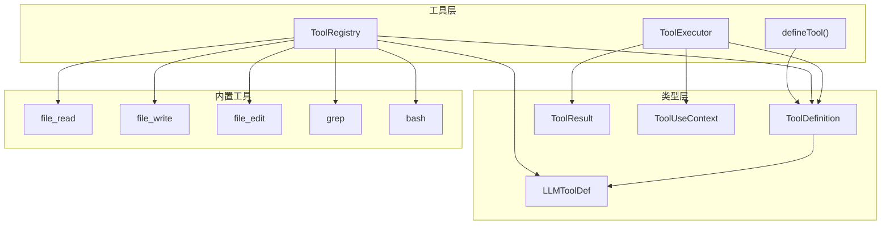
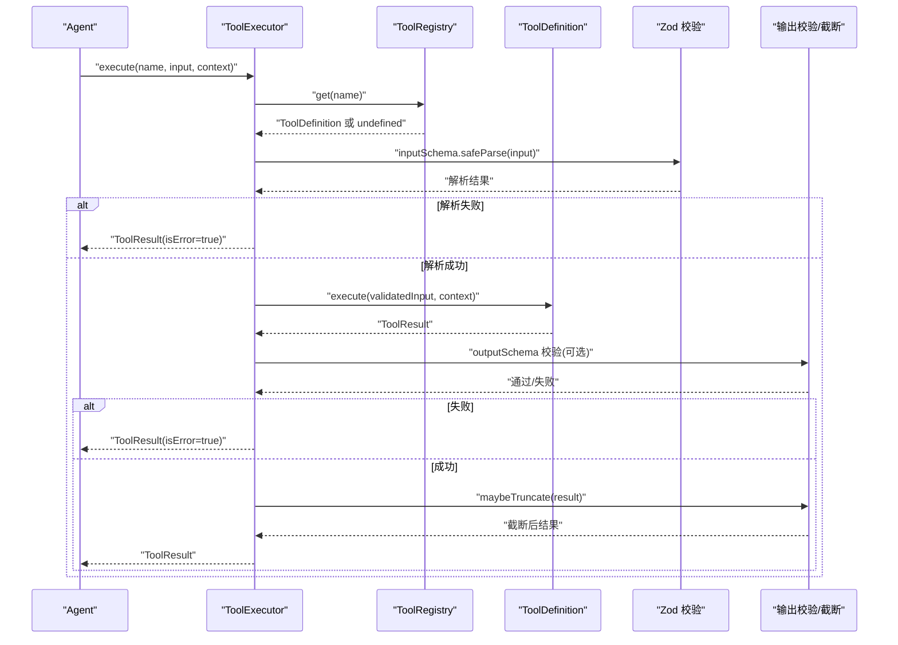
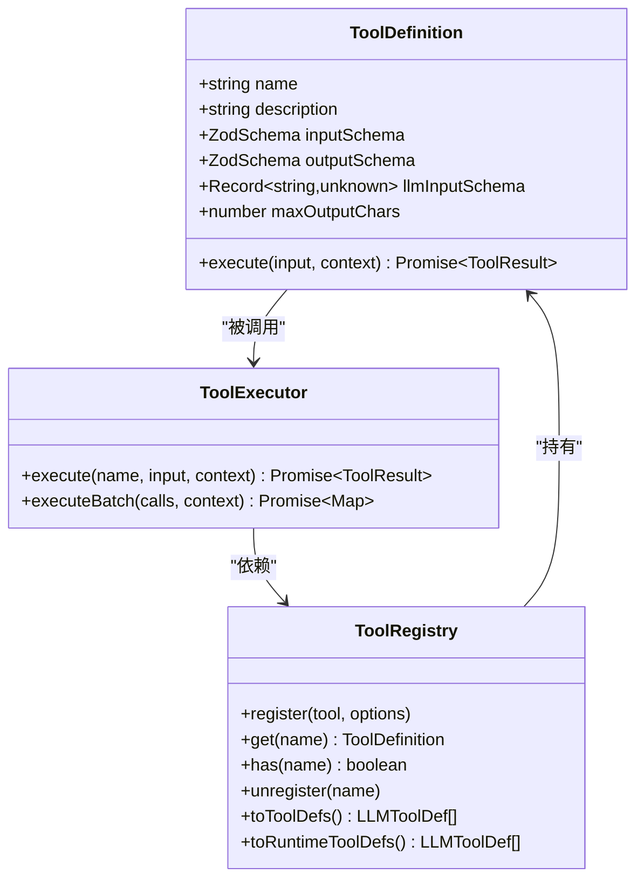

# 自定义工具开发

<cite>
**本文引用的文件列表**
- [src/tool/framework.ts](file://src/tool/framework.ts)
- [src/tool/executor.ts](file://src/tool/executor.ts)
- [src/types.ts](file://src/types.ts)
- [src/tool/built-in/index.ts](file://src/tool/built-in/index.ts)
- [src/tool/built-in/file-read.ts](file://src/tool/built-in/file-read.ts)
- [src/tool/built-in/grep.ts](file://src/tool/built-in/grep.ts)
- [src/tool/built-in/bash.ts](file://src/tool/built-in/bash.ts)
- [docs/tool-configuration.md](file://docs/tool-configuration.md)
- [tests/tool-executor.test.ts](file://tests/tool-executor.test.ts)
- [tests/built-in-tools.test.ts](file://tests/built-in-tools.test.ts)
</cite>

## 目录
1. [简介](#简介)
2. [项目结构与核心组件](#项目结构与核心组件)
3. [核心组件详解](#核心组件详解)
4. [架构总览](#架构总览)
5. [详细组件分析](#详细组件分析)
6. [依赖关系分析](#依赖关系分析)
7. [性能与并发特性](#性能与并发特性)
8. [安全与合规要点](#安全与合规要点)
9. [测试与调试指南](#测试与调试指南)
10. [结论](#结论)

## 简介
本指南面向在 Open Multi-Agent 框架中开发“自定义工具”的工程师与技术作者，系统讲解如何使用 defineTool() 定义工具、如何利用 Zod 类型系统进行输入/输出校验、如何编写健壮的工具执行函数（含异步、错误处理、结果格式化）、以及如何结合工具注册表与执行器完成端到端的工具生命周期管理。文档同时覆盖多种工具类型示例（数据处理、API 调用、文件操作、业务逻辑）与安全、测试、调试实践。

## 项目结构与核心组件
- 工具定义与注册
  - defineTool()：声明式定义工具，返回满足 ToolDefinition 接口的对象
  - ToolRegistry：工具注册表，负责工具的注册、查询、导出 LLM 可消费的 JSON Schema
- 执行与并发
  - ToolExecutor：批量/单次执行工具，内置 Zod 输入校验、输出校验、并发控制、超时/中断、截断
- 类型与契约
  - ToolDefinition、ToolResult、ToolUseContext、LLMToolDef 等类型统一于 types.ts
- 内置工具集合
  - 提供文件读写、搜索、命令执行等参考实现，便于对照学习

图表来源
- [src/tool/framework.ts:71-111](file://src/tool/framework.ts#L71-L111)
- [src/tool/executor.ts:54-63](file://src/tool/executor.ts#L54-L63)
- [src/types.ts:293-328](file://src/types.ts#L293-L328)
- [src/tool/built-in/index.ts:37-50](file://src/tool/built-in/index.ts#L37-L50)

章节来源
- [src/tool/framework.ts:1-111](file://src/tool/framework.ts#L1-L111)
- [src/tool/executor.ts:1-63](file://src/tool/executor.ts#L1-L63)
- [src/types.ts:193-328](file://src/types.ts#L193-L328)
- [src/tool/built-in/index.ts:1-75](file://src/tool/built-in/index.ts#L1-L75)

## 核心组件详解
- defineTool(config)
  - 必填字段：name、description、inputSchema、execute
  - 可选字段：outputSchema（对 ToolResult.data 的运行时校验）、llmInputSchema（绕过 Zod → JSON Schema 转换）、maxOutputChars（单工具输出长度上限）
  - 返回值：满足 ToolDefinition 接口的对象
- ToolRegistry
  - 注册/查询/注销工具；导出 LLMToolDef 数组或 Anthropic 风格 input_schema
  - 支持区分“运行时新增工具”以便按需过滤
- ToolExecutor
  - 单次执行与批量执行；并发控制（信号量）；输入/输出 Zod 校验；异常捕获转 ToolResult；输出截断
  - 支持 AbortSignal 中断；支持 per-tool 与 agent-level 输出长度限制

章节来源
- [src/tool/framework.ts:71-111](file://src/tool/framework.ts#L71-L111)
- [src/tool/framework.ts:121-254](file://src/tool/framework.ts#L121-L254)
- [src/tool/executor.ts:54-130](file://src/tool/executor.ts#L54-L130)
- [src/tool/executor.ts:147-189](file://src/tool/executor.ts#L147-L189)
- [src/types.ts:293-328](file://src/types.ts#L293-L328)

## 架构总览
下图展示从 Agent 到工具调用、再到结果回传的端到端流程，包含输入/输出校验、并发控制与截断策略。

图表来源
- [src/tool/executor.ts:79-99](file://src/tool/executor.ts#L79-L99)
- [src/tool/executor.ts:147-189](file://src/tool/executor.ts#L147-L189)
- [src/tool/framework.ts:94-110](file://src/tool/framework.ts#L94-L110)

## 详细组件分析

### defineTool() 与 ToolDefinition
- 设计要点
  - 使用 ZodSchema<TInput> 声明输入结构，自动转换为 LLM JSON Schema
  - 可选 outputSchema 对 ToolResult.data 进行运行时校验（字符串）
  - 可选 llmInputSchema 直接提供 LLM 侧 JSON Schema（适用于 MCP 等场景）
  - 可选 maxOutputChars 控制单工具输出长度
- 典型用途
  - 数据处理：输入为查询条件，输出为格式化文本
  - API 调用：输入为请求参数，输出为 JSON 字符串
  - 文件操作：输入为路径/范围，输出为文本片段
  - 业务逻辑：输入为业务参数，输出为结构化摘要

章节来源
- [src/tool/framework.ts:71-111](file://src/tool/framework.ts#L71-L111)
- [src/types.ts:293-328](file://src/types.ts#L293-L328)

### ToolRegistry：工具注册与导出
- 功能
  - 注册/查询/注销工具，避免重复命名
  - 导出 LLMToolDef（通用）与 Anthropic input_schema（兼容）
  - 区分运行时新增工具，便于按需过滤
- 使用建议
  - 在 Agent 初始化时集中注册工具
  - 对第三方工具（如 MCP）直接注入其 JSON Schema

章节来源
- [src/tool/framework.ts:121-254](file://src/tool/framework.ts#L121-L254)

### ToolExecutor：执行、并发与安全
- 执行流程
  - 输入校验（Zod）
  - 中断检查（AbortSignal）
  - 执行工具
  - 输出校验（可选）
  - 截断（优先级：per-tool > agent-level）
- 并发与隔离
  - 信号量控制最大并发
  - 批量执行时每个调用独立错误捕获，不互相影响
- 错误处理
  - 工具抛错统一转为 ToolResult(isError=true)
  - 输入/输出校验失败同样返回错误结果

章节来源
- [src/tool/executor.ts:54-130](file://src/tool/executor.ts#L54-L130)
- [src/tool/executor.ts:147-189](file://src/tool/executor.ts#L147-L189)
- [src/tool/executor.ts:210-229](file://src/tool/executor.ts#L210-L229)

### Zod 类型系统与 JSON Schema 转换
- 支持的 Zod 类型
  - 基元：string、number、boolean、null、bigint、date
  - 枚举：z.enum()、z.nativeEnum()
  - 容器：z.array()、z.object()、z.record()、z.tuple()
  - 可选/默认/可空：z.optional()、z.default()、z.nullable()
  - 联合/交叉/判别联合：z.union()、z.intersection()、z.discriminatedUnion()
  - 字面量/字面量效果：z.literal()、z.effects()
  - 任意/未知/从不：z.any()、z.unknown()、z.never()、z.void()
- 转换规则
  - convertZodType 将 Zod 结构递归映射为 JSON Schema
  - 不支持的类型降级为 “any”（仍为有效 JSON Schema）

章节来源
- [src/tool/framework.ts:273-485](file://src/tool/framework.ts#L273-L485)

### 工具执行函数编写规范
- 异步处理
  - execute 必须返回 Promise<ToolResult>
  - 长耗时任务应监听 context.abortSignal 实现可中断
- 错误处理
  - 工具内部异常会被捕获并转为 ToolResult(isError=true)
  - 建议显式返回错误结果，便于上层感知
- 结果格式化
  - ToolResult.data 为字符串；若需要结构化数据，请序列化为字符串
  - 使用 outputSchema 对输出进行约束（例如 JSON 合法性、字段存在性）

章节来源
- [src/tool/executor.ts:169-188](file://src/tool/executor.ts#L169-L188)
- [src/types.ts:286-291](file://src/types.ts#L286-L291)

### 多种类型工具示例

#### 数据处理工具（文件读取）
- 示例：file_read
  - 输入：path（必填）、offset（可选）、limit（可选）
  - 行为：读取文件内容，按行号编号输出；支持偏移与限制
  - 特点：错误友好提示、边界检查、截断提示
- 设计要点
  - 使用 z.object() 定义输入结构
  - 对异常进行捕获并返回 ToolResult(isError=true)
  - 输出为带行号的文本，适合大文件分段读取

章节来源
- [src/tool/built-in/file-read.ts:16-105](file://src/tool/built-in/file-read.ts#L16-L105)

#### API 调用工具（正则搜索）
- 示例：grep
  - 输入：pattern（必填）、path（可选，默认当前目录）、glob（可选）、maxResults（可选）
  - 行为：优先使用 ripgrep；不可用时回退 Node.js 递归搜索
  - 特点：支持 AbortSignal 中断、结果上限、跨平台兼容
- 设计要点
  - 正则编译前置，提前暴露无效模式
  - 并发安全：逐文件读取，及时检查中断
  - 结果格式化：文件名:行号:内容

章节来源
- [src/tool/built-in/grep.ts:28-99](file://src/tool/built-in/grep.ts#L28-L99)
- [src/tool/built-in/grep.ts:112-182](file://src/tool/built-in/grep.ts#L112-L182)
- [src/tool/built-in/grep.ts:194-262](file://src/tool/built-in/grep.ts#L194-L262)

#### 文件操作工具（命令执行）
- 示例：bash
  - 输入：command（必填）、timeout（可选）、cwd（可选）
  - 行为：非交互式 bash -c 执行命令，合并 stdout/stderr
  - 特点：超时控制、工作目录、退出码标注
- 设计要点
  - 子进程事件驱动收集输出
  - 统一输出格式，区分仅 stdout 与 stdout+stderr 场景
  - exitCode 非零即标记为错误

章节来源
- [src/tool/built-in/bash.ts:22-63](file://src/tool/built-in/bash.ts#L22-L63)
- [src/tool/built-in/bash.ts:84-154](file://src/tool/built-in/bash.ts#L84-L154)
- [src/tool/built-in/bash.ts:161-187](file://src/tool/built-in/bash.ts#L161-L187)

#### 业务逻辑工具（示例：天气查询）
- 示例：get_weather
  - 输入：city（必填）
  - 行为：调用外部服务获取天气并返回 JSON 字符串
  - 安全：使用 outputSchema 校验 JSON 结构
- 设计要点
  - 将复杂对象序列化为字符串
  - 使用 outputSchema 确保结构一致性
  - 错误路径返回 ToolResult(isError=true)

章节来源
- [docs/tool-configuration.md:55-67](file://docs/tool-configuration.md#L55-L67)
- [docs/tool-configuration.md:87-101](file://docs/tool-configuration.md#L87-L101)

## 依赖关系分析
- defineTool 依赖 ZodSchema，用于输入与输出校验
- ToolRegistry 依赖 ToolDefinition，导出 LLMToolDef
- ToolExecutor 依赖 ToolRegistry、ZodSchema、Semaphore，负责执行与并发
- 内置工具作为参考实现，展示输入/输出/错误处理最佳实践

图表来源
- [src/types.ts:293-328](file://src/types.ts#L293-L328)
- [src/tool/framework.ts:121-254](file://src/tool/framework.ts#L121-L254)
- [src/tool/executor.ts:54-130](file://src/tool/executor.ts#L54-L130)

章节来源
- [src/types.ts:293-328](file://src/types.ts#L293-L328)
- [src/tool/framework.ts:121-254](file://src/tool/framework.ts#L121-L254)
- [src/tool/executor.ts:54-130](file://src/tool/executor.ts#L54-L130)

## 性能与并发特性
- 并发控制
  - 默认最大并发为 4；可通过 ToolExecutorOptions.maxConcurrency 调整
  - 批量执行时每个调用在信号量内串行排队，避免资源争用
- 资源访问控制
  - 通过 AbortSignal 实现软中断；子进程/文件读取应定期检查中断状态
  - 输出长度限制与截断策略防止上下文膨胀
- I/O 优化
  - 大文件分段读取（offset/limit）
  - 搜索工具优先使用 ripgrep，回退 Node.js 实现

章节来源
- [src/tool/executor.ts:23-34](file://src/tool/executor.ts#L23-L34)
- [src/tool/executor.ts:114-130](file://src/tool/executor.ts#L114-L130)
- [src/tool/built-in/file-read.ts:24-44](file://src/tool/built-in/file-read.ts#L24-L44)
- [src/tool/built-in/grep.ts:83-99](file://src/tool/built-in/grep.ts#L83-L99)

## 安全与合规要点
- 输入验证
  - 使用 ZodSchema 对所有输入进行严格校验
  - 对外部输入（如文件路径、命令、URL）进行白名单/黑名单过滤
- 输出限制
  - 设置 per-tool 或 agent-level 的 maxOutputChars
  - 使用 truncateToolOutput 保留头尾并插入截断标记
- 资源访问控制
  - 限制工作目录与文件系统权限
  - 对命令执行工具设置超时与工作目录限制
- 错误隔离
  - 工具异常统一捕获为 ToolResult，避免异常泄漏
  - 输出校验失败也返回错误结果，防止污染 LLM 上下文

章节来源
- [src/tool/executor.ts:210-229](file://src/tool/executor.ts#L210-L229)
- [src/tool/executor.ts:171-178](file://src/tool/executor.ts#L171-L178)
- [src/tool/built-in/bash.ts:31-44](file://src/tool/built-in/bash.ts#L31-L44)
- [src/tool/built-in/file-read.ts:24-44](file://src/tool/built-in/file-read.ts#L24-L44)

## 测试与调试指南
- 单元测试
  - ToolExecutor：覆盖单次执行、批量执行、并发限制、错误捕获、中断
  - ToolRegistry：覆盖注册/查询/注销、导出 JSON Schema
  - 内置工具：覆盖文件读写、命令执行、搜索等场景
- 测试建议
  - 使用临时目录与最小化输入构造边界用例
  - 模拟 AbortSignal 触发，验证中断路径
  - 使用 outputSchema 验证输出结构，确保失败路径正确
- 调试技巧
  - 在工具执行前打印输入摘要（脱敏），执行后打印耗时
  - 对长输出启用截断，便于观察关键片段
  - 使用批量执行对比不同并发配置下的稳定性

章节来源
- [tests/tool-executor.test.ts:1-200](file://tests/tool-executor.test.ts#L1-L200)
- [tests/tool-executor.test.ts:227-264](file://tests/tool-executor.test.ts#L227-L264)
- [tests/built-in-tools.test.ts:1-200](file://tests/built-in-tools.test.ts#L1-L200)

## 结论
通过 defineTool() 与 ToolRegistry/ToolExecutor 的组合，Open Multi-Agent 框架提供了类型安全、可扩展、可测试且具备并发与安全控制的工具体系。开发者只需专注于业务逻辑与错误处理，其余由框架负责输入/输出校验、并发控制、中断与截断等横切关注点。建议在实际项目中：
- 明确输入/输出结构，充分利用 Zod 的丰富类型能力
- 为关键工具配置 outputSchema，确保输出质量
- 为长耗时任务实现 AbortSignal 支持，并设置合理的超时
- 通过单元测试覆盖正常/异常/边界场景，保障工具可靠性