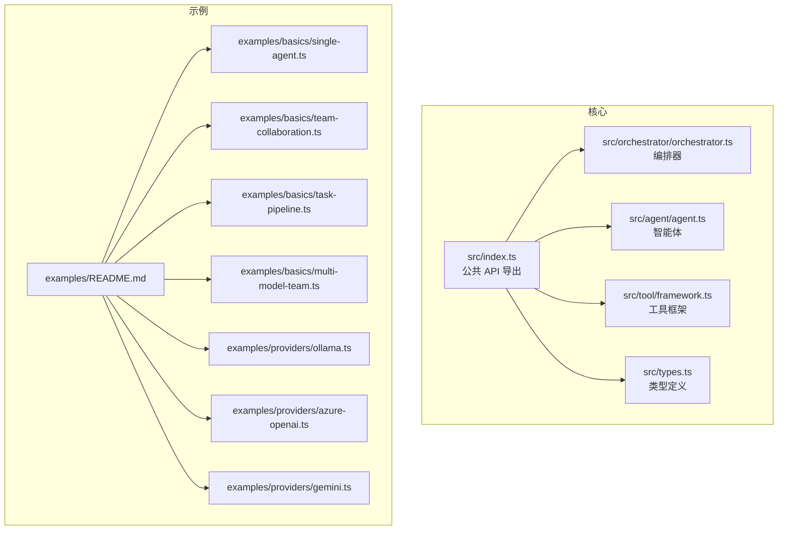
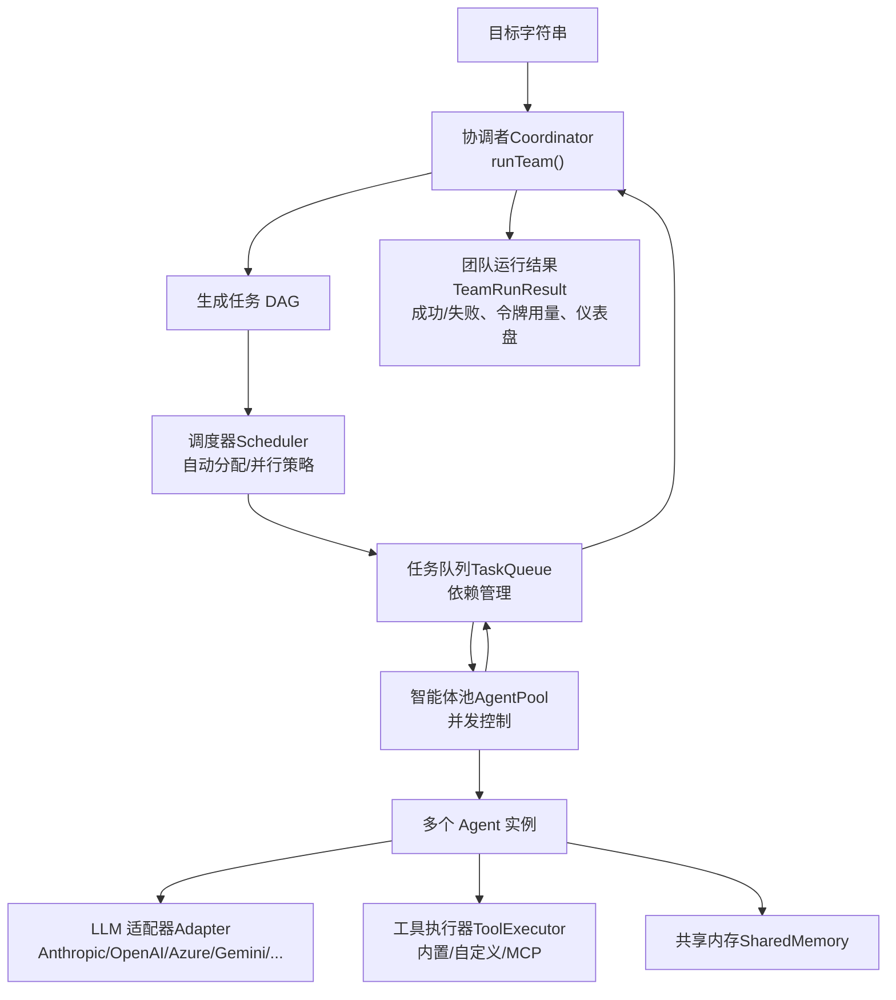
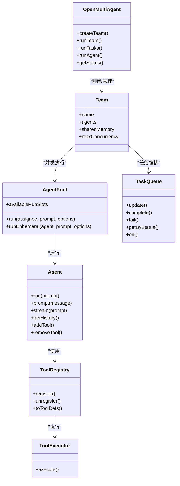

# 快速开始

<cite>
**本文引用的文件**
- [README.md](file://README.md)
- [package.json](file://package.json)
- [src/index.ts](file://src/index.ts)
- [src/orchestrator/orchestrator.ts](file://src/orchestrator/orchestrator.ts)
- [src/agent/agent.ts](file://src/agent/agent.ts)
- [src/tool/framework.ts](file://src/tool/framework.ts)
- [src/types.ts](file://src/types.ts)
- [examples/README.md](file://examples/README.md)
- [examples/basics/single-agent.ts](file://examples/basics/single-agent.ts)
- [examples/basics/team-collaboration.ts](file://examples/basics/team-collaboration.ts)
- [examples/basics/task-pipeline.ts](file://examples/basics/task-pipeline.ts)
- [examples/basics/multi-model-team.ts](file://examples/basics/multi-model-team.ts)
- [examples/providers/ollama.ts](file://examples/providers/ollama.ts)
- [examples/providers/azure-openai.ts](file://examples/providers/azure-openai.ts)
- [examples/providers/gemini.ts](file://examples/providers/gemini.ts)
</cite>

## 目录
1. [简介](#简介)
2. [项目结构](#项目结构)
3. [核心组件](#核心组件)
4. [架构总览](#架构总览)
5. [详细组件分析](#详细组件分析)
6. [依赖分析](#依赖分析)
7. [性能考虑](#性能考虑)
8. [故障排查指南](#故障排查指南)
9. [结论](#结论)
10. [附录](#附录)

## 简介
Open Multi-Agent 是一个 TypeScript 原生的多智能体编排框架，核心价值在于“从目标到任务 DAG 的自动分解与执行”。你只需给出一个目标（goal），框架会自动生成任务图（Task DAG），自动并行化独立任务，并在完成后合成最终结果。它提供三种运行模式：
- 单智能体对话：runAgent
- 自动编排团队：runTeam
- 显式任务管道：runTasks

同时支持多种模型提供商与本地模型（如 Ollama），并提供可观测性（进度事件、追踪、仪表盘）、共享内存、结构化输出、工具系统等能力。

## 项目结构
本仓库采用按功能分层的组织方式：
- 核心 API 与导出：src/index.ts
- 编排器与调度：src/orchestrator/*
- 智能体与运行循环：src/agent/*
- 工具系统：src/tool/*
- 类型定义：src/types.ts
- 示例与用例：examples/*

图表来源
- [src/index.ts:1-201](file://src/index.ts#L1-L201)
- [src/orchestrator/orchestrator.ts:1-120](file://src/orchestrator/orchestrator.ts#L1-L120)
- [src/agent/agent.ts:1-120](file://src/agent/agent.ts#L1-L120)
- [src/tool/framework.ts:1-120](file://src/tool/framework.ts#L1-L120)
- [src/types.ts:1-120](file://src/types.ts#L1-L120)
- [examples/README.md:1-100](file://examples/README.md#L1-L100)

章节来源
- [README.md:1-120](file://README.md#L1-L120)
- [examples/README.md:1-100](file://examples/README.md#L1-L100)

## 核心组件
- 公共 API 与导出：通过 src/index.ts 统一导出编排器、智能体、团队、任务、工具、适配器、内存、类型等，便于消费者直接从 '@open-multi-agent/core' 引入。
- 编排器（OpenMultiAgent）：负责将目标分解为任务、分配给智能体、并发执行、收集结果、生成仪表盘等。
- 智能体（Agent）：封装一次或多次对话、流式输出、工具调用、状态管理与钩子。
- 工具系统（ToolRegistry/defineTool）：声明式定义工具，支持 Zod 输入/输出校验、运行时注册、LLM JSON Schema 转换。
- 类型体系（types.ts）：统一定义消息、内容块、令牌用量、流事件、工具、智能体、团队、任务、编排器事件等。

章节来源
- [src/index.ts:50-201](file://src/index.ts#L50-L201)
- [src/orchestrator/orchestrator.ts:1-120](file://src/orchestrator/orchestrator.ts#L1-L120)
- [src/agent/agent.ts:1-120](file://src/agent/agent.ts#L1-L120)
- [src/tool/framework.ts:1-120](file://src/tool/framework.ts#L1-L120)
- [src/types.ts:1-200](file://src/types.ts#L1-L200)

## 架构总览
下图展示了从目标到任务 DAG 再到执行与结果合成的整体流程，以及各子系统的交互关系。

图表来源
- [src/orchestrator/orchestrator.ts:560-800](file://src/orchestrator/orchestrator.ts#L560-L800)
- [src/agent/agent.ts:139-191](file://src/agent/agent.ts#L139-L191)
- [src/tool/framework.ts:115-255](file://src/tool/framework.ts#L115-L255)
- [src/types.ts:608-730](file://src/types.ts#L608-L730)

## 详细组件分析

### 运行模式与示例

#### 单智能体对话（runAgent）
- 适用场景：一次性任务、不需要团队协作。
- 关键点：通过 OpenMultiAgent.runAgent() 快速执行；也可使用 Agent 类进行流式输出与多轮对话。
- 示例路径：[examples/basics/single-agent.ts:1-134](file://examples/basics/single-agent.ts#L1-L134)

预期行为要点
- onProgress 回调可观察 agent_start/agent_complete 事件。
- 流式输出可通过 Agent.stream() 获取增量文本。
- 多轮对话可用 Agent.prompt() 维持历史上下文。

章节来源
- [examples/basics/single-agent.ts:1-134](file://examples/basics/single-agent.ts#L1-L134)
- [src/agent/agent.ts:240-251](file://src/agent/agent.ts#L240-L251)

#### 自动编排团队（runTeam）
- 适用场景：给出目标，由协调者自动分解为任务 DAG 并执行。
- 关键点：支持计划预览（planOnly）、注入团队上下文（revealCoordinator）、令牌预算、重试、环路检测等。
- 示例路径：[examples/basics/team-collaboration.ts:1-168](file://examples/basics/team-collaboration.ts#L1-L168)

预期行为要点
- onProgress 展示 task_start/task_complete/agent_start/agent_complete/error 等事件。
- 可选开启 revealCoordinator 将目标、名单、角色注入每个工作提示词。
- 支持 onApproval 审批门控，控制批次间继续执行。

章节来源
- [examples/basics/team-collaboration.ts:1-168](file://examples/basics/team-collaboration.ts#L1-L168)
- [src/orchestrator/orchestrator.ts:560-800](file://src/orchestrator/orchestrator.ts#L560-L800)

#### 显式任务管道（runTasks）
- 适用场景：你已设计好任务图与依赖，直接让框架执行。
- 关键点：显式指定任务 ID、描述、分配人、依赖、记忆范围、重试参数等。
- 示例路径：[examples/basics/task-pipeline.ts:1-208](file://examples/basics/task-pipeline.ts#L1-L208)

预期行为要点
- 依赖阻塞/解阻：下游任务在上游完成后自动解封。
- 任务级重试：maxRetries/retryDelayMs/retryBackoff 生效。
- 内存作用域：memoryScope='dependencies' 或 'all' 控制上下文注入范围。

章节来源
- [examples/basics/task-pipeline.ts:1-208](file://examples/basics/task-pipeline.ts#L1-L208)
- [src/types.ts:704-730](file://src/types.ts#L704-L730)

### 创建智能体团队与配置工具
- 创建团队：使用 OpenMultiAgent.createTeam() 注册多个 AgentConfig，并启用共享内存。
- 配置工具：通过 defineTool() 定义自定义工具，结合 Zod 输入/输出校验；在 Agent 构造时注入 ToolRegistry/ToolExecutor。
- 示例路径：[examples/basics/multi-model-team.ts:1-262](file://examples/basics/multi-model-team.ts#L1-L262)

章节来源
- [examples/basics/multi-model-team.ts:1-262](file://examples/basics/multi-model-team.ts#L1-L262)
- [src/tool/framework.ts:50-120](file://src/tool/framework.ts#L50-L120)

### 流式响应处理
- 使用 Agent.stream() 获取流事件（text、reasoning、tool_use、tool_result、done、error）。
- 在 runTeam/runTasks 中可通过 onAgentStream 接收每个代理的流事件，用于实时渲染或日志记录。
- 示例路径：[examples/basics/single-agent.ts:67-104](file://examples/basics/single-agent.ts#L67-L104)

章节来源
- [examples/basics/single-agent.ts:67-104](file://examples/basics/single-agent.ts#L67-L104)
- [src/agent/agent.ts:522-572](file://src/agent/agent.ts#L522-L572)
- [src/orchestrator/orchestrator.ts:668-702](file://src/orchestrator/orchestrator.ts#L668-L702)

### 本地模型与托管提供商配置

#### 本地模型（Ollama）
- 通过 provider: 'openai' + baseURL 指向 Ollama 的 OpenAI 兼容端点实现本地推理。
- 示例路径：[examples/providers/ollama.ts:1-201](file://examples/providers/ollama.ts#L1-L201)

章节来源
- [examples/providers/ollama.ts:1-201](file://examples/providers/ollama.ts#L1-L201)

#### 托管提供商（Azure OpenAI、Google Gemini 等）
- Azure OpenAI：设置 defaultProvider 与必要环境变量，模型字段填入部署名称。
  - 示例路径：[examples/providers/azure-openai.ts:1-180](file://examples/providers/azure-openai.ts#L1-L180)
- Google Gemini：安装 @google/genai 后设置 GEMINI_API_KEY。
  - 示例路径：[examples/providers/gemini.ts:1-162](file://examples/providers/gemini.ts#L1-L162)

章节来源
- [examples/providers/azure-openai.ts:1-180](file://examples/providers/azure-openai.ts#L1-L180)
- [examples/providers/gemini.ts:1-162](file://examples/providers/gemini.ts#L1-L162)

### 代码级类关系图（编排器、智能体、工具）

图表来源
- [src/orchestrator/orchestrator.ts:1-120](file://src/orchestrator/orchestrator.ts#L1-L120)
- [src/agent/agent.ts:94-191](file://src/agent/agent.ts#L94-L191)
- [src/tool/framework.ts:115-255](file://src/tool/framework.ts#L115-L255)
- [src/types.ts:608-730](file://src/types.ts#L608-L730)

## 依赖分析
- 运行时依赖（最小三依赖）：@anthropic-ai/sdk、openai、zod
- 可选依赖（按需）：@aws-sdk/client-bedrock-runtime、@google/genai、@modelcontextprotocol/sdk、ai
- Node.js 版本要求：>= 18

章节来源
- [package.json:69-93](file://package.json#L69-L93)

## 性能考虑
- 并发与吞吐：通过 maxConcurrency 控制并发度，避免资源争用。
- 令牌预算：在 OrchestratorConfig 与 AgentConfig 上设置 maxTokenBudget，防止超支。
- 重试与退避：runTasks 中可为任务配置 maxRetries/retryDelayMs/retryBackoff。
- 环路检测：启用 loopDetection 防止代理陷入重复循环。
- 工具输出压缩：compressToolResults 减少上下文膨胀。
- 本地模型超时：为慢速本地模型设置 timeoutMs。

章节来源
- [src/types.ts:537-567](file://src/types.ts#L537-L567)
- [src/orchestrator/orchestrator.ts:266-333](file://src/orchestrator/orchestrator.ts#L266-L333)
- [src/agent/agent.ts:354-409](file://src/agent/agent.ts#L354-L409)

## 故障排查指南
常见问题与定位建议
- API Key 未设置或错误：检查对应提供商的环境变量是否正确（如 ANTHROPIC_API_KEY、GEMINI_API_KEY、AZURE_OPENAI_* 等）。
- 本地模型无法连接：确认 Ollama 服务运行、baseURL 正确、模型已拉取。
- 令牌超支：检查 maxTokenBudget 设置与 onProgress 中的 budget_exceeded 事件。
- 任务卡住：查看 onProgress 中的 task_retry 与 error 事件，检查依赖链与工具输出。
- 流式异常：在 onAgentStream/onProgress 中捕获 error 事件，定位具体代理与任务。

章节来源
- [examples/providers/ollama.ts:16-23](file://examples/providers/ollama.ts#L16-L23)
- [examples/providers/azure-openai.ts:10-16](file://examples/providers/azure-openai.ts#L10-L16)
- [examples/providers/gemini.ts:11-15](file://examples/providers/gemini.ts#L11-L15)
- [src/orchestrator/orchestrator.ts:748-784](file://src/orchestrator/orchestrator.ts#L748-L784)

## 结论
Open Multi-Agent 以“目标驱动”的协调者为核心，将复杂任务自动分解为可并行的任务 DAG，并通过统一的工具与可观测性接口，帮助你在 TypeScript 后端中快速构建稳定、可扩展的多智能体工作流。配合丰富的示例与多提供商适配，你可以从单智能体起步，逐步过渡到团队协作与显式任务编排，并在生产环境中通过预算、重试、环路检测与追踪等机制保障稳定性。

## 附录

### 快速开始步骤
- 安装
  - npm install @open-multi-agent/core
- 基本配置
  - 设置提供商 API Key（如 ANTHROPIC_API_KEY）
  - 如需本地模型，确保 Ollama 运行并设置 baseURL
- 运行示例
  - npx tsx examples/basics/team-collaboration.ts
  - npx tsx examples/basics/task-pipeline.ts
  - npx tsx examples/basics/single-agent.ts
  - npx tsx examples/providers/ollama.ts
  - npx tsx examples/providers/azure-openai.ts
  - npx tsx examples/providers/gemini.ts

章节来源
- [README.md:47-129](file://README.md#L47-L129)
- [examples/README.md:1-100](file://examples/README.md#L1-L100)