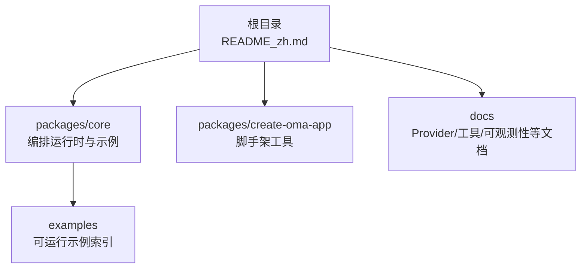
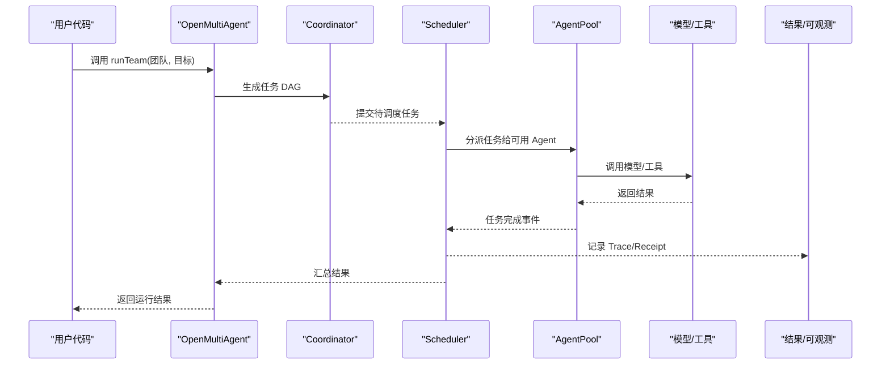
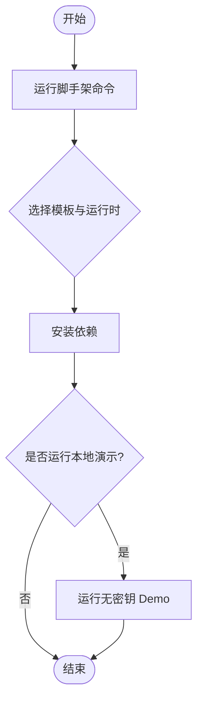
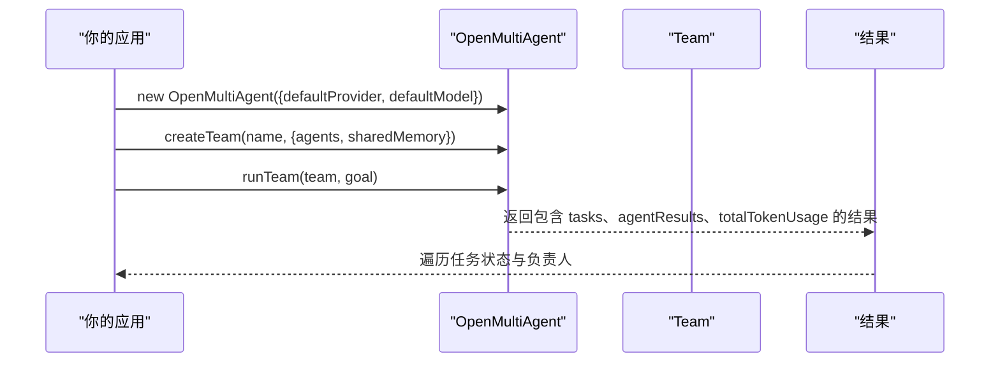
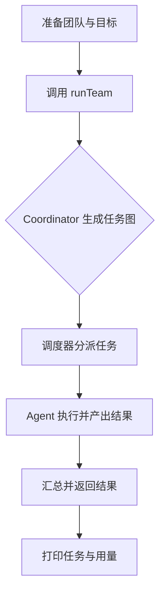
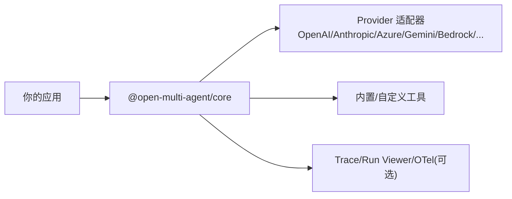

# 快速开始

<cite>
**本文引用的文件**
- [README_zh.md](file://README_zh.md)
- [packages/core/README.md](file://packages/core/README.md)
- [packages/create-oma-app/README.md](file://packages/create-oma-app/README.md)
- [docs/providers.md](file://docs/providers.md)
- [packages/core/examples/README.md](file://packages/core/examples/README.md)
</cite>

## 目录
1. [简介](#简介)
2. [项目结构](#项目结构)
3. [核心组件](#核心组件)
4. [架构总览](#架构总览)
5. [详细组件分析](#详细组件分析)
6. [依赖分析](#依赖分析)
7. [性能注意事项](#性能注意事项)
8. [故障排除指南](#故障排除指南)
9. [结论](#结论)
10. [附录](#附录)

## 简介
本快速开始指南帮助你从零搭建 Open Multi-Agent（OMA）环境，完成安装、配置与运行第一个多智能体应用。你将学会：
- 使用 create-oma-app 脚手架创建项目并运行免密钥本地演示
- 将 OMA 手动集成到现有后端
- 使用 runTeam() 实现团队协作
- 配置模型提供商与 API 密钥
- 排查常见问题并获得可运行的输出说明

## 项目结构
仓库采用 monorepo 组织，核心能力集中在 packages/core，脚手架工具在 packages/create-oma-app，文档位于 docs。根级 README_zh.md 提供中文入口与快速开始指引。

**图表来源**
- [README_zh.md:48-96](file://README_zh.md#L48-L96)
- [packages/core/README.md:57-101](file://packages/core/README.md#L57-L101)
- [packages/create-oma-app/README.md:10-32](file://packages/create-oma-app/README.md#L10-L32)
- [packages/core/examples/README.md:15-26](file://packages/core/examples/README.md#L15-L26)

**章节来源**
- [README_zh.md:48-96](file://README_zh.md#L48-L96)
- [packages/core/README.md:57-101](file://packages/core/README.md#L57-L101)
- [packages/create-oma-app/README.md:10-32](file://packages/create-oma-app/README.md#L10-L32)
- [packages/core/examples/README.md:15-26](file://packages/core/examples/README.md#L15-L26)

## 核心组件
- OpenMultiAgent：编排器，负责协调任务规划、调度、执行与结果聚合。
- Team：由多个 Agent 组成的团队，支持共享记忆、治理意图、路由策略等。
- 执行模式：runAgent（单智能体）、runTeam（自动编排团队）、runTasks（显式流水线）。
- Provider：统一接入多种模型服务（OpenAI、Anthropic、Azure、Gemini、Bedrock、Ollama 等）。
- 可观测性：Trace、Run Viewer、可选 OTel 集成。

**章节来源**
- [packages/core/README.md:103-111](file://packages/core/README.md#L103-L111)
- [packages/core/README.md:224-235](file://packages/core/README.md#L224-L235)
- [packages/core/README.md:273-286](file://packages/core/README.md#L273-L286)

## 架构总览
下图展示了从目标到任务图、调度、执行与结果的端到端流程，以及共享记忆、检查点与可观测性的关系。

**图表来源**
- [packages/core/README.md:237-252](file://packages/core/README.md#L237-L252)

## 详细组件分析

### 使用 create-oma-app 创建项目（推荐新手）
- 环境要求：Node.js 20+（推荐 22 或 24）。
- 一键初始化：通过交互式命令选择 starter 与 runtime，自动安装依赖并运行确定性本地 Demo。Demo 无需 API Key，也不会发起模型请求，但会真实驱动 OMA 的调度、聚合与离线 Dashboard。
- 常用参数：--no-install（仅生成文件）、--no-run（安装但不运行 demo）。
- 启动真实模型运行：复制 .env.example 为 .env，填入密钥与模型配置后运行开发脚本；或使用 Ollama 本地模型。

**图表来源**
- [packages/create-oma-app/README.md:10-32](file://packages/create-oma-app/README.md#L10-L32)

**章节来源**
- [packages/create-oma-app/README.md:10-32](file://packages/create-oma-app/README.md#L10-L32)

### 手动集成到现有应用
- 安装核心包。
- 初始化编排器并设置默认 provider 与 model。
- 定义团队与 Agent，启用共享记忆。
- 调用 runTeam() 传入目标，框架会在运行时生成任务图并执行。
- 读取结果中的任务列表、各 Agent 输出与 token 用量。

**图表来源**
- [README_zh.md:66-94](file://README_zh.md#L66-L94)
- [packages/core/README.md:76-99](file://packages/core/README.md#L76-L99)

**章节来源**
- [README_zh.md:66-94](file://README_zh.md#L66-L94)
- [packages/core/README.md:76-99](file://packages/core/README.md#L76-L99)

### 基础团队协作示例（runTeam）
- 目标：让 Coordinator 根据目标自动生成任务图，分配角色并合成结果。
- 关键步骤：
  - 设置默认 provider 与 model。
  - 定义 agents（如研究员、分析师），开启 sharedMemory。
  - 调用 runTeam 并打印任务执行结果与 token 用量。
- 输出说明：
  - 每个任务的状态、标题、负责人与依赖。
  - coordinator 的最终输出。
  - 本次运行的 totalTokenUsage。

**图表来源**
- [README_zh.md:66-94](file://README_zh.md#L66-L94)
- [packages/core/README.md:103-111](file://packages/core/README.md#L103-L111)

**章节来源**
- [README_zh.md:66-94](file://README_zh.md#L66-L94)
- [packages/core/README.md:103-111](file://packages/core/README.md#L103-L111)

### 基本配置选项
- 模型提供商与密钥：
  - OpenAI：provider 设为 openai，设置 OPENAI_API_KEY。
  - Anthropic：provider 设为 anthropic，设置 ANTHROPIC_API_KEY。
  - Azure OpenAI：设置 AZURE_OPENAI_API_KEY、AZURE_OPENAI_ENDPOINT（可选版本与部署名）。
  - Gemini：provider 设为 gemini，设置 GEMINI_API_KEY。
  - Bedrock：通过 AWS SDK 凭证链，设置 AWS_REGION。
  - OpenAI 兼容端点（Ollama/vLLM/LM Studio/OpenRouter/Groq/Mistral/Qwen/Zhipu/Moonshot 等）：provider 设为 openai，配置 baseURL 与 apiKey。
- 其他：
  - 推理/思考：thinking 配置映射到各 provider 的原生推理设置。
  - 预算控制：maxTokenBudget、maxCostBudget + estimateCost。
  - 调度策略：schedulingStrategy（dependency-first、round-robin、least-busy、capability-match、composite）。
  - 结构化输入：支持 LLMMessage[] 与图片块。

**章节来源**
- [docs/providers.md:20-63](file://docs/providers.md#L20-L63)
- [docs/providers.md:70-109](file://docs/providers.md#L70-L109)
- [docs/providers.md:136-179](file://docs/providers.md#L136-L179)
- [packages/core/README.md:187-222](file://packages/core/README.md#L187-L222)
- [packages/core/README.md:113-147](file://packages/core/README.md#L113-L147)

### 可运行示例与下一步
- 建议先阅读 basics 下的示例，理解三种执行模式与输入形状。
- 按需求选择 providers、patterns、cookbook 与 integrations 示例继续深入。

**章节来源**
- [packages/core/examples/README.md:15-26](file://packages/core/examples/README.md#L15-L26)
- [packages/core/examples/README.md:27-116](file://packages/core/examples/README.md#L27-L116)

## 依赖分析
- 运行时：Node.js 20+（推荐 22/24）。
- 核心包：@open-multi-agent/core。
- 可选集成：@open-multi-agent/otel（企业级 OTel 集成）。
- 第三方 SDK：按需懒加载（如 @google/genai、@aws-sdk/client-bedrock-runtime、ai 与 @ai-sdk/*）。

**图表来源**
- [packages/core/README.md:273-286](file://packages/core/README.md#L273-L286)
- [packages/core/README.md:310-316](file://packages/core/README.md#L310-L316)

**章节来源**
- [packages/core/README.md:273-286](file://packages/core/README.md#L273-L286)
- [packages/core/README.md:310-316](file://packages/core/README.md#L310-L316)

## 性能注意事项
- 预算与边界：通过 maxTurns、timeoutMs、callTimeoutMs、contextStrategy、loopDetection 限制工作范围；通过 maxTokenBudget 与 maxCostBudget + estimateCost 控制成本。
- 工具安全：内置工具默认拒绝，谨慎授予读写权限；注意 shell 工具非沙箱。
- 可观测性：使用 Trace、Run Viewer 或 OTel 进行定位与分析。
- 调度策略：根据任务依赖与负载选择合适的 schedulingStrategy。

**章节来源**
- [packages/core/README.md:288-308](file://packages/core/README.md#L288-L308)

## 故障排除指南
- 无法调用工具：确认所选模型具备工具调用能力（例如 Ollama 的 Tools 分类）。
- Ollama 相关问题：升级到最新版本，必要时设置 no_proxy 避免代理干扰。
- 本地推理慢：为 AgentConfig 设置 timeoutMs；对量化 MoE 模型调整 topK、minP、frequencyPenalty、presencePenalty、parallelToolCalls 与 extraBody 等采样参数。
- 预算不足导致治理未满足：当 required 治理目标因预算耗尽未完成时，结果会报告 unsatisfied/budget；可通过提高预算或降级策略处理。
- 环境变量缺失：确保已设置对应 provider 的密钥与环境变量（如 OPENAI_API_KEY、ANTHROPIC_API_KEY、GEMINI_API_KEY、AZURE_*、AWS_* 等）。

**章节来源**
- [docs/providers.md:181-186](file://docs/providers.md#L181-L186)
- [docs/providers.md:70-109](file://docs/providers.md#L70-L109)

## 结论
通过本指南，你可以：
- 使用 create-oma-app 快速创建并运行免密钥演示
- 将 OMA 集成到现有后端，用 runTeam() 实现动态协作
- 配置多种模型提供商与密钥，灵活切换云端与本地模型
- 利用预算、调度与可观测性能力构建稳定、可控的多智能体系统

## 附录
- 快速参考命令
  - 脚手架：npm create oma-app@latest my-oma
  - 安装核心包：npm install @open-multi-agent/core
  - 运行示例：npx tsx packages/core/examples/<category>/<name>.ts
- 常见环境变量
  - OPENAI_API_KEY、ANTHROPIC_API_KEY、GEMINI_API_KEY、AZURE_OPENAI_API_KEY、AZURE_OPENAI_ENDPOINT、AWS_REGION、XAI_API_KEY、ARK_API_KEY、HUNYUAN_API_KEY、MINIMAX_API_KEY、MIMO_API_KEY、QINIU_API_KEY、DASHSCOPE_API_KEY、MOONSHOT_API_KEY、ZHIPU_API_KEY、OPENROUTER_API_KEY、GROQ_API_KEY、MISTRAL_API_KEY、LITELLM_API_KEY

**章节来源**
- [README_zh.md:48-96](file://README_zh.md#L48-L96)
- [packages/core/README.md:57-101](file://packages/core/README.md#L57-L101)
- [packages/create-oma-app/README.md:10-53](file://packages/create-oma-app/README.md#L10-L53)
- [docs/providers.md:20-63](file://docs/providers.md#L20-L63)
- [packages/core/examples/README.md:1-12](file://packages/core/examples/README.md#L1-L12)