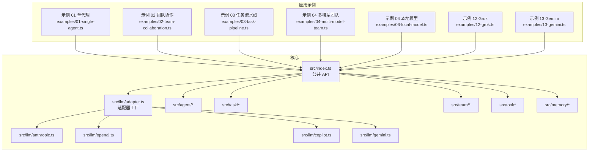
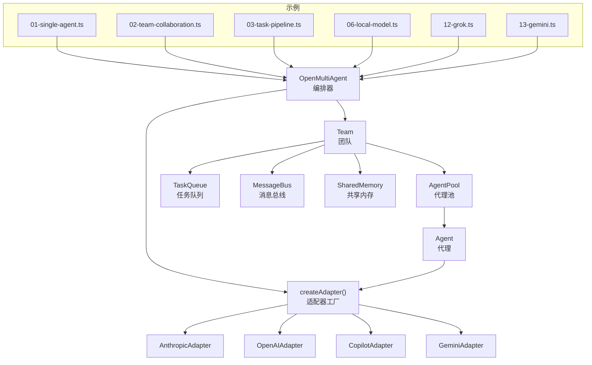
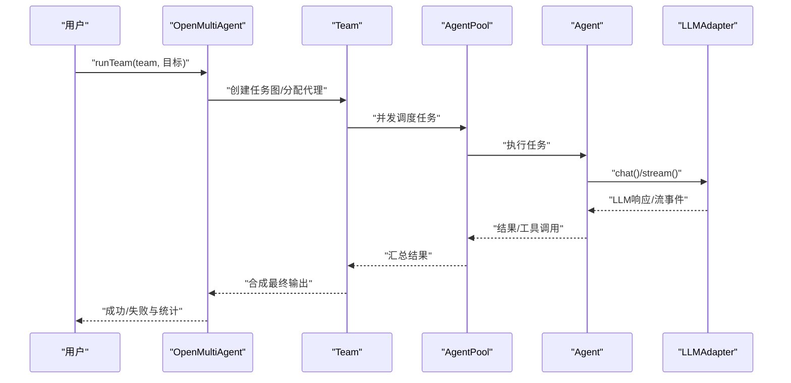
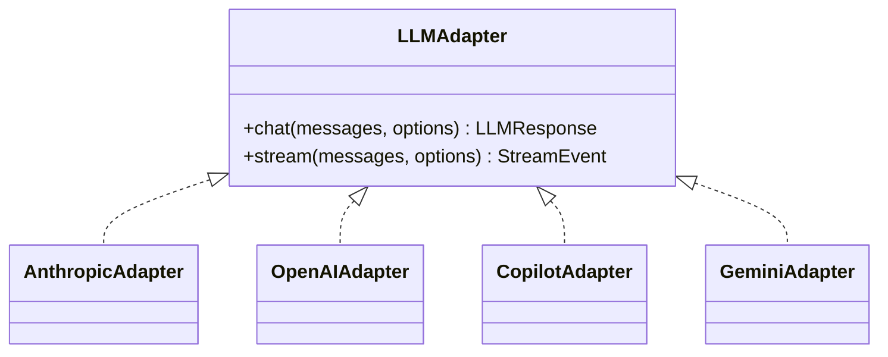
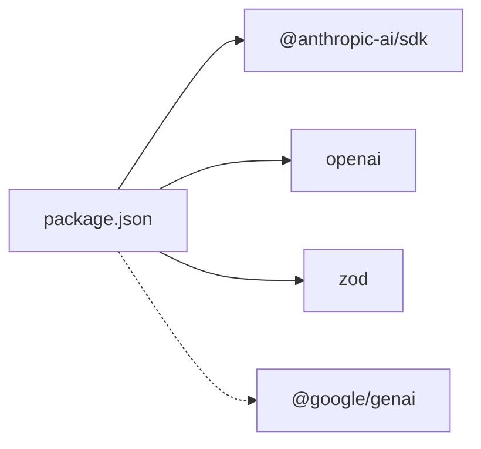

# 快速开始

<cite>
**本文引用的文件**
- [README.md](file://README.md)
- [package.json](file://package.json)
- [src/index.ts](file://src/index.ts)
- [src/llm/adapter.ts](file://src/llm/adapter.ts)
- [src/llm/anthropic.ts](file://src/llm/anthropic.ts)
- [src/llm/openai.ts](file://src/llm/openai.ts)
- [src/llm/copilot.ts](file://src/llm/copilot.ts)
- [src/llm/gemini.ts](file://src/llm/gemini.ts)
- [src/types.ts](file://src/types.ts)
- [examples/01-single-agent.ts](file://examples/01-single-agent.ts)
- [examples/02-team-collaboration.ts](file://examples/02-team-collaboration.ts)
- [examples/03-task-pipeline.ts](file://examples/03-task-pipeline.ts)
- [examples/04-multi-model-team.ts](file://examples/04-multi-model-team.ts)
- [examples/06-local-model.ts](file://examples/06-local-model.ts)
- [examples/12-grok.ts](file://examples/12-grok.ts)
- [examples/13-gemini.ts](file://examples/13-gemini.ts)
</cite>

## 目录
1. [简介](#简介)
2. [项目结构](#项目结构)
3. [核心组件](#核心组件)
4. [架构总览](#架构总览)
5. [详细组件分析](#详细组件分析)
6. [依赖关系分析](#依赖关系分析)
7. [性能考虑](#性能考虑)
8. [故障排除指南](#故障排除指南)
9. [结论](#结论)
10. [附录](#附录)

## 简介
Open Multi-Agent 是一个面向 Node.js 的 TypeScript 多智能体编排框架，支持从目标到结果的一次性调用。通过自动分解任务、解析依赖、并行执行与最终合成，开发者只需提供团队目标即可完成端到端协作。框架具备以下核心价值主张：
- 目标输入、结果输出：runTeam() 自动将目标拆解为任务图，分配给合适代理并并行执行，最后合成结果。
- TypeScript 原生：无 Python 运行时、无子进程桥接、无 sidecar 服务，可嵌入 Express、Next.js、Serverless 或 CI/CD。
- 轻量可审计：仅 3 个运行时依赖、33 个源文件，代码库可在半天内读完。
- 模型无关：Claude、GPT、Gemma 4，以及本地模型（Ollama、vLLM、LM Studio、llama.cpp server）均可在同一团队中混用。
- 多代理协作：通过消息总线与共享内存实现不同角色、工具与模型的协作。
- 结构化输出：在任意代理上添加 outputSchema（Zod），解析为 JSON 并自动重试一次，访问 result.structured 获取强类型结果。
- 任务重试：为任务设置 maxRetries 实现指数退避自动重试，失败累计 token 使用以准确计费。
- 人机协作：runTasks() 支持 onApproval 回调，在每个批次完成后由回调决定是否继续或中止剩余工作。
- 生命周期钩子：AgentConfig 支持 beforeRun/afterRun，可在执行前拦截提示或执行后处理结果；抛出异常可中止。
- 循环检测：AgentConfig 的 loopDetection 可捕获重复调用工具或文本输出的卡住代理，支持警告、终止或自定义回调。
- 可观测性：可选 onTrace 回调，为每次 LLM 调用、工具执行、任务与代理运行生成结构化跨度，带耗时、token 使用与共享 runId 用于关联。

## 项目结构
本仓库采用按层组织的模块化结构，核心目录与职责如下：
- src/index.ts：公共 API 出口，导出编排器、代理、团队、任务、工具系统、LLM 适配器与类型。
- src/llm/*：LLM 适配器工厂与各提供商适配器（Anthropic、OpenAI、Copilot、Gemini、Grok）。
- src/agent/*：代理生命周期、循环检测、代理池与运行器。
- src/team/*：团队管理、消息总线与共享内存。
- src/task/*：任务队列与任务定义。
- src/tool/*：工具框架、内置工具与文本工具提取器。
- src/memory/*：内存存储与共享内存。
- src/utils/*：信号量与追踪工具。
- examples/*：涵盖单代理、团队协作、任务流水线、多模型团队、本地模型、Grok、Gemini 等示例脚本。
- tests/*：端到端与单元测试。

图表来源
- [src/index.ts:1-183](file://src/index.ts#L1-L183)
- [src/llm/adapter.ts:1-99](file://src/llm/adapter.ts#L1-L99)
- [examples/01-single-agent.ts:1-132](file://examples/01-single-agent.ts#L1-L132)
- [examples/02-team-collaboration.ts:1-168](file://examples/02-team-collaboration.ts#L1-L168)
- [examples/03-task-pipeline.ts:1-202](file://examples/03-task-pipeline.ts#L1-L202)
- [examples/04-multi-model-team.ts:1-262](file://examples/04-multi-model-team.ts#L1-L262)
- [examples/06-local-model.ts:1-201](file://examples/06-local-model.ts#L1-L201)
- [examples/12-grok.ts:1-154](file://examples/12-grok.ts#L1-L154)
- [examples/13-gemini.ts:1-49](file://examples/13-gemini.ts#L1-L49)

章节来源
- [README.md:14-136](file://README.md#L14-L136)
- [src/index.ts:1-183](file://src/index.ts#L1-L183)

## 核心组件
- 编排器（OpenMultiAgent）：提供 createTeam()/runTeam()/runTasks()/runAgent()/getStatus() 等入口，负责团队创建、任务调度与进度事件。
- 代理（Agent）：封装 run()/prompt()/stream()，支持 beforeRun/afterRun 钩子、循环检测与超时控制。
- 团队（Team）：包含 AgentConfig 数组、消息总线、任务队列与共享内存，实现跨代理协作。
- 任务（TaskQueue）：维护任务依赖图、自动解禁与级联失败处理。
- 工具系统（ToolFramework/ToolExecutor）：注册与执行工具，支持内置工具与自定义工具（defineTool + Zod）。
- LLM 适配器（LLMAdapter）：统一 Anthropic、OpenAI、Copilot、Gemini、Grok 的接口，屏蔽差异。
- 内存（SharedMemory/InMemoryStore）：提供共享上下文与键值存储。

章节来源
- [src/index.ts:57-183](file://src/index.ts#L57-L183)
- [src/types.ts:194-200](file://src/types.ts#L194-L200)

## 架构总览
下图展示了从应用示例到核心组件的交互路径，以及 LLM 适配器如何对接不同提供商。

图表来源
- [examples/01-single-agent.ts:14-132](file://examples/01-single-agent.ts#L14-L132)
- [examples/02-team-collaboration.ts:15-168](file://examples/02-team-collaboration.ts#L15-L168)
- [examples/03-task-pipeline.ts:15-202](file://examples/03-task-pipeline.ts#L15-L202)
- [examples/06-local-model.ts:25-201](file://examples/06-local-model.ts#L25-L201)
- [examples/12-grok.ts:14-154](file://examples/12-grok.ts#L14-L154)
- [examples/13-gemini.ts:10-49](file://examples/13-gemini.ts#L10-L49)
- [src/index.ts:57-117](file://src/index.ts#L57-L117)
- [src/llm/adapter.ts:63-99](file://src/llm/adapter.ts#L63-L99)

## 详细组件分析

### Hello World：三种运行模式
- 单代理（runAgent）
  - 适用场景：单一代理、一次性提示；适合快速验证与最小化示例。
  - 示例路径：[examples/01-single-agent.ts:34-65](file://examples/01-single-agent.ts#L34-L65)
- 自动编排团队（runTeam）
  - 适用场景：给出目标，框架自动规划与执行；适合端到端协作流程。
  - 示例路径：[examples/02-team-collaboration.ts:103-129](file://examples/02-team-collaboration.ts#L103-L129)
- 显式任务流水线（runTasks）
  - 适用场景：你定义任务图与依赖；适合设计→实现→测试→评审等固定阶段。
  - 示例路径：[examples/03-task-pipeline.ts:98-177](file://examples/03-task-pipeline.ts#L98-L177)

图表来源
- [examples/02-team-collaboration.ts:103-129](file://examples/02-team-collaboration.ts#L103-L129)
- [src/llm/adapter.ts:63-99](file://src/llm/adapter.ts#L63-L99)

章节来源
- [README.md:105-112](file://README.md#L105-L112)
- [examples/01-single-agent.ts:34-65](file://examples/01-single-agent.ts#L34-L65)
- [examples/02-team-collaboration.ts:103-129](file://examples/02-team-collaboration.ts#L103-L129)
- [examples/03-task-pipeline.ts:98-177](file://examples/03-task-pipeline.ts#L98-L177)

### LLM 提供商配置与本地模型
- 环境变量与提供商映射
  - Anthropic：ANTHROPIC_API_KEY
  - OpenAI：OPENAI_API_KEY
  - Grok：XAI_API_KEY
  - GitHub Copilot：GITHUB_TOKEN（或交互式设备码流程）
  - Gemini：GEMINI_API_KEY 或 GOOGLE_API_KEY
- 本地模型（Ollama、vLLM、LM Studio、llama.cpp server）
  - 使用 provider: 'openai' + baseURL 指向本地 OpenAI 兼容端点（如 Ollama 的 http://localhost:11434/v1）。
  - 无需 API Key（SDK 需要 apiKey 字段，但本地服务器会忽略）。
- 示例参考
  - 多模型团队与自定义工具：[examples/04-multi-model-team.ts:138-171](file://examples/04-multi-model-team.ts#L138-L171)
  - 本地模型 + 云模型团队：[examples/06-local-model.ts:35-68](file://examples/06-local-model.ts#L35-L68)
  - Grok 团队协作：[examples/12-grok.ts:20-53](file://examples/12-grok.ts#L20-L53)
  - Gemini 适配器烟雾测试：[examples/13-gemini.ts:13-37](file://examples/13-gemini.ts#L13-L37)

图表来源
- [src/llm/adapter.ts:41-99](file://src/llm/adapter.ts#L41-L99)
- [src/llm/anthropic.ts:187-373](file://src/llm/anthropic.ts#L187-L373)
- [src/llm/openai.ts:68-280](file://src/llm/openai.ts#L68-L280)
- [src/llm/copilot.ts:228-450](file://src/llm/copilot.ts#L228-L450)
- [src/llm/gemini.ts:249-378](file://src/llm/gemini.ts#L249-L378)

章节来源
- [README.md:38-42](file://README.md#L38-L42)
- [README.md:190-204](file://README.md#L190-L204)
- [examples/06-local-model.ts:35-68](file://examples/06-local-model.ts#L35-L68)
- [examples/12-grok.ts:20-53](file://examples/12-grok.ts#L20-L53)
- [examples/13-gemini.ts:13-37](file://examples/13-gemini.ts#L13-L37)

### 任务重试与可观测性
- 任务重试：在任务上设置 maxRetries/maxRetriesDelayMs/retryBackoff，支持指数退避与 task_retry 进度事件。
- 可观测性：onTrace 回调提供 LLM 调用、工具执行、任务与代理运行的结构化跨度，带耗时与 token 使用。
- 示例参考
  - 任务重试：[examples/03-task-pipeline.ts:98-177](file://examples/03-task-pipeline.ts#L98-L177)
  - 可观测性：[examples/02-team-collaboration.ts:63-97](file://examples/02-team-collaboration.ts#L63-L97)

章节来源
- [README.md:21-26](file://README.md#L21-L26)
- [examples/03-task-pipeline.ts:98-177](file://examples/03-task-pipeline.ts#L98-L177)
- [examples/02-team-collaboration.ts:63-97](file://examples/02-team-collaboration.ts#L63-L97)

### 结构化输出与工具系统
- 结构化输出：在 AgentConfig 上添加 outputSchema（Zod），解析为 JSON 并自动重试一次，通过 result.structured 访问。
- 工具系统：defineTool 定义自定义工具；registerBuiltInTools 注册内置工具（bash、file_read、file_write、file_edit、grep）。
- 示例参考
  - 结构化输出：[examples/02-team-collaboration.ts:103-129](file://examples/02-team-collaboration.ts#L103-L129)
  - 自定义工具与多模型团队：[examples/04-multi-model-team.ts:29-99](file://examples/04-multi-model-team.ts#L29-L99)

章节来源
- [README.md:21-22](file://README.md#L21-L22)
- [src/index.ts:91-102](file://src/index.ts#L91-L102)
- [examples/04-multi-model-team.ts:29-99](file://examples/04-multi-model-team.ts#L29-L99)

## 依赖关系分析
- 运行时依赖
  - @anthropic-ai/sdk：Anthropic Claude
  - openai：OpenAI/Grok/Copilot（兼容端点）
  - zod：结构化输出校验
- 可选依赖
  - @google/genai：Gemini（可选，仅在需要时安装）
- Node.js 版本要求：>= 18

图表来源
- [package.json:45-57](file://package.json#L45-L57)

章节来源
- [package.json:42-44](file://package.json#L42-L44)
- [package.json:45-57](file://package.json#L45-L57)

## 性能考虑
- 并发控制：通过 Orchestrator 的 maxConcurrency 与 AgentPool 控制并发，避免资源争用。
- 超时与重试：为本地模型设置合理的 timeoutMs；对易失败外部调用使用任务重试。
- 流式输出：优先使用 Agent.stream() 获取增量文本，降低首字延迟感知。
- 令牌计费：利用 onTrace 或任务结果中的 tokenUsage 精确统计成本。

## 故障排除指南
- 环境变量未设置
  - Anthropic：确保 ANTHROPIC_API_KEY 已设置。
  - OpenAI：确保 OPENAI_API_KEY 已设置。
  - Grok：确保 XAI_API_KEY 已设置。
  - Gemini：确保 GEMINI_API_KEY 或 GOOGLE_API_KEY 已设置。
  - Copilot：确保 GITHUB_TOKEN 或交互式设备码流程已完成。
- 本地模型工具调用
  - 确认模型出现在 Ollama 的 Tools 分类中；更新 Ollama 至最新版本。
  - 若本地模型返回文本而非原生 tool_calls，框架会自动从文本中提取工具调用。
  - 使用 timeoutMs 防止长时间阻塞。
- 代理循环与卡死
  - 启用 loopDetection，选择警告、终止或自定义回调策略。
- 代理池与并发
  - 在复杂任务中适当降低并发，避免磁盘/网络瓶颈。
- 代理钩子与错误处理
  - 在 beforeRun/afterRun 中进行预处理与后处理；抛出异常可中止流程。

章节来源
- [README.md:228-232](file://README.md#L228-L232)
- [README.md:25-26](file://README.md#L25-L26)
- [examples/06-local-model.ts:67-68](file://examples/06-local-model.ts#L67-L68)

## 结论
Open Multi-Agent 以极简 API 实现从目标到结果的自动化编排，覆盖单代理、自动团队与显式流水线三大运行模式。通过统一的 LLM 适配器与工具系统，开发者可在多种云厂商与本地模型间自由切换，并借助结构化输出、任务重试、可观测性与循环检测等能力构建稳健的多智能体应用。

## 附录

### 安装与环境配置
- Node.js：>= 18
- 安装命令：npm install @jackchen_me/open-multi-agent
- 环境变量（按需设置）
  - ANTHROPIC_API_KEY（Anthropic）
  - OPENAI_API_KEY（OpenAI）
  - XAI_API_KEY（Grok）
  - GEMINI_API_KEY 或 GOOGLE_API_KEY（Gemini）
  - GITHUB_TOKEN（Copilot）

章节来源
- [README.md:30-42](file://README.md#L30-L42)
- [package.json:42-44](file://package.json#L42-L44)

### Hello World 示例（路径）
- 单代理：[examples/01-single-agent.ts:34-65](file://examples/01-single-agent.ts#L34-L65)
- 团队协作：[examples/02-team-collaboration.ts:103-129](file://examples/02-team-collaboration.ts#L103-L129)
- 任务流水线：[examples/03-task-pipeline.ts:98-177](file://examples/03-task-pipeline.ts#L98-L177)

### LLM 提供商与本地模型设置（路径）
- 多模型团队与自定义工具：[examples/04-multi-model-team.ts:138-171](file://examples/04-multi-model-team.ts#L138-L171)
- 本地模型 + 云模型团队：[examples/06-local-model.ts:35-68](file://examples/06-local-model.ts#L35-L68)
- Grok 团队协作：[examples/12-grok.ts:20-53](file://examples/12-grok.ts#L20-L53)
- Gemini 适配器烟雾测试：[examples/13-gemini.ts:13-37](file://examples/13-gemini.ts#L13-L37)