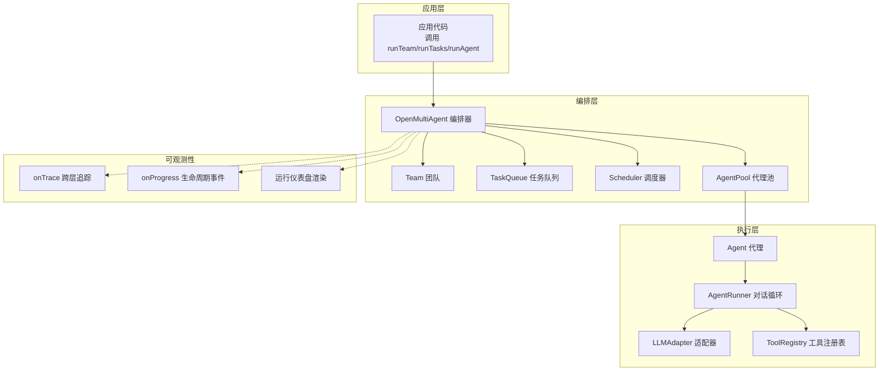
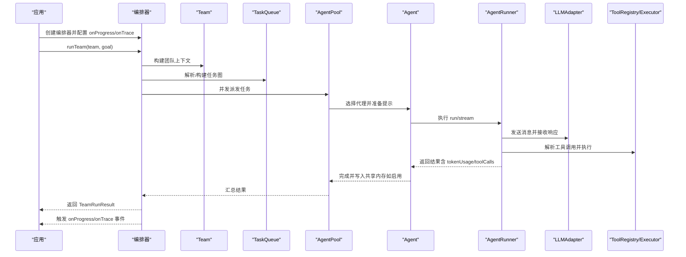
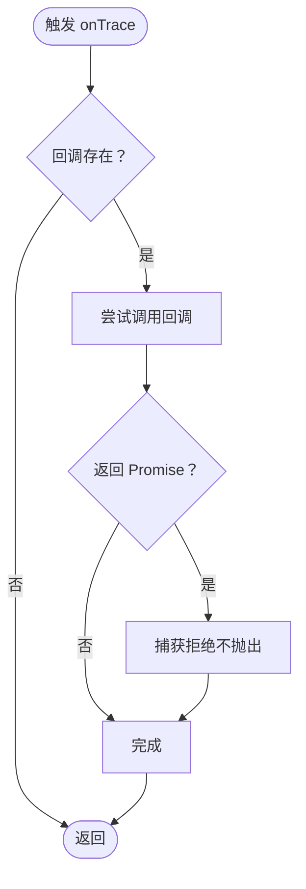
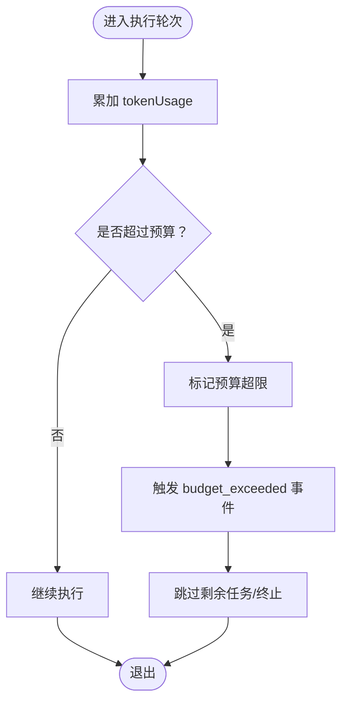
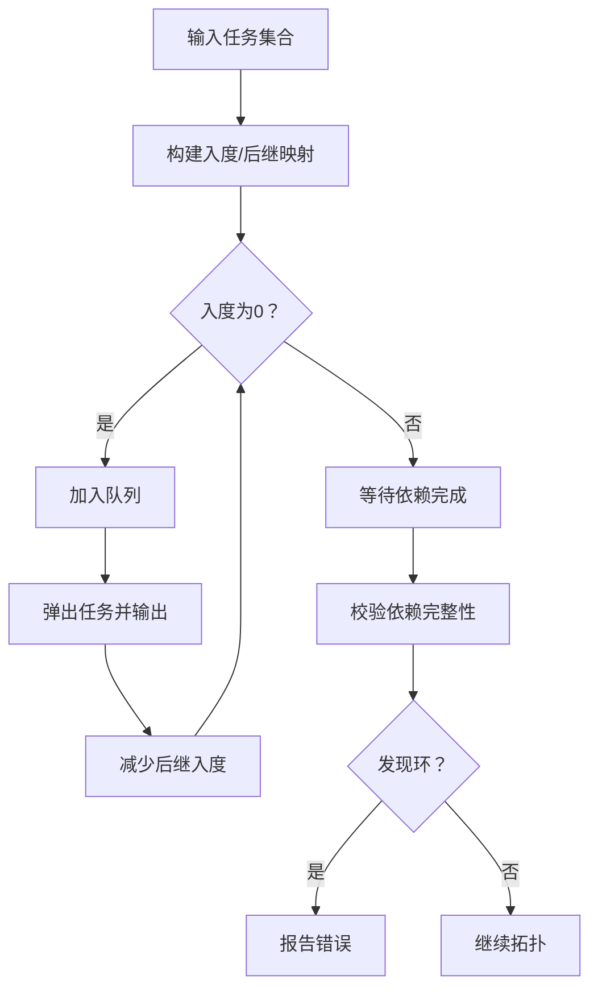
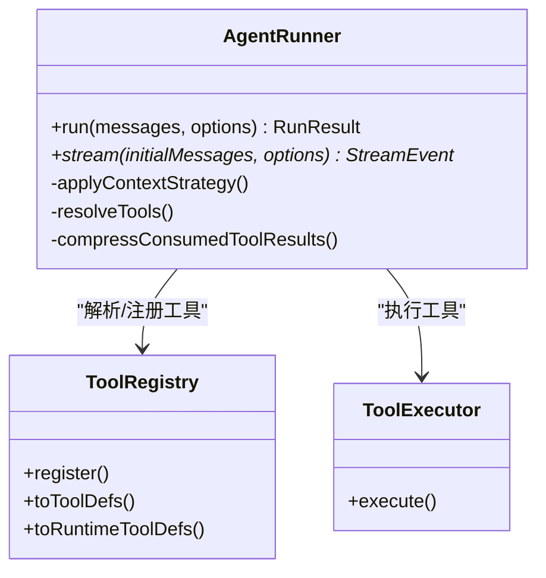
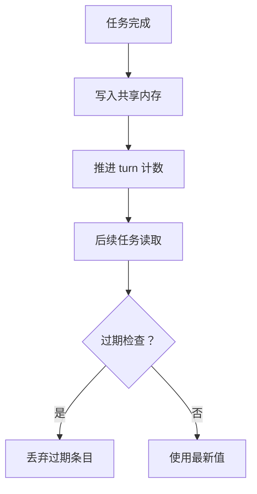
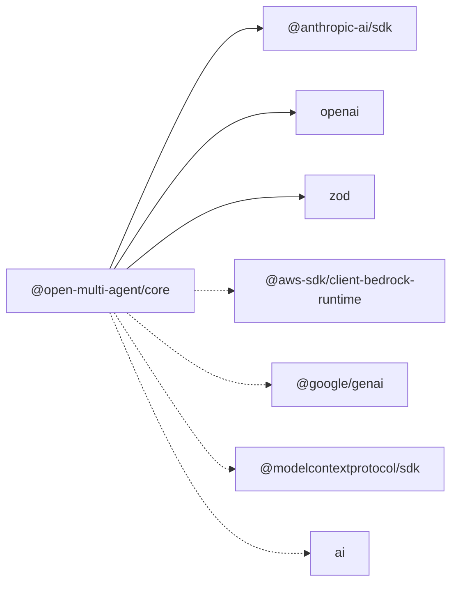

# 故障排除与调试

<cite>
**本文引用的文件**
- [README.md](file://README.md)
- [observability.md](file://docs/observability.md)
- [trace.ts](file://src/utils/trace.ts)
- [errors.ts](file://src/errors.ts)
- [orchestrator.ts](file://src/orchestrator/orchestrator.ts)
- [runner.ts](file://src/agent/runner.ts)
- [task.ts](file://src/task/task.ts)
- [store.ts](file://src/memory/store.ts)
- [trace-observability.ts](file://examples/integrations/trace-observability.ts)
- [trace.test.ts](file://tests/trace.test.ts)
- [runner-error-propagation.test.ts](file://tests/runner-error-propagation.test.ts)
- [abort-signal-propagation.test.ts](file://tests/abort-signal-propagation.test.ts)
- [vitest.config.ts](file://vitest.config.ts)
- [package.json](file://package.json)
</cite>

## 目录
1. [简介](#简介)
2. [项目结构](#项目结构)
3. [核心组件](#核心组件)
4. [架构总览](#架构总览)
5. [详细组件分析](#详细组件分析)
6. [依赖关系分析](#依赖关系分析)
7. [性能考量](#性能考量)
8. [故障排除指南](#故障排除指南)
9. [结论](#结论)
10. [附录](#附录)

## 简介
本指南面向使用 Open Multi-Agent 框架的开发者，聚焦于“故障排除与调试”。内容涵盖：
- 常见问题的诊断方法与解决方案
- 调试工具与技巧（日志分析、性能分析、错误追踪）
- 可观测性功能的使用与问题定位
- 错误码与异常处理策略
- 性能瓶颈识别与优化建议
- 运行时数据采集与分析
- 社区支持与问题反馈渠道

## 项目结构
框架采用模块化设计，围绕“编排器（Orchestrator）—团队（Team）—任务队列（TaskQueue）—代理池（AgentPool）—代理（Agent）—适配器（LLMAdapter）—工具（Tool）”的链路组织。可观测性通过 onProgress 事件、onTrace 跨层追踪与渲染后的运行仪表盘实现。

图表来源
- [README.md:217-264](file://README.md#L217-L264)
- [orchestrator.ts:44-73](file://src/orchestrator/orchestrator.ts#L44-L73)

章节来源
- [README.md:217-264](file://README.md#L217-L264)

## 核心组件
- 编排器（OpenMultiAgent）：负责任务分解、调度、并发控制、预算与失败处理、进度与追踪回调。
- 代理（Agent）与对话循环（AgentRunner）：负责 LLM 调用、工具解析与执行、上下文压缩、循环检测与令牌预算。
- 任务系统（TaskQueue、Task 工具函数）：拓扑排序、依赖验证、就绪判断、重试与回退。
- 可观测性（onProgress/onTrace）：轻量级生命周期事件与结构化跨层追踪；支持渲染运行仪表盘。
- 内存（SharedMemory/InMemoryStore）：默认内存键值存储，支持 TTL 与搜索。

章节来源
- [orchestrator.ts:44-73](file://src/orchestrator/orchestrator.ts#L44-L73)
- [runner.ts:348-362](file://src/agent/runner.ts#L348-L362)
- [task.ts:1-242](file://src/task/task.ts#L1-L242)
- [observability.md:1-57](file://docs/observability.md#L1-L57)
- [store.ts:31-149](file://src/memory/store.ts#L31-L149)

## 架构总览
下图展示一次 runTeam 的关键调用序列，突出可观测性与错误传播路径：

图表来源
- [orchestrator.ts:561-800](file://src/orchestrator/orchestrator.ts#L561-L800)
- [runner.ts:673-800](file://src/agent/runner.ts#L673-L800)
- [trace-observability.ts:90-130](file://examples/integrations/trace-observability.ts#L90-L130)

章节来源
- [orchestrator.ts:561-800](file://src/orchestrator/orchestrator.ts#L561-L800)
- [runner.ts:673-800](file://src/agent/runner.ts#L673-L800)

## 详细组件分析

### 组件一：可观测性（onProgress/onTrace）
- onProgress：提供轻量级生命周期事件（任务开始/完成/重试/跳过/错误等），适合终端输出与实时 UI。
- onTrace：提供结构化跨层追踪（LLM 调用、工具调用、任务、代理），包含时间戳、耗时、token 使用、工具输入/输出等，可对接 OpenTelemetry 或自建后端。
- 追踪安全：emitTrace 对回调异常进行吞没，避免可观测性订阅影响主执行流程。
- 追踪 ID：generateRunId 生成唯一 runId，用于跨事件关联。

图表来源
- [trace.ts:12-27](file://src/utils/trace.ts#L12-L27)

章节来源
- [observability.md:5-57](file://docs/observability.md#L5-L57)
- [trace.ts:1-35](file://src/utils/trace.ts#L1-L35)
- [trace-observability.ts:50-84](file://examples/integrations/trace-observability.ts#L50-L84)
- [trace.test.ts:90-158](file://tests/trace.test.ts#L90-L158)

### 组件二：错误与预算（TokenBudgetExceededError）
- TokenBudgetExceededError：当代理或编排器累计 token 超出预算时抛出，编排器在队列中记录并触发 budget_exceeded 事件。
- Runner 层面：当 per-call/全局预算超限时，会标记 budgetExceeded 并在流事件中传递。
- 测试覆盖：错误传播与预算事件的正确性得到单元测试验证。

图表来源
- [orchestrator.ts:733-747](file://src/orchestrator/orchestrator.ts#L733-L747)
- [runner.ts:798-800](file://src/agent/runner.ts#L798-L800)

章节来源
- [errors.ts:1-20](file://src/errors.ts#L1-L20)
- [orchestrator.ts:733-747](file://src/orchestrator/orchestrator.ts#L733-L747)
- [runner.ts:798-800](file://src/agent/runner.ts#L798-L800)
- [runner-error-propagation.test.ts:51-85](file://tests/runner-error-propagation.test.ts#L51-L85)

### 组件三：任务系统与依赖验证
- createTask：生成任务并初始化状态与时间戳。
- isTaskReady：基于依赖完成状态判断是否可启动。
- getTaskDependencyOrder：Kahn 拓扑排序，保证依赖先行。
- validateTaskDependencies：未知依赖、自依赖、环依赖检测。

图表来源
- [task.ts:117-162](file://src/task/task.ts#L117-L162)
- [task.ts:186-241](file://src/task/task.ts#L186-L241)

章节来源
- [task.ts:1-242](file://src/task/task.ts#L1-L242)

### 组件四：代理与工具执行（AgentRunner）
- 循环控制：maxTurns 防止无限循环；loopDetection 可选地检测重复模式。
- 上下文管理：滑动窗口、摘要、紧凑压缩三种策略，支持自定义压缩器。
- 工具解析：从响应中提取 tool_use 块，串并行执行，记录 toolCalls 与 tokenUsage。
- 中断信号：per-call 与静态 AbortSignal 支持，确保适配器与工具执行可被取消。

图表来源
- [runner.ts:348-362](file://src/agent/runner.ts#L348-L362)
- [runner.ts:569-623](file://src/agent/runner.ts#L569-L623)
- [runner.ts:673-800](file://src/agent/runner.ts#L673-L800)

章节来源
- [runner.ts:348-362](file://src/agent/runner.ts#L348-L362)
- [runner.ts:525-557](file://src/agent/runner.ts#L525-L557)
- [runner.ts:673-800](file://src/agent/runner.ts#L673-L800)

### 组件五：内存与共享记忆
- InMemoryStore：默认内存 KV 实现，支持 TTL、元数据、搜索与清空。
- 共享记忆：任务完成后写入共享存储，供后续任务读取；TTL 由 turn 计数推进。

图表来源
- [orchestrator.ts:750-757](file://src/orchestrator/orchestrator.ts#L750-L757)
- [store.ts:31-104](file://src/memory/store.ts#L31-L104)

章节来源
- [store.ts:31-149](file://src/memory/store.ts#L31-L149)
- [orchestrator.ts:750-757](file://src/orchestrator/orchestrator.ts#L750-L757)

## 依赖关系分析
- 运行时依赖：@anthropic-ai/sdk、openai、zod。
- 可选对等依赖：@aws-sdk/client-bedrock-runtime、@google/genai、@modelcontextprotocol/sdk、ai。
- 测试与覆盖率：Vitest + 覆盖率报告（text/html/lcov/json）。

图表来源
- [package.json:69-106](file://package.json#L69-L106)

章节来源
- [package.json:69-106](file://package.json#L69-L106)
- [vitest.config.ts:1-19](file://vitest.config.ts#L1-L19)

## 性能考量
- 并发与批处理：编排器按轮次并行派发“pending”任务，独立任务尽可能并发执行。
- 令牌预算：编排器与 Runner 层均统计 tokenUsage，支持预算超限中断与事件上报。
- 上下文压缩：滑动窗口、摘要模型与自定义压缩策略降低上下文开销。
- 工具输出截断：工具结果在 trace 中已截断，避免大输出污染日志与追踪。
- 重试与退避：任务级重试带指数退避上限，防止抖动放大。

章节来源
- [orchestrator.ts:561-800](file://src/orchestrator/orchestrator.ts#L561-L800)
- [runner.ts:525-557](file://src/agent/runner.ts#L525-L557)
- [trace.test.ts:290-330](file://tests/trace.test.ts#L290-L330)

## 故障排除指南

### 1. 常见问题与诊断步骤
- 任务无法启动
  - 检查依赖是否全部完成；使用 validateTaskDependencies 排查未知依赖/自依赖/环依赖。
  - 使用 isTaskReady 在派发前确认就绪状态。
- 代理卡死或无限循环
  - 设置 maxTurns 并开启 loopDetection；关注 onProgress 中的 warn/warn+terminate 行为。
- 令牌预算超限
  - 观察 budget_exceeded 事件；核对编排器与代理层的 maxTokenBudget 配置。
- 工具执行失败
  - 查看 onTrace 中 tool_call 的 isError 与 output；必要时开启 revealCoordinator 提升上下文可见性。
- 中断无效
  - 确认 per-call AbortSignal 是否传入 Runner/Adapter；测试覆盖了信号传播。

章节来源
- [task.ts:78-94](file://src/task/task.ts#L78-L94)
- [task.ts:186-241](file://src/task/task.ts#L186-L241)
- [runner.ts:713-718](file://src/agent/runner.ts#L713-L718)
- [runner.ts:693-694](file://src/agent/runner.ts#L693-L694)
- [runner-error-propagation.test.ts:78-85](file://tests/runner-error-propagation.test.ts#L78-L85)
- [abort-signal-propagation.test.ts:22-72](file://tests/abort-signal-propagation.test.ts#L22-L72)

### 2. 日志分析与追踪
- onProgress：打印任务/代理生命周期事件，便于快速定位阶段与节点。
- onTrace：结构化事件包含 runId、taskId、agent、model、turn、tokens、durationMs、isError 等字段，适合接入外部追踪系统。
- 示例参考：trace-observability 示例脚本展示了如何格式化输出与聚合统计。

章节来源
- [observability.md:5-57](file://docs/observability.md#L5-L57)
- [trace-observability.ts:50-84](file://examples/integrations/trace-observability.ts#L50-L84)
- [trace.test.ts:176-349](file://tests/trace.test.ts#L176-L349)

### 3. 错误码与异常处理
- TOKEN_BUDGET_EXCEEDED：预算超限错误，包含 agent、tokensUsed、budget 字段。
- Adapter 错误：LLM 调用异常会被上抛至 AgentRunResult.success=false，或在 run() 中直接抛错。
- 可观测性回调异常：emitTrace 吞噬回调错误，保证执行不受影响。

章节来源
- [errors.ts:1-20](file://src/errors.ts#L1-L20)
- [runner-error-propagation.test.ts:51-85](file://tests/runner-error-propagation.test.ts#L51-L85)
- [trace.ts:12-27](file://src/utils/trace.ts#L12-L27)

### 4. 性能瓶颈识别与优化
- 令牌使用过高
  - 使用 onTrace 的 llm_call 与 agent 事件统计各阶段 token；结合 contextStrategy（滑窗/摘要/紧凑/自定义）降低上下文。
- 工具执行慢
  - 关注 tool_call 的 durationMs 与 isError；必要时缩短工具输出或拆分任务。
- 并发不足
  - 调整 maxConcurrency；确保任务无不必要的串行依赖。
- 重试风暴
  - 适当增大 retryDelayMs 与 retryBackoff，并设置合理的 maxRetries。

章节来源
- [runner.ts:525-557](file://src/agent/runner.ts#L525-L557)
- [orchestrator.ts:247-253](file://src/orchestrator/orchestrator.ts#L247-L253)
- [trace-observability.ts:50-84](file://examples/integrations/trace-observability.ts#L50-L84)

### 5. 运行时数据采集与分析
- 必须持久化的数据：TeamRunResult.tasks、totalTokenUsage、onTrace、渲染的仪表盘 HTML。
- 仪表盘：renderTeamRunDashboard 可生成可视化 HTML，便于复盘与分享。
- CLI：oma run --dashboard 可直接生成 HTML 文件。

章节来源
- [observability.md:33-57](file://docs/observability.md#L33-L57)
- [README.md:129-129](file://README.md#L129-L129)

### 6. 社区支持与问题反馈
- GitHub Issues：用于提交 bug、功能请求与讨论。
- 讨论区：用于集成案例与生态分享。
- 贡献指南：欢迎贡献示例、文档与翻译。

章节来源
- [README.md:330-342](file://README.md#L330-L342)

## 结论
通过 onProgress 与 onTrace 的双层可观测性、严格的预算与错误处理机制、完善的任务依赖与上下文管理，Open Multi-Agent 框架提供了系统性的调试与排障能力。建议在生产环境中：
- 始终启用 onProgress/onTrace，并接入统一追踪后端；
- 明确 maxTokenBudget、maxTurns、maxConcurrency 等关键参数；
- 使用 validateTaskDependencies 与 isTaskReady 做前置校验；
- 利用仪表盘与 trace 数据进行复盘与回归分析。

## 附录

### A. 关键配置与钩子速查
- 编排器钩子：onProgress、onTrace、onAgentStream、onApproval、maxTokenBudget、maxDelegationDepth。
- 代理钩子：onToolCall、onToolResult、onMessage、onWarning、onTrace、abortSignal。
- 任务钩子：maxRetries、retryDelayMs、retryBackoff、memoryScope。

章节来源
- [orchestrator.ts:44-73](file://src/orchestrator/orchestrator.ts#L44-L73)
- [runner.ts:149-179](file://src/agent/runner.ts#L149-L179)

### B. 示例与测试参考
- 轻量可观测性示例：trace-observability.ts
- 可观测性测试：tests/trace.test.ts
- 错误传播测试：tests/runner-error-propagation.test.ts
- 中断传播测试：tests/abort-signal-propagation.test.ts

章节来源
- [trace-observability.ts:1-144](file://examples/integrations/trace-observability.ts#L1-L144)
- [trace.test.ts:1-503](file://tests/trace.test.ts#L1-L503)
- [runner-error-propagation.test.ts:1-86](file://tests/runner-error-propagation.test.ts#L1-L86)
- [abort-signal-propagation.test.ts:1-72](file://tests/abort-signal-propagation.test.ts#L1-L72)