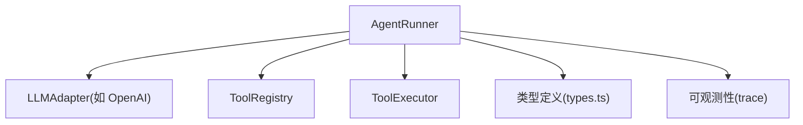
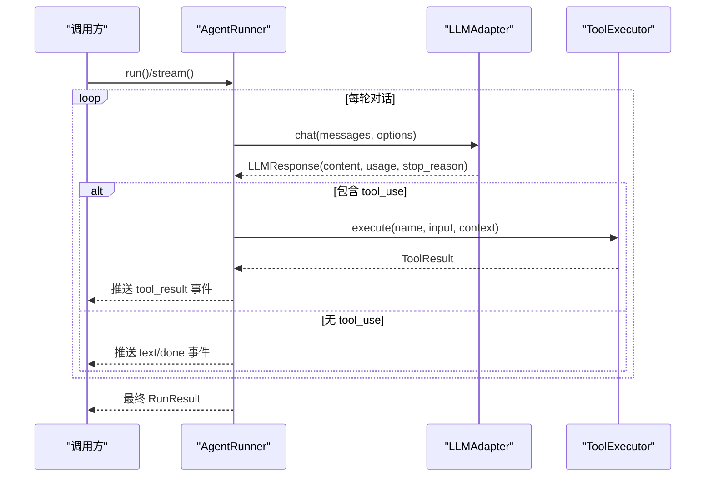
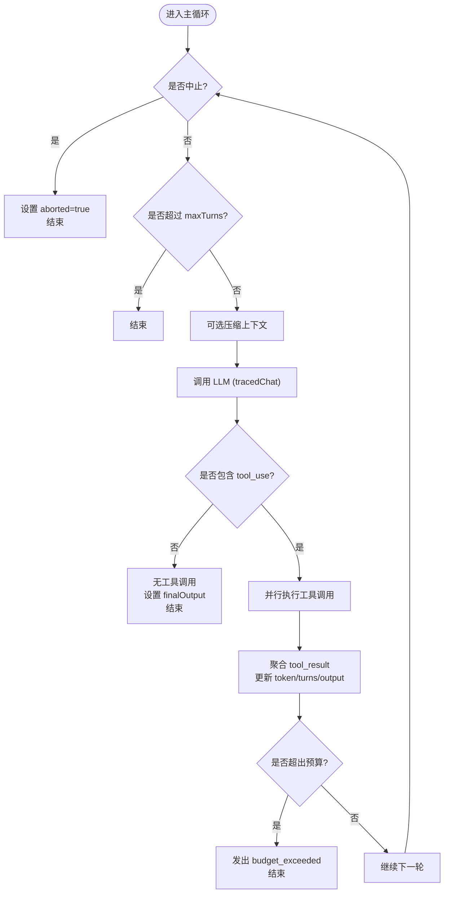
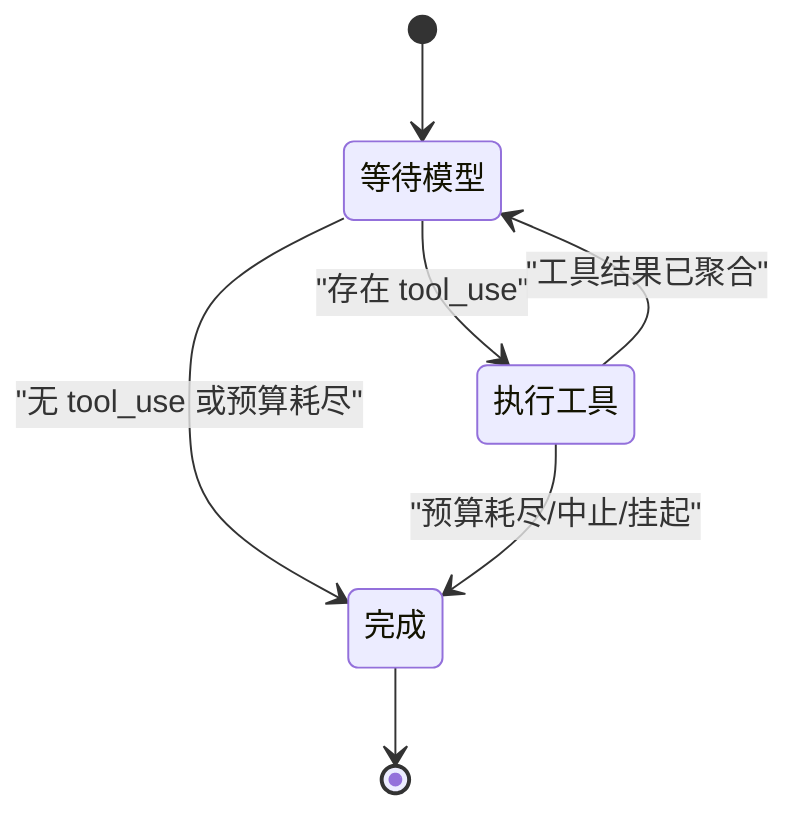
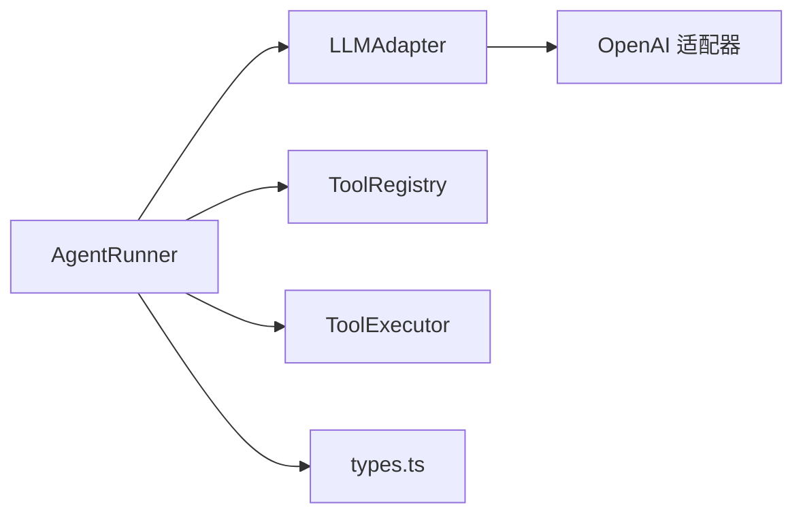

# AgentRunner 核心执行器

<cite>
**本文引用的文件**
- [runner.ts](file://packages/core/src/agent/runner.ts)
- [types.ts](file://packages/core/src/types.ts)
- [openai.ts](file://packages/core/src/llm/openai.ts)
</cite>

## 目录
1. [简介](#简介)
2. [项目结构](#项目结构)
3. [核心组件](#核心组件)
4. [架构总览](#架构总览)
5. [详细组件分析](#详细组件分析)
6. [依赖关系分析](#依赖关系分析)
7. [性能考量](#性能考量)
8. [故障排查指南](#故障排查指南)
9. [结论](#结论)
10. [附录](#附录)

## 简介
AgentRunner 是 open-multi-agent 框架中的智能体执行引擎，负责驱动完整的“对话—工具调用—再对话”循环。其职责包括：
- 将消息发送给 LLM 适配器并接收响应
- 从响应中提取工具调用块（tool_use）
- 通过 ToolExecutor 并行执行工具调用
- 将工具结果追加到对话历史，直到模型返回 end_turn 或达到最大轮次
- 累积 token 用量、耗时等指标，并在流式模式下逐步产出事件

本文件重点解释 run() 与 stream() 的区别与使用场景、关键执行步骤（消息处理、LLM 调用、工具提取与执行、结果聚合）、RunnerOptions 与 RunOptions 的配置项与作用，以及错误处理与异常恢复机制。

## 项目结构
AgentRunner 位于 core 包的 agent 模块中，围绕以下核心类型与模块协作：
- 类型定义：LLMMessage、ToolUseBlock、ToolResultBlock、TokenUsage、StreamEvent、RunResult、RunnerOptions、RunOptions、LoopDetectionConfig 等
- LLM 适配层：如 OpenAI 适配器，负责流式/非流式调用与工具调用解析
- 工具系统：ToolRegistry、ToolExecutor、工具授权与沙箱上下文
- 可观测性：TraceRuntime、TraceSpan、trace 事件
- 容错与恢复：Checkpoint、Durable Approval、AbortSignal

图表来源
- [runner.ts:472-986](file://packages/core/src/agent/runner.ts#L472-L986)
- [types.ts:85-247](file://packages/core/src/types.ts#L85-L247)

章节来源
- [runner.ts:1-100](file://packages/core/src/agent/runner.ts#L1-L100)
- [types.ts:85-247](file://packages/core/src/types.ts#L85-L247)

## 核心组件
- AgentRunner：实现 AgentBackend 接口，提供 run() 与 stream() 两个入口，封装完整对话循环
- LLM 适配器：抽象不同模型的调用方式，统一返回 LLMResponse 与 StreamEvent
- 工具注册与执行：基于 ToolRegistry 解析可用工具，通过 ToolExecutor 执行并产出 ToolResult
- 上下文策略：支持滑动窗口、摘要压缩、自定义压缩等策略，控制长对话的上下文大小
- 循环检测：检测重复的工具调用或文本输出，支持 warn/inject/terminate 策略
- 预算与超时：支持 per-call 超时、全局 abortSignal、token 预算上限
- 检查点与恢复：在关键边界持久化状态，支持中断后恢复执行

章节来源
- [runner.ts:472-986](file://packages/core/src/agent/runner.ts#L472-L986)
- [types.ts:1216-1245](file://packages/core/src/types.ts#L1216-L1245)

## 架构总览
AgentRunner 的核心流程如下：
- 初始化：构建基础 LLM 选项、工具白名单、循环检测器、检查点回调
- 主循环：按阶段推进（awaiting_model → executing_tools → completed）
- LLM 调用：tracedChat 包装 chatWithCallTimeout，支持 per-call 超时与可观测性
- 工具提取与执行：extractToolUseBlocks 获取 tool_use，executeToolCall 并行执行
- 结果聚合：合并 tool_result，更新 token 用量、turns、最终输出
- 退出条件：end_turn、maxTurns、budget exceeded、aborted、loop terminate

图表来源
- [runner.ts:842-864](file://packages/core/src/agent/runner.ts#L842-L864)
- [runner.ts:877-1358](file://packages/core/src/agent/runner.ts#L877-L1358)
- [openai.ts:362-389](file://packages/core/src/llm/openai.ts#L362-L389)

## 详细组件分析

### run() 与 stream() 的区别与使用场景
- run()：阻塞式接口，内部复用 stream() 收集所有事件，最终返回聚合后的 RunResult。适用于批处理、脚本、不需要增量展示的场景。
- stream()：流式接口，逐条产出 StreamEvent（text、tool_use、tool_result、budget_exceeded、done、error），适合实时 UI、进度展示、边生成边消费的场景。

两者均遵循同一契约：stream() 必须以 { type: 'done', data: RunResult } 结尾；run() 返回相同的 RunResult。

章节来源
- [runner.ts:842-864](file://packages/core/src/agent/runner.ts#L842-L864)
- [runner.ts:877-880](file://packages/core/src/agent/runner.ts#L877-L880)

### 关键执行步骤详解
1) 消息处理
- 维护 conversationMessages（完整历史）与 newMessages（本轮新增）
- 可选压缩：compressConsumedToolResults、applyContextStrategy（滑动窗口/摘要/自定义）
- 保证 tool_use/tool_result 成对，避免拆分导致 API 报错

2) LLM 适配器调用
- tracedChat 包装 chatWithCallTimeout，支持 per-call 超时、abort 信号合并、可观测性 span
- 根据配置注入 tools、maxTokens、temperature、topP/topK/minP、thinking、systemPrompt 等

3) 工具调用提取与执行
- extractToolUseBlocks 从响应内容中抽取 tool_use
- executeToolCall 校验工具授权（默认拒绝未授权工具）、执行工具、记录 trace、构造 ToolResultBlock
- 支持并发执行 pendingToolCalls，并通过 Promise.all 并行调度

4) 结果聚合
- 将 tool_result 追加为 user 消息，更新 totalUsage、allToolCalls、finalOutput
- 若检测到 budget exceeded，发出 budget_exceeded 事件并结束
- 若无 tool_use 且非终止条件，则标记完成并产出 done

图表来源
- [runner.ts:986-1358](file://packages/core/src/agent/runner.ts#L986-L1358)

章节来源
- [runner.ts:986-1358](file://packages/core/src/agent/runner.ts#L986-L1358)

### RunnerOptions 与 RunOptions 配置说明
- RunnerOptions（实例级静态配置）
  - model/systemPrompt/maxTokens/temperature/topP/topK/minP：传递给 LLM 的采样与限制参数
  - parallelToolCalls/frequencyPenalty/presencePenalty/extraBody/thinking：适配器相关扩展字段
  - toolPreset/allowedTools/disallowedTools：工具访问控制（预设→白名单→黑名单→框架安全）
  - onToolCall：每调用一次工具的钩子
  - cwd/credentials/agentName/agentRole：工具运行上下文与安全隔离
  - loopDetection：循环检测配置（阈值、窗口、动作）
  - maxTokenBudget：累计 token 上限
  - contextStrategy：上下文压缩策略（sliding-window/summarize/compact/custom）
  - compressToolResults/preserveReasoningAsText/compressReasoningText：结果与推理文本压缩开关
  - abortSignal/callTimeoutMs：全局中止与单次调用超时

- RunOptions（每次调用级配置）
  - identity/traceRuntime/traceSpan/tracePhase/traceLinks：可观测性与链路追踪
  - onToolCall/onToolResult/onMessage：运行时回调（工具调用前/后、消息追加后）
  - resumeState/onCheckpoint/onApprovalRequest/onApprovalPrepare/onApprovalConsumed：任务恢复与持久化审批
  - onWarning：配置问题告警（如模型未使用工具）
  - runId/taskId/traceAgent/traceSpanId/traceParentId：追踪关联标识
  - abortSignal：覆盖实例级中止信号
  - team：团队上下文（用于 delegate_to_agent 等内置工具）

章节来源
- [runner.ts:85-177](file://packages/core/src/agent/runner.ts#L85-L177)
- [runner.ts:183-247](file://packages/core/src/agent/runner.ts#L183-L247)
- [types.ts:1216-1245](file://packages/core/src/types.ts#L1216-L1245)

### 错误处理与异常恢复机制
- 调用超时：chatWithCallTimeout 在 per-call 超时时抛出 LLMCallTimeoutError，区分于用户主动取消
- 预算超限：当累计 token 超过 maxTokenBudget，发出 budget_exceeded 事件并结束
- 循环检测：detect 重复工具调用或文本，支持 warn/inject/terminate；二次检测强制终止
- 工具执行错误：工具抛错被捕获为 isError 的 ToolResult，不会中断整个 run
- 中止恢复：通过 AbortSignal 可在任意阶段中止；checkpoint 在关键边界持久化，支持恢复
- 审批挂起：工具可请求 durable approval，挂起执行并等待外部决策；恢复时重放未提交调用

图表来源
- [runner.ts:986-1358](file://packages/core/src/agent/runner.ts#L986-L1358)

章节来源
- [runner.ts:561-582](file://packages/core/src/agent/runner.ts#L561-L582)
- [runner.ts:1201-1215](file://packages/core/src/agent/runner.ts#L1201-L1215)
- [runner.ts:1225-1268](file://packages/core/src/agent/runner.ts#L1225-L1268)
- [runner.ts:1364-1546](file://packages/core/src/agent/runner.ts#L1364-L1546)

### 实际使用示例与常见执行模式
- 基本用法：创建 AgentRunner，传入 adapter、registry、executor 与 RunnerOptions，调用 run() 获取 RunResult
- 流式交互：使用 stream() 订阅 text/tool_use/tool_result/budget_exceeded/done/error 事件，实现实时展示
- 上下文压缩：配置 contextStrategy 为 sliding-window/summarize/compact，控制长对话的上下文大小
- 工具授权：通过 toolPreset/allowedTools/disallowedTools 精细控制可用工具集
- 预算与超时：设置 maxTokenBudget 与 callTimeoutMs，结合 abortSignal 实现强约束
- 恢复与审批：提供 resumeState 与 onCheckpoint/onApprovalRequest，实现中断恢复与关键操作审批

章节来源
- [runner.ts:459-470](file://packages/core/src/agent/runner.ts#L459-L470)
- [runner.ts:842-864](file://packages/core/src/agent/runner.ts#L842-L864)
- [runner.ts:877-880](file://packages/core/src/agent/runner.ts#L877-L880)

## 依赖关系分析
- AgentRunner 依赖 LLMAdapter 进行模型调用，依赖 ToolRegistry/ToolExecutor 进行工具解析与执行
- 类型定义集中在 types.ts，贯穿消息、工具、流事件、结果、循环检测等
- OpenAI 适配器演示了如何从流式响应中组装 tool_use 并产出 StreamEvent

图表来源
- [runner.ts:472-986](file://packages/core/src/agent/runner.ts#L472-L986)
- [openai.ts:362-389](file://packages/core/src/llm/openai.ts#L362-L389)

章节来源
- [runner.ts:472-986](file://packages/core/src/agent/runner.ts#L472-L986)
- [openai.ts:362-389](file://packages/core/src/llm/openai.ts#L362-L389)

## 性能考量
- 并行工具执行：pendingToolCalls 通过 Promise.all 并行执行，提升吞吐
- 上下文压缩：滑动窗口/摘要/规则压缩减少 token 消耗，降低 API 成本与延迟
- 结果压缩：compressToolResults 与 compressReasoningText 减少历史体积
- 预算与超时：maxTokenBudget 与 callTimeoutMs 防止无限增长与卡死
- 可观测性：span 与 trace 事件开销可控，仅在启用时产生

[本节为通用指导，不直接分析具体文件]

## 故障排查指南
- 模型未使用工具：首次 turn 若提供了工具但模型未调用，会触发 onWarning，建议检查模型能力与提示词
- 预算超限：出现 budget_exceeded 事件，需调整 maxTokenBudget 或优化上下文策略
- 循环检测：出现 loop_detected 事件，可调整 loopDetection 阈值或动作（warn/inject/terminate）
- 工具执行失败：工具抛错会被记录为 isError，检查工具实现与输入校验
- 调用超时：LLMCallTimeoutError 表明 per-call 超时，检查网络与模型服务稳定性
- 恢复与审批：若出现 suspended，需处理 onApprovalRequest 并恢复 checkpoint

章节来源
- [runner.ts:1291-1299](file://packages/core/src/agent/runner.ts#L1291-L1299)
- [runner.ts:1201-1215](file://packages/core/src/agent/runner.ts#L1201-L1215)
- [runner.ts:1225-1268](file://packages/core/src/agent/runner.ts#L1225-L1268)
- [runner.ts:1364-1546](file://packages/core/src/agent/runner.ts#L1364-L1546)
- [runner.ts:561-582](file://packages/core/src/agent/runner.ts#L561-L582)

## 结论
AgentRunner 作为智能体执行引擎，以清晰的阶段化循环管理 LLM 调用、工具执行与结果聚合，并提供丰富的配置项与可观测性能力。通过 run()/stream() 双入口、上下文压缩、循环检测、预算与超时控制、检查点与审批机制，能够在复杂多变的场景中稳定高效地驱动智能体完成任务。

[本节为总结，不直接分析具体文件]

## 附录
- 参考类型与事件：
  - LLMMessage、ToolUseBlock、ToolResultBlock、TokenUsage、StreamEvent、RunResult
  - RunnerOptions、RunOptions、LoopDetectionConfig
- 适配器行为：
  - OpenAI 适配器从流式响应中组装 tool_use，并以 StreamEvent 形式产出

章节来源
- [types.ts:85-247](file://packages/core/src/types.ts#L85-L247)
- [types.ts:1216-1245](file://packages/core/src/types.ts#L1216-L1245)
- [openai.ts:362-389](file://packages/core/src/llm/openai.ts#L362-L389)