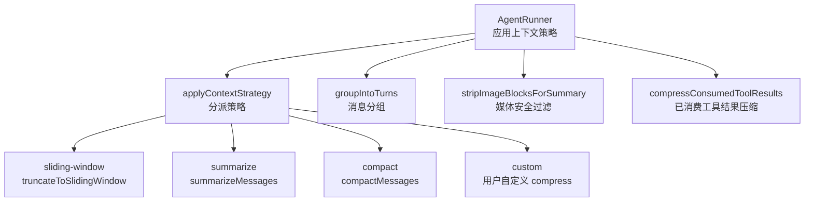
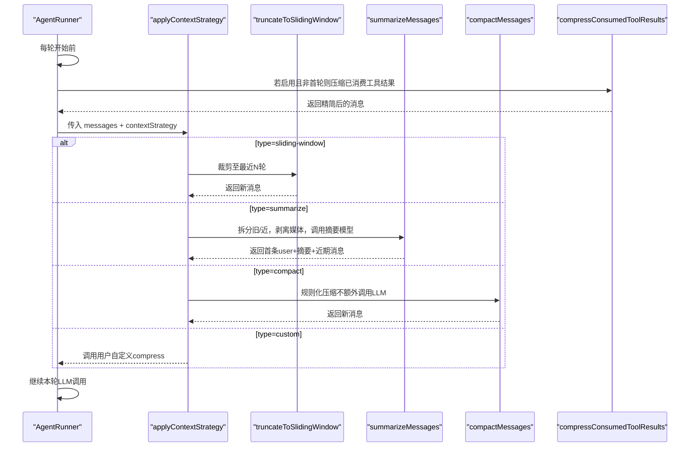
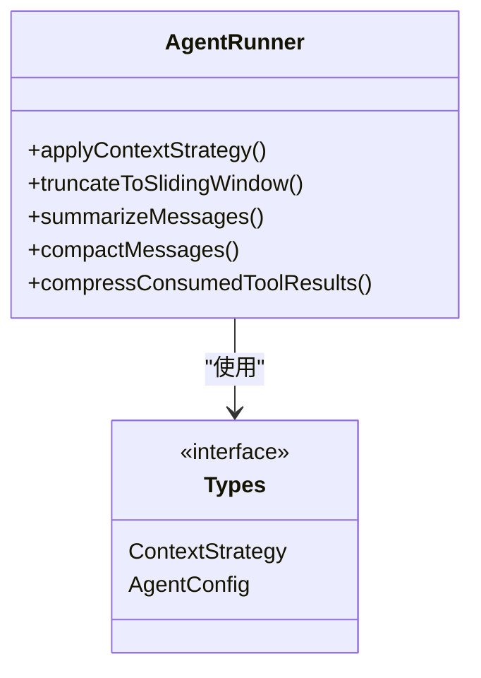

# 上下文管理

<cite>
**本文引用的文件**
- [packages/core/src/agent/runner.ts](file://packages/core/src/agent/runner.ts)
- [packages/core/src/types.ts](file://packages/core/src/types.ts)
- [docs/context-management.md](file://docs/context-management.md)
</cite>

## 目录
1. [简介](#简介)
2. [项目结构](#项目结构)
3. [核心组件](#核心组件)
4. [架构总览](#架构总览)
5. [详细组件分析](#详细组件分析)
6. [依赖关系分析](#依赖关系分析)
7. [性能与内存优化建议](#性能与内存优化建议)
8. [故障排查指南](#故障排查指南)
9. [结论](#结论)

## 简介
本章节系统性说明智能体执行中的上下文管理机制，重点覆盖：
- 长对话的上下文压缩策略：滑动窗口、摘要生成、规则化压缩（compact）及自定义压缩。
- ContextStrategy 的不同类型及其使用场景与配置要点。
- 消息分组机制 groupIntoTurns，确保 tool_use 与 tool_result 成对处理。
- 图片附件与媒体内容的处理与安全过滤。
- 上下文优化的最佳实践与性能调优建议。
- 内存使用监控与常见问题的定位方法。

## 项目结构
与上下文管理直接相关的代码集中在 core 包的 AgentRunner 与类型定义中，文档位于 docs/context-management.md：
- runner.ts：实现上下文策略调度、滑动窗口裁剪、摘要压缩、规则化压缩、工具结果压缩、消息分组等核心逻辑。
- types.ts：定义 ContextStrategy 联合类型、AgentConfig 相关字段（如 contextStrategy、compressToolResults、maxToolOutputChars 等）。
- docs/context-management.md：面向用户的策略选择、工具结果压缩、推理文本保留等使用说明。

图表来源
- [packages/core/src/agent/runner.ts:492-505](file://packages/core/src/agent/runner.ts#L492-L505)
- [packages/core/src/agent/runner.ts:683-770](file://packages/core/src/agent/runner.ts#L683-L770)
- [packages/core/src/agent/runner.ts:773-805](file://packages/core/src/agent/runner.ts#L773-L805)
- [packages/core/src/agent/runner.ts:1576-1698](file://packages/core/src/agent/runner.ts#L1576-L1698)
- [packages/core/src/agent/runner.ts:331-359](file://packages/core/src/agent/runner.ts#L331-L359)
- [packages/core/src/agent/runner.ts:375-390](file://packages/core/src/agent/runner.ts#L375-L390)
- [packages/core/src/agent/runner.ts:1710-1732](file://packages/core/src/agent/runner.ts#L1710-L1732)

章节来源
- [packages/core/src/agent/runner.ts:492-505](file://packages/core/src/agent/runner.ts#L492-L505)
- [packages/core/src/agent/runner.ts:683-770](file://packages/core/src/agent/runner.ts#L683-L770)
- [packages/core/src/agent/runner.ts:773-805](file://packages/core/src/agent/runner.ts#L773-L805)
- [packages/core/src/agent/runner.ts:1576-1698](file://packages/core/src/agent/runner.ts#L1576-L1698)
- [packages/core/src/agent/runner.ts:331-359](file://packages/core/src/agent/runner.ts#L331-L359)
- [packages/core/src/agent/runner.ts:375-390](file://packages/core/src/agent/runner.ts#L375-L390)
- [packages/core/src/agent/runner.ts:1710-1732](file://packages/core/src/agent/runner.ts#L1710-L1732)
- [docs/context-management.md:1-114](file://docs/context-management.md#L1-L114)

## 核心组件
- 上下文策略调度器 applyContextStrategy：根据 strategy.type 路由到具体实现；支持 sliding-window、summarize、compact、custom。
- 滑动窗口 truncateToSlidingWindow：保留最近 N 轮（每轮包含 assistant 与 user 配对），丢弃更早历史，成本最低。
- 摘要压缩 summarizeMessages：将旧对话部分序列化为文本，调用摘要模型生成摘要，替换旧内容；在序列化前剥离图片与媒体数据，避免 token 膨胀。
- 规则化压缩 compactMessages：不额外调用 LLM，按规则截断长文本、替换大工具结果、保留决策（tool_use）、错误结果与最近若干轮。
- 工具结果压缩 compressConsumedToolResults：对已被助手消费过的工具结果进行标记替换，释放上下文预算。
- 消息分组 groupIntoTurns：将消息流划分为“轮次”，保证 tool_use 与其对应的 tool_result 在同一组内，便于后续处理与压缩。
- 媒体安全过滤 stripImageBlocksForSummary：在摘要前将 image/tool_result 中的二进制或 URL 引用替换为占位文本，防止泄露与超限。

章节来源
- [packages/core/src/agent/runner.ts:773-805](file://packages/core/src/agent/runner.ts#L773-L805)
- [packages/core/src/agent/runner.ts:492-505](file://packages/core/src/agent/runner.ts#L492-L505)
- [packages/core/src/agent/runner.ts:683-770](file://packages/core/src/agent/runner.ts#L683-L770)
- [packages/core/src/agent/runner.ts:1576-1698](file://packages/core/src/agent/runner.ts#L1576-L1698)
- [packages/core/src/agent/runner.ts:1710-1732](file://packages/core/src/agent/runner.ts#L1710-L1732)
- [packages/core/src/agent/runner.ts:331-359](file://packages/core/src/agent/runner.ts#L331-L359)
- [packages/core/src/agent/runner.ts:375-390](file://packages/core/src/agent/runner.ts#L375-L390)

## 架构总览
下图展示一次 agent 运行中上下文管理的调用顺序与关键分支：

图表来源
- [packages/core/src/agent/runner.ts:1153-1170](file://packages/core/src/agent/runner.ts#L1153-L1170)
- [packages/core/src/agent/runner.ts:773-805](file://packages/core/src/agent/runner.ts#L773-L805)
- [packages/core/src/agent/runner.ts:492-505](file://packages/core/src/agent/runner.ts#L492-L505)
- [packages/core/src/agent/runner.ts:683-770](file://packages/core/src/agent/runner.ts#L683-L770)
- [packages/core/src/agent/runner.ts:1576-1698](file://packages/core/src/agent/runner.ts#L1576-L1698)
- [packages/core/src/agent/runner.ts:1710-1732](file://packages/core/src/agent/runner.ts#L1710-L1732)

## 详细组件分析

### 上下文策略类型与配置（ContextStrategy）
- sliding-window：仅保留最近 N 轮，适合最省 token 的场景。
- summarize：将旧对话摘要化，适合需要保留历史语义但受限于 token 上限的场景；需配置摘要模型与目标 maxTokens。
- compact：基于规则的本地压缩，不额外调用 LLM；可配置保留最近轮数、文本块阈值、工具结果阈值等。
- custom：提供自定义 compress(messages, estimatedTokens) 回调，用于特殊业务需求。

配置入口与行为见 AgentConfig 与文档说明。

章节来源
- [packages/core/src/types.ts:192-219](file://packages/core/src/types.ts#L192-L219)
- [docs/context-management.md:1-23](file://docs/context-management.md#L1-L23)

### 滑动窗口（sliding-window）
- 实现要点：从尾部累积“轮次”（assistant+user 配对），直到达到 maxTurns 对应的消息数量；始终保留第一条 user 消息。
- 适用场景：对历史语义要求不高、追求最低开销的长对话。

章节来源
- [packages/core/src/agent/runner.ts:492-505](file://packages/core/src/agent/runner.ts#L492-L505)

### 摘要生成（summarize）
- 流程：
  - 估算 token，若未超过阈值或消息过少则跳过。
  - 以第一条 user 为锚点，将后续消息按偶数边界切分为“旧部分”和“近期部分”。
  - 对旧部分执行 stripImageBlocksForSummary，避免图片/媒体 base64 进入摘要提示词。
  - 调用摘要模型生成摘要，并将摘要作为合成前缀插入到第一条 user 之后。
  - 缓存旧部分签名，重复时直接复用摘要，减少重复计算。
- 关键点：
  - 严格保持 tool_use/tool_result 成对，避免破坏 API 契约。
  - 通过占位符保留“曾有媒体”的线索，使摘要仍可提及媒体。

章节来源
- [packages/core/src/agent/runner.ts:683-770](file://packages/core/src/agent/runner.ts#L683-L770)
- [packages/core/src/agent/runner.ts:375-390](file://packages/core/src/agent/runner.ts#L375-L390)

### 规则化压缩（compact）
- 原则：
  - 始终保留 tool_use（决策）。
  - 对长 tool_result 用紧凑标记替换。
  - 对长 assistant 文本块截取头尾片段并标注长度。
  - 错误 tool_result 不被压缩。
  - 最近 preserveRecentTurns 轮完整保留。
- 参数：
  - maxTokens：触发压缩的阈值。
  - preserveRecentTurns：保留最近轮数。
  - minToolResultChars/minTextBlockChars/textBlockExcerptChars：控制压缩粒度与保留片段大小。
- 优势：无需额外 LLM 调用，成本低、可控性强。

章节来源
- [packages/core/src/agent/runner.ts:1576-1698](file://packages/core/src/agent/runner.ts#L1576-L1698)

### 消息分组（groupIntoTurns）
- 目的：将消息流划分为“轮次”，确保 assistant 的 tool_use 与其对应的 tool_result 在同一组内，避免被误删或错位。
- 行为：
  - 扫描消息，遇到 assistant 含 tool_use 时，向前推进并吸收紧随其后的 user 含 tool_result 的消息。
  - 其他消息各自成一组。
- 价值：为后续压缩、摘要、统计提供稳定的“轮”边界。

章节来源
- [packages/core/src/agent/runner.ts:331-359](file://packages/core/src/agent/runner.ts#L331-L359)

### 图片附件与媒体内容的安全过滤
- 问题：image 与 rich tool_result 中的 base64/URL 会显著增加 token 并可能泄露敏感数据。
- 方案：
  - stripImageBlocksForSummary：在摘要前将 image 替换为文本占位，将 tool_result 中的媒体内容剥离为最小描述。
  - compact 模式也会将旧轮次的 image 替换为紧凑标记。
- 效果：既保护隐私又避免 token 爆炸，同时让摘要仍能引用“存在媒体”的事实。

章节来源
- [packages/core/src/agent/runner.ts:375-390](file://packages/core/src/agent/runner.ts#L375-L390)
- [packages/core/src/agent/runner.ts:1649-1653](file://packages/core/src/agent/runner.ts#L1649-L1653)

### 工具结果压缩（compressToolResults）
- 作用：对已被助手消费过的工具结果进行标记替换，释放上下文预算。
- 规则：
  - 仅在多轮且非首轮时生效。
  - 错误结果从不压缩。
  - 可通过 minChars 控制阈值。
  - 与 contextStrategy 配合使用，优先轻量压缩再走策略。
- 注意：最新一轮携带 tool_result 的用户消息保持完整，因为即将被 LLM 看到。

章节来源
- [docs/context-management.md:24-55](file://docs/context-management.md#L24-L55)
- [packages/core/src/types.ts:1118-1132](file://packages/core/src/types.ts#L1118-L1132)
- [packages/core/src/agent/runner.ts:1710-1732](file://packages/core/src/agent/runner.ts#L1710-L1732)
- [packages/core/src/agent/runner.ts:1153-1170](file://packages/core/src/agent/runner.ts#L1153-L1170)

### 推理文本跨提供者保留（preserveReasoningAsText）
- 背景：不同提供商对推理/思考块的回显能力不同，默认会静默丢弃不可回显的推理块。
- 选项：
  - preserveReasoningAsText：将不可回显的推理块降级为 <thinking> 文本并前置到下一条 assistant 文本。
  - compressReasoningText：对推理文本进行头尾截取，避免超长链式思考撑爆上下文。
- 影响：开启后会增加 prompt 体积，需谨慎评估；某些本地兼容模型可能将 <thinking> 当作指令导致循环检测误报。

章节来源
- [docs/context-management.md:74-114](file://docs/context-management.md#L74-L114)
- [packages/core/src/types.ts:1133-1185](file://packages/core/src/types.ts#L1133-L1185)

## 依赖关系分析
- AgentRunner 是上下文管理的核心，依赖：
  - LLMAdapter：用于摘要模型的调用。
  - ToolRegistry/ToolExecutor：工具执行与结果收集（间接影响上下文增长）。
  - 类型定义（types.ts）：ContextStrategy、AgentConfig 等约束了策略与配置。
- 内部函数协作：
  - applyContextStrategy 统一分发到具体策略。
  - groupIntoTurns 为策略提供轮次边界。
  - stripImageBlocksForSummary 保障摘要安全。
  - compressConsumedToolResults 与 compact 共同降低工具结果占用。

图表来源
- [packages/core/src/agent/runner.ts:773-805](file://packages/core/src/agent/runner.ts#L773-L805)
- [packages/core/src/types.ts:192-219](file://packages/core/src/types.ts#L192-L219)
- [packages/core/src/types.ts:1014-1132](file://packages/core/src/types.ts#L1014-L1132)

章节来源
- [packages/core/src/agent/runner.ts:773-805](file://packages/core/src/agent/runner.ts#L773-L805)
- [packages/core/src/types.ts:192-219](file://packages/core/src/types.ts#L192-L219)
- [packages/core/src/types.ts:1014-1132](file://packages/core/src/types.ts#L1014-L1132)

## 性能与内存优化建议
- 选择合适的策略：
  - 低成本优先：sliding-window 或 compact（无额外 LLM 调用）。
  - 需要历史语义：summarize，合理设置 maxTokens 与 summaryModel。
- 组合使用：
  - 先启用 compressToolResults 减少工具结果占用，再结合 contextStrategy 获得更大上下文空间。
- 控制输出尺寸：
  - 使用 maxToolOutputChars 限制单条工具输出的原始长度，避免一次性塞入大量文本。
- 媒体安全：
  - 始终信任 stripImageBlocksForSummary 的保护；如需自定义摘要，也应遵循相同原则。
- 推理文本：
  - 谨慎开启 preserveReasoningAsText；若开启，务必启用 compressReasoningText 以避免超长推理阻塞上下文。
- 监控与调优：
  - 关注每轮 token 使用量（input/output），结合策略日志判断是否频繁触发压缩。
  - 调整 preserveRecentTurns、minTextBlockChars、minToolResultChars 等阈值，平衡“信息保留”与“token 消耗”。

[本节为通用指导，不直接分析具体文件]

## 故障排查指南
- 症状：上下文很快耗尽
  - 检查是否启用了 compressToolResults 且阈值合适。
  - 确认 contextStrategy 是否按预期工作（查看是否命中 summarize/compact）。
  - 核查是否存在超大 tool_result 或图片未剥离。
- 症状：摘要后丢失关键信息
  - 增大 summarize 的 maxTokens 或提高 preserveRecentTurns。
  - 检查 splitAt 切分是否合理（内部已按偶数边界切分，避免分离 tool_use/tool_result）。
- 症状：工具结果未被压缩
  - 确认当前轮次 > 1 且结果不是错误类型。
  - 检查 minChars 阈值是否过高。
- 症状：推理文本丢失或被拒绝
  - 若跨提供商，考虑开启 preserveReasoningAsText 并启用 compressReasoningText。
  - 针对 DeepSeek 等“仅工具调用”能力，理解其强制行为与限制。
- 症状：本地模型将 <thinking> 当指令导致循环
  - 参考示例与文档说明，调整 loopDetection 或关闭该特性调试。

章节来源
- [docs/context-management.md:24-114](file://docs/context-management.md#L24-L114)
- [packages/core/src/agent/runner.ts:1153-1170](file://packages/core/src/agent/runner.ts#L1153-L1170)
- [packages/core/src/agent/runner.ts:1710-1732](file://packages/core/src/agent/runner.ts#L1710-L1732)
- [packages/core/src/agent/runner.ts:683-770](file://packages/core/src/agent/runner.ts#L683-L770)

## 结论
该框架提供了多层次、可组合的上下文管理机制：
- 通过 sliding-window、summarize、compact、custom 四种策略覆盖不同场景。
- 借助 groupIntoTurns 保证 tool_use/tool_result 的完整性，避免破坏 API 契约。
- 通过 stripImageBlocksForSummary 与 compressToolResults 有效抑制媒体与工具结果带来的 token 膨胀。
- 提供跨提供商推理文本的降级与压缩能力，兼顾可用性与安全性。
实践中建议以“轻量压缩 + 规则化策略”为主，必要时引入摘要策略，并结合监控持续调优阈值，以获得稳定高效的长对话体验。