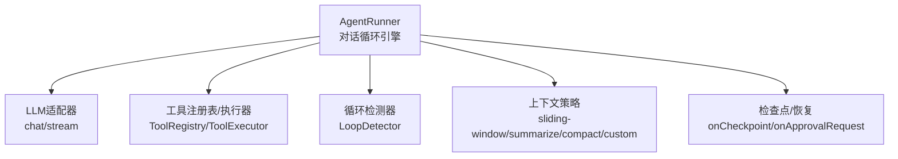
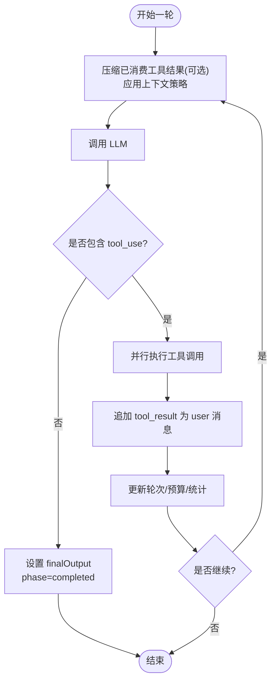
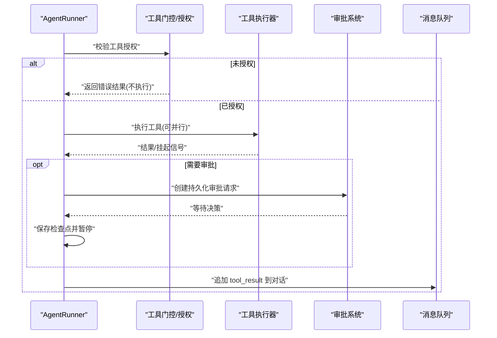
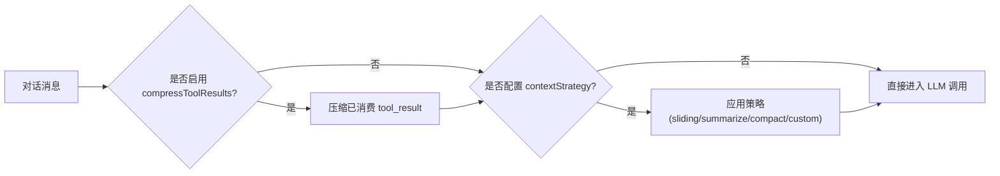
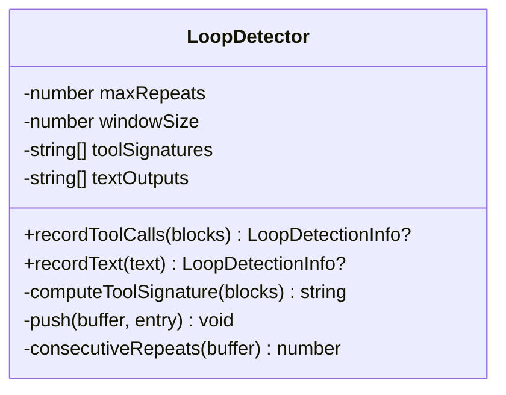
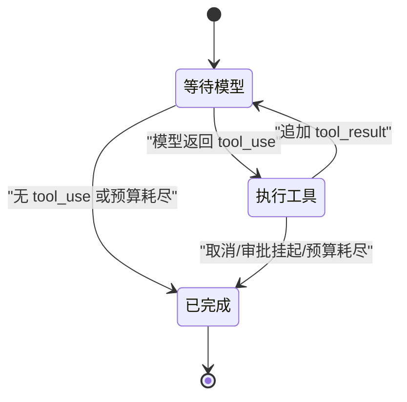
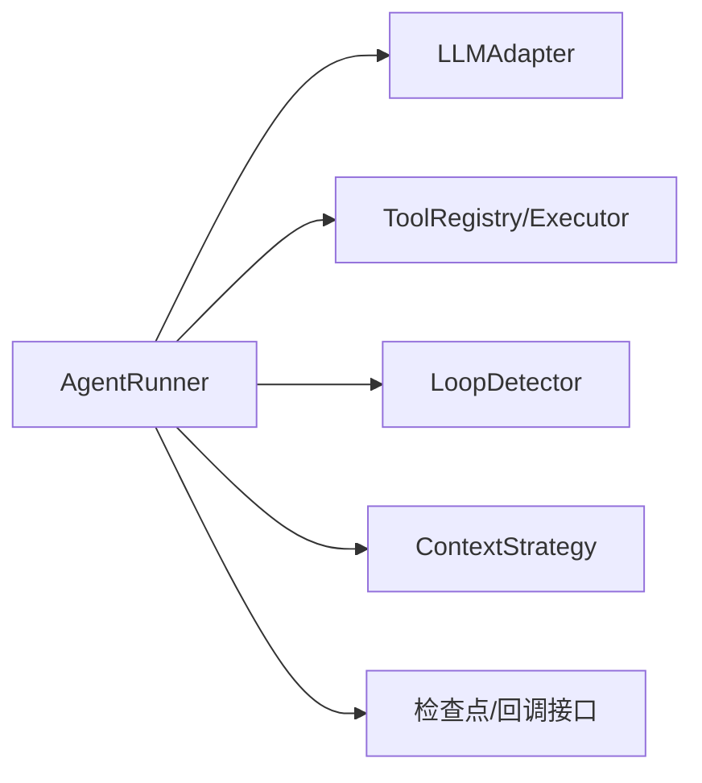

# 对话循环机制

<cite>
**本文引用的文件**
- [packages/core/src/agent/runner.ts](file://packages/core/src/agent/runner.ts)
- [packages/core/src/agent/loop-detector.ts](file://packages/core/src/agent/loop-detector.ts)
- [packages/core/src/types.ts](file://packages/core/src/types.ts)
- [docs/context-management.md](file://docs/context-management.md)
</cite>

## 目录
1. [简介](#简介)
2. [项目结构](#项目结构)
3. [核心组件](#核心组件)
4. [架构总览](#架构总览)
5. [详细组件分析](#详细组件分析)
6. [依赖关系分析](#依赖关系分析)
7. [性能考虑](#性能考虑)
8. [故障排查指南](#故障排查指南)
9. [结论](#结论)
10. [附录](#附录)

## 简介
本文聚焦智能体的“对话循环执行机制”，围绕 while(true) 主循环、每轮（turn）的执行流程、工具调用处理、消息管理策略、循环检测与状态管理，以及调试与性能优化建议进行系统化说明。该机制由 AgentRunner 驱动，负责将消息发送给 LLM、解析响应、提取并执行工具调用、追加结果，并在满足终止条件或达到限制时结束循环。

## 项目结构
本主题涉及的核心代码位于 @open-multi-agent/core 的 agent 子系统：
- 对话循环与工具执行：AgentRunner（runner.ts）
- 循环检测：LoopDetector（loop-detector.ts）
- 类型与上下文策略定义：types.ts
- 上下文压缩与工具结果压缩文档：context-management.md



图表来源
- [packages/core/src/agent/runner.ts:986-1320](file://packages/core/src/agent/runner.ts#L986-L1320)
- [packages/core/src/agent/loop-detector.ts:33-92](file://packages/core/src/agent/loop-detector.ts#L33-L92)
- [packages/core/src/types.ts:191-219](file://packages/core/src/types.ts#L191-L219)

章节来源
- [packages/core/src/agent/runner.ts:986-1320](file://packages/core/src/agent/runner.ts#L986-L1320)
- [packages/core/src/agent/loop-detector.ts:33-92](file://packages/core/src/agent/loop-detector.ts#L33-L92)
- [packages/core/src/types.ts:191-219](file://packages/core/src/types.ts#L191-L219)
- [docs/context-management.md:24-55](file://docs/context-management.md#L24-L55)

## 核心组件
- AgentRunner：实现 while(true) 主循环，协调 LLM 调用、工具执行、上下文压缩、预算与循环检测、检查点持久化。
- LoopDetector：基于滑动窗口记录历史工具调用签名与文本输出，检测重复行为并触发告警或终止。
- ContextStrategy：提供多种上下文压缩策略（滑动窗口、摘要、规则压缩、自定义）。
- 运行选项与类型：包含 maxTurns、maxTokenBudget、loopDetection、compressToolResults、contextStrategy 等关键配置。

章节来源
- [packages/core/src/agent/runner.ts:472-486](file://packages/core/src/agent/runner.ts#L472-L486)
- [packages/core/src/agent/loop-detector.ts:33-92](file://packages/core/src/agent/loop-detector.ts#L33-L92)
- [packages/core/src/types.ts:191-219](file://packages/core/src/types.ts#L191-L219)
- [packages/core/src/types.ts:1092-1118](file://packages/core/src/types.ts#L1092-L1118)

## 架构总览
下图展示一轮对话从进入循环到结束的完整时序，包括 LLM 调用、工具调用、结果回写、上下文压缩与循环检测。

```mermaid
sequenceDiagram
participant R as "AgentRunner"
participant L as "LLM适配器"
participant T as "工具执行器"
participant D as "循环检测器"
participant CK as "检查点/回调"
R->>CK : "保存阶段状态(等待模型)"
R->>R : "上下文压缩/滑动窗口/摘要"
R->>L : "发送消息(含工具定义)"
L-->>R : "返回响应(文本/工具调用)"
R->>D : "记录本轮工具调用/文本"
alt 检测到循环
R-->>R : "注入警告/终止"
end
opt 存在工具调用
R->>T : "并行执行工具调用"
T-->>R : "返回工具结果/授权挂起"
R->>CK : "提交检查点/审批请求"
R->>R : "追加tool_result到对话"
else 无工具调用
R->>R : "标记完成(最终输出)"
end
R-->>R : "更新轮次/预算/统计"
```

图表来源
- [packages/core/src/agent/runner.ts:1146-1320](file://packages/core/src/agent/runner.ts#L1146-L1320)
- [packages/core/src/agent/runner.ts:1217-1319](file://packages/core/src/agent/runner.ts#L1217-L1319)
- [packages/core/src/agent/runner.ts:986-1000](file://packages/core/src/agent/runner.ts#L986-L1000)
- [packages/core/src/agent/loop-detector.ts:47-92](file://packages/core/src/agent/loop-detector.ts#L47-L92)

## 详细组件分析

### while(true) 主循环与轮次流程
- 入口与阶段：stream() 维护 conversationMessages、newMessages、totalUsage、turns、phase 等状态；phase 在 awaiting_model / executing_tools / completed 之间切换。
- 每轮步骤：
  1) 在进入 LLM 调用前，先对已消费的工具结果进行轻量压缩（可选），再按 contextStrategy 进行上下文压缩。
  2) 调用 LLM，收集响应，累计 token 使用量，构造 assistant 消息并追加到对话。
  3) 若响应包含 tool_use，则进入工具执行阶段；否则视为终轮，设置 finalOutput 并结束。
  4) 工具执行完成后，将 tool_result 作为 user 消息追加，继续下一轮。
- 终止条件：
  - end_turn：当模型未请求任何工具调用时，认为本轮为终轮。
  - maxTurns：当 turns >= maxTurns 时强制退出。
  - 预算超限：当 input_tokens + output_tokens > maxTokenBudget 时，发出 budget_exceeded 事件并结束。
  - 循环检测：根据 onLoopDetected 动作决定 terminate/warn/inject/continue。
  - 取消/中断：abortSignal 触发时中止。



图表来源
- [packages/core/src/agent/runner.ts:1146-1320](file://packages/core/src/agent/runner.ts#L1146-L1320)
- [packages/core/src/agent/runner.ts:1201-1215](file://packages/core/src/agent/runner.ts#L1201-L1215)
- [packages/core/src/agent/runner.ts:1273-1305](file://packages/core/src/agent/runner.ts#L1273-L1305)

章节来源
- [packages/core/src/agent/runner.ts:877-946](file://packages/core/src/agent/runner.ts#L877-L946)
- [packages/core/src/agent/runner.ts:1146-1320](file://packages/core/src/agent/runner.ts#L1146-L1320)
- [packages/core/src/agent/runner.ts:1201-1305](file://packages/core/src/agent/runner.ts#L1201-L1305)

### 工具调用处理
- 工具发现与授权：通过 resolveTools 生成工具定义；默认拒绝未授权的内置工具。
- 执行与并发：pendingToolCalls 中的多个工具调用可并行执行；每个执行产出 commit 记录（result、record、duration、delegationUsage 等）。
- 审批与挂起：工具门控可能要求“持久化审批”（durable approval），此时会创建 ApprovalRequest 并暂停执行，直到决策到达后继续。
- 结果回写：所有 tool_result 以 user 消息形式追加到对话，供下一轮 LLM 参考；同时流式事件 tool_use/tool_result 对外暴露。
- 预算与委派：委派调用产生的 token 使用会计入当前轮预算；超过阈值即触发预算超限。



图表来源
- [packages/core/src/agent/runner.ts:1364-1545](file://packages/core/src/agent/runner.ts#L1364-L1545)
- [packages/core/src/agent/runner.ts:993-1137](file://packages/core/src/agent/runner.ts#L993-L1137)

章节来源
- [packages/core/src/agent/runner.ts:993-1137](file://packages/core/src/agent/runner.ts#L993-L1137)
- [packages/core/src/agent/runner.ts:1364-1545](file://packages/core/src/agent/runner.ts#L1364-L1545)

### 消息管理与上下文策略
- 消息累积：conversationMessages 保存完整对话历史；newMessages 仅保留本轮新增消息用于结果返回。
- 已消费工具结果压缩：compressToolResults 可在每轮开始前替换已被后续 assistant 响应的 tool_result 为短标记，减少上下文占用。
- 上下文策略：
  - sliding-window：保留最近 N 轮，丢弃更早历史。
  - summarize：用摘要模型压缩旧历史，保留近端对话。
  - compact：规则压缩，截断长文本与大工具结果，保留近期 turn pair。
  - custom：自定义 compress 函数。
- 策略选择：applyContextStrategy 根据 strategy.type 分发到对应实现；每次 LLM 调用前都会评估是否需要压缩。



图表来源
- [packages/core/src/agent/runner.ts:1153-1170](file://packages/core/src/agent/runner.ts#L1153-L1170)
- [packages/core/src/agent/runner.ts:773-805](file://packages/core/src/agent/runner.ts#L773-L805)
- [packages/core/src/agent/runner.ts:1566-1636](file://packages/core/src/agent/runner.ts#L1566-L1636)
- [docs/context-management.md:24-55](file://docs/context-management.md#L24-L55)

章节来源
- [packages/core/src/agent/runner.ts:1153-1170](file://packages/core/src/agent/runner.ts#L1153-L1170)
- [packages/core/src/agent/runner.ts:773-805](file://packages/core/src/agent/runner.ts#L773-L805)
- [packages/core/src/agent/runner.ts:1566-1636](file://packages/core/src/agent/runner.ts#L1566-L1636)
- [docs/context-management.md:24-55](file://docs/context-management.md#L24-L55)

### 循环检测机制
- 检测目标：防止智能体陷入“重复相同工具调用或重复相同文本输出”的死循环。
- 实现方式：LoopDetector 维护滑动窗口，记录每轮工具调用签名与归一化文本；当连续重复次数达到阈值，返回检测信息。
- 动作策略：onLoopDetected 支持 terminate（立即终止）、warn（仅告警）、inject（注入警告消息并继续）、continue（忽略）。
- 二次检测保护：若同一运行中再次检测到循环，直接强制终止，避免反复注入无效提示。



图表来源
- [packages/core/src/agent/loop-detector.ts:33-92](file://packages/core/src/agent/loop-detector.ts#L33-L92)
- [packages/core/src/agent/loop-detector.ts:98-136](file://packages/core/src/agent/loop-detector.ts#L98-L136)

章节来源
- [packages/core/src/agent/loop-detector.ts:33-92](file://packages/core/src/agent/loop-detector.ts#L33-L92)
- [packages/core/src/agent/runner.ts:1217-1268](file://packages/core/src/agent/runner.ts#L1217-L1268)

### 对话状态管理与检查点
- 状态字段：phase、conversationMessages、messages、tokenUsage、toolCalls、turns、finalOutput、pendingToolCalls、pendingToolResultText、loopWarned、loopDetected、budgetExceeded。
- 检查点：在每个关键阶段（awaiting_model、executing_tools、completed）调用 onCheckpoint 持久化状态；工具执行成功后提交 commit 记录，确保恢复时不会重复执行。
- 恢复语义：resumeState 可恢复上一轮状态，从断点继续执行；未提交的工具调用会在恢复后重新执行。



图表来源
- [packages/core/src/agent/runner.ts:877-946](file://packages/core/src/agent/runner.ts#L877-L946)
- [packages/core/src/agent/runner.ts:1104-1137](file://packages/core/src/agent/runner.ts#L1104-L1137)
- [packages/core/src/types.ts:2510-2530](file://packages/core/src/types.ts#L2510-L2530)

章节来源
- [packages/core/src/agent/runner.ts:877-946](file://packages/core/src/agent/runner.ts#L877-L946)
- [packages/core/src/agent/runner.ts:1104-1137](file://packages/core/src/agent/runner.ts#L1104-L1137)
- [packages/core/src/types.ts:2510-2530](file://packages/core/src/types.ts#L2510-L2530)

## 依赖关系分析
- AgentRunner 依赖：
  - LLMAdapter：封装 chat/stream 调用，支持超时合并与追踪。
  - ToolRegistry/ToolExecutor：工具注册与执行，支持授权、门控、委派。
  - LoopDetector：循环检测。
  - ContextStrategy：上下文压缩策略。
  - 检查点/回调：onCheckpoint、onToolCall、onToolResult、onWarning、onMessage、onApprovalRequest 等。
- 外部耦合：
  - 预算控制：maxTokenBudget 影响每轮与委派调用的累计使用。
  - 工具结果压缩：compressToolResults 降低历史占用。
  - 推理块处理：preserveReasoningAsText/compressReasoningText 影响跨提供商推理回传。



图表来源
- [packages/core/src/agent/runner.ts:948-965](file://packages/core/src/agent/runner.ts#L948-L965)
- [packages/core/src/agent/runner.ts:1153-1170](file://packages/core/src/agent/runner.ts#L1153-L1170)
- [packages/core/src/agent/runner.ts:1217-1268](file://packages/core/src/agent/runner.ts#L1217-L1268)

章节来源
- [packages/core/src/agent/runner.ts:948-965](file://packages/core/src/agent/runner.ts#L948-L965)
- [packages/core/src/agent/runner.ts:1153-1170](file://packages/core/src/agent/runner.ts#L1153-L1170)
- [packages/core/src/agent/runner.ts:1217-1268](file://packages/core/src/agent/runner.ts#L1217-L1268)

## 性能考虑
- 上下文压缩优先顺序：
  - 先压缩已消费工具结果（轻量、无 LLM 调用）。
  - 再应用上下文策略（滑动窗口/摘要/规则压缩/自定义）。
- 工具结果压缩：
  - 开启 compressToolResults 可减少历史占用；错误结果与委派结果不被压缩。
- 预算控制：
  - 设置 maxTokenBudget，及时触发 budget_exceeded 事件，避免无限消耗。
- 调用超时：
  - 使用 callTimeoutMs 统一每调用超时，避免个别供应商 SDK 无超时导致阻塞。
- 并行工具调用：
  - 利用 parallelToolCalls 提升吞吐；注意工具副作用与资源竞争。
- 推理块处理：
  - preserveReasoningAsText 与 compressReasoningText 可平衡跨提供商兼容性与上下文大小。

章节来源
- [packages/core/src/agent/runner.ts:1153-1170](file://packages/core/src/agent/runner.ts#L1153-L1170)
- [docs/context-management.md:24-55](file://docs/context-management.md#L24-L55)
- [packages/core/src/types.ts:1092-1118](file://packages/core/src/types.ts#L1092-L1118)

## 故障排查指南
- 常见症状与定位：
  - 无限循环：检查 loopDetection 配置与 onLoopDetected 动作；查看 loop_detected 事件与 loopWarned/loopDetected 标志。
  - 工具未执行：确认工具授权与门控；检查 onToolCall 回调与 grantedToolNames。
  - 预算超限：关注 budget_exceeded 事件与 totalTokens 计算；调整 maxTokenBudget 或上下文策略。
  - 上下文过大：启用 compressToolResults 与合适的 contextStrategy；必要时使用 summarize 策略。
- 调试方法：
  - 使用 onMessage/onToolCall/onToolResult/onWarning 回调观察中间状态。
  - 启用检查点 with onCheckpoint，结合 resumeState 恢复断点。
  - 使用 tracing（traceRuntime/traceSpan）记录 LLM 调用与工具执行耗时。
- 恢复与重试：
  - 未提交的工具调用在恢复后会重放；已提交的 commit 记录避免重复执行。
  - 审批挂起（suspended）时，等待 onApprovalRequest 决策后再继续。

章节来源
- [packages/core/src/agent/runner.ts:1217-1268](file://packages/core/src/agent/runner.ts#L1217-L1268)
- [packages/core/src/agent/runner.ts:1364-1545](file://packages/core/src/agent/runner.ts#L1364-L1545)
- [packages/core/src/agent/runner.ts:877-946](file://packages/core/src/agent/runner.ts#L877-L946)

## 结论
AgentRunner 的 while(true) 主循环提供了健壮的智能体对话执行框架：通过明确的轮次划分、工具调用处理、上下文压缩、循环检测与预算控制，确保在复杂任务下仍可稳定运行。配合检查点与审批机制，可实现可恢复、可审计的生产级智能体执行。合理配置上下文策略与工具授权，并结合监控与调试手段，可进一步提升效率与可靠性。

## 附录
- 关键配置项速查：
  - maxTurns：最大轮次限制。
  - maxTokenBudget：每轮/委派累计 token 预算。
  - loopDetection：循环检测开关与动作。
  - compressToolResults：已消费工具结果压缩。
  - contextStrategy：上下文压缩策略。
  - callTimeoutMs：单次 LLM 调用超时。
  - preserveReasoningAsText/compressReasoningText：推理块回传与压缩。

章节来源
- [packages/core/src/types.ts:191-219](file://packages/core/src/types.ts#L191-L219)
- [packages/core/src/types.ts:1092-1118](file://packages/core/src/types.ts#L1092-L1118)
- [docs/context-management.md:24-55](file://docs/context-management.md#L24-L55)