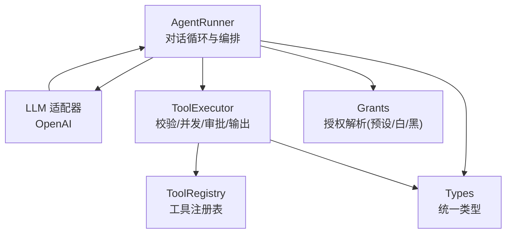
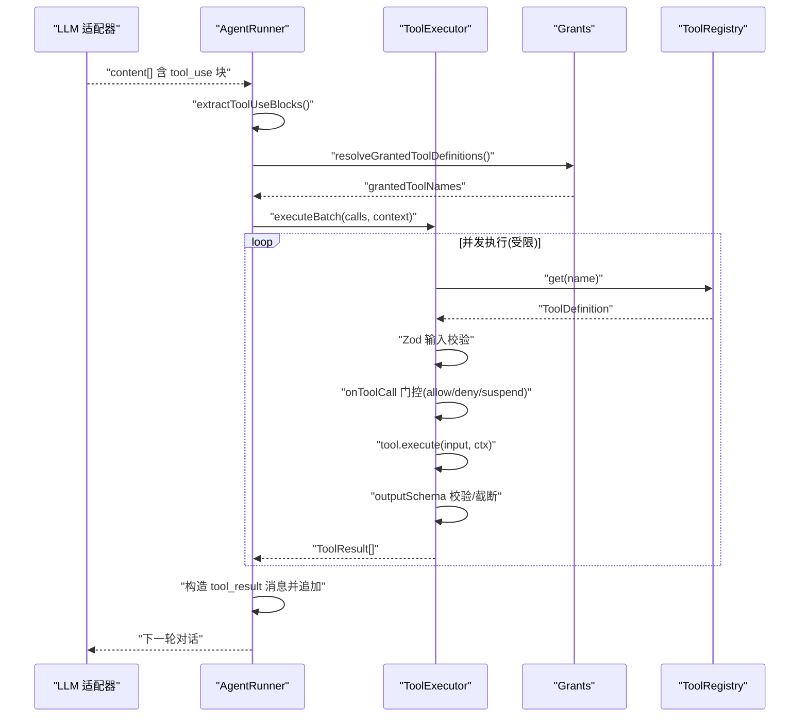
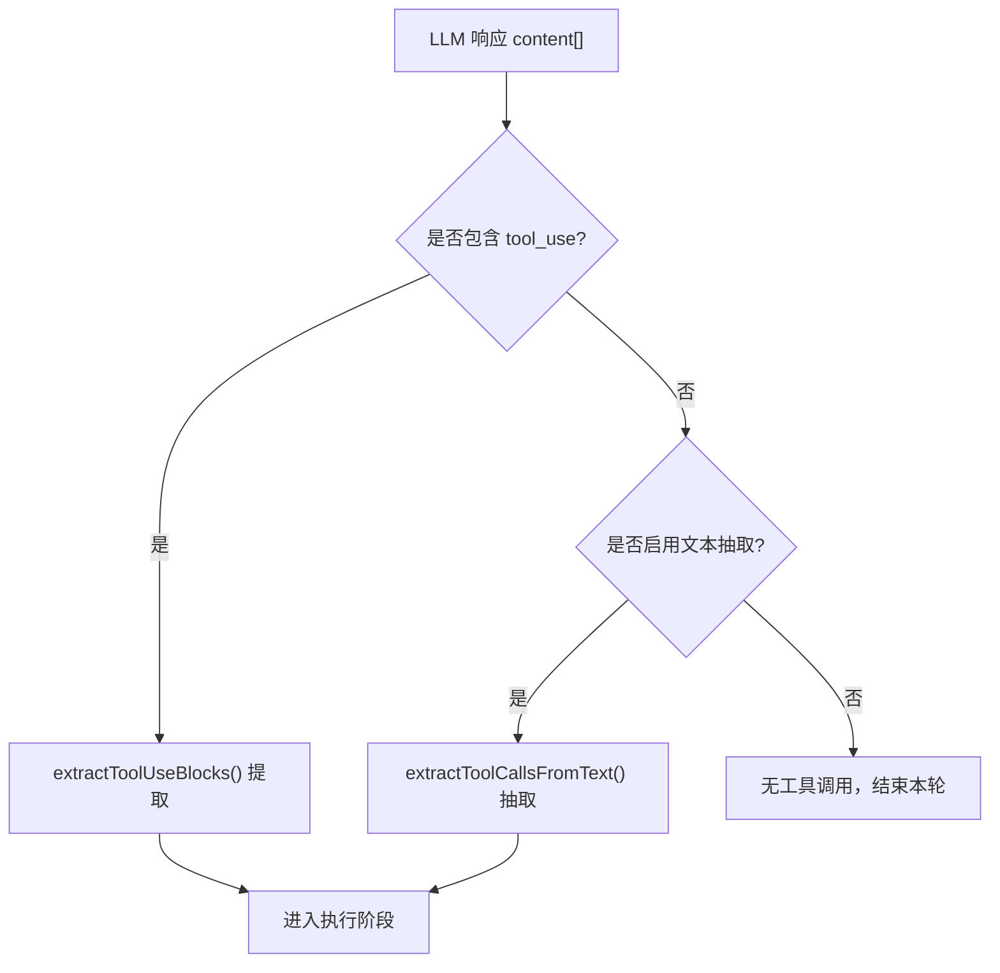
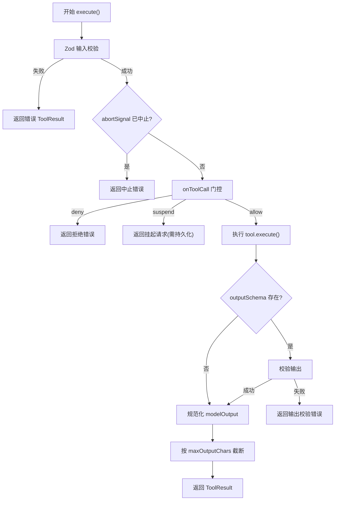
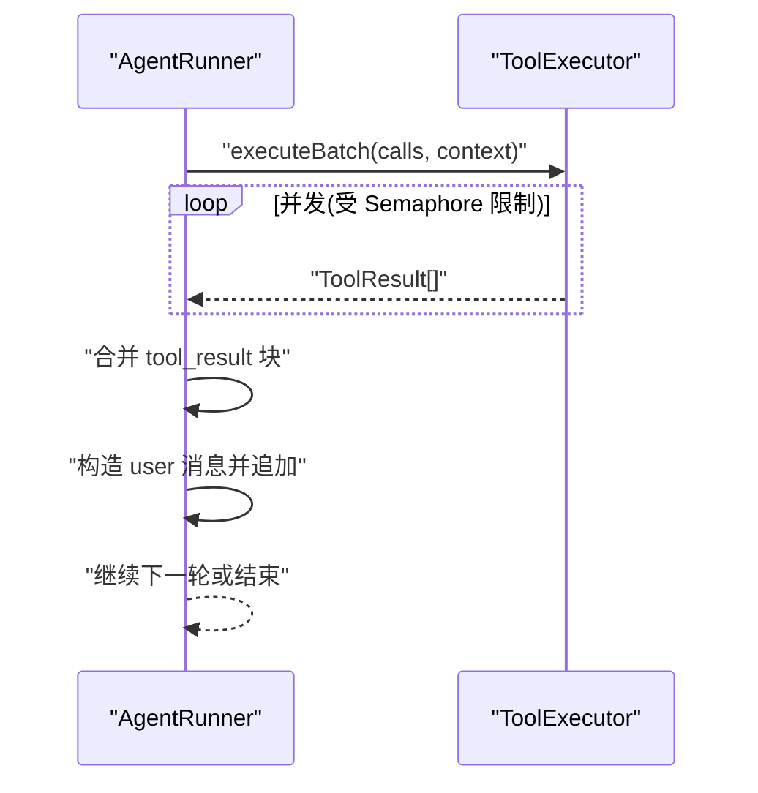
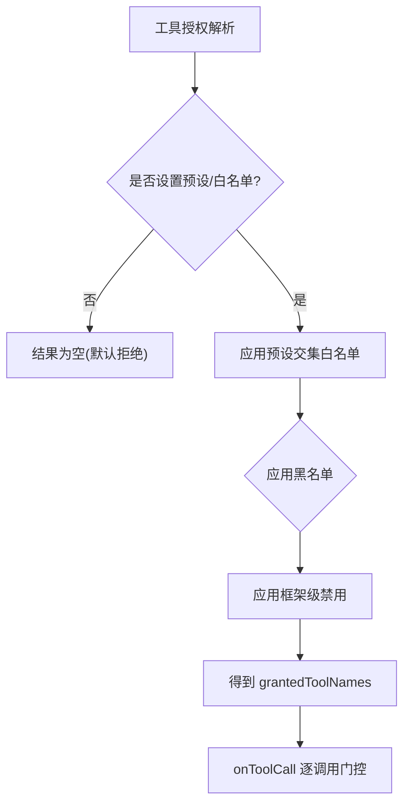
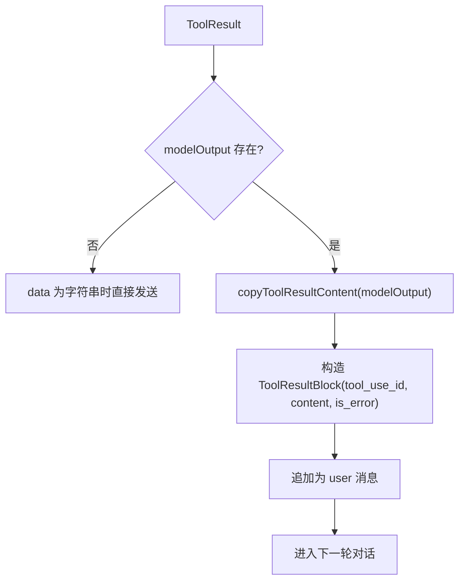
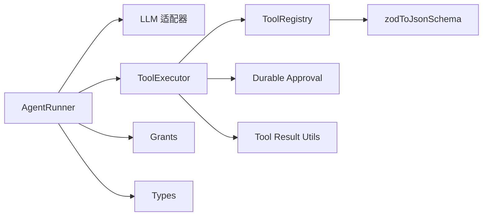

# 工具调用集成

<cite>
**本文引用的文件**
- [packages/core/src/agent/runner.ts](file://packages/core/src/agent/runner.ts)
- [packages/core/src/tool/executor.ts](file://packages/core/src/tool/executor.ts)
- [packages/core/src/tool/framework.ts](file://packages/core/src/tool/framework.ts)
- [packages/core/src/tool/grants.ts](file://packages/core/src/tool/grants.ts)
- [packages/core/src/types.ts](file://packages/core/src/types.ts)
- [packages/core/src/llm/openai.ts](file://packages/core/src/llm/openai.ts)
- [docs/tool-configuration.md](file://docs/tool-configuration.md)
</cite>

## 目录
1. [简介](#简介)
2. [项目结构](#项目结构)
3. [核心组件](#核心组件)
4. [架构总览](#架构总览)
5. [详细组件分析](#详细组件分析)
6. [依赖关系分析](#依赖关系分析)
7. [性能考量](#性能考量)
8. [故障排查指南](#故障排查指南)
9. [结论](#结论)
10. [附录](#附录)

## 简介
本文件系统性说明智能体执行过程中的“工具调用集成机制”。重点覆盖：
- 从 LLM 响应中提取工具调用块（ToolUseBlock）的方式
- 通过 ToolExecutor 执行工具的完整生命周期：调用前验证、并行执行、结果收集、错误处理
- 工具权限控制与安全机制：白名单/黑名单、默认拒绝、沙箱工作目录、可恢复审批与挂起
- 工具结果的格式转换与消息追加过程
- 自定义工具开发与集成指导
- 工具调用的监控与调试方法

## 项目结构
围绕工具调用，核心代码分布在以下模块：
- AgentRunner：驱动对话循环，解析 LLM 响应中的 tool_use，组织并执行工具调用，收集结果并回写消息
- ToolExecutor：负责输入校验、并发控制、可选审批门控、输出校验与截断、错误归一化
- ToolRegistry/defineTool：工具定义、注册、JSON Schema 生成与导出
- Grants：工具授权解析（预设、白名单、黑名单、框架级禁用）
- LLM 适配器（以 OpenAI 为例）：流式拼装 tool_use 块，或从文本中抽取工具调用
- Types：统一类型定义（ToolUseBlock、ToolResult、ToolResultBlock、ToolUseContext 等）
- 文档：tool-configuration.md 提供配置、安全与最佳实践

**图表来源**
- [packages/core/src/agent/runner.ts:1217-1320](file://packages/core/src/agent/runner.ts#L1217-L1320)
- [packages/core/src/llm/openai.ts:322-385](file://packages/core/src/llm/openai.ts#L322-L385)
- [packages/core/src/tool/executor.ts:148-164](file://packages/core/src/tool/executor.ts#L148-L164)
- [packages/core/src/tool/framework.ts:127-222](file://packages/core/src/tool/framework.ts#L127-L222)
- [packages/core/src/tool/grants.ts:35-89](file://packages/core/src/tool/grants.ts#L35-L89)
- [packages/core/src/types.ts:93-138](file://packages/core/src/types.ts#L93-L138)

**章节来源**
- [packages/core/src/agent/runner.ts:1217-1320](file://packages/core/src/agent/runner.ts#L1217-L1320)
- [packages/core/src/llm/openai.ts:322-385](file://packages/core/src/llm/openai.ts#L322-L385)
- [packages/core/src/tool/executor.ts:148-164](file://packages/core/src/tool/executor.ts#L148-L164)
- [packages/core/src/tool/framework.ts:127-222](file://packages/core/src/tool/framework.ts#L127-L222)
- [packages/core/src/tool/grants.ts:35-89](file://packages/core/src/tool/grants.ts#L35-L89)
- [packages/core/src/types.ts:93-138](file://packages/core/src/types.ts#L93-L138)

## 核心组件
- AgentRunner：维护对话轮次，提取 tool_use，构建待执行队列，并行执行，收集结果并追加为 user 消息，进入下一轮
- ToolExecutor：Zod 输入校验、并发上限控制、可选 onToolCall 门控（允许/拒绝/挂起）、输出 schema 校验、结果截断、错误封装
- ToolRegistry/defineTool：声明工具、注册、转换为 LLM 可用的 JSON Schema；支持运行时动态添加
- Grants：基于预设、白名单、黑名单、框架级禁用计算最终可用工具集合
- Types：ToolUseBlock、ToolResult、ToolResultBlock、ToolUseContext 等跨层共享类型
- LLM 适配器（OpenAI）：流式聚合 tool_calls，必要时从文本中抽取工具调用，产出 ToolUseBlock

**章节来源**
- [packages/core/src/agent/runner.ts:1217-1320](file://packages/core/src/agent/runner.ts#L1217-L1320)
- [packages/core/src/tool/executor.ts:181-338](file://packages/core/src/tool/executor.ts#L181-L338)
- [packages/core/src/tool/framework.ts:71-117](file://packages/core/src/tool/framework.ts#L71-L117)
- [packages/core/src/tool/grants.ts:35-89](file://packages/core/src/tool/grants.ts#L35-L89)
- [packages/core/src/types.ts:93-138](file://packages/core/src/types.ts#L93-L138)
- [packages/core/src/llm/openai.ts:322-385](file://packages/core/src/llm/openai.ts#L322-L385)

## 架构总览
下图展示一次完整的工具调用流程：从 LLM 响应到工具执行，再到结果回写。

**图表来源**
- [packages/core/src/agent/runner.ts:1217-1320](file://packages/core/src/agent/runner.ts#L1217-L1320)
- [packages/core/src/agent/runner.ts:1082-1102](file://packages/core/src/agent/runner.ts#L1082-L1102)
- [packages/core/src/tool/executor.ts:148-164](file://packages/core/src/tool/executor.ts#L148-L164)
- [packages/core/src/tool/grants.ts:35-89](file://packages/core/src/tool/grants.ts#L35-L89)
- [packages/core/src/tool/framework.ts:153-167](file://packages/core/src/tool/framework.ts#L153-L167)

## 详细组件分析

### 从 LLM 响应中提取 ToolUseBlock
- 适配器在流式结束时聚合 tool_calls，构造 ToolUseBlock 并作为 content 的一部分返回
- 若未收到原生 tool_calls，且提供了 tools 列表，则尝试从文本中抽取工具调用
- AgentRunner 使用 extractToolUseBlocks 过滤出所有 tool_use 块，进入执行阶段

**图表来源**
- [packages/core/src/llm/openai.ts:322-385](file://packages/core/src/llm/openai.ts#L322-L385)
- [packages/core/src/agent/runner.ts:1217-1320](file://packages/core/src/agent/runner.ts#L1217-L1320)

**章节来源**
- [packages/core/src/llm/openai.ts:322-385](file://packages/core/src/llm/openai.ts#L322-L385)
- [packages/core/src/agent/runner.ts:1217-1320](file://packages/core/src/agent/runner.ts#L1217-L1320)

### ToolExecutor 执行生命周期
- 输入校验：使用 Zod schema 校验参数，失败返回结构化错误
- 取消信号：在执行前后检查 abortSignal，避免无效执行
- 审批门控：
  - 支持 onToolCall 钩子，返回 allow/deny/suspend
  - 支持持久化审批（checkpoint + MemoryStore），用于恢复后重放
- 执行与输出校验：调用工具实现，非错误结果按 outputSchema 校验
- 结果规范化与截断：统一 modelOutput 格式，按 maxOutputChars 截断
- 错误隔离：任何异常被捕获为 isError 的 ToolResult，不中断批次

**图表来源**
- [packages/core/src/tool/executor.ts:181-338](file://packages/core/src/tool/executor.ts#L181-L338)
- [packages/core/src/tool/executor.ts:359-379](file://packages/core/src/tool/executor.ts#L359-L379)

**章节来源**
- [packages/core/src/tool/executor.ts:181-338](file://packages/core/src/tool/executor.ts#L181-L338)
- [packages/core/src/tool/executor.ts:359-379](file://packages/core/src/tool/executor.ts#L359-L379)

### 并行执行与结果收集
- AgentRunner 将 pendingToolCalls 转为 Promise.all 并行执行，受 ToolExecutor 内部 Semaphore 限制并发
- 每个执行项产出 commit.result（ToolResultBlock）和记录，统一收集后构造 user 消息追加到对话历史
- 若存在未提交（如挂起）的执行，会持久化检查点并暂停本轮

**图表来源**
- [packages/core/src/agent/runner.ts:990-1102](file://packages/core/src/agent/runner.ts#L990-L1102)
- [packages/core/src/tool/executor.ts:148-164](file://packages/core/src/tool/executor.ts#L148-L164)

**章节来源**
- [packages/core/src/agent/runner.ts:990-1102](file://packages/core/src/agent/runner.ts#L990-L1102)
- [packages/core/src/tool/executor.ts:148-164](file://packages/core/src/tool/executor.ts#L148-L164)

### 工具权限控制与安全机制
- 默认拒绝：内置工具默认不可用，必须显式授予（tools 白名单或 toolPreset）
- 预设与过滤：readonly/readwrite/full 预设，结合 allowedTools/disallowedTools 精确控制
- 框架级禁用：AGENT_FRAMEWORK_DISALLOWED 预留扩展位
- 沙箱工作目录：文件系统工具限定在 cwd 下，bash 不在沙箱内
- 后果性工具标记：consequential=true 的工具触发额外确认策略（requireConsequentialConfirmation）
- 每调用门控：onToolCall 可在参数级别拒绝或挂起

**图表来源**
- [packages/core/src/tool/grants.ts:35-89](file://packages/core/src/tool/grants.ts#L35-L89)
- [docs/tool-configuration.md:214-237](file://docs/tool-configuration.md#L214-L237)
- [docs/tool-configuration.md:326-362](file://docs/tool-configuration.md#L326-L362)
- [docs/tool-configuration.md:391-441](file://docs/tool-configuration.md#L391-L441)

**章节来源**
- [packages/core/src/tool/grants.ts:35-89](file://packages/core/src/tool/grants.ts#L35-L89)
- [docs/tool-configuration.md:214-237](file://docs/tool-configuration.md#L214-L237)
- [docs/tool-configuration.md:326-362](file://docs/tool-configuration.md#L326-L362)
- [docs/tool-configuration.md:391-441](file://docs/tool-configuration.md#L391-L441)

### 工具结果格式转换与消息追加
- ToolResult 支持 data（应用侧数据）与 modelOutput（模型可见内容）分离
- modelOutput 可为字符串或 text/image/file 片段，经 copyToolResultContent 拷贝后进入对话
- AgentRunner 将每个 tool_result 包装为 ToolResultBlock，追加为 user 消息，供下一轮 LLM 消费
- 长输出压缩：compressToolResults 可将旧结果替换为占位符，减少后续 token 消耗

**图表来源**
- [packages/core/src/agent/runner.ts:1082-1102](file://packages/core/src/agent/runner.ts#L1082-L1102)
- [packages/core/src/types.ts:93-138](file://packages/core/src/types.ts#L93-L138)
- [docs/tool-configuration.md:507-648](file://docs/tool-configuration.md#L507-L648)

**章节来源**
- [packages/core/src/agent/runner.ts:1082-1102](file://packages/core/src/agent/runner.ts#L1082-L1102)
- [packages/core/src/types.ts:93-138](file://packages/core/src/types.ts#L93-L138)
- [docs/tool-configuration.md:507-648](file://docs/tool-configuration.md#L507-L648)

### 自定义工具开发与集成
- 使用 defineTool 声明 name、description、inputSchema、execute，可选 consequential/outputSchema/maxOutputChars
- 通过 ToolRegistry.register 注册，或通过 agent.addTool 动态添加（运行时工具不受预设/白名单限制，但仍受黑名单约束）
- 工具上下文 ToolUseContext 提供 agent、credentials、cwd、runId/taskId/toolCallId 等元信息
- 输出控制：string 工具遵循 maxOutputChars；对象工具需提供 modelOutput

**章节来源**
- [packages/core/src/tool/framework.ts:71-117](file://packages/core/src/tool/framework.ts#L71-L117)
- [packages/core/src/tool/framework.ts:127-222](file://packages/core/src/tool/framework.ts#L127-L222)
- [packages/core/src/types.ts:544-572](file://packages/core/src/types.ts#L544-L572)
- [docs/tool-configuration.md:443-506](file://docs/tool-configuration.md#L443-L506)

### 监控与调试
- 追踪事件：tool_call 事件携带 gated/gateAction/gateReason、isError、duration 等字段
- 指标与日志：onTrace/onToolCall/onToolResult/onMessage 等回调可用于采集指标与调试
- 运行视图：离线 Run Viewer 可回放任务 DAG 与 span 瀑布图，查看工具调用状态与用量

**章节来源**
- [packages/core/src/agent/runner.ts:1476-1507](file://packages/core/src/agent/runner.ts#L1476-L1507)
- [packages/core/src/types.ts:2668-2705](file://packages/core/src/types.ts#L2668-L2705)
- [README.md:100-108](file://README.md#L100-L108)

## 依赖关系分析
- AgentRunner 依赖：
  - LLM 适配器（OpenAI）获取 tool_use
  - ToolExecutor 执行工具
  - Grants 解析授权
  - Types 统一数据结构
- ToolExecutor 依赖：
  - ToolRegistry 查找工具定义
  - 持久化审批（approval/durable）用于恢复场景
  - 工具结果处理（result.js）进行拷贝与摘要
- ToolRegistry 依赖：
  - zodToJsonSchema 将 Zod schema 转为 LLM 可用 JSON Schema

**图表来源**
- [packages/core/src/agent/runner.ts:53-69](file://packages/core/src/agent/runner.ts#L53-L69)
- [packages/core/src/tool/executor.ts:24-33](file://packages/core/src/tool/executor.ts#L24-L33)
- [packages/core/src/tool/framework.ts:204-222](file://packages/core/src/tool/framework.ts#L204-L222)

**章节来源**
- [packages/core/src/agent/runner.ts:53-69](file://packages/core/src/agent/runner.ts#L53-L69)
- [packages/core/src/tool/executor.ts:24-33](file://packages/core/src/tool/executor.ts#L24-L33)
- [packages/core/src/tool/framework.ts:204-222](file://packages/core/src/tool/framework.ts#L204-L222)

## 性能考量
- 并发控制：ToolExecutor 使用 Semaphore 限制最大并发，避免资源争用
- 输出截断：maxOutputChars 控制工具输出长度，降低后续 token 成本
- 结果压缩：compressToolResults 对旧结果进行压缩，减少上下文膨胀
- 循环检测：AgentRunner 内置 loop detection，防止重复调用导致死循环
- 预算控制：maxTokenBudget 在 turn 边界进行预算检查，超限提前终止

**章节来源**
- [packages/core/src/tool/executor.ts:148-164](file://packages/core/src/tool/executor.ts#L148-L164)
- [packages/core/src/tool/executor.ts:359-379](file://packages/core/src/tool/executor.ts#L359-L379)
- [packages/core/src/agent/runner.ts:1204-1215](file://packages/core/src/agent/runner.ts#L1204-L1215)
- [packages/core/src/agent/runner.ts:1221-1232](file://packages/core/src/agent/runner.ts#L1221-L1232)

## 故障排查指南
- 工具未授予：若模型请求了未授予的工具，将返回“not granted”错误结果，不会执行
- 输入校验失败：Zod 校验失败返回结构化错误，包含字段路径与问题描述
- 输出校验失败：非错误结果但 outputSchema 校验失败，返回错误 ToolResult
- 门控拒绝/挂起：onToolCall 返回 deny 或 suspend 时，分别返回错误或挂起请求
- 恢复场景不一致：持久化审批在恢复时校验哈希，不一致则报错
- 长输出与媒体：确保 modelOutput 符合协议要求；不支持的内容会被拒绝或降级为文本

**章节来源**
- [packages/core/src/agent/runner.ts:1391-1433](file://packages/core/src/agent/runner.ts#L1391-L1433)
- [packages/core/src/tool/executor.ts:188-197](file://packages/core/src/tool/executor.ts#L188-L197)
- [packages/core/src/tool/executor.ts:313-320](file://packages/core/src/tool/executor.ts#L313-L320)
- [packages/core/src/tool/executor.ts:250-295](file://packages/core/src/tool/executor.ts#L250-L295)
- [packages/core/src/tool/executor.ts:217-238](file://packages/core/src/tool/executor.ts#L217-L238)
- [docs/tool-configuration.md:507-648](file://docs/tool-configuration.md#L507-L648)

## 结论
本框架将工具调用嵌入到智能体的对话循环中，形成“LLM 决策—工具执行—结果回写”的闭环。通过严格的授权解析、逐调用门控、沙箱与后果性工具确认机制，在保证灵活性的同时提供生产级的安全与可控性。ToolExecutor 的并发控制、输出校验与截断、以及持久化审批，使工具调用具备高可靠与可恢复能力。配合丰富的监控与调试接口，便于在生产环境中观测与排障。

## 附录
- 快速参考
  - 工具授权：预设/白名单/黑名单/框架禁用
  - 沙箱：文件系统工具限定 cwd；bash 不受沙箱保护
  - 后果性工具：consequential=true 触发确认策略
  - 输出控制：maxOutputChars、compressToolResults、rich modelOutput
- 相关文档
  - 工具配置与安全：[docs/tool-configuration.md](file://docs/tool-configuration.md)
  - 类型定义：[packages/core/src/types.ts](file://packages/core/src/types.ts)
  - 工具框架与注册：[packages/core/src/tool/framework.ts](file://packages/core/src/tool/framework.ts)
  - 执行器与并发：[packages/core/src/tool/executor.ts](file://packages/core/src/tool/executor.ts)
  - 对话循环与编排：[packages/core/src/agent/runner.ts](file://packages/core/src/agent/runner.ts)
  - LLM 适配器（OpenAI）：[packages/core/src/llm/openai.ts](file://packages/core/src/llm/openai.ts)