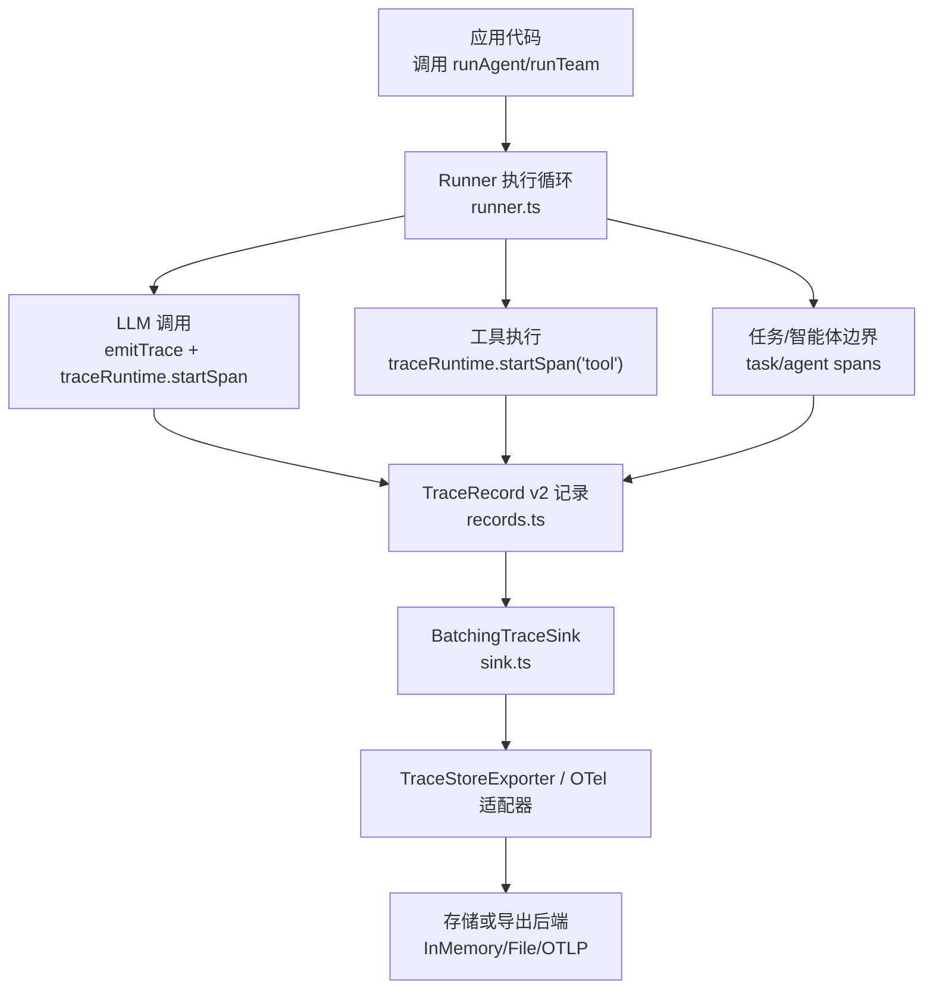
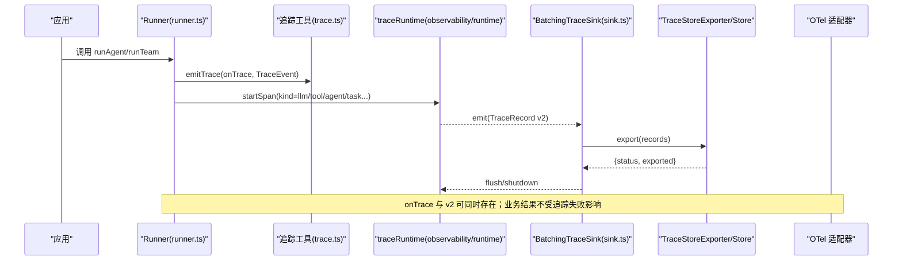
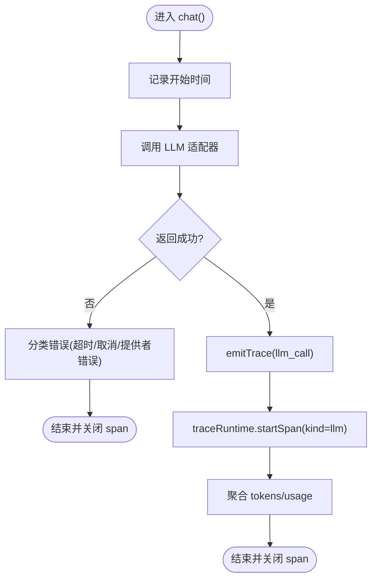
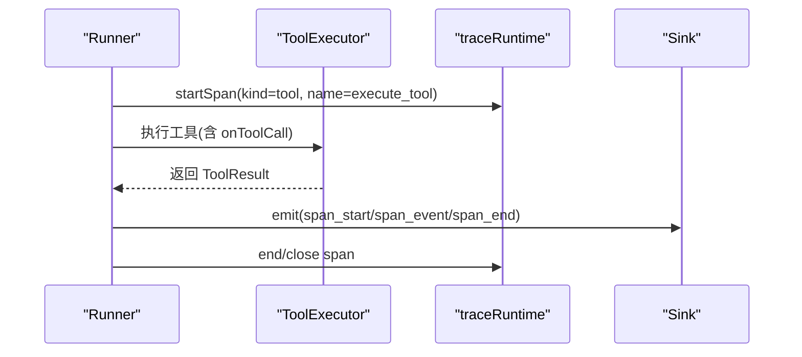
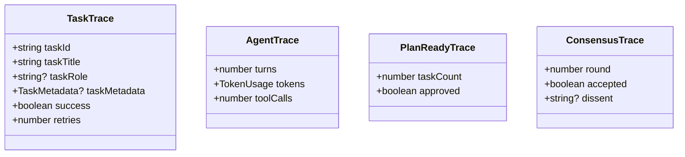
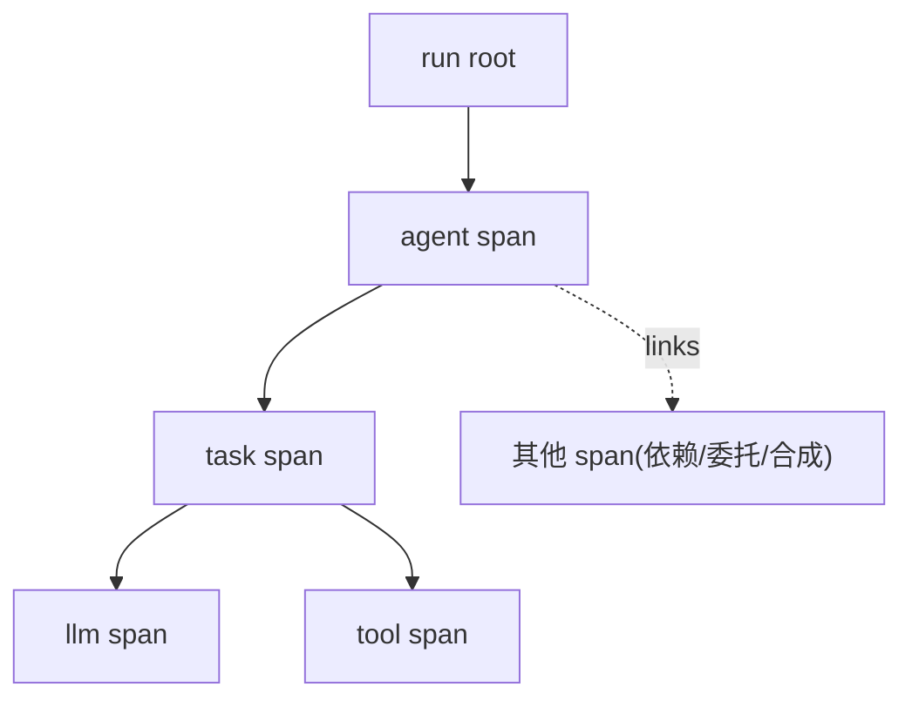
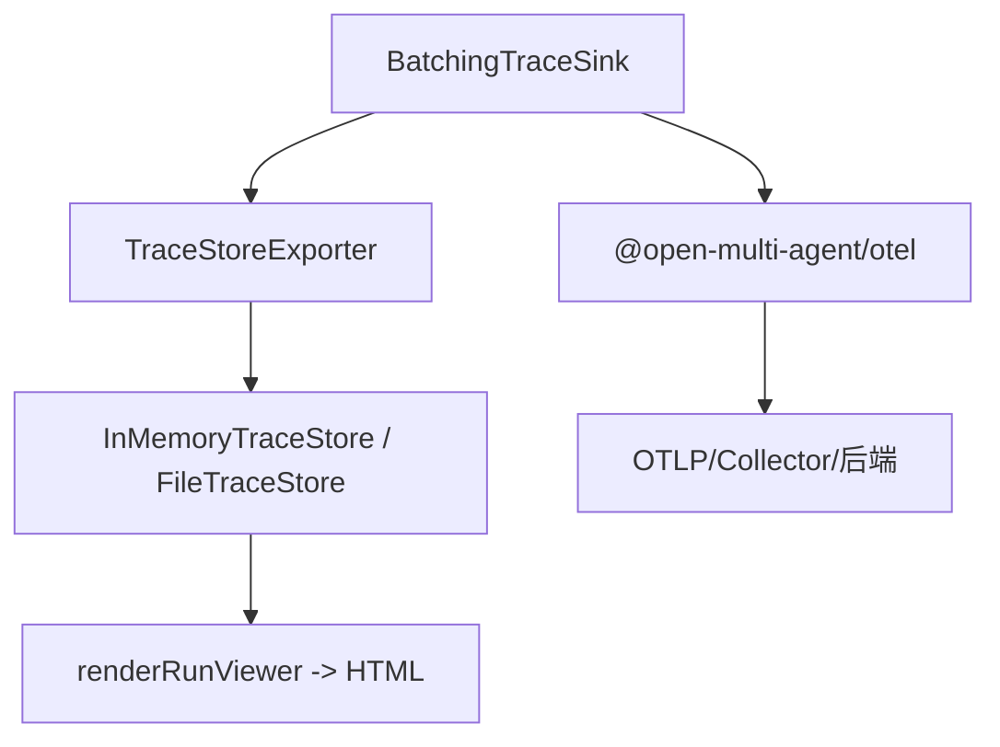
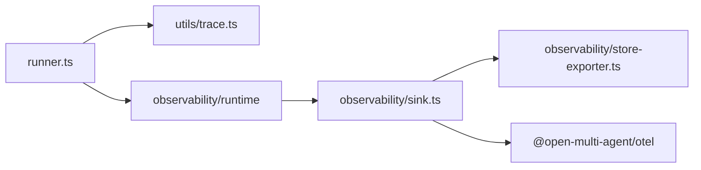

# 执行监控与追踪

<cite>
**本文引用的文件**
- [types.ts](file://packages/core/src/types.ts)
- [runner.ts](file://packages/core/src/agent/runner.ts)
- [trace.ts](file://packages/core/src/utils/trace.ts)
- [records.ts](file://packages/core/src/observability/records.ts)
- [sink.ts](file://packages/core/src/observability/sink.ts)
- [observability.md](file://docs/observability.md)
- [observability-migration.md](file://docs/observability-migration.md)
- [observability-performance.md](file://docs/observability-performance.md)
- [observability-release-readiness.md](file://docs/observability-release-readiness.md)
</cite>

## 目录
1. [简介](#简介)
2. [项目结构](#项目结构)
3. [核心组件](#核心组件)
4. [架构总览](#架构总览)
5. [详细组件分析](#详细组件分析)
6. [依赖关系分析](#依赖关系分析)
7. [性能考量](#性能考量)
8. [故障排查指南](#故障排查指南)
9. [结论](#结论)
10. [附录](#附录)

## 简介
本文件系统性说明智能体执行的监控与追踪机制，覆盖以下主题：
- TraceEvent 类型体系与追踪数据收集方式（LLM 调用、工具执行、任务/智能体生命周期、路由决策、共识等）
- onTrace 回调的使用与自定义追踪实现
- 运行标识（RunIdentity）、任务 ID、智能体名称等追踪属性的作用与传递
- 追踪数据在组件间的传递与关联（父子 span、links、跨尝试恢复）
- 监控仪表板集成方法与可视化展示（TraceStore、Run Viewer、OpenTelemetry 适配）
- 性能分析与问题诊断的最佳实践

## 项目结构
围绕可观测性，仓库将“事件型追踪”（onTrace/TraceEvent）与“结构化追踪”（TraceRecord v2、Sink/Exporter/Store）分层组织：
- 类型与事件定义集中在 types.ts
- 运行时追踪发射点集中在 runner.ts（LLM 调用、工具执行、消息追加等）
- 追踪工具函数集中在 utils/trace.ts（emitTrace、ID 生成）
- 结构化追踪记录 schema 集中在 observability/records.ts
- 可观测性管道（Sink/Exporter/Store/Lifecycle）集中在 observability/sink.ts 及相关模块
- 文档提供迁移、性能基线、发布就绪与使用指南

图表来源
- [runner.ts:597-635](file://packages/core/src/agent/runner.ts#L597-L635)
- [records.ts:1-56](file://packages/core/src/observability/records.ts#L1-L56)
- [sink.ts:1-175](file://packages/core/src/observability/sink.ts#L1-L175)

章节来源
- [types.ts:2665-2864](file://packages/core/src/types.ts#L2665-L2864)
- [runner.ts:1-200](file://packages/core/src/agent/runner.ts#L1-L200)
- [observability.md:1-768](file://docs/observability.md#L1-L768)

## 核心组件
- TraceEvent 与 TraceEventType：轻量级事件模型，包含 llm_call、tool_call、task、agent、plan_ready、agent_stream、consensus、routing_decision 等类型。
- TraceEventBase：所有事件的公共字段，包括 runId、spanId、parentId、type、startMs、endMs、durationMs、agent、taskId。
- RunIdentity：稳定运行标识（runId、attempt、traceId、rootSpanId、links），用于跨恢复和链路关联。
- TraceRecord v2：结构化追踪记录（span_start/span_event/span_end），带 W3C 兼容 trace/span ID、links、attributes、status 等。
- TraceSink/TraceExporter/BatchingTraceSink：热路径同步 emit、异步批量导出、队列与重试、flush/shutdown 生命周期。
- TraceStore：存储介质无关的持久化与查询接口（InMemoryTraceStore、FileTraceStore）。
- OpenTelemetry 适配器：将 TraceRecord 映射为 OTel Span/Event/Link。

章节来源
- [types.ts:241-260](file://packages/core/src/types.ts#L241-L260)
- [types.ts:2665-2864](file://packages/core/src/types.ts#L2665-L2864)
- [records.ts:1-56](file://packages/core/src/observability/records.ts#L1-L56)
- [sink.ts:1-175](file://packages/core/src/observability/sink.ts#L1-L175)
- [observability.md:151-525](file://docs/observability.md#L151-L525)

## 架构总览
下图展示了从 Runner 到 Sink/Store/导出器的完整追踪链路，以及 onTrace 与 v2 双通道并存的关系。

图表来源
- [runner.ts:597-635](file://packages/core/src/agent/runner.ts#L597-L635)
- [trace.ts:1-40](file://packages/core/src/utils/trace.ts#L1-L40)
- [sink.ts:1-175](file://packages/core/src/observability/sink.ts#L1-L175)
- [observability.md:185-225](file://docs/observability.md#L185-L225)

## 详细组件分析

### LLM 调用追踪
- 触发点：每次 agent 回合的 chat() 调用后，Runner 会发射一个 llm_call 类型的 TraceEvent，并创建 kind=llm 的 v2 span。
- 关键属性：model、phase（turn/summary）、turn、tokens（TokenUsage）、agent、taskId、parentId（指向当前 agent span）。
- 错误分类：根据 abortSignal 区分超时/取消，统一归类为运行时状态。

图表来源
- [runner.ts:597-635](file://packages/core/src/agent/runner.ts#L597-L635)
- [types.ts:2703-2711](file://packages/core/src/types.ts#L2703-L2711)

章节来源
- [runner.ts:597-635](file://packages/core/src/agent/runner.ts#L597-L635)
- [types.ts:2703-2711](file://packages/core/src/types.ts#L2703-L2711)

### 工具执行追踪
- 触发点：每个工具调用前后，Runner 会创建 kind=tool 的 span，并在 onToolCall/onToolResult 钩子中暴露实时信息。
- 关键属性：oma.tool.name、oma.agent.name、oma.task.id、输入输出（经敏感字段脱敏）、是否被 gate 评估及决策。
- 并发与检查点：工具执行可能并行，提交前会写入 checkpoint，确保可恢复。

图表来源
- [runner.ts:1364-1395](file://packages/core/src/agent/runner.ts#L1364-L1395)
- [sink.ts:1-175](file://packages/core/src/observability/sink.ts#L1-L175)

章节来源
- [runner.ts:1364-1395](file://packages/core/src/agent/runner.ts#L1364-L1395)
- [types.ts:2713-2728](file://packages/core/src/types.ts#L2713-L2728)

### 任务与智能体生命周期追踪
- task span：包裹一次任务的完整重试序列，包含 taskId、taskTitle、taskRole、taskMetadata、success、retries。
- agent span：包裹一次智能体的完整对话循环，包含 turns、tokens、toolCalls。
- plan_ready 与 consensus：分别对应计划审批边界与共识裁决轮次。

图表来源
- [types.ts:2730-2772](file://packages/core/src/types.ts#L2730-L2772)

章节来源
- [types.ts:2730-2772](file://packages/core/src/types.ts#L2730-L2772)

### 路由决策与流式事件
- routing_decision：记录 runTeam 选择的执行拓扑模式、原因、置信度、路由器版本、回退码、语义路由评估等。
- agent_stream：转发底层流事件（text/tool_use/done 等），便于实时 UI 与 TTFT 分析。

章节来源
- [types.ts:2774-2788](file://packages/core/src/types.ts#L2774-L2788)
- [observability.md:616-668](file://docs/observability.md#L616-L668)

### onTrace 回调与自定义追踪实现
- onTrace 是兼容层，保持七种事件形状、UUID spanId/parentId、完成时间与最佳努力脱敏的工具 I/O。
- 推荐迁移路径：
  - Stage 0：保留现有 onTrace
  - Stage 1：通过 LegacyCallbackTraceSink 桥接到 sinks
  - Stage 2：引入 BatchingTraceSink + 自定义 TraceExporter
  - Stage 3：替换为 TraceStoreExporter 或 @open-multi-agent/otel
  - Stage 4：显式管理 forceFlush/shutdown 生命周期

图表来源
- [observability-migration.md:24-155](file://docs/observability-migration.md#L24-L155)
- [observability.md:185-225](file://docs/observability.md#L185-L225)

章节来源
- [observability-migration.md:1-179](file://docs/observability-migration.md#L1-L179)
- [observability.md:616-668](file://docs/observability.md#L616-L668)

### 运行标识（RunIdentity）、任务 ID、智能体名称的作用
- RunIdentity：
  - runId：逻辑运行标识，跨恢复保持不变
  - attempt：每次恢复递增
  - traceId/rootSpanId：W3C 兼容的追踪根上下文
  - links：continued_from/depends_on/consumed/delegated_from 等关系
- taskId：将 LLM/tool/agent/task span 与具体任务关联，便于按任务维度聚合。
- agent：标注 span 所属智能体，支持多智能体场景下的角色隔离与统计。

章节来源
- [types.ts:241-260](file://packages/core/src/types.ts#L241-L260)
- [runner.ts:597-635](file://packages/core/src/agent/runner.ts#L597-L635)
- [observability.md:12-79](file://docs/observability.md#L12-L79)

### 追踪数据在不同组件间的传递与关联
- 父子关系：Runner 为 agent/task 创建父 span，LLM/tool/stream 作为子 span 指向父 span。
- 非树关系：通过 TraceLink 表达 DAG 依赖、委托代理、协调合成、恢复延续等。
- 恢复链路：restore 启动新 trace，并以 continued_from link 链接到前一 root。

图表来源
- [observability.md:151-179](file://docs/observability.md#L151-L179)
- [types.ts:241-260](file://packages/core/src/types.ts#L241-L260)

章节来源
- [observability.md:151-179](file://docs/observability.md#L151-L179)
- [types.ts:241-260](file://packages/core/src/types.ts#L241-L260)

### 监控仪表板集成与可视化
- TraceStore：
  - InMemoryTraceStore：测试与本地快速查看
  - FileTraceStore：单进程持久化 NDJSON，支持 flush/close/compact 与恢复
- Run Viewer：renderRunViewer 基于 TeamRunResult 与 StoredRun 生成静态 HTML，支持 DAG/Waterfall、过滤、搜索、路由摘要。
- OpenTelemetry：@open-multi-agent/otel 将 TraceRecord 映射为 Span/Event/Link，保留 OMA 稳定属性与状态。

图表来源
- [observability.md:224-289](file://docs/observability.md#L224-L289)
- [observability.md:670-741](file://docs/observability.md#L670-L741)
- [observability.md:459-525](file://docs/observability.md#L459-L525)

章节来源
- [observability.md:224-289](file://docs/observability.md#L224-L289)
- [observability.md:670-741](file://docs/observability.md#L670-L741)
- [observability.md:459-525](file://docs/observability.md#L459-L525)

## 依赖关系分析
- Runner 依赖 utils/trace 进行 onTrace 安全发射与 ID 生成
- Runner 依赖 observability/runtime 创建 v2 span 并注入属性
- Sink/Exporter/Store 解耦了热路径与 I/O，保证业务执行不被追踪失败影响
- 文档定义了迁移路径、性能基线与发布就绪要求

图表来源
- [runner.ts:1-200](file://packages/core/src/agent/runner.ts#L1-L200)
- [trace.ts:1-40](file://packages/core/src/utils/trace.ts#L1-L40)
- [sink.ts:1-175](file://packages/core/src/observability/sink.ts#L1-L175)

章节来源
- [runner.ts:1-200](file://packages/core/src/agent/runner.ts#L1-L200)
- [trace.ts:1-40](file://packages/core/src/utils/trace.ts#L1-L40)
- [sink.ts:1-175](file://packages/core/src/observability/sink.ts#L1-L175)

## 性能考量
- 无 sink 时回归预算：新增可观测性不应显著增加无 sink 路径的耗时与内存占用
- 热路径 p95 预算：
  - 遗留回调派发 <10 µs
  - 批处理入队 <20 µs
  - OTel 转换+内存处理器 <50 µs
- 队列与丢弃策略：
  - 默认队列大小与字节限制，超限按优先级丢弃（stream_chunk > 其他事件 > span_start > span_end）
  - 大记录直接拒绝，避免阻塞
- 刷新与关闭：
  - forceFlush 捕获水位线，shutdown 原子停止接受并清理资源
  - 长服务需显式注册优雅关闭流程

章节来源
- [observability-performance.md:1-141](file://docs/observability-performance.md#L1-L141)
- [observability.md:527-600](file://docs/observability.md#L527-L600)

## 故障排查指南
- 常见诊断码：sink_emit_failed、queue_full、record_too_large、export_failed、export_timeout、flush_timeout、shutdown_failed、emit_after_shutdown
- 建议步骤：
  - 检查 sink.getStats() 的 accepted/exported/dropped/failed 计数与 lastError
  - 确认 exporter 对 reject/hang/partial 的处理符合预期
  - 校验 flush/shutdown 顺序与超时设置
  - 对于 FileTraceStore，关注 fsync 与 compact 后的文件一致性
  - 对比 onTrace 与 v2 数据，避免重复投递导致统计偏差

章节来源
- [sink.ts:33-65](file://packages/core/src/observability/sink.ts#L33-L65)
- [observability.md:572-600](file://docs/observability.md#L572-L600)
- [observability-release-readiness.md:49-90](file://docs/observability-release-readiness.md#L49-L90)

## 结论
该系统的可观测性以“轻量事件 + 结构化记录”的双轨设计，既保证了向后兼容与低侵入，又提供了生产级的追踪、存储、查询与可视化能力。通过 RunIdentity、taskId、agent 等属性，可在复杂的多智能体协作中进行细粒度关联与分析；借助 Sink/Store/OTel 适配器，可灵活对接多种后端；结合性能预算与故障注入验证，确保在生产环境中的稳定性与可维护性。

## 附录
- 隐私边界：默认不采集 prompt/completion/tool payload/reasoning 内容；仅允许数值用量等低敏感指标
- 执行回执：buildExecutionReceipt 可从结果与追踪推导实际执行拓扑，用于治理结论与审计
- 迁移清单：分阶段迁移 onTrace 至 v2，逐步接管生命周期与导出器

章节来源
- [observability.md:743-768](file://docs/observability.md#L743-L768)
- [observability-migration.md:157-179](file://docs/observability-migration.md#L157-L179)