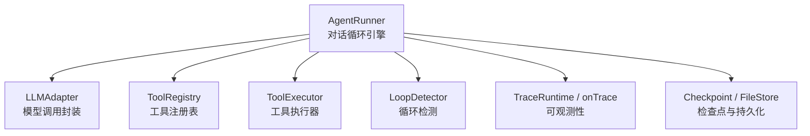
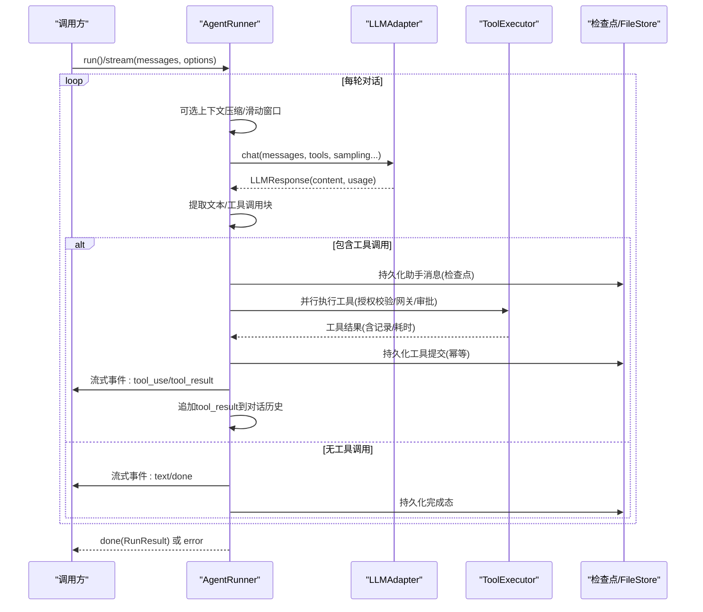
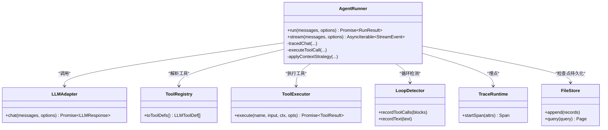
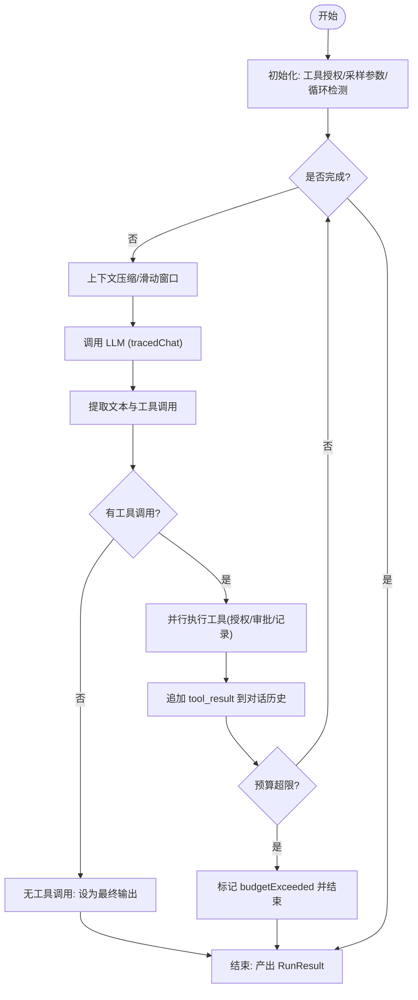

# 智能体执行

<cite>
**本文引用的文件**
- [runner.ts](file://packages/core/src/agent/runner.ts)
- [types.ts](file://packages/core/src/types.ts)
- [openai.ts](file://packages/core/src/llm/openai.ts)
- [file-store.ts](file://packages/core/src/memory/file-store.ts)
</cite>

## 目录
1. [简介](#简介)
2. [项目结构](#项目结构)
3. [核心组件](#核心组件)
4. [架构总览](#架构总览)
5. [详细组件分析](#详细组件分析)
6. [依赖关系分析](#依赖关系分析)
7. [性能考量](#性能考量)
8. [故障排查指南](#故障排查指南)
9. [结论](#结论)
10. [附录](#附录)

## 简介
本文件系统性阐述智能体的执行机制，聚焦 AgentRunner 的核心执行流程：对话循环、工具调用处理、消息管理、结果聚合与循环检测；对比 run() 与 stream() 的差异与适用场景；详解 LLM 调用、工具提取与执行、结果聚合、预算与循环控制等关键步骤；解释 RunResult 的结构与字段含义；提供监控与调试方法（追踪事件、性能指标）；总结错误处理策略与异常恢复机制；并给出常见使用模式。

## 项目结构
AgentRunner 位于 core 包的 agent 模块中，承担“对话驱动引擎”的职责：负责将消息发送给 LLM 适配器、解析响应中的工具调用、并行执行工具、将结果写回对话历史，并在满足终止条件或达到上限时结束。它通过类型定义与可观测性接口与其他模块协作。

图表来源
- [runner.ts:472-986](file://packages/core/src/agent/runner.ts#L472-L986)
- [types.ts:471-504](file://packages/core/src/types.ts#L471-L504)
- [file-store.ts:1-45](file://packages/core/src/memory/file-store.ts#L1-L45)

章节来源
- [runner.ts:1-177](file://packages/core/src/agent/runner.ts#L1-L177)
- [types.ts:471-504](file://packages/core/src/types.ts#L471-L504)

## 核心组件
- AgentRunner：实现 AgentBackend 接口，提供 run() 与 stream() 两种执行入口，维护对话状态、工具授权、上下文压缩、循环检测、预算控制、检查点与可观测性。
- LLMAdapter：抽象不同模型的聊天能力，统一返回 LLMResponse。
- ToolRegistry / ToolExecutor：工具发现与执行，支持授权白名单/黑名单、默认拒绝、工具结果压缩与摘要。
- LoopDetector：基于最近轮次的工具调用与文本重复检测，支持 warn/inject/terminate 策略。
- TraceRuntime / onTrace：为 LLM 调用与工具执行生成 span 与轻量事件，便于追踪与性能分析。
- Checkpoint / FileStore：在关键边界持久化运行状态，支持中断恢复与幂等重放。

章节来源
- [runner.ts:472-986](file://packages/core/src/agent/runner.ts#L472-L986)
- [types.ts:471-504](file://packages/core/src/types.ts#L471-L504)
- [file-store.ts:1-45](file://packages/core/src/memory/file-store.ts#L1-L45)

## 架构总览
AgentRunner 的对话循环遵循“调用 LLM → 解析工具调用 → 执行工具 → 追加结果 → 继续下一轮”的模式，直到出现以下任一终止条件：
- 模型未请求工具调用（end_turn）
- 达到最大轮次 maxTurns
- 触发 token 预算上限
- 检测到循环并执行终止策略
- 收到中止信号

图表来源
- [runner.ts:842-864](file://packages/core/src/agent/runner.ts#L842-L864)
- [runner.ts:877-1358](file://packages/core/src/agent/runner.ts#L877-L1358)
- [runner.ts:1364-1546](file://packages/core/src/agent/runner.ts#L1364-L1546)
- [file-store.ts:1-45](file://packages/core/src/memory/file-store.ts#L1-L45)

## 详细组件分析

### AgentRunner 执行流程
- 初始化
  - 解析工具授权（预设/白名单/黑名单），构建 baseChatOptions（模型、采样参数、系统提示、思考模式等）。
  - 若启用循环检测，构造 LoopDetector 并预灌历史消息。
- 主循环
  - 若处于“等待模型”阶段：
    - 可选压缩已消费的工具结果与上下文策略（滑动窗口/摘要/自定义压缩）。
    - 调用 tracedChat（带 per-call 超时合并与可观测性）。
    - 累积 tokenUsage 与 turns，构造 assistant 消息并追加到对话历史。
    - 若存在文本输出，立即以 text 事件流式推送。
    - 检查 token 预算，超限则标记 budgetExceeded 并发送 budget_exceeded 事件。
    - 提取工具调用块；若为空，视为最终回复，进入 completed。
    - 若启用循环检测，先于 tool_use 事件前进行重复检测，必要时注入警告或终止。
  - 若处于“执行工具”阶段：
    - 并行执行 pendingToolCalls，支持已提交的幂等回放、审批挂起与恢复。
    - 收集工具结果，追加为 user 消息，推送到 onMessage 与 tool_result 事件。
    - 若存在未提交调用（如被取消），保持当前检查点并继续重试。
    - 更新 token 预算与阶段，必要时提前终止。
- 结束
  - 产出 RunResult（messages、output、toolCalls、tokenUsage、turns、loopDetected、budgetExceeded、aborted、suspended、pendingApprovals）。
  - 发出 done 事件。

章节来源
- [runner.ts:842-864](file://packages/core/src/agent/runner.ts#L842-L864)
- [runner.ts:877-1358](file://packages/core/src/agent/runner.ts#L877-L1358)
- [runner.ts:1364-1546](file://packages/core/src/agent/runner.ts#L1364-L1546)

### run() 与 stream() 的区别与使用场景
- run()
  - 内部复用 stream()，收集所有事件，遇到 error 直接抛出，done 时返回聚合后的 RunResult。
  - 适用于批处理、需要一次性结果的场景。
- stream()
  - 增量产出 text、tool_use、tool_result、loop_detected、budget_exceeded、done、error 等事件。
  - 适用于实时 UI 展示、进度反馈、边执行边响应的场景。

章节来源
- [runner.ts:842-864](file://packages/core/src/agent/runner.ts#L842-L864)
- [runner.ts:877-876](file://packages/core/src/agent/runner.ts#L877-L876)
- [types.ts:484-504](file://packages/core/src/types.ts#L484-L504)

### 关键步骤详解
- LLM 调用
  - 通过 tracedChat 包装，支持 per-call 超时、AbortSignal 合并、失败分类与 span 埋点。
  - 支持 thinking/preserveReasoningAsText/compressReasoningText 等高级选项。
- 工具提取与执行
  - 从响应内容中提取 tool_use 块；按授权集合过滤，未授权直接返回错误结果。
  - 支持工具网关 with durable approval；若需审批，创建 ApprovalRequest 并持久化后暂停。
  - 工具结果转换为 modelOutput，记录 ToolCallRecord（名称、输入、输出、耗时）。
- 结果聚合
  - 累积 messages（仅本次新增）、toolCalls、tokenUsage、turns，以及 flags（loopDetected、budgetExceeded、aborted、suspended、pendingApprovals）。
- 循环检测
  - 跟踪最近 N 轮的 tool_use 与文本，超过阈值触发 onLoopDetected 策略（warn/inject/terminate）。
  - 首次 warn 会注入警告文本，再次检测到相同模式则强制终止。

章节来源
- [runner.ts:561-681](file://packages/core/src/agent/runner.ts#L561-L681)
- [runner.ts:1172-1319](file://packages/core/src/agent/runner.ts#L1172-L1319)
- [runner.ts:1364-1546](file://packages/core/src/agent/runner.ts#L1364-L1546)
- [types.ts:1216-1245](file://packages/core/src/types.ts#L1216-L1245)

### 执行监控与调试
- 追踪事件
  - LLM 调用：llm_call（含模型、provider、phase、turn、usage、duration）。
  - 工具调用：tool_call（含工具名、输入/输出摘要、是否错误、gate 信息）。
  - 可通过 traceRuntime.startSpan 或 onTrace 回调获取。
- 性能指标
  - 累计 tokenUsage（input_tokens/output_tokens）。
  - 工具执行 durationMs、每轮 turn 计数。
  - 预算超限时触发 budget_exceeded 事件。
- 调试建议
  - 开启 onWarning 接收配置问题提示（如模型不支持工具调用）。
  - 结合 checkpoint 与 FileStore 定位中断点与重放路径。

章节来源
- [runner.ts:584-681](file://packages/core/src/agent/runner.ts#L584-L681)
- [runner.ts:1364-1546](file://packages/core/src/agent/runner.ts#L1364-L1546)
- [types.ts:2668-2705](file://packages/core/src/types.ts#L2668-L2705)

### 错误处理与异常恢复
- 错误分类
  - 超时：由 per-call AbortSignal.timeout 触发，归类为 timeout。
  - 取消：由外部 AbortSignal 触发，归类为 cancelled。
  - 工具错误：作为普通错误结果返回，不中断循环。
- 预算与循环
  - 预算超限：发送 budget_exceeded 事件，设置 budgetExceeded flag。
  - 循环检测：warn 一次后再次检测即 terminate，设置 loopDetected flag。
- 恢复机制
  - 在助手消息与工具提交前后写入检查点；支持 resumeState 恢复。
  - 审批挂起：创建 ApprovalRequest，持久化后暂停，待决策后继续。
  - FileStore 原子写入保证一致性，崩溃后可恢复。

章节来源
- [runner.ts:561-681](file://packages/core/src/agent/runner.ts#L561-L681)
- [runner.ts:916-946](file://packages/core/src/agent/runner.ts#L916-L946)
- [runner.ts:1020-1048](file://packages/core/src/agent/runner.ts#L1020-L1048)
- [file-store.ts:1-45](file://packages/core/src/memory/file-store.ts#L1-L45)

### 实际使用示例与常见模式
- 基本用法
  - 构造 AgentRunner，传入 adapter、registry、executor 与 RunnerOptions（model、maxTurns 等）。
  - 调用 run() 获取 RunResult，或遍历 stream() 消费事件。
- 流式 UI
  - 订阅 text 事件用于即时显示；订阅 tool_use/tool_result 用于展示工具过程。
- 长对话优化
  - 启用 contextStrategy（sliding-window/summarize/compact）减少上下文长度。
  - 启用 compressToolResults 压缩已消费的工具结果。
- 安全与治理
  - 配置 toolPreset/allowedTools/disallowedTools 限制可用工具。
  - 启用 requireConsequentialConfirmation 与 onToolCall 门控，必要时走审批流程。

章节来源
- [runner.ts:463-470](file://packages/core/src/agent/runner.ts#L463-L470)
- [runner.ts:817-827](file://packages/core/src/agent/runner.ts#L817-L827)
- [runner.ts:1153-1170](file://packages/core/src/agent/runner.ts#L1153-L1170)
- [types.ts:2257-2274](file://packages/core/src/types.ts#L2257-L2274)

## 依赖关系分析

图表来源
- [runner.ts:472-986](file://packages/core/src/agent/runner.ts#L472-L986)
- [file-store.ts:1-45](file://packages/core/src/memory/file-store.ts#L1-L45)

章节来源
- [runner.ts:472-986](file://packages/core/src/agent/runner.ts#L472-L986)
- [file-store.ts:1-45](file://packages/core/src/memory/file-store.ts#L1-L45)

## 性能考量
- 上下文压缩
  - 滑动窗口：保留最近若干轮，避免拆分 tool_use/tool_result 对。
  - 摘要：对旧段调用另一个模型生成摘要，缓存签名避免重复计算。
  - 规则压缩：替换长文本与工具结果为紧凑标记，保留错误与关键决策。
- 工具结果压缩
  - 对已消费且较长的工具结果进行压缩，减少后续 LLM 输入成本。
- 并发执行
  - 工具调用并行执行，缩短端到端延迟。
- 预算控制
  - 累计 token 用量，超限及时停止，避免浪费。

章节来源
- [runner.ts:492-542](file://packages/core/src/agent/runner.ts#L492-L542)
- [runner.ts:683-771](file://packages/core/src/agent/runner.ts#L683-L771)
- [runner.ts:1576-1698](file://packages/core/src/agent/runner.ts#L1576-L1698)
- [runner.ts:1710-1790](file://packages/core/src/agent/runner.ts#L1710-L1790)

## 故障排查指南
- 常见问题
  - 模型未调用工具：检查工具定义与授权，关注 onWarning 提示。
  - 预算超限：确认 maxTokenBudget 与模型输出大小，考虑上下文压缩。
  - 循环卡住：调整 loopDetection 阈值与策略，必要时注入更明确的提示。
  - 工具执行失败：查看 tool_call 事件的 output 与 isError，定位具体错误。
- 恢复与重放
  - 使用 checkpoint 与 FileStore 保存状态，崩溃后通过 resumeState 恢复。
  - 审批挂起：确保 onApprovalPrepare/onApprovalRequest/onApprovalConsumed 正确接入。
- 可观测性
  - 通过 onTrace 或 TraceRuntime 收集 llm_call 与 tool_call 事件，分析耗时与错误分布。

章节来源
- [runner.ts:1294-1299](file://packages/core/src/agent/runner.ts#L1294-L1299)
- [runner.ts:916-946](file://packages/core/src/agent/runner.ts#L916-L946)
- [runner.ts:1364-1546](file://packages/core/src/agent/runner.ts#L1364-L1546)
- [file-store.ts:1-45](file://packages/core/src/memory/file-store.ts#L1-L45)

## 结论
AgentRunner 提供了健壮的智能体执行引擎，围绕“LLM 调用—工具执行—结果聚合”的主循环，结合上下文压缩、循环检测、预算控制、审批与检查点机制，实现了高可靠、可观测、可恢复的执行体验。run() 适合批处理，stream() 适合实时交互；通过合理配置工具授权、上下文策略与监控手段，可在复杂任务中稳定运行。

## 附录

### RunResult 结构与字段说明
- identity：可选标识，用于跨后端兼容。
- messages：本轮新增的消息（assistant 与 tool_result）。
- output：最后一轮助手文本输出。
- toolCalls：本轮所有工具调用记录（名称、输入、输出、耗时）。
- tokenUsage：累计输入/输出 token。
- turns：总轮数（含工具调用后的跟进轮）。
- loopDetected：是否因循环检测而终止或告警。
- budgetExceeded：是否因 token 预算超限而终止。
- aborted：是否在下次 LLM 调用前被中止信号打断。
- suspended：是否存在待审批的工具调用。
- pendingApprovals：待审批的请求列表。

章节来源
- [runner.ts:249-273](file://packages/core/src/agent/runner.ts#L249-L273)
- [types.ts:1264-1289](file://packages/core/src/types.ts#L1264-L1289)

### 流式事件 StreamEvent 类型
- text：文本增量
- reasoning：推理/思考增量
- tool_use：模型开始或完成工具调用块
- tool_result：工具结果追加
- loop_detected：检测到循环
- budget_exceeded：超出 token 预算
- done：流结束，data 为 RunResult
- error：不可恢复错误，data 为 Error

章节来源
- [types.ts:484-504](file://packages/core/src/types.ts#L484-L504)

### 典型执行流程图

图表来源
- [runner.ts:877-1358](file://packages/core/src/agent/runner.ts#L877-L1358)
- [runner.ts:1364-1546](file://packages/core/src/agent/runner.ts#L1364-L1546)