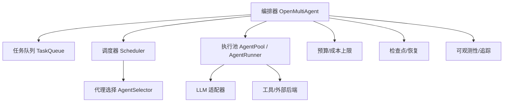
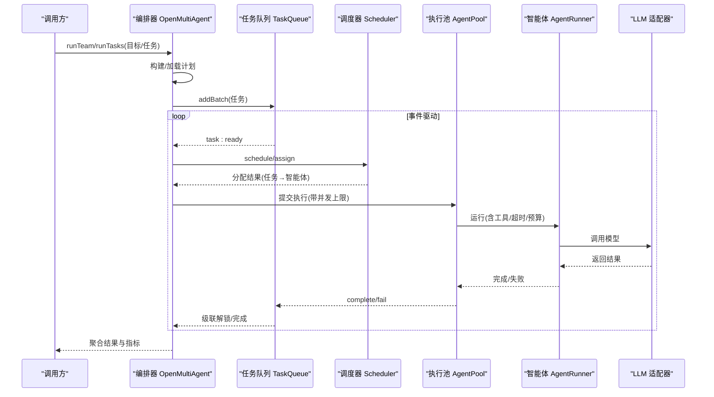
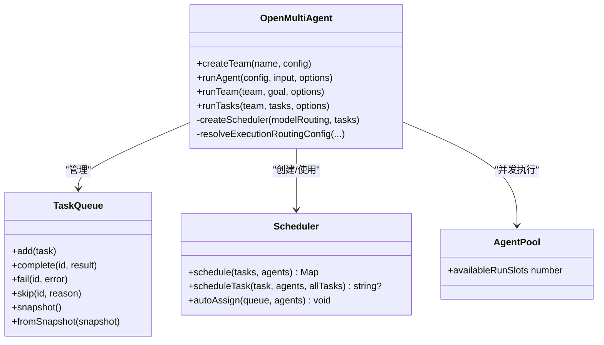
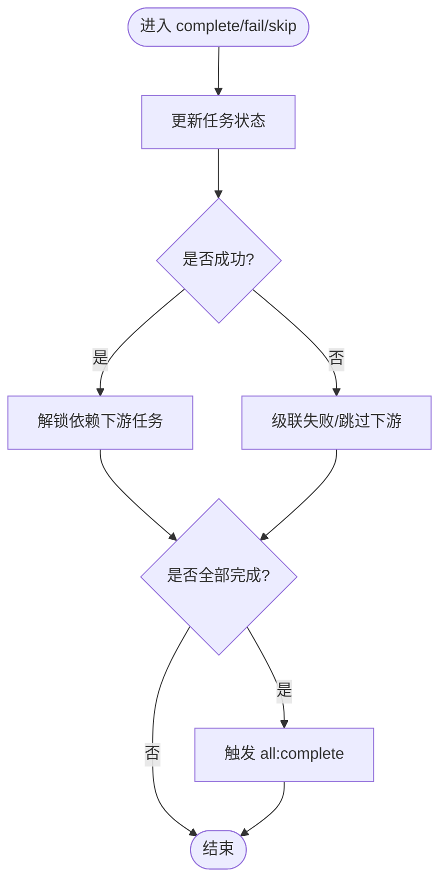
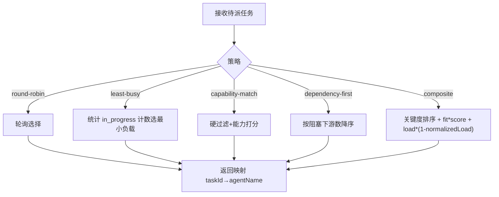
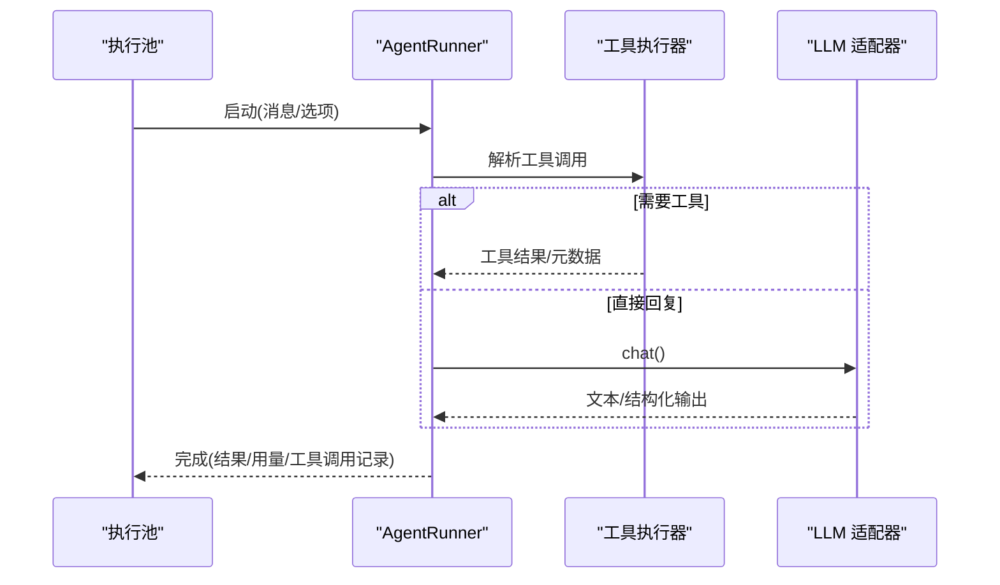
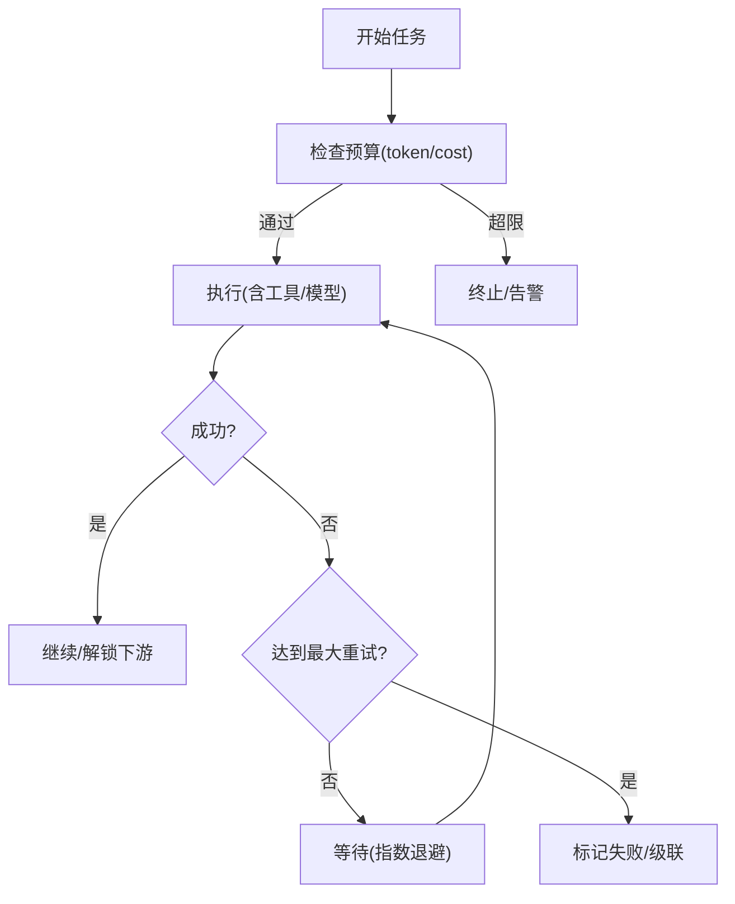
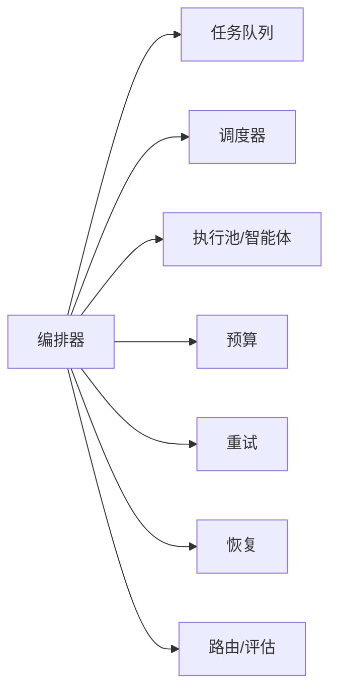

# 智能体池

<cite>
**本文引用的文件**
- [orchestrator.ts](file://packages/core/src/orchestrator/orchestrator.ts)
- [scheduler.ts](file://packages/core/src/orchestrator/scheduler.ts)
- [queue.ts](file://packages/core/src/task/queue.ts)
- [types.ts](file://packages/core/src/types.ts)
- [agent-config.ts](file://packages/core/src/orchestrator/agent-config.ts)
- [task-execution.ts](file://packages/core/src/orchestrator/task-execution.ts)
- [budget.ts](file://packages/core/src/orchestrator/budget.ts)
- [retry.ts](file://packages/core/src/orchestrator/retry.ts)
- [coordinator.ts](file://packages/core/src/orchestrator/coordinator.ts)
- [short-circuit.ts](file://packages/core/src/orchestrator/short-circuit.ts)
- [execution-router.ts](file://packages/core/src/orchestrator/execution-router.ts)
- [task-profiler.ts](file://packages/core/src/orchestrator/task-profiler.ts)
- [recovery.ts](file://packages/core/src/orchestrator/recovery.ts)
- [governance.ts](file://packages/core/src/orchestrator/governance.ts)
- [consensus.ts](file://packages/core/src/orchestrator/consensus.ts)
- [consequential.ts](file://packages/core/src/orchestrator/consequential.ts)
- [errors.ts](file://packages/core/src/errors.ts)
- [README.md](file://packages/core/README.md)
</cite>

## 目录
1. [简介](#简介)
2. [项目结构](#项目结构)
3. [核心组件](#核心组件)
4. [架构总览](#架构总览)
5. [详细组件分析](#详细组件分析)
6. [依赖关系分析](#依赖关系分析)
7. [性能考虑](#性能考虑)
8. [故障排查指南](#故障排查指南)
9. [结论](#结论)
10. [附录：配置与最佳实践](#附录：配置与最佳实践)

## 简介
本文件聚焦“智能体池”的设计与实现，围绕资源管理、并发控制、负载均衡、生命周期管理、调度算法与资源分配策略展开。在 Open Multi-Agent（OMA）中，智能体池由编排器（OpenMultiAgent）统一协调，结合任务队列（TaskQueue）、调度器（Scheduler）、执行器（AgentPool/AgentRunner）以及预算、重试、恢复等子系统，形成高内聚、可扩展的多智能体执行引擎。

## 项目结构
- 编排层：OpenMultiAgent 负责团队创建、计划生成、任务派发、结果聚合与可观测性。
- 调度层：Scheduler 提供多种任务到智能体的分配策略，支持依赖优先、最少忙碌、能力匹配、复合评分等。
- 队列层：TaskQueue 维护任务状态机、依赖解析、事件驱动推进与快照/恢复。
- 执行层：AgentPool/AgentRunner 负责并发限制、超时、重试、工具调用、上下文压缩与预算控制。
- 支撑层：预算（Budget）、重试（Retry）、恢复（Recovery）、治理（Governance）、共识（Consensus）、路由（Execution Router/Profiler）等。

图表来源
- [orchestrator.ts:345-446](file://packages/core/src/orchestrator/orchestrator.ts#L345-L446)
- [scheduler.ts:142-214](file://packages/core/src/orchestrator/scheduler.ts#L142-L214)
- [queue.ts:64-105](file://packages/core/src/task/queue.ts#L64-L105)

章节来源
- [orchestrator.ts:345-446](file://packages/core/src/orchestrator/orchestrator.ts#L345-L446)
- [README.md:237-252](file://packages/core/README.md#L237-L252)

## 核心组件
- 编排器（OpenMultiAgent）：集中式入口，组合 Team、TaskQueue、Scheduler、AgentPool、Agent、预算、检查点、可观测性等。默认并发上限、委派深度、调度策略、严格指派等均有合理默认值。
- 任务队列（TaskQueue）：事件驱动的有向无环图（DAG）工作队列，自动提升就绪任务、级联失败/跳过、支持快照与恢复。
- 调度器（Scheduler）：将待派任务映射到可用智能体，内置五种策略，支持权重与上下文扩展。
- 执行器（AgentPool/AgentRunner）：并发受限地运行单个智能体对话循环，处理工具调用、超时、中止信号、预算与上下文压缩。
- 预算与成本：按轮次/任务边界进行 token 与成本上限校验，超限即停止或告警。
- 重试与恢复：指数退避重试；基于检查点的断点续跑；可选自适应修复。
- 治理与共识：结构化角色约束、顺序约束；可选验证者共识增强可靠性。
- 路由与评估：执行拓扑路由（Single/Team）与模型路由；可选语义路由评估。

章节来源
- [orchestrator.ts:345-446](file://packages/core/src/orchestrator/orchestrator.ts#L345-L446)
- [queue.ts:64-105](file://packages/core/src/task/queue.ts#L64-L105)
- [scheduler.ts:142-214](file://packages/core/src/orchestrator/scheduler.ts#L142-L214)
- [types.ts:2131-2180](file://packages/core/src/types.ts#L2131-L2180)

## 架构总览
编排器通过“目标→计划→调度→执行”的流水线组织多智能体协作。协调器（Coordinator）根据目标动态生成任务 DAG，调度器依据策略将任务分配给智能体，执行池以并发上限运行任务，完成后回写结果并触发下游任务。

图表来源
- [orchestrator.ts:345-446](file://packages/core/src/orchestrator/orchestrator.ts#L345-L446)
- [scheduler.ts:142-214](file://packages/core/src/orchestrator/scheduler.ts#L142-L214)
- [queue.ts:433-460](file://packages/core/src/task/queue.ts#L433-L460)

## 详细组件分析

### 编排器（OpenMultiAgent）与智能体池
- 设计目的：作为单一入口，统一管理团队、计划、调度、执行、预算、恢复与可观测性，屏蔽底层复杂性。
- 资源管理：通过 maxConcurrency 限制并发；通过委派深度限制嵌套调用；通过预算与成本上限保护系统。
- 并发控制：执行池内部对每个任务的运行施加并发上限，避免过载。
- 负载均衡：委托给 Scheduler，支持多种策略；编排器注入选择上下文（如模型路由、工具预设）。
- 生命周期：从 runTeam/runTasks 开始，经历计划→调度→执行→聚合；支持 planOnly 预览、checkpoint 恢复、approval 暂停。

图表来源
- [orchestrator.ts:345-446](file://packages/core/src/orchestrator/orchestrator.ts#L345-L446)
- [queue.ts:64-105](file://packages/core/src/task/queue.ts#L64-L105)
- [scheduler.ts:142-214](file://packages/core/src/orchestrator/scheduler.ts#L142-L214)

章节来源
- [orchestrator.ts:345-446](file://packages/core/src/orchestrator/orchestrator.ts#L345-L446)
- [types.ts:2131-2180](file://packages/core/src/types.ts#L2131-L2180)

### 任务队列（TaskQueue）：依赖感知的事件驱动队列
- 状态机：pending → blocked → in_progress → completed/failed/skipped。
- 事件：task:ready、task:complete、task:failed、task:skipped、all:complete。
- 关键操作：
  - add/addBatch：插入任务，若依赖未满足则阻塞。
  - complete/fail/skip：标记终态，级联解锁或级联失败/跳过。
  - snapshot/fromSnapshot：持久化与恢复。
  - applyPlanPatch/publishPlanRevision：追加式计划修复与发布。

图表来源
- [queue.ts:433-460](file://packages/core/src/task/queue.ts#L433-L460)
- [queue.ts:514-545](file://packages/core/src/task/queue.ts#L514-L545)

章节来源
- [queue.ts:64-105](file://packages/core/src/task/queue.ts#L64-L105)
- [queue.ts:433-460](file://packages/core/src/task/queue.ts#L433-L460)
- [queue.ts:514-545](file://packages/core/src/task/queue.ts#L514-L545)

### 调度器（Scheduler）：负载均衡与资源分配
- 策略：
  - round-robin：按索引轮询，适合等价智能体。
  - least-busy：选择当前活跃任务最少的智能体，适合时长差异大。
  - capability-match：硬过滤要求后按能力/关键词打分。
  - dependency-first：优先安排能解锁最多下游的任务。
  - composite：综合依赖关键度、能力匹配与负载，加权评分。
- 特性：
  - 仅对 pending 且未指派的待派任务生效。
  - 支持 orderReadyTasks 对就绪集排序。
  - autoAssign 直接写入队列 assignee。
  - 权重校验与错误码 NO_ELIGIBLE_AGENT。

图表来源
- [scheduler.ts:142-214](file://packages/core/src/orchestrator/scheduler.ts#L142-L214)
- [scheduler.ts:305-363](file://packages/core/src/orchestrator/scheduler.ts#L305-L363)
- [scheduler.ts:374-413](file://packages/core/src/orchestrator/scheduler.ts#L374-L413)
- [scheduler.ts:423-450](file://packages/core/src/orchestrator/scheduler.ts#L423-L450)
- [scheduler.ts:463-508](file://packages/core/src/orchestrator/scheduler.ts#L463-L508)

章节来源
- [scheduler.ts:142-214](file://packages/core/src/orchestrator/scheduler.ts#L142-L214)
- [scheduler.ts:305-363](file://packages/core/src/orchestrator/scheduler.ts#L305-L363)
- [scheduler.ts:374-413](file://packages/core/src/orchestrator/scheduler.ts#L374-L413)
- [scheduler.ts:423-450](file://packages/core/src/orchestrator/scheduler.ts#L423-L450)
- [scheduler.ts:463-508](file://packages/core/src/orchestrator/scheduler.ts#L463-L508)

### 执行器（AgentPool/AgentRunner）：生命周期与并发控制
- 生命周期：
  - 创建：从 AgentConfig 构造 AgentRunner，合并默认工具集、采样参数、思考模式等。
  - 初始化：准备消息历史、上下文压缩策略、工具白名单/黑名单、超时与中止信号。
  - 复用：在池内受并发上限调度，避免同时过多 LLM 调用。
  - 销毁：任务结束后释放上下文、记录用量、上报追踪。
- 并发与超时：
  - 通过编排器的 maxConcurrency 限制并行任务数。
  - callTimeoutMs 限制单次模型调用；AbortSignal 支持取消。
- 预算与上下文：
  - 每轮/任务边界检查 token 与成本上限。
  - contextStrategy 控制输入增长，防止上下文爆炸。
- 工具与外部后端：
  - 工具默认拒绝，需显式授权；支持 MCP、ACP 等外部进程。
  - 工具调用可挂起审批、审计与预算归集。

图表来源
- [agent-config.ts:155-161](file://packages/core/src/orchestrator/agent-config.ts#L155-L161)
- [types.ts:1007-1043](file://packages/core/src/types.ts#L1007-L1043)
- [types.ts:2638-2665](file://packages/core/src/types.ts#L2638-L2665)

章节来源
- [types.ts:1007-1043](file://packages/core/src/types.ts#L1007-L1043)
- [types.ts:2638-2665](file://packages/core/src/types.ts#L2638-L2665)
- [agent-config.ts:155-161](file://packages/core/src/orchestrator/agent-config.ts#L155-L161)

### 预算、重试与恢复
- 预算：
  - 支持 per-run 与 orchestrator 级 token/cost 上限，取更紧者。
  - 在 turn/task 边界检查，允许单轮超调。
- 重试：
  - 指数退避（base delay × backoff^attempt），可配置最大次数。
- 恢复：
  - 检查点在安全边界（runner 边界、任务完成）落盘。
  - 支持恢复中断运行，重放未完成部分。
  - 可选自适应修复：在任务结果屏障处对未开始部分做计划修订。

图表来源
- [budget.ts:147-153](file://packages/core/src/orchestrator/budget.ts#L147-L153)
- [retry.ts:225-226](file://packages/core/src/orchestrator/retry.ts#L225-L226)
- [types.ts:2082-2099](file://packages/core/src/types.ts#L2082-L2099)

章节来源
- [budget.ts:147-153](file://packages/core/src/orchestrator/budget.ts#L147-L153)
- [retry.ts:225-226](file://packages/core/src/orchestrator/retry.ts#L225-L226)
- [types.ts:2082-2099](file://packages/core/src/types.ts#L2082-L2099)

### 治理、共识与路由
- 治理：
  - 结构化 requiredRoles/requiredOrder 强制角色与顺序。
  - governanceIntent 控制是否绕过协调器分解。
- 共识：
  - 可选 verify 钩子，由裁判智能体系复结果，消耗父预算。
- 路由：
  - 执行路由：Single vs Team；支持确定性/混合语义路由。
  - 模型路由：按阶段/角色选择不同模型。

章节来源
- [governance.ts:188-191](file://packages/core/src/orchestrator/governance.ts#L188-L191)
- [consensus.ts:199-199](file://packages/core/src/orchestrator/consensus.ts#L199-L199)
- [execution-router.ts:163-174](file://packages/core/src/orchestrator/execution-router.ts#L163-L174)
- [task-profiler.ts:168-174](file://packages/core/src/orchestrator/task-profiler.ts#L168-L174)

## 依赖关系分析
- 编排器依赖：
  - 任务队列（TaskQueue）：状态管理与事件驱动。
  - 调度器（Scheduler）：任务到智能体映射。
  - 执行池/智能体（AgentPool/AgentRunner）：并发执行与工具调用。
  - 预算/重试/恢复：保障稳定性与可恢复性。
  - 路由/评估：决定执行拓扑与模型选择。
- 耦合与内聚：
  - 各模块职责清晰，通过类型与接口解耦。
  - 编排器为装配中心，但具体策略可替换（调度策略、路由策略、存储等）。

图表来源
- [orchestrator.ts:345-446](file://packages/core/src/orchestrator/orchestrator.ts#L345-L446)

章节来源
- [orchestrator.ts:345-446](file://packages/core/src/orchestrator/orchestrator.ts#L345-L446)

## 性能考虑
- 连接池大小调优：
  - 根据模型提供方速率限制与硬件资源设置 maxConcurrency。
  - 长耗时任务较多时，倾向 least-busy 或 composite 策略。
- 内存管理：
  - 使用 contextStrategy 控制上下文增长，避免 OOM。
  - 共享内存按需开启，减少不必要的数据复制。
- 故障恢复：
  - 启用 checkpoint 与 adaptive recovery，降低中断影响。
  - 合理设置 callTimeoutMs 与 maxTurns，防止长时间占用。
- 观察与度量：
  - 利用追踪与执行回执定位瓶颈；关注 token 与成本曲线。

[本节为通用指导，不直接分析具体文件]

## 故障排查指南
- 常见问题：
  - 无可用智能体：检查 requires/capabilities 与 strictAssignees；查看 NO_ELIGIBLE_AGENT 错误。
  - 任务卡住：确认依赖是否满足；查看 blocked 任务与级联失败。
  - 预算超限：检查 maxTokenBudget/maxCostBudget 与 estimateCost；关注 budget_exceeded 事件。
  - 超时/中断：调整 callTimeoutMs；使用 AbortSignal 取消。
- 诊断手段：
  - 使用 planOnly 预览计划；使用 Run Viewer 回放 DAG。
  - 打开追踪与执行回执，定位失败路径。
  - 启用 durable approval 与 checkpoint，逐步恢复。

章节来源
- [scheduler.ts:546-557](file://packages/core/src/orchestrator/scheduler.ts#L546-L557)
- [queue.ts:514-545](file://packages/core/src/task/queue.ts#L514-L545)
- [errors.ts:100-106](file://packages/core/src/errors.ts#L100-L106)
- [README.md:288-316](file://packages/core/README.md#L288-L316)

## 结论
智能体池在 OMA 中以编排器为核心，结合任务队列、调度器与执行池，实现了高内聚的资源管理、并发控制与负载均衡。通过预算、重试、恢复、治理与路由等机制，系统在灵活性与可控性之间取得平衡。生产环境建议结合场景选择合适的调度策略、并发上限与恢复策略，并配合可观测性持续优化。

[本节为总结，不直接分析具体文件]

## 附录：配置与最佳实践
- 关键配置项（节选）：
  - 编排器：maxConcurrency、schedulingStrategy、schedulingWeights、strictAssignees、defaultModel、defaultProvider、maxTokenBudget、maxCostBudget、estimateCost、checkpoint、recovery。
  - 智能体：model、provider、tools/toolPreset、contextStrategy、maxTurns、maxTokens、callTimeoutMs、parallelToolCalls、thinking。
  - 任务：requires、role、priority、verify、maxRetries、retryDelayMs、retryBackoff。
- 最佳实践：
  - 明确角色与能力，使用 capability-match 或 composite 提高匹配质量。
  - 对长耗时任务采用 least-busy/composite，避免热点。
  - 开启 checkpoint 与 durable approvals，确保可恢复与可审计。
  - 使用 planOnly 与 Run Viewer 调试计划与执行。
  - 设置合理的超时与预算，防止资源泄漏与成本失控。

章节来源
- [types.ts:2131-2180](file://packages/core/src/types.ts#L2131-L2180)
- [types.ts:1007-1043](file://packages/core/src/types.ts#L1007-L1043)
- [types.ts:2082-2099](file://packages/core/src/types.ts#L2082-L2099)
- [README.md:187-222](file://packages/core/README.md#L187-L222)
- [README.md:288-316](file://packages/core/README.md#L288-L316)