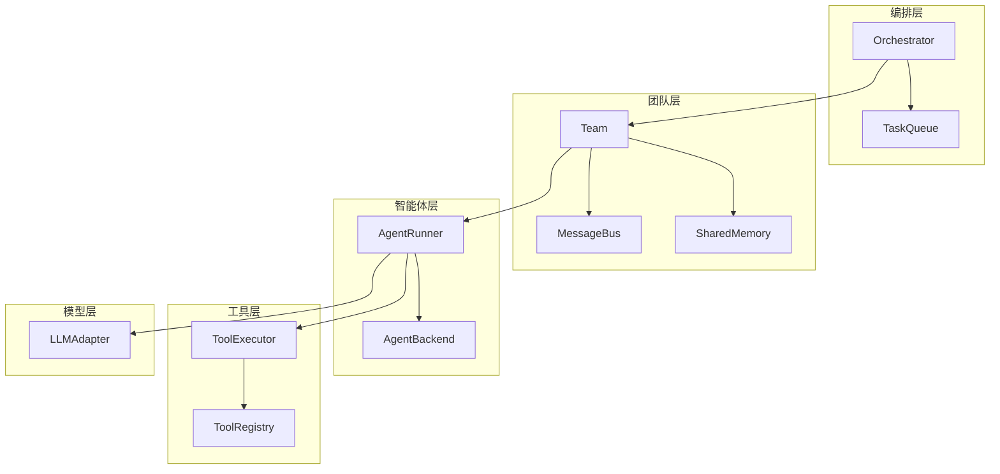
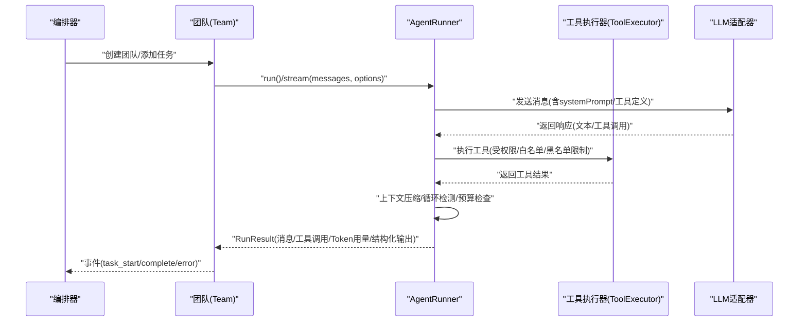
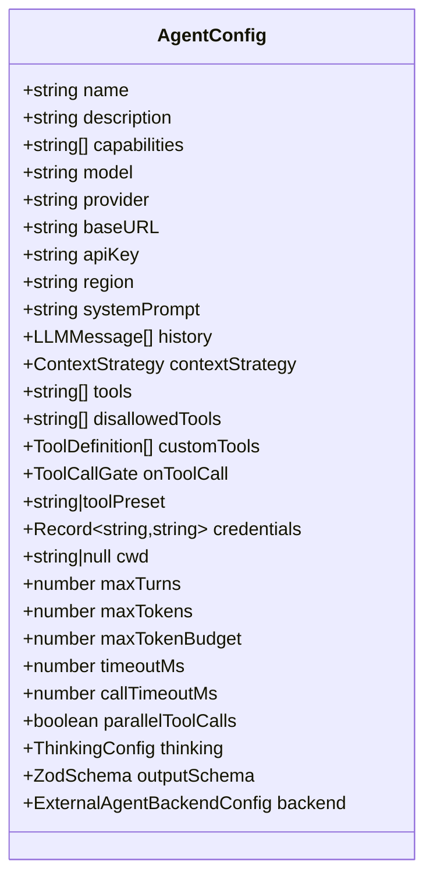
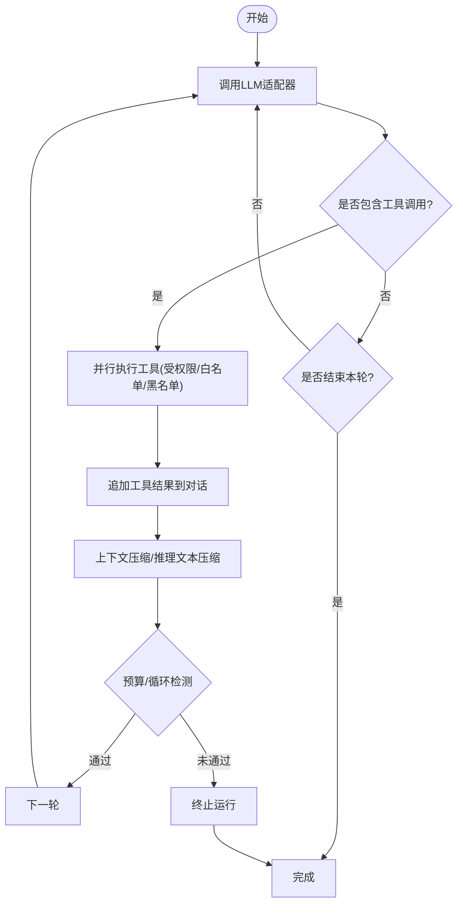
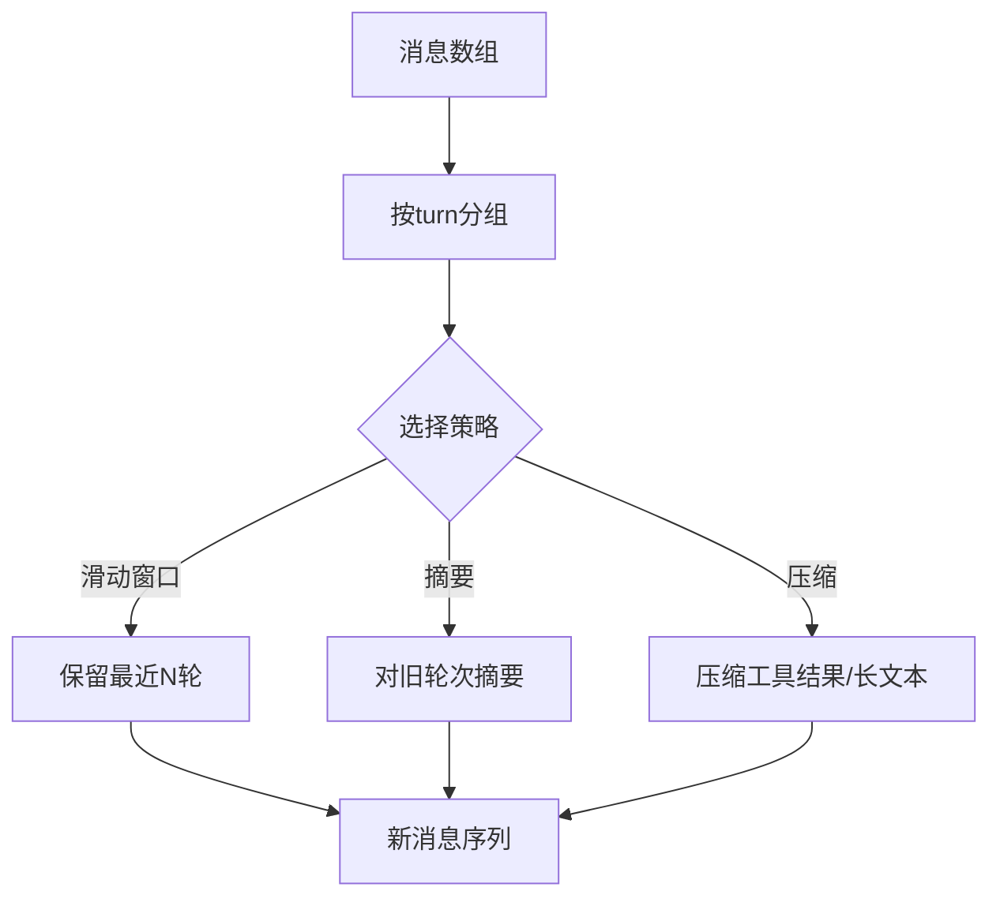
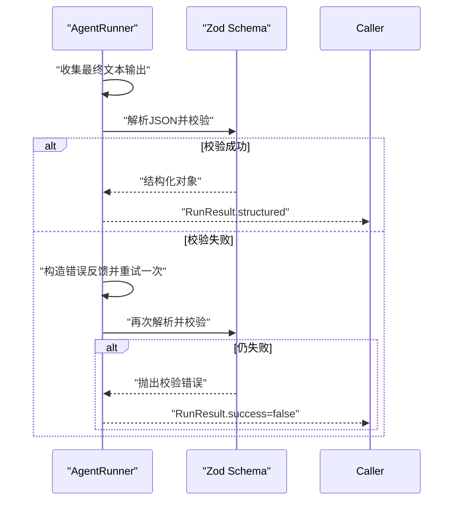
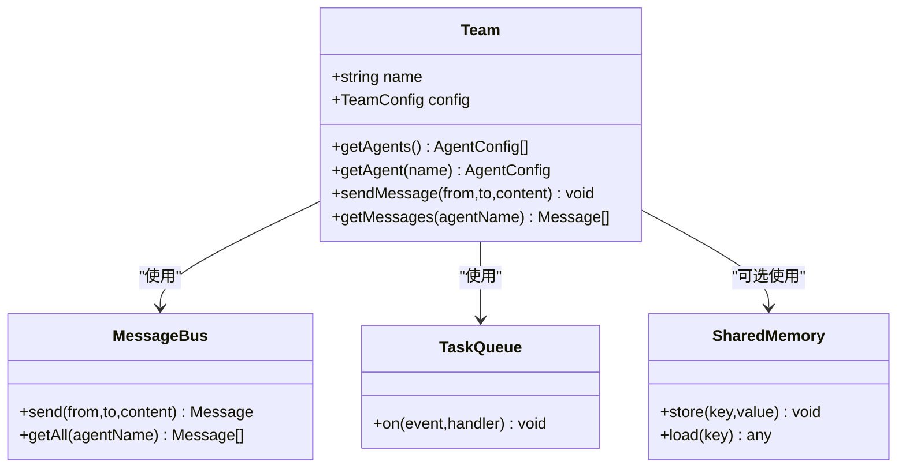
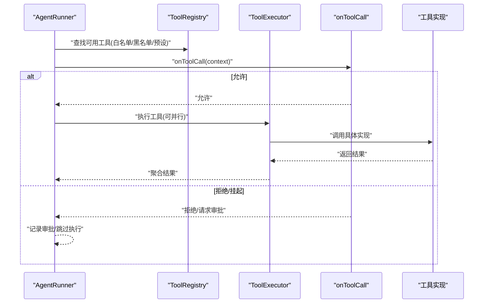
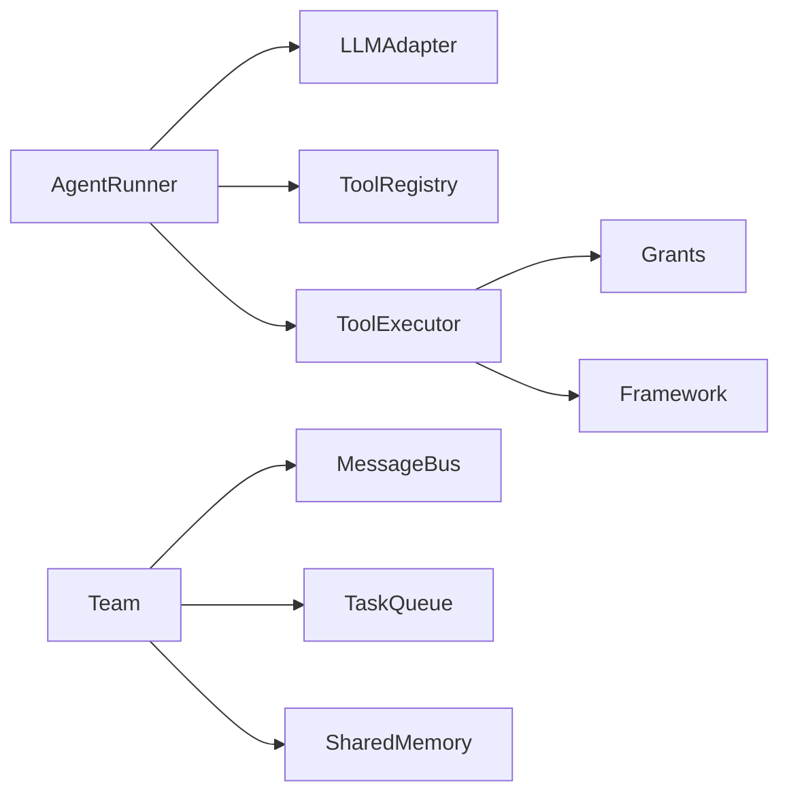

# 智能体系统

<cite>
**本文引用的文件**
- [README.md](file://README.md)
- [README_zh.md](file://README_zh.md)
- [types.ts](file://packages/core/src/types.ts)
- [runner.ts](file://packages/core/src/agent/runner.ts)
- [team.ts](file://packages/core/src/team/team.ts)
- [messaging.ts](file://packages/core/src/team/messaging.ts)
- [executor.ts](file://packages/core/src/tool/executor.ts)
- [framework.ts](file://packages/core/src/tool/framework.ts)
- [grants.ts](file://packages/core/src/tool/grants.ts)
- [errors.ts](file://packages/core/src/errors.ts)
</cite>

## 目录
1. [简介](#简介)
2. [项目结构](#项目结构)
3. [核心组件](#核心组件)
4. [架构总览](#架构总览)
5. [详细组件分析](#详细组件分析)
6. [依赖关系分析](#依赖关系分析)
7. [性能考虑](#性能考虑)
8. [故障排查指南](#故障排查指南)
9. [结论](#结论)
10. [附录](#附录)

## 简介
Open Multi-Agent（OMA）是一个面向 TypeScript 后端的多智能体编排框架，能够在任意 Node.js 应用中运行“动态工作流”：由协调器在运行时将目标分解为任务 DAG，并由确定性调度器分派给团队执行。整个运行过程以数据形式留存，支持审查、审批与回放。本章节聚焦智能体系统的配置、执行循环、对话管理、结构化输出、智能体池的资源管理与并发控制、自定义智能体的开发指南，以及智能体间通信与数据共享方式。

**章节来源**
- [README.md:46-108](file://README.md#L46-L108)
- [README_zh.md:46-107](file://README_zh.md#L46-L107)

## 项目结构
核心代码位于 packages/core/src，围绕以下模块组织：
- agent：智能体执行循环与后端抽象（AgentRunner、AgentBackend）
- team：团队（Team）对象，负责成员注册、消息总线、任务队列与共享记忆
- tool：工具注册、执行、权限与结果封装
- types：全局类型定义（AgentConfig、TeamConfig、RunResult、ContextStrategy 等）
- orchestrator、task、memory、observability 等：编排、任务、记忆、可观测性支撑

**图表来源**
- [team.ts:89-152](file://packages/core/src/team/team.ts#L89-L152)
- [runner.ts:472-486](file://packages/core/src/agent/runner.ts#L472-L486)
- [types.ts:1295-1310](file://packages/core/src/types.ts#L1295-L1310)

**章节来源**
- [team.ts:1-200](file://packages/core/src/team/team.ts#L1-L200)
- [runner.ts:1-112](file://packages/core/src/agent/runner.ts#L1-L112)
- [types.ts:173-204](file://packages/core/src/types.ts#L173-L204)

## 核心组件
- AgentConfig：单个智能体的静态配置，涵盖模型、提示词、工具权限、上下文策略、预算与超时、结构化输出、外部后端等。
- RunnerOptions/RunOptions：Runner 实例级与单次运行的运行时选项，包括采样参数、并行工具调用、工具白名单/黑名单、回调钩子、上下文压缩、预算与超时、检查点与审批等。
- TeamConfig：团队配置，包含成员列表、共享记忆开关或存储、最大并发度。
- AgentRunner：对话循环引擎，驱动 LLM 调用、工具执行、结果回写、上下文压缩、循环检测、预算控制与结构化输出校验。
- Team：团队协调对象，维护成员索引、消息总线、任务队列与共享记忆，并暴露事件总线供编排层订阅。

**章节来源**
- [types.ts:890-1195](file://packages/core/src/types.ts#L890-L1195)
- [types.ts:1295-1310](file://packages/core/src/types.ts#L1295-L1310)
- [runner.ts:81-177](file://packages/core/src/agent/runner.ts#L81-L177)
- [runner.ts:249-292](file://packages/core/src/agent/runner.ts#L249-L292)
- [team.ts:89-152](file://packages/core/src/team/team.ts#L89-L152)

## 架构总览
下图展示了从编排到执行的关键交互：编排层创建团队与任务；团队通过消息总线与共享记忆进行协作；AgentRunner 作为执行后端，驱动 LLM 与工具执行，并在必要时触发审批与检查点。

**图表来源**
- [runner.ts:472-486](file://packages/core/src/agent/runner.ts#L472-L486)
- [runner.ts:249-292](file://packages/core/src/agent/runner.ts#L249-L292)
- [team.ts:121-152](file://packages/core/src/team/team.ts#L121-L152)

## 详细组件分析

### AgentConfig：配置项详解
AgentConfig 是智能体的静态配置中心，覆盖以下关键维度：
- 身份与角色
  - name：智能体名称
  - description：一句话角色描述
  - capabilities：能力标签，用于选择信号
  - costTier/latencyClass/permissionBoundary：成本、延迟与信任边界标记
- 模型与后端
  - model/provider/baseURL/apiKey/region：模型与 Provider 配置
  - adapter：自定义 LLM 适配器
  - backend：外部后端（ACP 或通用进程），使非 LLM 智能体也能参与任务图
- 提示词与上下文
  - systemPrompt：系统提示词
  - history：历史消息恢复
  - contextStrategy：上下文管理策略（滑动窗口/摘要/压缩）
  - compressToolResults/compressReasoningText/preserveReasoningAsText：结果与推理文本压缩策略
- 工具与权限
  - tools/disallowedTools/toolPreset/customTools/onToolCall：工具注册、白名单/黑名单、预设与逐次门控
  - cwd：文件系统工具沙箱根目录
  - credentials：按智能体隔离的凭据注入
- 采样与生成控制
  - temperature/topP/topK/minP/frequencyPenalty/presencePenalty/parallelToolCalls/extraBody/thinking
- 运行边界
  - maxTurns/maxTokens/maxTokenBudget/timeoutMs/callTimeoutMs/loopDetection
- 结构化输出
  - outputSchema：最终输出的 Zod 模式校验与重试

**图表来源**
- [types.ts:890-1195](file://packages/core/src/types.ts#L890-L1195)

**章节来源**
- [types.ts:890-1195](file://packages/core/src/types.ts#L890-L1195)

### 执行循环机制：AgentRunner
AgentRunner 实现标准 agentic 对话循环：
- 向 LLM 适配器发送消息（含 systemPrompt、工具定义、上下文策略）
- 解析响应中的工具调用块，并行执行工具
- 将工具结果追加到对话，继续下一轮直到 end_turn 或达到上限
- 累积 Token 用量、时间统计，处理循环检测、预算超限、中止信号
- 支持检查点与持久化审批，确保中断后可恢复

**图表来源**
- [runner.ts:472-486](file://packages/core/src/agent/runner.ts#L472-L486)
- [runner.ts:249-292](file://packages/core/src/agent/runner.ts#L249-L292)
- [runner.ts:334-359](file://packages/core/src/agent/runner.ts#L334-L359)

**章节来源**
- [runner.ts:1-112](file://packages/core/src/agent/runner.ts#L1-L112)
- [runner.ts:249-292](file://packages/core/src/agent/runner.ts#L249-L292)
- [runner.ts:334-359](file://packages/core/src/agent/runner.ts#L334-L359)

### 对话管理与上下文策略
- 对话分组：将消息按原子 turn 分组，避免拆分 tool_use/tool_result 导致 API 拒绝
- 上下文策略：
  - sliding-window：保留最近 N 轮
  - summarize：对旧轮次进行摘要
  - compact：基于阈值压缩工具结果与长文本，保留近期若干轮
- 图片与媒体：在摘要前剥离二进制内容，仅保留占位信息
- 推理文本：可选将 reasoning block 降级为文本并压缩

**图表来源**
- [runner.ts:334-359](file://packages/core/src/agent/runner.ts#L334-L359)
- [runner.ts:375-390](file://packages/core/src/agent/runner.ts#L375-L390)
- [types.ts:191-204](file://packages/core/src/types.ts#L191-L204)

**章节来源**
- [runner.ts:334-359](file://packages/core/src/agent/runner.ts#L334-L359)
- [runner.ts:375-390](file://packages/core/src/agent/runner.ts#L375-L390)
- [types.ts:191-204](file://packages/core/src/types.ts#L191-L204)

### 结构化输出处理
- 当配置 outputSchema 时，AgentRunner 会在最后尝试将文本输出解析为 JSON 并按 Zod 模式校验
- 校验失败会进行一次带错误反馈的重试
- 成功则返回 structured 字段，便于上层消费强类型结果

**图表来源**
- [types.ts:1187-1195](file://packages/core/src/types.ts#L1187-L1195)
- [runner.ts:249-292](file://packages/core/src/agent/runner.ts#L249-L292)

**章节来源**
- [types.ts:1187-1195](file://packages/core/src/types.ts#L1187-L1195)
- [runner.ts:249-292](file://packages/core/src/agent/runner.ts#L249-L292)

### 智能体池（Team）与资源管理
- Team 维护成员索引、消息总线、任务队列与共享记忆
- 支持事件总线（task:ready/complete/failed/all:complete/message）
- 通过 TaskQueue 与 MessageBus 解耦任务派发与异步通信
- 共享记忆可通过内存或外部存储（Redis/Postgres）实现跨智能体数据共享

**图表来源**
- [team.ts:89-152](file://packages/core/src/team/team.ts#L89-L152)
- [messaging.ts:1-200](file://packages/core/src/team/messaging.ts#L1-L200)

**章节来源**
- [team.ts:89-152](file://packages/core/src/team/team.ts#L89-L152)
- [messaging.ts:1-200](file://packages/core/src/team/messaging.ts#L1-L200)

### 并发控制与性能优化
- 团队并发：TeamConfig.maxConcurrency 限制同时执行的任务数
- 工具并行：RunnerOptions.parallelToolCalls 允许单轮内多个工具调用并行
- 上下文压缩：ContextStrategy 控制输入增长，避免超出上下文限制
- 预算与超时：maxTokenBudget/timeoutMs/callTimeoutMs 保证运行有界
- 循环检测：LoopDetector 防止重复工具调用或文本导致的死循环

**章节来源**
- [types.ts:1295-1310](file://packages/core/src/types.ts#L1295-L1310)
- [runner.ts:112-116](file://packages/core/src/agent/runner.ts#L112-L116)
- [types.ts:191-204](file://packages/core/src/types.ts#L191-L204)
- [types.ts:1085-1110](file://packages/core/src/types.ts#L1085-L1110)

### 工具权限与执行
- 工具注册与发现：ToolRegistry 集中管理工具定义
- 执行与结果：ToolExecutor 负责并行执行与结果聚合
- 权限控制：
  - toolPreset：readonly/readwrite/full 预设
  - allowedTools/disallowedTools：白名单/黑名单
  - onToolCall：逐次门控，可在执行前决定 deny/allow/suspend
- 沙箱：cwd 限制文件系统工具访问范围
- 凭据隔离：credentials 按智能体注入，避免跨智能体泄露

**图表来源**
- [executor.ts:1-200](file://packages/core/src/tool/executor.ts#L1-L200)
- [framework.ts:1-200](file://packages/core/src/tool/framework.ts#L1-L200)
- [grants.ts:1-200](file://packages/core/src/tool/grants.ts#L1-L200)
- [types.ts:975-986](file://packages/core/src/types.ts#L975-L986)

**章节来源**
- [executor.ts:1-200](file://packages/core/src/tool/executor.ts#L1-L200)
- [framework.ts:1-200](file://packages/core/src/tool/framework.ts#L1-L200)
- [grants.ts:1-200](file://packages/core/src/tool/grants.ts#L1-L200)
- [types.ts:975-986](file://packages/core/src/types.ts#L975-L986)

### 自定义智能体开发指南
- 生命周期钩子：
  - onWarning：检测到潜在配置问题时触发
  - onCheckpoint：在可恢复边界处持久化状态
  - onApprovalRequest/onApprovalPrepare/onApprovalConsumed：审批流程钩子
  - onToolResult/onMessage：工具结果与消息追加回调
- 错误处理：
  - 捕获 LLM 调用超时、预算超限、循环检测等异常
  - 通过 RunResult.success/budgetExceeded/loopDetected 标识失败原因
- 状态管理：
  - 使用 history/contextStrategy 维持多轮对话
  - 使用 credentials 隔离凭据，避免越权
  - 使用 shared memory 与 message bus 与其他智能体协作

**章节来源**
- [runner.ts:200-247](file://packages/core/src/agent/runner.ts#L200-L247)
- [types.ts:1247-1282](file://packages/core/src/types.ts#L1247-L1282)
- [errors.ts:1-200](file://packages/core/src/errors.ts#L1-L200)

### 智能体间通信与数据共享
- 点对点消息：Team.sendMessage(from,to,content)，MessageBus 持久化并通知订阅者
- 广播与查询：getMessages(agentName) 获取某智能体的全部消息
- 共享记忆：SharedMemory 提供键值存储，支持内存或外部存储，跨智能体共享数据
- 事件总线：Team 暴露 task:message/task:complete/all:complete 等事件，供编排层监听

**章节来源**
- [team.ts:176-200](file://packages/core/src/team/team.ts#L176-L200)
- [messaging.ts:1-200](file://packages/core/src/team/messaging.ts#L1-L200)

## 依赖关系分析
- AgentRunner 依赖 LLMAdapter、ToolRegistry、ToolExecutor，并通过 RunnerOptions/RunOptions 注入运行时行为
- Team 依赖 MessageBus、TaskQueue、SharedMemory，提供团队级协作能力
- Tool 子系统通过 framework.ts 定义工具接口，grants.ts 管理默认权限，executor.ts 执行工具
- 类型系统集中在 types.ts，贯穿各模块

**图表来源**
- [runner.ts:472-486](file://packages/core/src/agent/runner.ts#L472-L486)
- [team.ts:89-152](file://packages/core/src/team/team.ts#L89-L152)
- [executor.ts:1-200](file://packages/core/src/tool/executor.ts#L1-L200)
- [framework.ts:1-200](file://packages/core/src/tool/framework.ts#L1-L200)
- [grants.ts:1-200](file://packages/core/src/tool/grants.ts#L1-L200)

**章节来源**
- [runner.ts:472-486](file://packages/core/src/agent/runner.ts#L472-L486)
- [team.ts:89-152](file://packages/core/src/team/team.ts#L89-L152)
- [executor.ts:1-200](file://packages/core/src/tool/executor.ts#L1-L200)
- [framework.ts:1-200](file://packages/core/src/tool/framework.ts#L1-L200)
- [grants.ts:1-200](file://packages/core/src/tool/grants.ts#L1-L200)

## 性能考虑
- 合理设置 maxTurns/maxTokens/maxTokenBudget，避免无界消耗
- 启用 parallelToolCalls 提升吞吐，但需评估后端兼容性
- 使用 ContextStrategy 控制上下文增长，减少 token 压力
- 利用 loopDetection 防止无效循环
- 使用 onToolCall 做细粒度权限控制，减少不必要执行
- 通过 shared memory 缓存热点数据，降低重复计算

[本节为通用指导，不直接分析具体文件]

## 故障排查指南
- 常见错误类型：
  - LLM 调用超时：callTimeoutMs 触发 LLMCallTimeoutError
  - 预算超限：maxTokenBudget 触发 TokenBudgetExceededError
  - 循环检测：loopDetected=true，需调整 prompt 或工具参数
- 调试建议：
  - 使用 onWarning 捕获潜在配置问题
  - 使用 onCheckpoint/onApprovalRequest 跟踪审批与检查点
  - 查看 RunResult.toolCalls 与 messages 定位问题轮次
  - 结合 observability trace 回放任务 DAG 与 span 瀑布

**章节来源**
- [errors.ts:1-200](file://packages/core/src/errors.ts#L1-L200)
- [runner.ts:200-247](file://packages/core/src/agent/runner.ts#L200-L247)
- [types.ts:1247-1282](file://packages/core/src/types.ts#L1247-L1282)

## 结论
Open Multi-Agent 的智能体系统以 AgentConfig 为核心配置入口，通过 AgentRunner 实现稳健的执行循环，配合 Team 的消息总线与共享记忆，形成可扩展、可控、可观测的多智能体编排能力。借助工具权限、上下文策略、预算与超时控制、结构化输出校验与审批机制，开发者可以在生产环境中构建高可靠的多智能体应用。

[本节为总结性内容，不直接分析具体文件]

## 附录
- 快速开始与示例：参考 README 与示例索引，体验 runTeam/runAgent/runTasks 三种模式
- Provider 与工具配置：参考 providers.md 与 tool-configuration.md
- 上下文管理：参考 context-management.md
- 共享记忆：参考 shared-memory.md
- 任务调度与执行路由：参考 task-scheduling.md 与 execution-routing.md

**章节来源**
- [README.md:150-158](file://README.md#L150-L158)
- [README_zh.md:153-161](file://README_zh.md#L153-L161)