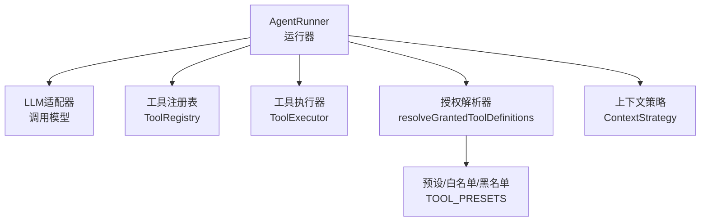
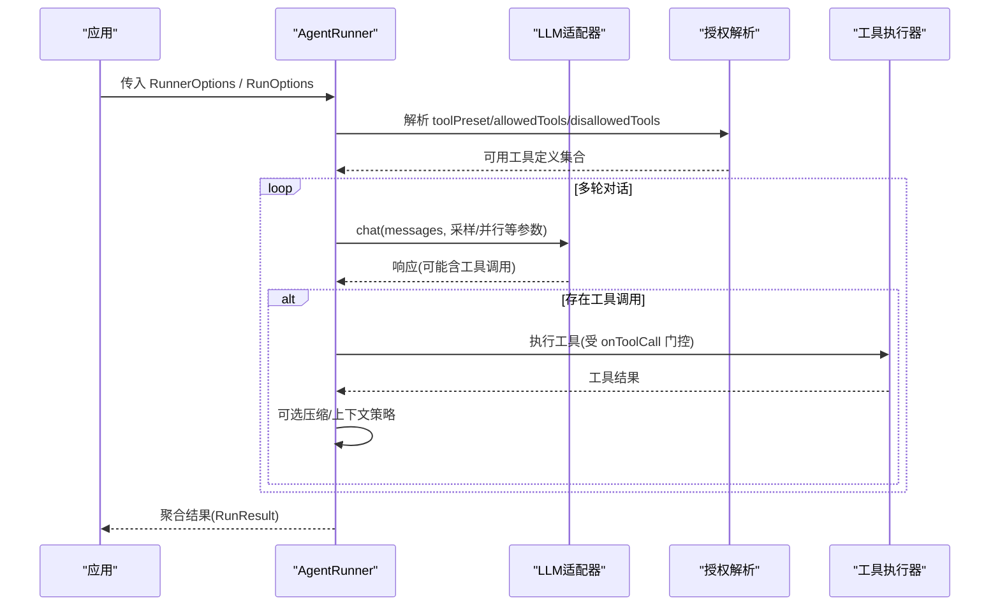
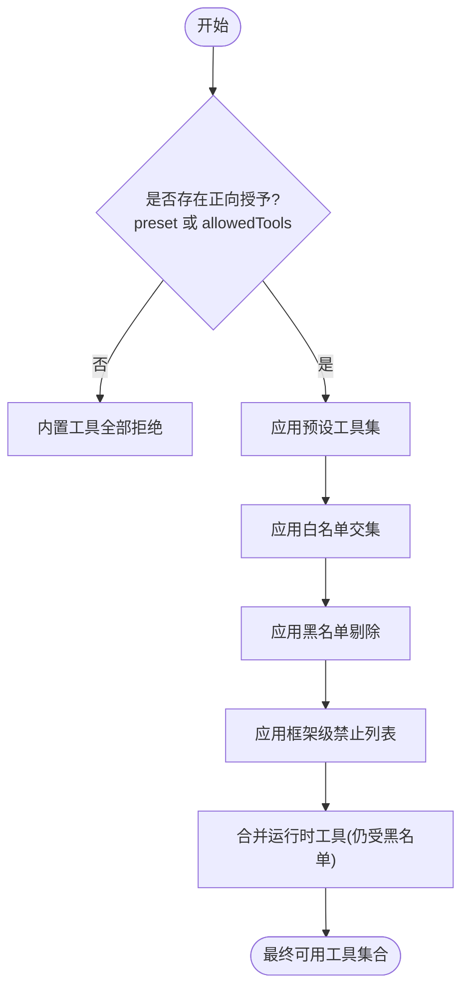
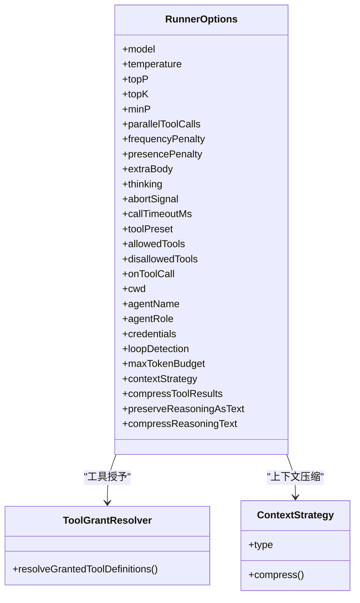

# 智能体配置

<cite>
**本文引用的文件**
- [runner.ts](file://packages/core/src/agent/runner.ts)
- [grants.ts](file://packages/core/src/tool/grants.ts)
- [types.ts](file://packages/core/src/types.ts)
- [tool-configuration.md](file://docs/tool-configuration.md)
- [context-management.md](file://docs/context-management.md)
</cite>

## 目录
1. [简介](#简介)
2. [项目结构](#项目结构)
3. [核心组件](#核心组件)
4. [架构总览](#架构总览)
5. [详细组件分析](#详细组件分析)
6. [依赖关系分析](#依赖关系分析)
7. [性能考量](#性能考量)
8. [故障排查指南](#故障排查指南)
9. [结论](#结论)
10. [附录](#附录)

## 简介
本文面向使用 Open Multi Agent 框架的开发者，系统化梳理智能体的静态运行期配置 RunnerOptions，覆盖模型采样参数、执行控制、工具权限管理、上下文策略与结果压缩等关键维度。文档同时给出不同权限模式（只读、读写、完整）的配置差异、优先级与覆盖规则，以及按业务场景定制配置的实践建议。

## 项目结构
RunnerOptions 定义于核心运行器模块，工具权限解析由独立的授权模块提供，类型与行为说明在类型定义与文档中补充。

图表来源
- [runner.ts:472-486](file://packages/core/src/agent/runner.ts#L472-L486)
- [grants.ts:35-89](file://packages/core/src/tool/grants.ts#L35-L89)

章节来源
- [runner.ts:1-177](file://packages/core/src/agent/runner.ts#L1-L177)
- [grants.ts:1-90](file://packages/core/src/tool/grants.ts#L1-L90)

## 核心组件
- 运行器：负责对话循环、工具调用编排、上下文压缩、预算与超时控制。
- 授权解析：基于预设、白名单、黑名单计算最终可用工具集合。
- 类型与文档：定义各配置项语义、默认值与行为约束。

章节来源
- [runner.ts:81-177](file://packages/core/src/agent/runner.ts#L81-L177)
- [types.ts:1165-1191](file://packages/core/src/types.ts#L1165-L1191)
- [tool-configuration.md:214-289](file://docs/tool-configuration.md#L214-L289)

## 架构总览
RunnerOptions 在构造 AgentRunner 时生效，贯穿每次 run/stream 调用；RunOptions 为单次调用级回调与追踪选项。两者共同决定一次运行的行为边界。

图表来源
- [runner.ts:472-486](file://packages/core/src/agent/runner.ts#L472-L486)
- [runner.ts:948-961](file://packages/core/src/agent/runner.ts#L948-L961)
- [grants.ts:35-89](file://packages/core/src/tool/grants.ts#L35-L89)

## 详细组件分析

### RunnerOptions 配置项详解
以下按类别逐项说明作用、默认值、适用场景与最佳实践。

- 模型与采样
  - model: 必填。指定 LLM 模型标识。用于所有适配器调用。
  - temperature: 采样温度，影响输出随机性。
  - topP: 核采样阈值，控制词表截断范围。
  - topK: Top-k 采样，部分本地兼容服务支持；云 OpenAI 会拒绝该参数。
  - minP: Min-p 采样，仅 OpenAI 兼容本地服务器支持；云 OpenAI 拒绝，Anthropic 忽略。
  - parallelToolCalls: 是否允许单轮并发工具调用；OpenAI 云与兼容服务有效，Anthropic 忽略。
  - frequencyPenalty/presencePenalty: 频率/存在惩罚，OpenAI 系列有效，Anthropic 忽略。
  - extraBody: 透传给适配器的额外请求体字段，用于厂商特定能力。
  - thinking: 推理/思考相关配置（如跨提供商推理文本保留）。
  - callTimeoutMs: 单次适配器调用的超时上限，配合 AbortSignal 实现细粒度超时。
  - abortSignal: 取消信号，可中断当前或后续调用。

- 执行控制
  - maxTurns: 最大工具调用往返次数，防止无限循环；默认 10。
  - maxTokens: 单次 LLM 响应的最大输出 token 数。
  - maxTokenBudget: 本次运行累计 token 上限（输入+输出），达到后停止。
  - loopDetection: 环路检测配置，检测到重复行为时告警或终止。

- 工具权限管理
  - toolPreset: 预设工具集，取值 readonly/readwrite/full。
  - allowedTools: 白名单，限定具体工具名。
  - disallowedTools: 黑名单，从已授予工具集中剔除。
  - onToolCall: 每次工具调用的门控回调，可在执行前放行/拒绝/挂起。
  - cwd: 内置文件系统工具的根目录；null 禁用沙箱，undefined 回退到进程工作区下的 .agent-workspace。
  - agentName/agentRole/credentials: 工具上下文中的身份与凭据注入。

- 上下文策略与结果压缩
  - contextStrategy: 长对话上下文压缩策略（滑动窗口/摘要/紧凑/自定义）。
  - compressToolResults: 对已消费的工具结果进行压缩替换，减少后续轮次输入成本。
  - preserveReasoningAsText/compressReasoningText: 跨提供商推理文本保留与压缩策略。

章节来源
- [runner.ts:81-177](file://packages/core/src/agent/runner.ts#L81-L177)
- [runner.ts:948-961](file://packages/core/src/agent/runner.ts#L948-L961)
- [context-management.md:1-55](file://docs/context-management.md#L1-L55)
- [tool-configuration.md:214-289](file://docs/tool-configuration.md#L214-L289)

### 工具权限解析与优先级
工具授予遵循“默认拒绝 → 预设 → 白名单 → 黑名单 → 框架安全轨”的顺序。自定义/运行时工具通过注册即授予，但仍受黑名单限制。

图表来源
- [grants.ts:35-89](file://packages/core/src/tool/grants.ts#L35-L89)

章节来源
- [grants.ts:11-15](file://packages/core/src/tool/grants.ts#L11-L15)
- [grants.ts:35-89](file://packages/core/src/tool/grants.ts#L35-L89)
- [tool-configuration.md:214-289](file://docs/tool-configuration.md#L214-L289)

### 上下文策略与工具结果压缩
- contextStrategy
  - sliding-window: 保留最近 N 轮，丢弃更早历史，开销最低。
  - summarize: 将旧历史交给摘要模型生成摘要，节省空间但增加一次 LLM 调用。
  - compact: 规则化压缩大文本块与工具结果，不额外调用模型。
  - custom: 自定义压缩函数。
- compressToolResults
  - true: 启用默认阈值（约 500 字符）压缩已消费结果。
  - { minChars: N }: 仅当结果长度超过 N 时压缩。
  - false/未设置: 不压缩。
  - 注意：错误结果与委托代理结果不会被压缩；富媒体结果按估计大小处理。

章节来源
- [context-management.md:1-55](file://docs/context-management.md#L1-L55)
- [runner.ts:683-797](file://packages/core/src/agent/runner.ts#L683-L797)
- [runner.ts:1728-1790](file://packages/core/src/agent/runner.ts#L1728-L1790)

### 不同权限模式的配置差异
- 只读模式
  - 目标：仅读取与分析，不修改任何资源。
  - 推荐：toolPreset='readonly'；必要时用 allowedTools 进一步收敛；disallowedTools 排除潜在风险工具。
  - 典型工具：file_read、grep、glob。
- 读写模式
  - 目标：允许编辑与创建文件，但不执行任意命令。
  - 推荐：toolPreset='readwrite'；如需更精细控制，叠加 allowedTools/disallowedTools。
  - 典型工具：file_read、file_write、file_edit、grep、glob。
- 完整权限模式
  - 目标：需要 shell 执行能力（例如自动化脚本、构建流程）。
  - 推荐：toolPreset='full'；谨慎评估安全风险，结合 onToolCall 做参数级审批。
  - 典型工具：上述读写工具 + bash。

章节来源
- [tool-configuration.md:251-289](file://docs/tool-configuration.md#L251-L289)

### 配置优先级与覆盖规则
- 工具授予顺序
  - 默认拒绝（未声明 preset/tools）→ 预设 → 白名单交集 → 黑名单剔除 → 框架级禁止 → 合并运行时工具（仍受黑名单）。
- 运行级覆盖
  - RunOptions.abortSignal 优先于 RunnerOptions.abortSignal。
  - 运行级 maxTokenBudget 与编排层 maxTokenBudget 取较小者生效。
- 上下文策略
  - contextStrategy 与 compressToolResults 可组合使用以最大化上下文空间。
- 推理文本
  - preserveReasoningAsText 开启时，compressReasoningText 默认启用并裁剪至合理长度；可按需调整阈值。

章节来源
- [grants.ts:35-89](file://packages/core/src/tool/grants.ts#L35-L89)
- [runner.ts:237-241](file://packages/core/src/agent/runner.ts#L237-L241)
- [types.ts:1510-1540](file://packages/core/src/types.ts#L1510-L1540)
- [context-management.md:74-114](file://docs/context-management.md#L74-L114)

### 按业务需求定制配置的建议
- 高可靠批处理
  - 限制 maxTurns、maxTokens、maxTokenBudget；启用 loopDetection；使用 sliding-window 或 summarize 控制上下文。
- 交互式助手
  - 适度提高 temperature/topP；开启 parallelToolCalls 提升吞吐；按需启用 compressToolResults 降低长对话成本。
- 受限环境
  - 使用 readonly 或 readwrite 预设；关闭 bash；通过 onToolCall 实施参数级审批；严格设置 cwd 沙箱。
- 跨提供商推理
  - 开启 preserveReasoningAsText；根据目标提供商能力调整 compressReasoningText；关注提供商兼容性。

[本节为通用指导，无需列出具体源码行]

## 依赖关系分析
RunnerOptions 与授权、上下文策略、适配器调用之间的耦合如下：

图表来源
- [runner.ts:81-177](file://packages/core/src/agent/runner.ts#L81-L177)
- [grants.ts:35-89](file://packages/core/src/tool/grants.ts#L35-L89)

章节来源
- [runner.ts:81-177](file://packages/core/src/agent/runner.ts#L81-L177)
- [grants.ts:35-89](file://packages/core/src/tool/grants.ts#L35-L89)

## 性能考量
- 采样参数
  - temperature/topP/topK/minP 会影响生成质量与耗时；生产环境建议固定 seed 或保守取值以保证稳定性。
- 并发工具调用
  - parallelToolCalls 可提升吞吐，但需确保下游工具具备并发能力与幂等性。
- 上下文压缩
  - sliding-window 最轻量；summarize 引入额外 LLM 调用；compact 无额外调用但需权衡信息丢失。
- 预算与超时
  - 合理设置 maxTokenBudget 与 callTimeoutMs，避免长时间占用资源；结合 AbortSignal 实现优雅降级。
- 结果压缩
  - compressToolResults 显著降低长对话成本；注意错误结果与委托结果不被压缩。

[本节为通用指导，无需列出具体源码行]

## 故障排查指南
- 工具未生效
  - 检查是否声明了正向授予（preset 或 tools）；确认黑名单未误删；查看控制台冲突警告。
- 模型拒绝参数
  - topK/minP 在云 OpenAI 会被拒绝；Anthropic 忽略 minP；请根据提供商能力取舍。
- 上下文溢出
  - 启用 contextStrategy；对长对话优先尝试 sliding-window 或 summarize；配合 compressToolResults。
- 循环卡住
  - 启用 loopDetection；适当降低 maxTurns；审查提示词与工具设计。
- 超时与中断
  - 设置 callTimeoutMs 与 abortSignal；区分调用级超时与全局取消。

章节来源
- [grants.ts:41-57](file://packages/core/src/tool/grants.ts#L41-L57)
- [runner.ts:561-582](file://packages/core/src/agent/runner.ts#L561-L582)
- [context-management.md:24-55](file://docs/context-management.md#L24-L55)

## 结论
RunnerOptions 提供了从模型采样、执行控制到工具权限与上下文管理的完整配置面。通过预设、白名单、黑名单的组合，可实现从只读到完整权限的灵活授权；借助上下文策略与结果压缩，可稳定支撑长对话与高吞吐场景。建议在业务侧明确安全边界与成本目标，选择合适的策略组合，并通过 onToolCall 与预算/超时机制实现可控的执行闭环。

[本节为总结性内容，无需列出具体源码行]

## 附录
- 快速对照表
  - 只读：toolPreset='readonly'；适合分析与检索。
  - 读写：toolPreset='readwrite'；适合代码编辑与文件操作。
  - 完整：toolPreset='full'；适合自动化与脚本执行。
- 常用组合
  - 长对话：contextStrategy=sliding-window/summarize + compressToolResults=true。
  - 高可靠：maxTurns 限制 + loopDetection + maxTokenBudget。
  - 跨提供商：preserveReasoningAsText=true + compressReasoningText 按需裁剪。

[本节为参考信息，无需列出具体源码行]