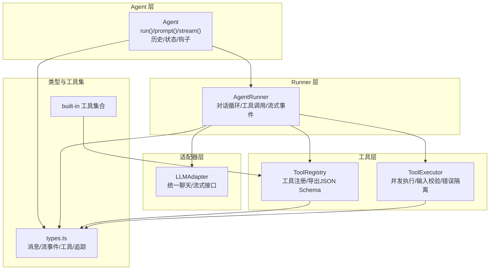
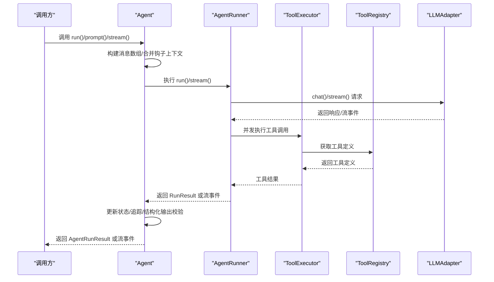
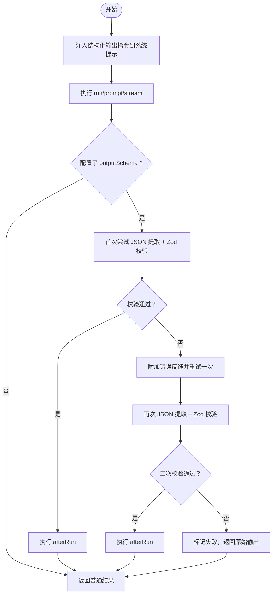
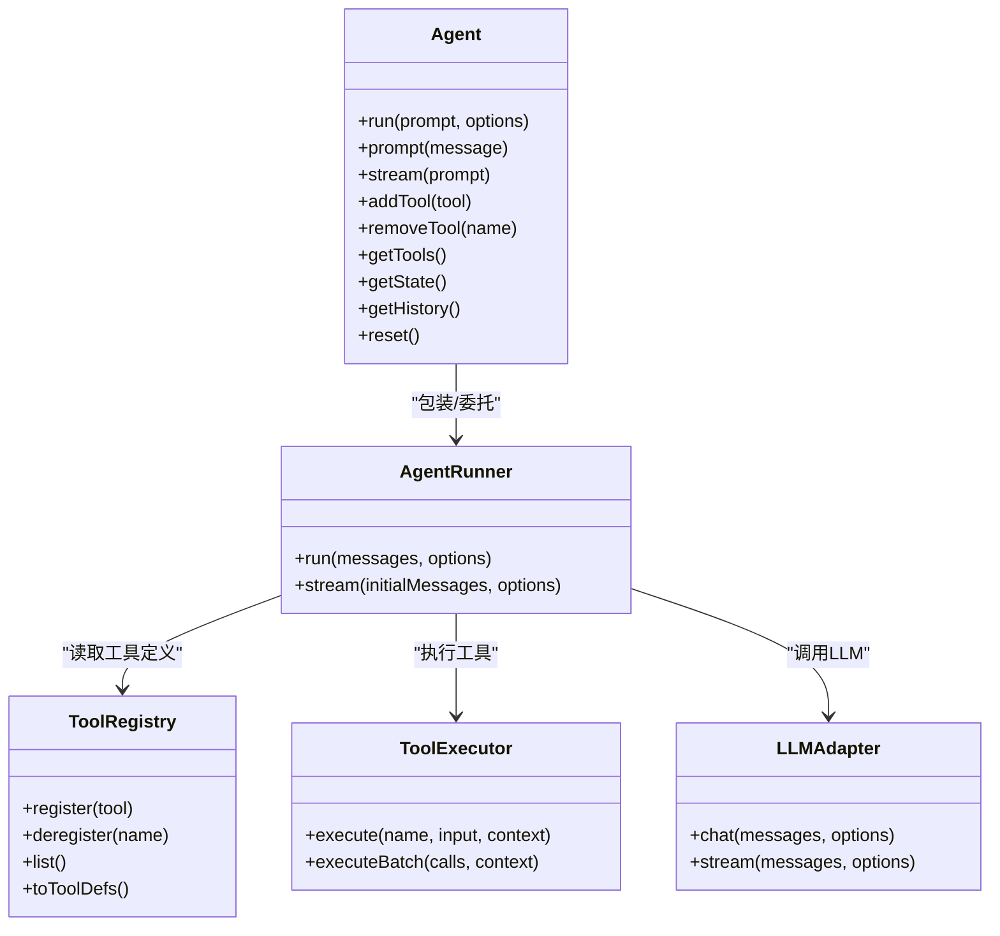

# Agent 类详解

<cite>
**本文引用的文件列表**
- [agent.ts](file://src/agent/agent.ts)
- [runner.ts](file://src/agent/runner.ts)
- [types.ts](file://src/types.ts)
- [framework.ts](file://src/tool/framework.ts)
- [executor.ts](file://src/tool/executor.ts)
- [structured-output.ts](file://src/agent/structured-output.ts)
- [index.ts](file://src/tool/built-in/index.ts)
- [01-single-agent.ts](file://examples/01-single-agent.ts)
- [agent-hooks.test.ts](file://tests/agent-hooks.test.ts)
</cite>

## 目录
1. [简介](#简介)
2. [项目结构](#项目结构)
3. [核心组件](#核心组件)
4. [架构总览](#架构总览)
5. [详细组件分析](#详细组件分析)
6. [依赖关系分析](#依赖关系分析)
7. [性能考量](#性能考量)
8. [故障排查指南](#故障排查指南)
9. [结论](#结论)
10. [附录：配置选项与最佳实践](#附录配置选项与最佳实践)

## 简介
本文件面向使用者与开发者，系统性解读 Agent 类的设计理念、架构模式与运行机制。Agent 类是框架的主要对外接口，负责：
- 包装 AgentRunner，提供三类执行模式：run（一次性）、prompt（多轮会话）、stream（流式增量）
- 维护持久对话历史，支持多轮交互
- 动态工具注册与管理（addTool、removeTool、getTools）
- 生命周期状态管理（idle → running → completed | error）
- 钩子函数系统（beforeRun、afterRun），贯穿 run/prompt/stream
- 结构化输出验证与重试（可选）

## 项目结构
围绕 Agent 的关键模块如下：
- src/agent/agent.ts：对外的高层 Agent 类
- src/agent/runner.ts：核心对话循环引擎（AgentRunner）
- src/agent/structured-output.ts：结构化输出指令构建、JSON提取与校验
- src/tool/framework.ts：工具定义与注册表
- src/tool/executor.ts：工具执行器（并发控制、错误隔离）
- src/types.ts：公共类型定义（消息、流事件、工具、追踪等）
- examples/01-single-agent.ts：示例，展示 run/prompt/stream 的用法
- tests/agent-hooks.test.ts：钩子函数行为的单元测试

图表来源
- [agent.ts:81-163](file://src/agent/agent.ts#L81-L163)
- [runner.ts:166-176](file://src/agent/runner.ts#L166-L176)
- [framework.ts:93-203](file://src/tool/framework.ts#L93-L203)
- [executor.ts:47-54](file://src/tool/executor.ts#L47-L54)
- [types.ts:63-81](file://src/types.ts#L63-L81)
- [index.ts:46-50](file://src/tool/built-in/index.ts#L46-L50)

章节来源
- [agent.ts:1-115](file://src/agent/agent.ts#L1-L115)
- [runner.ts:1-75](file://src/agent/runner.ts#L1-L75)
- [types.ts:1-120](file://src/types.ts#L1-L120)

## 核心组件
- Agent 类：对外接口，封装 AgentRunner，管理历史、状态、钩子、结构化输出与动态工具注册。
- AgentRunner：核心引擎，负责与 LLM 适配器通信、解析工具调用、并发执行工具、循环控制、流事件产出与回环检测。
- ToolRegistry：工具注册表，提供注册/注销/查询/导出 JSON Schema 能力。
- ToolExecutor：工具执行器，基于并发信号量限制并发，输入通过 Zod 校验，异常转为工具结果返回。
- 结构化输出工具：在系统提示中注入 JSON Schema 指令，从文本中提取 JSON 并用 Zod 校验，失败时自动重试一次。
- 类型系统：统一的消息、流事件、工具、追踪等类型定义。

章节来源
- [agent.ts:81-114](file://src/agent/agent.ts#L81-L114)
- [runner.ts:166-176](file://src/agent/runner.ts#L166-L176)
- [framework.ts:93-203](file://src/tool/framework.ts#L93-L203)
- [executor.ts:47-90](file://src/tool/executor.ts#L47-L90)
- [structured-output.ts:21-127](file://src/agent/structured-output.ts#L21-L127)
- [types.ts:63-120](file://src/types.ts#L63-L120)

## 架构总览
Agent 与 AgentRunner 的关系：Agent 以“包装器”身份存在，延迟初始化 AgentRunner；在每次 run/prompt/stream 前后，Agent 负责：
- 构建消息数组（run 使用全新数组；prompt 追加到持久历史；stream 同 run）
- 触发钩子（beforeRun/afterRun）
- 处理超时与取消信号
- 管理状态机与追踪事件
- 在配置了结构化输出时进行 JSON 提取与校验，并在失败时重试一次

图表来源
- [agent.ts:287-372](file://src/agent/agent.ts#L287-L372)
- [runner.ts:191-222](file://src/agent/runner.ts#L191-L222)
- [executor.ts:70-90](file://src/tool/executor.ts#L70-L90)
- [framework.ts:102-110](file://src/tool/framework.ts#L102-L110)

## 详细组件分析

### Agent 类设计与职责
- 对外接口：run、prompt、stream 三种模式，分别对应一次性、多轮会话、流式增量。
- 历史管理：prompt 模式维护持久历史，run/stream 不修改历史。
- 动态工具：addTool/removeTool/getTools 支持运行时注册与查询。
- 生命周期：状态机 idle → running → completed | error，错误路径统一包装。
- 钩子系统：beforeRun/afterRun 可修改提示词或结果，贯穿所有模式。
- 结构化输出：当配置 outputSchema 时，自动注入系统提示、提取 JSON、Zod 校验，失败重试一次。
- 追踪与统计：emitAgentTrace 输出 agent 类型追踪事件，包含 turns、tokens、toolCalls 等。

章节来源
- [agent.ts:81-114](file://src/agent/agent.ts#L81-L114)
- [agent.ts:169-224](file://src/agent/agent.ts#L169-L224)
- [agent.ts:257-277](file://src/agent/agent.ts#L257-L277)
- [agent.ts:287-372](file://src/agent/agent.ts#L287-L372)
- [agent.ts:374-394](file://src/agent/agent.ts#L374-L394)
- [agent.ts:400-477](file://src/agent/agent.ts#L400-L477)

### AgentRunner 核心循环与流式事件
- 循环控制：maxTurns 限制轮次；每轮根据是否包含工具调用决定是否继续。
- 工具执行：并行执行多个工具调用，每个工具输入经 Zod 校验，异常转为工具结果。
- 流事件：text、tool_use、tool_result、loop_detected、done、error 六种事件类型。
- 回环检测：可配置窗口大小与重复阈值，支持 warn/terminate/inject 等策略。
- 追踪：发出 llm_call、tool_call、agent 三类追踪事件。

章节来源
- [runner.ts:166-176](file://src/agent/runner.ts#L166-L176)
- [runner.ts:191-222](file://src/agent/runner.ts#L191-L222)
- [runner.ts:223-522](file://src/agent/runner.ts#L223-L522)
- [runner.ts:247-262](file://src/agent/runner.ts#L247-L262)

### 工具注册与执行
- ToolRegistry：注册/注销/查询/导出工具定义（JSON Schema），用于 LLM API。
- ToolExecutor：并发执行工具，最大并发默认 4；输入校验失败、执行异常均转为工具结果。
- built-in 工具：提供 bash、file-read/write/edit、grep 等常用工具，可通过 registerBuiltInTools 一键注册。

章节来源
- [framework.ts:93-203](file://src/tool/framework.ts#L93-L203)
- [executor.ts:47-90](file://src/tool/executor.ts#L47-L90)
- [index.ts:46-50](file://src/tool/built-in/index.ts#L46-L50)

### 结构化输出流程
- 注入系统提示：将 Zod schema 转换为 JSON Schema 并拼接至 systemPrompt。
- JSON 提取：优先解析直接 JSON，其次尝试带标签的代码块，最后尝试裸 JSON 片段。
- Zod 校验：失败时抛错；若配置了 outputSchema，则在首次失败后自动重试一次，重试时附加错误反馈。
- afterRun：在结构化输出校验之后执行，可进一步处理结果。

图表来源
- [agent.ts:134-141](file://src/agent/agent.ts#L134-L141)
- [agent.ts:400-477](file://src/agent/agent.ts#L400-L477)
- [structured-output.ts:21-127](file://src/agent/structured-output.ts#L21-L127)

### 钩子函数系统（beforeRun/afterRun）
- beforeRun：接收包含 prompt 与 agent 配置的上下文，可修改 prompt 文本；仅替换最后一个用户消息中的文本块，保留非文本内容（如图片）。
- afterRun：在 run 成功完成后执行，可修改最终结果；若 run 抛错则不触发。
- 适用范围：run、prompt、stream 三种模式均会触发 beforeRun/afterRun。

章节来源
- [agent.ts:296-301](file://src/agent/agent.ts#L296-L301)
- [agent.ts:339-352](file://src/agent/agent.ts#L339-L352)
- [agent.ts:487-492](file://src/agent/agent.ts#L487-L492)
- [agent.ts:506-511](file://src/agent/agent.ts#L506-L511)
- [agent.ts:532-570](file://src/agent/agent.ts#L532-L570)
- [agent-hooks.test.ts:85-140](file://tests/agent-hooks.test.ts#L85-L140)
- [agent-hooks.test.ts:146-182](file://tests/agent-hooks.test.ts#L146-L182)
- [agent-hooks.test.ts:188-212](file://tests/agent-hooks.test.ts#L188-L212)
- [agent-hooks.test.ts:218-233](file://tests/agent-hooks.test.ts#L218-L233)
- [agent-hooks.test.ts:239-274](file://tests/agent-hooks.test.ts#L239-L274)
- [agent-hooks.test.ts:276-311](file://tests/agent-hooks.test.ts#L276-L311)
- [agent-hooks.test.ts:386-402](file://tests/agent-hooks.test.ts#L386-L402)

### 执行模式对比与适用场景
- run(prompt)：一次性对话，不使用或更新持久历史，适合独立任务或一次性查询。
- prompt(message)：多轮会话，追加用户消息到历史，保存模型回复到历史，适合需要上下文延续的交互。
- stream(prompt)：一次性流式对话，不使用或更新历史，适合实时显示文本增量与工具调用事件。

章节来源
- [agent.ts:169-224](file://src/agent/agent.ts#L169-L224)
- [01-single-agent.ts:73-103](file://examples/01-single-agent.ts#L73-L103)
- [01-single-agent.ts:109-129](file://examples/01-single-agent.ts#L109-L129)

### 动态工具注册机制
- addTool(tool)：向 ToolRegistry 注册新工具，立即生效。
- removeTool(name)：按名称注销工具，不存在也不报错。
- getTools()：返回当前已注册工具名称列表。
- 适用场景：运行时扩展能力、按需启用/禁用工具、团队共享同一注册表。

章节来源
- [agent.ts:257-277](file://src/agent/agent.ts#L257-L277)
- [framework.ts:102-110](file://src/tool/framework.ts#L102-L110)
- [framework.ts:148-155](file://src/tool/framework.ts#L148-L155)

### 生命周期状态管理
- 状态机：idle → running → completed | error
- 状态变更：executeRun/executeStream 中 transitionTo/transitionToError
- 状态快照：getState 返回浅拷贝，避免外部修改内部状态对象。

章节来源
- [agent.ts:229-251](file://src/agent/agent.ts#L229-L251)
- [agent.ts:576-582](file://src/agent/agent.ts#L576-L582)
- [types.ts:279-284](file://src/types.ts#L279-L284)

## 依赖关系分析

图表来源
- [agent.ts:81-163](file://src/agent/agent.ts#L81-L163)
- [runner.ts:166-176](file://src/agent/runner.ts#L166-L176)
- [framework.ts:93-203](file://src/tool/framework.ts#L93-L203)
- [executor.ts:47-90](file://src/tool/executor.ts#L47-L90)

章节来源
- [agent.ts:81-163](file://src/agent/agent.ts#L81-L163)
- [runner.ts:166-176](file://src/agent/runner.ts#L166-L176)
- [framework.ts:93-203](file://src/tool/framework.ts#L93-L203)
- [executor.ts:47-90](file://src/tool/executor.ts#L47-L90)

## 性能考量
- 并发执行：AgentRunner 在每轮内并行执行多个工具调用，提升吞吐；ToolExecutor 默认最大并发 4，可通过构造参数调整。
- 超时与取消：run/prompt/stream 支持 per-call 的 AbortSignal，结合 timeoutMs 防止长时间阻塞。
- 回环检测：可配置窗口大小与重复阈值，减少无效轮次；warn 模式下注入警告后允许一次恢复机会。
- 结构化输出重试：首次校验失败自动重试一次，降低人工干预成本。
- 追踪开销：onTrace 回调异步安全，但频繁追踪可能带来额外开销，建议在调试阶段开启。

章节来源
- [runner.ts:398-458](file://src/agent/runner.ts#L398-L458)
- [executor.ts:51-54](file://src/tool/executor.ts#L51-L54)
- [agent.ts:312-326](file://src/agent/agent.ts#L312-L326)
- [runner.ts:257-266](file://src/agent/runner.ts#L257-L266)
- [agent.ts:419-442](file://src/agent/agent.ts#L419-L442)

## 故障排查指南
- 钩子导致失败：beforeRun 抛错会阻止 run；afterRun 抛错会使 run 标记失败。检查钩子逻辑与上下文。
- 结构化输出失败：首次校验失败会自动重试一次；若仍失败，检查输出格式与 schema 定义。
- 工具未注册：ToolExecutor 会返回错误结果；确认工具名与注册表一致。
- 流式错误：stream 模式下 afterRun 抛错会导致 error 事件；确保 afterRun 不抛出未捕获异常。
- 历史污染：beforeRun 仅替换最后一个用户消息中的文本块，保留非文本内容；如发现历史被意外修改，检查钩子上下文应用逻辑。
- 回环检测：warn 模式下注入警告后会再给一次机会；若持续重复，考虑增大 maxTurns 或优化提示词。

章节来源
- [agent-hooks.test.ts:112-124](file://tests/agent-hooks.test.ts#L112-L124)
- [agent-hooks.test.ts:158-168](file://tests/agent-hooks.test.ts#L158-L168)
- [agent-hooks.test.ts:276-311](file://tests/agent-hooks.test.ts#L276-L311)
- [agent.ts:419-477](file://src/agent/agent.ts#L419-L477)
- [runner.ts:336-366](file://src/agent/runner.ts#L336-L366)

## 结论
Agent 类通过“包装器 + 引擎”的分层设计，将高层易用性与底层强大能力解耦。其特性包括：
- 三种执行模式覆盖不同交互需求
- 持久历史与流式事件并存
- 动态工具注册与并发执行
- 钩子系统贯穿生命周期
- 结构化输出与回环检测增强可靠性

## 附录：配置选项与最佳实践

### Agent 配置项
- name：代理名称
- model：模型标识
- provider/baseURL/apiKey：供应商与自定义 API 基地址、密钥
- systemPrompt：系统提示
- tools：可用工具名称列表（白名单）
- maxTurns/maxTokens/temperature：对话轮次、输出长度、采样温度
- timeoutMs：整体运行超时（毫秒）
- loopDetection：回环检测配置（重复阈值、窗口大小、动作策略）
- outputSchema：结构化输出 Zod schema（可选）
- beforeRun/afterRun：钩子函数（可选）

章节来源
- [types.ts:194-241](file://src/types.ts#L194-L241)
- [types.ts:247-267](file://src/types.ts#L247-L267)

### 最佳实践建议
- 执行模式选择
  - 一次性任务：使用 run，避免历史干扰
  - 多轮对话：使用 prompt，利用历史上下文
  - 实时展示：使用 stream，逐步渲染文本与工具事件
- 工具管理
  - 使用 addTool/removeTool 精准控制工具集
  - 团队共享 ToolRegistry，避免重复注册
- 钩子使用
  - beforeRun 仅修改提示词，不要改变消息结构
  - afterRun 仅做结果后处理，避免抛错
- 结构化输出
  - 明确 outputSchema，确保 LLM 输出严格符合预期
  - 配合 afterRun 做二次加工
- 性能与稳定性
  - 合理设置 maxTurns 与 maxTokens，防止无限循环与过长输出
  - 使用 timeoutMs 与 AbortSignal 控制长尾请求
  - 开启 loopDetection，及时发现并终止重复行为

章节来源
- [agent.ts:169-224](file://src/agent/agent.ts#L169-L224)
- [agent.ts:257-277](file://src/agent/agent.ts#L257-L277)
- [runner.ts:257-266](file://src/agent/runner.ts#L257-L266)
- [structured-output.ts:21-34](file://src/agent/structured-output.ts#L21-L34)