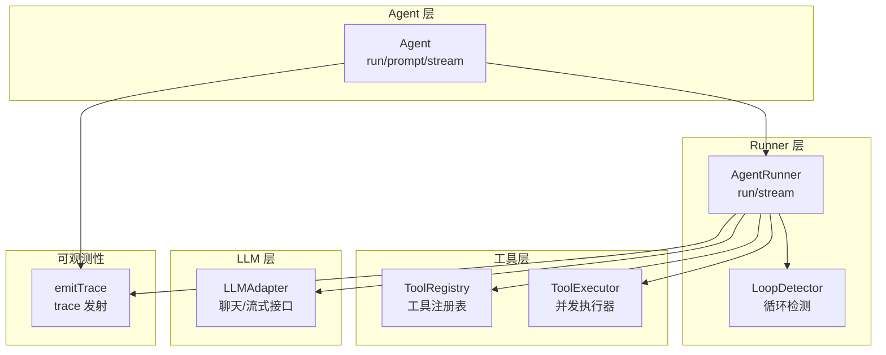
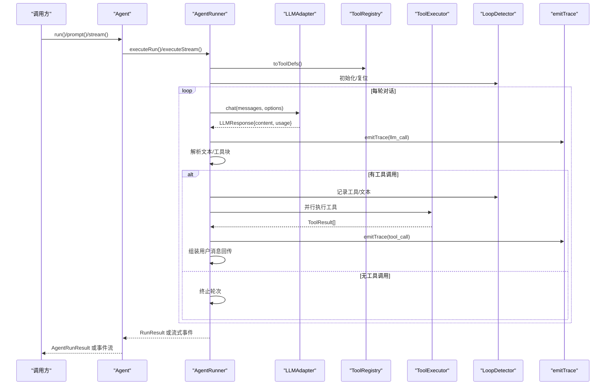
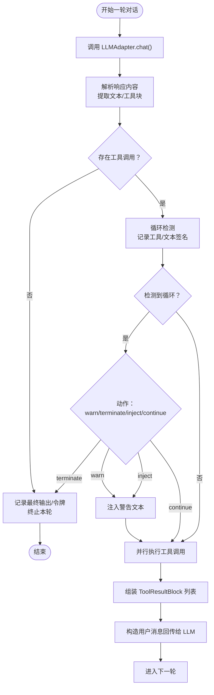
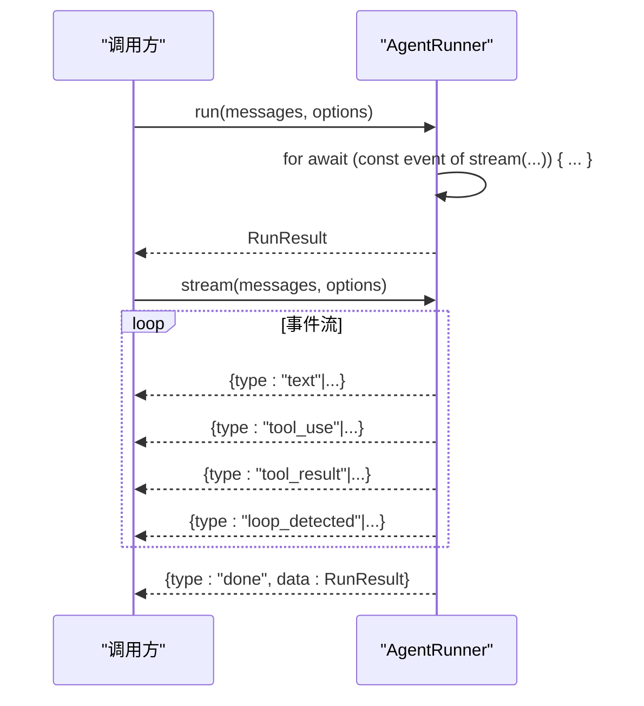
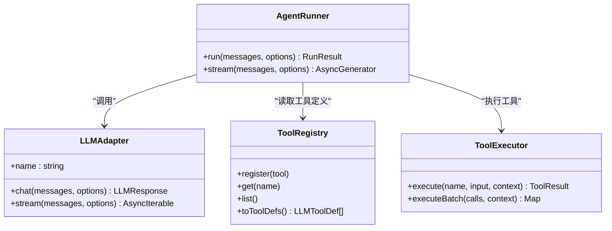
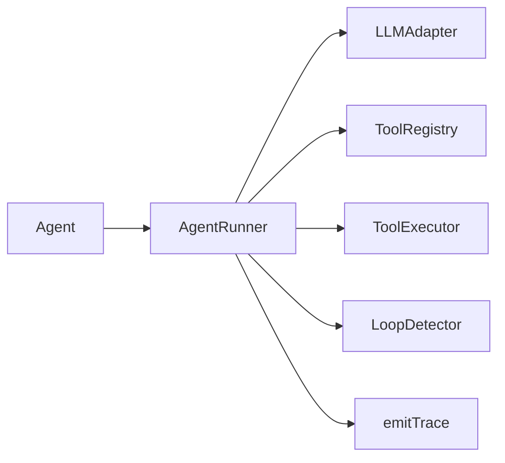

# AgentRunner 核心逻辑

<cite>
**本文引用的文件列表**
- [src/agent/runner.ts](file://src/agent/runner.ts)
- [src/types.ts](file://src/types.ts)
- [src/agent/agent.ts](file://src/agent/agent.ts)
- [src/tool/executor.ts](file://src/tool/executor.ts)
- [src/tool/framework.ts](file://src/tool/framework.ts)
- [src/llm/adapter.ts](file://src/llm/adapter.ts)
- [src/agent/loop-detector.ts](file://src/agent/loop-detector.ts)
- [src/utils/trace.ts](file://src/utils/trace.ts)
- [examples/01-single-agent.ts](file://examples/01-single-agent.ts)
- [tests/agent-hooks.test.ts](file://tests/agent-hooks.test.ts)
</cite>

## 目录
1. [简介](#简介)
2. [项目结构](#项目结构)
3. [核心组件](#核心组件)
4. [架构总览](#架构总览)
5. [详细组件分析](#详细组件分析)
6. [依赖关系分析](#依赖关系分析)
7. [性能考量](#性能考量)
8. [故障排查指南](#故障排查指南)
9. [结论](#结论)
10. [附录](#附录)

## 简介
本文件面向 AgentRunner 核心执行引擎，系统性阐述其设计架构与执行流程，覆盖消息处理、工具调用、结果合成的完整循环机制；对比 run() 与 stream() 的实现差异（同步执行 vs 流式响应）；解释运行时选项（RunOptions）的配置与传递机制；说明令牌使用统计、超时控制、中断信号处理等运行时特性；解析与 LLM 适配器的交互模式与消息格式转换；并提供性能优化建议与错误处理策略。文档同时给出代码级图示与路径引用，便于读者快速定位实现细节。

## 项目结构
AgentRunner 所在模块位于 src/agent/runner.ts，围绕其周边的关键类型与协作组件包括：
- 类型定义：src/types.ts 提供内容块、消息、响应、流事件、工具定义、LLM 适配器接口等核心类型
- 工具框架：src/tool/framework.ts 定义工具注册表与 JSON Schema 转换
- 工具执行器：src/tool/executor.ts 提供并发控制与批量执行
- LLM 适配器工厂：src/llm/adapter.ts 提供多提供商适配器实例化
- 循环检测：src/agent/loop-detector.ts 实现滑动窗口重复检测
- 可观测性：src/utils/trace.ts 提供安全的 trace 事件发射
- 高层封装：src/agent/agent.ts 将 AgentRunner 包装为可持久会话、可流式输出的高层 API

图表来源
- [src/agent/runner.ts:166-543](file://src/agent/runner.ts#L166-L543)
- [src/agent/agent.ts:81-623](file://src/agent/agent.ts#L81-L623)
- [src/tool/framework.ts:93-203](file://src/tool/framework.ts#L93-L203)
- [src/tool/executor.ts:47-179](file://src/tool/executor.ts#L47-L179)
- [src/llm/adapter.ts:63-99](file://src/llm/adapter.ts#L63-L99)
- [src/agent/loop-detector.ts:33-138](file://src/agent/loop-detector.ts#L33-L138)
- [src/utils/trace.ts:12-35](file://src/utils/trace.ts#L12-L35)

章节来源
- [src/agent/runner.ts:1-543](file://src/agent/runner.ts#L1-L543)
- [src/types.ts:1-543](file://src/types.ts#L1-L543)
- [src/agent/agent.ts:1-623](file://src/agent/agent.ts#L1-L623)

## 核心组件
- AgentRunner：执行单轮对话循环，负责 LLM 调用、内容块解析、工具调用并行执行、结果回传、令牌统计与循环检测
- Agent：高层封装，管理持久会话历史、状态机、钩子、超时与 trace
- ToolRegistry：工具注册表，提供 toToolDefs() 将 Zod 输入模式转换为 LLM 期望的 JSON Schema
- ToolExecutor：并发执行器，批量执行工具，统一错误捕获为 ToolResult
- LLMAdapter：抽象适配器接口，统一聊天与流式接口
- LoopDetector：滑动窗口重复检测，支持工具调用签名与文本输出重复检测
- Trace：安全的 trace 事件发射，避免回调异常影响主流程

章节来源
- [src/agent/runner.ts:166-543](file://src/agent/runner.ts#L166-L543)
- [src/agent/agent.ts:81-623](file://src/agent/agent.ts#L81-L623)
- [src/tool/framework.ts:93-203](file://src/tool/framework.ts#L93-L203)
- [src/tool/executor.ts:47-179](file://src/tool/executor.ts#L47-L179)
- [src/llm/adapter.ts:63-99](file://src/llm/adapter.ts#L63-L99)
- [src/agent/loop-detector.ts:33-138](file://src/agent/loop-detector.ts#L33-L138)
- [src/utils/trace.ts:12-35](file://src/utils/trace.ts#L12-L35)

## 架构总览
AgentRunner 的核心循环遵循“LLM 请求 → 内容块解析 → 工具调用并行 → 结果回传 → 继续下一轮”的模式，直至满足终止条件（无工具调用、达到最大轮次、触发循环检测或被中止）。该循环在 run() 中以累积所有事件的方式完成，在 stream() 中以异步生成器逐步产出事件。

图表来源
- [src/agent/runner.ts:191-522](file://src/agent/runner.ts#L191-L522)
- [src/agent/agent.ts:287-526](file://src/agent/agent.ts#L287-L526)
- [src/tool/executor.ts:70-90](file://src/tool/executor.ts#L70-L90)
- [src/agent/loop-detector.ts:50-92](file://src/agent/loop-detector.ts#L50-L92)
- [src/utils/trace.ts:12-27](file://src/utils/trace.ts#L12-L27)

## 详细组件分析

### AgentRunner 设计与执行流程
- 角色与职责
  - 统一驱动一次或多轮对话循环，聚合令牌用量与轮次统计
  - 从 LLM 响应中提取文本与工具调用块，按需注入循环检测警告
  - 并行执行工具调用，将结果以 ContentBlock 形式回传给 LLM
- 关键数据结构
  - LLMMessage：包含角色与内容块数组
  - ContentBlock：TextBlock、ToolUseBlock、ToolResultBlock、ImageBlock 的联合
  - ToolCallRecord：记录工具名、输入、输出与耗时
  - TokenUsage：输入/输出令牌计数
- 运行时选项（RunOptions）
  - 回调：onToolCall、onToolResult、onMessage、onWarning、onTrace
  - 上下文：runId、taskId、traceAgent
  - 中断：abortSignal（优先于 RunnerOptions.abortSignal）
- 循环检测（LoopDetection）
  - 支持工具签名重复与文本重复两种模式
  - 支持 warn/terminate/inject/continue 等动作策略
  - 通过 LoopDetector 维护滑动窗口，统计连续重复次数

图表来源
- [src/agent/runner.ts:268-494](file://src/agent/runner.ts#L268-L494)
- [src/agent/loop-detector.ts:50-92](file://src/agent/loop-detector.ts#L50-L92)

章节来源
- [src/agent/runner.ts:166-543](file://src/agent/runner.ts#L166-L543)
- [src/agent/loop-detector.ts:33-138](file://src/agent/loop-detector.ts#L33-L138)

### run() 与 stream() 的实现差异
- run()
  - 通过 for-await-of 遍历 stream() 产生的事件，累积 RunResult 后一次性返回
  - 适合需要完整结果后再处理的场景
- stream()
  - 作为 AsyncGenerator 直接产出事件流：text、tool_use、tool_result、loop_detected、done、error
  - 适合实时渲染文本增量、工具调用进度与错误处理
- 两者共享同一内部循环逻辑，关键差异在于结果收集与事件产出时机

图表来源
- [src/agent/runner.ts:191-226](file://src/agent/runner.ts#L191-L226)
- [src/agent/runner.ts:223-522](file://src/agent/runner.ts#L223-L522)

章节来源
- [src/agent/runner.ts:191-226](file://src/agent/runner.ts#L191-L226)
- [src/agent/runner.ts:223-522](file://src/agent/runner.ts#L223-L522)

### 运行时选项（RunOptions）配置与传递
- RunnerOptions（静态）
  - model、systemPrompt、maxTurns、maxTokens、temperature、abortSignal、allowedTools、agentName、agentRole、loopDetection
- RunOptions（每调用一次）
  - onToolCall、onToolResult、onMessage、onWarning、onTrace、runId、taskId、traceAgent、abortSignal
- 传递机制
  - RunnerOptions 作为 AgentRunner 构造参数，贯穿所有 run/stream 调用
  - RunOptions 仅作用于当前调用，且 per-call abortSignal 优先于静态 abortSignal
  - Agent 层在 executeRun/executeStream 中合并 timeout 信号与 caller 传入的 abortSignal

章节来源
- [src/agent/runner.ts:45-104](file://src/agent/runner.ts#L45-L104)
- [src/agent/agent.ts:311-326](file://src/agent/agent.ts#L311-L326)
- [src/agent/agent.ts:496-500](file://src/agent/agent.ts#L496-L500)

### 令牌使用统计、超时控制与中断信号
- 令牌统计
  - 每轮 LLMResponse.usage 累加至 totalUsage，最终汇总在 RunResult.tokenUsage
- 超时控制
  - Agent 层根据 AgentConfig.timeoutMs 生成 AbortSignal.timeout，并与 caller 的 abortSignal 合并
  - Runner 层在每次 LLM 调用前检查 effectiveAbortSignal.aborted
- 中断信号
  - 支持 per-call 与 per-runner 两级中断；per-call 优先
  - 工具执行器在执行前后检查 context.abortSignal

章节来源
- [src/agent/runner.ts:284-302](file://src/agent/runner.ts#L284-L302)
- [src/agent/runner.ts:244-245](file://src/agent/runner.ts#L244-L245)
- [src/agent/agent.ts:311-320](file://src/agent/agent.ts#L311-L320)
- [src/tool/executor.ts:82-87](file://src/tool/executor.ts#L82-L87)

### 与 LLM 适配器的交互与消息格式转换
- 适配器接口
  - chat(messages, options) 返回完整响应（含 content、usage）
  - stream(messages, options) 产出事件流
- 消息格式
  - LLMMessage：role 为 user/assistant，content 为 ContentBlock[]
  - ContentBlock：text、tool_use、tool_result、image
- 工具定义转换
  - ToolRegistry.toToolDefs() 将每个工具的 Zod 输入模式转换为 LLMToolDef（JSON Schema）
  - 仅将 allowedTools 白名单中的工具发送给 LLM

图表来源
- [src/llm/adapter.ts:511-542](file://src/llm/adapter.ts#L511-L542)
- [src/tool/framework.ts:162-171](file://src/tool/framework.ts#L162-L171)
- [src/tool/executor.ts:70-90](file://src/tool/executor.ts#L70-L90)
- [src/agent/runner.ts:166-176](file://src/agent/runner.ts#L166-L176)

章节来源
- [src/llm/adapter.ts:63-99](file://src/llm/adapter.ts#L63-L99)
- [src/tool/framework.ts:162-171](file://src/tool/framework.ts#L162-L171)
- [src/agent/runner.ts:239-242](file://src/agent/runner.ts#L239-L242)

### 工具调用与并行执行
- 工具输入验证
  - ToolExecutor 在执行前使用 Zod.safeParse 对原始输入进行校验
  - 校验失败返回 ToolResult(isError=true)，不抛出异常
- 并发控制
  - 使用轻量信号量限制最大并发，默认 4
  - executeBatch 保证每个 call 必然产生一个结果条目
- 错误隔离
  - 执行异常被捕获并包装为 ToolResult，确保循环继续

章节来源
- [src/tool/executor.ts:105-121](file://src/tool/executor.ts#L105-L121)
- [src/tool/executor.ts:132-169](file://src/tool/executor.ts#L132-L169)

### 循环检测与警告注入
- 检测维度
  - 工具签名：按名称排序后序列化，比较连续重复次数
  - 文本输出：标准化为空白折叠后的纯文本，比较连续重复次数
- 动作策略
  - warn：首次检测注入警告文本，允许一次恢复机会
  - terminate：直接终止
  - inject：注入警告文本并继续
  - continue：忽略，继续循环
- 注入位置
  - 在工具结果消息中追加警告文本，避免违反交替角色约束

章节来源
- [src/agent/loop-detector.ts:50-92](file://src/agent/loop-detector.ts#L50-L92)
- [src/agent/runner.ts:329-366](file://src/agent/runner.ts#L329-L366)
- [src/agent/runner.ts:474-483](file://src/agent/runner.ts#L474-L483)

### 示例与用法参考
- 单代理示例：展示 run 与 stream 的基本用法
- 钩子测试：验证 beforeRun/afterRun 在 run/stream/prompt 中的行为

章节来源
- [examples/01-single-agent.ts:73-103](file://examples/01-single-agent.ts#L73-L103)
- [tests/agent-hooks.test.ts:85-140](file://tests/agent-hooks.test.ts#L85-L140)
- [tests/agent-hooks.test.ts:239-291](file://tests/agent-hooks.test.ts#L239-L291)

## 依赖关系分析
- AgentRunner 依赖
  - LLMAdapter：统一聊天与流式接口
  - ToolRegistry：工具定义与 JSON Schema 转换
  - ToolExecutor：工具执行与并发控制
  - LoopDetector：循环检测
  - emitTrace：trace 事件安全发射
- Agent 与 Runner 的协作
  - Agent 负责生命周期、钩子、超时与 trace，Runner 负责对话循环与工具执行
  - Agent 在 executeRun/executeStream 中构建 RunOptions 并传递给 Runner

图表来源
- [src/agent/agent.ts:287-372](file://src/agent/agent.ts#L287-L372)
- [src/agent/runner.ts:166-176](file://src/agent/runner.ts#L166-L176)

章节来源
- [src/agent/agent.ts:287-372](file://src/agent/agent.ts#L287-L372)
- [src/agent/runner.ts:166-176](file://src/agent/runner.ts#L166-L176)

## 性能考量
- 并行工具执行
  - 默认并发上限 4，可通过 ToolExecutorOptions.maxConcurrency 调整
  - 对于大量独立工具调用，适当提高并发可缩短总耗时
- 令牌统计与轮次限制
  - 合理设置 maxTurns 与 maxTokens，避免长轮次与大输出导致成本上升
- 循环检测
  - 启用 loopDetection 可提前终止无效循环，节省资源
- trace 开销
  - onTrace 为异步回调时，emitTrace 已吞掉回调异常，但仍建议在生产环境谨慎开启高频 trace

章节来源
- [src/tool/executor.ts:21-27](file://src/tool/executor.ts#L21-L27)
- [src/agent/runner.ts:54-56](file://src/agent/runner.ts#L54-L56)
- [src/agent/runner.ts:71-72](file://src/agent/runner.ts#L71-L72)
- [src/utils/trace.ts:12-27](file://src/utils/trace.ts#L12-L27)

## 故障排查指南
- 工具未被模型调用
  - 首轮无工具调用时，Runner 会发出 onWarning 提示模型是否支持工具调用
- 工具执行错误
  - ToolExecutor 将异常包装为 ToolResult(isError=true)，循环继续
  - 建议在 onToolResult 中观察错误详情
- 循环检测
  - 当检测到重复工具调用或文本输出，Runner 会发出 loop_detected 事件
  - 根据 onLoopDetected 策略决定 warn/terminate/inject/continue
- 中断与超时
  - 若 run/stream 提前退出，检查 abortSignal 是否被触发
  - AgentConfig.timeoutMs 设置过短可能导致本地模型超时
- trace 异常
  - emitTrace 已吞掉回调异常，若未收到 trace，请确认 onTrace 回调本身是否抛错

章节来源
- [src/agent/runner.ts:373-384](file://src/agent/runner.ts#L373-L384)
- [src/agent/runner.ts:340-366](file://src/agent/runner.ts#L340-L366)
- [src/tool/executor.ts:160-168](file://src/tool/executor.ts#L160-L168)
- [src/agent/agent.ts:311-320](file://src/agent/agent.ts#L311-L320)
- [src/utils/trace.ts:12-27](file://src/utils/trace.ts#L12-L27)

## 结论
AgentRunner 以清晰的循环模型与强一致的消息格式抽象，实现了“LLM 推理 + 工具调用 + 结果回传”的闭环。通过 RunOptions 的灵活配置、LoopDetector 的循环防护、ToolExecutor 的并发控制与错误隔离，以及 Agent 的生命周期与钩子扩展，整体具备良好的可扩展性与稳定性。结合合理的令牌与轮次限制、超时与中断策略，可在不同 LLM 与工具组合下获得稳定高效的执行体验。

## 附录
- 典型使用路径
  - 单次任务：Agent.run() 或 Agent.stream()
  - 多轮对话：Agent.prompt() 保持历史
  - 自定义工具：ToolRegistry.register() 后由 Runner 自动下发
- 相关类型与接口
  - LLMMessage、ContentBlock、LLMResponse、StreamEvent、ToolDefinition、ToolResult、LLMAdapter、LoopDetectionConfig、TraceEvent

章节来源
- [src/agent/agent.ts:177-224](file://src/agent/agent.ts#L177-L224)
- [src/tool/framework.ts:93-203](file://src/tool/framework.ts#L93-L203)
- [src/types.ts:63-81](file://src/types.ts#L63-L81)
- [src/types.ts:96-99](file://src/types.ts#L96-L99)
- [src/types.ts:174-179](file://src/types.ts#L174-L179)
- [src/types.ts:526-542](file://src/types.ts#L526-L542)
- [src/types.ts:247-276](file://src/types.ts#L247-L276)
- [src/types.ts:417-470](file://src/types.ts#L417-L470)