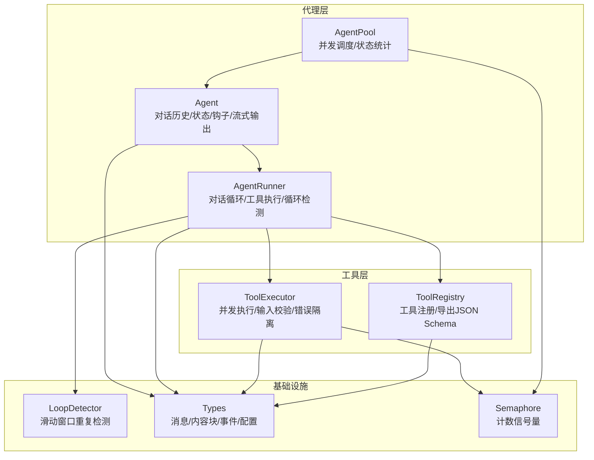
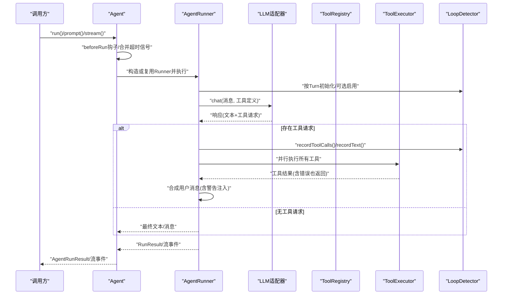
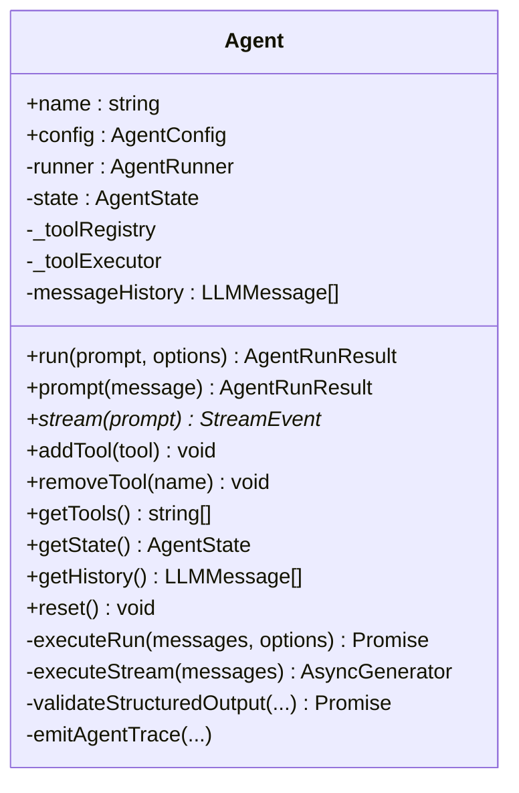
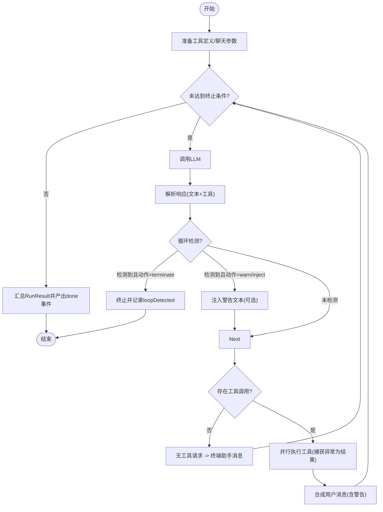
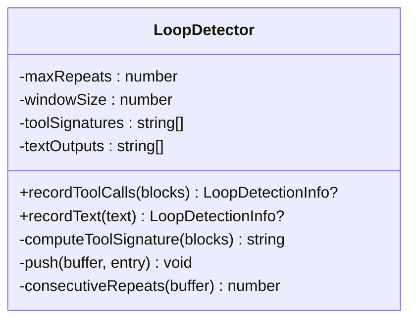
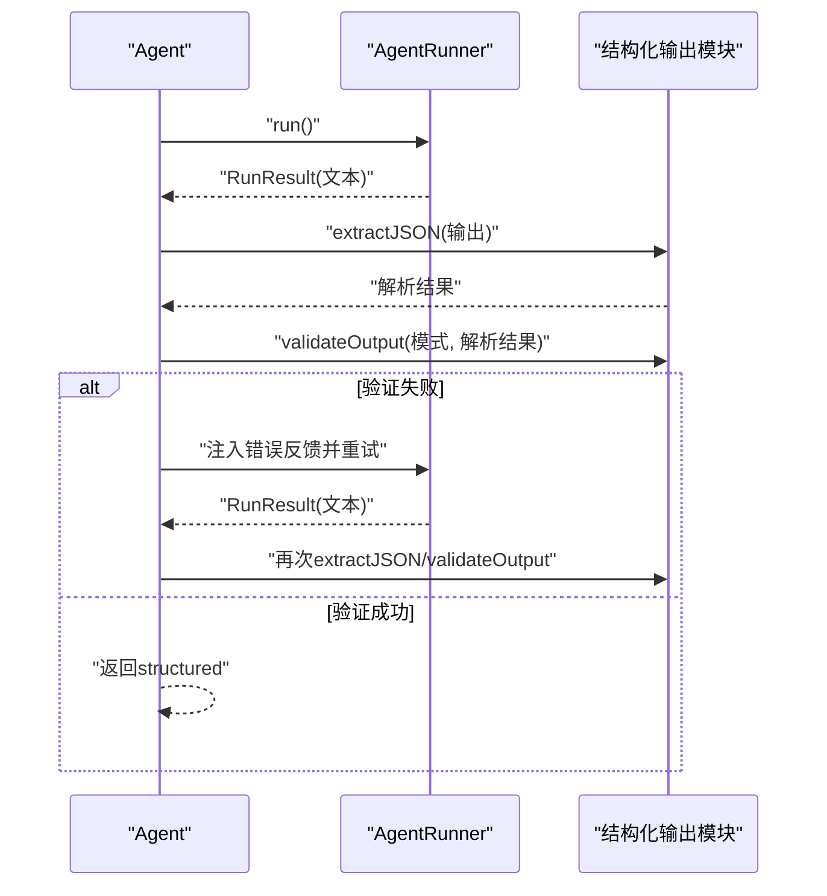
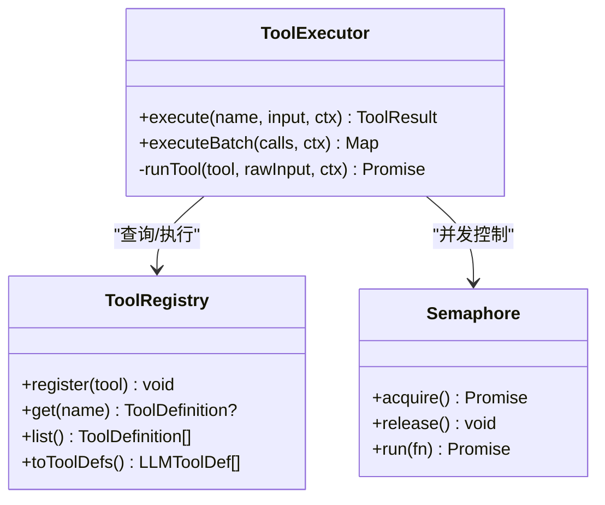
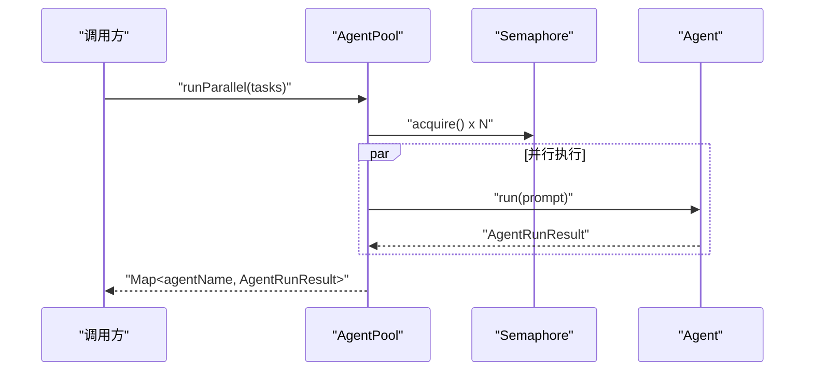
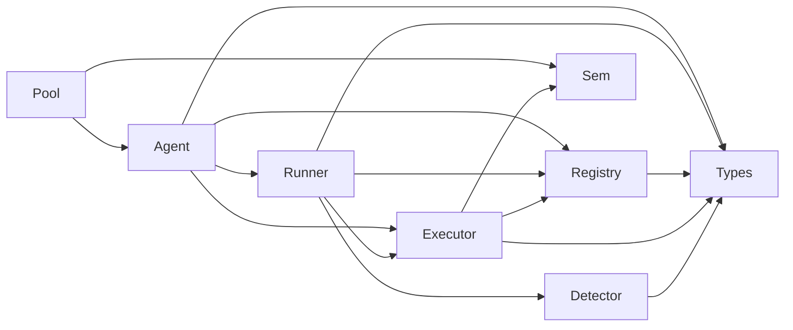

# 代理系统

<cite>
**本文引用的文件**
- [agent.ts](file://src/agent/agent.ts)
- [runner.ts](file://src/agent/runner.ts)
- [loop-detector.ts](file://src/agent/loop-detector.ts)
- [structured-output.ts](file://src/agent/structured-output.ts)
- [pool.ts](file://src/agent/pool.ts)
- [types.ts](file://src/types.ts)
- [executor.ts](file://src/tool/executor.ts)
- [framework.ts](file://src/tool/framework.ts)
- [semaphore.ts](file://src/utils/semaphore.ts)
- [09-structured-output.ts](file://examples/09-structured-output.ts)
- [10-task-retry.ts](file://examples/10-task-retry.ts)
- [agent-pool.test.ts](file://tests/agent-pool.test.ts)
- [structured-output.test.ts](file://tests/structured-output.test.ts)
- [loop-detection.test.ts](file://tests/loop-detection.test.ts)
</cite>

## 目录
1. [简介](#简介)
2. [项目结构](#项目结构)
3. [核心组件](#核心组件)
4. [架构总览](#架构总览)
5. [详细组件分析](#详细组件分析)
6. [依赖关系分析](#依赖关系分析)
7. [性能考量](#性能考量)
8. [故障排查指南](#故障排查指南)
9. [结论](#结论)
10. [附录](#附录)

## 简介
本文件面向 Open Multi-Agent 框架中的代理系统，系统性阐述 Agent 类与 AgentRunner 的设计与实现，包括对话循环机制、工具执行循环、循环检测算法的工作原理；详解 AgentRunner 的核心执行逻辑（消息处理、工具调用、结果合成）；深入解析结构化输出功能的使用与验证流程；并提供循环检测机制的配置选项、最佳实践与性能优化建议。

## 项目结构
代理系统位于 src/agent 目录，围绕 Agent 与 AgentRunner 构建，配合工具框架、执行器、并发控制与类型定义形成完整的执行闭环。示例与测试覆盖了结构化输出与任务重试等典型场景。

**图表来源**
- [agent.ts:81-623](file://src/agent/agent.ts#L81-L623)
- [runner.ts:166-543](file://src/agent/runner.ts#L166-L543)
- [loop-detector.ts:33-138](file://src/agent/loop-detector.ts#L33-L138)
- [pool.ts:58-286](file://src/agent/pool.ts#L58-L286)
- [framework.ts:93-203](file://src/tool/framework.ts#L93-L203)
- [executor.ts:47-179](file://src/tool/executor.ts#L47-L179)
- [semaphore.ts:24-90](file://src/utils/semaphore.ts#L24-L90)
- [types.ts:14-120](file://src/types.ts#L14-L120)

**章节来源**
- [agent.ts:1-623](file://src/agent/agent.ts#L1-L623)
- [runner.ts:1-543](file://src/agent/runner.ts#L1-L543)
- [loop-detector.ts:1-138](file://src/agent/loop-detector.ts#L1-L138)
- [pool.ts:1-286](file://src/agent/pool.ts#L1-L286)
- [framework.ts:1-558](file://src/tool/framework.ts#L1-L558)
- [executor.ts:1-179](file://src/tool/executor.ts#L1-L179)
- [semaphore.ts:1-90](file://src/utils/semaphore.ts#L1-L90)
- [types.ts:1-543](file://src/types.ts#L1-L543)

## 核心组件
- Agent：高层封装，负责会话历史管理、状态跟踪、动态工具注册、钩子回调、结构化输出验证与流式输出。
- AgentRunner：对话循环引擎，负责 LLM 调用、工具提取与执行、消息合成、循环检测与终止、可观测性事件。
- LoopDetector：滑动窗口重复检测器，支持“工具调用签名重复”和“文本重复”两类检测。
- ToolRegistry/ToolExecutor：工具注册与并发执行，输入 Zod 校验、错误隔离、并发上限控制。
- AgentPool：多代理并发池，基于信号量控制全局并发，提供并行与轮询派发。
- 类型系统：统一的消息、内容块、事件、工具定义、循环检测配置与运行结果。

**章节来源**
- [agent.ts:81-623](file://src/agent/agent.ts#L81-L623)
- [runner.ts:166-543](file://src/agent/runner.ts#L166-L543)
- [loop-detector.ts:33-138](file://src/agent/loop-detector.ts#L33-L138)
- [framework.ts:93-203](file://src/tool/framework.ts#L93-L203)
- [executor.ts:47-179](file://src/tool/executor.ts#L47-L179)
- [pool.ts:58-286](file://src/agent/pool.ts#L58-L286)
- [types.ts:14-120](file://src/types.ts#L14-L120)

## 架构总览
下图展示从 Agent 到 AgentRunner、工具链与循环检测的整体交互：

**图表来源**
- [agent.ts:287-372](file://src/agent/agent.ts#L287-L372)
- [runner.ts:191-522](file://src/agent/runner.ts#L191-L522)
- [loop-detector.ts:50-92](file://src/agent/loop-detector.ts#L50-L92)
- [executor.ts:70-90](file://src/tool/executor.ts#L70-L90)

## 详细组件分析

### Agent 类设计与生命周期
- 对话模式
  - run：一次性对话，不修改持久历史。
  - prompt：多轮对话，追加到持久历史并更新。
  - stream：一次性对话流式输出。
- 钩子与上下文
  - beforeRun：在每次 run/prompt 前注入上下文，允许修改提示词但保留非文本内容。
  - afterRun：在成功完成后对结果进行二次加工。
- 结构化输出
  - 若配置 outputSchema，则在首次失败时自动重试一次并注入错误反馈。
  - 返回值包含原始 output 与结构化 parsed 数据（structured）。
- 动态工具管理
  - 运行时注册/注销工具，无需重启。
- 状态与追踪
  - 内部维护状态机（idle/running/completed/error），聚合 tokenUsage 并发出 agent trace 事件。

**图表来源**
- [agent.ts:81-623](file://src/agent/agent.ts#L81-L623)

**章节来源**
- [agent.ts:169-225](file://src/agent/agent.ts#L169-L225)
- [agent.ts:287-372](file://src/agent/agent.ts#L287-L372)
- [agent.ts:396-477](file://src/agent/agent.ts#L396-L477)
- [agent.ts:483-526](file://src/agent/agent.ts#L483-L526)
- [agent.ts:532-570](file://src/agent/agent.ts#L532-L570)
- [agent.ts:588-602](file://src/agent/agent.ts#L588-L602)

### AgentRunner 核心执行逻辑
- 外层循环
  - 每次迭代发送消息给 LLM，累积 tokenUsage 与 turns。
  - 提取文本增量与工具调用块，先做循环检测再决定是否继续。
- 工具执行
  - 并行执行所有工具调用，捕获异常为工具结果，保证循环继续。
  - 将工具结果与可选警告文本合成用户消息，回传给 LLM。
- 终止条件
  - 无工具请求则结束（终端助手消息）。
  - 达到 maxTurns 或 abort 触发。
  - 循环检测触发终止或警告。
- 流式事件
  - text/tool_use/tool_result/loop_detected/done/error。

**图表来源**
- [runner.ts:268-494](file://src/agent/runner.ts#L268-L494)

**章节来源**
- [runner.ts:191-211](file://src/agent/runner.ts#L191-L211)
- [runner.ts:223-226](file://src/agent/runner.ts#L223-L226)
- [runner.ts:268-494](file://src/agent/runner.ts#L268-L494)
- [runner.ts:511-522](file://src/agent/runner.ts#L511-L522)

### 循环检测机制
- 检测维度
  - 工具调用签名：名称+排序后的输入键值对，忽略顺序差异。
  - 文本输出：标准化空白后比较，忽略空白差异。
- 窗口与阈值
  - 窗口大小至少等于最大重复次数，否则无法触发。
  - 默认阈值为 3 次连续重复。
- 行为策略
  - warn：注入“你似乎卡住”的提示，给一次机会；若再次重复则终止。
  - terminate：立即终止。
  - 自定义函数：根据诊断信息返回 continue/inject/terminate。
- 注入警告
  - 在工具结果中插入警告文本，避免出现两个连续用户消息导致角色交替约束问题。

**图表来源**
- [loop-detector.ts:33-138](file://src/agent/loop-detector.ts#L33-L138)

**章节来源**
- [loop-detector.ts:40-45](file://src/agent/loop-detector.ts#L40-L45)
- [loop-detector.ts:50-70](file://src/agent/loop-detector.ts#L50-L70)
- [loop-detector.ts:75-92](file://src/agent/loop-detector.ts#L75-L92)
- [runner.ts:331-366](file://src/agent/runner.ts#L331-L366)

### 结构化输出功能
- 系统提示注入
  - 将 Zod Schema 转换为 JSON Schema 并注入系统提示，要求模型仅输出符合该 Schema 的 JSON。
- JSON 提取
  - 支持直接 JSON、带 fenced 块（优先 json）、裸 fenced、嵌入对象/数组等场景。
- 验证与重试
  - 首次失败自动重试一次，并将错误反馈注入对话上下文。
  - 成功时返回 structured 字段，失败时返回原始 output 与 success=false。
- 使用示例
  - 示例展示了如何定义 Zod 模式并通过 AgentConfig.outputSchema 启用。

**图表来源**
- [agent.ts:400-477](file://src/agent/agent.ts#L400-L477)
- [structured-output.ts:21-34](file://src/agent/structured-output.ts#L21-L34)
- [structured-output.ts:50-105](file://src/agent/structured-output.ts#L50-L105)
- [structured-output.ts:117-126](file://src/agent/structured-output.ts#L117-L126)

**章节来源**
- [agent.ts:134-141](file://src/agent/agent.ts#L134-L141)
- [agent.ts:332-346](file://src/agent/agent.ts#L332-L346)
- [agent.ts:400-477](file://src/agent/agent.ts#L400-L477)
- [structured-output.ts:21-34](file://src/agent/structured-output.ts#L21-L34)
- [structured-output.ts:50-105](file://src/agent/structured-output.ts#L50-L105)
- [structured-output.ts:117-126](file://src/agent/structured-output.ts#L117-L126)
- [09-structured-output.ts:25-43](file://examples/09-structured-output.ts#L25-L43)

### 工具执行与并发控制
- 工具注册与导出
  - ToolRegistry 提供注册、查询、导出 LLM 工具定义（JSON Schema）。
- 执行器
  - ToolExecutor 并发执行工具，输入经 Zod 校验，异常转为工具结果，避免中断循环。
  - 支持批量执行，返回映射以保持调用方关联。
- 并发限制
  - 基于 Semaphore 控制最大并发，避免资源争用。

**图表来源**
- [framework.ts:93-203](file://src/tool/framework.ts#L93-L203)
- [executor.ts:47-179](file://src/tool/executor.ts#L47-L179)
- [semaphore.ts:24-90](file://src/utils/semaphore.ts#L24-L90)

**章节来源**
- [framework.ts:162-171](file://src/tool/framework.ts#L162-L171)
- [executor.ts:70-90](file://src/tool/executor.ts#L70-L90)
- [executor.ts:105-121](file://src/tool/executor.ts#L105-L121)
- [executor.ts:132-169](file://src/tool/executor.ts#L132-L169)
- [semaphore.ts:24-90](file://src/utils/semaphore.ts#L24-L90)

### AgentPool 并发调度
- 注册与查询
  - add/remove/get/list 管理代理集合。
- 执行策略
  - run：按名称调度，受并发限制。
  - runParallel：并行执行多个任务，聚合结果。
  - runAny：轮询选择空闲代理。
- 状态观测
  - getStatus 统计各状态数量。
- 关闭
  - shutdown 重置所有代理历史与状态。

**图表来源**
- [pool.ts:153-180](file://src/agent/pool.ts#L153-L180)
- [pool.ts:192-209](file://src/agent/pool.ts#L192-L209)
- [semaphore.ts:41-78](file://src/utils/semaphore.ts#L41-L78)

**章节来源**
- [pool.ts:58-286](file://src/agent/pool.ts#L58-L286)
- [agent-pool.test.ts:95-145](file://tests/agent-pool.test.ts#L95-L145)

## 依赖关系分析
- 组件耦合
  - Agent 依赖 AgentRunner、ToolRegistry、ToolExecutor、LoopDetector（通过 Runner）。
  - AgentRunner 依赖 LLMAdapter、ToolRegistry、ToolExecutor、LoopDetector。
  - ToolExecutor 依赖 ToolRegistry、Semaphore。
  - AgentPool 依赖 Semaphore、Agent。
- 可能的循环依赖
  - 通过接口与类型导入避免运行时循环，模块间通过抽象边界解耦。
- 外部依赖
  - Zod 用于结构化输出的模式定义与转换。
  - Node AbortSignal 用于取消与超时控制。

**图表来源**
- [agent.ts:36-45](file://src/agent/agent.ts#L36-L45)
- [runner.ts:32-35](file://src/agent/runner.ts#L32-L35)
- [framework.ts:93-203](file://src/tool/framework.ts#L93-L203)
- [executor.ts:12-15](file://src/tool/executor.ts#L12-L15)
- [pool.ts:24-28](file://src/agent/pool.ts#L24-L28)
- [types.ts:14-120](file://src/types.ts#L14-L120)

**章节来源**
- [types.ts:14-120](file://src/types.ts#L14-L120)
- [framework.ts:93-203](file://src/tool/framework.ts#L93-L203)
- [executor.ts:12-15](file://src/tool/executor.ts#L12-L15)
- [runner.ts:32-35](file://src/agent/runner.ts#L32-L35)
- [agent.ts:36-45](file://src/agent/agent.ts#L36-L45)

## 性能考量
- 并发控制
  - 工具执行与代理池均采用信号量限制并发，避免资源耗尽。
  - 建议根据硬件与模型能力调整 ToolExecutor 的并发度与 AgentPool 的最大并发。
- 循环检测窗口
  - 合理设置 maxRepetitions 与 loopDetectionWindow，避免过小导致误报或过大导致延迟发现。
- 超时与取消
  - 使用 AbortSignal.timeout 与自定义信号组合，确保长尾请求可被及时终止。
- 输出解析
  - 结构化输出在失败时自动重试一次，注意评估额外 token 成本与延迟。
- 日志与追踪
  - 利用 onTrace/onWarning/onMessage 回调进行可观测性，定位瓶颈与异常。

[本节为通用指导，无需特定文件引用]

## 故障排查指南
- 代理未使用工具
  - Runner 在首轮无工具调用时发出警告，检查工具注册与模型工具调用能力。
- 循环检测触发
  - 检查 onLoopDetected 策略：warn/inject/terminate 是否符合预期；必要时放宽阈值或窗口。
- 结构化输出失败
  - 首次失败会自动重试一次；若仍失败，确认 Zod 模式与模型指令是否一致。
- 并发阻塞
  - 检查 AgentPool 与 ToolExecutor 的并发上限，观察队列长度与活跃数。
- 示例参考
  - 结构化输出与任务重试示例展示了常见配置与行为。

**章节来源**
- [runner.ts:372-380](file://src/agent/runner.ts#L372-L380)
- [runner.ts:340-366](file://src/agent/runner.ts#L340-L366)
- [agent.ts:400-477](file://src/agent/agent.ts#L400-L477)
- [09-structured-output.ts:10-15](file://examples/09-structured-output.ts#L10-L15)
- [10-task-retry.ts:12-17](file://examples/10-task-retry.ts#L12-L17)
- [loop-detection.test.ts:105-195](file://tests/loop-detection.test.ts#L105-L195)
- [structured-output.test.ts:190-331](file://tests/structured-output.test.ts#L190-L331)
- [agent-pool.test.ts:181-211](file://tests/agent-pool.test.ts#L181-L211)

## 结论
Open Multi-Agent 的代理系统通过 Agent 与 AgentRunner 的清晰分层，结合工具框架、并发控制与循环检测，提供了稳定、可观测且可扩展的智能体执行平台。结构化输出与任务重试等特性进一步增强了生产可用性。合理配置循环检测与并发参数，可有效避免无限循环与资源争用，提升整体吞吐与稳定性。

[本节为总结，无需特定文件引用]

## 附录

### 配置与最佳实践速查
- 循环检测
  - maxRepetitions：默认 3，建议根据任务复杂度调整。
  - loopDetectionWindow：默认 4，需不小于阈值。
  - onLoopDetected：warn（默认，二次检测即终止）、terminate、或自定义函数。
- 结构化输出
  - outputSchema：启用后自动注入 JSON Schema 指令，失败自动重试一次。
- 并发与超时
  - ToolExecutor.maxConcurrency：默认 4，按工具 I/O 特性调优。
  - AgentPool.maxConcurrency：默认 5，按代理负载调优。
  - Agent.timeoutMs：整次运行超时，避免本地模型长时间占用。
- 工具注册
  - 使用 ToolRegistry.register/deregister 实现动态工具管理。
- 示例参考
  - 结构化输出示例与任务重试示例展示了典型用法。

**章节来源**
- [types.ts:248-267](file://src/types.ts#L248-L267)
- [runner.ts:257-262](file://src/agent/runner.ts#L257-L262)
- [agent.ts:134-152](file://src/agent/agent.ts#L134-L152)
- [executor.ts:21-27](file://src/tool/executor.ts#L21-L27)
- [pool.ts:68-70](file://src/agent/pool.ts#L68-L70)
- [09-structured-output.ts:38-43](file://examples/09-structured-output.ts#L38-L43)
- [10-task-retry.ts:78-105](file://examples/10-task-retry.ts#L78-L105)