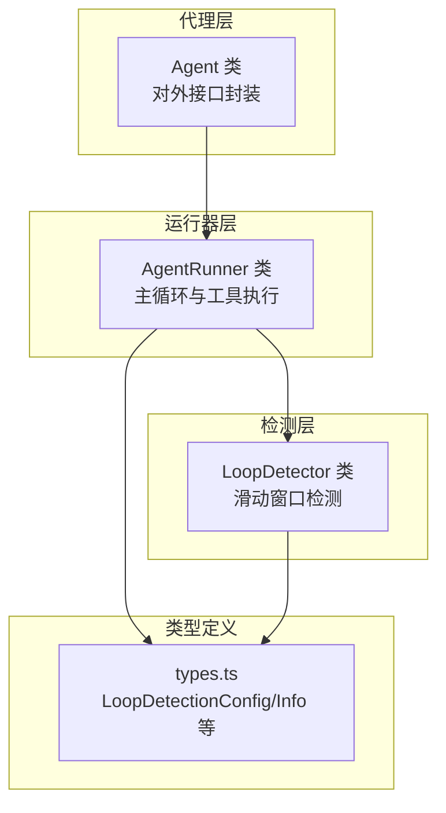
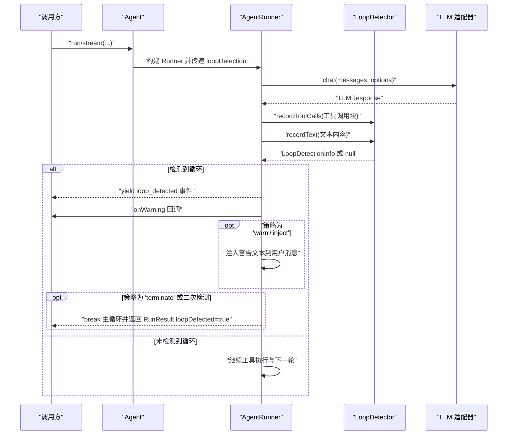
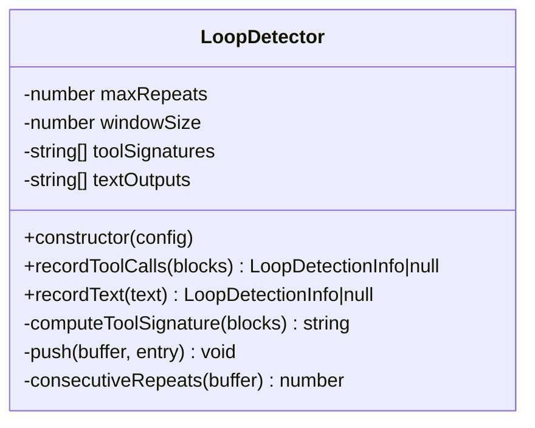
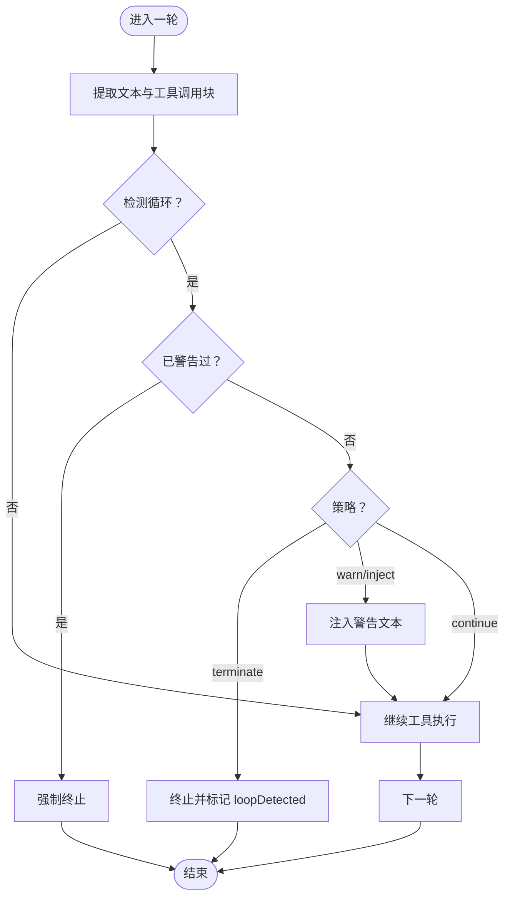
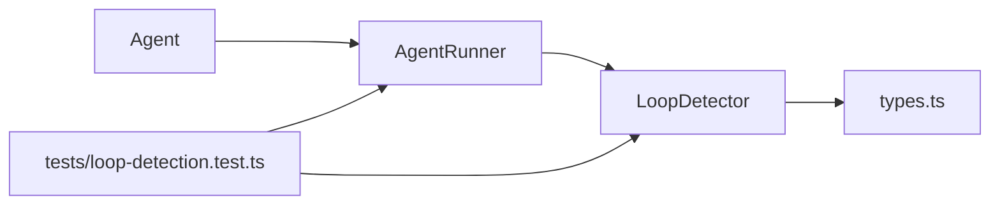

# 循环检测机制

<cite>
**本文引用的文件**
- [src/agent/loop-detector.ts](file://src/agent/loop-detector.ts)
- [src/agent/runner.ts](file://src/agent/runner.ts)
- [src/agent/agent.ts](file://src/agent/agent.ts)
- [src/types.ts](file://src/types.ts)
- [tests/loop-detection.test.ts](file://tests/loop-detection.test.ts)
</cite>

## 目录
1. [简介](#简介)
2. [项目结构](#项目结构)
3. [核心组件](#核心组件)
4. [架构总览](#架构总览)
5. [详细组件分析](#详细组件分析)
6. [依赖关系分析](#依赖关系分析)
7. [性能考量](#性能考量)
8. [故障排除指南](#故障排除指南)
9. [结论](#结论)
10. [附录](#附录)

## 简介
本技术文档聚焦于循环检测系统，详细阐述其算法实现原理与工程实践，包括：
- 消息历史比较与滑动窗口机制
- 工具调用签名与文本输出的相似度计算
- 循环模式识别与检测策略
- 配置项（阈值、范围、策略）的含义与调优
- 在代理执行中的作用与影响（防止无限循环与资源浪费）
- 检测结果的传播与后续处理（事件、警告注入、终止）
- 调试技巧与常见问题排查
- 实际案例与解决方案

## 项目结构
循环检测位于代理执行引擎中，作为可选功能由运行器在每轮对话中进行检测，并通过流式事件与结果对象向外部暴露。

图表来源
- [src/agent/agent.ts:100-163](file://src/agent/agent.ts#L100-L163)
- [src/agent/runner.ts:166-176](file://src/agent/runner.ts#L166-L176)
- [src/agent/loop-detector.ts:33-45](file://src/agent/loop-detector.ts#L33-L45)
- [src/types.ts:247-276](file://src/types.ts#L247-L276)

章节来源
- [src/agent/agent.ts:100-163](file://src/agent/agent.ts#L100-L163)
- [src/agent/runner.ts:166-176](file://src/agent/runner.ts#L166-L176)
- [src/agent/loop-detector.ts:33-45](file://src/agent/loop-detector.ts#L33-L45)
- [src/types.ts:247-276](file://src/types.ts#L247-L276)

## 核心组件
- LoopDetector：滑动窗口循环检测器，负责记录工具调用签名与文本输出，统计连续重复次数并判定是否触发循环。
- AgentRunner：主循环驱动器，在每次 LLM 响应后进行检测，根据策略决定注入警告或终止。
- Agent：高层封装，将循环检测配置透传给运行器；在结果中携带 loopDetected 标志。
- 类型系统：LoopDetectionConfig 定义配置项；LoopDetectionInfo 描述检测详情；StreamEvent 中包含 loop_detected 事件类型。

章节来源
- [src/agent/loop-detector.ts:33-137](file://src/agent/loop-detector.ts#L33-L137)
- [src/agent/runner.ts:166-542](file://src/agent/runner.ts#L166-L542)
- [src/agent/agent.ts:81-622](file://src/agent/agent.ts#L81-L622)
- [src/types.ts:247-310](file://src/types.ts#L247-L310)

## 架构总览
循环检测在运行器主循环中按“轮次”进行，流程如下：
- 每轮 LLM 返回后，抽取文本内容与工具调用块
- 若启用检测，则对工具调用签名与文本输出分别记录
- 统计最近 N 轮（滑动窗口）内连续重复次数，达到阈值即触发
- 根据策略发出 loop_detected 事件、注入警告、或直接终止
- 结果对象携带 loopDetected 标志，供上层判断

图表来源
- [src/agent/runner.ts:223-522](file://src/agent/runner.ts#L223-L522)
- [src/agent/loop-detector.ts:50-92](file://src/agent/loop-detector.ts#L50-L92)
- [src/types.ts:96-99](file://src/types.ts#L96-L99)

章节来源
- [src/agent/runner.ts:223-522](file://src/agent/runner.ts#L223-L522)
- [src/agent/loop-detector.ts:50-92](file://src/agent/loop-detector.ts#L50-L92)
- [src/types.ts:96-99](file://src/types.ts#L96-L99)

## 详细组件分析

### LoopDetector：滑动窗口循环检测器
- 设计要点
  - 使用滑动窗口维护最近 K 轮的历史（K 由窗口大小决定）
  - 对工具调用签名进行确定性序列化，确保参数键顺序无关
  - 文本输出在比较前进行空白归一化与去空处理
  - 连续重复计数从尾部向前统计，遇到不同则停止
- 关键行为
  - 记录工具调用：生成签名并入队，统计尾部连续重复次数
  - 记录文本输出：空白归一化后入队，统计尾部连续重复次数
  - 触发条件：重复次数达到阈值时返回检测信息
- 复杂度
  - 单轮记录：O(K) 入队与 O(K) 统计（K 为窗口大小）
  - 空间：O(K) 存储历史

图表来源
- [src/agent/loop-detector.ts:33-137](file://src/agent/loop-detector.ts#L33-L137)

章节来源
- [src/agent/loop-detector.ts:33-137](file://src/agent/loop-detector.ts#L33-L137)

### AgentRunner：循环检测集成点
- 初始化
  - 当配置了 loopDetection 时，构造 LoopDetector
  - 维护 loopDetected 与 loopWarned 状态，控制策略执行
- 检测时机
  - 每轮 LLM 返回后，先提取文本与工具调用块，再进行检测
  - 保证 terminate 模式不会发出孤儿事件（先检测再发出 tool_use）
- 策略执行
  - 'terminate'：立即终止，设置 loopDetected
  - 'warn'/'inject'：首次检测注入警告文本，若再次检测则强制终止
  - 自定义回调：支持同步/异步，返回 'continue'/'inject'/'terminate'
- 结果传播
  - RunResult 中携带 loopDetected 标志
  - 流式事件中发出 loop_detected

图表来源
- [src/agent/runner.ts:329-366](file://src/agent/runner.ts#L329-L366)

章节来源
- [src/agent/runner.ts:256-366](file://src/agent/runner.ts#L256-L366)
- [src/agent/runner.ts:511-522](file://src/agent/runner.ts#L511-L522)

### Agent：配置透传与结果映射
- 将 AgentConfig.loopDetection 透传至 AgentRunner
- 在最终结果中将 RunResult.loopDetected 映射为 AgentRunResult.loopDetected

章节来源
- [src/agent/agent.ts:143-162](file://src/agent/agent.ts#L143-L162)
- [src/agent/agent.ts:588-602](file://src/agent/agent.ts#L588-L602)

### 类型系统：配置与事件
- LoopDetectionConfig
  - maxRepetitions：连续重复阈值，默认 3
  - loopDetectionWindow：滑动窗口大小，默认 4
  - onLoopDetected：检测后的动作，'warn'/'terminate' 或自定义回调
- LoopDetectionInfo
  - kind：'tool_repetition' 或 'text_repetition'
  - repetitions：连续次数
  - detail：人类可读描述
- StreamEvent
  - loop_detected：检测事件类型

章节来源
- [src/types.ts:247-276](file://src/types.ts#L247-L276)
- [src/types.ts:96-99](file://src/types.ts#L96-L99)

## 依赖关系分析
- Agent 依赖 AgentRunner
- AgentRunner 依赖 LoopDetector（可选）
- LoopDetector 依赖类型系统（LoopDetectionConfig/Info）
- 测试覆盖了单元与集成场景

图表来源
- [src/agent/agent.ts:100-163](file://src/agent/agent.ts#L100-L163)
- [src/agent/runner.ts:166-176](file://src/agent/runner.ts#L166-L176)
- [src/agent/loop-detector.ts:33-45](file://src/agent/loop-detector.ts#L33-L45)
- [tests/loop-detection.test.ts:1-456](file://tests/loop-detection.test.ts#L1-L456)

章节来源
- [src/agent/agent.ts:100-163](file://src/agent/agent.ts#L100-L163)
- [src/agent/runner.ts:166-176](file://src/agent/runner.ts#L166-L176)
- [src/agent/loop-detector.ts:33-45](file://src/agent/loop-detector.ts#L33-L45)
- [tests/loop-detection.test.ts:1-456](file://tests/loop-detection.test.ts#L1-L456)

## 性能考量
- 时间复杂度
  - 单轮检测：O(K)，K 为窗口大小；工具签名计算受工具数量与参数深度影响
  - 空间复杂度：O(K)
- 优化建议
  - 合理设置 maxRepetitions 与 loopDetectionWindow，避免过小窗口导致误报或过大窗口导致延迟
  - 工具输入参数尽量保持稳定，减少签名差异
  - 自定义 onLoopDetected 回调应快速返回，避免阻塞主循环

## 故障排除指南
- 误报/漏报
  - 现象：频繁警告或长时间循环未被检测
  - 排查：检查 maxRepetitions 是否过低或过高；确认 loopDetectionWindow 是否小于阈值（会被自动钳制）
  - 参考测试：窗口大小钳制与阈值触发
- 策略不符合预期
  - 现象：warn 模式未注入警告或未强制终止
  - 排查：确认 onLoopDetected 是否为 'warn'/'inject'；二次检测会强制终止
  - 参考测试：warn 模式与二次检测
- 自定义回调异常
  - 现象：回调抛错导致终止
  - 排查：确保回调返回 'continue'/'inject'/'terminate'，或正确处理异步返回
  - 参考测试：自定义回调返回值与异步回调
- 无循环检测配置
  - 现象：所有轮次均执行，未提前终止
  - 排查：确认未传入 loopDetection
  - 参考测试：未配置时的行为

章节来源
- [tests/loop-detection.test.ts:175-194](file://tests/loop-detection.test.ts#L175-L194)
- [tests/loop-detection.test.ts:279-295](file://tests/loop-detection.test.ts#L279-L295)
- [tests/loop-detection.test.ts:297-351](file://tests/loop-detection.test.ts#L297-L351)
- [tests/loop-detection.test.ts:434-455](file://tests/loop-detection.test.ts#L434-L455)

## 结论
循环检测通过滑动窗口与确定性签名，实现了对工具调用与文本输出的稳健检测。结合多种策略（warn/terminate/custom），既能保护系统免受无限循环与资源浪费，又允许灵活的干预与恢复。合理配置阈值与窗口大小是获得良好效果的关键。

## 附录

### 配置项详解
- maxRepetitions：连续重复阈值，默认 3
- loopDetectionWindow：滑动窗口大小，默认 4
- onLoopDetected：检测后动作
  - 'warn'/'inject'：首次检测注入警告，二次检测强制终止
  - 'terminate'：立即终止
  - 自定义回调：返回 'continue'/'inject'/'terminate'

章节来源
- [src/types.ts:247-267](file://src/types.ts#L247-L267)

### API 与事件
- 流式事件：loop_detected
- 结果字段：RunResult.loopDetected / AgentRunResult.loopDetected

章节来源
- [src/types.ts:96-99](file://src/types.ts#L96-L99)
- [src/types.ts:107-120](file://src/types.ts#L107-L120)
- [src/types.ts:295-310](file://src/types.ts#L295-L310)

### 实际案例与解决方案
- 场景：模型持续重复相同工具调用
  - 解决：启用 loopDetection，策略设为 'warn'/'terminate'；必要时使用自定义回调精细控制
- 场景：本地模型不使用工具调用
  - 解决：运行器会在首轮检测并发出 onWarning 提示工具可用性
- 场景：需要在检测后注入提示信息
  - 解决：使用 'warn'/'inject' 策略，运行器会将警告文本注入到工具结果消息中

章节来源
- [src/agent/runner.ts:371-384](file://src/agent/runner.ts#L371-L384)
- [src/agent/runner.ts:471-483](file://src/agent/runner.ts#L471-L483)
- [tests/loop-detection.test.ts:279-332](file://tests/loop-detection.test.ts#L279-L332)