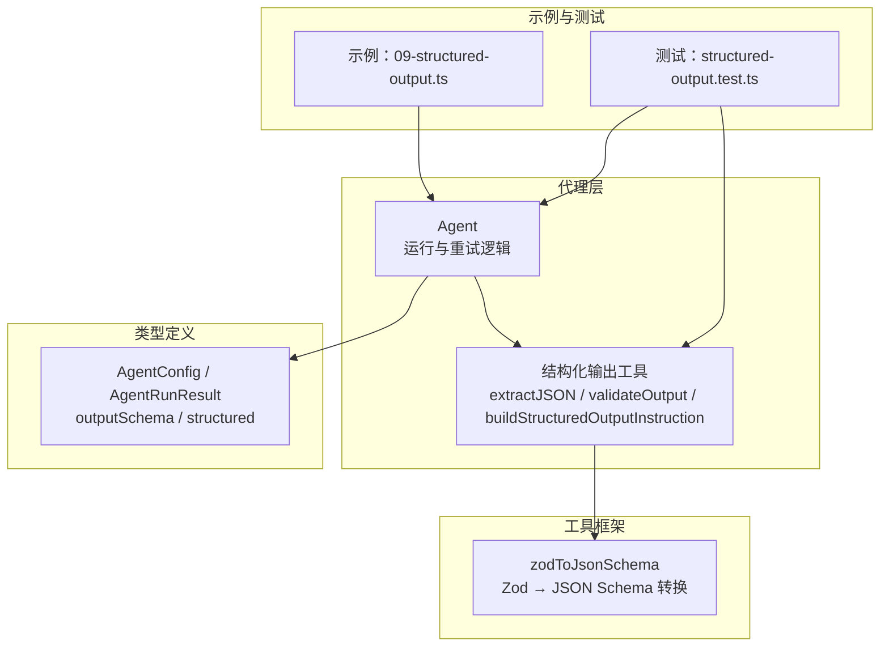
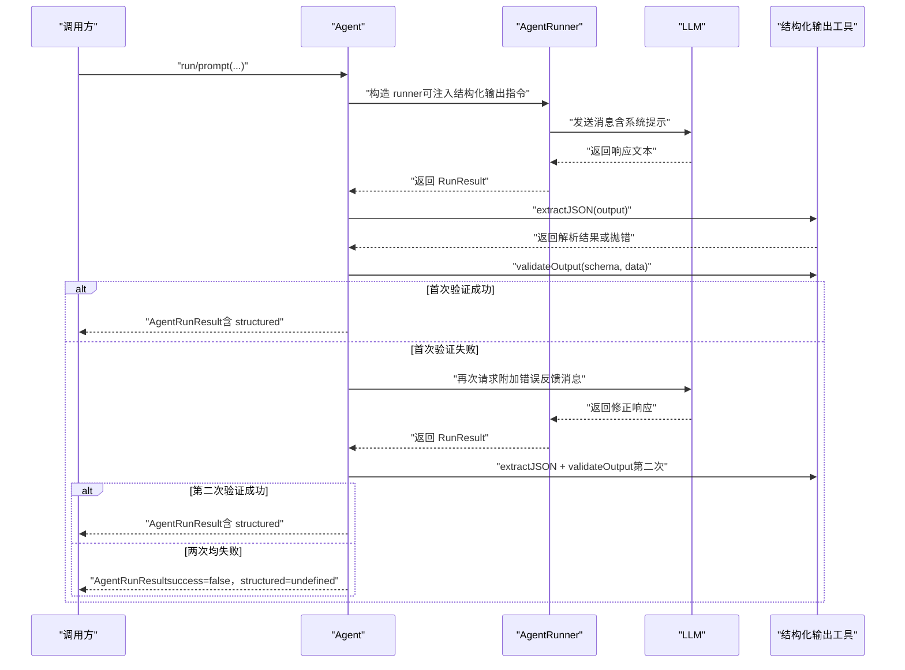
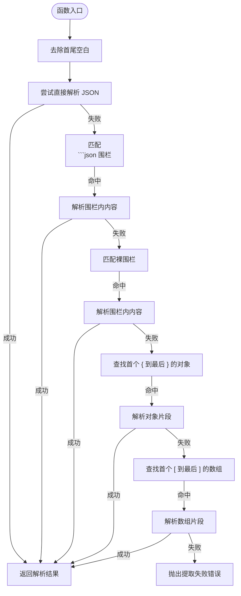
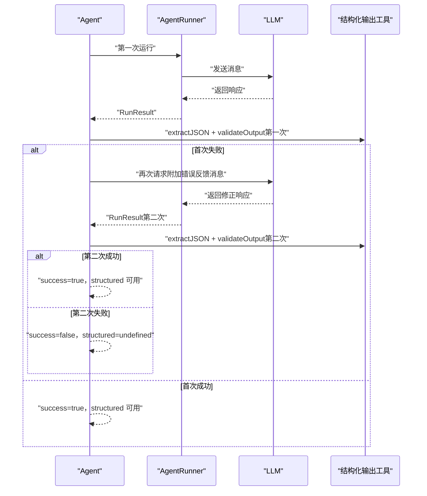
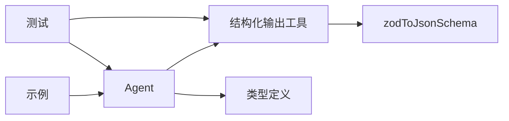

# 结构化输出系统

<cite>
**本文引用的文件列表**
- [structured-output.ts](file://src/agent/structured-output.ts)
- [agent.ts](file://src/agent/agent.ts)
- [types.ts](file://src/types.ts)
- [framework.ts](file://src/tool/framework.ts)
- [09-structured-output.ts](file://examples/09-structured-output.ts)
- [structured-output.test.ts](file://tests/structured-output.test.ts)
- [orchestrator.ts](file://src/orchestrator/orchestrator.ts)
- [task.ts](file://src/task/task.ts)
</cite>

## 目录
1. [简介](#简介)
2. [项目结构](#项目结构)
3. [核心组件](#核心组件)
4. [架构总览](#架构总览)
5. [详细组件分析](#详细组件分析)
6. [依赖关系分析](#依赖关系分析)
7. [性能考量](#性能考量)
8. [故障排查指南](#故障排查指南)
9. [结论](#结论)
10. [附录](#附录)

## 简介
本技术文档围绕“结构化输出系统”展开，系统性阐述其设计理念与实现机制，重点覆盖以下方面：
- JSON Schema 验证与输出格式化
- 输出解析与错误恢复（单次重试）
- buildStructuredOutputInstruction() 的作用与配置方法
- extractJSON() 与 validateOutput() 的工作原理与使用场景
- 结构化输出在代理配置中的集成方式与最佳实践
- 各类 JSON Schema 使用示例与常见问题解决方案

该系统通过在代理运行时注入结构化输出指令、自动解析与验证模型输出，并在首次验证失败时进行一次重试，显著提升输出质量与可靠性。

## 项目结构
结构化输出能力由以下模块协同实现：
- 代理层：负责在系统提示中注入结构化输出指令、执行首次解析与验证、触发重试流程
- 工具框架：提供 Zod 到 JSON Schema 的转换工具，供结构化输出指令生成使用
- 类型定义：定义 AgentConfig.outputSchema、AgentRunResult.structured 等关键类型
- 示例与测试：演示典型用法、验证行为与边界条件



图表来源
- [agent.ts:134-163](file://src/agent/agent.ts#L134-L163)
- [structured-output.ts:21-34](file://src/agent/structured-output.ts#L21-L34)
- [framework.ts:221-223](file://src/tool/framework.ts#L221-L223)
- [types.ts:194-241](file://src/types.ts#L194-L241)
- [09-structured-output.ts:38-43](file://examples/09-structured-output.ts#L38-L43)
- [structured-output.test.ts:190-202](file://tests/structured-output.test.ts#L190-L202)

章节来源
- [agent.ts:134-163](file://src/agent/agent.ts#L134-L163)
- [structured-output.ts:21-34](file://src/agent/structured-output.ts#L21-L34)
- [framework.ts:221-223](file://src/tool/framework.ts#L221-L223)
- [types.ts:194-241](file://src/types.ts#L194-L241)
- [09-structured-output.ts:38-43](file://examples/09-structured-output.ts#L38-L43)
- [structured-output.test.ts:190-202](file://tests/structured-output.test.ts#L190-L202)

## 核心组件
- 结构化输出指令生成器：将 Zod Schema 转换为 JSON Schema 并注入到系统提示中，指导模型以严格 JSON 响应
- JSON 提取器：从原始文本中提取有效 JSON，支持多种包裹与嵌入形式
- 输出验证器：基于 Zod 对解析后的数据进行强类型校验，包含路径化错误信息
- 代理重试流程：首次验证失败后，向模型发送错误反馈并进行一次重试，合并令牌用量与消息历史

章节来源
- [structured-output.ts:21-34](file://src/agent/structured-output.ts#L21-L34)
- [structured-output.ts:50-105](file://src/agent/structured-output.ts#L50-L105)
- [structured-output.ts:117-126](file://src/agent/structured-output.ts#L117-L126)
- [agent.ts:400-477](file://src/agent/agent.ts#L400-L477)

## 架构总览
结构化输出在代理生命周期中的位置如下：



图表来源
- [agent.ts:134-163](file://src/agent/agent.ts#L134-L163)
- [agent.ts:400-477](file://src/agent/agent.ts#L400-L477)
- [structured-output.ts:50-105](file://src/agent/structured-output.ts#L50-L105)
- [structured-output.ts:117-126](file://src/agent/structured-output.ts#L117-L126)

## 详细组件分析

### 组件A：结构化输出指令生成（buildStructuredOutputInstruction）
- 作用：将 Zod Schema 转换为 JSON Schema，并以清晰的指令形式注入到系统提示中，要求模型仅返回符合模式的有效 JSON
- 关键点：
  - 使用 zodToJsonSchema 将 ZodSchema 转为 JSON Schema
  - 指令强调“仅返回有效 JSON”，禁止代码围栏与解释性文本
  - 指令块以代码围栏形式呈现，便于模型识别
- 配置方法：在 AgentConfig 中设置 outputSchema 字段；Agent 在初始化 runner 时自动拼接该指令

章节来源
- [structured-output.ts:21-34](file://src/agent/structured-output.ts#L21-L34)
- [framework.ts:221-223](file://src/tool/framework.ts#L221-L223)
- [agent.ts:134-163](file://src/agent/agent.ts#L134-L163)
- [types.ts:224-228](file://src/types.ts#L224-L228)

### 组件B：JSON 提取（extractJSON）
- 作用：从模型原始输出中提取有效 JSON，支持多种包裹与嵌入形式
- 处理顺序（优先级）：
  1) 直接解析（最常见且高效）
  2) 解析带 ```json 围栏的块
  3) 解析带裸围栏的块
  4) 从文本中定位首个 { 到最后一个 } 的对象片段
  5) 从文本中定位首个 [ 到最后一个 ] 的数组片段
- 错误处理：若无法提取，抛出包含原始输出开头片段的错误，便于调试



图表来源
- [structured-output.ts:50-105](file://src/agent/structured-output.ts#L50-L105)

章节来源
- [structured-output.ts:50-105](file://src/agent/structured-output.ts#L50-L105)

### 组件C：输出验证（validateOutput）
- 作用：使用 Zod 对解析后的数据进行强类型校验，支持路径化错误信息与变换
- 行为特征：
  - 若校验通过，返回规范化后的数据（可能包含 Zod 变换）
  - 若校验失败，抛出包含字段路径与错误信息的异常
  - 支持严格模式（未知键会被拒绝）
- 典型用途：确保结构化输出满足业务约束与类型安全

章节来源
- [structured-output.ts:117-126](file://src/agent/structured-output.ts#L117-L126)
- [structured-output.test.ts:84-132](file://tests/structured-output.test.ts#L84-L132)

### 组件D：代理重试机制（单次重试）
- 触发条件：首次验证失败（解析或 Zod 校验）
- 重试策略：
  - 构造一条用户消息，包含上次响应未满足模式的原因与错误详情
  - 以“原上下文 + 上轮对话 + 错误反馈 + 新一轮对话”的形式再次请求
  - 合并令牌用量与消息历史，保持交替角色序列（满足特定 API 的要求）
- 结果判定：
  - 第二次验证成功：返回成功结果，structured 字段可用
  - 两次均失败：返回失败结果，structured 为 undefined



图表来源
- [agent.ts:400-477](file://src/agent/agent.ts#L400-L477)
- [structured-output.ts:50-105](file://src/agent/structured-output.ts#L50-L105)
- [structured-output.ts:117-126](file://src/agent/structured-output.ts#L117-L126)

章节来源
- [agent.ts:400-477](file://src/agent/agent.ts#L400-L477)

### 组件E：类型与配置集成
- AgentConfig.outputSchema：可选的 Zod Schema，启用结构化输出功能
- AgentRunResult.structured：当 outputSchema 存在且验证通过时，返回解析与校验后的数据；否则为 undefined
- beforeRun/afterRun：可在验证前后插入钩子，用于预处理与后处理

章节来源
- [types.ts:194-241](file://src/types.ts#L194-L241)
- [types.ts:296-310](file://src/types.ts#L296-L310)
- [agent.ts:332-356](file://src/agent/agent.ts#L332-L356)

### 组件F：示例与测试
- 示例：展示如何在 AgentConfig 中设置 outputSchema，并读取 result.structured
- 测试：覆盖 extractJSON 的多场景解析、validateOutput 的错误路径、以及代理端到端的重试行为

章节来源
- [09-structured-output.ts:38-73](file://examples/09-structured-output.ts#L38-L73)
- [structured-output.test.ts:42-132](file://tests/structured-output.test.ts#L42-L132)
- [structured-output.test.ts:190-331](file://tests/structured-output.test.ts#L190-L331)

## 依赖关系分析
- Agent 依赖结构化输出工具：在运行前注入指令，在运行后进行解析与验证
- 结构化输出工具依赖工具框架：通过 zodToJsonSchema 将 Zod Schema 转为 JSON Schema
- 类型系统提供契约：AgentConfig.outputSchema 与 AgentRunResult.structured 明确了结构化输出的输入与输出形态



图表来源
- [agent.ts:134-163](file://src/agent/agent.ts#L134-L163)
- [structured-output.ts:21-34](file://src/agent/structured-output.ts#L21-L34)
- [framework.ts:221-223](file://src/tool/framework.ts#L221-L223)
- [types.ts:194-241](file://src/types.ts#L194-L241)
- [09-structured-output.ts:38-43](file://examples/09-structured-output.ts#L38-L43)
- [structured-output.test.ts:190-202](file://tests/structured-output.test.ts#L190-L202)

章节来源
- [agent.ts:134-163](file://src/agent/agent.ts#L134-L163)
- [structured-output.ts:21-34](file://src/agent/structured-output.ts#L21-L34)
- [framework.ts:221-223](file://src/tool/framework.ts#L221-L223)
- [types.ts:194-241](file://src/types.ts#L194-L241)
- [09-structured-output.ts:38-43](file://examples/09-structured-output.ts#L38-L43)
- [structured-output.test.ts:190-202](file://tests/structured-output.test.ts#L190-L202)

## 性能考量
- 单次重试：避免多次往返，降低平均延迟与成本
- 令牌用量合并：将首次与重试的令牌用量累加，便于计费与可观测性
- 解析策略：优先直接解析，减少正则匹配开销；仅在必要时进行围栏与嵌入扫描
- 最大延迟上限：防止指数退避导致过长等待（在任务重试中体现）

章节来源
- [agent.ts:447-451](file://src/agent/agent.ts#L447-L451)
- [orchestrator.ts:102-114](file://src/orchestrator/orchestrator.ts#L102-L114)

## 故障排查指南
- 无法提取 JSON
  - 症状：抛出“Failed to extract JSON”错误，包含原始输出开头片段
  - 排查：确认模型是否遵守“仅返回有效 JSON”的指令；检查输出是否被代码围栏包裹或夹杂解释性文本
- 验证失败
  - 症状：抛出包含字段路径与错误信息的异常
  - 排查：核对字段类型、枚举值、范围约束；确认是否使用了严格模式导致未知键被拒绝
- 重试仍失败
  - 症状：两次尝试均失败，最终返回 success=false，structured=undefined
  - 排查：检查错误反馈消息是否准确传达了失败原因；确认模型提供商的 API 是否需要交替的角色序列
- 令牌用量异常
  - 症状：总令牌用量与预期不符
  - 排查：确认是否正确合并了首次与重试的用量；在任务重试中也需注意累加逻辑

章节来源
- [structured-output.ts:102-105](file://src/agent/structured-output.ts#L102-L105)
- [structured-output.ts:122-126](file://src/agent/structured-output.ts#L122-L126)
- [agent.ts:419-477](file://src/agent/agent.ts#L419-L477)
- [structured-output.test.ts:248-257](file://tests/structured-output.test.ts#L248-L257)

## 结论
结构化输出系统通过“指令注入 + 自动解析 + 强类型验证 + 单次重试”的组合，实现了高可靠、易维护的结构化输出能力。它与代理生命周期无缝集成，既保证了输出质量，又控制了额外成本与复杂度。配合 Zod Schema 的丰富表达力，开发者可以快速构建健壮的结构化数据管道。

## 附录

### 最佳实践
- 在 AgentConfig 中明确设置 outputSchema，使系统自动注入指令并启用验证
- 使用 describe 为字段添加描述，提升模型理解与指令可读性
- 对于严格模式，确保输入数据不包含未知键；如需宽松模式，考虑移除 strict
- 在 beforeRun/afterRun 中进行必要的预处理与后处理，避免影响结构化输出的稳定性
- 对于需要更强容错的任务，结合任务重试机制（最大重试次数、指数退避、延迟上限）进行整体优化

章节来源
- [types.ts:224-228](file://src/types.ts#L224-L228)
- [agent.ts:296-356](file://src/agent/agent.ts#L296-L356)
- [orchestrator.ts:108-114](file://src/orchestrator/orchestrator.ts#L108-L114)
- [task.ts:29-53](file://src/task/task.ts#L29-L53)

### 常见 JSON Schema 使用示例
- 基础对象：包含字符串、数字、枚举与数组字段
- 枚举与范围：使用枚举限制取值，使用 min/max 控制数值范围
- 可选字段：通过 Zod 的可选类型声明非必需字段
- 严格模式：使用 strict() 限制未知键，提高数据一致性
- 变换：利用 transform 对输入进行规范化（例如大小写转换）

章节来源
- [09-structured-output.ts:25-32](file://examples/09-structured-output.ts#L25-L32)
- [structured-output.test.ts:113-119](file://tests/structured-output.test.ts#L113-L119)
- [framework.ts:221-223](file://src/tool/framework.ts#L221-L223)