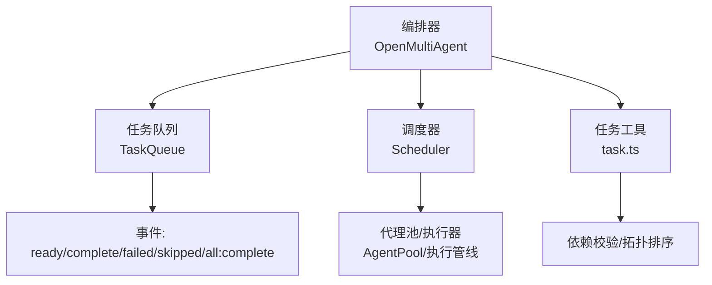
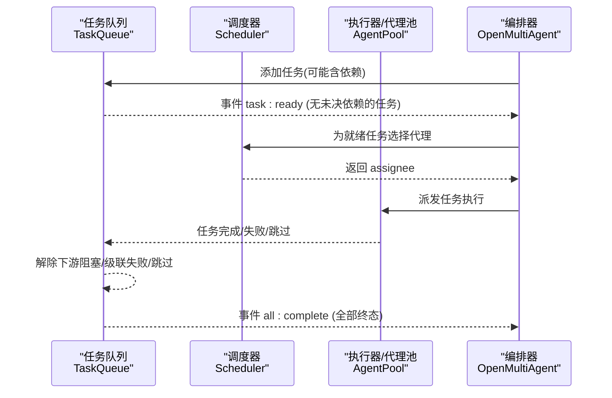
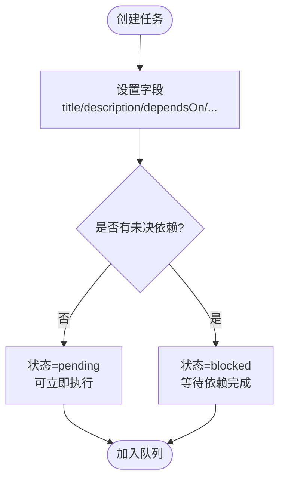
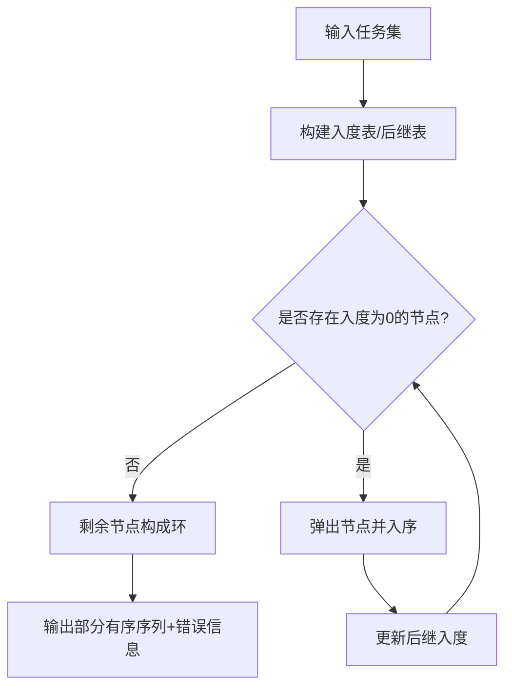
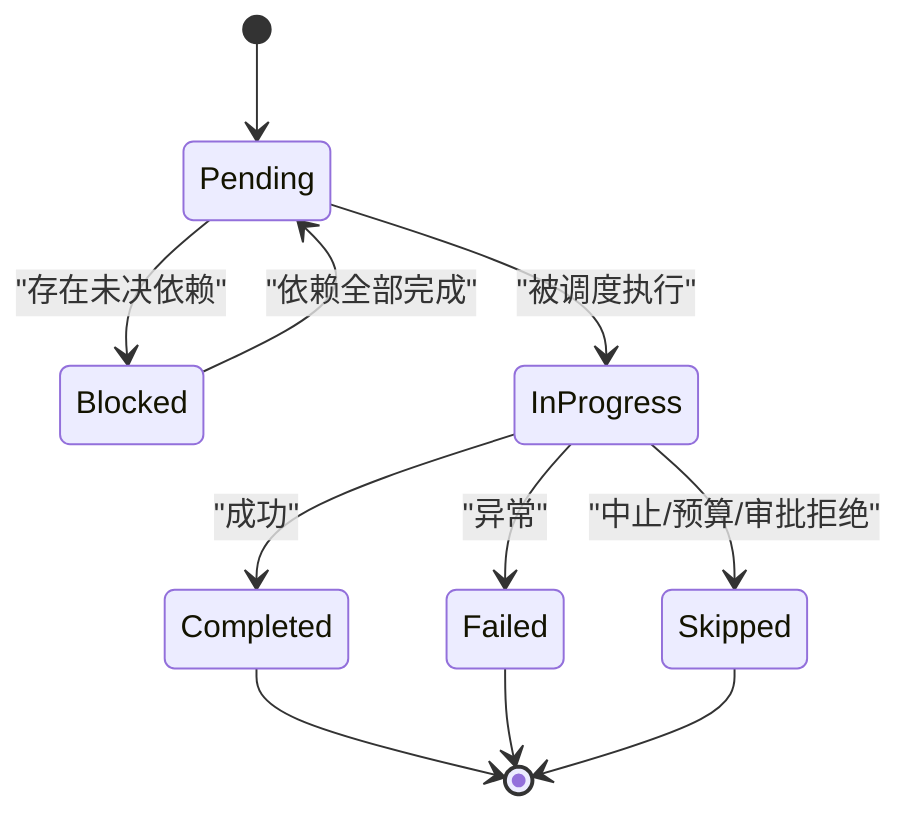
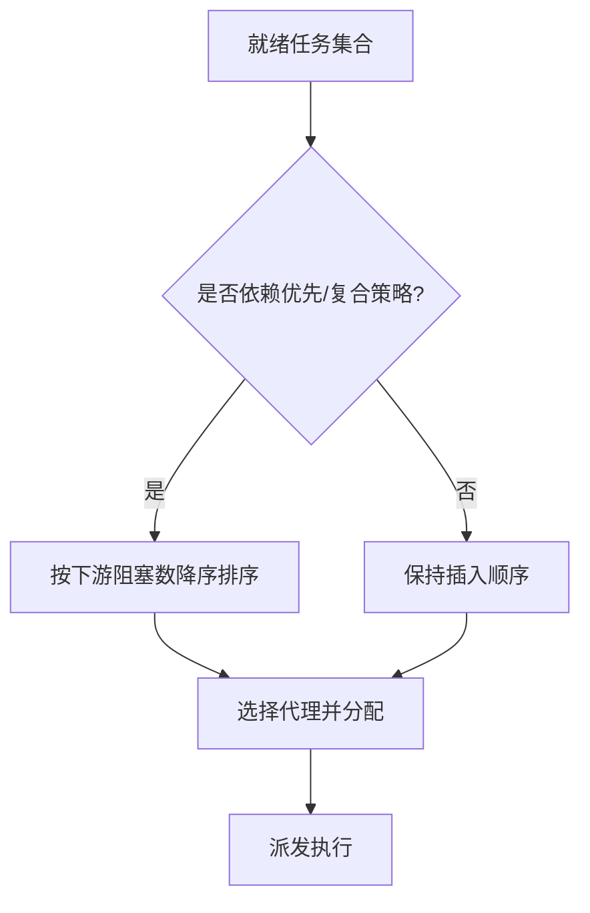
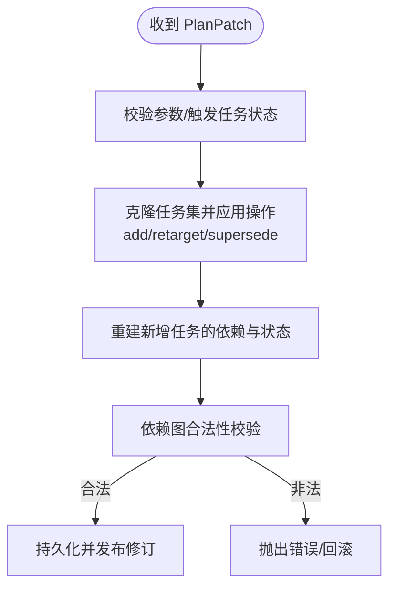
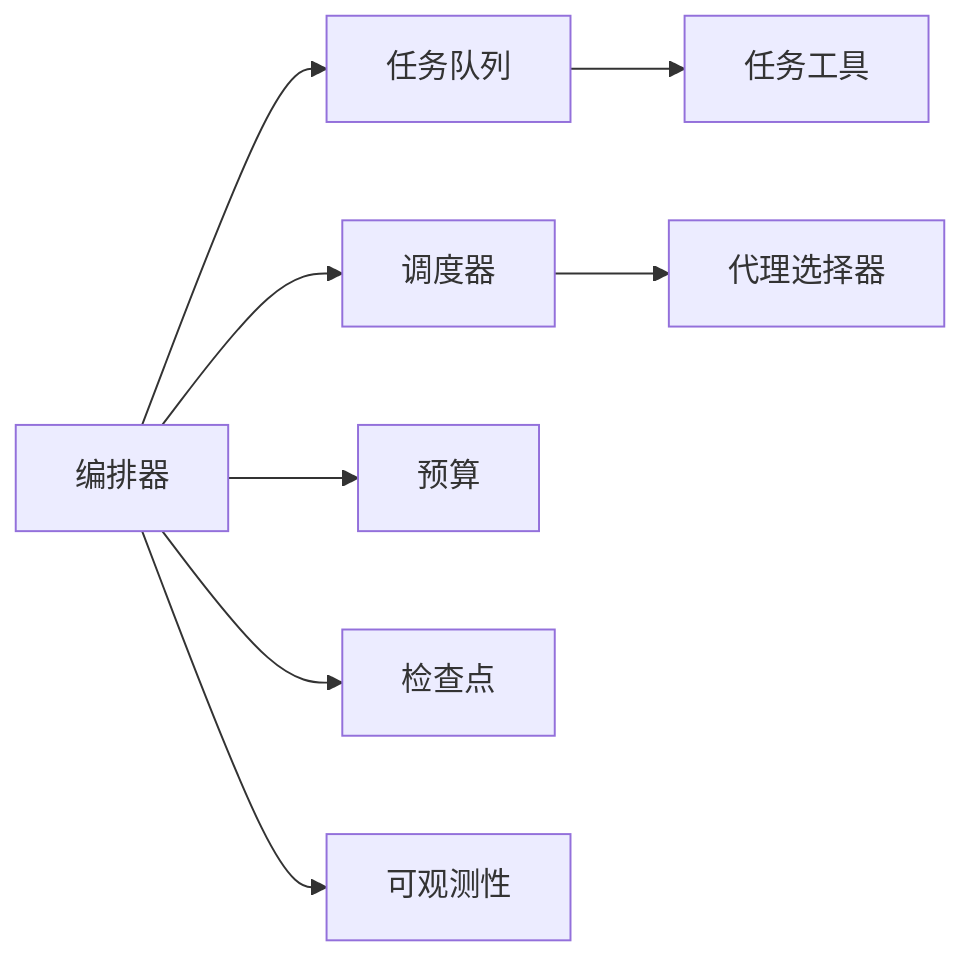

# 任务依赖图(DAG)

<cite>
**本文引用的文件**
- [README.md](file://README.md)
- [task-scheduling.md](file://docs/task-scheduling.md)
- [orchestrator.ts](file://packages/core/src/orchestrator/orchestrator.ts)
- [scheduler.ts](file://packages/core/src/orchestrator/scheduler.ts)
- [queue.ts](file://packages/core/src/task/queue.ts)
- [task.ts](file://packages/core/src/task/task.ts)
- [types.ts](file://packages/core/src/types.ts)
</cite>

## 目录
1. [简介](#简介)
2. [项目结构](#项目结构)
3. [核心组件](#核心组件)
4. [架构总览](#架构总览)
5. [详细组件分析](#详细组件分析)
6. [依赖关系分析](#依赖关系分析)
7. [性能考量](#性能考量)
8. [故障排查指南](#故障排查指南)
9. [结论](#结论)
10. [附录：示例与最佳实践](#附录示例与最佳实践)

## 简介
本文件系统性解释 Open Multi-Agent 中的任务依赖图（DAG）工作原理，覆盖任务定义、依赖建立、执行顺序确定、数据结构与算法实现、状态管理、依赖检查、循环检测、复杂工作流构建（并行、条件分支、错误处理）、以及性能优化与最佳实践。内容从基础概念到高级应用，帮助读者在理解源码的基础上正确设计并运行可靠的多智能体工作流。

## 项目结构
Open Multi-Agent 的核心 DAG 能力集中在 core 包中，关键模块如下：
- 任务队列与生命周期：TaskQueue（事件驱动、拓扑依赖解析、快照/恢复）
- 调度策略：Scheduler（多种分配策略、就绪任务排序）
- 任务工具函数：createTask、isTaskReady、getTaskDependencyOrder、validateTaskDependencies
- 编排器：OpenMultiAgent（协调计划、执行路由、预算、检查点、审批等）
- 类型定义：OrchestratorConfig、Task 等接口约束

图表来源
- [orchestrator.ts:1-200](file://packages/core/src/orchestrator/orchestrator.ts#L1-L200)
- [queue.ts:1-120](file://packages/core/src/task/queue.ts#L1-L120)
- [scheduler.ts:1-120](file://packages/core/src/orchestrator/scheduler.ts#L1-L120)
- [task.ts:1-120](file://packages/core/src/task/task.ts#L1-L120)

章节来源
- [README.md:46-107](file://README.md#L46-L107)
- [orchestrator.ts:1-200](file://packages/core/src/orchestrator/orchestrator.ts#L1-L200)

## 核心组件
- 任务队列 TaskQueue：维护任务集合与状态分区，提供 add/addBatch、complete/fail/skip、snapshot/fromSnapshot、applyPlanPatch/publishPlanRevision、事件订阅 on(event, handler) 等能力；完成一个任务后自动解除下游阻塞并触发事件。
- 调度器 Scheduler：将待执行任务映射到可用代理，支持 round-robin、least-busy、capability-match、dependency-first、composite 五种策略；提供 schedule/scheduleTask/orderReadyTasks/autoAssign。
- 任务工具 task.ts：创建任务、判断就绪 isTaskReady、拓扑排序 getTaskDependencyOrder、依赖校验 validateTaskDependencies（含环检测）。
- 编排器 orchestrator.ts：组合上述组件，负责计划生成、执行路由、预算控制、检查点、审批门控、结果聚合与可观测性。

章节来源
- [queue.ts:46-120](file://packages/core/src/task/queue.ts#L46-L120)
- [scheduler.ts:128-292](file://packages/core/src/orchestrator/scheduler.ts#L128-L292)
- [task.ts:23-114](file://packages/core/src/task/task.ts#L23-L114)
- [orchestrator.ts:1-200](file://packages/core/src/orchestrator/orchestrator.ts#L1-L200)

## 架构总览
下图展示一次典型的事件驱动 DAG 执行流程：队列发出 ready 事件，调度器选择代理，执行完成后解锁下游，直至全部完成或失败/跳过。

图表来源
- [task-scheduling.md:1-26](file://docs/task-scheduling.md#L1-L26)
- [queue.ts:433-480](file://packages/core/src/task/queue.ts#L433-L480)
- [scheduler.ts:216-292](file://packages/core/src/orchestrator/scheduler.ts#L216-L292)
- [orchestrator.ts:1-200](file://packages/core/src/orchestrator/orchestrator.ts#L1-L200)

## 详细组件分析

### 任务定义与依赖关系
- 任务字段包括标题、描述、依赖 dependsOn、内存范围 memoryScope、依赖载荷 dependencyPayload、重试配置、角色 role、优先级 priority、元数据 metadata、要求 requires、验证 verify 等。
- 通过 createTask 构造任务，默认状态 pending，时间戳自动生成。
- 依赖关系以字符串 ID 引用其他任务；缺失的依赖视为不可满足，任务不会就绪。

图表来源
- [task.ts:36-75](file://packages/core/src/task/task.ts#L36-L75)
- [task.ts:81-114](file://packages/core/src/task/task.ts#L81-L114)
- [queue.ts:79-105](file://packages/core/src/task/queue.ts#L79-L105)

章节来源
- [task.ts:36-114](file://packages/core/src/task/task.ts#L36-L114)
- [types.ts:1404-1415](file://packages/core/src/types.ts#L1404-L1415)

### 依赖检查与就绪判定
- isTaskReady：仅当任务状态为 pending 且所有依赖均为 completed 时返回 true；缺失依赖则不就绪。
- 队列在添加任务时根据当前已注册任务集合计算初始状态（pending/blocked），并在依赖完成后批量解除阻塞。

章节来源
- [task.ts:81-114](file://packages/core/src/task/task.ts#L81-L114)
- [queue.ts:709-748](file://packages/core/src/task/queue.ts#L709-L748)

### 拓扑排序与循环检测
- 拓扑排序：使用 Kahn 算法对任务进行线性排序，保证每个任务出现在其依赖之后；若存在环，仅返回可排序的子集。
- 循环检测：DFS 三色标记法（白/灰/黑）检测回边，报告具体环路路径；同时检查自依赖和未知依赖引用。

图表来源
- [task.ts:137-182](file://packages/core/src/task/task.ts#L137-L182)
- [task.ts:206-261](file://packages/core/src/task/task.ts#L206-L261)

章节来源
- [task.ts:137-182](file://packages/core/src/task/task.ts#L137-L182)
- [task.ts:206-261](file://packages/core/src/task/task.ts#L206-L261)

### 任务状态管理与事件驱动执行
- 状态机：pending → in_progress → {completed | failed | skipped}；blocked 表示有未决依赖。
- 事件：task:ready、task:complete、task:failed、task:skipped、all:complete。
- 完成/失败/跳过会触发下游解锁或级联失败/跳过；队列在全部终态时发出 all:complete。

图表来源
- [queue.ts:433-505](file://packages/core/src/task/queue.ts#L433-L505)
- [queue.ts:514-545](file://packages/core/src/task/queue.ts#L514-L545)

章节来源
- [queue.ts:433-505](file://packages/core/src/task/queue.ts#L433-L505)
- [queue.ts:514-545](file://packages/core/src/task/queue.ts#L514-L545)

### 调度策略与执行顺序
- 五种策略：
  - round-robin：按代理索引轮询分配。
  - least-busy：优先分配给当前 in_progress 最少的代理。
  - capability-match：基于显式需求过滤与能力/关键词匹配打分。
  - dependency-first：优先分配能解锁最多下游的任务（关键路径启发式）。
  - composite：结合关键路径、能力契合度与当前负载加权评分。
- orderReadyTasks：对就绪任务按“能解锁的下游数量”降序排列（针对 dependency-first/composite），提高整体吞吐。

图表来源
- [scheduler.ts:253-268](file://packages/core/src/orchestrator/scheduler.ts#L253-L268)
- [scheduler.ts:415-450](file://packages/core/src/orchestrator/scheduler.ts#L415-L450)
- [scheduler.ts:452-508](file://packages/core/src/orchestrator/scheduler.ts#L452-L508)

章节来源
- [scheduler.ts:128-292](file://packages/core/src/orchestrator/scheduler.ts#L128-L292)
- [scheduler.ts:415-508](file://packages/core/src/orchestrator/scheduler.ts#L415-L508)

### 计划修复与运行时变更
- applyPlanPatch：在不破坏已有拓扑的前提下追加新任务、重定向挂起任务、替换挂起分支；成功后发布修订版本并触发相应事件。
- 适用于失败恢复、动态扩展、条件分支等场景。

图表来源
- [queue.ts:172-396](file://packages/core/src/task/queue.ts#L172-L396)

章节来源
- [queue.ts:172-396](file://packages/core/src/task/queue.ts#L172-L396)

### 复杂工作流构建
- 并行执行：独立任务（无共享依赖）由事件驱动并发执行，受最大并发限制。
- 条件分支：通过依赖关系与计划修复（supersedePending + addTasks）动态替换分支。
- 错误处理：失败/跳过级联传播；预算耗尽、审批拒绝走“排空后跳过”的统一路径。

章节来源
- [task-scheduling.md:1-26](file://docs/task-scheduling.md#L1-L26)
- [task-scheduling.md:166-184](file://docs/task-scheduling.md#L166-L184)
- [queue.ts:433-505](file://packages/core/src/task/queue.ts#L433-L505)

## 依赖关系分析
- 耦合关系：
  - orchestrator 依赖 TaskQueue、Scheduler、AgentPool 等子系统，形成松耦合编排。
  - TaskQueue 依赖 task.ts 的工具函数进行就绪判断与依赖校验。
  - Scheduler 依赖 AgentSelector 进行能力匹配与硬需求过滤。
- 外部集成：
  - 预算、检查点、可观测性、审批门控等横切关注点在 orchestrator 层统一接入。

图表来源
- [orchestrator.ts:1-200](file://packages/core/src/orchestrator/orchestrator.ts#L1-L200)
- [scheduler.ts:18-25](file://packages/core/src/orchestrator/scheduler.ts#L18-L25)
- [task.ts:9-17](file://packages/core/src/task/task.ts#L9-L17)

章节来源
- [orchestrator.ts:1-200](file://packages/core/src/orchestrator/orchestrator.ts#L1-L200)
- [scheduler.ts:18-25](file://packages/core/src/orchestrator/scheduler.ts#L18-L25)

## 性能考量
- 事件驱动最小化等待：下游任务在依赖完成时立即启动，无需等待同批无关任务。
- 就绪任务排序：dependency-first/composite 策略优先处理关键路径任务，减少整体阻塞。
- 批量扫描优化：unblockDependents 一次性构建任务数组与查找表，避免 O(n²)。
- 负载快照：composite 策略基于当前 DAG 快照计算负载，避免同一调度调用内重复折叠。
- 建议：
  - 合理设置 maxConcurrency 与 schedulingStrategy。
  - 使用 dependency-first 或 composite 提升依赖密集 DAG 的吞吐。
  - 利用计划修复动态调整分支，避免重新构建整个图。

章节来源
- [task-scheduling.md:1-26](file://docs/task-scheduling.md#L1-L26)
- [scheduler.ts:452-508](file://packages/core/src/orchestrator/scheduler.ts#L452-L508)
- [queue.ts:719-748](file://packages/core/src/task/queue.ts#L719-L748)

## 故障排查指南
- 常见错误：
  - 未知依赖引用或自依赖：依赖校验阶段报错，需修正 dependsOn。
  - 循环依赖：DFS 检测到环，需重构依赖关系。
  - 无合格代理：硬需求无法满足时报 NO_ELIGIBLE_AGENT，需调整代理能力或任务要求。
  - 审批拒绝/预算耗尽：进入“排空后跳过”，确认审批回调与预算配置。
- 定位方法：
  - 查看队列快照与进度统计，确认任务状态分布。
  - 检查计划修订历史，确认动态修复是否生效。
  - 结合可观测性记录与执行回执，追踪任务链路。

章节来源
- [task.ts:206-261](file://packages/core/src/task/task.ts#L206-L261)
- [scheduler.ts:546-557](file://packages/core/src/orchestrator/scheduler.ts#L546-L557)
- [task-scheduling.md:166-184](file://docs/task-scheduling.md#L166-L184)

## 结论
Open Multi-Agent 的任务依赖图以事件驱动的 TaskQueue 为核心，配合多策略 Scheduler 与严格的依赖校验/拓扑排序，实现了高内聚、低耦合的可扩展工作流引擎。通过计划修复、预算与审批门控、检查点恢复等机制，既支持简单流水线，也能承载复杂的条件分支与容错场景。遵循本文的最佳实践，可在生产环境中稳定高效地运行多智能体协作流程。

## 附录：示例与最佳实践
- 定义任务与依赖：
  - 使用 createTask 创建任务，并通过 dependsOn 声明上游依赖。
  - 参考路径：[任务工厂与就绪判定:36-114](file://packages/core/src/task/task.ts#L36-L114)
- 构建 DAG 并执行：
  - 将任务加入队列，监听 task:ready 事件，调度器分配代理后执行。
  - 参考路径：[事件驱动执行说明:1-26](file://docs/task-scheduling.md#L1-L26)、[队列事件与解锁:433-505](file://packages/core/src/task/queue.ts#L433-L505)
- 复杂工作流：
  - 使用 applyPlanPatch 动态追加/替换分支，实现条件分支与失败恢复。
  - 参考路径：[计划修复 API:172-396](file://packages/core/src/task/queue.ts#L172-L396)
- 性能调优：
  - 选择 dependency-first 或 composite 策略，合理设置权重与并发上限。
  - 参考路径：[调度策略与排序:253-508](file://packages/core/src/orchestrator/scheduler.ts#L253-L508)
- 错误处理与可观测性：
  - 利用检查点与执行回执定位问题，结合审批/预算门控保障稳定性。
  - 参考路径：[中断/预算/检查点:166-184](file://docs/task-scheduling.md#L166-L184)