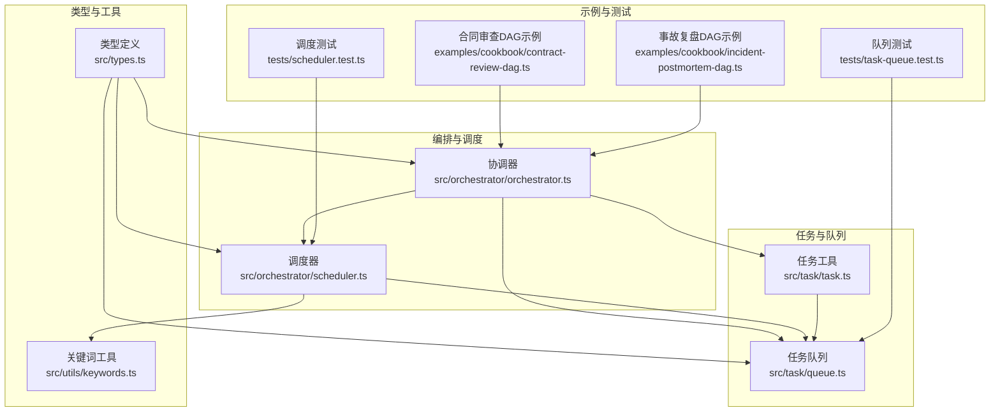
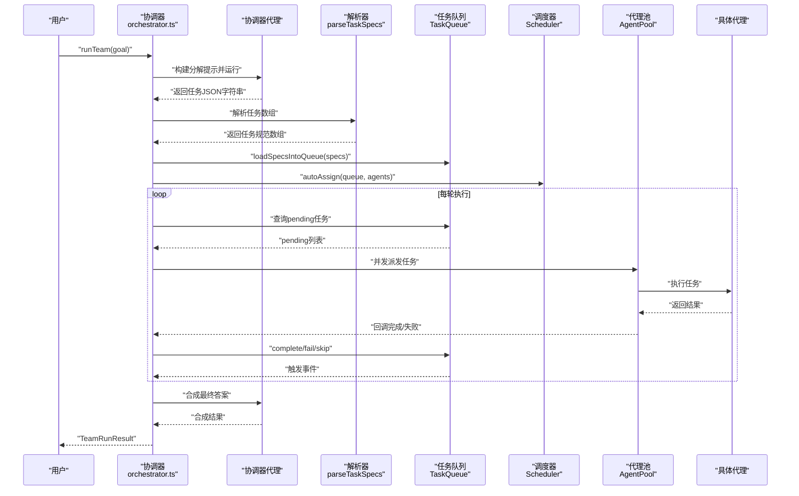
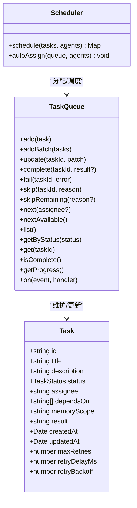
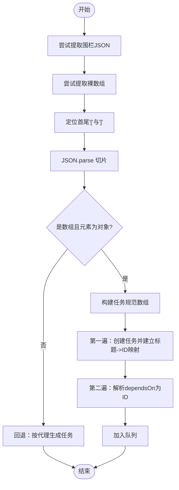
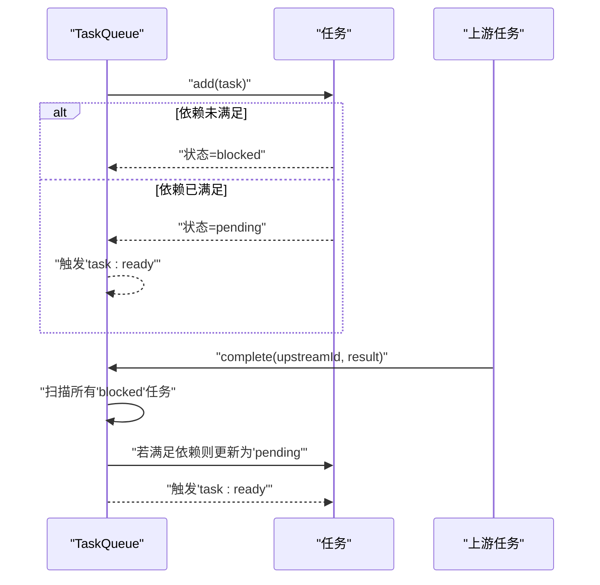
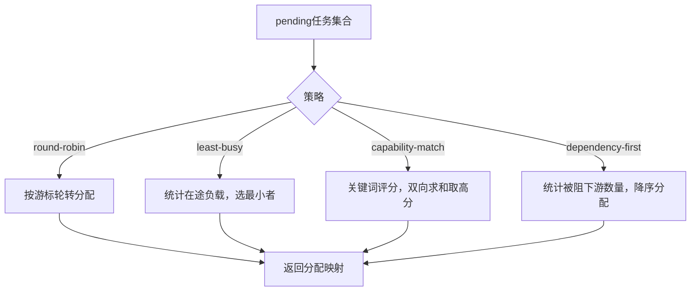
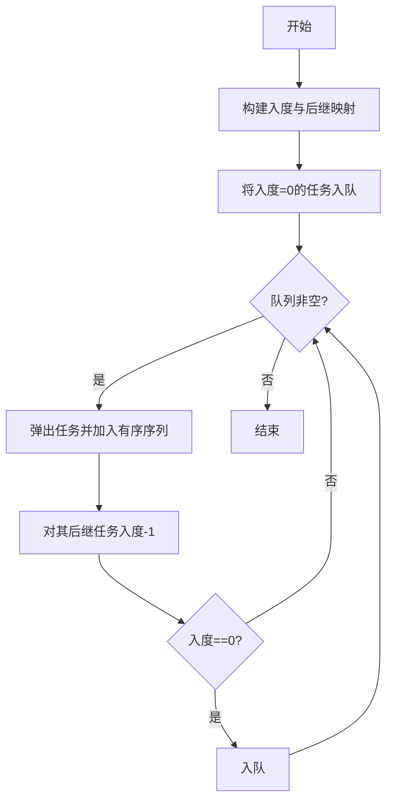
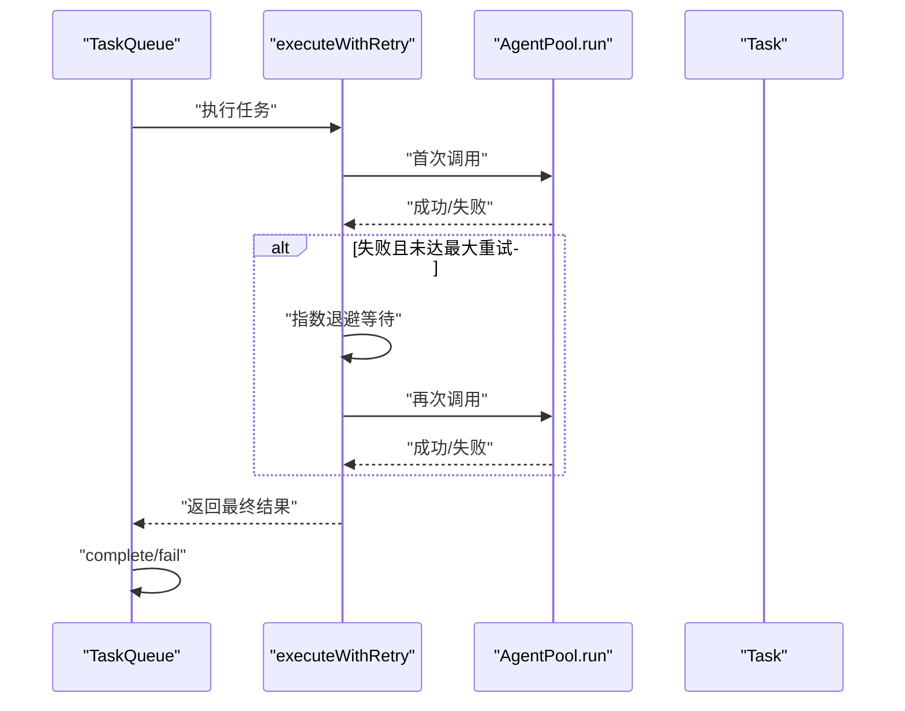
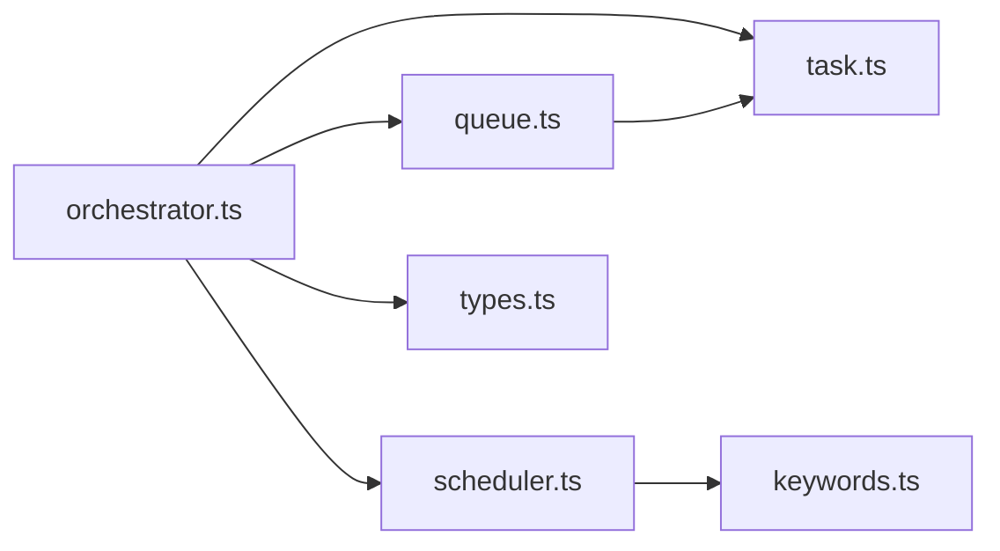

# 任务分解与 DAG

<cite>
**本文引用的文件**
- [src/task/task.ts](file://src/task/task.ts)
- [src/task/queue.ts](file://src/task/queue.ts)
- [src/orchestrator/orchestrator.ts](file://src/orchestrator/orchestrator.ts)
- [src/orchestrator/scheduler.ts](file://src/orchestrator/scheduler.ts)
- [src/types.ts](file://src/types.ts)
- [src/utils/keywords.ts](file://src/utils/keywords.ts)
- [examples/cookbook/contract-review-dag.ts](file://examples/cookbook/contract-review-dag.ts)
- [examples/cookbook/incident-postmortem-dag.ts](file://examples/cookbook/incident-postmortem-dag.ts)
- [tests/task-queue.test.ts](file://tests/task-queue.test.ts)
- [tests/scheduler.test.ts](file://tests/scheduler.test.ts)
</cite>

## 目录
1. [引言](#引言)
2. [项目结构](#项目结构)
3. [核心组件](#核心组件)
4. [架构总览](#架构总览)
5. [详细组件分析](#详细组件分析)
6. [依赖分析](#依赖分析)
7. [性能考虑](#性能考虑)
8. [故障排查指南](#故障排查指南)
9. [结论](#结论)
10. [附录](#附录)

## 引言
本文件系统性阐述“任务分解与有向无环图（DAG）”在框架中的实现与使用方式，覆盖从高层目标到具体可执行任务的生成、任务节点与依赖关系的建模、拓扑排序与执行顺序确定、任务队列的依赖感知与并发调度、以及状态管理、错误处理与重试机制。文档既面向初学者解释 DAG 的基本概念，也为有经验的开发者提供性能优化与扩展建议。

## 项目结构
围绕任务分解与 DAG 的核心代码位于以下模块：
- 任务定义与工具：src/task/task.ts
- 任务队列与事件驱动：src/task/queue.ts
- 协调器与任务解析：src/orchestrator/orchestrator.ts
- 调度策略：src/orchestrator/scheduler.ts
- 类型定义：src/types.ts
- 关键词匹配工具：src/utils/keywords.ts
- 示例 DAG：examples/cookbook/contract-review-dag.ts、examples/cookbook/incident-postmortem-dag.ts
- 测试用例：tests/task-queue.test.ts、tests/scheduler.test.ts

图表来源
- [src/task/task.ts:1-242](file://src/task/task.ts#L1-L242)
- [src/task/queue.ts:1-470](file://src/task/queue.ts#L1-L470)
- [src/orchestrator/orchestrator.ts:1-1785](file://src/orchestrator/orchestrator.ts#L1-L1785)
- [src/orchestrator/scheduler.ts:1-322](file://src/orchestrator/scheduler.ts#L1-L322)
- [src/types.ts:704-729](file://src/types.ts#L704-L729)
- [src/utils/keywords.ts:1-40](file://src/utils/keywords.ts#L1-L40)
- [examples/cookbook/contract-review-dag.ts:1-369](file://examples/cookbook/contract-review-dag.ts#L1-L369)
- [examples/cookbook/incident-postmortem-dag.ts:1-438](file://examples/cookbook/incident-postmortem-dag.ts#L1-L438)
- [tests/task-queue.test.ts:1-246](file://tests/task-queue.test.ts#L1-L246)
- [tests/scheduler.test.ts:1-222](file://tests/scheduler.test.ts#L1-L222)

章节来源
- [src/task/task.ts:1-242](file://src/task/task.ts#L1-L242)
- [src/task/queue.ts:1-470](file://src/task/queue.ts#L1-L470)
- [src/orchestrator/orchestrator.ts:1-1785](file://src/orchestrator/orchestrator.ts#L1-L1785)
- [src/orchestrator/scheduler.ts:1-322](file://src/orchestrator/scheduler.ts#L1-L322)
- [src/types.ts:704-729](file://src/types.ts#L704-L729)
- [src/utils/keywords.ts:1-40](file://src/utils/keywords.ts#L1-L40)
- [examples/cookbook/contract-review-dag.ts:1-369](file://examples/cookbook/contract-review-dag.ts#L1-L369)
- [examples/cookbook/incident-postmortem-dag.ts:1-438](file://examples/cookbook/incident-postmortem-dag.ts#L1-L438)
- [tests/task-queue.test.ts:1-246](file://tests/task-queue.test.ts#L1-L246)
- [tests/scheduler.test.ts:1-222](file://tests/scheduler.test.ts#L1-L222)

## 核心组件
- 任务数据模型与工厂
  - 任务结构包含：标识、标题、描述、状态、分配对象、依赖列表、内存作用域、结果、时间戳、重试参数等。通过工厂函数创建任务，确保默认值与一致性。
  - 关键接口与函数：createTask、isTaskReady、getTaskDependencyOrder、validateTaskDependencies。
- 任务队列与事件驱动
  - 维护任务生命周期，自动根据依赖关系更新状态，触发 ready/complete/failed/skipped/all:complete 等事件；支持级联失败与跳过传播。
  - 关键接口与方法：add/addBatch/update/complete/fail/skip/skipRemaining、next/nextAvailable、getProgress、on。
- 协调器与任务解析
  - 从协调器输出解析 JSON 任务数组，支持标题或 ID 的 dependsOn 引用解析；支持计划审批门禁与预算控制；提供合成最终答案的能力。
  - 关键流程：parseTaskSpecs、loadSpecsIntoQueue、runTeam/runTasks、executeQueue。
- 调度策略
  - 提供轮转、最少忙碌、能力匹配、关键路径优先四种策略，支持自动分配与手动调度；依赖关键词匹配工具进行能力评分。
  - 关键接口与方法：schedule/autoAssign、countBlockedDependents。
- 类型与工具
  - 统一的任务状态、任务记录、执行指标、OrchestratorEvent 等类型；关键词抽取与评分工具用于能力匹配。

章节来源
- [src/task/task.ts:29-55](file://src/task/task.ts#L29-L55)
- [src/task/task.ts:78-94](file://src/task/task.ts#L78-L94)
- [src/task/task.ts:117-162](file://src/task/task.ts#L117-L162)
- [src/task/task.ts:186-241](file://src/task/task.ts#L186-L241)
- [src/task/queue.ts:55-470](file://src/task/queue.ts#L55-L470)
- [src/orchestrator/orchestrator.ts:355-397](file://src/orchestrator/orchestrator.ts#L355-L397)
- [src/orchestrator/orchestrator.ts:1651-1710](file://src/orchestrator/orchestrator.ts#L1651-L1710)
- [src/orchestrator/orchestrator.ts:561-800](file://src/orchestrator/orchestrator.ts#L561-L800)
- [src/orchestrator/scheduler.ts:96-322](file://src/orchestrator/scheduler.ts#L96-L322)
- [src/types.ts:704-729](file://src/types.ts#L704-L729)
- [src/utils/keywords.ts:18-39](file://src/utils/keywords.ts#L18-L39)

## 架构总览
下图展示了从高层目标到任务执行的整体流程：协调器负责将目标分解为任务规范，解析器将其转换为任务对象并建立依赖关系，调度器决定分配给谁，队列按依赖顺序并发执行，期间支持重试、预算与审批门禁，并在完成后由协调器合成最终答案。

图表来源
- [src/orchestrator/orchestrator.ts:1180-1374](file://src/orchestrator/orchestrator.ts#L1180-L1374)
- [src/orchestrator/orchestrator.ts:355-397](file://src/orchestrator/orchestrator.ts#L355-L397)
- [src/orchestrator/orchestrator.ts:1651-1710](file://src/orchestrator/orchestrator.ts#L1651-L1710)
- [src/task/queue.ts:55-470](file://src/task/queue.ts#L55-L470)
- [src/orchestrator/scheduler.ts:156-167](file://src/orchestrator/scheduler.ts#L156-L167)

## 详细组件分析

### 任务规范与数据结构
- 字段说明
  - id/title/description：唯一标识与描述
  - status：任务状态（pending/in_progress/completed/failed/blocked/skipped）
  - assignee：分配给的代理名称
  - dependsOn：上游任务ID列表
  - memoryScope：依赖注入范围（仅依赖结果或全部共享内存）
  - result：任务执行结果文本
  - createdAt/updatedAt：时间戳
  - 重试配置：maxRetries、retryDelayMs、retryBackoff
- 工厂与校验
  - createTask：统一创建任务，设置默认状态与时间戳
  - validateTaskDependencies：检查未知依赖、自依赖与环依赖
  - isTaskReady：判断任务是否满足所有依赖
  - getTaskDependencyOrder：基于Kahn算法的拓扑排序

图表来源
- [src/types.ts:704-729](file://src/types.ts#L704-L729)
- [src/task/queue.ts:55-470](file://src/task/queue.ts#L55-L470)
- [src/orchestrator/scheduler.ts:96-167](file://src/orchestrator/scheduler.ts#L96-L167)

章节来源
- [src/types.ts:704-729](file://src/types.ts#L704-L729)
- [src/task/task.ts:29-55](file://src/task/task.ts#L29-L55)
- [src/task/task.ts:186-241](file://src/task/task.ts#L186-L241)

### 任务解析算法（从协调器 JSON 输出）
- 解析策略
  - 支持三重容错：代码围栏内的 JSON、裸数组、以及首尾方括号包裹的数组切片
  - 过滤非对象项，校验必需字段（title/description），可选字段（assignee/dependsOn/memoryScope/maxRetries/retryDelayMs/retryBackoff）
- 依赖解析
  - 先创建任务以获得稳定ID，再将标题或ID形式的 dependsOn 解析为真实ID，最后加入队列
- 回退机制
  - 若解析失败，按每个代理生成一个任务，描述为原始目标

图表来源
- [src/orchestrator/orchestrator.ts:355-397](file://src/orchestrator/orchestrator.ts#L355-L397)
- [src/orchestrator/orchestrator.ts:1651-1710](file://src/orchestrator/orchestrator.ts#L1651-L1710)

章节来源
- [src/orchestrator/orchestrator.ts:355-397](file://src/orchestrator/orchestrator.ts#L355-L397)
- [src/orchestrator/orchestrator.ts:1651-1710](file://src/orchestrator/orchestrator.ts#L1651-L1710)

### 任务队列的依赖感知与并发执行
- 初始化与状态
  - 新增任务时根据当前队列状态判定初始状态（pending 或 blocked）
  - 事件驱动：task:ready、task:complete、task:failed、task:skipped、all:complete
- 依赖解除与级联
  - 完成任务后扫描所有被阻塞任务，重新评估是否满足依赖，满足则提升为 pending 并触发 task:ready
  - 失败/跳过会级联传播至下游依赖任务
- 查询与进度
  - next/nextAvailable 支持按代理或全局选择下一个可执行任务
  - getProgress 提供各状态计数，便于监控

图表来源
- [src/task/queue.ts:74-80](file://src/task/queue.ts#L74-L80)
- [src/task/queue.ts:424-446](file://src/task/queue.ts#L424-L446)
- [src/task/queue.ts:212-243](file://src/task/queue.ts#L212-L243)

章节来源
- [src/task/queue.ts:55-470](file://src/task/queue.ts#L55-L470)

### 调度策略与并行执行
- 四种策略
  - round-robin：均匀分配
  - least-busy：最少在途任务优先
  - capability-match：基于关键词匹配的任务-代理能力评分
  - dependency-first：优先关键路径（能解阻更多下游）的任务
- 关键路径计算
  - 通过反向邻接表统计每个任务被多少下游依赖阻塞，作为分配优先级
- 自动分配
  - autoAssign 在每次调度前对未分配的 pending 任务进行分配

图表来源
- [src/orchestrator/scheduler.ts:126-167](file://src/orchestrator/scheduler.ts#L126-L167)
- [src/orchestrator/scheduler.ts:51-76](file://src/orchestrator/scheduler.ts#L51-L76)
- [src/utils/keywords.ts:18-39](file://src/utils/keywords.ts#L18-L39)

章节来源
- [src/orchestrator/scheduler.ts:96-322](file://src/orchestrator/scheduler.ts#L96-L322)
- [src/utils/keywords.ts:1-40](file://src/utils/keywords.ts#L1-L40)

### 执行顺序与拓扑排序
- Kahn算法
  - 建立入度与后继映射，初始将入度为0的任务入队，逐个弹出并输出，减少其后继入度，入度归零即入队
  - 若存在环，最终只输出可排序部分；需配合 validateTaskDependencies 预先检测
- 使用场景
  - 任务批量添加前可先拓扑排序，保证依赖满足顺序
  - 执行阶段按队列状态推进，无需重复排序

图表来源
- [src/task/task.ts:117-162](file://src/task/task.ts#L117-L162)
- [src/task/task.ts:186-241](file://src/task/task.ts#L186-L241)

章节来源
- [src/task/task.ts:117-162](file://src/task/task.ts#L117-L162)
- [src/task/task.ts:186-241](file://src/task/task.ts#L186-L241)

### 状态管理、错误处理与重试
- 状态流转
  - pending → in_progress → completed/failed/skipped
  - blocked 由依赖未满足导致，依赖满足后变为 pending
- 错误处理
  - 失败会级联影响下游；跳过同样级联
  - 支持审批门禁：在每轮执行后可要求批准继续
- 重试机制
  - 任务级重试参数：maxRetries、retryDelayMs、retryBackoff
  - 执行器内部实现指数退避重试，累计 token 使用，最终返回最后一次结果

图表来源
- [src/orchestrator/orchestrator.ts:266-333](file://src/orchestrator/orchestrator.ts#L266-L333)
- [src/task/queue.ts:131-158](file://src/task/queue.ts#L131-L158)
- [src/task/queue.ts:212-243](file://src/task/queue.ts#L212-L243)

章节来源
- [src/orchestrator/orchestrator.ts:266-333](file://src/orchestrator/orchestrator.ts#L266-L333)
- [src/task/queue.ts:131-158](file://src/task/queue.ts#L131-L158)

### 代码示例：复杂目标的分解与简单目标的直接执行
- 复杂目标分解（合同审查 DAG）
  - 任务间形成 DAG：任务1完成后，任务2与3并行执行，二者完成后任务4再聚合
  - 通过 dependsOn 建立依赖，利用并行执行提升吞吐
  - 示例路径：[examples/cookbook/contract-review-dag.ts:275-308](file://examples/cookbook/contract-review-dag.ts#L275-L308)
- 简单目标直接执行
  - 当目标较短且不包含复杂模式时，可短路为单代理直接执行，避免分解
  - 短路判定逻辑：长度阈值与复杂模式正则匹配
  - 示例路径：[src/orchestrator/orchestrator.ts:147-150](file://src/orchestrator/orchestrator.ts#L147-L150)

章节来源
- [examples/cookbook/contract-review-dag.ts:275-308](file://examples/cookbook/contract-review-dag.ts#L275-L308)
- [src/orchestrator/orchestrator.ts:147-150](file://src/orchestrator/orchestrator.ts#L147-L150)

### 任务图的基本概念（面向初学者）
- 有向无环图（DAG）：节点表示任务，边表示依赖方向，无环确保可拓扑排序
- 依赖关系：任务必须等待其所有上游任务完成后才能开始
- 并行执行：无共同依赖的独立任务可并行执行
- 关键路径：能解阻最多下游任务的任务优先执行，提升整体吞吐

## 依赖分析
- 组件耦合
  - orchestrator 依赖 task 工具与 queue 实现依赖解析与执行；依赖 scheduler 进行分配；依赖 types 定义统一数据结构
  - scheduler 依赖 task 队列快照与关键词工具进行评分
  - queue 依赖 task 工具的就绪判断与拓扑排序
- 外部依赖
  - 代理池与工具执行器在运行期参与任务执行，但不在本文核心范围内

图表来源
- [src/orchestrator/orchestrator.ts:1-1785](file://src/orchestrator/orchestrator.ts#L1-L1785)
- [src/task/task.ts:1-242](file://src/task/task.ts#L1-L242)
- [src/task/queue.ts:1-470](file://src/task/queue.ts#L1-L470)
- [src/orchestrator/scheduler.ts:1-322](file://src/orchestrator/scheduler.ts#L1-L322)
- [src/utils/keywords.ts:1-40](file://src/utils/keywords.ts#L1-L40)
- [src/types.ts:704-729](file://src/types.ts#L704-L729)

章节来源
- [src/orchestrator/orchestrator.ts:1-1785](file://src/orchestrator/orchestrator.ts#L1-L1785)
- [src/task/task.ts:1-242](file://src/task/task.ts#L1-L242)
- [src/task/queue.ts:1-470](file://src/task/queue.ts#L1-L470)
- [src/orchestrator/scheduler.ts:1-322](file://src/orchestrator/scheduler.ts#L1-L322)
- [src/utils/keywords.ts:1-40](file://src/utils/keywords.ts#L1-L40)
- [src/types.ts:704-729](file://src/types.ts#L704-L729)

## 性能考虑
- 并发与调度
  - 优先关键路径任务，减少长链阻塞；在无冲突前提下最大化并行度
  - 使用 least-busy 策略动态平衡负载
- 依赖解析与拓扑排序
  - 批量添加任务前可先拓扑排序，降低后续就绪判断开销
- 内存与上下文
  - memoryScope 控制注入范围，避免不必要的上下文膨胀
- 重试与预算
  - 合理设置重试次数与退避系数，避免抖动放大
  - 结合令牌预算与门禁，防止超支

## 故障排查指南
- 常见问题
  - 依赖缺失：检查 dependsOn 是否引用了不存在的任务ID或标题
  - 循环依赖：使用 validateTaskDependencies 检测并修正
  - 任务卡住：确认上游任务是否完成，查看队列状态与事件日志
  - 并发死锁：检查代理互 delegate 导致的死锁，必要时调整深度限制
- 参考测试
  - 队列行为测试：依赖阻塞、级联失败、进度统计等
  - 调度策略测试：轮转、最少忙碌、能力匹配、关键路径优先

章节来源
- [tests/task-queue.test.ts:1-246](file://tests/task-queue.test.ts#L1-L246)
- [tests/scheduler.test.ts:1-222](file://tests/scheduler.test.ts#L1-L222)

## 结论
该框架通过“协调器分解 + 任务队列 + 调度器 + 并发执行”的组合，实现了从高层目标到可执行 DAG 的自动化落地。任务规范清晰、依赖解析稳健、执行顺序可控、状态与错误处理完备，并提供了丰富的策略与可观测性接口，适合在复杂多步骤任务场景中稳定扩展。

## 附录
- 示例参考
  - 合同审查 DAG：[examples/cookbook/contract-review-dag.ts:1-369](file://examples/cookbook/contract-review-dag.ts#L1-L369)
  - 事故复盘 DAG：[examples/cookbook/incident-postmortem-dag.ts:1-438](file://examples/cookbook/incident-postmortem-dag.ts#L1-L438)
- 类型参考
  - 任务与状态：[src/types.ts:704-729](file://src/types.ts#L704-L729)
- 关键实现参考
  - 任务工厂与校验：[src/task/task.ts:1-242](file://src/task/task.ts#L1-L242)
  - 任务队列与事件：[src/task/queue.ts:1-470](file://src/task/queue.ts#L1-L470)
  - 协调器与解析：[src/orchestrator/orchestrator.ts:1-1785](file://src/orchestrator/orchestrator.ts#L1-L1785)
  - 调度策略：[src/orchestrator/scheduler.ts:1-322](file://src/orchestrator/scheduler.ts#L1-L322)
  - 关键词工具：[src/utils/keywords.ts:1-40](file://src/utils/keywords.ts#L1-L40)