# 任务管理系统

<cite>
**本文档引用的文件**
- [src/task/task.ts](file://src/task/task.ts)
- [src/task/queue.ts](file://src/task/queue.ts)
- [src/orchestrator/orchestrator.ts](file://src/orchestrator/orchestrator.ts)
- [src/orchestrator/scheduler.ts](file://src/orchestrator/scheduler.ts)
- [src/types.ts](file://src/types.ts)
- [src/index.ts](file://src/index.ts)
- [examples/10-task-retry.ts](file://examples/10-task-retry.ts)
- [examples/03-task-pipeline.ts](file://examples/03-task-pipeline.ts)
- [tests/task-queue.test.ts](file://tests/task-queue.test.ts)
- [tests/task-retry.test.ts](file://tests/task-retry.test.ts)
- [src/utils/trace.ts](file://src/utils/trace.ts)
</cite>

## 目录
1. [简介](#简介)
2. [项目结构](#项目结构)
3. [核心组件](#核心组件)
4. [架构概览](#架构概览)
5. [详细组件分析](#详细组件分析)
6. [依赖分析](#依赖分析)
7. [性能考虑](#性能考虑)
8. [故障排除指南](#故障排除指南)
9. [结论](#结论)
10. [附录](#附录)

## 简介

Open Multi-Agent 框架的任务管理系统是一个高度模块化的并发执行引擎，专为多智能体协作场景设计。该系统提供了完整的任务生命周期管理、依赖解析、重试机制和可观测性支持。

系统的核心特性包括：
- **依赖感知的任务队列**：基于拓扑排序的依赖解析算法
- **事件驱动的状态管理**：实时响应任务状态变化
- **灵活的重试策略**：指数退避和自适应延迟
- **多调度策略**：轮询、最少忙碌、能力匹配和关键路径优先
- **全面的可观测性**：跟踪事件和性能指标

## 项目结构

任务管理系统位于 `src/task` 目录下，与编排器、调度器和其他核心组件协同工作：

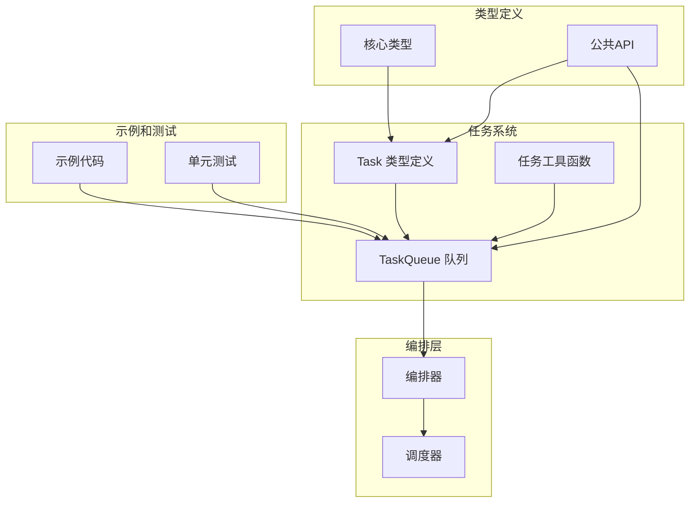

**图表来源**
- [src/task/task.ts:1-240](file://src/task/task.ts#L1-L240)
- [src/task/queue.ts:1-465](file://src/task/queue.ts#L1-L465)
- [src/orchestrator/orchestrator.ts:1-200](file://src/orchestrator/orchestrator.ts#L1-L200)

**章节来源**
- [src/task/task.ts:1-240](file://src/task/task.ts#L1-L240)
- [src/task/queue.ts:1-465](file://src/task/queue.ts#L1-L465)
- [src/orchestrator/orchestrator.ts:1-200](file://src/orchestrator/orchestrator.ts#L1-L200)

## 核心组件

### 任务数据结构

任务系统的核心是 `Task` 接口，它定义了任务的所有属性和状态：

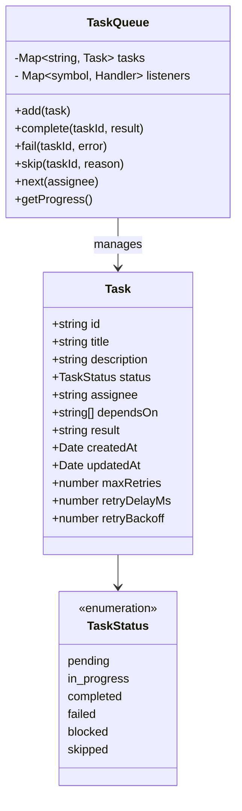

**图表来源**
- [src/types.ts:339-358](file://src/types.ts#L339-L358)
- [src/task/queue.ts:55-465](file://src/task/queue.ts#L55-L465)

### 任务工厂模式

系统使用工厂函数创建任务，确保每个任务都有唯一的标识符和正确的初始状态：

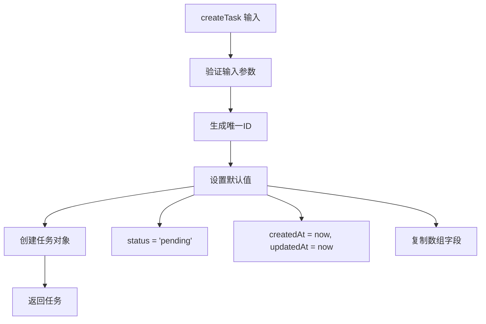

**图表来源**
- [src/task/task.ts:29-53](file://src/task/task.ts#L29-L53)

**章节来源**
- [src/types.ts:339-358](file://src/types.ts#L339-L358)
- [src/task/task.ts:29-53](file://src/task/task.ts#L29-L53)

## 架构概览

任务管理系统采用分层架构，从底层的数据结构到顶层的编排器：

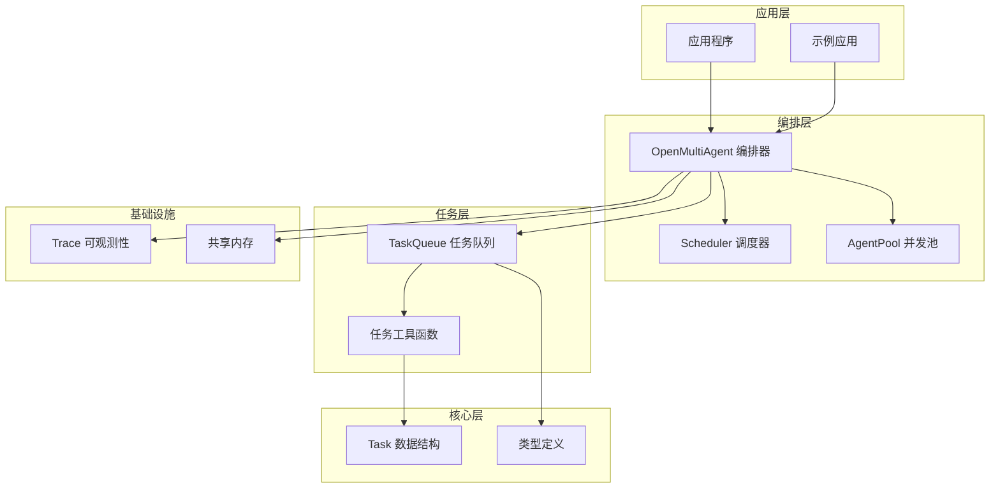

**图表来源**
- [src/index.ts:57-85](file://src/index.ts#L57-L85)
- [src/orchestrator/orchestrator.ts:44-66](file://src/orchestrator/orchestrator.ts#L44-L66)

## 详细组件分析

### TaskQueue 组件

TaskQueue 是任务管理系统的核心，负责维护所有任务的状态和生命周期：

#### 状态转换机制

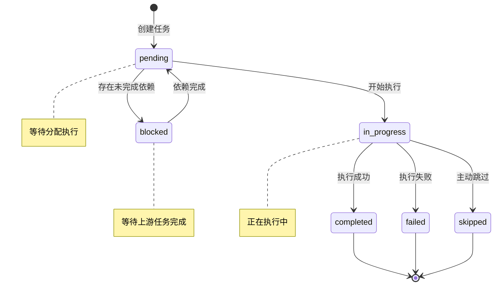

**图表来源**
- [src/task/queue.ts:131-178](file://src/task/queue.ts#L131-L178)
- [src/types.ts:336-337](file://src/types.ts#L336-L337)

#### 依赖解析算法

TaskQueue 使用拓扑排序来解析任务依赖关系：

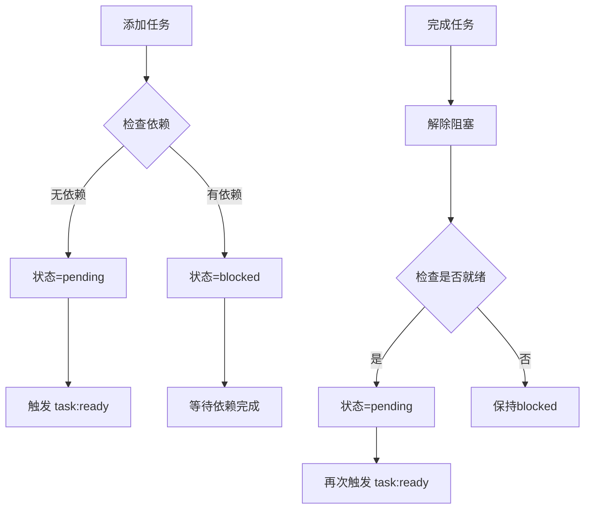

**图表来源**
- [src/task/queue.ts:402-441](file://src/task/queue.ts#L402-L441)

#### 事件系统

TaskQueue 实现了完整的事件驱动架构：

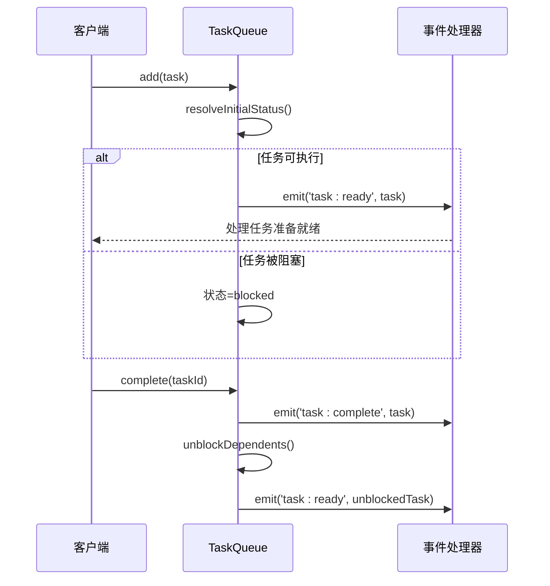

**图表来源**
- [src/task/queue.ts:74-80](file://src/task/queue.ts#L74-L80)
- [src/task/queue.ts:131-139](file://src/task/queue.ts#L131-L139)

**章节来源**
- [src/task/queue.ts:55-465](file://src/task/queue.ts#L55-L465)

### 任务工具函数

任务工具模块提供了纯函数式的任务操作，不修改任何状态：

#### 就绪状态检查

`isTaskReady` 函数实现了高效的依赖检查：

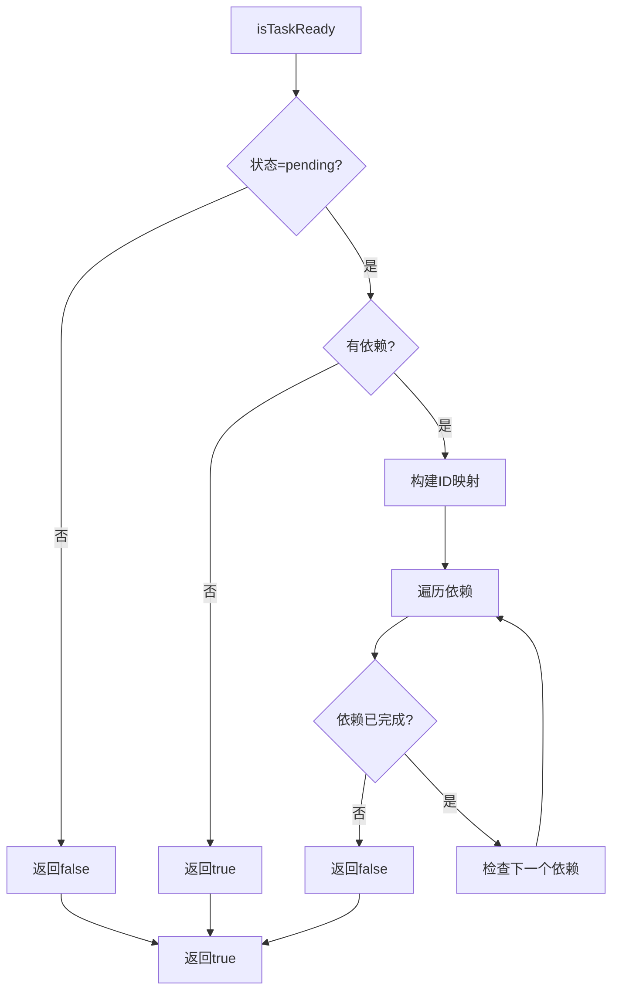

**图表来源**
- [src/task/task.ts:76-92](file://src/task/task.ts#L76-L92)

#### 拓扑排序实现

`getTaskDependencyOrder` 使用 Kahn 算法进行拓扑排序：

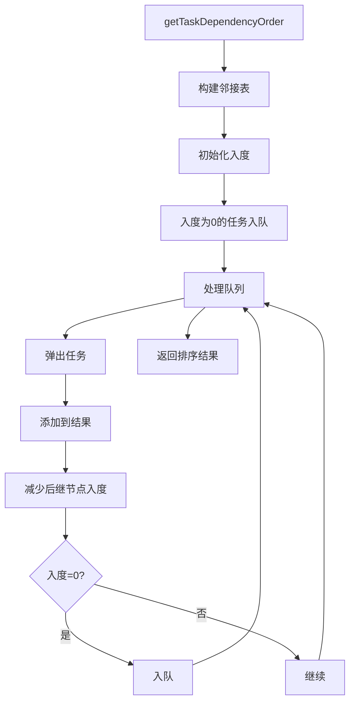

**图表来源**
- [src/task/task.ts:115-160](file://src/task/task.ts#L115-L160)

**章节来源**
- [src/task/task.ts:59-240](file://src/task/task.ts#L59-L240)

### 重试机制实现

系统提供了强大的重试机制，支持指数退避和自适应延迟：

#### 重试配置和计算

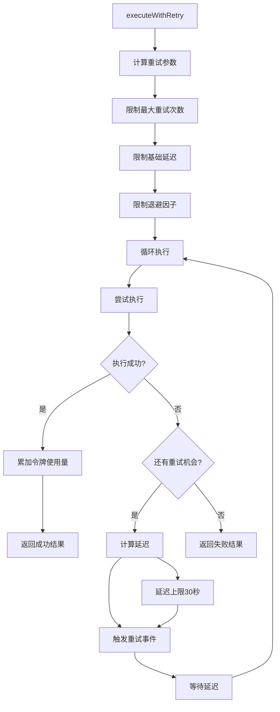

**图表来源**
- [src/orchestrator/orchestrator.ts:127-194](file://src/orchestrator/orchestrator.ts#L127-L194)

#### 重试事件处理

重试机制通过事件系统提供实时反馈：

**章节来源**
- [src/orchestrator/orchestrator.ts:108-194](file://src/orchestrator/orchestrator.ts#L108-L194)
- [tests/task-retry.test.ts:1-369](file://tests/task-retry.test.ts#L1-L369)

### 调度策略

调度器提供了四种不同的任务分配策略：

#### 关键路径优先策略

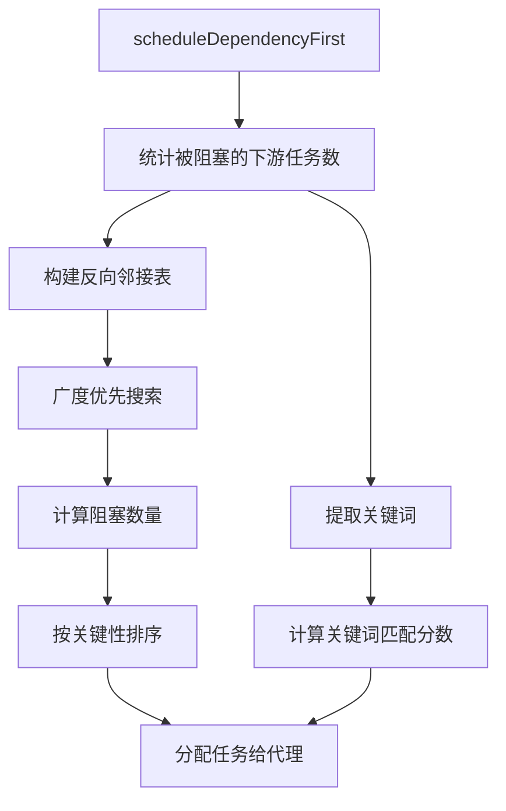

**图表来源**
- [src/orchestrator/scheduler.ts:50-75](file://src/orchestrator/scheduler.ts#L50-L75)
- [src/orchestrator/scheduler.ts:171-172](file://src/orchestrator/scheduler.ts#L171-L172)

**章节来源**
- [src/orchestrator/scheduler.ts:1-200](file://src/orchestrator/scheduler.ts#L1-L200)

## 依赖分析

任务管理系统与其他组件的依赖关系：

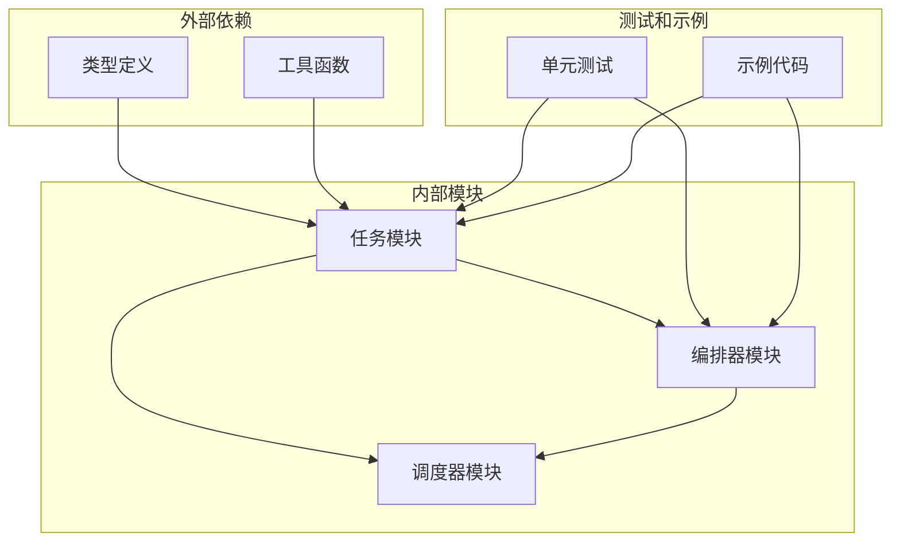

**图表来源**
- [src/index.ts:57-85](file://src/index.ts#L57-L85)
- [src/task/queue.ts:9-10](file://src/task/queue.ts#L9-L10)

**章节来源**
- [src/index.ts:57-85](file://src/index.ts#L57-L85)
- [src/task/queue.ts:9-10](file://src/task/queue.ts#L9-L10)

## 性能考虑

### 时间复杂度优化

1. **依赖检查优化**：`isTaskReady` 函数通过预构建映射避免重复查找
2. **拓扑排序效率**：使用入度计数和队列实现 O(V+E) 复杂度
3. **批量操作优化**：`addBatch` 方法支持批量添加任务

### 内存管理

1. **状态映射**：使用 Map 结构存储任务状态，提供 O(1) 查找
2. **事件监听器**：使用符号作为键，避免内存泄漏
3. **快照机制**：在批量操作时创建任务快照，避免迭代时修改

### 并发控制

1. **任务隔离**：纯函数式工具函数确保线程安全
2. **事件驱动**：异步事件处理避免阻塞主流程
3. **资源清理**：自动清理不再使用的监听器和临时数据

## 故障排除指南

### 常见问题诊断

#### 依赖循环检测

系统提供了完整的循环依赖检测机制：

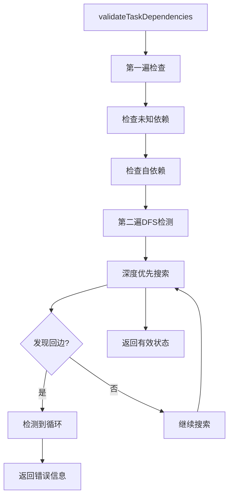

**图表来源**
- [src/task/task.ts:184-239](file://src/task/task.ts#L184-L239)

#### 重试失败处理

当重试机制无法解决问题时：

1. **检查重试配置**：确认 `maxRetries`、`retryDelayMs` 和 `retryBackoff` 设置
2. **监控重试事件**：通过 `onProgress` 回调观察重试过程
3. **分析错误原因**：查看最终失败的错误信息和上下文

**章节来源**
- [tests/task-queue.test.ts:1-245](file://tests/task-queue.test.ts#L1-L245)
- [tests/task-retry.test.ts:1-369](file://tests/task-retry.test.ts#L1-L369)

### 调试技巧

#### 任务状态监控

使用 `getProgress()` 方法获取实时进度：

```typescript
const progress = queue.getProgress();
console.log(`总任务: ${progress.total}`);
console.log(`已完成: ${progress.completed}`);
console.log(`失败: ${progress.failed}`);
console.log(`阻塞: ${progress.blocked}`);
```

#### 事件监听器

注册事件处理器来监控任务生命周期：

```typescript
queue.on('task:ready', (task) => {
  console.log(`任务就绪: ${task.title}`);
});

queue.on('task:complete', (task) => {
  console.log(`任务完成: ${task.title}`);
});
```

## 结论

Open Multi-Agent 框架的任务管理系统是一个设计精良的并发执行引擎，具有以下特点：

1. **模块化设计**：清晰的职责分离和接口定义
2. **高性能实现**：优化的时间和空间复杂度
3. **完整功能**：从基础任务管理到高级调度策略
4. **可观测性**：全面的事件系统和跟踪支持
5. **可扩展性**：灵活的插件架构和自定义选项

该系统特别适合复杂的多智能体协作场景，能够有效管理任务依赖、并发执行和错误恢复。

## 附录

### 最佳实践指南

#### 任务定义最佳实践

1. **明确的依赖关系**：使用 `dependsOn` 字段明确定义任务间的依赖
2. **合理的任务粒度**：将大任务分解为小而独立的任务
3. **清晰的描述**：提供详细的任务描述和预期输出

#### 重试策略建议

1. **指数退避**：使用 `retryBackoff > 1` 实现指数退避
2. **合理延迟**：设置合适的 `retryDelayMs` 初始延迟
3. **最大重试次数**：根据任务重要性设置 `maxRetries`

#### 调度策略选择

1. **简单流水线**：使用 `dependency-first` 策略
2. **负载均衡**：使用 `least-busy` 策略
3. **能力匹配**：使用 `capability-match` 策略

### API 参考

#### TaskQueue 方法

- `add(task)` - 添加单个任务
- `addBatch(tasks)` - 批量添加任务
- `complete(taskId, result?)` - 标记任务完成
- `fail(taskId, error)` - 标记任务失败
- `skip(taskId, reason)` - 标记任务跳过
- `next(assignee?)` - 获取下一个可执行任务
- `getProgress()` - 获取进度统计

#### 任务工具函数

- `createTask(input)` - 创建新任务
- `isTaskReady(task, allTasks, taskById?)` - 检查任务是否就绪
- `getTaskDependencyOrder(tasks)` - 获取依赖排序
- `validateTaskDependencies(tasks)` - 验证依赖关系