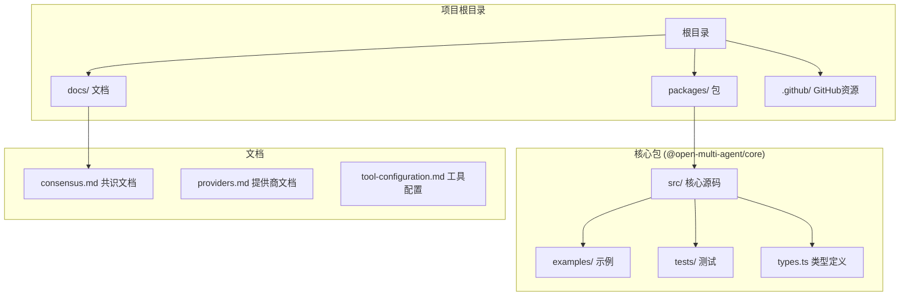
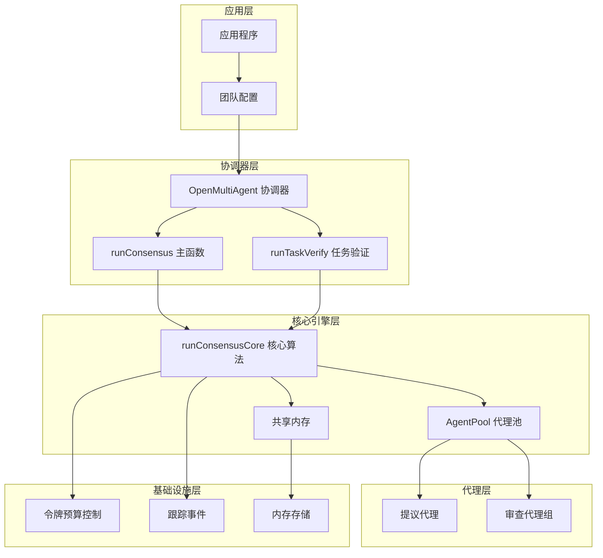
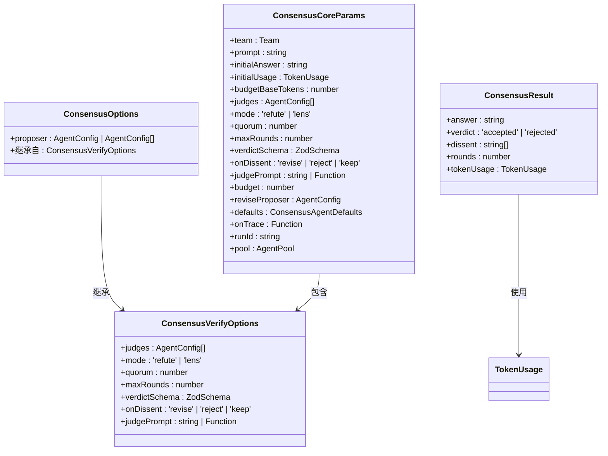
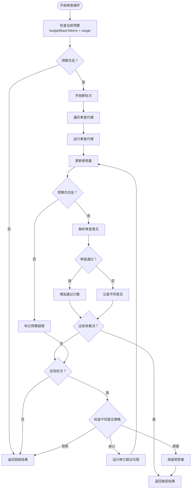
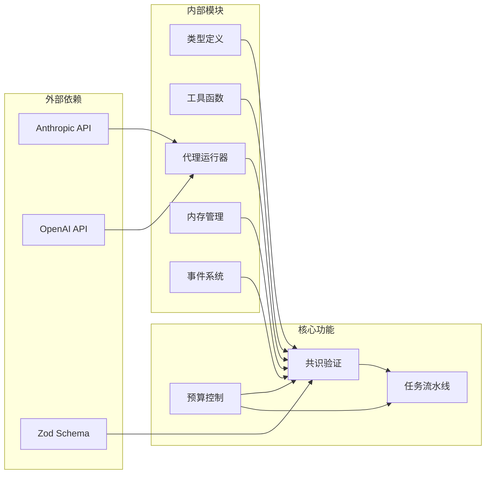

# 共识验证模式

<cite>
**本文档引用的文件**
- [README.md](file://README.md)
- [consensus.md](file://docs/consensus.md)
- [consensus.ts](file://packages/core/examples/patterns/consensus.ts)
- [orchestrator.ts](file://packages/core/src/orchestrator/orchestrator.ts)
- [types.ts](file://packages/core/src/types.ts)
- [package.json](file://package.json)
</cite>

## 目录
1. [简介](#简介)
2. [项目结构](#项目结构)
3. [核心组件](#核心组件)
4. [架构概览](#架构概览)
5. [详细组件分析](#详细组件分析)
6. [依赖关系分析](#依赖关系分析)
7. [性能考虑](#性能考虑)
8. [故障排除指南](#故障排除指南)
9. [结论](#结论)

## 简介

共识验证模式是 Open Multi-Agent 框架中的一项关键功能，它实现了 proposer→judge 验证循环。该模式允许系统在单个提示基础上添加一个验证层：提议代理（proposer）首先生成答案，然后由一组审查代理（judge）尝试反驳该答案，直到达到共识阈值。

这种设计提供了以下优势：
- **质量保证**：通过多代理审查机制确保输出质量
- **可审计性**：完整的审查过程记录在共享内存和跟踪事件中
- **预算控制**：严格的令牌使用限制防止过度消耗
- **灵活性**：支持不同的审查模式和配置选项

## 项目结构

Open Multi-Agent 是一个 Monorepo 结构，共识验证功能主要位于核心包中：



**图表来源**
- [package.json:1-28](file://package.json#L1-L28)
- [README.md:105-118](file://README.md#L105-L118)

**章节来源**
- [README.md:105-118](file://README.md#L105-L118)
- [package.json:1-28](file://package.json#L1-L28)

## 核心组件

共识验证模式包含以下核心组件：

### 1. 提议代理（Proposer）
负责生成初始答案的代理，可以是单个代理或 N-best 候选列表。

### 2. 审查代理（Judges）
一组验证代理，按顺序运行以评估提议的答案。支持两种模式：
- **反驳模式（refute）**：所有审查代理使用相同的怀疑框架
- **镜头模式（lens）**：每个审查代理获得不同的角度（正确性、完整性、边缘情况等）

### 3. 一致性算法（Consensus Algorithm）
实现审查循环的核心逻辑，包括：
- 轮次管理（maxRounds）
- 多数决计算（quorum）
- 不同意见处理策略（onDissent）
- 预算约束检查

**章节来源**
- [consensus.md:3-36](file://docs/consensus.md#L3-L36)
- [types.ts:884-917](file://packages/core/src/types.ts#L884-L917)

## 架构概览

共识验证模式采用分层架构设计，确保模块间的清晰分离：



**图表来源**
- [orchestrator.ts:1299-1324](file://packages/core/src/orchestrator/orchestrator.ts#L1299-L1324)
- [orchestrator.ts:1331-1417](file://packages/core/src/orchestrator/orchestrator.ts#L1331-L1417)

## 详细组件分析

### 运行时流程分析

共识验证的核心执行流程如下：

```mermaid
sequenceDiagram
participant App as 应用程序
participant Orchestrator as 协调器
participant Core as 核心算法
participant Pool as 代理池
participant Judge as 审查代理
participant Memory as 共享内存
App->>Orchestrator : runConsensus(team, prompt, options)
Orchestrator->>Core : runConsensusCore(params)
Core->>Pool : 创建代理池
Core->>Pool : 运行提议代理
Pool-->>Core : 初始答案
Core->>Core : 检查预算限制
loop 多轮审查
Core->>Judge : 运行审查代理
Judge-->>Core : 审查结果
Core->>Core : 解析审查意见
Core->>Memory : 记录不同意见
alt 达到多数决
Core->>Core : 设置接受状态
break
else 未达到多数决
Core->>Core : 检查是否还有轮次
alt 有剩余轮次且策略为修订
Core->>Pool : 运行修订提议代理
Pool-->>Core : 新答案
Core->>Core : 更新预算
end
end
end
Core-->>Orchestrator : 返回最终结果
Orchestrator-->>App : 最终答案和统计信息
```

**图表来源**
- [orchestrator.ts:1331-1417](file://packages/core/src/orchestrator/orchestrator.ts#L1331-L1417)
- [consensus.ts:88-148](file://packages/core/examples/patterns/consensus.ts#L88-L148)

### 数据结构设计

共识验证模式使用以下核心数据结构：



**图表来源**
- [types.ts:884-917](file://packages/core/src/types.ts#L884-L917)
- [orchestrator.ts:1299-1324](file://packages/core/src/orchestrator/orchestrator.ts#L1299-L1324)

### 预算约束机制

共识验证实现了严格的预算控制机制：



**图表来源**
- [orchestrator.ts:1346-1416](file://packages/core/src/orchestrator/orchestrator.ts#L1346-L1416)
- [consensus.md:57-63](file://docs/consensus.md#L57-L63)

**章节来源**
- [orchestrator.ts:1331-1417](file://packages/core/src/orchestrator/orchestrator.ts#L1331-L1417)
- [types.ts:884-917](file://packages/core/src/types.ts#L884-L917)
- [consensus.md:57-63](file://docs/consensus.md#L57-L63)

## 依赖关系分析

共识验证模式的依赖关系体现了清晰的分层架构：



**图表来源**
- [orchestrator.ts:1427-1500](file://packages/core/src/orchestrator/orchestrator.ts#L1427-L1500)
- [types.ts:874-917](file://packages/core/src/types.ts#L874-L917)

**章节来源**
- [orchestrator.ts:1427-1500](file://packages/core/src/orchestrator/orchestrator.ts#L1427-L1500)
- [types.ts:874-917](file://packages/core/src/types.ts#L874-L917)

## 性能考虑

共识验证模式在设计时充分考虑了性能优化：

### 1. 并发控制
- 使用代理池限制并发数量
- 审查代理按顺序运行，避免竞争条件
- 支持最大并发度配置

### 2. 内存优化
- 只保存必要的审查结果
- 异步写入共享内存
- 及时清理临时数据

### 3. 网络效率
- 合理的轮次限制
- 预算检查减少不必要的调用
- 批量处理审查请求

## 故障排除指南

### 常见问题及解决方案

| 问题类型 | 症状 | 可能原因 | 解决方案 |
|---------|------|----------|----------|
| 预算超限 | 审查提前结束 | 令牌使用超出限制 | 增加预算或减少轮次 |
| 审查失败 | 持续拒绝答案 | 审查标准过高 | 调整多数决阈值或审查代理 |
| 性能问题 | 审查响应缓慢 | 并发度过高 | 降低并发度或优化代理配置 |
| 配置错误 | 运行时异常 | 参数设置不当 | 检查 ConsensusOptions 配置 |

### 调试技巧

1. **启用跟踪事件**：使用 `onTrace` 监控审查过程
2. **检查共享内存**：查看审查代理的输出和不同意见
3. **监控令牌使用**：跟踪预算消耗情况
4. **验证代理配置**：确保审查代理的系统提示正确

**章节来源**
- [consensus.md:61-63](file://docs/consensus.md#L61-L63)
- [orchestrator.ts:1373-1386](file://packages/core/src/orchestrator/orchestrator.ts#L1373-L1386)

## 结论

共识验证模式为 Open Multi-Agent 框架提供了强大的质量保证机制。通过提议-审查循环，系统能够在保持高性能的同时确保输出的准确性和可靠性。

### 主要优势
- **可扩展性**：支持多个审查代理和灵活的配置选项
- **可观测性**：完整的审查过程记录便于审计和调试
- **安全性**：严格的预算控制防止资源滥用
- **易用性**：简洁的 API 设计降低了使用复杂度

### 应用场景
- 代码审查和质量保证
- 技术决策的多视角评估
- 金融交易的风险评估
- 医疗诊断的第二意见

该模式的成功实施展示了现代多智能体系统在平衡性能、可靠性和可用性方面的最佳实践。