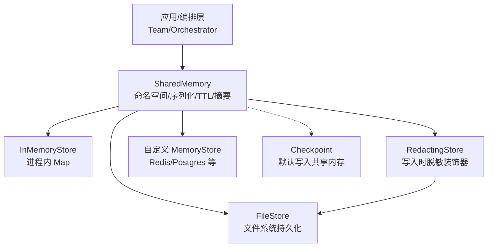
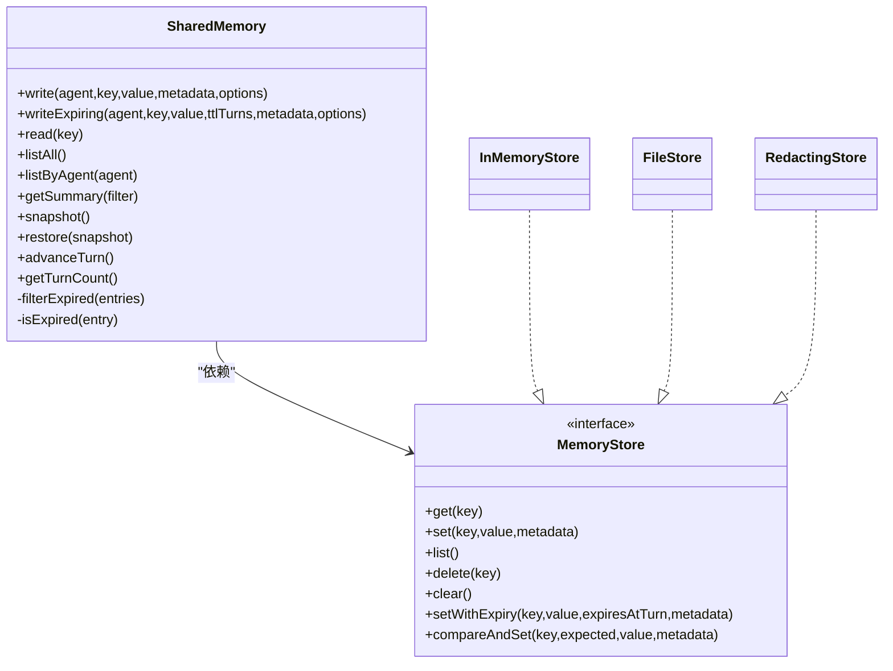
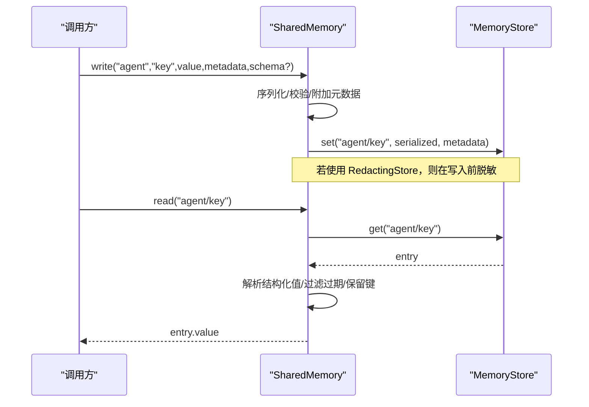
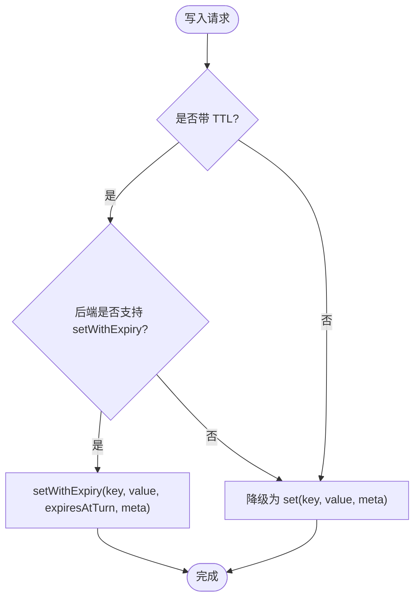
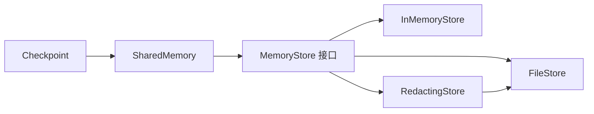

# 内存管理机制

<cite>
**本文引用的文件**
- [shared-memory.md](file://docs/shared-memory.md)
- [shared.ts](file://packages/core/src/memory/shared.ts)
- [store.ts](file://packages/core/src/memory/store.ts)
- [redacting-store.ts](file://packages/core/src/memory/redacting-store.ts)
- [file-store.ts](file://packages/core/src/memory/file-store.ts)
- [checkpoint.ts](file://packages/core/src/memory/checkpoint.ts)
- [durable.ts](file://packages/core/src/approval/durable.ts)
- [types.ts](file://packages/core/src/types.ts)
- [shared-memory.test.ts](file://packages/core/tests/shared-memory.test.ts)
</cite>

## 目录
1. [简介](#简介)
2. [项目结构](#项目结构)
3. [核心组件](#核心组件)
4. [架构总览](#架构总览)
5. [详细组件分析](#详细组件分析)
6. [依赖关系分析](#依赖关系分析)
7. [性能考量](#性能考量)
8. [故障排查指南](#故障排查指南)
9. [结论](#结论)
10. [附录：使用示例与最佳实践](#附录使用示例与最佳实践)

## 简介
本文件系统性阐述 Open Multi-Agent 的内存管理机制，重点覆盖共享内存（SharedMemory）的设计原理、存储后端接口（MemoryStore）的实现方式（内存与文件）、数据序列化与持久化恢复、并发访问控制与一致性保证、冲突解决策略，并提供智能体间通信的使用示例与性能优化建议。内容兼顾初学者理解与高级用户深入实现细节。

## 项目结构
Open Multi-Agent 将共享内存能力集中在 core 包的 memory 子系统中，并通过 Team/Orchestrator 暴露给上层编排。关键文件职责如下：
- shared.ts：共享内存抽象层 SharedMemory，负责命名空间隔离、结构化值编解码、TTL 过期、摘要生成、快照与恢复等。
- store.ts：默认内存存储 InMemoryStore，提供 get/set/list/delete/clear 以及可选的 setWithExpiry、compareAndSet。
- redacting-store.ts：可插拔的敏感信息脱敏装饰器 RedactingStore，在写入时统一清洗密钥/PII。
- file-store.ts：基于文件系统的 MemoryStore 实现，用于持久化共享内存与检查点。
- checkpoint.ts：检查点机制，默认使用团队共享内存存储进行持久化与恢复。
- durable.ts：审批记录键前缀等持久化约定，供 SharedMemory 过滤保留。
- types.ts：MemoryStore/MemoryEntry/SharedMemoryValue 等类型定义。
- docs/shared-memory.md：面向用户的共享内存启用与配置说明。
- tests/shared-memory.test.ts：覆盖命名空间、结构化值、TTL、摘要、注入自定义 Store 等行为。

图表来源
- [shared.ts:68-130](file://packages/core/src/memory/shared.ts#L68-L130)
- [store.ts:31-122](file://packages/core/src/memory/store.ts#L31-L122)
- [redacting-store.ts:48-95](file://packages/core/src/memory/redacting-store.ts#L48-L95)
- [file-store.ts:1-200](file://packages/core/src/memory/file-store.ts#L1-L200)
- [checkpoint.ts:1-200](file://packages/core/src/memory/checkpoint.ts#L1-L200)

章节来源
- [shared-memory.md:1-47](file://docs/shared-memory.md#L1-L47)
- [shared.ts:1-531](file://packages/core/src/memory/shared.ts#L1-L531)
- [store.ts:1-167](file://packages/core/src/memory/store.ts#L1-L167)
- [redacting-store.ts:1-129](file://packages/core/src/memory/redacting-store.ts#L1-L129)
- [file-store.ts:1-200](file://packages/core/src/memory/file-store.ts#L1-L200)
- [checkpoint.ts:1-200](file://packages/core/src/memory/checkpoint.ts#L1-L200)

## 核心组件
- SharedMemory：为多智能体团队提供命名空间化的共享 KV 存储；支持结构化值读写、Zod 校验、按“回合”TTL 过期、只读摘要、快照/恢复、保留系统键（检查点/审批）。
- MemoryStore：存储后端最小接口，要求 get/set/list/delete/clear；可选 setWithExpiry 以支持 TTL；可选 compareAndSet 用于原子更新。
- InMemoryStore：进程内 Map 实现，适合测试与单进程场景。
- FileStore：零依赖的文件系统 MemoryStore，支持原子写入，用于跨进程/持久化。
- RedactingStore：写入时敏感信息脱敏装饰器，对 JSON 容器结构感知，避免破坏数据结构。

章节来源
- [shared.ts:68-130](file://packages/core/src/memory/shared.ts#L68-L130)
- [store.ts:31-122](file://packages/core/src/memory/store.ts#L31-L122)
- [redacting-store.ts:48-109](file://packages/core/src/memory/redacting-store.ts#L48-L109)

## 架构总览
SharedMemory 作为统一入口，屏蔽底层存储差异，对外暴露简洁 API；通过组合/装饰模式接入不同存储后端，并在写入路径集中处理序列化、校验、脱敏与 TTL 元数据。

图表来源
- [shared.ts:68-130](file://packages/core/src/memory/shared.ts#L68-L130)
- [store.ts:31-122](file://packages/core/src/memory/store.ts#L31-L122)
- [redacting-store.ts:48-95](file://packages/core/src/memory/redacting-store.ts#L48-L95)

## 详细组件分析

### SharedMemory：命名空间、序列化、TTL、摘要与快照
- 命名空间隔离：所有写操作自动将 key 转换为 agentName/key，确保不同智能体的数据互不干扰且可溯源。
- 结构化值与兼容：写入时将对象/数组序列化为 JSON，并附带编码标记；读取时根据标记还原为结构化值，同时保持对历史纯字符串值的兼容。
- 可选 Zod 校验：write 支持传入 schema，失败则抛出错误且不落盘。
- TTL 过期：writeExpiring 以“回合数”为单位设置 expiresAtTurn；读取/列表/摘要会过滤已过期项，但不会删除底层数据，避免分布式环境下的竞态删除。
- 摘要输出：按智能体分组生成 Markdown 风格摘要，便于注入上下文窗口；支持按任务 ID 过滤。
- 快照与恢复：snapshot 返回非过期条目与 turnCount；fromSnapshot/restore 支持重建实例，并保留系统保留键（如检查点/审批）。
- 保留键过滤：内部维护 __oma_checkpoint__/ 与审批键前缀，这些键对智能体不可见，也不参与摘要。

图表来源
- [shared.ts:204-269](file://packages/core/src/memory/shared.ts#L204-L269)
- [shared.ts:285-311](file://packages/core/src/memory/shared.ts#L285-L311)
- [redacting-store.ts:81-83](file://packages/core/src/memory/redacting-store.ts#L81-L83)

章节来源
- [shared.ts:68-531](file://packages/core/src/memory/shared.ts#L68-L531)
- [shared-memory.test.ts:11-23](file://packages/core/tests/shared-memory.test.ts#L11-L23)
- [shared-memory.test.ts:146-165](file://packages/core/tests/shared-memory.test.ts#L146-L165)
- [shared-memory.test.ts:424-516](file://packages/core/tests/shared-memory.test.ts#L424-L516)

### MemoryStore 接口与实现
- 接口契约：get/set/list/delete/clear 为必需；setWithExpiry 与 compareAndSet 为可选扩展。
- InMemoryStore：进程内 Map 实现，保存 createdAt，支持 setWithExpiry 与 compareAndSet，适合测试与单进程。
- FileStore：基于文件系统的实现，提供原子写入，适合跨进程与持久化需求。
- RedactingStore：装饰器，仅对写入路径生效，透传 get/list/delete/clear，并选择性转发 setWithExpiry。

图表来源
- [shared.ts:245-269](file://packages/core/src/memory/shared.ts#L245-L269)
- [store.ts:89-104](file://packages/core/src/memory/store.ts#L89-L104)
- [redacting-store.ts:70-74](file://packages/core/src/memory/redacting-store.ts#L70-L74)

章节来源
- [store.ts:31-167](file://packages/core/src/memory/store.ts#L31-L167)
- [redacting-store.ts:48-109](file://packages/core/src/memory/redacting-store.ts#L48-L109)

### 数据序列化、持久化与恢复
- 序列化：结构化值以 JSON 字符串存储，并附带编码标记；读取时根据标记还原；纯字符串保持原样，兼容历史数据。
- 持久化：默认使用 InMemoryStore；生产可通过 FileStore 或自定义 Redis/Postgres 实现 MemoryStore。
- 恢复：SharedMemory.snapshot 捕获非过期条目与 turnCount；restore/fromSnapshot 重建实例，保留系统保留键，确保检查点与共享内存共存于同一后端。

章节来源
- [shared.ts:418-463](file://packages/core/src/memory/shared.ts#L418-L463)
- [shared.ts:136-186](file://packages/core/src/memory/shared.ts#L136-L186)
- [checkpoint.ts:1-200](file://packages/core/src/memory/checkpoint.ts#L1-L200)

### 并发访问控制、一致性与冲突解决
- 并发安全：SharedMemory 在读/列/摘要时对过期条目仅做过滤，不删除底层数据，避免分布式环境下与并发写入的竞态。
- 一致性：InMemoryStore 的 compareAndSet 可用于需要 CAS 语义的场景；文件/分布式后端需自行保证原子性（FileStore 提供原子写入）。
- 冲突策略：键级唯一（命名空间+逻辑键），后写覆盖；TTL 由 turnCount 驱动，过期即不可见但不删除。
- 保留键：__oma_checkpoint__/ 与审批键前缀对智能体不可见，防止污染共享视图。

章节来源
- [shared.ts:513-529](file://packages/core/src/memory/shared.ts#L513-L529)
- [store.ts:64-80](file://packages/core/src/memory/store.ts#L64-L80)
- [shared.ts:29-30](file://packages/core/src/memory/shared.ts#L29-L30)
- [durable.ts:1-200](file://packages/core/src/approval/durable.ts#L1-L200)

### 使用场景与智能体间通信示例
- 启用共享内存：在 Team 中开启 sharedMemory 或使用 sharedMemoryStore 注入自定义后端。
- 智能体协作：研究智能体写入 findings，写作智能体读取并汇总；或通过 task:key:result 约定传递任务结果。
- 安全写入：使用 RedactingStore 包裹 FileStore，避免密钥/PII 落入磁盘。

章节来源
- [shared-memory.md:1-47](file://docs/shared-memory.md#L1-L47)
- [shared-memory.test.ts:280-326](file://packages/core/tests/shared-memory.test.ts#L280-L326)

## 依赖关系分析
- SharedMemory 依赖 MemoryStore 抽象，解耦具体存储实现。
- RedactingStore 装饰任意 MemoryStore，仅在写入路径生效。
- FileStore 提供持久化能力，可与 RedactingStore 组合形成安全持久化链路。
- Checkpoint 默认写入团队共享内存，受 SharedMemory 的保留键与 TTL 规则影响。

图表来源
- [shared.ts:68-130](file://packages/core/src/memory/shared.ts#L68-L130)
- [store.ts:31-122](file://packages/core/src/memory/store.ts#L31-L122)
- [redacting-store.ts:48-95](file://packages/core/src/memory/redacting-store.ts#L48-L95)
- [file-store.ts:1-200](file://packages/core/src/memory/file-store.ts#L1-L200)
- [checkpoint.ts:1-200](file://packages/core/src/memory/checkpoint.ts#L1-L200)

章节来源
- [shared.ts:68-130](file://packages/core/src/memory/shared.ts#L68-L130)
- [store.ts:31-122](file://packages/core/src/memory/store.ts#L31-L122)
- [redacting-store.ts:48-95](file://packages/core/src/memory/redacting-store.ts#L48-L95)
- [file-store.ts:1-200](file://packages/core/src/memory/file-store.ts#L1-L200)
- [checkpoint.ts:1-200](file://packages/core/src/memory/checkpoint.ts#L1-L200)

## 性能考量
- 选择合适后端：
  - 单进程/测试：InMemoryStore，零开销。
  - 跨进程/持久化：FileStore 或 Redis/Postgres 等分布式后端。
- 结构化值：JSON 编解码有成本，尽量复用对象结构，避免超大 payload。
- TTL 与扫描：listAll/getSummary 会遍历并过滤过期项，数据量大时应结合 listByAgent 或任务维度过滤。
- 脱敏开销：RedactingStore 在写入时解析 JSON 容器并替换敏感字段，建议在仅需持久化时启用。
- 原子性：需要 CAS 时使用 compareAndSet；分布式后端需自行实现。

[本节为通用指导，无需特定文件引用]

## 故障排查指南
- 无法读取到预期键：
  - 确认键格式为 agent/key；检查是否被保留键前缀拦截。
  - 检查是否设置了 TTL 且当前 turnCount 已超过 expiresAtTurn。
- 结构化值异常：
  - 确认写入值可 JSON 序列化；Zod 校验失败会阻止落盘。
- 脱敏导致下游无法读取密钥：
  - 这是设计行为；如需保留原文，请绕过 RedactingStore 或在审批/检查点专用存储中保留原文。
- 自定义 Store 未生效：
  - 确保实现 MemoryStore 全部必需方法；SharedMemory 会在构造时进行运行时形状检查。

章节来源
- [shared.ts:285-311](file://packages/core/src/memory/shared.ts#L285-L311)
- [shared.ts:418-463](file://packages/core/src/memory/shared.ts#L418-L463)
- [redacting-store.ts:97-109](file://packages/core/src/memory/redacting-store.ts#L97-L109)
- [shared-memory.test.ts:365-410](file://packages/core/tests/shared-memory.test.ts#L365-L410)

## 结论
SharedMemory 以命名空间隔离、结构化值、TTL 与摘要为核心能力，配合 MemoryStore 抽象实现了灵活的后端切换与可扩展的存储生态。通过 RedactingStore 可在写入侧统一脱敏，保障数据安全。结合 Checkpoint 的默认共享内存持久化，系统在可靠性、可观测性与安全性之间取得平衡。生产环境中应根据并发、持久化与安全需求选择合适的后端与策略。

[本节为总结，无需特定文件引用]

## 附录：使用示例与最佳实践
- 启用共享内存：
  - 在 Team 配置中设置 sharedMemory: true 或注入 sharedMemoryStore。
- 智能体间通信：
  - 研究智能体写入 findings；写作智能体读取并按任务 ID 聚合结果。
- 安全持久化：
  - 使用 RedactingStore 包裹 FileStore，避免密钥/PII 落盘。
- 性能优化：
  - 大对象分片写入；合理使用 listByAgent 与任务过滤；必要时引入索引或外部缓存。
- 一致性策略：
  - 需要 CAS 时使用 compareAndSet；分布式后端需实现幂等与重试。

章节来源
- [shared-memory.md:1-47](file://docs/shared-memory.md#L1-L47)
- [shared-memory.test.ts:280-326](file://packages/core/tests/shared-memory.test.ts#L280-L326)
- [shared-memory.test.ts:424-516](file://packages/core/tests/shared-memory.test.ts#L424-L516)