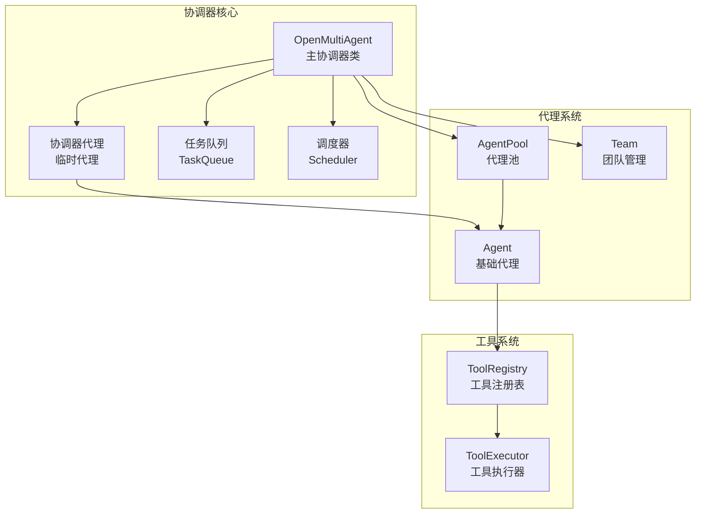
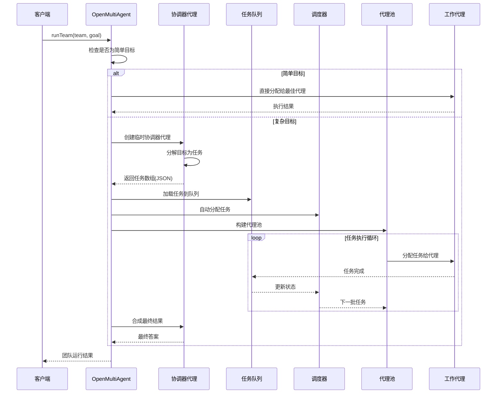
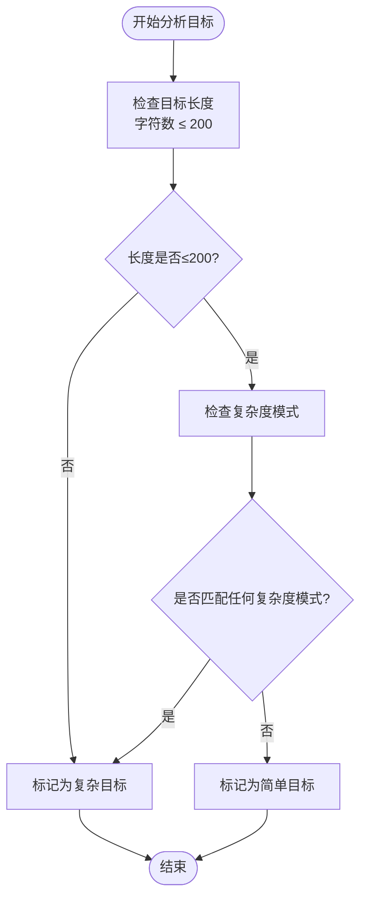
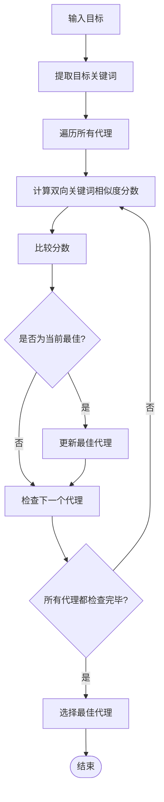
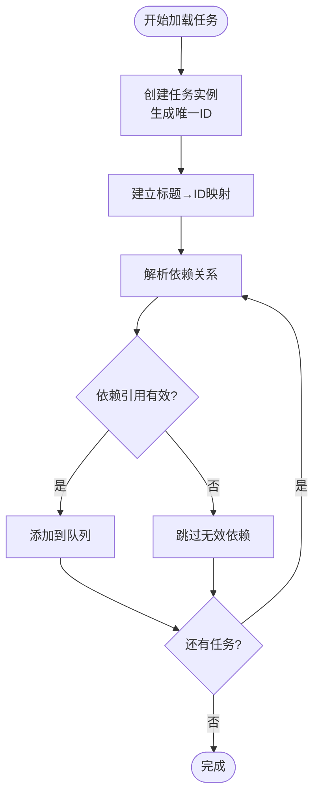
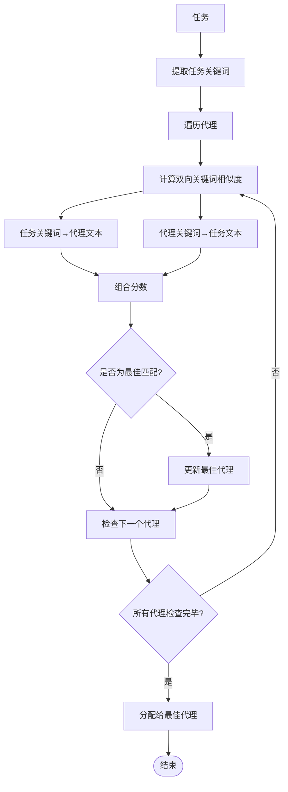
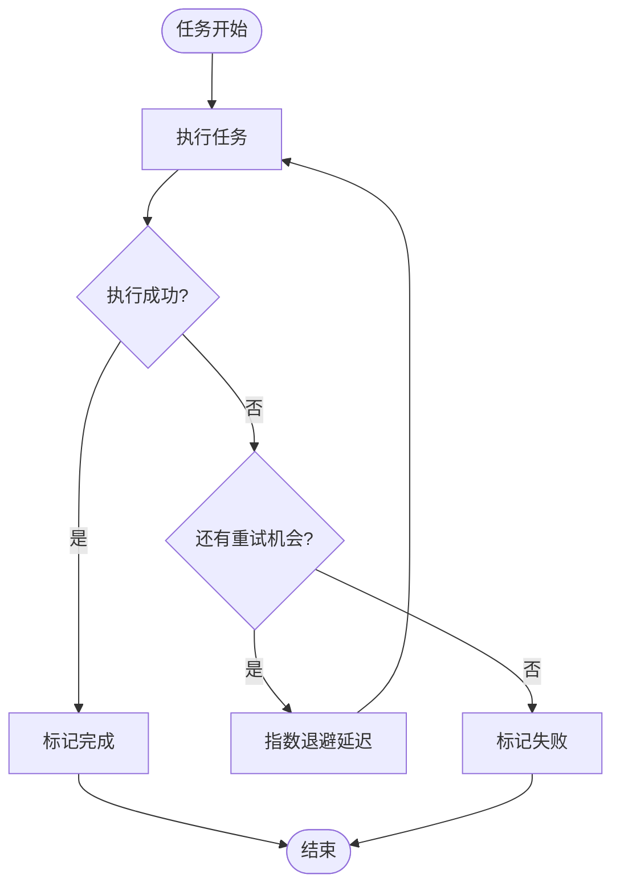
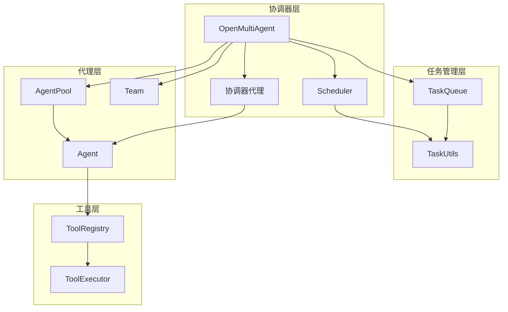

# 协调器模式

<cite>
**本文档引用的文件**
- [orchestrator.ts](file://src/orchestrator/orchestrator.ts)
- [scheduler.ts](file://src/orchestrator/scheduler.ts)
- [queue.ts](file://src/task/queue.ts)
- [task.ts](file://src/task/task.ts)
- [team-collaboration.ts](file://examples/basics/team-collaboration.ts)
- [orchestrator.test.ts](file://tests/orchestrator.test.ts)
- [short-circuit.test.ts](file://tests/short-circuit.test.ts)
</cite>

## 目录
1. [简介](#简介)
2. [项目结构](#项目结构)
3. [核心组件](#核心组件)
4. [架构概览](#架构概览)
5. [详细组件分析](#详细组件分析)
6. [依赖关系分析](#依赖关系分析)
7. [性能考虑](#性能考虑)
8. [故障排除指南](#故障排除指南)
9. [结论](#结论)

## 简介

协调器模式是 OpenMultiAgent 框架的核心设计模式，它通过一个临时的"协调器代理"将高层次的目标分解为可执行的任务。这个模式的关键价值在于：

- **自动任务分解**：协调器代理能够理解复杂的多步骤目标，并将其分解为具体的、可执行的任务
- **智能任务分配**：根据任务特性和代理能力进行最优分配
- **并行执行优化**：识别独立任务并行执行，提高整体效率
- **依赖管理**：自动处理任务间的依赖关系，确保正确的执行顺序

协调器模式的核心思想是"先分解，后执行"——协调器负责规划和分解，而具体的工作由专门的代理完成。

## 项目结构

OpenMultiAgent 的协调器模式实现主要分布在以下模块中：



**图表来源**
- [orchestrator.ts:1040-1374](file://src/orchestrator/orchestrator.ts#L1040-L1374)
- [scheduler.ts:96-322](file://src/orchestrator/scheduler.ts#L96-L322)

**章节来源**
- [orchestrator.ts:1-800](file://src/orchestrator/orchestrator.ts#L1-L800)
- [scheduler.ts:1-322](file://src/orchestrator/scheduler.ts#L1-L322)

## 核心组件

### OpenMultiAgent 主协调器

OpenMultiAgent 是协调器模式的主要实现者，它提供了完整的多代理协调功能：

- **runTeam 方法**：执行团队级的自动协调运行
- **runTasks 方法**：执行显式提供的任务列表
- **createTeam 方法**：创建和管理团队
- **状态管理**：跟踪团队状态和完成的任务数量

### 协调器代理（临时）

协调器代理是一个特殊的临时代理，具有以下特性：

- **一次性使用**：仅在分解阶段使用，不参与后续执行
- **专门职责**：负责将高层次目标分解为具体任务
- **JSON 输出格式**：严格遵循预定义的 JSON 结构
- **合成能力**：在所有任务完成后合成最终结果

### 任务队列系统

任务队列负责管理任务的生命周期和依赖关系：

- **依赖解析**：自动解析任务间的依赖关系
- **状态管理**：跟踪任务的 pending、blocked、in_progress、completed、failed 状态
- **事件驱动**：通过事件系统通知状态变化
- **拓扑排序**：确保任务按正确的顺序执行

### 调度器系统

调度器提供多种任务分配策略：

- **round-robin**：轮询分配，确保公平性
- **least-busy**：优先分配给最空闲的代理
- **capability-match**：基于能力匹配的智能分配
- **dependency-first**：优先处理关键路径上的任务

**章节来源**
- [orchestrator.ts:900-1785](file://src/orchestrator/orchestrator.ts#L900-L1785)
- [scheduler.ts:96-322](file://src/orchestrator/scheduler.ts#L96-L322)

## 架构概览

协调器模式的整体架构如下：



**图表来源**
- [orchestrator.ts:1061-1374](file://src/orchestrator/orchestrator.ts#L1061-L1374)
- [orchestrator.ts:561-818](file://src/orchestrator/orchestrator.ts#L561-L818)

## 详细组件分析

### 目标复杂度分析与简单目标判断

协调器模式的核心在于能够区分简单目标和复杂目标：

#### 简单目标判断逻辑



**图表来源**
- [orchestrator.ts:147-150](file://src/orchestrator/orchestrator.ts#L147-L150)
- [orchestrator.ts:96-121](file://src/orchestrator/orchestrator.ts#L96-L121)

#### 复杂度模式识别

系统使用正则表达式识别以下复杂度信号：

1. **明确的序列化指令**：
   - "first ... then" 结构
   - "step N" 和 "phase N" 标记
   - 编号列表格式

2. **协作语言**：
   - "collaborate with/on/for" 指令
   - "coordinate the team/workers"
   - "review each other"
   - "work together"

3. **并行执行信号**：
   - "in parallel"
   - "concurrently"
   - "at the same time"

4. **多阶段产出**：
   - 包含多个动作动词的复合句
   - 使用连接词的多任务描述

#### 最佳代理选择算法

对于简单目标，系统使用关键词相似度算法选择最佳代理：



**图表来源**
- [orchestrator.ts:170-194](file://src/orchestrator/orchestrator.ts#L170-L194)
- [orchestrator.ts:173-185](file://src/orchestrator/orchestrator.ts#L173-L185)

**章节来源**
- [orchestrator.ts:147-194](file://src/orchestrator/orchestrator.ts#L147-L194)
- [orchestrator.ts:96-121](file://src/orchestrator/orchestrator.ts#L96-L121)

### 临时协调器代理工作机制

临时协调器代理是协调器模式的关键组件，具有以下工作机制：

#### 协调器系统提示构建

协调器代理接收精心构建的系统提示，包含：

1. **团队名单**：列出所有可用代理及其能力和模型
2. **输出格式要求**：严格的 JSON 数组格式规范
3. **依赖指导原则**：如何正确设置任务依赖关系
4. **合成指令**：如何整合各个任务的结果

#### 任务规范解析

协调器代理输出的 JSON 格式必须包含：

```json
{
  "title": "任务标题",
  "description": "任务详细描述",
  "assignee": "代理名称",
  "dependsOn": ["依赖任务标题或ID"]
}
```

系统提供两种解析策略：

1. **代码围栏解析**：从 ` ```json ... ``` ` 代码围栏中提取 JSON
2. **数组边界解析**：从任意位置提取第一个 `[` 到最后一个 `]` 的内容

#### 降级处理机制

当协调器无法产生结构化输出时，系统会自动降级：

- 为每个代理创建一个任务
- 将原始目标作为任务描述
- 继续正常的任务执行流程

**章节来源**
- [orchestrator.ts:1554-1575](file://src/orchestrator/orchestrator.ts#L1554-L1575)
- [orchestrator.ts:355-397](file://src/orchestrator/orchestrator.ts#L355-L397)
- [orchestrator.ts:1229-1240](file://src/orchestrator/orchestrator.ts#L1229-L1240)

### 任务解析与依赖分析

#### 任务加载流程



**图表来源**
- [orchestrator.ts:1651-1710](file://src/orchestrator/orchestrator.ts#L1651-L1710)
- [orchestrator.ts:1664-1709](file://src/orchestrator/orchestrator.ts#L1664-L1709)

#### 依赖图验证

系统提供完整的依赖图验证机制：

- **未知引用检查**：确保所有依赖任务都存在
- **循环检测**：防止任务间的循环依赖
- **自依赖检查**：避免任务依赖自身

#### 拓扑排序算法

使用 Kahn 算法进行拓扑排序，确保任务执行的正确顺序：

1. 计算每个任务的入度（依赖数量）
2. 将所有入度为 0 的任务加入队列
3. 重复处理队列中的任务，减少其后继任务的入度
4. 入度为 0 的任务加入结果序列

**章节来源**
- [orchestrator.ts:1651-1710](file://src/orchestrator/orchestrator.ts#L1651-L1710)
- [task.ts:117-162](file://src/task/task.ts#L117-L162)
- [task.ts:186-200](file://src/task/task.ts#L186-L200)

### 调度策略详解

#### round-robin 轮询策略

最简单的分配策略，确保每个代理都能获得任务：

- 维护一个全局游标
- 按顺序分配给不同代理
- 避免某些代理过载

#### least-busy 最少忙碌策略

基于代理当前负载的智能分配：

- 统计每个代理的进行中任务数量
- 优先分配给负载最少的代理
- 在同一轮次内避免重复分配给同一代理

#### capability-match 能力匹配策略

基于关键词相似度的智能分配：



**图表来源**
- [scheduler.ts:245-284](file://src/orchestrator/scheduler.ts#L245-L284)
- [scheduler.ts:266-278](file://src/orchestrator/scheduler.ts#L266-L278)

#### dependency-first 关键路径策略

优先处理对其他任务影响最大的任务：

- 计算每个任务的"下游影响"（被多少任务等待）
- 按影响程度降序排列
- 在同一影响层级内使用轮询策略

**章节来源**
- [scheduler.ts:96-322](file://src/orchestrator/scheduler.ts#L96-L322)

### 执行流程控制

#### 并发执行管理

系统支持最大并发度控制：

- **默认并发度**：5 个代理同时执行
- **代理池管理**：动态管理代理的生命周期
- **资源限制**：防止过度并发导致的资源耗尽

#### 错误处理与重试机制



**图表来源**
- [orchestrator.ts:266-333](file://src/orchestrator/orchestrator.ts#L266-L333)
- [orchestrator.ts:247-253](file://src/orchestrator/orchestrator.ts#L247-L253)

#### 预算控制与成本管理

系统提供多层次的成本控制：

- **令牌预算**：限制总令牌使用量
- **代理预算**：限制单个代理的令牌使用
- **超预算处理**：优雅地停止进一步执行

**章节来源**
- [orchestrator.ts:561-818](file://src/orchestrator/orchestrator.ts#L561-L818)
- [orchestrator.ts:266-333](file://src/orchestrator/orchestrator.ts#L266-L333)

## 依赖关系分析

协调器模式涉及多个模块之间的复杂依赖关系：



**图表来源**
- [orchestrator.ts:61-70](file://src/orchestrator/orchestrator.ts#L61-L70)
- [scheduler.ts:16-18](file://src/orchestrator/scheduler.ts#L16-L18)

### 模块耦合分析

- **高内聚低耦合**：每个模块职责明确，接口清晰
- **依赖方向**：协调器层依赖于任务管理和代理执行层
- **循环依赖避免**：通过接口抽象避免循环依赖

### 关键接口契约

1. **Agent 接口**：标准化代理行为
2. **Task 接口**：标准化任务表示
3. **Tool 接口**：标准化工具执行
4. **LLMAdapter 接口**：标准化大语言模型适配

**章节来源**
- [orchestrator.ts:61-70](file://src/orchestrator/orchestrator.ts#L61-L70)
- [scheduler.ts:16-18](file://src/orchestrator/scheduler.ts#L16-L18)

## 性能考虑

### 时间复杂度分析

- **任务解析**：O(n) - n 为任务数量
- **依赖排序**：O(V+E) - V 为任务数，E 为依赖边数
- **调度算法**：O(n log n) - 基于最小堆的调度
- **并发执行**：O(T/P) - T 为总任务时间，P 为并发度

### 内存使用优化

- **增量处理**：任务完成后立即释放内存
- **流式处理**：支持流式生成和处理
- **缓存策略**：合理使用缓存避免重复计算

### 扩展性设计

- **插件架构**：支持自定义调度策略
- **适配器模式**：支持多种 LLM 提供商
- **工具系统**：可扩展的工具执行框架

## 故障排除指南

### 常见问题诊断

#### 协调器输出解析失败

**症状**：协调器返回非结构化输出

**解决方案**：
1. 检查协调器的 JSON 格式要求
2. 确保输出包含正确的代码围栏
3. 验证 JSON 结构的完整性

#### 任务依赖循环

**症状**：任务无法开始执行

**解决方案**：
1. 使用依赖验证函数检查任务图
2. 识别循环依赖并重新设计任务结构
3. 简化任务依赖关系

#### 并发冲突

**症状**：代理池死锁或资源竞争

**解决方案**：
1. 检查代理池配置的并发度
2. 避免相互委托导致的死锁
3. 实施适当的资源管理策略

### 调试技巧

#### 日志记录

系统提供详细的进度事件：

- `agent_start`：代理开始执行
- `task_start`：任务开始执行  
- `task_complete`：任务完成
- `error`：错误事件
- `budget_exceeded`：预算超限

#### 性能监控

- 监控令牌使用量
- 跟踪任务执行时间
- 分析代理利用率

**章节来源**
- [orchestrator.ts:561-818](file://src/orchestrator/orchestrator.ts#L561-L818)
- [orchestrator.test.ts:266-281](file://tests/orchestrator.test.ts#L266-L281)

## 结论

协调器模式为 OpenMultiAgent 框架提供了强大的多代理协作能力。通过临时协调器代理的智能任务分解、完善的依赖管理系统和灵活的调度策略，该模式能够高效地处理从简单到复杂的各种任务场景。

### 核心优势

1. **自动化程度高**：减少人工干预，提高执行效率
2. **可扩展性强**：支持任意数量的代理和任务
3. **容错能力强**：完善的错误处理和重试机制
4. **成本可控**：多层次的预算控制和资源管理

### 应用场景

- **复杂项目管理**：大型项目的多阶段执行
- **数据分析流水线**：多步骤的数据处理流程
- **内容创作协作**：多人协作的内容生产
- **软件开发流程**：从设计到部署的完整流程

### 发展方向

随着人工智能技术的发展，协调器模式将继续演进：

- **更智能的分解算法**：基于上下文理解的任务分解
- **动态调度优化**：实时调整任务分配策略
- **预测性维护**：提前识别和解决潜在问题
- **跨域知识融合**：支持多领域专业知识的协同

协调器模式不仅是一个技术实现，更是多智能体协作的哲学体现——通过合理的分工和协调，实现比单一智能体更强的集体智慧。