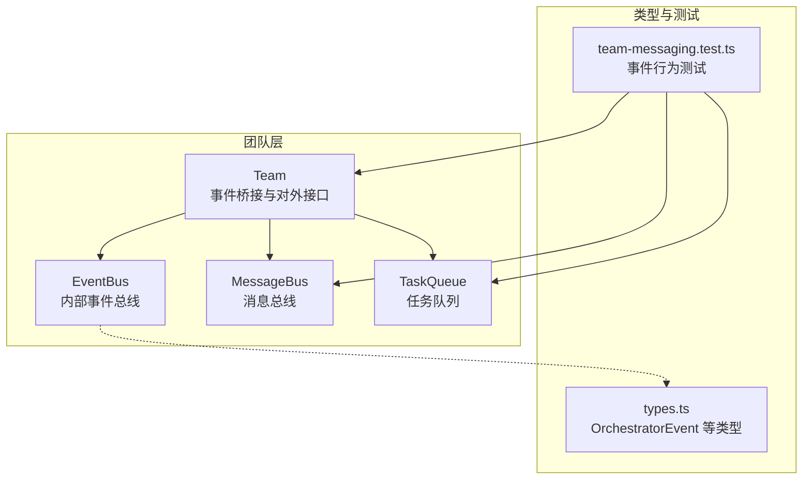
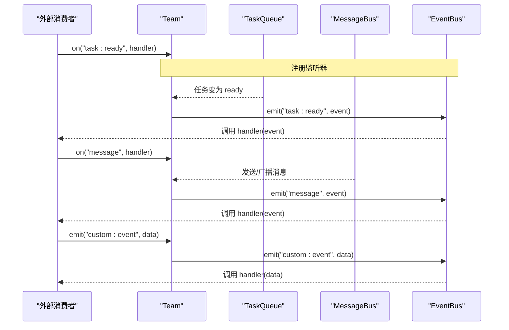
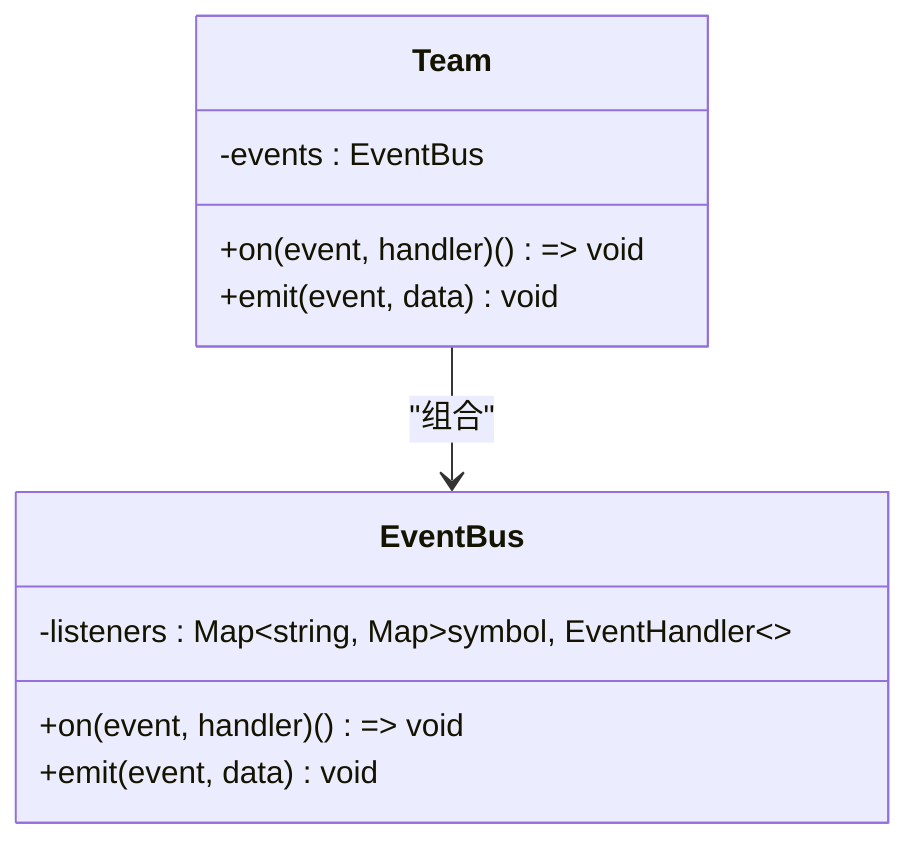
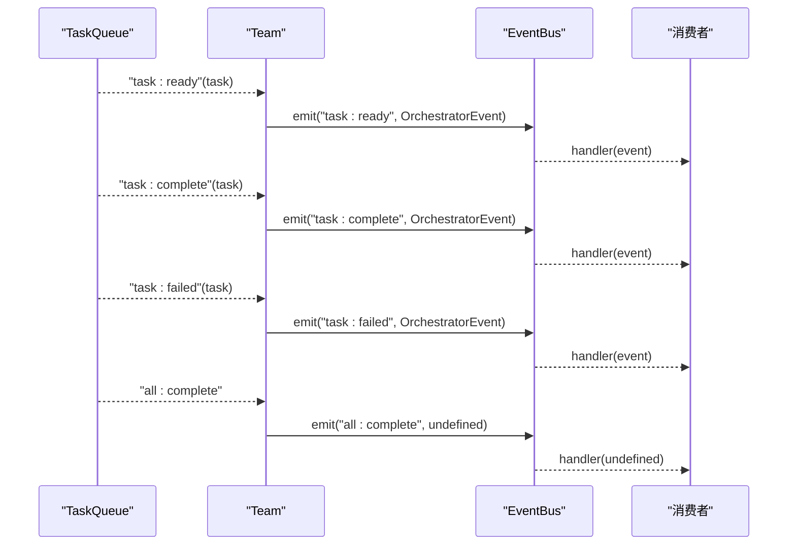
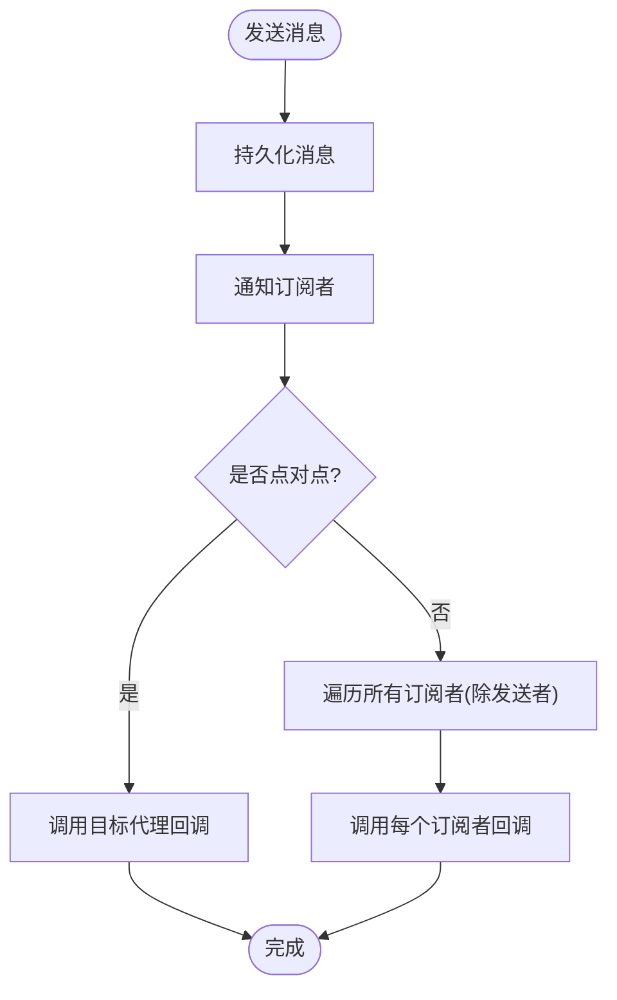
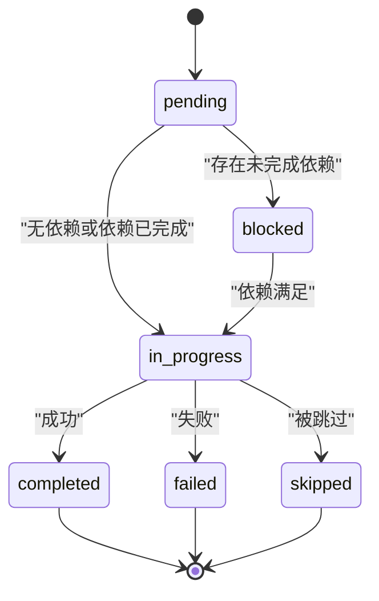
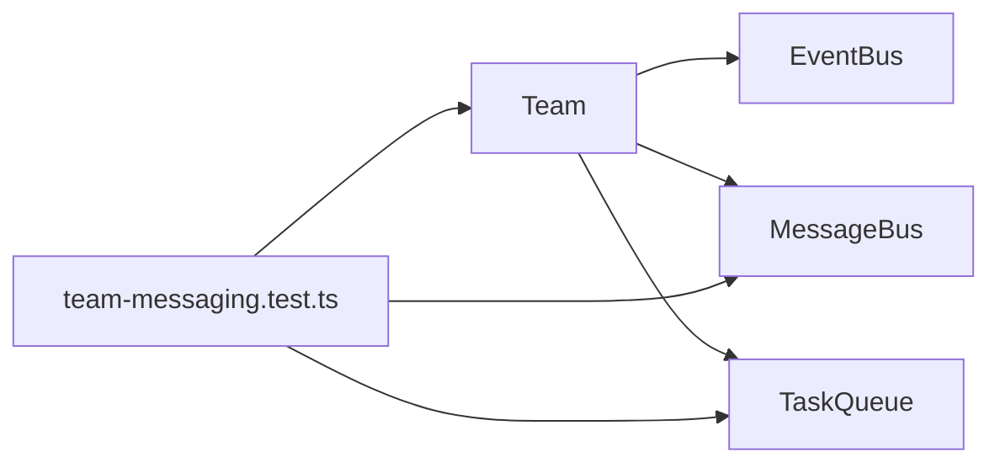

# 事件系统

<cite>
**本文档引用的文件**
- [team.ts](file://src/team/team.ts)
- [messaging.ts](file://src/team/messaging.ts)
- [queue.ts](file://src/task/queue.ts)
- [types.ts](file://src/types.ts)
- [team-messaging.test.ts](file://tests/team-messaging.test.ts)
- [02-team-collaboration.ts](file://examples/02-team-collaboration.ts)
- [03-task-pipeline.ts](file://examples/03-task-pipeline.ts)
</cite>

## 目录
1. [简介](#简介)
2. [项目结构](#项目结构)
3. [核心组件](#核心组件)
4. [架构总览](#架构总览)
5. [详细组件分析](#详细组件分析)
6. [依赖关系分析](#依赖关系分析)
7. [性能考量](#性能考量)
8. [故障排除指南](#故障排除指南)
9. [结论](#结论)
10. [附录](#附录)

## 简介
本文件面向 Open Multi-Agent 框架中的事件系统，系统性阐述 EventBus 的实现机制与事件驱动架构，涵盖：
- 事件监听器注册与注销（订阅/取消订阅）
- 事件分发与传播
- 事件生命周期管理
- 团队级事件类型：任务状态变化、消息传递、广播通知等
- 事件处理器的正确使用方式
- 实际应用场景与示例路径
- 性能优化建议与调试技巧

## 项目结构
事件系统主要由以下模块组成：
- Team：团队协调器，持有内部 EventBus，并桥接 TaskQueue 与 MessageBus 的事件到团队事件总线
- EventBus：轻量同步事件总线，支持事件订阅与分发
- MessageBus：跨代理的消息总线，支持点对点与广播消息，维护未读状态
- TaskQueue：任务队列，发出任务生命周期事件（ready/complete/failed/all:complete）
- 类型定义：OrchestratorEvent 统一事件载荷结构

图表来源
- [team.ts:32-140](file://src/team/team.ts#L32-L140)
- [messaging.ts:68-232](file://src/team/messaging.ts#L68-L232)
- [queue.ts:16-23](file://src/task/queue.ts#L16-L23)
- [types.ts:370-383](file://src/types.ts#L370-L383)
- [team-messaging.test.ts:149-328](file://tests/team-messaging.test.ts#L149-L328)

章节来源
- [team.ts:10-25](file://src/team/team.ts#L10-L25)
- [messaging.ts:1-28](file://src/team/messaging.ts#L1-L28)
- [queue.ts:1-35](file://src/task/queue.ts#L1-L35)
- [types.ts:360-383](file://src/types.ts#L360-L383)

## 核心组件
- EventBus：最小化同步事件发射器，内部以 Map 存储事件名到监听器集合的映射；监听器通过返回的函数进行注销
- Team：封装 EventBus，桥接 TaskQueue 与 MessageBus 的事件，向外部暴露统一的事件接口
- MessageBus：内存中消息总线，支持点对点与广播，维护每代理的已读/未读状态
- TaskQueue：任务队列，发出任务生命周期事件，供 Team 桥接
- OrchestratorEvent：统一事件载荷，包含事件类型、关联代理/任务标识与任意数据

章节来源
- [team.ts:32-56](file://src/team/team.ts#L32-L56)
- [team.ts:88-140](file://src/team/team.ts#L88-L140)
- [messaging.ts:68-232](file://src/team/messaging.ts#L68-L232)
- [queue.ts:16-32](file://src/task/queue.ts#L16-L32)
- [types.ts:370-383](file://src/types.ts#L370-L383)

## 架构总览
事件系统采用“内部 EventBus + 外部桥接”的设计：
- 内部 EventBus 负责团队级事件的订阅与分发
- TaskQueue 将任务生命周期事件桥接到 Team 的 EventBus
- MessageBus 将消息事件桥接到 Team 的 EventBus
- 外部消费者通过 Team.on/emit 订阅或自定义事件

图表来源
- [team.ts:109-139](file://src/team/team.ts#L109-L139)
- [team.ts:170-201](file://src/team/team.ts#L170-L201)
- [team.ts:321-333](file://src/team/team.ts#L321-L333)
- [queue.ts:16-23](file://src/task/queue.ts#L16-L23)
- [messaging.ts:96-115](file://src/team/messaging.ts#L96-L115)

## 详细组件分析

### EventBus 实现与生命周期
- 注册：on(event, handler) 返回一个可调用的注销函数；内部使用 Symbol 作为监听器唯一标识
- 分发：emit(event, data) 同步调用该事件的所有监听器
- 生命周期：监听器在注册后立即生效；调用注销函数后从映射中移除，后续不再接收事件

图表来源
- [team.ts:32-56](file://src/team/team.ts#L32-L56)
- [team.ts:321-333](file://src/team/team.ts#L321-L333)

章节来源
- [team.ts:32-56](file://src/team/team.ts#L32-L56)

### Team 事件桥接与对外接口
- 桥接 TaskQueue 事件：将队列的 task:ready、task:complete、task:failed、all:complete 映射为团队事件
- 桥接 MessageBus 事件：将点对点与广播消息映射为团队事件
- 对外接口：Team.on 与 Team.emit 提供统一的事件订阅与自定义事件发布能力

图表来源
- [team.ts:109-139](file://src/team/team.ts#L109-L139)
- [queue.ts:16-23](file://src/task/queue.ts#L16-L23)

章节来源
- [team.ts:109-139](file://src/team/team.ts#L109-L139)

### MessageBus 与消息事件
- 点对点发送：send(from, to, content) 生成带时间戳与 UUID 的消息并持久化，随后同步通知订阅者
- 广播：broadcast(from, content) 等价于 to === '*' 的 send，通知除发送者外的所有订阅者
- 订阅：subscribe(agentName, callback) 返回注销函数；注销是幂等的
- 未读跟踪：按代理维护已读消息集合，支持 getUnread/getAll/markRead

图表来源
- [messaging.ts:205-231](file://src/team/messaging.ts#L205-L231)
- [messaging.ts:185-199](file://src/team/messaging.ts#L185-L199)

章节来源
- [messaging.ts:68-232](file://src/team/messaging.ts#L68-L232)

### 任务事件与生命周期
- 任务状态变化：pending → blocked → in_progress → completed/failed/skipped
- 队列事件：task:ready、task:complete、task:failed、task:skipped、all:complete
- Team 桥接：将队列事件转换为团队事件，统一载荷结构

图表来源
- [queue.ts:16-23](file://src/task/queue.ts#L16-L23)
- [team.ts:109-139](file://src/team/team.ts#L109-L139)

章节来源
- [queue.ts:16-32](file://src/task/queue.ts#L16-L32)
- [team.ts:109-139](file://src/team/team.ts#L109-L139)

### 事件类型与数据结构
- 团队事件类型
  - task:ready、task:complete、task:failed、all:complete：来自 TaskQueue
  - message、broadcast：来自 MessageBus
  - 自定义事件：通过 Team.emit 触发
- 事件载荷结构（OrchestratorEvent）
  - type：事件类型枚举
  - agent：关联代理名称（可选）
  - task：关联任务 ID（可选）
  - data：事件数据（可选）

章节来源
- [team.ts:308-333](file://src/team/team.ts#L308-L333)
- [types.ts:370-383](file://src/types.ts#L370-L383)

## 依赖关系分析
- Team 依赖 EventBus、MessageBus、TaskQueue
- EventBus 为 Team 的内部组件，不直接对外暴露
- MessageBus 与 TaskQueue 通过 Team 进行事件桥接
- 测试覆盖了消息总线、团队事件桥接与自定义事件

图表来源
- [team.ts:88-140](file://src/team/team.ts#L88-L140)
- [team-messaging.test.ts:149-328](file://tests/team-messaging.test.ts#L149-L328)

章节来源
- [team.ts:88-140](file://src/team/team.ts#L88-L140)
- [team-messaging.test.ts:149-328](file://tests/team-messaging.test.ts#L149-L328)

## 性能考量
- 同步分发：EventBus 与 MessageBus 均为同步分发，适合微任务内处理；避免在回调中执行耗时操作
- 订阅粒度：尽量按代理或任务维度订阅，减少不必要的回调数量
- 事件负载：避免在事件数据中携带大对象，必要时仅传递标识符并在需要时查询
- 广播范围：广播会通知所有订阅者（除发送者），在大规模代理场景下需谨慎使用
- 未读状态：MessageBus 维护 per-agent 已读集合，注意及时调用 markRead 以避免内存增长

## 故障排除指南
- 订阅未触发
  - 确认事件类型拼写一致（如 message 与 broadcast）
  - 确认订阅时机：在事件发生前注册
  - 检查广播场景：发送者不会收到自己的广播
- 取消订阅无效
  - 确保调用返回的注销函数且只调用一次
  - 注销是幂等的，重复调用不会报错
- 事件数据类型
  - Team.on 的 data 类型为 unknown，需要断言为 OrchestratorEvent 或自定义类型
- 任务事件未出现
  - 确认任务状态变化确实发生（依赖满足、完成或失败）
  - 检查队列事件桥接逻辑是否正常

章节来源
- [team-messaging.test.ts:86-128](file://tests/team-messaging.test.ts#L86-L128)
- [team-messaging.test.ts:280-328](file://tests/team-messaging.test.ts#L280-L328)

## 结论
Open Multi-Agent 的事件系统通过 Team 的内部 EventBus 将 TaskQueue 与 MessageBus 的事件统一桥接，形成简洁而强大的事件驱动架构。其同步分发、轻量实现与清晰的事件类型设计，使得团队协作、任务编排与可观测性成为可能。遵循本文的订阅/注销规范与性能建议，可在复杂多代理场景中构建稳定可靠的事件驱动应用。

## 附录

### 实际应用场景与示例路径
- 多代理团队协作进度追踪
  - 示例路径：[02-team-collaboration.ts](file://examples/02-team-collaboration.ts)
  - 关键事件：agent_start、agent_complete、task_start、task_complete、message、error
- 显式任务流水线与依赖阻塞
  - 示例路径：[03-task-pipeline.ts](file://examples/03-task-pipeline.ts)
  - 关键事件：task_start、task_complete、agent_start、agent_complete、error

章节来源
- [02-team-collaboration.ts:63-97](file://examples/02-team-collaboration.ts#L63-L97)
- [03-task-pipeline.ts:64-92](file://examples/03-task-pipeline.ts#L64-L92)

### 事件处理器注册与注销最佳实践
- 注册
  - 使用 Team.on 注册监听器，返回的函数用于注销
  - 在组件初始化时注册，在销毁时调用注销函数
- 注销
  - 注销是幂等的，重复调用不会报错
  - 在组件卸载或上下文结束时确保调用注销函数
- 自定义事件
  - 使用 Team.emit 发布自定义事件，便于业务域扩展

章节来源
- [team.ts:321-333](file://src/team/team.ts#L321-L333)
- [team-messaging.test.ts:302-312](file://tests/team-messaging.test.ts#L302-L312)