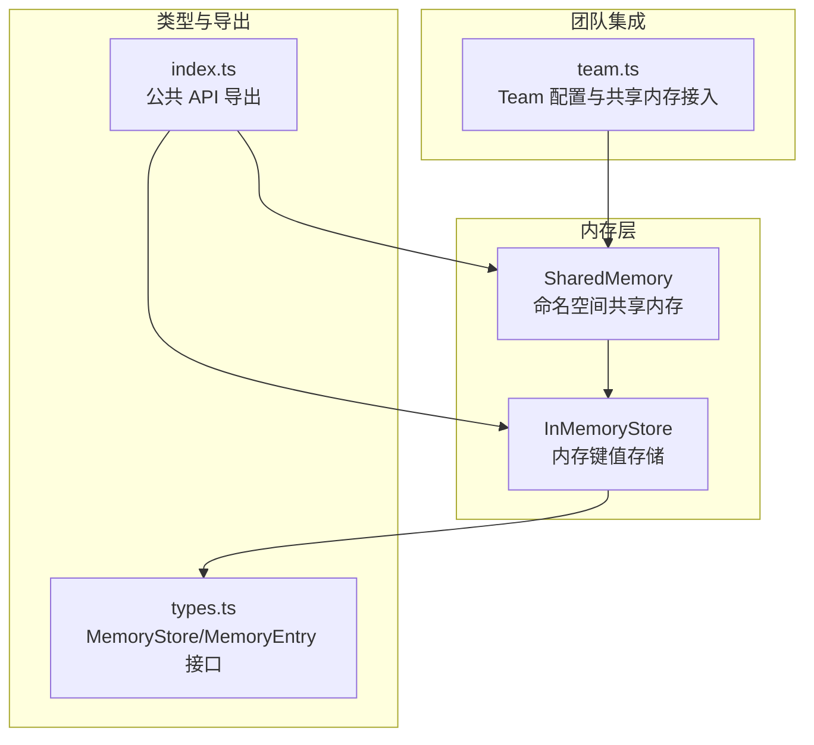
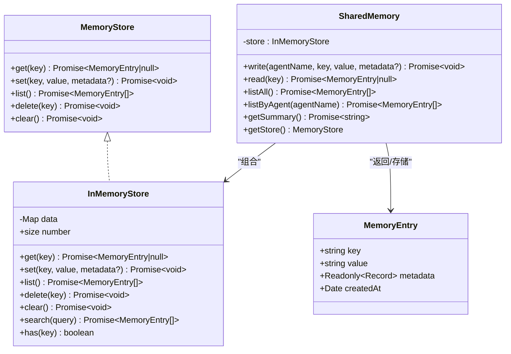
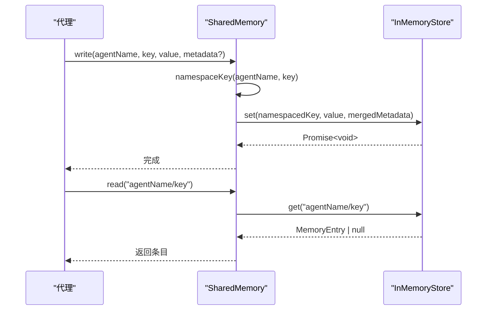
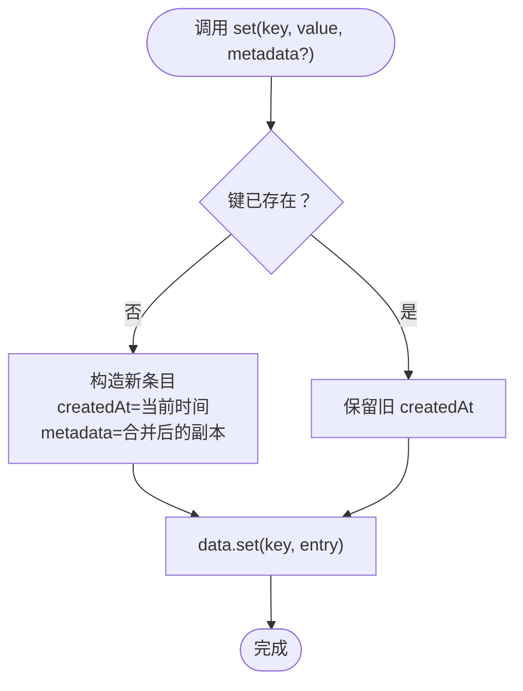
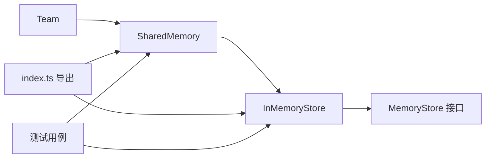

# 共享内存

<cite>
**本文引用的文件**
- [src/memory/shared.ts](file://src/memory/shared.ts)
- [src/memory/store.ts](file://src/memory/store.ts)
- [src/types.ts](file://src/types.ts)
- [src/index.ts](file://src/index.ts)
- [src/team/team.ts](file://src/team/team.ts)
- [tests/shared-memory.test.ts](file://tests/shared-memory.test.ts)
- [tests/team-messaging.test.ts](file://tests/team-messaging.test.ts)
- [examples/02-team-collaboration.ts](file://examples/02-team-collaboration.ts)
</cite>

## 目录
1. [简介](#简介)
2. [项目结构](#项目结构)
3. [核心组件](#核心组件)
4. [架构总览](#架构总览)
5. [详细组件分析](#详细组件分析)
6. [依赖关系分析](#依赖关系分析)
7. [性能与内存特性](#性能与内存特性)
8. [配置与使用示例](#配置与使用示例)
9. [并发与安全考虑](#并发与安全考虑)
10. [故障排查指南](#故障排查指南)
11. [结论](#结论)

## 简介
本文件面向 Open Multi-Agent 框架中的共享内存系统，系统性阐述 SharedMemory 类的设计理念、架构实现与使用方法，重点覆盖：
- 命名空间隔离机制：通过“写入时按代理名前缀命名”确保不同代理的数据互不冲突且可溯源
- 数据持久化策略：默认采用内存存储（InMemoryStore），支持替换为其他后端（如 Redis、SQLite）
- 并发访问控制：当前实现为单进程内存模型，未内置锁；建议在多进程或多线程场景下通过外部同步或选择持久化后端
- MemoryStore 接口：统一的键值存取抽象，支持读写、列表、删除、清空与搜索扩展
- 性能特性与优化：基于 Map 的 O(1) 查找、线性扫描搜索的复杂度与限制
- 实用示例：从团队配置启用共享内存到具体读写与摘要生成
- 安全与最佳实践：元数据合并、值截断、命名空间一致性等

## 项目结构
共享内存相关代码位于 src/memory 目录，配合 src/types.ts 中的接口定义与 src/team/team.ts 中的团队集成点，形成从接口到实现再到使用的完整链路。

图表来源
- [src/memory/shared.ts:36-181](file://src/memory/shared.ts#L36-L181)
- [src/memory/store.ts:31-124](file://src/memory/store.ts#L31-L124)
- [src/types.ts:476-494](file://src/types.ts#L476-L494)
- [src/index.ts:115-116](file://src/index.ts#L115-L116)
- [src/team/team.ts:98-106](file://src/team/team.ts#L98-L106)

章节来源
- [src/memory/shared.ts:1-182](file://src/memory/shared.ts#L1-L182)
- [src/memory/store.ts:1-125](file://src/memory/store.ts#L1-L125)
- [src/types.ts:476-494](file://src/types.ts#L476-L494)
- [src/index.ts:115-116](file://src/index.ts#L115-L116)
- [src/team/team.ts:98-106](file://src/team/team.ts#L98-L106)

## 核心组件
- SharedMemory：提供命名空间化的读写、按代理列出、摘要生成与底层 MemoryStore 访问器
- InMemoryStore：MemoryStore 的默认实现，基于 Map 提供异步表面的同步存储
- MemoryStore/MemoryEntry：统一的键值存储接口与条目结构
- Team 集成：通过 TeamConfig.sharedMemory 启用共享内存，Team 内部持有 SharedMemory 实例

章节来源
- [src/memory/shared.ts:36-181](file://src/memory/shared.ts#L36-L181)
- [src/memory/store.ts:31-124](file://src/memory/store.ts#L31-L124)
- [src/types.ts:476-494](file://src/types.ts#L476-L494)
- [src/team/team.ts:98-106](file://src/team/team.ts#L98-L106)

## 架构总览
SharedMemory 封装了 InMemoryStore，对外暴露一组语义化的方法：写入时自动加前缀、读取支持完全限定键、按代理过滤、生成人类可读摘要。Team 在配置开启共享内存时实例化 SharedMemory，并通过 getSharedMemory/getSharedMemoryInstance 暴露给上层使用。

图表来源
- [src/types.ts:476-494](file://src/types.ts#L476-L494)
- [src/memory/store.ts:31-124](file://src/memory/store.ts#L31-L124)
- [src/memory/shared.ts:36-181](file://src/memory/shared.ts#L36-L181)

## 详细组件分析

### SharedMemory 设计与实现
- 命名空间隔离：写入时将 key 统一格式化为“<agentName>/<key>”，保证不同代理写入相同逻辑键不会冲突
- 元数据合并：写入时会将 { agent: agentName } 合并进 metadata，便于后续遍历识别来源
- 读取与过滤：read 支持完全限定键；listAll 返回全部条目；listByAgent 通过前缀过滤仅返回某代理写入的条目
- 摘要生成：getSummary 将所有条目按代理分组，输出 Markdown 风格摘要，长值截断，适合注入到上下文窗口
- 底层访问：getStore 返回底层 MemoryStore，便于直接使用 set/get/list 等原生能力

图表来源
- [src/memory/shared.ts:58-82](file://src/memory/shared.ts#L58-L82)
- [src/memory/store.ts:39-62](file://src/memory/store.ts#L39-L62)

章节来源
- [src/memory/shared.ts:36-181](file://src/memory/shared.ts#L36-L181)

### InMemoryStore 实现要点
- 存储介质：内部使用 Map<string, MemoryEntry>，键为字符串，值为 MemoryEntry
- 异步表面：尽管底层是同步 Map，但接口声明为 Promise，便于替换为异步后端（如 Redis/SQLite）
- 写入策略：set 为 upsert，若键已存在则保留 createdAt，便于检测首次写入时间
- 列表与搜索：list 返回快照；search 为线性扫描，大小写无关子串匹配，适合小规模数据
- 清理：delete 单键删除，clear 清空全部

图表来源
- [src/memory/store.ts:49-62](file://src/memory/store.ts#L49-L62)

章节来源
- [src/memory/store.ts:31-124](file://src/memory/store.ts#L31-L124)

### MemoryStore 接口与类型
- MemoryEntry：包含 key、value、metadata、createdAt 四要素
- MemoryStore：get/set/list/delete/clear 五项基础能力
- 该接口允许替换为 Redis、SQLite 等持久化实现，保持调用方一致

章节来源
- [src/types.ts:476-494](file://src/types.ts#L476-L494)

### 团队集成与公开导出
- Team 在配置 sharedMemory=true 时创建 SharedMemory 实例，并通过 getSharedMemory/getSharedMemoryInstance 对外暴露
- 公共 API 通过 src/index.ts 导出 SharedMemory 与 InMemoryStore，便于消费者直接使用

章节来源
- [src/team/team.ts:98-106](file://src/team/team.ts#L98-L106)
- [src/team/team.ts:287-299](file://src/team/team.ts#L287-L299)
- [src/index.ts:115-116](file://src/index.ts#L115-L116)

## 依赖关系分析
- SharedMemory 依赖 MemoryStore 接口与 InMemoryStore 实现
- Team 依赖 SharedMemory，在配置开启时创建实例
- 公共 API 通过 index.ts 暴露 SharedMemory 与 InMemoryStore
- 测试覆盖了命名空间隔离、摘要生成、搜索与列表等行为

图表来源
- [src/team/team.ts:98-106](file://src/team/team.ts#L98-L106)
- [src/memory/shared.ts:36-41](file://src/memory/shared.ts#L36-L41)
- [src/memory/store.ts:31-32](file://src/memory/store.ts#L31-L32)
- [src/index.ts:115-116](file://src/index.ts#L115-L116)
- [tests/shared-memory.test.ts:1-122](file://tests/shared-memory.test.ts#L1-L122)

章节来源
- [src/team/team.ts:98-106](file://src/team/team.ts#L98-L106)
- [src/index.ts:115-116](file://src/index.ts#L115-L116)
- [tests/shared-memory.test.ts:1-122](file://tests/shared-memory.test.ts#L1-L122)

## 性能与内存特性
- 时间复杂度
  - get/set：O(1) 均摊（基于 Map）
  - list：O(n)（遍历 Map.values）
  - search：O(n·(k1+k2))（n 条目，k1 键长度，k2 值长度，大小写无关子串匹配）
- 空间复杂度
  - 存储开销与条目数量线性相关，每条记录包含 key、value、metadata、createdAt
- 适用场景
  - 单进程、测试或小规模数据：InMemoryStore 足够高效
  - 大规模数据或需要持久化：应替换为 Redis/SQLite 等后端，实现 search 索引与持久化
- 值截断
  - getSummary 对过长值进行截断，避免上下文窗口溢出

章节来源
- [src/memory/store.ts:65-109](file://src/memory/store.ts#L65-L109)
- [src/memory/shared.ts:127-159](file://src/memory/shared.ts#L127-L159)

## 配置与使用示例
- 团队启用共享内存
  - 在 TeamConfig 中设置 sharedMemory: true，Team 构造时会创建 SharedMemory 实例
  - 可通过 getSharedMemory 获取 MemoryStore，通过 getSharedMemoryInstance 获取 SharedMemory 以使用命名空间与摘要功能
- 写入与读取
  - 使用 SharedMemory.write 写入，键会被自动命名空间化
  - 使用 SharedMemory.read 读取完全限定键
- 生成摘要
  - 使用 SharedMemory.getSummary 生成 Markdown 风格摘要，适合注入到代理上下文

章节来源
- [src/team/team.ts:98-106](file://src/team/team.ts#L98-L106)
- [src/team/team.ts:287-299](file://src/team/team.ts#L287-L299)
- [src/memory/shared.ts:58-82](file://src/memory/shared.ts#L58-L82)
- [src/memory/shared.ts:127-159](file://src/memory/shared.ts#L127-L159)
- [examples/02-team-collaboration.ts:109-114](file://examples/02-team-collaboration.ts#L109-L114)

## 并发与安全考虑
- 当前实现
  - InMemoryStore 基于单进程 Map，未内置锁或事务控制
  - SharedMemory.write 在写入时合并元数据并保留 createdAt，避免覆盖导致的时间戳丢失
- 并发风险
  - 多线程/多进程同时写入同一键时，可能出现竞态条件导致覆盖顺序不确定
- 安全与最佳实践
  - 命名空间一致性：始终使用 SharedMemory.write 进行写入，避免绕过命名空间导致冲突
  - 元数据合并：写入时传入 metadata，系统会自动附加 agent 字段，便于溯源
  - 值截断：摘要生成对长值进行截断，避免上下文窗口溢出
  - 替换后端：生产环境建议使用支持并发与持久化的 MemoryStore 实现（如 Redis/SQLite），并在上层增加必要的锁或幂等写入策略
  - 清理策略：定期调用 clear 或 delete 不再需要的键，控制内存占用

章节来源
- [src/memory/shared.ts:58-69](file://src/memory/shared.ts#L58-L69)
- [src/memory/store.ts:49-62](file://src/memory/store.ts#L49-L62)
- [src/memory/shared.ts:127-159](file://src/memory/shared.ts#L127-L159)

## 故障排查指南
- 读取不到数据
  - 检查是否使用了正确的完全限定键（“agentName/key”）
  - 确认 SharedMemory 实例已正确创建（Team 配置 sharedMemory: true）
- 命名空间冲突
  - 确保各代理写入相同逻辑键时，使用 SharedMemory.write 自动加前缀
- 摘要为空
  - 确认已写入数据；getSummary 在空存储时返回空字符串
- 长值被截断
  - 这是预期行为，用于控制上下文长度；如需完整信息，请直接读取条目
- 多进程/多线程问题
  - 当前实现未内置并发控制，建议使用持久化后端或在应用层引入锁

章节来源
- [tests/shared-memory.test.ts:8-21](file://tests/shared-memory.test.ts#L8-L21)
- [tests/shared-memory.test.ts:81-108](file://tests/shared-memory.test.ts#L81-L108)
- [src/team/team.ts:287-299](file://src/team/team.ts#L287-L299)

## 结论
Open Multi-Agent 框架的共享内存系统通过 SharedMemory 提供简洁而强大的命名空间化键值存储能力，结合 InMemoryStore 的默认实现与 MemoryStore 接口的可替换性，既能满足单进程测试与开发需求，也为生产环境提供了平滑迁移至持久化后端的路径。实践中应重视命名空间一致性、元数据溯源与上下文长度控制，并在多进程场景下通过后端或应用层同步保障数据一致性。