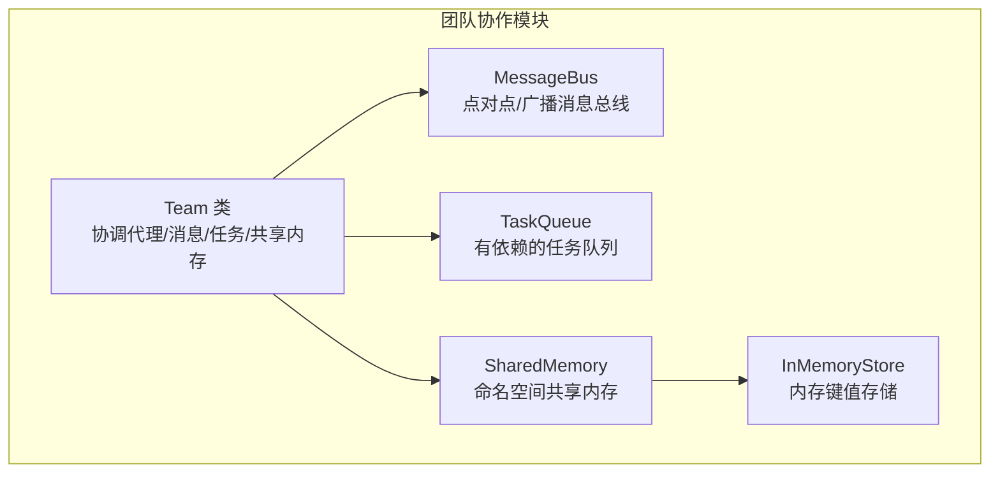
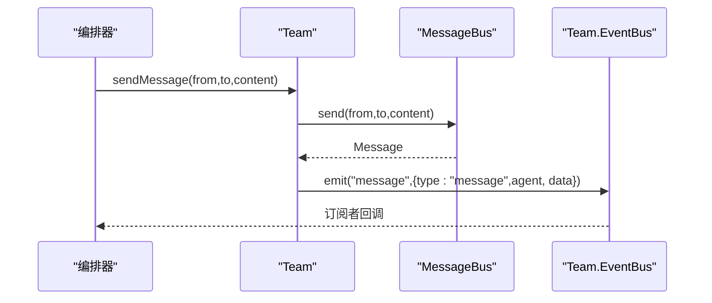
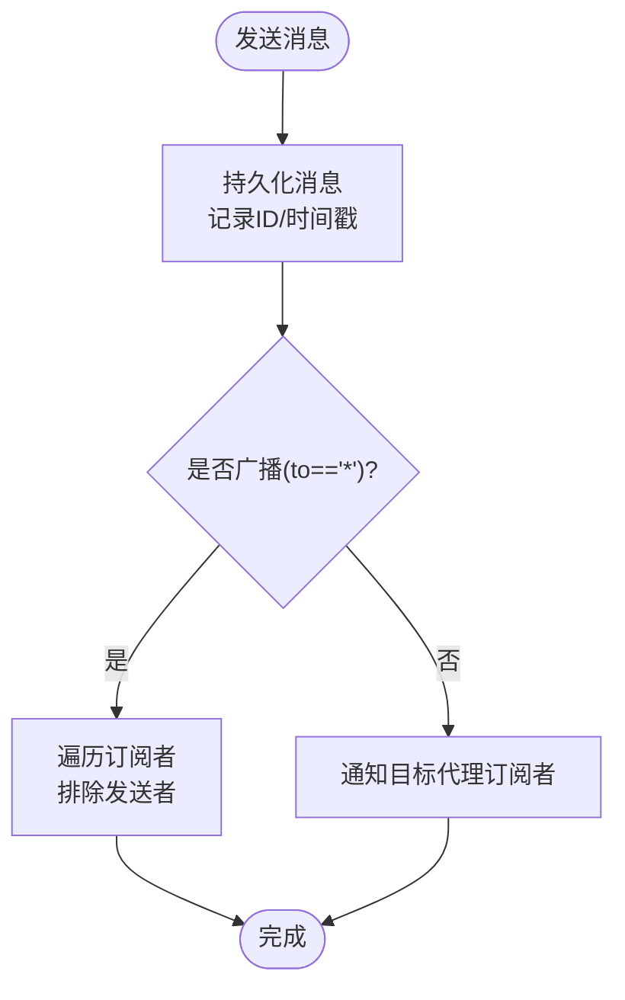
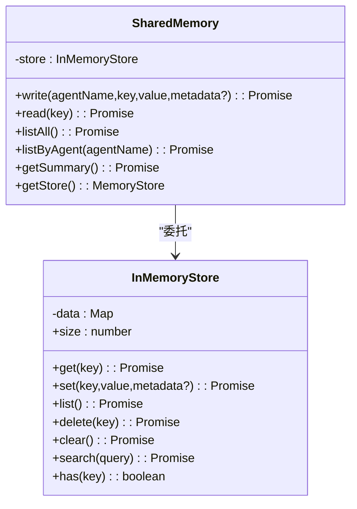
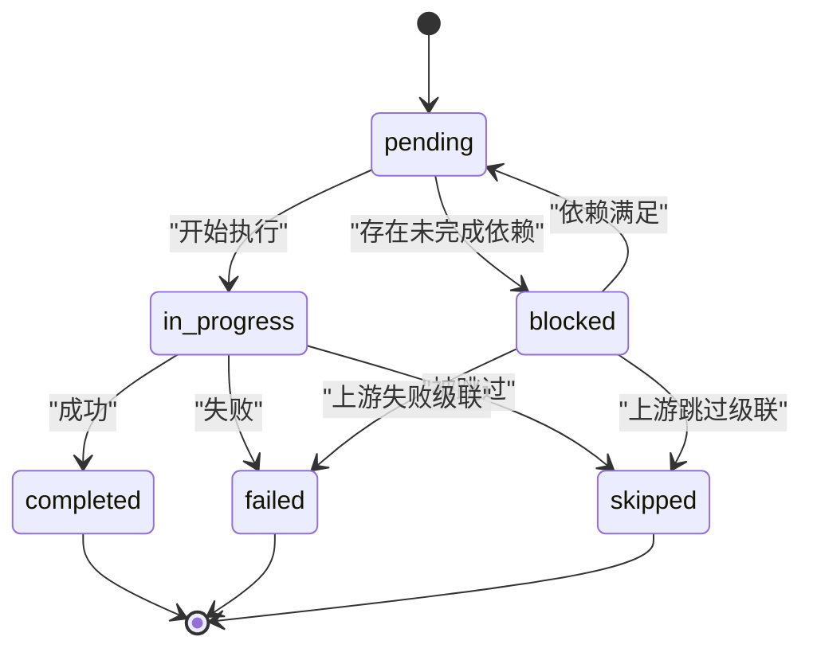
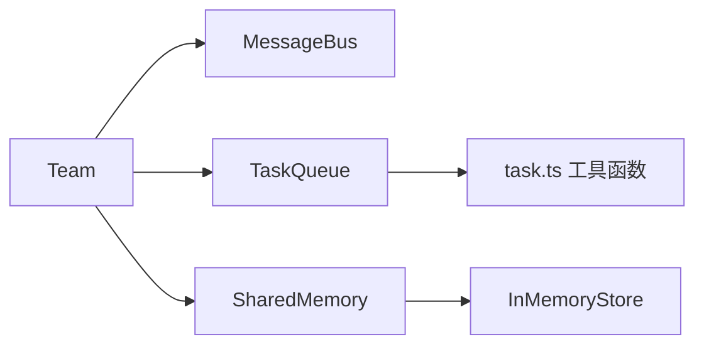

# 团队协作系统

<cite>
**本文引用的文件**
- [team.ts](file://src/team/team.ts)
- [messaging.ts](file://src/team/messaging.ts)
- [shared.ts](file://src/memory/shared.ts)
- [store.ts](file://src/memory/store.ts)
- [queue.ts](file://src/task/queue.ts)
- [task.ts](file://src/task/task.ts)
- [types.ts](file://src/types.ts)
- [02-team-collaboration.ts](file://examples/02-team-collaboration.ts)
- [team-messaging.test.ts](file://tests/team-messaging.test.ts)
- [shared-memory.test.ts](file://tests/shared-memory.test.ts)
</cite>

## 目录
1. [简介](#简介)
2. [项目结构](#项目结构)
3. [核心组件](#核心组件)
4. [架构总览](#架构总览)
5. [详细组件分析](#详细组件分析)
6. [依赖关系分析](#依赖关系分析)
7. [性能考量](#性能考量)
8. [故障排查指南](#故障排查指南)
9. [结论](#结论)
10. [附录](#附录)

## 简介
本文件为 Open Multi-Agent 框架的团队协作系统提供综合技术文档。重点围绕 Team 类的设计与实现，深入解析代理管理、消息传递机制、共享内存系统的工作原理；详解消息总线的消息路由、目标特定通信与消息过滤策略；阐述共享内存的设计理念（命名空间隔离、数据持久化、并发访问控制）；给出团队通信协议与最佳实践；并提供团队配置的实用指南与性能优化建议。

## 项目结构
团队协作系统位于 src/team 目录下，核心由 Team 类、消息总线 MessageBus、任务队列 TaskQueue、共享内存 SharedMemory 及其存储实现 InMemoryStore 组成。类型定义集中在 types.ts 中，示例与测试分别在 examples 与 tests 目录中。



图表来源
- [team.ts:88-335](file://src/team/team.ts#L88-L335)
- [messaging.ts:68-233](file://src/team/messaging.ts#L68-L233)
- [queue.ts:55-465](file://src/task/queue.ts#L55-L465)
- [shared.ts:36-182](file://src/memory/shared.ts#L36-L182)
- [store.ts:31-125](file://src/memory/store.ts#L31-L125)

章节来源
- [team.ts:1-335](file://src/team/team.ts#L1-L335)
- [messaging.ts:1-233](file://src/team/messaging.ts#L1-L233)
- [shared.ts:1-182](file://src/memory/shared.ts#L1-L182)
- [store.ts:1-125](file://src/memory/store.ts#L1-L125)
- [queue.ts:1-465](file://src/task/queue.ts#L1-L465)
- [task.ts:1-240](file://src/task/task.ts#L1-L240)
- [types.ts:316-383](file://src/types.ts#L316-L383)

## 核心组件
- Team：团队协调器，聚合代理名单、消息总线、任务队列与可选共享内存，提供事件总线以供编排器观察生命周期事件。
- MessageBus：轻量级内存消息总线，支持点对点与广播，维护每代理已读状态，订阅者同步回调。
- TaskQueue：拓扑依赖感知的任务队列，自动处理阻塞/就绪转换、级联失败/跳过、进度统计与事件桥接。
- SharedMemory：命名空间共享内存，按“代理名/键”写入，支持跨代理读取、摘要生成、按代理列表等能力。
- InMemoryStore：默认内存存储实现，提供异步接口以便替换为持久化后端。

章节来源
- [team.ts:88-335](file://src/team/team.ts#L88-L335)
- [messaging.ts:68-233](file://src/team/messaging.ts#L68-L233)
- [queue.ts:55-465](file://src/task/queue.ts#L55-L465)
- [shared.ts:36-182](file://src/memory/shared.ts#L36-L182)
- [store.ts:31-125](file://src/memory/store.ts#L31-L125)

## 架构总览
Team 将消息总线、任务队列与共享内存整合为统一的团队运行时。Team 的构造函数完成以下关键职责：
- 建立代理映射（名称到配置），用于 O(1) 查询。
- 初始化消息总线与任务队列。
- 条件性初始化共享内存（当 TeamConfig.sharedMemory 为真）。
- 将任务队列事件桥接到 Team 自身的内部事件总线上，供外部监听。

```mermaid
classDiagram
class Team {
+name : string
+config : TeamConfig
-agentMap : Map<string, AgentConfig>
-bus : MessageBus
-queue : TaskQueue
-memory : SharedMemory?
-events : EventBus
+getAgents() : AgentConfig[]
+getAgent(name) : AgentConfig?
+sendMessage(from,to,content) : void
+broadcast(from,content) : void
+getMessages(agentName) : Message[]
+addTask(task) : Task
+getTasks() : Task[]
+getTasksByAssignee(agentName) : Task[]
+updateTask(taskId,update) : Task
+getNextTask(agentName) : Task?
+getSharedMemory() : MemoryStore?
+getSharedMemoryInstance() : SharedMemory?
+on(event,handler) : () => void
+emit(event,data) : void
}
class MessageBus {
-messages : Message[]
-readState : Map<string,Set<string>>
-subscribers : Map<string,Map<symbol,(msg)=>void>>
+send(from,to,content) : Message
+broadcast(from,content) : Message
+getAll(agentName) : Message[]
+getUnread(agentName) : Message[]
+markRead(agentName,ids) : void
+getConversation(a,b) : Message[]
+subscribe(agentName,callback) : () => void
}
class TaskQueue {
-tasks : Map<string,Task>
-listeners : Map<string,Map<symbol,fn>>
+add(task) : void
+addBatch(tasks) : void
+update(taskId,partial) : Task
+complete(taskId,result?) : Task
+fail(taskId,error) : Task
+skip(taskId,reason) : Task
+skipRemaining(reason) : void
+next(assignee?) : Task?
+nextAvailable() : Task?
+list() : Task[]
+getByStatus(status) : Task[]
+isComplete() : boolean
+getProgress() : Progress
+on(event,handler) : () => void
}
class SharedMemory {
-store : InMemoryStore
+write(agentName,key,value,metadata?) : Promise<void>
+read(key) : Promise<MemoryEntry|null>
+listAll() : Promise<MemoryEntry[]>
+listByAgent(agentName) : Promise<MemoryEntry[]>
+getSummary() : Promise<string>
+getStore() : MemoryStore
}
Team --> MessageBus : "使用"
Team --> TaskQueue : "使用"
Team --> SharedMemory : "可选使用"
SharedMemory --> InMemoryStore : "委托"
```

图表来源
- [team.ts:88-335](file://src/team/team.ts#L88-L335)
- [messaging.ts:68-233](file://src/team/messaging.ts#L68-L233)
- [queue.ts:55-465](file://src/task/queue.ts#L55-L465)
- [shared.ts:36-182](file://src/memory/shared.ts#L36-L182)
- [store.ts:31-125](file://src/memory/store.ts#L31-L125)

## 详细组件分析

### Team 类设计与职责
- 代理管理
  - 通过 Map 将代理名称映射到配置，提供 O(1) 查找与注册顺序的浅拷贝读取。
  - 提供按名称查询代理的能力，便于编排器进行定向调度。
- 消息传递
  - sendMessage 实现点对点发送，返回持久化消息并触发 message 事件。
  - broadcast 实现广播，to 字段为“*”，触发 broadcast 事件。
  - getMessages 返回指定代理收到的所有消息（含未读）。
- 任务管理
  - addTask 创建任务并加入队列，保留调用方传入的非默认状态（如 blocked）。
  - getTasks / getTasksByAssignee 提供任务快照与按代理筛选。
  - updateTask 支持对状态、结果、指派代理的局部更新。
  - getNextTask 优先返回被明确指派的任务，否则回退到首个未分配的待处理任务。
- 共享内存
  - getSharedMemory 返回 MemoryStore 接口，getSharedMemoryInstance 返回完整 SharedMemory 实例。
  - 当 TeamConfig.sharedMemory 为 false 时，上述方法返回 undefined。
- 事件系统
  - Team 内部使用 EventBus，桥接 TaskQueue 的 task:ready/task:complete/task:failed/all:complete 到 Team 的事件总线上。
  - 提供 on 与 emit 方法，允许编排器订阅自定义事件。



图表来源
- [team.ts:170-178](file://src/team/team.ts#L170-L178)
- [messaging.ts:96-106](file://src/team/messaging.ts#L96-L106)

章节来源
- [team.ts:88-335](file://src/team/team.ts#L88-L335)

### 消息总线 MessageBus 实现机制
- 数据结构
  - 所有消息按插入顺序保存在数组中，便于审计与重放。
  - 每个代理维护一个已读消息 ID 集合，实现未读计数与标记。
  - 订阅者以 Map<代理名, Map<订阅ID, 回调>>组织，支持取消订阅。
- 路由与投递
  - send 生成唯一 ID 与时间戳，持久化后立即通知订阅者。
  - 广播（to == "*"）向除发送者外的所有订阅者投递。
  - 点对点消息仅投递给目标代理。
- 过滤与查询
  - getUnread 基于已读集合过滤，包含广播与点对点。
  - getAll 返回所有地址给该代理的消息。
  - getConversation 返回双向对话历史。
  - markRead 支持批量标记，空数组为无操作。
- 订阅模型
  - subscribe 返回取消函数，支持重复取消（幂等）。
  - 通知在持久化之后同步触发，确保回调内可见最新消息。



图表来源
- [messaging.ts:205-231](file://src/team/messaging.ts#L205-L231)

章节来源
- [messaging.ts:68-233](file://src/team/messaging.ts#L68-L233)

### 共享内存 SharedMemory 设计理念
- 命名空间隔离
  - 写入时键名格式为“<agentName>/<key>”，确保不同代理写入同名键不会冲突。
  - 读取支持完全限定键或代理前缀键，便于跨代理读取。
- 数据持久化
  - 默认使用 InMemoryStore，所有数据驻留内存，适合单进程与测试场景。
  - 可通过实现 MemoryStore 接口替换为 Redis/SQLite 等持久化后端。
- 并发访问控制
  - InMemoryStore 采用 Map 作为底层存储，提供同步 get/set/list/delete/clear。
  - 外层 SharedMemory 保持异步接口，便于替换后端时无需修改调用方代码。
- 摘要与检索
  - getSummary 生成人类可读的 Markdown 摘要，按代理分组展示，截断过长值。
  - listByAgent 与 listAll 支持按代理或全量检索。
  - read 返回 MemoryEntry，包含元数据与创建时间。



图表来源
- [shared.ts:36-182](file://src/memory/shared.ts#L36-L182)
- [store.ts:31-125](file://src/memory/store.ts#L31-L125)

章节来源
- [shared.ts:36-182](file://src/memory/shared.ts#L36-L182)
- [store.ts:31-125](file://src/memory/store.ts#L31-L125)

### 任务队列 TaskQueue 与依赖管理
- 生命周期与状态机
  - 初始状态为 pending；若依赖未满足则置为 blocked；依赖满足后回到 pending 并发出 task:ready。
  - 完成/失败/跳过三种终端状态；失败会级联影响下游依赖；跳过同样级联。
- 依赖解析与拓扑排序
  - resolveInitialStatus 在添加任务时评估初始状态。
  - unblockDependents 在任务完成后扫描并提升满足条件的 blocked 任务。
  - isTaskReady 与 getTaskDependencyOrder 提供纯函数工具，便于验证与排序。
- 事件桥接
  - Team 将队列事件桥接为 task:ready/task:complete/task:failed/all:complete，供编排器观察。
- 查询与统计
  - next/nextAvailable 支持按代理与全局选择下一个可执行任务。
  - list/getByStatus/isComplete/getProgress 提供队列快照与进度统计。



图表来源
- [queue.ts:131-178](file://src/task/queue.ts#L131-L178)
- [queue.ts:212-243](file://src/task/queue.ts#L212-L243)
- [task.ts:76-92](file://src/task/task.ts#L76-L92)

章节来源
- [queue.ts:55-465](file://src/task/queue.ts#L55-L465)
- [task.ts:1-240](file://src/task/task.ts#L1-L240)

### 团队通信协议与最佳实践
- 协议要点
  - 点对点消息：from/to 明确发送者与接收者；消息持久化且可审计。
  - 广播消息：to 为“*”，除发送者外所有订阅者均收到；适合全局通知。
  - 未读跟踪：每个代理维护已读集合，避免重复处理与遗漏。
  - 事件桥接：Team 将任务队列事件桥接为统一的团队事件，便于编排器响应。
- 最佳实践
  - 使用 Team.getSharedMemory() 注入摘要上下文，减少重复信息传输。
  - 对关键决策与中间结果写入共享内存，确保后续代理可见。
  - 合理设置任务依赖，避免循环依赖；使用 validateTaskDependencies 进行校验。
  - 使用 getNextTask 的优先策略，先处理被指派任务，再处理公共任务。
  - 广播用于里程碑通知或紧急停机信号，避免滥用导致噪声。

章节来源
- [team.ts:170-201](file://src/team/team.ts#L170-L201)
- [messaging.ts:125-166](file://src/team/messaging.ts#L125-L166)
- [shared.ts:107-159](file://src/memory/shared.ts#L107-L159)
- [task.ts:184-239](file://src/task/task.ts#L184-L239)

### 团队配置实用指南
- TeamConfig 关键字段
  - name：团队标识符。
  - agents：代理配置数组，Team 内部按名称索引。
  - sharedMemory：启用共享内存时，Team 将持有 SharedMemory 实例。
  - maxConcurrency：并发度限制（在编排器层面生效）。
- 配置建议
  - 开启 sharedMemory 时，注意键命名规范（“代理名/键”），避免冲突。
  - 为关键任务设置 dependsOn，确保执行顺序正确。
  - 对易失败任务配置重试参数（maxRetries/retryDelayMs/retryBackoff）。
  - 使用 OrchestratorEvent 观察任务与消息事件，构建可观测性。

章节来源
- [types.ts:316-322](file://src/types.ts#L316-L322)
- [team.ts:98-140](file://src/team/team.ts#L98-L140)

## 依赖关系分析
- 组件耦合
  - Team 与 MessageBus/TaskQueue/SharedMemory 为组合关系；Team 通过事件桥接与外部交互。
  - SharedMemory 与 InMemoryStore 为委托关系，遵循接口抽象。
  - TaskQueue 依赖纯函数工具（isTaskReady、getTaskDependencyOrder、validateTaskDependencies）。
- 外部依赖
  - 使用 Node.js crypto 生成随机 ID。
  - 类型定义集中于 types.ts，保证跨模块无循环依赖。



图表来源
- [team.ts:104-107](file://src/team/team.ts#L104-L107)
- [shared.ts:37-41](file://src/memory/shared.ts#L37-L41)
- [queue.ts:10-10](file://src/task/queue.ts#L10-L10)

章节来源
- [team.ts:1-335](file://src/team/team.ts#L1-L335)
- [shared.ts:1-182](file://src/memory/shared.ts#L1-L182)
- [queue.ts:1-465](file://src/task/queue.ts#L1-L465)
- [task.ts:1-240](file://src/task/task.ts#L1-L240)

## 性能考量
- 消息总线
  - 消息持久化为数组，查询复杂度 O(n)；广播通知遍历订阅者，注意订阅者数量增长带来的开销。
  - 未读集合基于 Set，标记已读为 O(k)（k 为批量 ID 数量）。
- 任务队列
  - 解析初始状态与解除阻塞扫描均为 O(n)，依赖图较大时建议预排序或使用 isTaskReady 的 taskById 缓存。
  - 级联失败/跳过为深度优先传播，复杂度与依赖树结构相关。
- 共享内存
  - 默认 InMemoryStore 为 Map 存储，set/get/list/delete/clear 均为 O(1)/O(n)；search 为线性扫描，不适合超大容量。
  - getSummary 对所有条目进行分组与截断，复杂度与条目数线性相关。
- 并发与可观测性
  - Team 的事件桥接与消息订阅均为同步回调，避免微任务堆积；在高吞吐场景建议在回调中做限流或批处理。

章节来源
- [messaging.ts:125-166](file://src/team/messaging.ts#L125-L166)
- [queue.ts:419-441](file://src/task/queue.ts#L419-L441)
- [shared.ts:127-159](file://src/memory/shared.ts#L127-L159)
- [store.ts:99-109](file://src/memory/store.ts#L99-L109)

## 故障排查指南
- 消息未达或重复
  - 检查订阅者是否正确注册与取消；确认广播时发送者不会收到自身广播。
  - 使用 getUnread/markRead 验证未读状态是否正确更新。
- 任务不前进
  - 检查依赖 ID 是否存在于队列；使用 validateTaskDependencies 与 getTaskDependencyOrder 排查循环或未知依赖。
  - 确认上游任务确实完成（status 为 completed）。
- 共享内存异常
  - 键名应为“代理名/键”；读取时可使用完全限定键或代理前缀键。
  - getSummary 输出为空表示存储为空；检查写入是否成功。
- 事件未触发
  - Team 仅在 addTask 时触发 task:ready（当任务无依赖且立即可执行）；其他事件由队列状态变更触发。

章节来源
- [team-messaging.test.ts:26-143](file://tests/team-messaging.test.ts#L26-L143)
- [shared-memory.test.ts:1-123](file://tests/shared-memory.test.ts#L1-L123)
- [team.ts:109-139](file://src/team/team.ts#L109-L139)

## 结论
团队协作系统通过 Team 将消息总线、任务队列与共享内存有机整合，形成统一的多智能体编排平台。消息总线提供轻量、可审计的通信通道；任务队列保障依赖驱动的有序执行；共享内存实现命名空间隔离与上下文共享。结合类型安全与事件桥接，系统既易于扩展又便于观测。生产部署时建议替换共享内存后端、优化消息与任务查询路径，并在编排器层面实施并发与重试策略。

## 附录
- 示例参考：示例 02 展示了三代理团队协作流程，包含任务创建、消息广播与结果汇总。
- 测试覆盖：消息总线与共享内存的关键行为均有单元测试覆盖，可作为集成参考。

章节来源
- [02-team-collaboration.ts:103-128](file://examples/02-team-collaboration.ts#L103-L128)
- [team-messaging.test.ts:149-329](file://tests/team-messaging.test.ts#L149-L329)
- [shared-memory.test.ts:1-123](file://tests/shared-memory.test.ts#L1-L123)