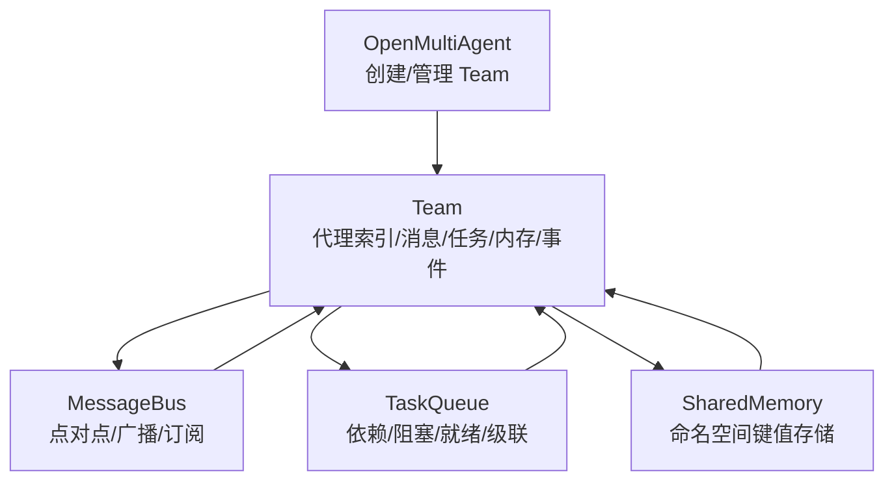
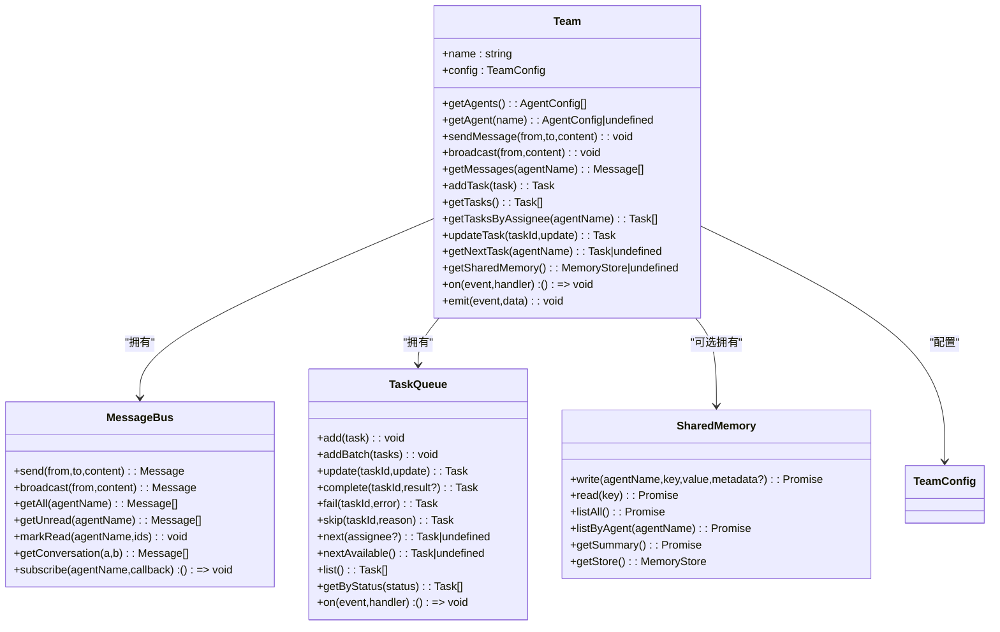
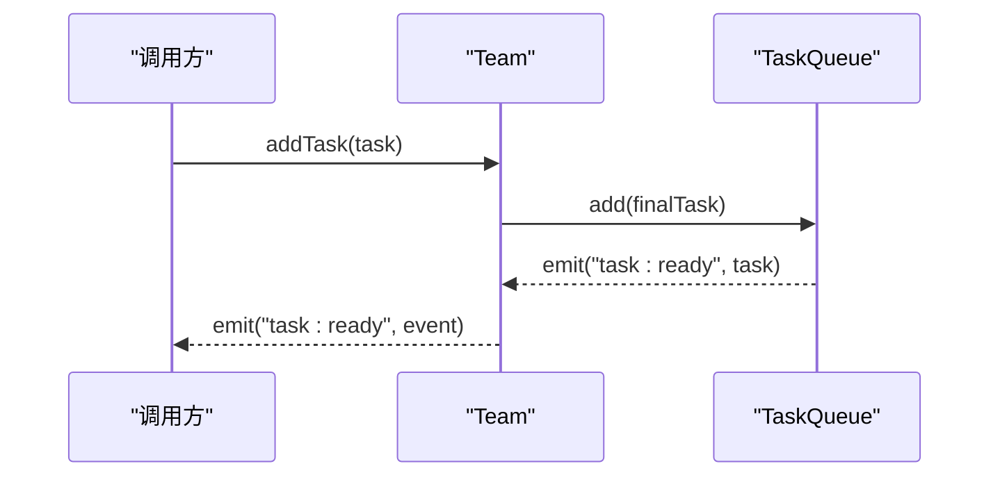
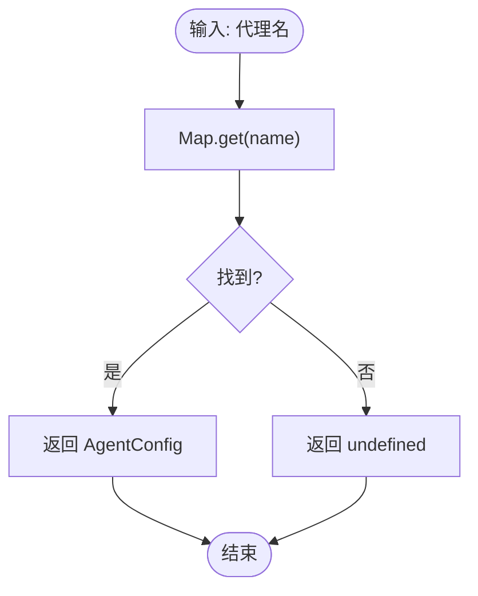
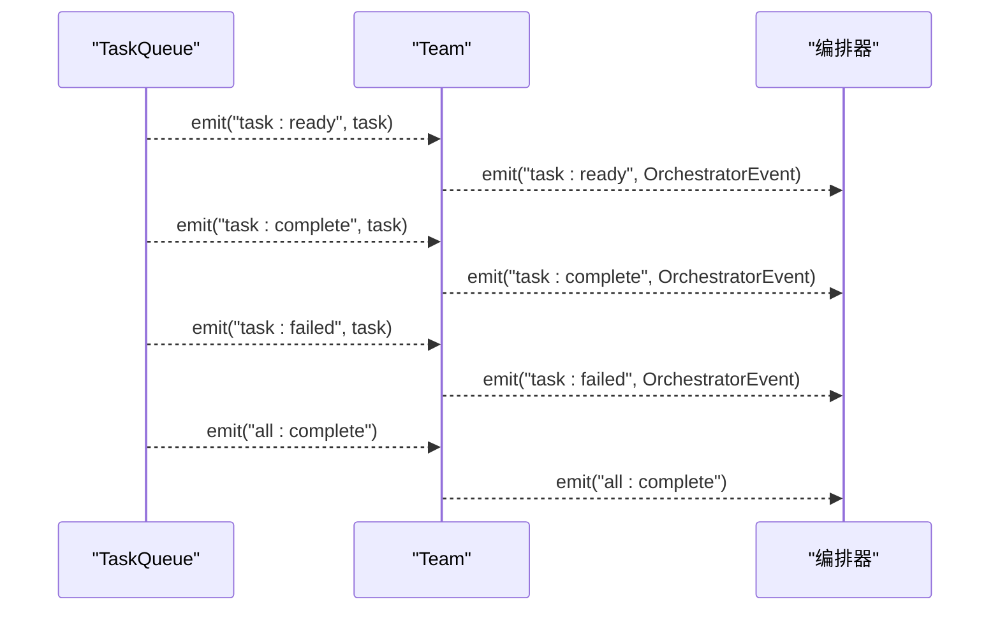
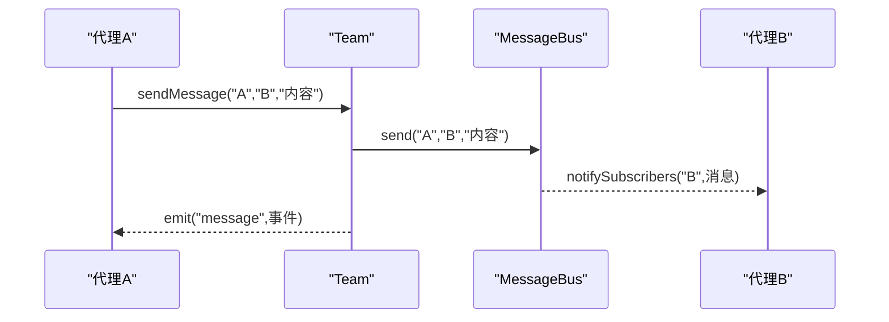
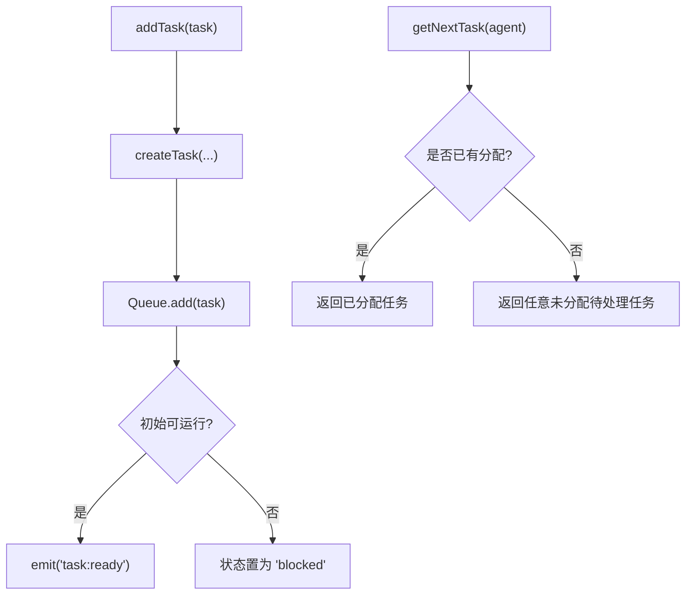
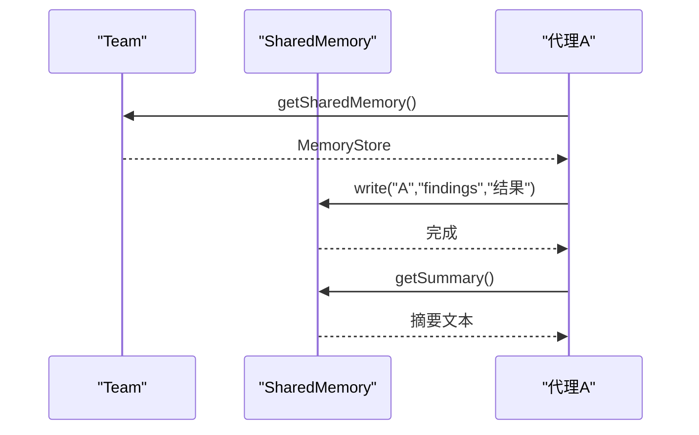
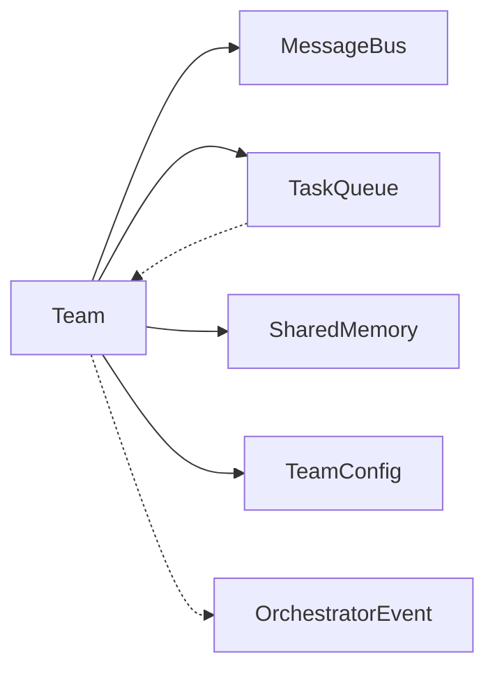

# 团队管理

<cite>
**本文引用的文件**
- [team.ts](file://src/team/team.ts)
- [messaging.ts](file://src/team/messaging.ts)
- [types.ts](file://src/types.ts)
- [shared.ts](file://src/memory/shared.ts)
- [queue.ts](file://src/task/queue.ts)
- [index.ts](file://src/index.ts)
- [orchestrator.ts](file://src/orchestrator/orchestrator.ts)
- [02-team-collaboration.ts](file://examples/02-team-collaboration.ts)
- [04-multi-model-team.ts](file://examples/04-multi-model-team.ts)
- [team-messaging.test.ts](file://tests/team-messaging.test.ts)
</cite>

## 目录
1. [简介](#简介)
2. [项目结构](#项目结构)
3. [核心组件](#核心组件)
4. [架构总览](#架构总览)
5. [详细组件分析](#详细组件分析)
6. [依赖关系分析](#依赖关系分析)
7. [性能考量](#性能考量)
8. [故障排查指南](#故障排查指南)
9. [结论](#结论)
10. [附录](#附录)

## 简介
本文件面向 Open Multi-Agent 框架中的团队管理系统，系统性阐述 Team 类的核心职责与实现细节，包括：
- 代理配置管理：代理注册、按名索引、读取与查询
- 代理查找机制：基于 Map 的 O(1) 查找优化
- 团队生命周期管理：事件桥接、任务队列联动、共享内存集成
- 团队配置选项：名称、代理列表、共享内存开关、最大并发数
- 实用示例：团队创建、代理消息收发、任务增删改查、状态监控
- 最佳实践与常见错误规避

## 项目结构
团队管理位于 src/team 目录，核心文件如下：
- team.ts：Team 核心类，负责代理索引、消息总线、任务队列、共享内存与事件桥接
- messaging.ts：MessageBus，提供点对点与广播消息传递、订阅通知、未读追踪
- types.ts：TeamConfig、Task、OrchestratorEvent 等关键类型定义
- shared.ts：SharedMemory，团队级共享键值存储，支持命名空间写入与摘要生成
- queue.ts：TaskQueue，依赖图驱动的任务队列，支持阻塞/就绪/完成/失败/跳过与级联传播
- index.ts：对外导出 Team、MessageBus、TaskQueue 等类型与模块
- orchestrator.ts：OpenMultiAgent 创建与管理 Team 的入口

图表来源
- [team.ts:88-140](file://src/team/team.ts#L88-L140)
- [messaging.ts:68-233](file://src/team/messaging.ts#L68-L233)
- [queue.ts:55-465](file://src/task/queue.ts#L55-L465)
- [shared.ts:36-182](file://src/memory/shared.ts#L36-L182)
- [orchestrator.ts:556-566](file://src/orchestrator/orchestrator.ts#L556-L566)

章节来源
- [team.ts:1-335](file://src/team/team.ts#L1-L335)
- [messaging.ts:1-233](file://src/team/messaging.ts#L1-L233)
- [types.ts:316-322](file://src/types.ts#L316-L322)
- [shared.ts:1-182](file://src/memory/shared.ts#L1-L182)
- [queue.ts:1-465](file://src/task/queue.ts#L1-L465)
- [index.ts:75-77](file://src/index.ts#L75-L77)
- [orchestrator.ts:556-566](file://src/orchestrator/orchestrator.ts#L556-L566)

## 核心组件
- Team 类：团队协调中心，持有代理清单（Map 索引）、消息总线、任务队列、可选共享内存；提供代理查询、消息发送/广播、任务增删改查、共享内存访问、事件订阅等能力
- MessageBus：轻量级内存消息总线，支持点对点与广播、订阅回调同步通知、按代理未读追踪
- TaskQueue：依赖感知的任务队列，自动阻塞/解阻塞、级联失败/跳过、进度统计与事件发射
- SharedMemory：团队共享键值存储，按“代理名/键”命名空间写入，支持摘要生成与跨代理读取
- TeamConfig：团队静态配置，包含 name、agents、sharedMemory、maxConcurrency

章节来源
- [team.ts:88-335](file://src/team/team.ts#L88-L335)
- [messaging.ts:68-233](file://src/team/messaging.ts#L68-L233)
- [queue.ts:55-465](file://src/task/queue.ts#L55-L465)
- [shared.ts:36-182](file://src/memory/shared.ts#L36-L182)
- [types.ts:316-322](file://src/types.ts#L316-L322)

## 架构总览
Team 将代理配置、消息总线、任务队列与共享内存整合为统一的协作单元，并通过内部 EventBus 向外部暴露生命周期事件。OpenMultiAgent 负责创建与注册 Team，供上层编排器使用。

图表来源
- [team.ts:88-335](file://src/team/team.ts#L88-L335)
- [messaging.ts:68-233](file://src/team/messaging.ts#L68-L233)
- [queue.ts:55-465](file://src/task/queue.ts#L55-L465)
- [shared.ts:36-182](file://src/memory/shared.ts#L36-L182)
- [types.ts:316-322](file://src/types.ts#L316-L322)

## 详细组件分析

### Team 类：代理配置管理与 O(1) 查找
- 代理索引：构造时将传入的 agents 映射为只读 Map，键为代理名，值为 AgentConfig，实现 O(1) 查找
- 代理查询：
  - getAgents 返回注册顺序的浅拷贝数组
  - getAgent 支持按名精确查找，不存在返回 undefined
- 事件桥接：将 TaskQueue 的 task:ready/completion/failure/all:complete 事件转换为 Team 的事件，便于编排器订阅

图表来源
- [team.ts:109-140](file://src/team/team.ts#L109-L140)
- [queue.ts:74-80](file://src/task/queue.ts#L74-L80)

章节来源
- [team.ts:98-158](file://src/team/team.ts#L98-L158)

### 代理查找机制与 O(1) 性能优化
- 使用 Map 以代理名作为键进行索引，查找复杂度为 O(1)
- 适用于大规模代理场景下的快速定位与路由

图表来源
- [team.ts:102-103](file://src/team/team.ts#L102-L103)
- [team.ts:156-158](file://src/team/team.ts#L156-L158)

章节来源
- [team.ts:102-158](file://src/team/team.ts#L102-L158)

### 团队生命周期管理
- 事件桥接：TaskQueue 完成/失败/就绪等事件被 Team 转换为 OrchestratorEvent 并在 Team 的 EventBus 上发出
- 生命周期事件类型：
  - task:ready — 任务变为可运行
  - task:complete — 任务成功完成
  - task:failed — 任务失败
  - all:complete — 队列中所有任务终止
  - message — 点对点消息
  - broadcast — 广播消息
- 自定义事件：Team 提供 emit(event, data)，允许编排器注入领域特定里程碑事件

图表来源
- [team.ts:109-139](file://src/team/team.ts#L109-L139)
- [queue.ts:443-457](file://src/task/queue.ts#L443-L457)

章节来源
- [team.ts:109-139](file://src/team/team.ts#L109-L139)

### 团队配置选项详解
- TeamConfig 字段
  - name: 团队唯一标识
  - agents: 代理配置数组
  - sharedMemory: 是否启用共享内存（默认 false）
  - maxConcurrency: 最大并发数（用于编排器控制，Team 内部不直接消费）
- 配置方法
  - 通过 OpenMultiAgent.createTeam(name, config) 注册团队
  - 在 Team 构造函数中保存 config 并据此初始化内部组件

章节来源
- [types.ts:316-322](file://src/types.ts#L316-L322)
- [orchestrator.ts:556-566](file://src/orchestrator/orchestrator.ts#L556-L566)
- [team.ts:98-107](file://src/team/team.ts#L98-L107)

### 代理映射机制与消息总线
- 代理映射：Map<agentName, AgentConfig>，用于 O(1) 查找与消息路由
- MessageBus 功能
  - send：点对点发送，返回持久化消息
  - broadcast：广播给除发送者外的所有订阅者
  - getAll/getUnread/markRead：按代理维度读取消息与未读状态
  - subscribe：为指定代理注册回调，消息到达时同步触发
- Team 对外接口
  - sendMessage/from/to/content：封装消息发送并发出 message 事件
  - broadcast/from/content：封装广播并发出 broadcast 事件
  - getMessages(agentName)：返回该代理收到的消息（含广播）

图表来源
- [team.ts:170-178](file://src/team/team.ts#L170-L178)
- [messaging.ts:96-115](file://src/team/messaging.ts#L96-L115)
- [messaging.ts:210-231](file://src/team/messaging.ts#L210-L231)

章节来源
- [team.ts:170-201](file://src/team/team.ts#L170-L201)
- [messaging.ts:68-233](file://src/team/messaging.ts#L68-L233)

### 任务管理：创建、分配、更新与查询
- addTask：创建并持久化任务，保留非默认状态（如 blocked），加入队列
- getTasks/getTasksByAssignee：查询全部或按负责人过滤的任务
- updateTask：仅允许更新 status/result/assignee，返回更新后的任务
- getNextTask：优先返回明确分配给该代理的任务，否则回退到首个未分配的待处理任务
- 与队列的联动：TaskQueue 负责依赖解析、阻塞/解阻塞、级联失败/跳过、事件发射

图表来源
- [team.ts:213-273](file://src/team/team.ts#L213-L273)
- [queue.ts:74-80](file://src/task/queue.ts#L74-L80)
- [queue.ts:255-280](file://src/task/queue.ts#L255-L280)

章节来源
- [team.ts:213-273](file://src/team/team.ts#L213-L273)
- [queue.ts:55-465](file://src/task/queue.ts#L55-L465)

### 共享内存：命名空间写入与摘要生成
- 命名空间写入：write(agentName, key, value, metadata?) 将 key 规范化为 "<agentName>/<key>"，并附加 agent 标记
- 读取与列举：read、listAll、listByAgent 支持跨代理读取与按代理分组
- 摘要生成：getSummary 输出人类可读的 Markdown 摘要，按代理分组展示键值，长值截断
- Team 接口：getSharedMemory 返回 MemoryStore 接口；getSharedMemoryInstance 返回完整 SharedMemory 实例

图表来源
- [team.ts:287-299](file://src/team/team.ts#L287-L299)
- [shared.ts:58-159](file://src/memory/shared.ts#L58-L159)

章节来源
- [team.ts:287-299](file://src/team/team.ts#L287-L299)
- [shared.ts:36-182](file://src/memory/shared.ts#L36-L182)

### 实用示例与最佳实践

- 团队创建与代理注册
  - 使用 OpenMultiAgent.createTeam 创建团队，传入 TeamConfig（包含 agents、sharedMemory、maxConcurrency）
  - 示例参考：[02-team-collaboration.ts:109-114](file://examples/02-team-collaboration.ts#L109-L114)

- 代理消息收发
  - 点对点：Team.sendMessage(from, to, content)
  - 广播：Team.broadcast(from, content)
  - 订阅：Team.on('message'|'broadcast', handler)
  - 示例参考：[02-team-collaboration.ts:86-96](file://examples/02-team-collaboration.ts#L86-L96)

- 任务增删改查与状态监控
  - 添加任务：Team.addTask(task)
  - 查询任务：Team.getTasks()/getTasksByAssignee()
  - 更新任务：Team.updateTask(taskId, partial)
  - 下一个任务：Team.getNextTask(agentName)
  - 事件监听：Team.on('task:ready'|'task:complete'|'task:failed'|'all:complete', handler)
  - 示例参考：[team-messaging.test.ts:189-254](file://tests/team-messaging.test.ts#L189-L254)

- 共享内存使用
  - 启用：TeamConfig.sharedMemory=true
  - 写入：Team.getSharedMemory().set(key, value)
  - 读取：Team.getSharedMemory().get(key)
  - 摘要：Team.getSharedMemoryInstance().getSummary()
  - 示例参考：[02-team-collaboration.ts:109-114](file://examples/02-team-collaboration.ts#L109-L114)

- 最佳实践
  - 代理名唯一且稳定：确保 Map 索引与消息路由正确
  - 明确任务依赖：使用 dependsOn 正确表达任务先后关系，避免死锁
  - 合理设置 maxConcurrency：结合模型限流与资源限制
  - 使用共享内存时注意键命名：采用语义化 key，必要时加前缀区分作用域
  - 事件驱动编排：通过 task:ready/completion/failure 事件驱动下一步动作，避免轮询

- 常见错误与规避
  - 重复团队名：OpenMultiAgent.createTeam 会抛错，确保 name 唯一
  - 未找到任务：updateTask 会在找不到 taskId 时抛错，先用 getTasks 或 getNextTask 确认存在
  - 广播误发：to='*' 表示广播，发送者不会收到自身广播
  - 依赖环：TaskQueue 不会自动检测循环依赖，需在设计阶段避免

章节来源
- [02-team-collaboration.ts:109-114](file://examples/02-team-collaboration.ts#L109-L114)
- [02-team-collaboration.ts:86-96](file://examples/02-team-collaboration.ts#L86-L96)
- [team-messaging.test.ts:149-328](file://tests/team-messaging.test.ts#L149-L328)
- [team.ts:98-107](file://src/team/team.ts#L98-L107)
- [team.ts:248-256](file://src/team/team.ts#L248-L256)
- [messaging.ts:113-115](file://src/team/messaging.ts#L113-L115)
- [queue.ts:402-410](file://src/task/queue.ts#L402-L410)

## 依赖关系分析
- Team 依赖
  - MessageBus：消息总线
  - TaskQueue：任务队列
  - SharedMemory：可选共享内存
  - TeamConfig：配置对象
- 事件耦合
  - TaskQueue 事件经 Team 桥接到 Team 的 EventBus
  - 编排器通过 Team 的 on/emit 进行扩展

图表来源
- [team.ts:93-140](file://src/team/team.ts#L93-L140)
- [types.ts:370-383](file://src/types.ts#L370-L383)

章节来源
- [team.ts:93-140](file://src/team/team.ts#L93-L140)
- [types.ts:370-383](file://src/types.ts#L370-L383)

## 性能考量
- 代理查找：Map 索引 O(1)，适合高并发场景
- 任务扫描：unblockDependents 一次性构建任务映射，整体保持 O(n)
- 事件发射：内部 EventBus 使用 Map 存储监听器，订阅/取消订阅为 O(1)
- 广播通知：遍历订阅者集合，但仅在消息到达时触发，开销可控

章节来源
- [team.ts:102-103](file://src/team/team.ts#L102-L103)
- [queue.ts:419-441](file://src/task/queue.ts#L419-L441)

## 故障排查指南
- 无法创建重复团队名
  - 现象：抛出“团队已存在”错误
  - 处理：更换唯一 name，或在重新运行前调用 shutdown 清理
  - 参考：[orchestrator.ts:557-562](file://src/orchestrator/orchestrator.ts#L557-L562)

- 任务更新报错“未找到”
  - 现象：updateTask 抛错
  - 处理：确认 taskId 存在，或使用 getNextTask 获取有效任务
  - 参考：[team.ts:248-256](file://src/team/team.ts#L248-L256)

- 广播未送达
  - 现象：接收者未收到广播
  - 处理：检查订阅是否建立、发送者是否为广播目标；to='*' 表示广播
  - 参考：[messaging.ts:113-115](file://src/team/messaging.ts#L113-L115)

- 依赖导致任务长期阻塞
  - 现象：队列长时间处于 blocked 状态
  - 处理：检查 dependsOn 是否形成环、上游任务是否被标记失败/跳过
  - 参考：[queue.ts:212-225](file://src/task/queue.ts#L212-L225)

章节来源
- [orchestrator.ts:557-562](file://src/orchestrator/orchestrator.ts#L557-L562)
- [team.ts:248-256](file://src/team/team.ts#L248-L256)
- [messaging.ts:113-115](file://src/team/messaging.ts#L113-L115)
- [queue.ts:212-225](file://src/task/queue.ts#L212-L225)

## 结论
Team 类通过 Map 索引、消息总线、任务队列与共享内存的协同，提供了高效、可观测、可扩展的多代理协作基础。其 O(1) 代理查找、事件驱动的生命周期管理以及清晰的配置接口，使得在复杂任务编排与跨代理通信场景下具备良好性能与可维护性。配合合理的任务依赖设计与共享内存命名规范，可显著提升团队运行效率与稳定性。

## 附录
- 相关示例
  - 多代理团队协作：[02-team-collaboration.ts:109-114](file://examples/02-team-collaboration.ts#L109-L114)
  - 多模型与自定义工具：[04-multi-model-team.ts:169-170](file://examples/04-multi-model-team.ts#L169-L170)
- 单元测试覆盖
  - 团队代理查询、消息收发、任务管理、共享内存、事件桥接等行为验证：[team-messaging.test.ts:149-328](file://tests/team-messaging.test.ts#L149-L328)