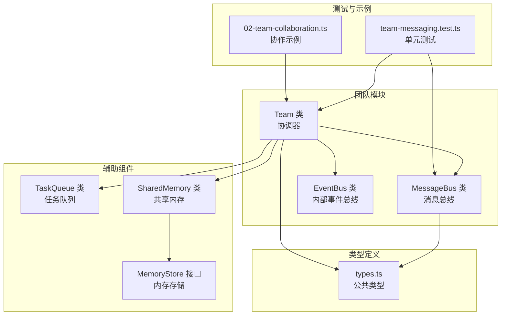
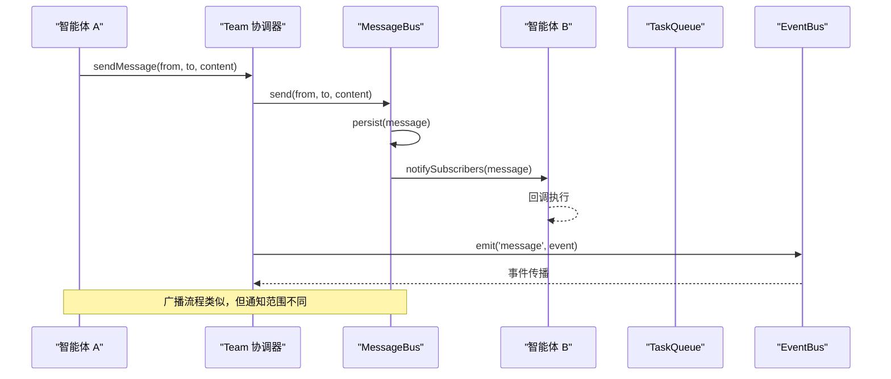
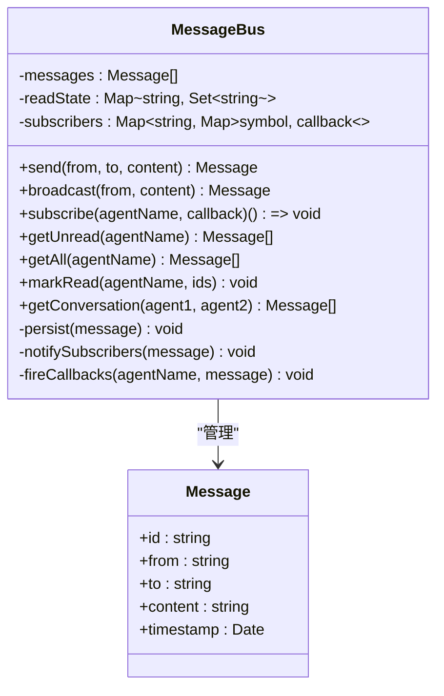
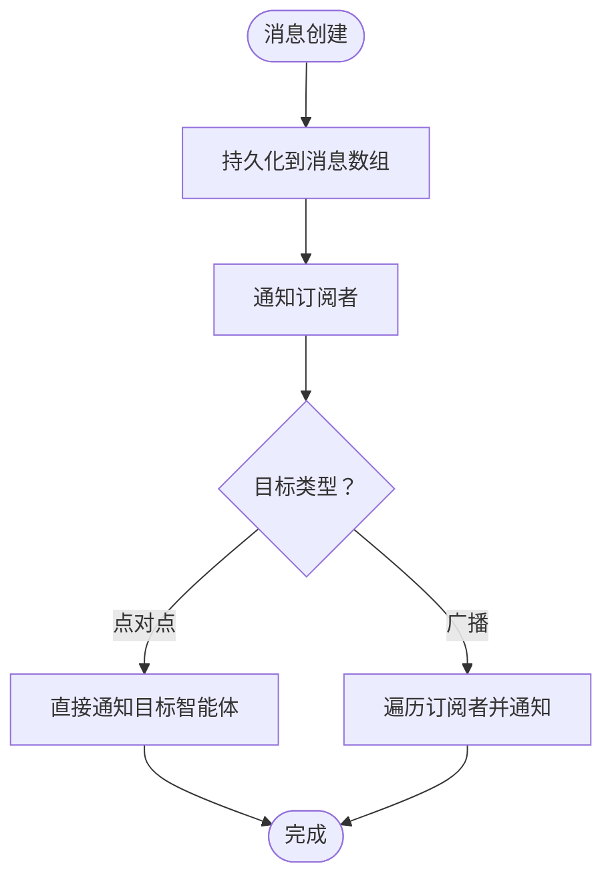
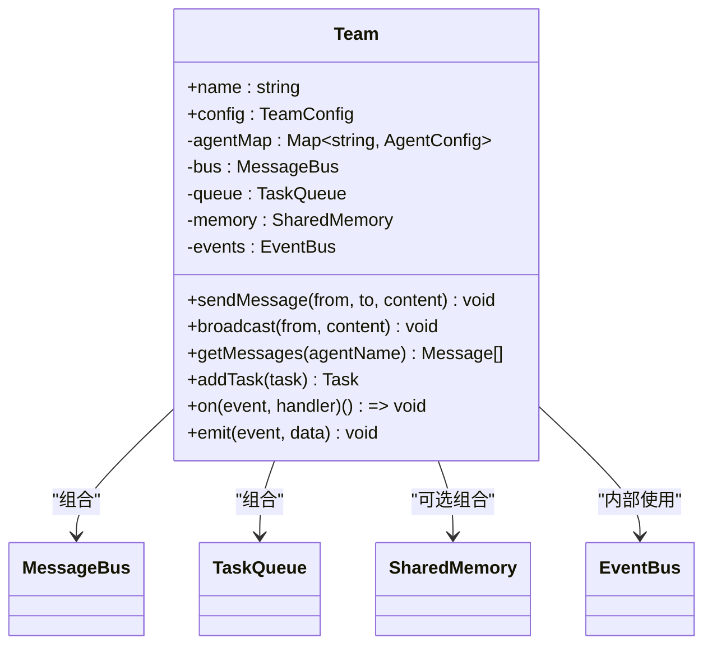
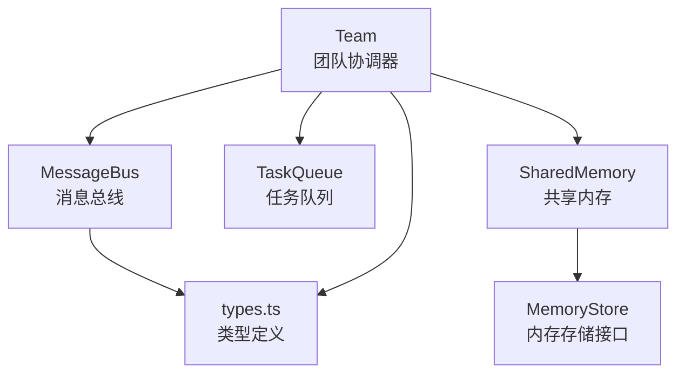

# 消息总线

<cite>
**本文引用的文件**
- [src/team/messaging.ts](file://src/team/messaging.ts)
- [src/team/team.ts](file://src/team/team.ts)
- [src/types.ts](file://src/types.ts)
- [tests/team-messaging.test.ts](file://tests/team-messaging.test.ts)
- [src/memory/shared.ts](file://src/memory/shared.ts)
- [src/memory/store.ts](file://src/memory/store.ts)
- [src/task/queue.ts](file://src/task/queue.ts)
- [examples/02-team-collaboration.ts](file://examples/02-team-collaboration.ts)
</cite>

## 目录
1. [简介](#简介)
2. [项目结构](#项目结构)
3. [核心组件](#核心组件)
4. [架构概览](#架构概览)
5. [详细组件分析](#详细组件分析)
6. [依赖关系分析](#依赖关系分析)
7. [性能考虑](#性能考虑)
8. [故障排除指南](#故障排除指南)
9. [结论](#结论)
10. [附录：API 使用示例](#附录api-使用示例)

## 简介
本文件为 Open Multi-Agent 框架的消息总线系统提供综合技术文档。消息总线是多智能体协作的核心基础设施，负责在智能体之间进行可靠的消息传递与事件分发。该系统实现了以下关键能力：
- 点对点消息传递：支持从一个智能体向另一个指定智能体发送私有消息
- 广播消息机制：支持从一个智能体向所有其他智能体广播消息
- 消息持久化存储：所有消息按插入顺序保存在内存中，支持审计与重放
- 智能体订阅系统：每个智能体可订阅其专属消息回调，实现异步通知
- 未读状态跟踪：为每个智能体维护消息已读/未读状态
- 会话检索：支持按智能体对检索双向对话历史

消息总线通过 Team 协调器对外暴露统一接口，同时与任务队列、共享内存等组件协同工作，形成完整的多智能体编排体系。

## 项目结构
消息总线相关代码主要位于 team 子模块中，配合类型定义、测试用例与示例程序共同构成完整的功能闭环。



**图表来源**
- [src/team/team.ts:88-335](file://src/team/team.ts#L88-L335)
- [src/team/messaging.ts:47-233](file://src/team/messaging.ts#L47-L233)
- [src/types.ts:1-543](file://src/types.ts#L1-L543)
- [tests/team-messaging.test.ts:1-330](file://tests/team-messaging.test.ts#L1-L330)
- [examples/02-team-collaboration.ts:1-168](file://examples/02-team-collaboration.ts#L1-L168)

**章节来源**
- [src/team/messaging.ts:1-233](file://src/team/messaging.ts#L1-L233)
- [src/team/team.ts:1-335](file://src/team/team.ts#L1-L335)
- [src/types.ts:1-543](file://src/types.ts#L1-L543)

## 核心组件
消息总线系统由以下核心组件构成：

### MessageBus（消息总线）
- 职责：提供智能体间的消息传递服务，支持点对点与广播两种模式
- 数据结构：
  - 消息数组：按时间顺序保存所有消息
  - 订阅者映射：按智能体名组织回调函数
  - 已读状态映射：按智能体追踪消息已读集合
- 关键方法：
  - send：创建并持久化点对点消息
  - broadcast：创建并持久化广播消息
  - subscribe：注册智能体专属消息回调
  - getUnread/getAll：查询智能体未读/全部消息
  - markRead：标记消息为已读
  - getConversation：检索双向对话历史

### Team（团队协调器）
- 职责：封装消息总线、任务队列与共享内存，提供统一的多智能体编排接口
- 与消息总线的关系：持有 MessageBus 实例，转发消息发送与查询请求
- 事件桥接：将任务队列事件转换为团队级事件

### EventBus（内部事件总线）
- 职责：轻量级同步事件发射器，用于 Team 内部事件分发
- 特点：基于 Map 结构，支持订阅/取消订阅与事件发射

**章节来源**
- [src/team/messaging.ts:47-233](file://src/team/messaging.ts#L47-L233)
- [src/team/team.ts:88-335](file://src/team/team.ts#L88-L335)

## 架构概览
消息总线采用分层架构设计，确保关注点分离与高内聚低耦合。



**图表来源**
- [src/team/team.ts:164-201](file://src/team/team.ts#L164-L201)
- [src/team/messaging.ts:205-231](file://src/team/messaging.ts#L205-L231)

## 详细组件分析

### MessageBus 类设计
MessageBus 采用纯内存存储，确保消息的持久化与可审计性。



**图表来源**
- [src/team/messaging.ts:47-233](file://src/team/messaging.ts#L47-L233)

#### 消息路由算法
- 点对点路由：直接查找目标智能体的订阅者映射，触发对应回调
- 广播路由：遍历所有订阅者，排除发送者后逐一触发回调
- 路由复杂度：广播场景为 O(N)，其中 N 为订阅者数量；点对点为 O(1)

#### 消息过滤与检索机制
- isAddressedTo 函数：判断消息是否定向到指定智能体
- getUnread：结合已读状态集合过滤未读消息
- getConversation：基于双向匹配检索对话历史
- 时间复杂度：过滤操作为 O(M)，其中 M 为消息总数

#### 消息生命周期管理


**图表来源**
- [src/team/messaging.ts:205-231](file://src/team/messaging.ts#L205-L231)

**章节来源**
- [src/team/messaging.ts:34-41](file://src/team/messaging.ts#L34-L41)
- [src/team/messaging.ts:121-166](file://src/team/messaging.ts#L121-L166)

### Team 类集成
Team 将消息总线与任务队列、共享内存整合为统一的编排入口。



**图表来源**
- [src/team/team.ts:88-335](file://src/team/team.ts#L88-L335)

**章节来源**
- [src/team/team.ts:88-140](file://src/team/team.ts#L88-L140)
- [src/team/team.ts:164-201](file://src/team/team.ts#L164-L201)

### 测试验证与行为保证
测试用例覆盖了消息总线的核心行为：
- 点对点消息传递与发送者排除
- 广播消息的订阅者通知与发送者排除
- 未读状态跟踪与批量标记
- 订阅/取消订阅的生命周期管理
- 双向对话检索的正确性

**章节来源**
- [tests/team-messaging.test.ts:26-143](file://tests/team-messaging.test.ts#L26-L143)

## 依赖关系分析
消息总线系统与其他组件的依赖关系如下：



**图表来源**
- [src/team/team.ts:18-22](file://src/team/team.ts#L18-L22)
- [src/memory/shared.ts:10-11](file://src/memory/shared.ts#L10-L11)
- [src/types.ts:1-10](file://src/types.ts#L1-L10)

**章节来源**
- [src/team/team.ts:18-22](file://src/team/team.ts#L18-L22)
- [src/memory/shared.ts:10-11](file://src/memory/shared.ts#L10-L11)

## 性能考虑
- 时间复杂度
  - 消息发送：O(1)（数组追加 + 订阅者通知）
  - 广播通知：O(N)（N 为活跃订阅者数）
  - 未读查询：O(M)（M 为消息总数）
  - 对话检索：O(M)（双向匹配过滤）
- 空间复杂度
  - 消息存储：O(M)
  - 订阅者映射：O(N + M)（N 为智能体数，M 为消息数）
  - 已读状态：O(M)
- 优化建议
  - 大规模广播时考虑分批通知或去重策略
  - 长时间运行场景下定期清理历史消息以控制内存占用
  - 对高频订阅者实施背压机制避免阻塞主事件循环

[本节为通用性能指导，不直接分析具体文件]

## 故障排除指南
- 常见问题
  - 消息未送达：检查订阅者是否已注册且目标智能体名称正确
  - 广播被发送者接收：确认 isAddressedTo 逻辑与发送者排除规则
  - 未读状态异常：验证 markRead 调用时机与消息 ID 正确性
- 调试技巧
  - 利用 getAll 获取完整消息列表进行审计
  - 通过 getUnread 验证未读计数一致性
  - 使用 getConversation 检查双向通信链路

**章节来源**
- [tests/team-messaging.test.ts:39-43](file://tests/team-messaging.test.ts#L39-L43)
- [tests/team-messaging.test.ts:107-115](file://tests/team-messaging.test.ts#L107-L115)

## 结论
Open Multi-Agent 框架的消息总线系统通过简洁而高效的架构实现了可靠的智能体间通信。其内存持久化设计确保了消息的可审计性与重放能力，订阅者模型提供了灵活的通知机制。配合 Team 协调器的任务队列与共享内存，形成了完整的多智能体协作基础设施。未来可在大规模场景下引入消息分页、持久化存储与分布式通知等增强特性。

[本节为总结性内容，不直接分析具体文件]

## 附录：API 使用示例

### 基础消息发送
```typescript
// 创建消息总线实例
const bus = new MessageBus()

// 注册订阅者
const unsubscribe = bus.subscribe('worker', (msg) => {
  console.log(`worker 收到: ${msg.content}`)
})

// 发送点对点消息
bus.send('coordinator', 'worker', '开始任务 A')

// 发送广播消息
bus.broadcast('coordinator', '所有智能体注意')

// 取消订阅
unsubscribe()
```

**章节来源**
- [src/team/messaging.ts:54-66](file://src/team/messaging.ts#L54-L66)

### Team 协调器消息接口
```typescript
// Team 提供的统一消息接口
team.sendMessage('alice', 'bob', '你好')
team.broadcast('alice', '全体注意')

// 查询消息
const messages = team.getMessages('bob')
```

**章节来源**
- [src/team/team.ts:164-186](file://src/team/team.ts#L164-L186)
- [src/team/team.ts:188-201](file://src/team/team.ts#L188-L201)

### 事件驱动的消息处理
```typescript
// 订阅团队事件
team.on('message', (event) => {
  const orchestratorEvent = event as OrchestratorEvent
  console.log(`收到消息: ${orchestratorEvent.agent} → ${orchestratorEvent.data}`)
})

team.on('broadcast', (event) => {
  console.log('收到广播消息')
})
```

**章节来源**
- [src/team/team.ts:305-323](file://src/team/team.ts#L305-L323)

### 示例：多智能体团队协作
```typescript
// 在示例中，Team 通过消息总线实现智能体间的协作与进度跟踪
const team = orchestrator.createTeam('api-team', {
  name: 'api-team',
  agents: [architect, developer, reviewer],
  sharedMemory: true,
  maxConcurrency: 1,
})
```

**章节来源**
- [examples/02-team-collaboration.ts:109-114](file://examples/02-team-collaboration.ts#L109-L114)