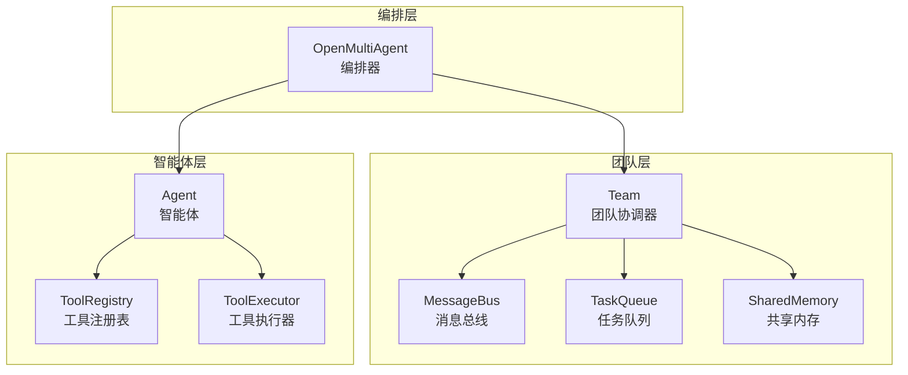
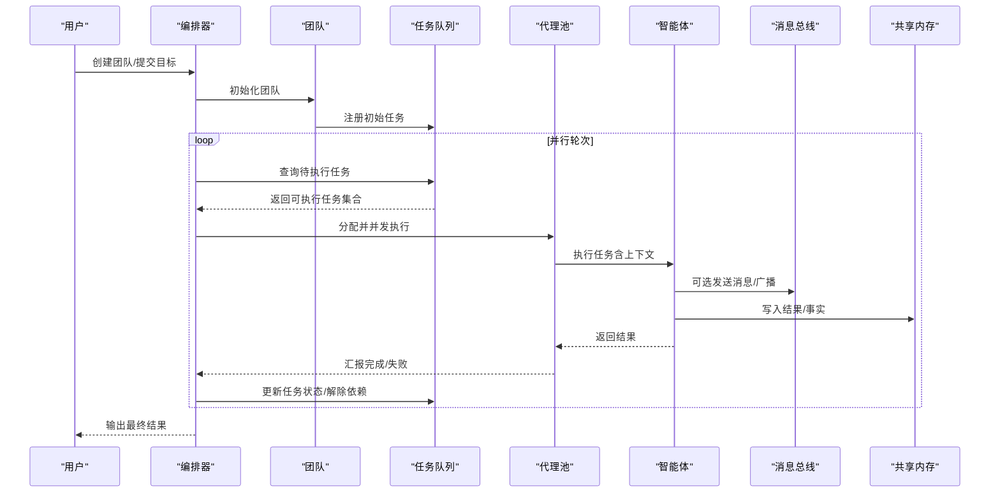
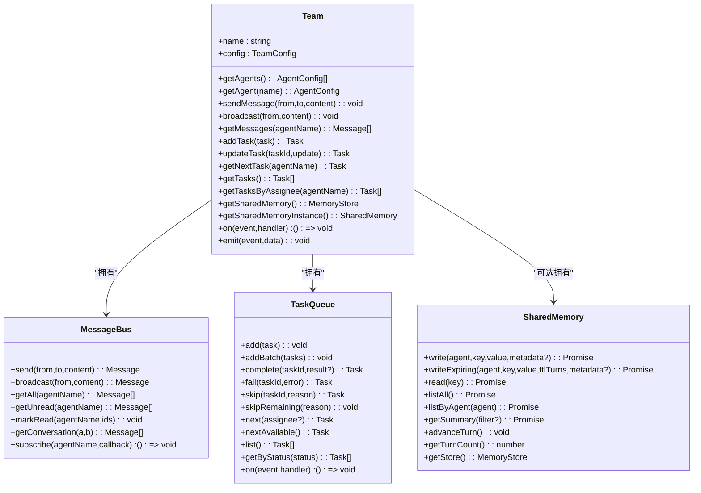
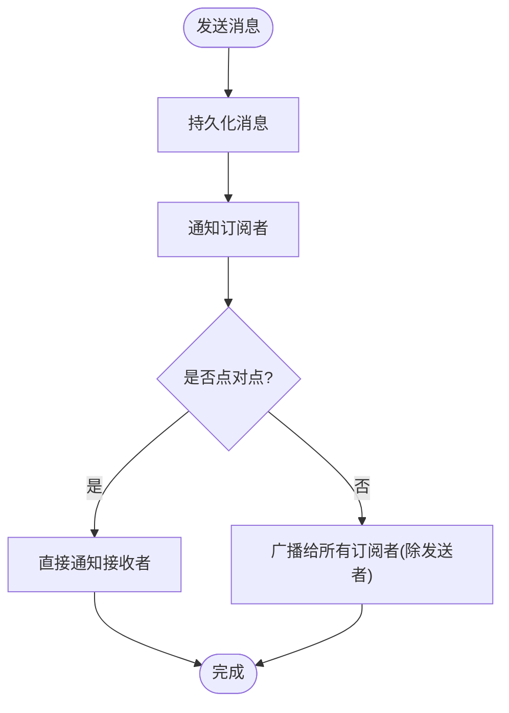
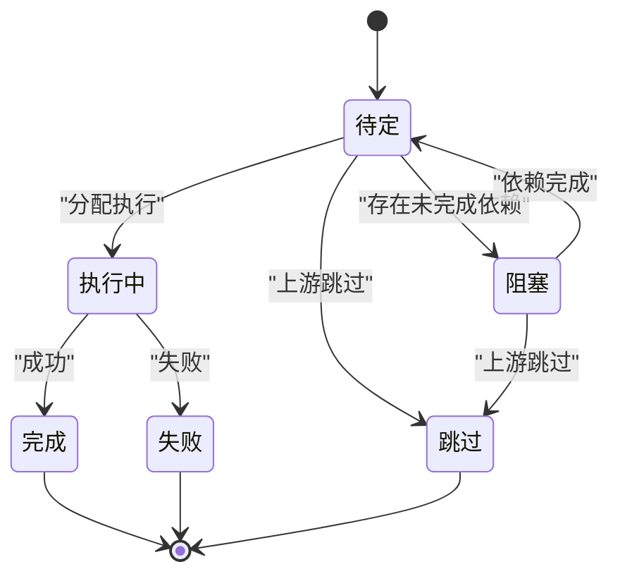
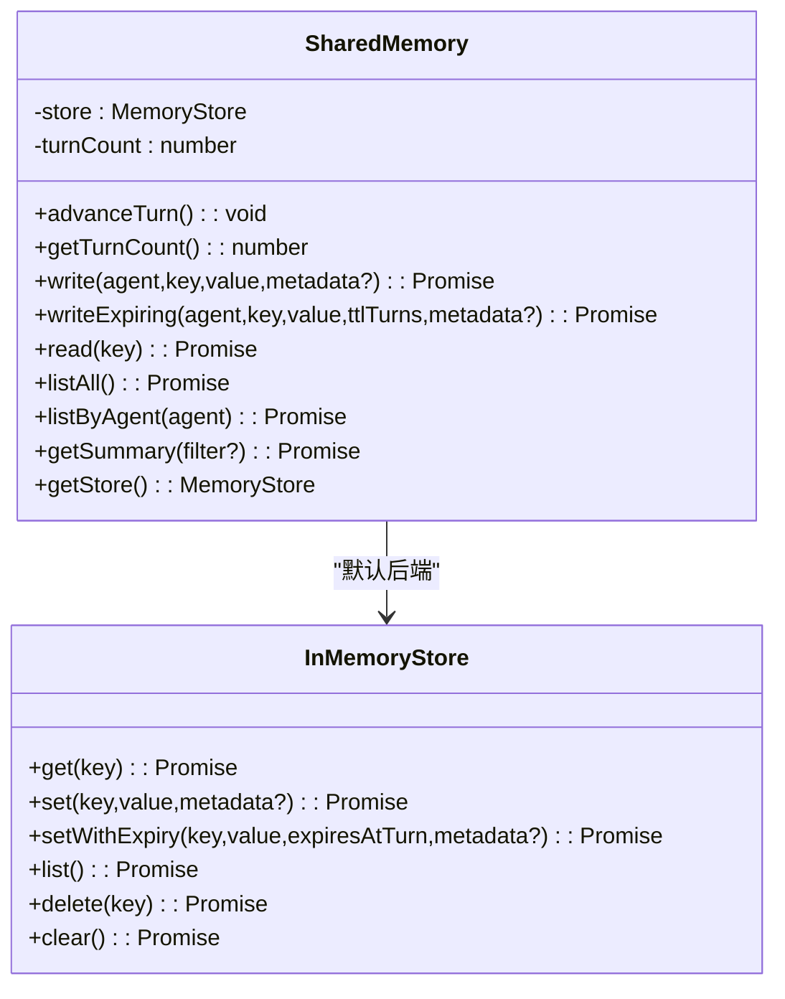
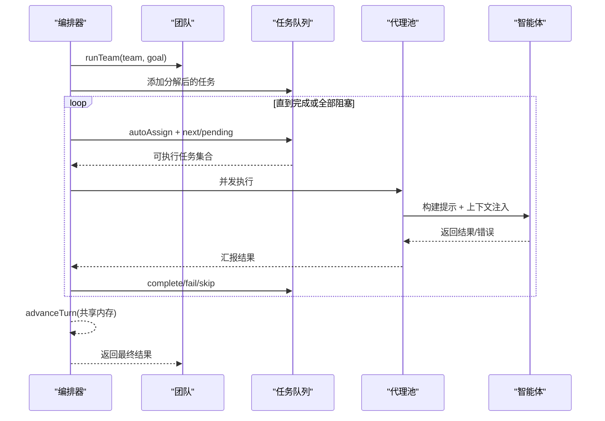
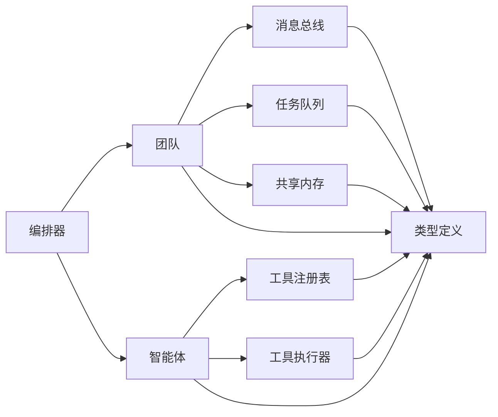

# 团队管理与消息传递

<cite>
**本文引用的文件**
- [src/team/team.ts](file://src/team/team.ts)
- [src/team/messaging.ts](file://src/team/messaging.ts)
- [src/memory/shared.ts](file://src/memory/shared.ts)
- [src/memory/store.ts](file://src/memory/store.ts)
- [src/orchestrator/orchestrator.ts](file://src/orchestrator/orchestrator.ts)
- [src/task/queue.ts](file://src/task/queue.ts)
- [src/tool/framework.ts](file://src/tool/framework.ts)
- [src/tool/built-in/index.ts](file://src/tool/built-in/index.ts)
- [src/agent/agent.ts](file://src/agent/agent.ts)
- [src/types.ts](file://src/types.ts)
- [examples/basics/team-collaboration.ts](file://examples/basics/team-collaboration.ts)
- [examples/integrations/with-engram/research-team.ts](file://examples/integrations/with-engram/research-team.ts)
- [examples/integrations/with-engram/team-research.ts](file://examples/integrations/with-engram/team-research.ts)
- [tests/team-messaging.test.ts](file://tests/team-messaging.test.ts)
- [tests/shared-memory.test.ts](file://tests/shared-memory.test.ts)
</cite>

## 目录
1. [引言](#引言)
2. [项目结构](#项目结构)
3. [核心组件](#核心组件)
4. [架构总览](#架构总览)
5. [详细组件分析](#详细组件分析)
6. [依赖关系分析](#依赖关系分析)
7. [性能考量](#性能考量)
8. [故障排查指南](#故障排查指南)
9. [结论](#结论)
10. [附录](#附录)

## 引言
本文件围绕“团队管理与消息传递”主题，系统性阐述团队的概念、成员与角色管理、任务编排、智能体间通信协议、共享内存系统、上下文注入与团队信息传递，并结合示例展示团队创建、成员添加、协作执行与工具注册。文档兼顾初学者与高级开发者：既解释基本概念与使用方法，也提供扩展与定制建议。

## 项目结构
本项目采用模块化设计，核心围绕 Team（团队）、MessageBus（消息总线）、TaskQueue（任务队列）、SharedMemory（共享内存）与 Orchestrator（编排器）协同工作。Agent 负责对话与工具调用；ToolRegistry/Executor 提供工具注册与执行；类型系统统一了接口契约。

图示来源
- [src/team/team.ts](file://src/team/team.ts)
- [src/team/messaging.ts](file://src/team/messaging.ts)
- [src/task/queue.ts](file://src/task/queue.ts)
- [src/memory/shared.ts](file://src/memory/shared.ts)
- [src/orchestrator/orchestrator.ts](file://src/orchestrator/orchestrator.ts)
- [src/agent/agent.ts](file://src/agent/agent.ts)
- [src/tool/framework.ts](file://src/tool/framework.ts)

章节来源
- [src/team/team.ts](file://src/team/team.ts)
- [src/team/messaging.ts](file://src/team/messaging.ts)
- [src/task/queue.ts](file://src/task/queue.ts)
- [src/memory/shared.ts](file://src/memory/shared.ts)
- [src/orchestrator/orchestrator.ts](file://src/orchestrator/orchestrator.ts)
- [src/agent/agent.ts](file://src/agent/agent.ts)
- [src/tool/framework.ts](file://src/tool/framework.ts)

## 核心组件
- Team：团队协调器，聚合代理名单、消息总线、任务队列与可选共享内存，提供事件总线桥接与生命周期事件。
- MessageBus：轻量级点对点/广播消息总线，保留历史消息、跟踪已读状态、按订阅者异步通知。
- TaskQueue：依赖感知的任务队列，支持阻塞/就绪/完成/失败/跳过状态机与拓扑解耦。
- SharedMemory：命名空间化的共享内存，支持 TTL 过期、turn 计数推进、摘要生成与自定义存储后端注入。
- OpenMultiAgent：顶层编排器，负责任务分解、自动分配、并发调度、重试与可观测性追踪。
- Agent：智能体封装，管理对话历史、运行状态、动态工具注册与流式输出。
- ToolRegistry/Executor：工具定义框架与执行器，支持 Zod 输入校验、JSON Schema 导出、运行时工具注册。

章节来源
- [src/team/team.ts](file://src/team/team.ts)
- [src/team/messaging.ts](file://src/team/messaging.ts)
- [src/task/queue.ts](file://src/task/queue.ts)
- [src/memory/shared.ts](file://src/memory/shared.ts)
- [src/orchestrator/orchestrator.ts](file://src/orchestrator/orchestrator.ts)
- [src/agent/agent.ts](file://src/agent/agent.ts)
- [src/tool/framework.ts](file://src/tool/framework.ts)

## 架构总览
下图展示了从编排器到团队、再到智能体与工具的整体交互流程，以及消息与任务在其中的流转路径。

图示来源
- [src/orchestrator/orchestrator.ts](file://src/orchestrator/orchestrator.ts)
- [src/team/team.ts](file://src/team/team.ts)
- [src/team/messaging.ts](file://src/team/messaging.ts)
- [src/task/queue.ts](file://src/task/queue.ts)
- [src/memory/shared.ts](file://src/memory/shared.ts)
- [src/agent/agent.ts](file://src/agent/agent.ts)

## 详细组件分析

### 组件一：Team（团队协调器）
- 角色与职责
  - 管理代理名单（按名称索引，O(1) 查找）
  - 维护消息总线、任务队列与可选共享内存实例
  - 将任务队列事件桥接到团队事件总线上，便于编排器监听
  - 对外暴露消息发送/广播、任务增删改查、共享内存访问与事件订阅
- 关键能力
  - 成员管理：getAgents()/getAgent()
  - 消息传递：sendMessage()/broadcast()/getMessages()
  - 任务管理：addTask()/updateTask()/getNextTask()/getTasks()/getTasksByAssignee()
  - 共享内存：getSharedMemory()/getSharedMemoryInstance()
  - 事件系统：on()/emit()（内置 task:ready/complete/failed/all:complete/message/broadcast）

图示来源
- [src/team/team.ts](file://src/team/team.ts)
- [src/team/messaging.ts](file://src/team/messaging.ts)
- [src/task/queue.ts](file://src/task/queue.ts)
- [src/memory/shared.ts](file://src/memory/shared.ts)

章节来源
- [src/team/team.ts](file://src/team/team.ts)
- [src/team/messaging.ts](file://src/team/messaging.ts)
- [src/task/queue.ts](file://src/task/queue.ts)
- [src/memory/shared.ts](file://src/memory/shared.ts)

### 组件二：MessageBus（消息总线）
- 设计要点
  - 消息持久化：所有消息按插入顺序保存，支持审计与回放
  - 已读跟踪：按代理维护已读消息集合，未读消息可单独查询
  - 订阅模型：按代理名订阅，新消息到达时同步回调通知
  - 广播规则：to='*' 表示广播，除发送者外全体接收
- 复杂度与一致性
  - 读写均为 O(1) 插入，遍历过滤为 O(n)
  - 通过 Map/Set 实现高效查找与去重
  - 不保证跨进程一致性（单进程内存总线）

图示来源
- [src/team/messaging.ts](file://src/team/messaging.ts)

章节来源
- [src/team/messaging.ts](file://src/team/messaging.ts)
- [tests/team-messaging.test.ts](file://tests/team-messaging.test.ts)

### 组件三：TaskQueue（任务队列）
- 状态机
  - 初始：pending
  - 依赖满足：pending → blocked（等待上游完成）
  - 上游完成：blocked → pending（触发 task:ready）
  - 执行中：pending → in_progress
  - 结束：complete 或 failed（触发 task:complete/task:failed）
  - 跳过：skip（触发 task:skipped）
- 依赖传播
  - 完成任务会扫描并解除被其满足的阻塞任务
  - 失败/跳过会级联影响下游任务
- 查询与批处理
  - 支持 next()/nextAvailable() 选择下一个可执行任务
  - 支持批量添加与进度统计

图示来源
- [src/task/queue.ts](file://src/task/queue.ts)

章节来源
- [src/task/queue.ts](file://src/task/queue.ts)
- [tests/team-messaging.test.ts](file://tests/team-messaging.test.ts)

### 组件四：SharedMemory（共享内存）
- 命名空间隔离
  - 写入以 "<agent>/<key>" 命名，确保不同代理写入不冲突且可溯源
  - 读取支持完全限定键与跨代理读取
- TTL 与回合计数
  - writeExpiring 支持基于回合计数的过期策略，advanceTurn 推进计数
  - 读取时过滤过期项，不过期删除由底层存储实现（避免竞态）
- 摘要与上下文注入
  - getSummary 生成 Markdown 风格摘要，适合注入到智能体上下文
  - 支持按任务 ID 过滤摘要内容
- 自定义存储后端
  - 通过 MemoryStore 接口注入任意后端（如 Engram），默认 InMemoryStore
  - 形状校验防止错误对象进入

图示来源
- [src/memory/shared.ts](file://src/memory/shared.ts)
- [src/memory/store.ts](file://src/memory/store.ts)

章节来源
- [src/memory/shared.ts](file://src/memory/shared.ts)
- [src/memory/store.ts](file://src/memory/store.ts)
- [tests/shared-memory.test.ts](file://tests/shared-memory.test.ts)

### 组件五：Orchestrator（编排器）
- 协调模式
  - 临时“协调者”代理将高层目标分解为任务，分配并合成最终答案
  - 默认并行执行独立任务，受 maxConcurrency 控制
  - 失败任务标记失败并阻断其直接下游，非依赖任务继续
- 事件与可观测性
  - onProgress 回调提供结构化事件（agent_start/agent_complete/task_start/task_complete/error/budget_exceeded 等）
  - onTrace 支持追踪事件（任务、流式事件、预算超限）
- 任务提示构建与上下文注入
  - buildTaskPrompt 将任务描述与依赖上下文注入到每个智能体提示中
  - revealCoordinator 选项可向每个代理注入团队目标与角色信息
- 重试与预算
  - executeWithRetry 支持指数退避与最大尝试次数
  - TokenBudgetExceededError 在超出预算时触发事件并跳过剩余任务

图示来源
- [src/orchestrator/orchestrator.ts](file://src/orchestrator/orchestrator.ts)
- [src/task/queue.ts](file://src/task/queue.ts)
- [src/memory/shared.ts](file://src/memory/shared.ts)

章节来源
- [src/orchestrator/orchestrator.ts](file://src/orchestrator/orchestrator.ts)
- [src/task/queue.ts](file://src/task/queue.ts)
- [src/memory/shared.ts](file://src/memory/shared.ts)

### 组件六：Agent（智能体）
- 生命周期与状态
  - idle → running → completed/error
  - 管理对话历史，支持一次性运行（run）与持续对话（prompt）
- 工具集成
  - ToolRegistry 动态注册/注销工具
  - ToolExecutor 执行工具调用，支持输出压缩与长度限制
- 结构化输出
  - 支持输出模式约束（JSON/Markdown 等），通过指令注入系统提示

章节来源
- [src/agent/agent.ts](file://src/agent/agent.ts)
- [src/tool/framework.ts](file://src/tool/framework.ts)

### 组件七：工具注册与权限控制
- 工具注册
  - defineTool 定义工具（输入/输出 Zod 校验、LLM Schema、最大输出字符）
  - ToolRegistry.register/get/list/has/unregister
  - registerBuiltInTools 一键注册内置工具（含 delegate_to_agent 可选）
- 权限与白名单
  - AgentConfig.tools/disallowedTools 控制可用工具集合
  - 自定义工具 customTools 直接注入，绕过预设过滤但受禁用列表限制
- 委托执行
  - runDelegatedAgent 在编排池中安全地为另一个代理运行一次对话，避免死锁

章节来源
- [src/tool/framework.ts](file://src/tool/framework.ts)
- [src/tool/built-in/index.ts](file://src/tool/built-in/index.ts)
- [src/orchestrator/orchestrator.ts](file://src/orchestrator/orchestrator.ts)

## 依赖关系分析
- 耦合与内聚
  - Team 内聚消息、任务与内存，作为团队边界；与编排器通过事件解耦
  - MessageBus 与 TaskQueue 低耦合，仅通过事件与查询接口交互
  - SharedMemory 通过 MemoryStore 接口与 Team/Orchestrator 解耦
- 外部依赖
  - LLM 适配器（通过 createAdapter 注入）
  - 工具后端（Shell/文件系统/Grep 等）
- 潜在循环
  - 无直接循环导入；类型通过 types.ts 单一出口导出

图示来源
- [src/orchestrator/orchestrator.ts](file://src/orchestrator/orchestrator.ts)
- [src/team/team.ts](file://src/team/team.ts)
- [src/team/messaging.ts](file://src/team/messaging.ts)
- [src/task/queue.ts](file://src/task/queue.ts)
- [src/memory/shared.ts](file://src/memory/shared.ts)
- [src/agent/agent.ts](file://src/agent/agent.ts)
- [src/tool/framework.ts](file://src/tool/framework.ts)
- [src/types.ts](file://src/types.ts)

章节来源
- [src/types.ts](file://src/types.ts)
- [src/orchestrator/orchestrator.ts](file://src/orchestrator/orchestrator.ts)
- [src/team/team.ts](file://src/team/team.ts)

## 性能考量
- 并发与吞吐
  - maxConcurrency 控制并发上限，避免资源争用
  - 并行批处理任务在一轮完成后才检查新解封任务，减少上下文切换
- 内存与 IO
  - MessageBus 与 SharedMemory 默认内存实现适合单进程场景；生产环境建议注入持久化存储
  - InMemoryStore 的 search/list 为线性扫描，大数据量需索引层
- 令牌预算与成本
  - TokenBudgetExceededError 触发后跳过剩余任务，避免超额消耗
  - 重试策略带指数退避，注意最大延迟上限
- 上下文压缩
  - ContextStrategy 支持滑动窗口/摘要/紧凑化等策略，降低长对话开销

## 故障排查指南
- 任务无法执行
  - 检查依赖是否全部完成；查看队列状态与事件日志
  - 使用 queue.getProgress() 获取各状态计数
- 消息未送达
  - 确认订阅者是否已注册；广播时发送者不会收到消息
  - 使用 getUnread()/getAll() 验证消息留存与已读状态
- 共享内存异常
  - 检查自定义存储后端是否实现必需方法；确认命名空间前缀正确
  - TTL 未生效时确认底层存储是否支持 setWithExpiry
- 编排器无响应
  - 检查 onProgress/onTrace 是否正确设置；确认 AbortSignal 未提前中止
  - 审核 maxTokenBudget 与重试参数，避免无限重试

章节来源
- [src/task/queue.ts](file://src/task/queue.ts)
- [src/team/messaging.ts](file://src/team/messaging.ts)
- [src/memory/shared.ts](file://src/memory/shared.ts)
- [src/orchestrator/orchestrator.ts](file://src/orchestrator/orchestrator.ts)

## 结论
该系统以 Team 为核心，通过消息总线与任务队列实现智能体间的松耦合协作，借助共享内存与回合 TTL 提供可控的上下文与状态同步。编排器负责任务分解、并发调度与可观测性，配合工具注册与权限控制形成完整的团队协作闭环。对于初学者，建议从示例入手；对于高级用户，可通过自定义存储后端、工具与上下文策略进行深度定制。

## 附录

### 示例：团队协作与消息传递
- 基础示例：多智能体团队协作，Sequential 执行，展示进度回调与结果汇总
- Engram 集成：将 Engram 作为共享内存后端，Orchestrator 自动注入任务结果摘要

章节来源
- [examples/basics/team-collaboration.ts](file://examples/basics/team-collaboration.ts)
- [examples/integrations/with-engram/research-team.ts](file://examples/integrations/with-engram/research-team.ts)
- [examples/integrations/with-engram/team-research.ts](file://examples/integrations/with-engram/team-research.ts)

### 测试覆盖
- 消息总线：点对点/广播/订阅/已读状态/对话检索
- 任务队列：状态转换/级联失败/进度统计/事件监听
- 共享内存：命名空间/元数据/摘要/自定义存储/回合 TTL

章节来源
- [tests/team-messaging.test.ts](file://tests/team-messaging.test.ts)
- [tests/shared-memory.test.ts](file://tests/shared-memory.test.ts)