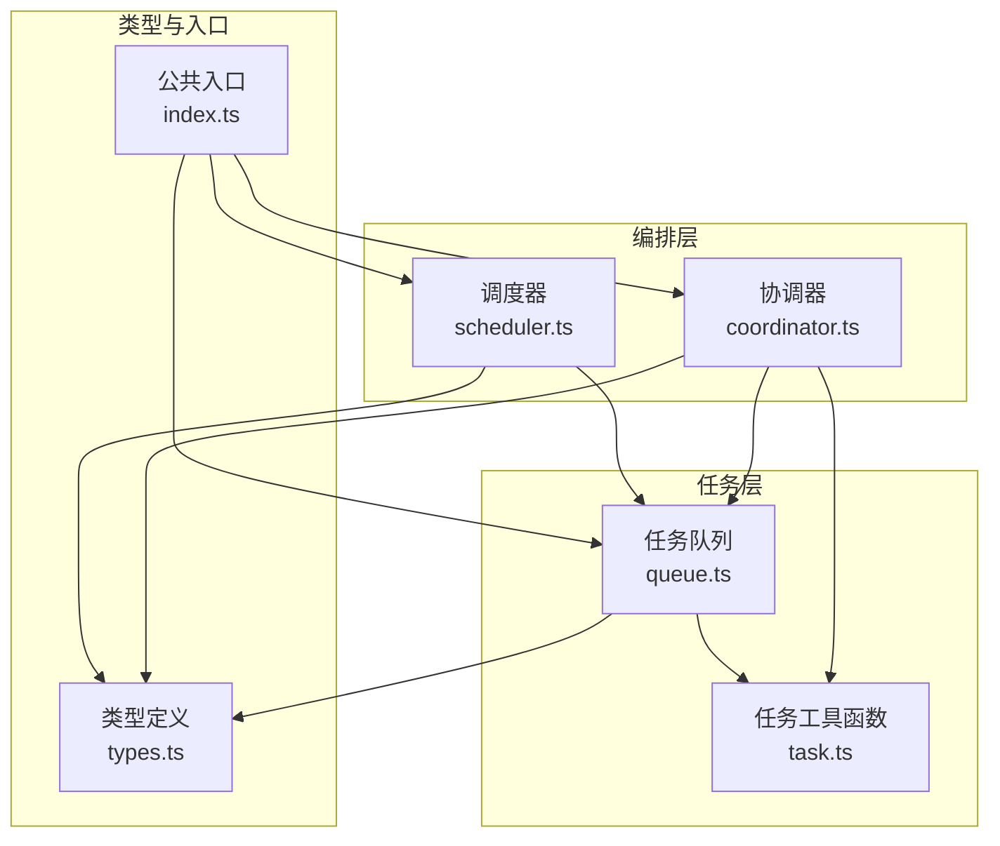
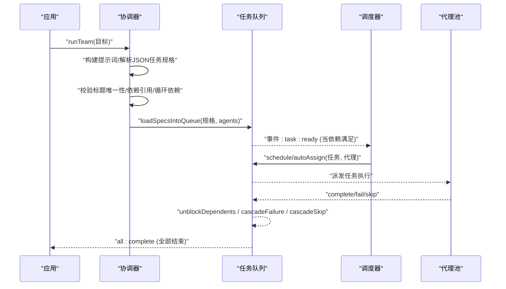
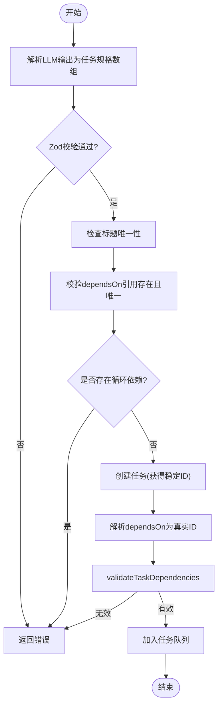
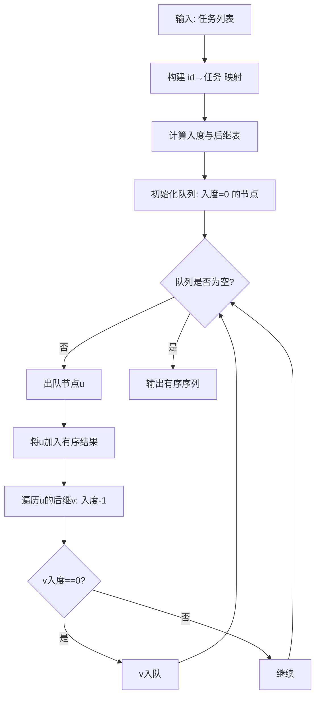
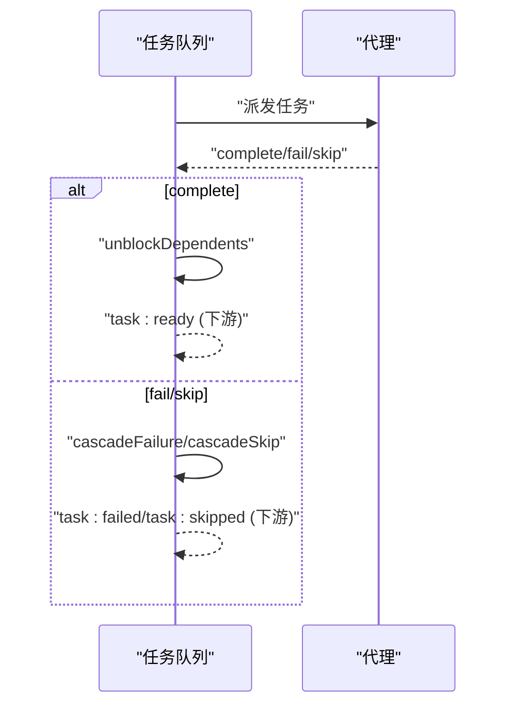
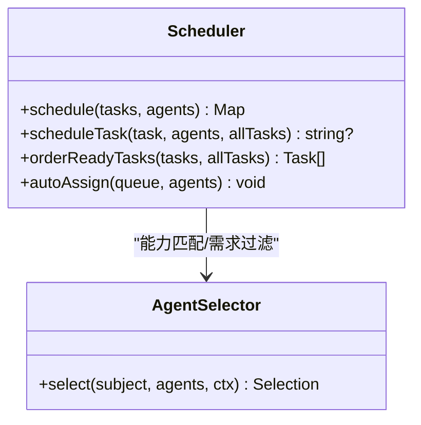
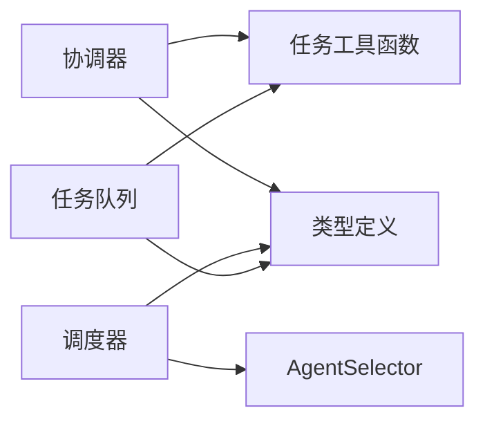

# 任务图生成

<cite>
**本文引用的文件**
- [README.md](file://README.md)
- [AGENTS.md](file://AGENTS.md)
- [index.ts](file://packages/core/src/index.ts)
- [types.ts](file://packages/core/src/types.ts)
- [coordinator.ts](file://packages/core/src/orchestrator/coordinator.ts)
- [scheduler.ts](file://packages/core/src/orchestrator/scheduler.ts)
- [task.ts](file://packages/core/src/task/task.ts)
- [queue.ts](file://packages/core/src/task/queue.ts)
- [task-scheduling.md](file://docs/task-scheduling.md)
</cite>

## 目录
1. [简介](#简介)
2. [项目结构](#项目结构)
3. [核心组件](#核心组件)
4. [架构总览](#架构总览)
5. [详细组件分析](#详细组件分析)
6. [依赖关系分析](#依赖关系分析)
7. [性能考量](#性能考量)
8. [故障排查指南](#故障排查指南)
9. [结论](#结论)
10. [附录](#附录)

## 简介
本文件面向“Open Multi-Agent”的任务图（DAG）生成与执行，系统性说明协调器如何根据目标自动构建有向无环图、建立任务依赖、检测循环依赖、优化执行顺序；并深入解释任务图的验证过程（依赖完整性检查、拓扑排序、并行机会识别）、数据结构设计、内存管理策略以及大规模任务图的性能优化技巧。文档同时提供代码级流程图与时序图，帮助初学者理解 DAG 基础概念，并为高级用户提供算法实现与调优参考。

## 项目结构
Open Multi-Agent 的核心编排能力集中在 @open-multi-agent/core 包中，围绕“协调器—调度器—任务队列—任务工具函数”的层次组织：
- 协调器：负责将高层目标分解为任务规格，校验并加载到任务队列。
- 任务工具函数：提供任务创建、就绪判断、拓扑排序与依赖校验等纯函数。
- 任务队列：维护任务状态机、事件驱动推进、失败/跳过级联与快照恢复。
- 调度器：基于多种策略将待分配任务映射到可用代理，支持关键路径优先与负载均衡。
- 类型定义：统一描述 Task、OrchestratorConfig、TaskRequirements 等核心类型。

**图表来源**
- [coordinator.ts:1-800](file://packages/core/src/orchestrator/coordinator.ts#L1-L800)
- [scheduler.ts:1-566](file://packages/core/src/orchestrator/scheduler.ts#L1-L566)
- [task.ts:1-262](file://packages/core/src/task/task.ts#L1-L262)
- [queue.ts:1-800](file://packages/core/src/task/queue.ts#L1-L800)
- [types.ts:1340-2311](file://packages/core/src/types.ts#L1340-L2311)
- [index.ts:1-477](file://packages/core/src/index.ts#L1-L477)

**章节来源**
- [AGENTS.md:64-70](file://AGENTS.md#L64-L70)
- [index.ts:157-159](file://packages/core/src/index.ts#L157-L159)

## 核心组件
- 协调器（coordinator.ts）
  - 构建协调器提示词与输出格式约束，解析 LLM 返回的任务规格数组。
  - 对任务标题唯一性、依赖引用合法性、循环依赖进行校验。
  - 将解析后的规格转换为 Task 对象，并通过 title→id 映射解析 dependsOn。
  - 调用 validateTaskDependencies 确保图合法后加入队列。
- 任务工具函数（task.ts）
  - createTask：创建带稳定 ID、时间戳与元数据的任务。
  - isTaskReady：判定任务是否可立即启动（依赖全部完成）。
  - getTaskDependencyOrder：Kahn 算法拓扑排序，用于批量插入或可视化。
  - validateTaskDependencies：未知依赖、自依赖、环检测（DFS 着色）。
- 任务队列（queue.ts）
  - 事件驱动推进：任务完成时自动解除下游阻塞，触发 task:ready。
  - 失败/跳过级联：fail/skip 会递归标记下游为失败/跳过。
  - 计划补丁：append-only 的计划修复（追加任务、重定向、覆盖），并持久化修订历史。
  - 快照/恢复：序列化/反序列化队列状态，支持从崩溃恢复。
- 调度器（scheduler.ts）
  - 五种策略：round-robin、least-busy、capability-match、dependency-first、composite。
  - 关键路径优先：统计被阻塞的下游数量，优先安排能解锁更多任务的任务。
  - 负载感知：least-busy 与 composite 考虑 in_progress 计数与归一化负载。
  - 自动分配：autoAssign 直接更新队列中的 assignee。

**章节来源**
- [coordinator.ts:85-186](file://packages/core/src/orchestrator/coordinator.ts#L85-L186)
- [coordinator.ts:696-800](file://packages/core/src/orchestrator/coordinator.ts#L696-L800)
- [task.ts:36-75](file://packages/core/src/task/task.ts#L36-L75)
- [task.ts:98-114](file://packages/core/src/task/task.ts#L98-L114)
- [task.ts:137-182](file://packages/core/src/task/task.ts#L137-L182)
- [task.ts:206-261](file://packages/core/src/task/task.ts#L206-L261)
- [queue.ts:64-105](file://packages/core/src/task/queue.ts#L64-L105)
- [queue.ts:433-480](file://packages/core/src/task/queue.ts#L433-L480)
- [queue.ts:514-545](file://packages/core/src/task/queue.ts#L514-L545)
- [queue.ts:179-374](file://packages/core/src/task/queue.ts#L179-L374)
- [scheduler.ts:142-268](file://packages/core/src/orchestrator/scheduler.ts#L142-L268)
- [scheduler.ts:423-508](file://packages/core/src/orchestrator/scheduler.ts#L423-L508)

## 架构总览
下图展示了从目标到任务图构建、校验、入队、调度与执行的端到端流程。协调器负责“规划”，任务队列负责“状态与事件”，调度器负责“分配”，任务工具函数提供“计算与校验”。

**图表来源**
- [coordinator.ts:256-263](file://packages/core/src/orchestrator/coordinator.ts#L256-L263)
- [coordinator.ts:696-800](file://packages/core/src/orchestrator/coordinator.ts#L696-L800)
- [queue.ts:85-105](file://packages/core/src/task/queue.ts#L85-L105)
- [queue.ts:433-480](file://packages/core/src/task/queue.ts#L433-L480)
- [scheduler.ts:191-268](file://packages/core/src/orchestrator/scheduler.ts#L191-L268)

## 详细组件分析

### 协调器：从目标到任务图
- 输入：团队角色清单、可选的协调器配置、目标文本。
- 处理：
  - 构建系统提示词与输出格式约束，要求返回 JSON 任务数组。
  - 解析 LLM 返回的 JSON，使用 Zod 严格校验字段与类型。
  - 校验：
    - 标题唯一性（大小写无关归一化）。
    - 依赖引用必须指向存在的标题，且不能歧义。
    - 循环依赖检测（DFS 着色）。
  - 将规格转为 Task，先创建所有任务以获取稳定 ID，再解析 dependsOn（支持按标题或 ID 引用）。
  - 调用 validateTaskDependencies 做最终图校验，通过后加入队列。
- 输出：已入队的任务集合，供调度器与执行器消费。

**图表来源**
- [coordinator.ts:85-186](file://packages/core/src/orchestrator/coordinator.ts#L85-L186)
- [coordinator.ts:256-263](file://packages/core/src/orchestrator/coordinator.ts#L256-L263)
- [coordinator.ts:696-800](file://packages/core/src/orchestrator/coordinator.ts#L696-L800)
- [task.ts:206-261](file://packages/core/src/task/task.ts#L206-L261)

**章节来源**
- [coordinator.ts:85-186](file://packages/core/src/orchestrator/coordinator.ts#L85-L186)
- [coordinator.ts:696-800](file://packages/core/src/orchestrator/coordinator.ts#L696-L800)

### 任务图验证与拓扑排序
- 依赖完整性检查：
  - 拒绝未知依赖引用与自依赖。
  - 通过 DFS 着色检测环，给出具体环路信息。
- 拓扑排序（Kahn 算法）：
  - 计算每个节点的入度，初始将所有入度为 0 的节点入队。
  - 依次出队并减少后继入度，将新产生的入度为 0 的节点入队。
  - 若图中存在环，则仅返回可排序的部分结果。
- 并行机会识别：
  - 同一批次入度的 0 节点即为可并行执行的任务集合。
  - 在事件驱动执行中，每当一个任务完成，其下游依赖被逐一检查并可能变为 ready。

**图表来源**
- [task.ts:137-182](file://packages/core/src/task/task.ts#L137-L182)

**章节来源**
- [task.ts:137-182](file://packages/core/src/task/task.ts#L137-L182)
- [task.ts:206-261](file://packages/core/src/task/task.ts#L206-L261)

### 事件驱动的队列推进与级联
- 任务完成：
  - complete(taskId) 标记完成，触发 task:complete。
  - unblockDependents 扫描 blocked 任务，若其所有依赖已完成则改为 pending，并触发 task:ready。
- 任务失败/跳过：
  - fail/skip 触发级联：递归标记下游为失败/跳过，避免卡死。
- 计划补丁（append-only）：
  - 支持追加任务、重定向未开始任务的 assignee、覆盖（supersede）待执行分支。
  - 每次补丁生成不可变修订记录，支持持久化与回滚。

**图表来源**
- [queue.ts:433-480](file://packages/core/src/task/queue.ts#L433-L480)
- [queue.ts:514-545](file://packages/core/src/task/queue.ts#L514-L545)

**章节来源**
- [queue.ts:433-480](file://packages/core/src/task/queue.ts#L433-L480)
- [queue.ts:514-545](file://packages/core/src/task/queue.ts#L514-L545)

### 调度策略与执行顺序优化
- 策略概览：
  - round-robin：均匀分布，适合可互换代理。
  - least-busy：选择当前 in_progress 最少的代理，适合时长不均。
  - capability-match：基于显式需求与能力匹配评分。
  - dependency-first：优先安排能解锁最多下游的任务（关键路径）。
  - composite：结合关键路径、能力匹配与当前负载加权评分。
- 关键路径启发：
  - countBlockedDependents 通过反向邻接表 BFS 统计被阻塞的下游数量。
  - 对 ready 集排序，使高关键性任务优先获得代理。
- 负载感知：
  - least-busy 与 composite 读取 allTasks 中 in_progress 计数，归一化负载参与评分。

**图表来源**
- [scheduler.ts:142-268](file://packages/core/src/orchestrator/scheduler.ts#L142-L268)
- [scheduler.ts:423-508](file://packages/core/src/orchestrator/scheduler.ts#L423-L508)

**章节来源**
- [scheduler.ts:88-122](file://packages/core/src/orchestrator/scheduler.ts#L88-L122)
- [scheduler.ts:191-268](file://packages/core/src/orchestrator/scheduler.ts#L191-L268)
- [scheduler.ts:423-508](file://packages/core/src/orchestrator/scheduler.ts#L423-L508)

### 数据结构与内存管理
- 任务对象（Task）：
  - 包含 id、title、description、status、dependsOn、assignee、role、priority、metadata、requires、verify 等。
  - 依赖通过字符串 ID 表示，便于序列化与跨进程传递。
- 队列内部存储：
  - 使用 Map<id, Task> 存储任务，O(1) 查找。
  - 事件监听器 Map<Event, Map<symbol, handler>>，支持多订阅者。
- 快照与恢复：
  - snapshot() 序列化任务及分区（pending/in_progress/completed/failed/blocked/skipped）。
  - fromSnapshot() 重建队列，支持 resetInProgress 以便恢复执行。
- 计划修订：
  - applyPlanPatch 生成不可变 PlanRevision，记录追加、重定向、覆盖操作。
  - publishPlanRevision 在持久化成功后发布跳过/就绪事件。

**章节来源**
- [types.ts:2052-2113](file://packages/core/src/types.ts#L2052-L2113)
- [queue.ts:111-160](file://packages/core/src/task/queue.ts#L111-L160)
- [queue.ts:179-374](file://packages/core/src/task/queue.ts#L179-L374)

### 复杂依赖场景与动态添加任务
- 复杂依赖：
  - 支持按标题或 ID 引用 dependsOn，loadSpecsIntoQueue 会先建图再解析，保证稳定性。
  - 校验阶段拒绝未知/歧义依赖与循环依赖。
- 动态添加：
  - 运行中可通过 applyPlanPatch 追加新任务、重定向未开始任务、覆盖待执行分支。
  - 新增任务可依赖已有任务或本次补丁内新增任务（通过 key 引用）。
  - 补丁完成后通过 publishPlanRevision 发布事件，驱动执行器继续。

**章节来源**
- [coordinator.ts:696-800](file://packages/core/src/orchestrator/coordinator.ts#L696-L800)
- [queue.ts:179-374](file://packages/core/src/task/queue.ts#L179-L374)

## 依赖关系分析
- 模块耦合：
  - 协调器依赖任务工具函数与类型定义，不直接持有队列状态。
  - 调度器依赖 AgentSelector 与队列快照，保持无副作用决策。
  - 队列依赖任务工具函数进行就绪判断与依赖校验。
- 外部集成点：
  - 代理池（AgentPool）由上层编排器驱动，队列仅负责状态与事件。
  - 观察性与检查点通过类型与接口暴露，不影响核心 DAG 逻辑。

**图表来源**
- [coordinator.ts:1-800](file://packages/core/src/orchestrator/coordinator.ts#L1-L800)
- [scheduler.ts:1-566](file://packages/core/src/orchestrator/scheduler.ts#L1-L566)
- [task.ts:1-262](file://packages/core/src/task/task.ts#L1-L262)
- [queue.ts:1-800](file://packages/core/src/task/queue.ts#L1-L800)
- [types.ts:1340-2311](file://packages/core/src/types.ts#L1340-L2311)

**章节来源**
- [index.ts:157-159](file://packages/core/src/index.ts#L157-L159)
- [AGENTS.md:64-70](file://AGENTS.md#L64-L70)

## 性能考量
- 时间复杂度：
  - 依赖校验：O(N+E)，N 为任务数，E 为依赖边数。
  - 拓扑排序（Kahn）：O(N+E)。
  - 关键路径启发（countBlockedDependents）：BFS O(N+E)。
  - 事件驱动推进：每次完成扫描 blocked 集合，整体近似 O(N+E)。
- 空间复杂度：
  - 任务与邻接表占用 O(N+E)。
  - 队列快照与计划修订线性增长，需定期归档或限制保留。
- 大规模优化建议：
  - 批量插入时使用 getTaskDependencyOrder 预排序，减少重复评估。
  - 使用 least-busy 或 composite 策略平衡长尾任务。
  - 控制依赖粒度，避免过深链导致串行化。
  - 合理设置 maxConcurrency 与 onTaskDispatch 门控，避免资源争用。
  - 利用快照/恢复机制降低中断成本。

[本节为通用性能指导，不直接分析具体文件]

## 故障排查指南
- 常见错误与定位：
  - 未知依赖/歧义依赖：检查协调器输出的 dependsOn 是否与标题一致。
  - 循环依赖：查看 validateTaskDependencies 的错误信息，调整依赖方向。
  - 无可用代理：确认 requires 与团队能力/工具授权是否匹配。
  - 任务卡住：检查是否有上游失败/跳过未被级联，或审批门控阻止派发。
- 诊断手段：
  - 使用队列快照与进度查询（getProgress）了解各状态任务数量。
  - 启用观察性记录（traces/checkpoints）回放执行路径。
  - 通过 onTaskDispatch/onApproval 门控打印派发前上下文。

**章节来源**
- [task.ts:206-261](file://packages/core/src/task/task.ts#L206-L261)
- [queue.ts:619-667](file://packages/core/src/task/queue.ts#L619-L667)
- [task-scheduling.md:135-196](file://docs/task-scheduling.md#L135-L196)

## 结论
Open Multi-Agent 的任务图生成与执行以“协调器规划—队列事件驱动—调度策略优化”为核心，提供了严格的依赖校验、高效的拓扑排序与可扩展的动态补丁能力。通过多种调度策略与负载感知，能够在复杂依赖场景下最大化并行度与吞吐。配合快照/恢复与观察性工具，可在生产环境中可靠地运行大规模多智能体工作流。

[本节为总结性内容，不直接分析具体文件]

## 附录
- 快速上手与示例：
  - 通过 runTeam 自动生成任务图，或通过 runTasks 显式声明依赖管道。
  - 参考示例与文档了解更多模式与最佳实践。

**章节来源**
- [README.md:46-97](file://README.md#L46-L97)
- [index.ts:10-35](file://packages/core/src/index.ts#L10-L35)