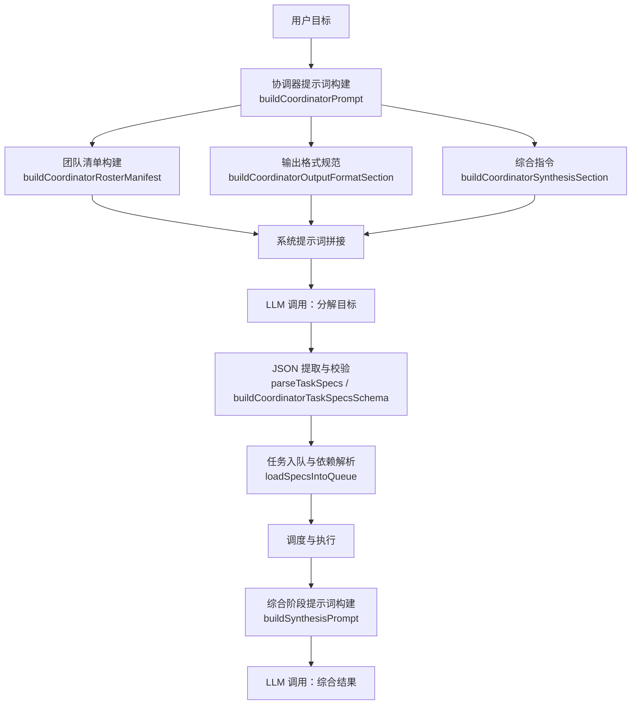
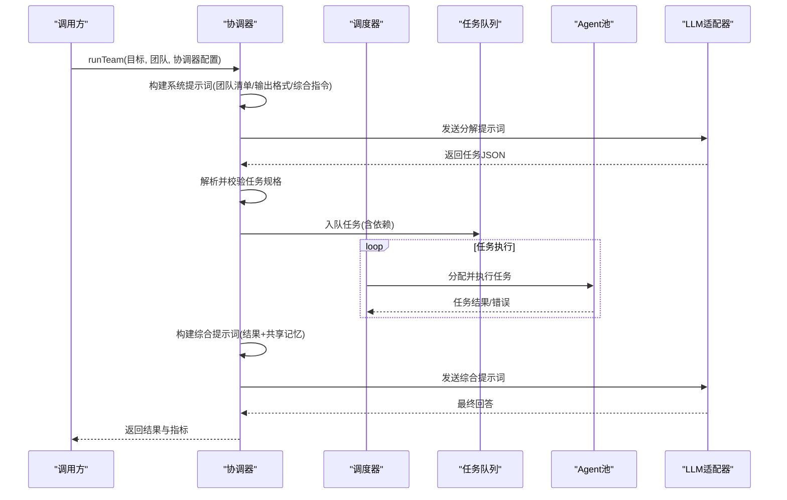
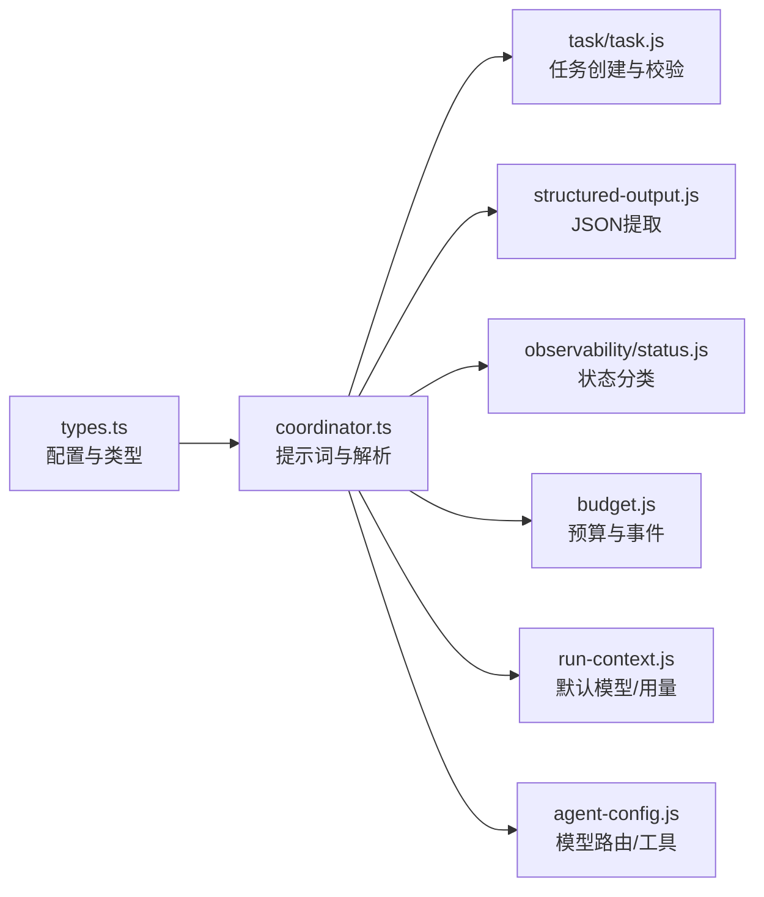

# 协调器提示词工程

<cite>
**本文引用的文件**
- [coordinator.ts](file://packages/core/src/orchestrator/coordinator.ts)
- [types.ts](file://packages/core/src/types.ts)
- [runner.ts](file://packages/core/src/agent/runner.ts)
- [context-management.md](file://docs/context-management.md)
- [README.md](file://packages/core/README.md)
- [AGENTS.md](file://AGENTS.md)
</cite>

## 目录
1. [简介](#简介)
2. [项目结构](#项目结构)
3. [核心组件](#核心组件)
4. [架构总览](#架构总览)
5. [详细组件分析](#详细组件分析)
6. [依赖关系分析](#依赖关系分析)
7. [性能与上下文管理](#性能与上下文管理)
8. [故障排查指南](#故障排查指南)
9. [结论](#结论)
10. [附录：模板定制与优化实践](#附录模板定制与优化实践)

## 简介
本文件聚焦 Open Multi-Agent 的“协调器提示词工程”，系统性解释协调器如何把高层目标动态分解为任务图，并通过精心设计的系统提示词、团队清单（team roster）、输出格式规范以及综合指令（synthesis instructions）来引导模型产出高质量、可执行的任务计划。文档同时覆盖约束条件设置、示例注入、错误处理策略、模板定制方法、上下文注入策略，以及在不同业务场景下的提示词优化技巧，并提供代码级路径以便读者定位实现细节。

## 项目结构
协调器提示词工程的核心位于 orchestrator 子系统中，围绕以下职责展开：
- 构建协调器的系统提示词（包含角色说明、团队清单、输出格式、综合指令）
- 将 LLM 返回的任务 JSON 解析并校验为结构化任务规格
- 将任务规格加载到任务队列，建立依赖关系
- 在任务完成后运行“综合阶段”生成最终答案

图表来源
- [coordinator.ts:365-412](file://packages/core/src/orchestrator/coordinator.ts#L365-L412)
- [coordinator.ts:414-473](file://packages/core/src/orchestrator/coordinator.ts#L414-L473)
- [coordinator.ts:475-486](file://packages/core/src/orchestrator/coordinator.ts#L475-L486)
- [coordinator.ts:546-642](file://packages/core/src/orchestrator/coordinator.ts#L546-L642)
- [coordinator.ts:644-688](file://packages/core/src/orchestrator/coordinator.ts#L644-L688)

章节来源
- [coordinator.ts:1-805](file://packages/core/src/orchestrator/coordinator.ts#L1-L805)
- [README.md:49-110](file://packages/core/README.md#L49-L110)

## 核心组件
- 协调器提示词构建器：负责拼装系统提示词、团队清单、输出格式和综合指令，支持调用方自定义 systemPrompt 与 instructions 追加。
- 团队清单构建器：从 AgentConfig 中抽取受控、有界的 manifest（名称、模型、能力、工具、成本层级等），避免泄露完整 systemPrompt。
- 输出格式规范：强制 LLM 仅返回 JSON 数组，明确字段含义、依赖选择原则、可选验证钩子。
- 任务规格解析与校验：使用 Zod schema 对 LLM 输出进行严格校验，包括标题唯一性、依赖引用有效性、循环依赖检测、assignee 白名单等。
- 综合阶段：汇总已完成、失败、跳过任务的结果与共享记忆摘要，驱动协调器生成面向原始目标的最终回答。

章节来源
- [coordinator.ts:301-412](file://packages/core/src/orchestrator/coordinator.ts#L301-L412)
- [coordinator.ts:107-186](file://packages/core/src/orchestrator/coordinator.ts#L107-L186)
- [coordinator.ts:251-263](file://packages/core/src/orchestrator/coordinator.ts#L251-L263)
- [coordinator.ts:546-642](file://packages/core/src/orchestrator/coordinator.ts#L546-L642)
- [coordinator.ts:644-688](file://packages/core/src/orchestrator/coordinator.ts#L644-L688)

## 架构总览
协调器提示词工程贯穿“目标→计划→执行→综合”的全链路：
- 输入：用户目标、团队配置（agents）、可选的协调器配置（systemPrompt/instructions/verifyJudges 等）
- 计划阶段：协调器基于团队清单与输出格式规范，输出结构化任务 JSON；框架侧完成解析、校验与入队
- 执行阶段：调度器按依赖关系执行任务，维护共享内存、预算、观测与恢复
- 综合阶段：协调器读取任务结果与共享记忆，生成面向原始目标的最终回答

图表来源
- [coordinator.ts:365-412](file://packages/core/src/orchestrator/coordinator.ts#L365-L412)
- [coordinator.ts:546-642](file://packages/core/src/orchestrator/coordinator.ts#L546-L642)
- [coordinator.ts:644-688](file://packages/core/src/orchestrator/coordinator.ts#L644-L688)

## 详细组件分析

### 团队清单（Team Roster）构建
- 目的：向协调器暴露“可用角色及其能力边界”，用于路由与指派。
- 机制：
  - 从每个 AgentConfig 中提取 name、model、roleSummary（来自 description 或 systemPrompt 首行，限制长度）、capabilities、tools（受默认工具预设影响）、costTier。
  - 对 capabilities 与 tools 做上限裁剪，避免提示词过长。
  - roleSummary 是“有意暴露的摘要”，不是完整 systemPrompt，防止信息泄露。
- 关键函数与常量：
  - buildCoordinatorRosterManifest
  - roleSummary
  - COORDINATOR_ROLE_SUMMARY_MAX_CHARS、COORDINATOR_MANIFEST_MAX_CAPABILITIES、COORDINATOR_MANIFEST_MAX_TOOLS

章节来源
- [coordinator.ts:301-363](file://packages/core/src/orchestrator/coordinator.ts#L301-L363)

### 输出格式规范（Output Format）
- 目的：强制 LLM 仅返回 JSON 数组，减少自由文本带来的解析失败。
- 内容要点：
  - 必需字段：title、description、assignee、dependsOn
  - 可选字段：requires（requiredTools、requiredCapabilities、requiredBackend、requiredProvider）
  - 可选验证：当提供 verifyJudges 时，允许 emit verify 以启用共识校验
  - 依赖指导：优先依据 roleSummary 与 capabilities 决定最小必要依赖，避免过度连接导致并行度下降
  - 强调“只返回 JSON 数组，不使用 Markdown 代码块或额外文本”
- 关键函数：buildCoordinatorOutputFormatSection

章节来源
- [coordinator.ts:428-464](file://packages/core/src/orchestrator/coordinator.ts#L428-L464)

### 综合指令（Synthesis Instructions）
- 目的：在任务完成后，指导协调器基于任务结果与共享记忆生成面向原始目标的最终回答。
- 内容要点：
  - 明确“综合阶段”的触发时机与输入（已完成/失败/跳过任务结果、共享记忆摘要）
  - 要求输出清晰、全面，并指出缺失或异常的影响
- 关键函数：buildCoordinatorSynthesisSection、buildSynthesisPrompt

章节来源
- [coordinator.ts:466-473](file://packages/core/src/orchestrator/coordinator.ts#L466-L473)
- [coordinator.ts:644-688](file://packages/core/src/orchestrator/coordinator.ts#L644-L688)

### 系统提示词装配与扩展
- 默认装配：
  - 角色说明 + 团队清单 + 输出格式 + 综合指令
- 扩展方式：
  - 通过 CoordinatorConfig.systemPrompt 完全替换默认 preamble 与分解指导（但团队清单、输出格式、综合部分仍会被追加）
  - 通过 CoordinatorConfig.instructions 追加额外指令（仅在未提供 systemPrompt 时生效）
- 关键函数：buildCoordinatorSystemPrompt、buildCoordinatorPrompt

章节来源
- [coordinator.ts:365-412](file://packages/core/src/orchestrator/coordinator.ts#L365-L412)
- [types.ts:2603-2665](file://packages/core/src/types.ts#L2603-L2665)

### 任务规格解析与校验
- 解析：
  - 从 LLM 输出中提取 JSON（支持 fenced 代码块或裸数组）
  - 使用 Zod schema 校验任务数组
- 校验规则：
  - 标题唯一性（大小写与空白规范化后比较）
  - dependsOn 引用必须存在且唯一
  - 禁止循环依赖
  - assignee 必须在团队名单内（strictAssignees=true 时）
- 关键函数：parseTaskSpecs、buildCoordinatorTaskSpecsSchema

章节来源
- [coordinator.ts:251-263](file://packages/core/src/orchestrator/coordinator.ts#L251-L263)
- [coordinator.ts:107-186](file://packages/core/src/orchestrator/coordinator.ts#L107-L186)

### 任务入队与依赖解析
- 两阶段处理：
  - 第一阶段：创建任务并记录 title→id 映射
  - 第二阶段：将 dependsOn 中的标题或 ID 解析为真实任务 ID，并校验依赖合法性
- 失败处理：
  - 无法解析的依赖会标记任务失败，附带原因
- 关键函数：loadSpecsIntoQueue

章节来源
- [coordinator.ts:690-800](file://packages/core/src/orchestrator/coordinator.ts#L690-L800)

### 综合阶段执行
- 触发条件：所有任务完成后，若预算与中止信号允许，则进入综合阶段
- 输入：原始目标、任务结果（成功/失败/跳过）、共享记忆摘要
- 输出：面向原始目标的最终回答
- 预算与观测：
  - 检查 token/cost 预算，超限则标记失败并上报事件
  - 记录 agent_complete 事件与追踪链接
- 关键函数：runCoordinatorSynthesis、buildSynthesisPrompt

章节来源
- [coordinator.ts:546-642](file://packages/core/src/orchestrator/coordinator.ts#L546-L642)
- [coordinator.ts:644-688](file://packages/core/src/orchestrator/coordinator.ts#L644-L688)

## 依赖关系分析
协调器提示词工程依赖以下子系统与类型定义：
- 类型定义：OrchestratorConfig、CoordinatorConfig、AgentConfig、Task、ConsensusVerifyOptions 等
- 任务与队列：createTask、validateTaskDependencies、TaskQueue
- 结构化输出：extractJSON（从 LLM 输出中提取 JSON）
- 观测与预算：applyBudgetAccounting、emitBudgetExceeded、TraceRuntime
- 模型路由：withModelRoute、routeMatches（用于综合阶段的模型选择）

图表来源
- [coordinator.ts:1-40](file://packages/core/src/orchestrator/coordinator.ts#L1-L40)
- [coordinator.ts:493-536](file://packages/core/src/orchestrator/coordinator.ts#L493-L536)
- [coordinator.ts:546-642](file://packages/core/src/orchestrator/coordinator.ts#L546-L642)

章节来源
- [coordinator.ts:1-805](file://packages/core/src/orchestrator/coordinator.ts#L1-L805)
- [types.ts:1811-2665](file://packages/core/src/types.ts#L1811-L2665)

## 性能与上下文管理
- 团队清单裁剪：roleSummary、capabilities、tools 均有限长或数量上限，避免提示词膨胀。
- 输出格式约束：强制 JSON 输出，降低解析失败与重试成本。
- 依赖最小化：指导协调器仅添加必要依赖，提升并行度与吞吐。
- 上下文压缩：
  - 长对话可通过 contextStrategy（滑动窗口、摘要、紧凑模式、自定义压缩）控制历史消息规模
  - compressToolResults 可将已消费的 tool_result 替换为短标记，释放上下文空间
  - preserveReasoningAsText 可在跨提供商时保留推理文本（带截断保护）
- 预算控制：token/cost 预算在 turn 与 task 边界检查，综合阶段同样受控

章节来源
- [context-management.md:1-114](file://docs/context-management.md#L1-L114)
- [runner.ts:331-370](file://packages/core/src/agent/runner.ts#L331-L370)
- [runner.ts:1662-1798](file://packages/core/src/agent/runner.ts#L1662-L1798)
- [coordinator.ts:546-642](file://packages/core/src/orchestrator/coordinator.ts#L546-L642)

## 故障排查指南
- 任务 JSON 解析失败：
  - 检查 LLM 是否仅返回 JSON 数组，避免 Markdown 代码块或多余文本
  - 参考 parseTaskSpecs 与 extractJSON 的行为
- 依赖解析失败：
  - 确保 dependsOn 中的标题唯一且存在于任务列表
  - 关注 loadSpecsIntoQueue 的“未解析依赖”失败路径
- 循环依赖：
  - 校验器会检测并报错，调整任务依赖拓扑
- 预算超限：
  - 综合阶段可能因 token/cost 预算被拒绝，需调整预算或压缩上下文
- 工具结果过大：
  - 启用 compressToolResults 或设置 minChars 阈值，避免上下文溢出
- 推理文本丢失：
  - 跨提供商场景下开启 preserveReasoningAsText，并注意 compressReasoningText 的截断行为

章节来源
- [coordinator.ts:251-263](file://packages/core/src/orchestrator/coordinator.ts#L251-L263)
- [coordinator.ts:690-800](file://packages/core/src/orchestrator/coordinator.ts#L690-L800)
- [coordinator.ts:546-642](file://packages/core/src/orchestrator/coordinator.ts#L546-L642)
- [context-management.md:24-114](file://docs/context-management.md#L24-L114)

## 结论
Open Multi-Agent 的协调器提示词工程通过“团队清单—输出格式—综合指令”三段式结构，结合严格的 JSON 校验与依赖解析，实现了从目标到可执行任务图的稳定转换。通过可插拔的 systemPrompt/instructions、可控的团队清单与上下文压缩策略，既能满足初学者快速上手，又能为高级用户提供深度定制与调试能力。生产环境中建议配合预算控制、观测与恢复机制，确保多智能体流程的可控性与可观测性。

## 附录：模板定制与优化实践

### 何时使用 systemPrompt 与 instructions
- 使用 systemPrompt：当你需要完全重写协调器的角色说明与分解指导，但仍希望保留团队清单、输出格式与综合部分的自动追加。
- 使用 instructions：在不改变默认 preamble 的前提下，追加特定业务约束、领域术语或示例风格。

章节来源
- [coordinator.ts:382-412](file://packages/core/src/orchestrator/coordinator.ts#L382-L412)
- [types.ts:2603-2665](file://packages/core/src/types.ts#L2603-L2665)

### 团队清单定制要点
- 为每个 Agent 提供清晰的 description 或精简的 systemPrompt 首行，以便 roleSummary 准确反映能力边界
- 合理声明 capabilities，帮助协调器做出更精准的指派决策
- 谨慎授予 tools，避免不必要的工具暴露增加安全风险与提示词体积

章节来源
- [coordinator.ts:325-363](file://packages/core/src/orchestrator/coordinator.ts#L325-L363)

### 输出格式与依赖指导优化
- 在 instructions 中补充领域特定的任务拆分原则（例如：数据准备→特征工程→建模→评估）
- 强调“最小依赖”原则，避免过度耦合导致并行度下降
- 对于高风险任务，启用 verify 钩子（需配置 verifyJudges），引入共识校验

章节来源
- [coordinator.ts:428-464](file://packages/core/src/orchestrator/coordinator.ts#L428-L464)
- [coordinator.ts:214-249](file://packages/core/src/orchestrator/coordinator.ts#L214-L249)

### 上下文注入策略
- 使用 revealCoordinator：在 worker 提示词前追加团队上下文（原始目标、完整清单、当前执行者身份），有助于多步任务对齐与调试
- 使用 dependencyPayload：控制依赖结果以 output/structured/both 形式注入下游任务，平衡可读性与结构化程度
- 使用 memoryScope：限定共享记忆注入范围（dependencies 或 all），避免无关上下文污染

章节来源
- [types.ts:1811-1846](file://packages/core/src/types.ts#L1811-L1846)
- [types.ts:2052-2080](file://packages/core/src/types.ts#L2052-L2080)

### 复杂业务场景最佳实践
- 多阶段流水线：将大目标拆分为“数据获取→清洗→分析→报告”等阶段，每阶段明确输入/输出契约
- 风险敏感任务：为关键步骤启用 verify，采用 refute/lens 模式与 quorum 控制
- 资源受限环境：启用 compressToolResults、compact 上下文策略，限制 roleSummary/capabilities/tools 长度
- 跨提供商协作：开启 preserveReasoningAsText，注意推理文本截断与回退行为

章节来源
- [context-management.md:74-114](file://docs/context-management.md#L74-L114)
- [coordinator.ts:428-464](file://packages/core/src/orchestrator/coordinator.ts#L428-L464)

### 代码级参考路径
- 协调器提示词构建与装配：[coordinator.ts:365-412](file://packages/core/src/orchestrator/coordinator.ts#L365-L412)
- 团队清单构建与裁剪：[coordinator.ts:325-363](file://packages/core/src/orchestrator/coordinator.ts#L325-L363)
- 输出格式与依赖指导：[coordinator.ts:428-464](file://packages/core/src/orchestrator/coordinator.ts#L428-L464)
- 任务规格解析与校验：[coordinator.ts:251-263](file://packages/core/src/orchestrator/coordinator.ts#L251-L263), [coordinator.ts:107-186](file://packages/core/src/orchestrator/coordinator.ts#L107-L186)
- 任务入队与依赖解析：[coordinator.ts:690-800](file://packages/core/src/orchestrator/coordinator.ts#L690-L800)
- 综合阶段提示词与执行：[coordinator.ts:546-642](file://packages/core/src/orchestrator/coordinator.ts#L546-L642), [coordinator.ts:644-688](file://packages/core/src/orchestrator/coordinator.ts#L644-L688)
- 上下文管理与工具结果压缩：[context-management.md:1-114](file://docs/context-management.md#L1-L114), [runner.ts:1662-1798](file://packages/core/src/agent/runner.ts#L1662-L1798)