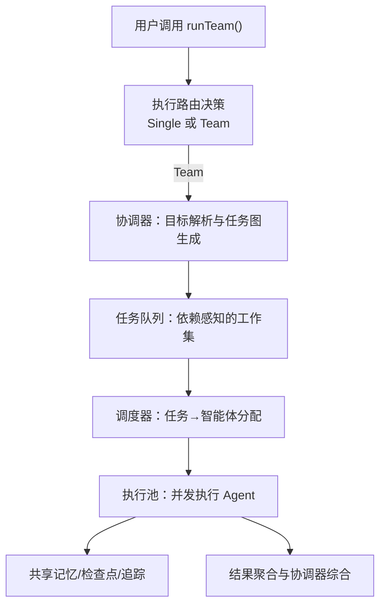
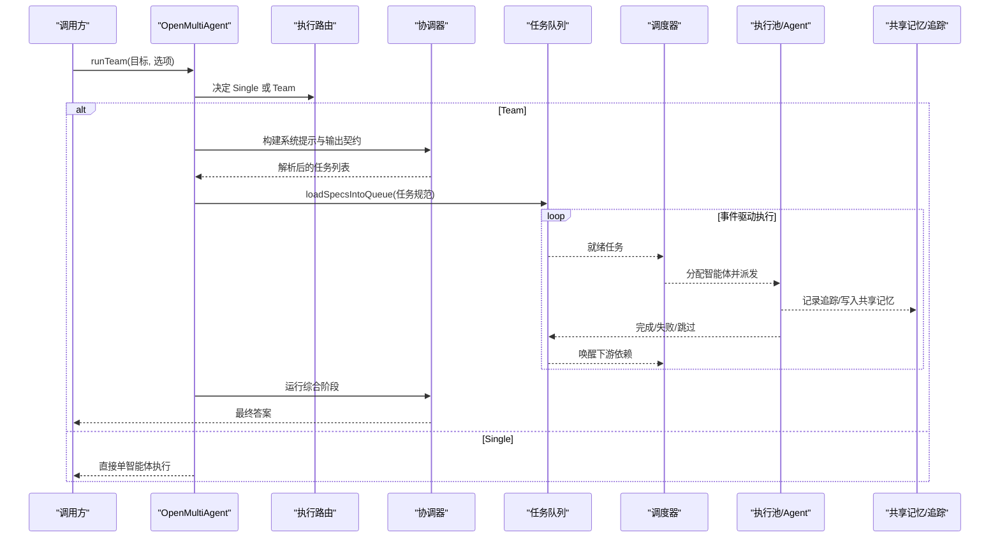
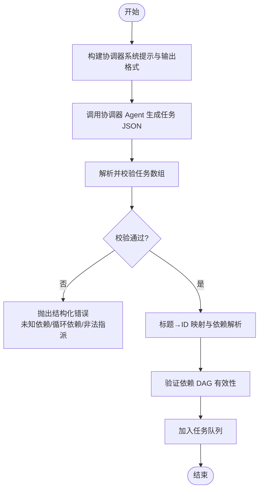
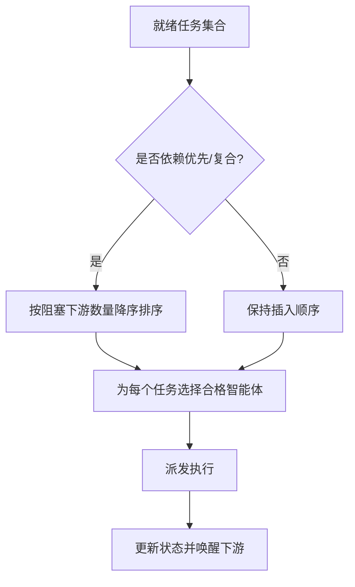
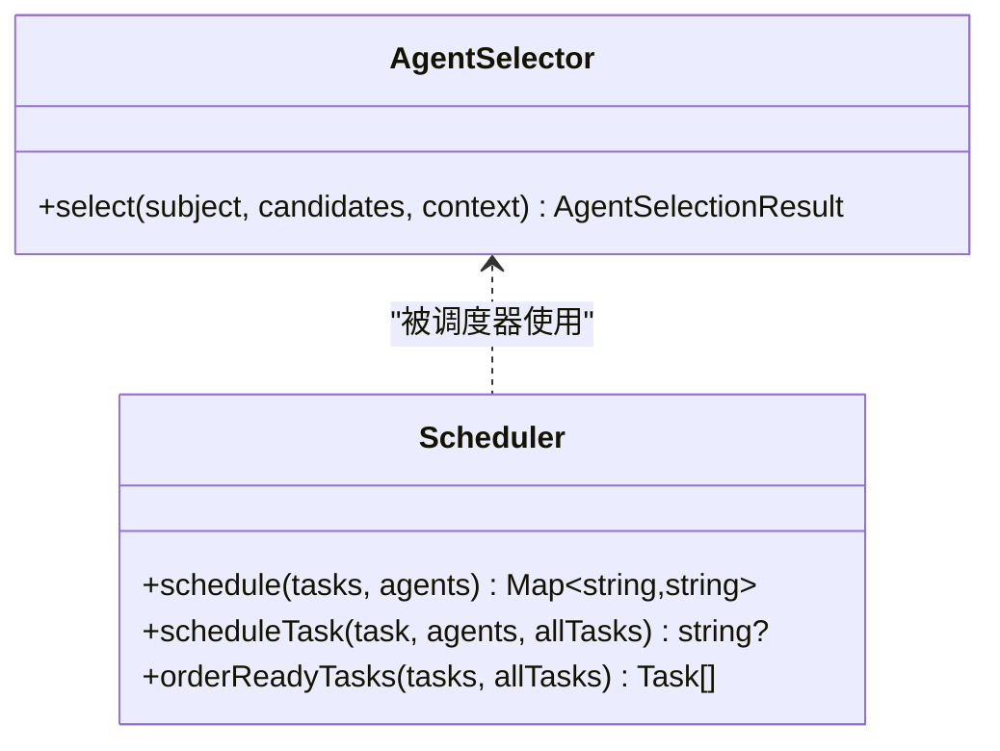
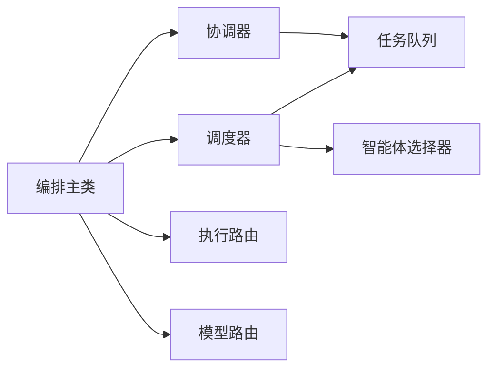

# 协调器设计

<cite>
**本文引用的文件**
- [README.md](file://README.md)
- [README_zh.md](file://README_zh.md)
- [packages/core/README.md](file://packages/core/README.md)
- [packages/core/src/orchestrator/coordinator.ts](file://packages/core/src/orchestrator/coordinator.ts)
- [packages/core/src/orchestrator/scheduler.ts](file://packages/core/src/orchestrator/scheduler.ts)
- [packages/core/src/orchestrator/agent-selector.ts](file://packages/core/src/orchestrator/agent-selector.ts)
- [packages/core/src/orchestrator/orchestrator.ts](file://packages/core/src/orchestrator/orchestrator.ts)
- [packages/core/src/types.ts](file://packages/core/src/types.ts)
- [docs/task-scheduling.md](file://docs/task-scheduling.md)
- [docs/execution-routing.md](file://docs/execution-routing.md)
- [docs/model-routing.md](file://docs/model-routing.md)
</cite>

## 目录
1. [简介](#简介)
2. [项目结构](#项目结构)
3. [核心组件](#核心组件)
4. [架构总览](#架构总览)
5. [详细组件分析](#详细组件分析)
6. [依赖关系分析](#依赖关系分析)
7. [性能考量](#性能考量)
8. [故障排查指南](#故障排查指南)
9. [结论](#结论)
10. [附录：配置与使用示例路径](#附录：配置与使用示例路径)

## 简介
本文件聚焦 Open Multi-Agent 的“协调器（Coordinator）”在多智能体编排中的核心职责：目标解析、任务图生成、智能体选择与分配策略，以及执行过程中的异常处理与扩展点。协调器在运行时将高层目标分解为可并行的任务有向无环图（DAG），由调度器按依赖关系驱动执行，最终由协调器进行结果综合。该设计使应用只需描述目标，无需手工维护工作流图，同时保留对执行过程的可观测、可审批、可恢复的控制能力。

## 项目结构
Open Multi-Agent 的核心编排位于 `@open-multi-agent/core`，其中协调器相关实现集中在 orchestrator 子模块：
- 协调器子系统：负责目标到任务图的解析、系统提示构建、输出契约校验、结果合成等。
- 调度器子系统：提供多种任务到智能体的分配策略，包括依赖优先、负载均衡、能力匹配、复合评分等。
- 智能体选择器：基于硬约束（工具、能力、后端、提供商）和软偏好（关键词/能力词匹配）进行可解释的选择。
- 编排主入口：OpenMultiAgent 类串联团队、队列、调度器、执行池、记忆、预算、追踪、审批、恢复等子系统。

图表来源
- [packages/core/src/orchestrator/orchestrator.ts:345-446](file://packages/core/src/orchestrator/orchestrator.ts#L345-L446)
- [packages/core/src/orchestrator/coordinator.ts:365-486](file://packages/core/src/orchestrator/coordinator.ts#L365-L486)
- [packages/core/src/orchestrator/scheduler.ts:142-214](file://packages/core/src/orchestrator/scheduler.ts#L142-L214)

章节来源
- [packages/core/README.md:237-252](file://packages/core/README.md#L237-L252)
- [README_zh.md:46-107](file://README_zh.md#L46-L107)

## 核心组件
- 协调器（coordinator）：构建系统提示与输出契约，解析 LLM 返回的任务 JSON，校验依赖与指派合法性，并在所有任务完成后进行结果综合。
- 调度器（scheduler）：根据策略将待执行任务映射到可用智能体；支持 round-robin、least-busy、capability-match、dependency-first、composite 五种策略。
- 智能体选择器（agent-selector）：以硬约束过滤候选智能体，再以能力/关键词亲和度打分，保证选择可解释且确定性强。
- 编排主类（orchestrator）：统一装配路由、预算、追踪、审批、恢复、评估等横切关注点，暴露 runTeam/runTasks/runAgent 等 API。

章节来源
- [packages/core/src/orchestrator/coordinator.ts:107-186](file://packages/core/src/orchestrator/coordinator.ts#L107-L186)
- [packages/core/src/orchestrator/scheduler.ts:1-16](file://packages/core/src/orchestrator/scheduler.ts#L1-L16)
- [packages/core/src/orchestrator/agent-selector.ts:1-8](file://packages/core/src/orchestrator/agent-selector.ts#L1-L8)
- [packages/core/src/orchestrator/orchestrator.ts:345-446](file://packages/core/src/orchestrator/orchestrator.ts#L345-L446)

## 架构总览
协调器在多智能体架构中的职责边界如下：
- 输入：高层目标字符串、团队名册、可选治理意图、模型路由策略、预算与追踪上下文。
- 规划：构造协调器系统提示与输出格式，调用协调器 Agent 生成任务 JSON，并进行结构化校验与依赖闭环检测。
- 装载：将任务规范转换为内部 Task 对象，建立标题到 ID 的映射，解析 dependsOn 引用，验证依赖有效性后入队。
- 执行：事件驱动调度，依赖满足即触发下游任务；失败/跳过级联传播。
- 综合：汇总已完成任务结果与共享记忆摘要，生成面向原始目标的最终答案。

图表来源
- [packages/core/src/orchestrator/orchestrator.ts:345-446](file://packages/core/src/orchestrator/orchestrator.ts#L345-L446)
- [packages/core/src/orchestrator/coordinator.ts:365-486](file://packages/core/src/orchestrator/coordinator.ts#L365-L486)
- [docs/task-scheduling.md:8-25](file://docs/task-scheduling.md#L8-L25)

## 详细组件分析

### 协调器：目标解析与任务图生成
- 输出契约：通过 Zod Schema 严格校验任务数组，包含 title、description、assignee、dependsOn、requires、verify 等字段，并对重复标题、未知依赖、循环依赖进行错误报告。
- 指派校验：当 strictAssignees 为 true 时，拒绝不在团队名册中的 assignee；否则回退至调度器重新分配。
- 依赖解析：先创建任务获取稳定 ID，再将 dependsOn 的标题引用解析为真实 ID，最后整体校验依赖有效性。
- 综合阶段：收集已完成/失败/跳过任务结果与共享记忆摘要，生成面向原始目标的最终回答。

图表来源
- [packages/core/src/orchestrator/coordinator.ts:107-186](file://packages/core/src/orchestrator/coordinator.ts#L107-L186)
- [packages/core/src/orchestrator/coordinator.ts:696-800](file://packages/core/src/orchestrator/coordinator.ts#L696-L800)

章节来源
- [packages/core/src/orchestrator/coordinator.ts:107-186](file://packages/core/src/orchestrator/coordinator.ts#L107-L186)
- [packages/core/src/orchestrator/coordinator.ts:365-486](file://packages/core/src/orchestrator/coordinator.ts#L365-L486)
- [packages/core/src/orchestrator/coordinator.ts:696-800](file://packages/core/src/orchestrator/coordinator.ts#L696-L800)

### 调度器：任务到智能体的分配策略
- 策略概览：
  - dependency-first：优先分配能解锁最多下游任务的“关键路径”任务。
  - least-busy：选择当前 in_progress 最少的智能体，适合时长差异大的任务。
  - capability-match：基于硬约束过滤后，按能力/关键词亲和度打分。
  - round-robin：按名册顺序轮询分配，适用于可互换智能体。
  - composite：结合关键性、能力契合度与当前负载的综合评分。
- 事件驱动：就绪任务逐个分配，不等待同批无关任务全部就绪。
- 失败与跳过：失败/跳过会立即级联到其依赖下游，其他分支继续执行。

图表来源
- [packages/core/src/orchestrator/scheduler.ts:142-214](file://packages/core/src/orchestrator/scheduler.ts#L142-L214)
- [packages/core/src/orchestrator/scheduler.ts:260-268](file://packages/core/src/orchestrator/scheduler.ts#L260-L268)
- [docs/task-scheduling.md:8-25](file://docs/task-scheduling.md#L8-L25)

章节来源
- [packages/core/src/orchestrator/scheduler.ts:1-16](file://packages/core/src/orchestrator/scheduler.ts#L1-L16)
- [packages/core/src/orchestrator/scheduler.ts:142-214](file://packages/core/src/orchestrator/scheduler.ts#L142-L214)
- [docs/task-scheduling.md:98-133](file://docs/task-scheduling.md#L98-L133)

### 智能体选择器：可解释的选择机制
- 硬约束过滤：工具授予、能力标签、后端类型、提供商必须满足任务 requires。
- 软偏好打分：能力标签与关键词双向亲和度叠加，确保角色差异化场景下的精准匹配。
- 确定性：分数相同按名称升序打破平局，避免随机性。
- 预验证：在派发前对所有任务进行要求校验，未满足则提前失败，避免进入执行阶段。

图表来源
- [packages/core/src/orchestrator/agent-selector.ts:95-223](file://packages/core/src/orchestrator/agent-selector.ts#L95-L223)
- [packages/core/src/orchestrator/scheduler.ts:519-544](file://packages/core/src/orchestrator/scheduler.ts#L519-L544)

章节来源
- [packages/core/src/orchestrator/agent-selector.ts:1-8](file://packages/core/src/orchestrator/agent-selector.ts#L1-L8)
- [packages/core/src/orchestrator/agent-selector.ts:95-223](file://packages/core/src/orchestrator/agent-selector.ts#L95-L223)
- [packages/core/src/orchestrator/scheduler.ts:519-544](file://packages/core/src/orchestrator/scheduler.ts#L519-L544)

### 执行路由：Single vs Team 的拓扑选择
- 优先级：显式 mode > 治理声明 > 每调用路由 > 默认路由 > 内置确定性路由。
- Hybrid 语义路由：在默认结果为 Single 时，额外进行一次无工具的轻量语义分析，可能升级为 Team；若失败可按策略回退或终止。
- 可观测：每次拓扑选择均记录 routingDecision，便于审计与回放。

章节来源
- [docs/execution-routing.md:5-21](file://docs/execution-routing.md#L5-L21)
- [docs/execution-routing.md:23-80](file://docs/execution-routing.md#L23-L80)
- [docs/execution-routing.md:120-160](file://docs/execution-routing.md#L120-L160)

### 模型路由：不同阶段的模型选择
- 规则匹配：按 phase（coordinator/synthesis/worker/delegated/short-circuit）、agent、taskRole、leaf 等维度匹配，首个命中生效。
- 回退链：worker 可声明 provider 回退顺序，仅在可重试的提供商错误时推进。
- 非侵入：路由仅影响单次调用的有效配置，不修改团队或智能体定义。

章节来源
- [docs/model-routing.md:5-30](file://docs/model-routing.md#L5-L30)
- [docs/model-routing.md:31-58](file://docs/model-routing.md#L31-L58)
- [docs/model-routing.md:59-96](file://docs/model-routing.md#L59-L96)

## 依赖关系分析
协调器与调度器、选择器、执行路由、模型路由之间的耦合关系如下：
- 协调器依赖任务规范 Schema、任务创建与依赖校验工具，产出任务列表供队列装载。
- 调度器依赖选择器进行硬约束过滤与打分，再按策略排序与分配。
- 编排主类负责装配路由、预算、追踪、审批、恢复等横切逻辑，并将各子系统串联成完整执行链路。
- 外部文档定义了调度与路由的行为契约，指导配置与扩展。

图表来源
- [packages/core/src/orchestrator/orchestrator.ts:345-446](file://packages/core/src/orchestrator/orchestrator.ts#L345-L446)
- [packages/core/src/orchestrator/coordinator.ts:365-486](file://packages/core/src/orchestrator/coordinator.ts#L365-L486)
- [packages/core/src/orchestrator/scheduler.ts:142-214](file://packages/core/src/orchestrator/scheduler.ts#L142-L214)

章节来源
- [packages/core/src/orchestrator/orchestrator.ts:345-446](file://packages/core/src/orchestrator/orchestrator.ts#L345-L446)
- [packages/core/src/orchestrator/coordinator.ts:365-486](file://packages/core/src/orchestrator/coordinator.ts#L365-L486)
- [packages/core/src/orchestrator/scheduler.ts:142-214](file://packages/core/src/orchestrator/scheduler.ts#L142-L214)

## 性能考量
- 事件驱动执行：下游任务一旦依赖满足即启动，不等待同批无关任务，提升吞吐。
- 依赖关键路径优先：dependency-first 与 composite 策略优先处理阻塞下游最多的任务，缩短关键路径。
- 负载感知：least-busy 与 composite 考虑 in_progress 计数，避免热点智能体过载。
- 预算控制：token 与成本预算在 turn 与 task 边界检查，防止无限增长。
- 并行上限：maxConcurrency 限制全局并发，保护资源与稳定性。

章节来源
- [docs/task-scheduling.md:8-25](file://docs/task-scheduling.md#L8-L25)
- [packages/core/src/orchestrator/scheduler.ts:326-363](file://packages/core/src/orchestrator/scheduler.ts#L326-L363)
- [packages/core/src/orchestrator/scheduler.ts:463-508](file://packages/core/src/orchestrator/scheduler.ts#L463-L508)
- [packages/core/README.md:288-316](file://packages/core/README.md#L288-L316)

## 故障排查指南
常见异常与处理要点：
- 无效任务依赖：标题重复、未知依赖、循环依赖会在协调器解析阶段报错，需修正任务规范。
- 无合格智能体：当任务 requires 无法被任何候选满足时，调度器抛出 NO_ELIGIBLE_AGENT；需调整任务要求或智能体能力/工具授予。
- 指派不合法：strictAssignees 为 true 时，协调器拒绝不在名册中的 assignee；可关闭严格模式让调度器重分。
- 路由失败：Hybrid 路由的 Profiler 超时或返回无效结构时，按 failurePolicy 回退或终止；查看 routingDecision 与 trace 定位。
- 预算超限：token/cost 超限时，综合阶段可能被跳过，需在调用侧设置合理预算与 estimateCost。

章节来源
- [packages/core/src/orchestrator/coordinator.ts:107-186](file://packages/core/src/orchestrator/coordinator.ts#L107-L186)
- [packages/core/src/orchestrator/scheduler.ts:546-557](file://packages/core/src/orchestrator/scheduler.ts#L546-L557)
- [docs/execution-routing.md:120-160](file://docs/execution-routing.md#L120-L160)
- [packages/core/src/orchestrator/coordinator.ts:546-642](file://packages/core/src/orchestrator/coordinator.ts#L546-L642)

## 结论
协调器是 Open Multi-Agent 动态编排的核心：它将模糊目标转化为可执行的 DAG，借助调度器与选择器将任务分配到最合适智能体，并通过预算、追踪、审批与恢复机制保障生产可靠性。对于初学者，理解“目标→任务图→调度→执行→综合”的主线即可上手；对于高级用户，可通过自定义执行路由、模型路由、调度权重与选择上下文，精细控制多智能体协作行为。

## 附录：配置与使用示例路径
- 快速开始与 runTeam 示例：见根 README 与中文 README 的快速开始段落。
- 核心包使用指南与三种执行模式：见 core README 的执行模式与调度章节。
- 任务调度与分发细节：见 docs/task-scheduling.md。
- 执行路由与模型路由：见 docs/execution-routing.md 与 docs/model-routing.md。
- 协调器实现与综合阶段：见 coordinator.ts 的系统提示构建、输出契约、任务装载与综合函数。
- 调度器策略与选择器：见 scheduler.ts 与 agent-selector.ts。
- 编排主类装配与默认值：见 orchestrator.ts 构造函数与路由/预算/追踪装配。

章节来源
- [README.md:46-97](file://README.md#L46-L97)
- [README_zh.md:46-96](file://README_zh.md#L46-L96)
- [packages/core/README.md:103-222](file://packages/core/README.md#L103-L222)
- [docs/task-scheduling.md:1-203](file://docs/task-scheduling.md#L1-L203)
- [docs/execution-routing.md:1-222](file://docs/execution-routing.md#L1-L222)
- [docs/model-routing.md:1-117](file://docs/model-routing.md#L1-L117)
- [packages/core/src/orchestrator/coordinator.ts:365-486](file://packages/core/src/orchestrator/coordinator.ts#L365-L486)
- [packages/core/src/orchestrator/scheduler.ts:142-214](file://packages/core/src/orchestrator/scheduler.ts#L142-L214)
- [packages/core/src/orchestrator/agent-selector.ts:95-223](file://packages/core/src/orchestrator/agent-selector.ts#L95-L223)
- [packages/core/src/orchestrator/orchestrator.ts:345-446](file://packages/core/src/orchestrator/orchestrator.ts#L345-L446)
- [packages/core/src/types.ts:2131-2180](file://packages/core/src/types.ts#L2131-L2180)