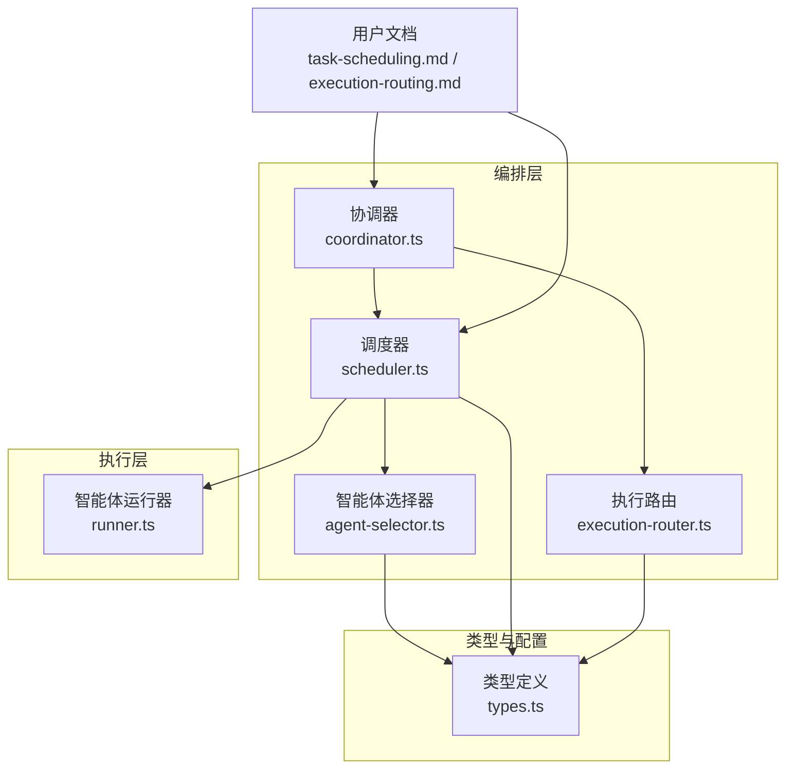
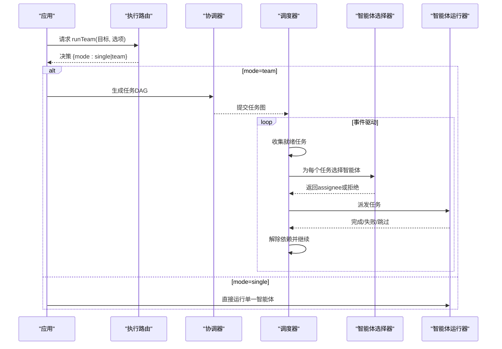
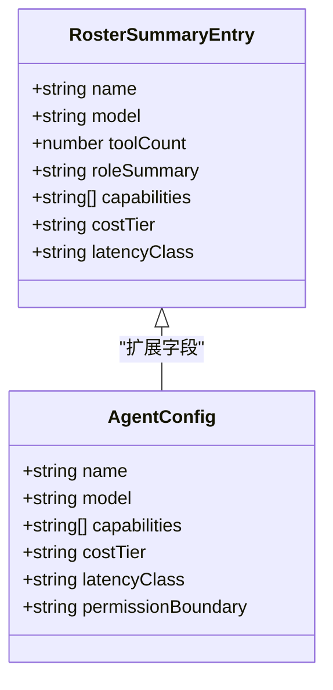
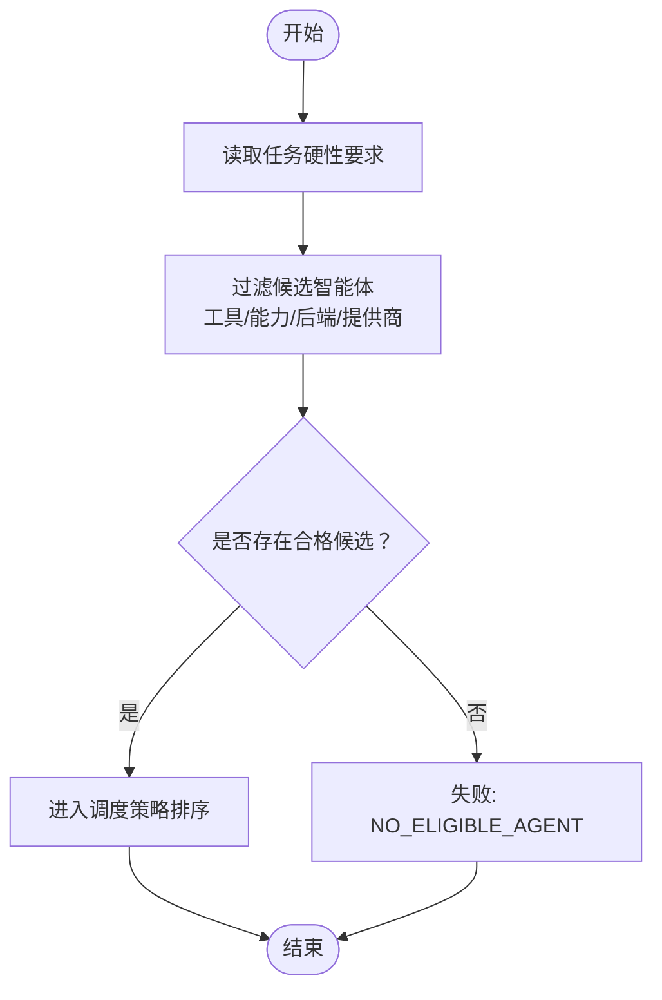
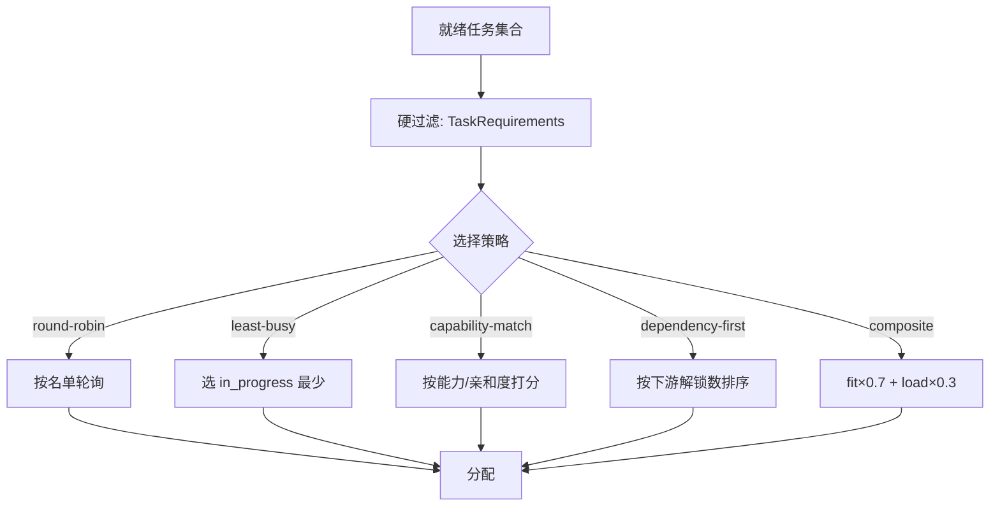
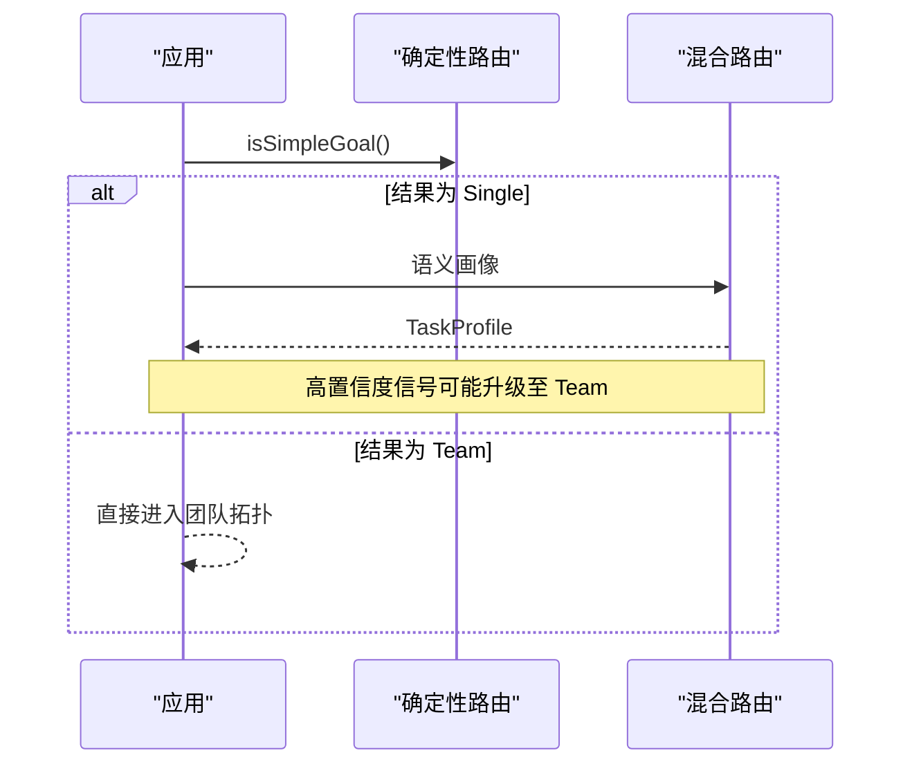
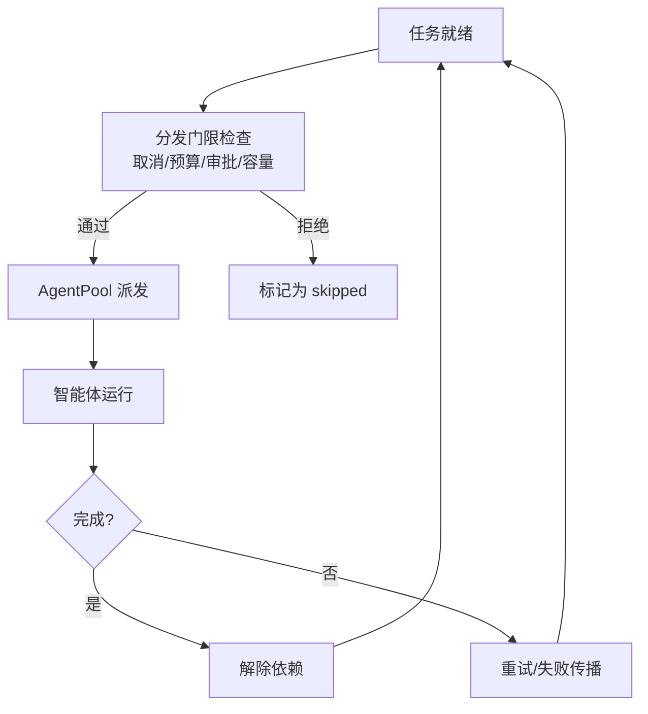
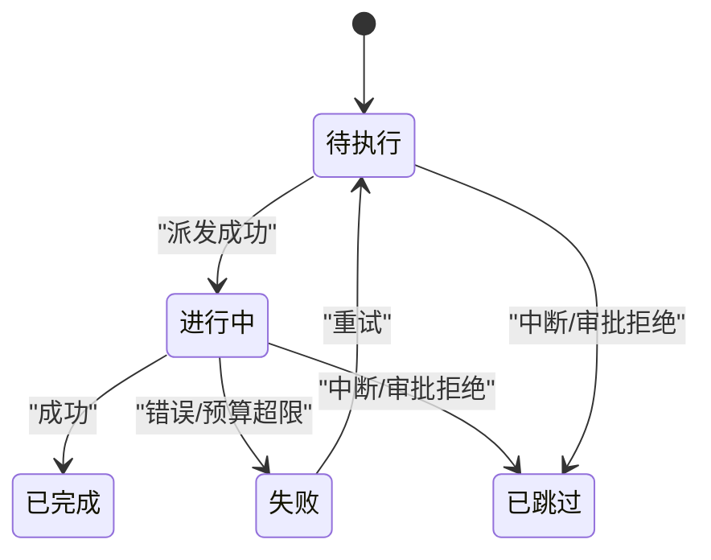
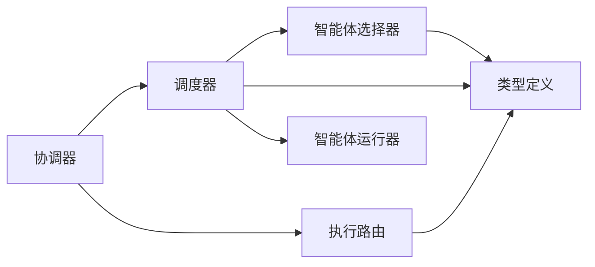

# 智能体选择与分配

<cite>
**本文引用的文件**
- [README.md](file://README.md)
- [AGENTS.md](file://AGENTS.md)
- [任务调度与派发文档](file://docs/task-scheduling.md)
- [执行路由文档](file://docs/execution-routing.md)
- [类型定义（types.ts）](file://packages/core/src/types.ts)
- [代理运行器（runner.ts）](file://packages/core/src/agent/runner.ts)
- [协调器（coordinator.ts）](file://packages/core/src/orchestrator/coordinator.ts)
- [调度器（scheduler.ts）](file://packages/core/src/orchestrator/scheduler.ts)
- [智能体选择器（agent-selector.ts）](file://packages/core/src/orchestrator/agent-selector.ts)
- [执行路由（execution-router.ts）](file://packages/core/src/orchestrator/execution-router.ts)
</cite>

## 目录
1. [简介](#简介)
2. [项目结构](#项目结构)
3. [核心组件](#核心组件)
4. [架构总览](#架构总览)
5. [详细组件分析](#详细组件分析)
6. [依赖关系分析](#依赖关系分析)
7. [性能考量](#性能考量)
8. [故障排查指南](#故障排查指南)
9. [结论](#结论)
10. [附录](#附录)

## 简介
本文件聚焦 Open Multi-Agent 的“智能体选择与分配机制”，解释协调器如何根据任务需求与智能体能力进行匹配，涵盖：
- 智能体清单（manifest）构建与角色摘要（roleSummary）、能力标签（capabilities）、成本层级（costTier）等结构化信息的使用
- 能力匹配算法与硬性约束（requiredTools、requiredCapabilities、requiredBackend、requiredProvider）
- 调度策略（round-robin、least-busy、capability-match、dependency-first、composite）及权重配置
- 智能体池管理、负载均衡与故障转移（预算、检查点、恢复、重试）
- 自定义选择策略的配置方式与异常处理（不可用、资源不足）

内容既适合初学者理解多智能体协作的基本原理，也为高级用户提供调度算法与性能优化方法。

## 项目结构
Open Multi-Agent 的核心编排位于 packages/core/src 下，按子系统分目录组织。与智能体选择与分配直接相关的模块包括：
- orchestrator：协调器、调度器、智能体选择器、执行路由、预算、恢复等
- agent：智能体运行器与循环检测、工具调用门控等
- types：统一的类型定义，包含 AgentConfig、TaskRequirements、OrchestratorConfig、RosterSummaryEntry 等
- docs：任务调度与执行路由的用户文档

图表来源
- [协调器（coordinator.ts）](file://packages/core/src/orchestrator/coordinator.ts)
- [调度器（scheduler.ts）](file://packages/core/src/orchestrator/scheduler.ts)
- [智能体选择器（agent-selector.ts）](file://packages/core/src/orchestrator/agent-selector.ts)
- [执行路由（execution-router.ts）](file://packages/core/src/orchestrator/execution-router.ts)
- [代理运行器（runner.ts）](file://packages/core/src/agent/runner.ts)
- [类型定义（types.ts）](file://packages/core/src/types.ts)
- [任务调度与派发文档](file://docs/task-scheduling.md)
- [执行路由文档](file://docs/execution-routing.md)

章节来源
- [README.md:46-97](file://README.md#L46-L97)
- [AGENTS.md:64-70](file://AGENTS.md#L64-L70)

## 核心组件
- 协调器（Coordinator）：在 runTeam() 中动态生成任务 DAG，并驱动调度器执行；可结合执行路由决定 Single/Team 拓扑。
- 调度器（Scheduler）：事件驱动的任务队列，维护 ready/in-flight 集合，负责将就绪任务派发到智能体池。
- 智能体选择器（AgentSelector）：基于硬性要求与可选评分（fit/load）从候选智能体中选择 assignee。
- 执行路由（ExecutionRouter）：决定自动 runTeam() 使用 single 还是 team 拓扑，支持确定性启发式与混合语义路由。
- 智能体运行器（Runner）：执行单个智能体的对话循环，含工具调用、循环检测、超时与预算控制。
- 类型与配置（types.ts）：定义 AgentConfig、TaskRequirements、OrchestratorConfig、RosterSummaryEntry、SchedulingStrategy 等。

章节来源
- [类型定义（types.ts）:906-925](file://packages/core/src/types.ts#L906-L925)
- [类型定义（types.ts）:1360-1372](file://packages/core/src/types.ts#L1360-L1372)
- [类型定义（types.ts）:2131-2180](file://packages/core/src/types.ts#L2131-L2180)
- [代理运行器（runner.ts）:81-177](file://packages/core/src/agent/runner.ts#L81-L177)

## 架构总览
下图展示一次 runTeam() 的关键流程：执行路由决定拓扑 → 协调器生成计划 → 调度器事件驱动派发 → 智能体选择器匹配 → 智能体运行器执行 → 结果聚合与恢复/检查点。

图表来源
- [执行路由文档](file://docs/execution-routing.md)
- [任务调度与派发文档](file://docs/task-scheduling.md)
- [类型定义（types.ts）:2131-2180](file://packages/core/src/types.ts#L2131-L2180)

## 详细组件分析

### 智能体清单（Manifest）与角色摘要（roleSummary）
- 清单条目（RosterSummaryEntry）提供 name、model、toolCount、roleSummary、capabilities、costTier、latencyClass 等结构化字段，用于路由与选择，避免暴露 systemPrompt 等敏感信息。
- roleSummary 是面向 manifest 消费者的有界角色摘要；execution routing 阶段通常不设置该字段，但可作为选择器的辅助信号。
- costTier/latencyClass 由调用方声明，用于应用级成本与延迟分层，框架不自行推断定价或基准延迟。

图表来源
- [类型定义（types.ts）:1551-1571](file://packages/core/src/types.ts#L1551-L1571)
- [类型定义（types.ts）:906-925](file://packages/core/src/types.ts#L906-L925)

章节来源
- [类型定义（types.ts）:1551-1571](file://packages/core/src/types.ts#L1551-L1571)
- [类型定义（types.ts）:906-925](file://packages/core/src/types.ts#L906-L925)

### 能力匹配与硬性约束（TaskRequirements）
- 硬性约束仅基于已解析的工具授权、后端判别符、提供商与调用方声明的能力标签，不会从 systemPrompt、任务描述等未结构化文本推断。
- 支持的约束维度：
  - requiredTools：必须可用的工具名列表
  - requiredCapabilities：必须满足的能力标签
  - requiredBackend：llm/process/acp
  - requiredProvider：指定提供商
- 若没有候选智能体满足要求，校验失败并返回 NO_ELIGIBLE_AGENT；若显式 assignee 不满足要求，返回 ASSIGNEE_REQUIREMENTS_MISMATCH。

图表来源
- [类型定义（types.ts）:1360-1372](file://packages/core/src/types.ts#L1360-L1372)
- [任务调度与派发文档:98-120](file://docs/task-scheduling.md#L98-L120)

章节来源
- [类型定义（types.ts）:1360-1372](file://packages/core/src/types.ts#L1360-L1372)
- [任务调度与派发文档:98-120](file://docs/task-scheduling.md#L98-L120)

### 调度策略与权重（SchedulingStrategy & Weights）
- 内置策略：
  - round-robin：按名单顺序轮询，适用于可互换智能体
  - least-busy：优先选择当前活跃任务最少的智能体，适用于时长差异大
  - capability-match：基于声明能力与任务亲和度排名，适用于角色差异化
  - dependency-first：优先分配能解锁最多下游的任务，适用于强依赖图
  - composite：先硬过滤，再按依赖关键性排序，最后组合 fit 与 load
- composite 权重：
  - fitWeight × fit + loadWeight × (1 - normalizedCurrentLoad)
  - 默认 fit=0.7，load=0.3；负载快照来自当前 DAG 状态
- 所有策略均在硬过滤后进行排序或轮换；显式 assignee 会被保留且仍需满足要求。

图表来源
- [类型定义（types.ts）:2131-2180](file://packages/core/src/types.ts#L2131-L2180)
- [任务调度与派发文档:98-128](file://docs/task-scheduling.md#L98-L128)

章节来源
- [类型定义（types.ts）:2131-2180](file://packages/core/src/types.ts#L2131-L2180)
- [任务调度与派发文档:98-128](file://docs/task-scheduling.md#L98-L128)

### 执行路由（Single vs Team）与混合语义路由
- 优先级：显式模式 > 治理拓扑/降级策略 > 每调用路由 > 默认确定性路由 > 混合语义路由（当默认结果为 Single 时触发）
- 混合路由：
  - 仅在确定性路由选择 Single 时，额外进行一次无工具模型调用，产出 TaskProfile（证据来源、独立性、冲突、副作用意图、权限隔离、可分解性、并行性、复杂度、置信度、原因）
  - 高置信度的独立证据/评审/冲突/真正并行工作可能将 Single 升级为 Team
  - 低置信度或无实质信号保持 Single；V1 不会将 Team 降为 Single
- 失败策略：默认 fallback，可配置 fail；记录 status、requestedRouterVersion、fallbackCode

图表来源
- [执行路由文档:23-80](file://docs/execution-routing.md#L23-L80)
- [执行路由文档:120-154](file://docs/execution-routing.md#L120-L154)

章节来源
- [执行路由文档:5-21](file://docs/execution-routing.md#L5-L21)
- [执行路由文档:23-80](file://docs/execution-routing.md#L23-L80)
- [执行路由文档:120-154](file://docs/execution-routing.md#L120-L154)

### 智能体池管理与负载均衡
- 事件驱动执行：
  - TaskQueue 在依赖满足时发出 task:ready
  - 调度器对当前 DAG 快照分配一个就绪任务
  - 分发门限检查取消、预算、审批、AgentPool 容量
  - 通过 AgentPool 派发；完成后立即解除依赖并唤醒执行器
- 并发权威：AgentPool 的信号量是并发权威，包括临时 delegate_to_agent 运行
- 中断、预算、审批拒绝共享“排空后跳过”路径：停止新任务 → 等待进行中任务结算 → 标记剩余待处理/阻塞任务为 skipped

图表来源
- [任务调度与派发文档:8-25](file://docs/task-scheduling.md#L8-L25)
- [任务调度与派发文档:166-178](file://docs/task-scheduling.md#L166-L178)

章节来源
- [任务调度与派发文档:8-25](file://docs/task-scheduling.md#L8-L25)
- [任务调度与派发文档:166-178](file://docs/task-scheduling.md#L166-L178)

### 故障转移与恢复（Checkpoints、Recovery、Retry）
- 检查点：在安全边界（工具/回合）和任务完成后持久化；恢复时跳过已完成任务，重放已提交的工具结果，保守地运行无提交记录的调用
- 运行时修复：允许对尚未执行的部分进行追加式修复（添加任务、重定向挂起任务、替代挂起分支），现有拓扑不可变
- 重试：任务级 maxRetries、retryDelayMs、retryBackoff；预算超限时停止新任务，已在运行的任务继续结算

图表来源
- [任务调度与派发文档:166-184](file://docs/task-scheduling.md#L166-L184)
- [类型定义（types.ts）:2052-2099](file://packages/core/src/types.ts#L2052-L2099)

章节来源
- [任务调度与派发文档:166-184](file://docs/task-scheduling.md#L166-L184)
- [类型定义（types.ts）:2052-2099](file://packages/core/src/types.ts#L2052-L2099)

### 自定义智能体选择策略配置示例
- 通过 OrchestratorConfig.schedulingStrategy 与 schedulingWeights 配置 composite 策略，调整 fit 与 load 权重以平衡“能力契合度”与“当前负载”
- 通过 TaskRequirements.requires 声明硬性要求，确保工具、能力、后端、提供商匹配
- 通过 ExecutionRouter 实现自定义路由逻辑，或在 runTeam 选项中注入 per-call router
- 处理不可用/资源不足：
  - 若无可满足要求的候选，调度前即失败（NO_ELIGIBLE_AGENT）
  - 显式 assignee 不满足要求则失败（ASSIGNEE_REQUIREMENTS_MISMATCH）
  - 预算耗尽或审批拒绝走“排空后跳过”路径，避免悬挂任务

章节来源
- [类型定义（types.ts）:2131-2180](file://packages/core/src/types.ts#L2131-L2180)
- [类型定义（types.ts）:1360-1372](file://packages/core/src/types.ts#L1360-L1372)
- [执行路由文档:81-118](file://docs/execution-routing.md#L81-L118)
- [任务调度与派发文档:98-120](file://docs/task-scheduling.md#L98-L120)
- [任务调度与派发文档:166-178](file://docs/task-scheduling.md#L166-L178)

## 依赖关系分析
- 协调器依赖执行路由决定拓扑，依赖调度器执行任务图
- 调度器依赖智能体选择器进行 assignee 选择，依赖 AgentPool 进行并发控制
- 选择器依赖类型定义中的 AgentConfig、TaskRequirements、RosterSummaryEntry 等
- 运行器依赖 LLM 适配器、工具门控、循环检测与超时/预算控制

图表来源
- [协调器（coordinator.ts）](file://packages/core/src/orchestrator/coordinator.ts)
- [调度器（scheduler.ts）](file://packages/core/src/orchestrator/scheduler.ts)
- [智能体选择器（agent-selector.ts）](file://packages/core/src/orchestrator/agent-selector.ts)
- [执行路由（execution-router.ts）](file://packages/core/src/orchestrator/execution-router.ts)
- [代理运行器（runner.ts）](file://packages/core/src/agent/runner.ts)
- [类型定义（types.ts）](file://packages/core/src/types.ts)

章节来源
- [AGENTS.md:64-70](file://AGENTS.md#L64-L70)

## 性能考量
- 事件驱动执行减少无关任务的等待，提升吞吐
- composite 策略通过 fit 与 load 的组合平衡能力契合与负载均衡，避免热点
- 预算与超时控制防止长尾任务拖垮整体执行
- 检查点与恢复降低中断成本，提高鲁棒性
- 混合路由仅在必要时调用模型，控制额外开销

[本节为通用指导，不直接分析具体文件]

## 故障排查指南
- 无法找到合格智能体：
  - 检查 TaskRequirements.requires 是否过于严格
  - 确认工具授权与预设是否正确生效
  - 查看调度日志中的 issue code：NO_ELIGIBLE_AGENT 或 ASSIGNEE_REQUIREMENTS_MISMATCH
- 任务被跳过：
  - 检查是否触达预算上限、审批拒绝或中止信号
  - 确认“排空后跳过”路径是否按预期工作
- 路由异常：
  - 检查 ExecutionRouter 的实现与返回值合法性
  - 若启用混合路由，关注 Profiler 超时/拒绝导致的回退
- 恢复与检查点：
  - 确认检查点写入成功，恢复时跳过已完成任务
  - 外部后端保持任务粒度恢复

章节来源
- [任务调度与派发文档:98-120](file://docs/task-scheduling.md#L98-L120)
- [任务调度与派发文档:166-184](file://docs/task-scheduling.md#L166-L184)
- [执行路由文档:120-154](file://docs/execution-routing.md#L120-L154)

## 结论
Open Multi-Agent 的智能体选择与分配机制通过“硬性约束 + 可调策略 + 事件驱动调度 + 混合路由”的组合，实现了灵活、可控且可扩展的多智能体编排。调用方可通过声明式配置与自定义路由/选择策略，精确控制任务到智能体的映射，并在预算、审批、恢复与检查点的保障下稳定运行。

[本节为总结，不直接分析具体文件]

## 附录
- 快速上手与示例：参见仓库 README 与 Core 包说明
- 更多主题：上下文管理、工具配置、提供者、观测、评估、CLI、外部智能体、共识、计划回放等

章节来源
- [README.md:46-97](file://README.md#L46-L97)
- [AGENTS.md:88-103](file://AGENTS.md#L88-L103)