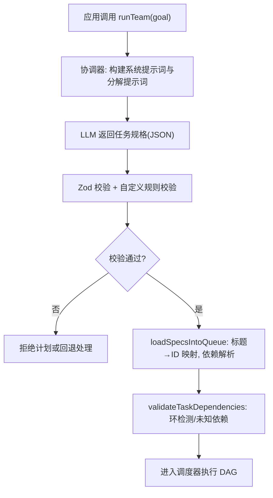
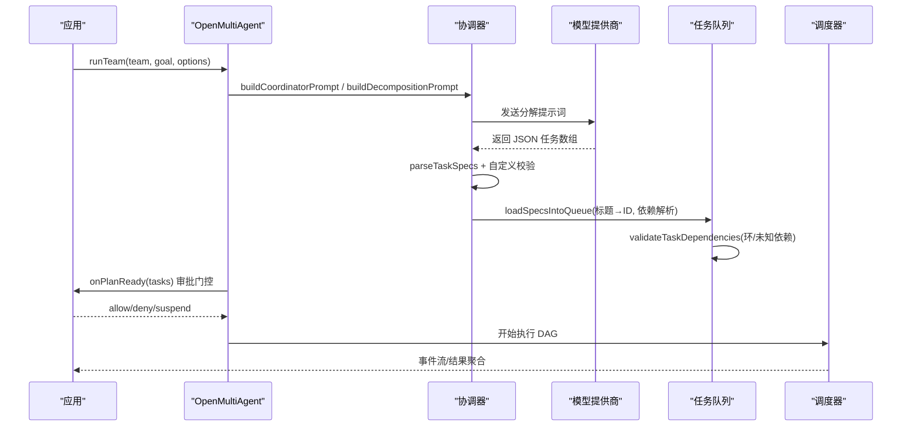
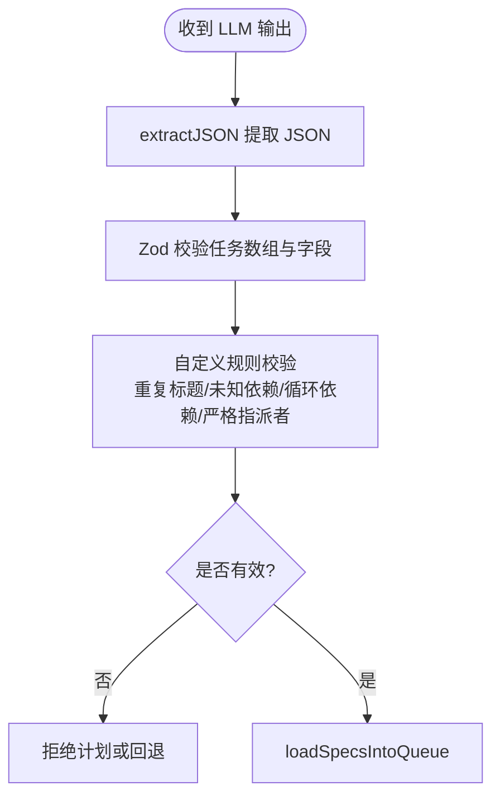
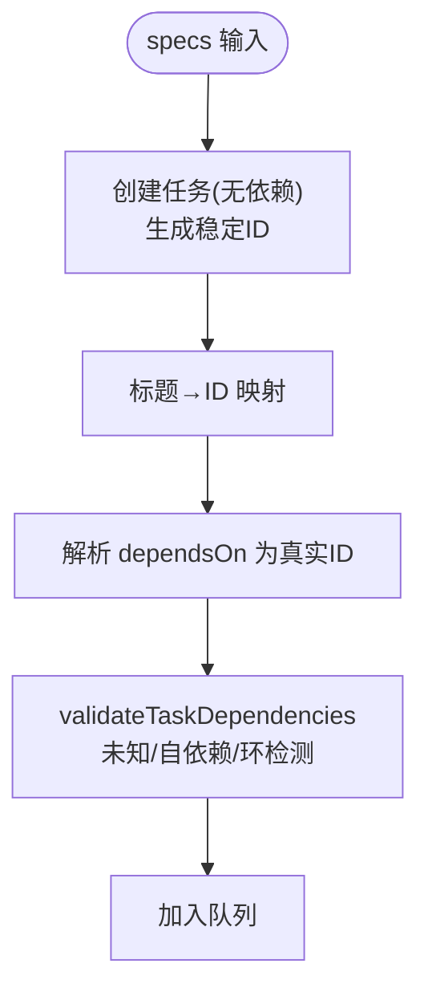
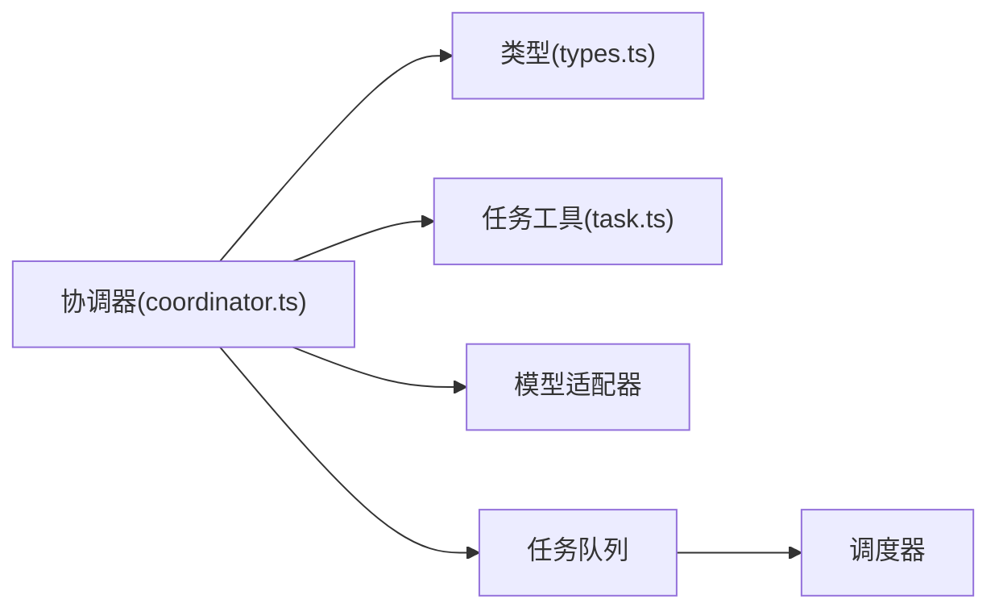

# 目标分解机制

<cite>
**本文引用的文件**
- [README.md](file://README.md)
- [AGENTS.md](file://AGENTS.md)
- [packages/core/README.md](file://packages/core/README.md)
- [packages/core/src/types.ts](file://packages/core/src/types.ts)
- [packages/core/src/orchestrator/coordinator.ts](file://packages/core/src/orchestrator/coordinator.ts)
- [packages/core/src/task/task.ts](file://packages/core/src/task/task.ts)
- [packages/core/tests/dependency-payload.test.ts](file://packages/core/tests/dependency-payload.test.ts)
</cite>

## 目录
1. [简介](#简介)
2. [项目结构](#项目结构)
3. [核心组件](#核心组件)
4. [架构总览](#架构总览)
5. [详细组件分析](#详细组件分析)
6. [依赖关系分析](#依赖关系分析)
7. [性能与可扩展性](#性能与可扩展性)
8. [故障排查指南](#故障排查指南)
9. [结论](#结论)
10. [附录：任务规格 JSON 规范与示例路径](#附录任务规格-json-规范与示例路径)

## 简介
本文件聚焦 Open Multi-Agent 的“目标分解机制”：协调器如何将用户的高层目标解析为可执行的、带依赖的任务图（DAG），并生成结构化的任务规格（JSON）。文档覆盖提示词构建、任务规格验证、依赖识别、模糊/不完整目标的容错策略，以及复杂嵌套目标与多步骤工作流的实现要点。内容既适合初学者理解基本概念，也为高级用户提供深入实现细节与扩展方法。

## 项目结构
Open Multi-Agent 的核心编排能力位于 `@open-multi-agent/core`。与目标分解直接相关的子系统包括：
- 协调器（coordinator）：负责提示词构建、LLM 调用、任务规格解析与校验、汇总合成。
- 任务模型与工具（task）：任务创建、依赖拓扑排序、依赖有效性校验。
- 类型与配置（types）：运行选项、任务字段、调度策略、审批门控等。
- 测试用例（tests）：验证依赖载荷、结构化数据传递、恢复场景等。

图表来源
- [packages/core/src/orchestrator/coordinator.ts:365-486](file://packages/core/src/orchestrator/coordinator.ts#L365-L486)
- [packages/core/src/orchestrator/coordinator.ts:251-263](file://packages/core/src/orchestrator/coordinator.ts#L251-L263)
- [packages/core/src/orchestrator/coordinator.ts:696-800](file://packages/core/src/orchestrator/coordinator.ts#L696-L800)
- [packages/core/src/task/task.ts:120-182](file://packages/core/src/task/task.ts#L120-L182)
- [packages/core/src/task/task.ts:206-261](file://packages/core/src/task/task.ts#L206-L261)

章节来源
- [packages/core/README.md:237-252](file://packages/core/README.md#L237-L252)
- [AGENTS.md:64-70](file://AGENTS.md#L64-L70)

## 核心组件
- 协调器提示词构建
  - 团队清单（roster manifest）：对每个 agent 暴露受限的角色摘要、能力、工具名、成本层级等，避免泄露完整 systemPrompt。
  - 输出格式说明：强制 LLM 仅返回 JSON 数组，包含 title、description、assignee、dependsOn、requires、verify 等字段。
  - 依赖指导：鼓励最小依赖集，优先依据角色摘要和能力判断输入消费关系。
  - 综合阶段：所有任务完成后，将结果与共享记忆摘要合并，生成最终答案。
- 任务规格解析与校验
  - 使用 Zod 严格校验任务数组与单个任务字段；支持可选的 verify 子配置。
  - 自定义校验：重复标题、未知/歧义依赖、循环依赖、严格指派者检查。
- 任务图构建与验证
  - 两阶段加载：先创建任务获取稳定 ID，再基于标题解析 dependsOn 为真实 ID。
  - 拓扑排序与环检测：Kahn 算法排序，DFS 着色检测环。
- 运行期控制点
  - onPlanReady：在计划就绪后、执行前进行审批门控，支持允许/拒绝/挂起。
  - strictAssignees：默认拒绝不在团队名单中的 assignee。
  - schedulingStrategy：未分配任务的调度策略，影响 DAG 执行顺序与并行度。

章节来源
- [packages/core/src/orchestrator/coordinator.ts:365-486](file://packages/core/src/orchestrator/coordinator.ts#L365-L486)
- [packages/core/src/orchestrator/coordinator.ts:251-263](file://packages/core/src/orchestrator/coordinator.ts#L251-L263)
- [packages/core/src/orchestrator/coordinator.ts:696-800](file://packages/core/src/orchestrator/coordinator.ts#L696-L800)
- [packages/core/src/task/task.ts:120-182](file://packages/core/src/task/task.ts#L120-L182)
- [packages/core/src/task/task.ts:206-261](file://packages/core/src/task/task.ts#L206-L261)
- [packages/core/src/types.ts:2131-2341](file://packages/core/src/types.ts#L2131-L2341)

## 架构总览
下图展示从高层目标到可执行任务图的端到端流程，包括提示词构建、LLM 输出解析、校验、队列装载与调度。

图表来源
- [packages/core/src/orchestrator/coordinator.ts:365-486](file://packages/core/src/orchestrator/coordinator.ts#L365-L486)
- [packages/core/src/orchestrator/coordinator.ts:251-263](file://packages/core/src/orchestrator/coordinator.ts#L251-L263)
- [packages/core/src/orchestrator/coordinator.ts:696-800](file://packages/core/src/orchestrator/coordinator.ts#L696-L800)
- [packages/core/src/types.ts:2318-2335](file://packages/core/src/types.ts#L2318-L2335)

## 详细组件分析

### 协调器提示词与输出契约
- 团队清单（Roster Manifest）
  - 暴露受限信息：name、model、roleSummary（≤140字符）、capabilities（≤20）、tools（≤24）、costTier。
  - 目的：让协调器做合理的任务指派与依赖推断，同时避免泄露完整 systemPrompt。
- 输出格式约束
  - 强制 JSON 数组；每个任务必须包含 title、description、assignee、dependsOn；可选 requires、verify。
  - 依赖指导：强调“最小依赖”，以角色摘要和能力为主要信号，避免无谓的父节点增加。
- 综合阶段
  - 将所有已完成任务的结果与失败/跳过任务信息、共享记忆摘要合并，生成最终回答。

章节来源
- [packages/core/src/orchestrator/coordinator.ts:336-363](file://packages/core/src/orchestrator/coordinator.ts#L336-L363)
- [packages/core/src/orchestrator/coordinator.ts:428-463](file://packages/core/src/orchestrator/coordinator.ts#L428-L463)
- [packages/core/src/orchestrator/coordinator.ts:644-688](file://packages/core/src/orchestrator/coordinator.ts#L644-L688)

### 任务规格解析与验证
- 解析入口
  - extractJSON 提取 LLM 输出的 JSON 片段，再用 Zod 严格校验任务数组与字段。
- 自定义校验
  - 重复标题、未知/歧义依赖、循环依赖检测。
  - strictAssignees 模式下拒绝不在团队名单中的 assignee。
- 可选 verify 配置
  - 协调器可发出 true 或部分对象（mode、quorum、maxRounds、onDissent），由调用方提供 judges 后合并为完整验证配置。

图表来源
- [packages/core/src/orchestrator/coordinator.ts:251-263](file://packages/core/src/orchestrator/coordinator.ts#L251-L263)
- [packages/core/src/orchestrator/coordinator.ts:112-186](file://packages/core/src/orchestrator/coordinator.ts#L112-L186)
- [packages/core/src/orchestrator/coordinator.ts:214-249](file://packages/core/src/orchestrator/coordinator.ts#L214-L249)

章节来源
- [packages/core/src/orchestrator/coordinator.ts:112-186](file://packages/core/src/orchestrator/coordinator.ts#L112-L186)
- [packages/core/src/orchestrator/coordinator.ts:251-263](file://packages/core/src/orchestrator/coordinator.ts#L251-L263)
- [packages/core/src/orchestrator/coordinator.ts:214-249](file://packages/core/src/orchestrator/coordinator.ts#L214-L249)

### 任务图构建与依赖解析
- 两阶段装载
  - 第一阶段：创建任务，获得稳定 ID；记录标题计数用于去重与歧义检测。
  - 第二阶段：将 dependsOn 的标题引用解析为真实 ID（支持原始 ID 与标题字符串）。
- 依赖验证
  - 未知依赖、自依赖、循环依赖检测；若存在未解析依赖，标记失败并阻止执行。
- 拓扑排序
  - Kahn 算法保证依赖顺序；可用于离线分析与调试。

图表来源
- [packages/core/src/orchestrator/coordinator.ts:696-800](file://packages/core/src/orchestrator/coordinator.ts#L696-L800)
- [packages/core/src/task/task.ts:120-182](file://packages/core/src/task/task.ts#L120-L182)
- [packages/core/src/task/task.ts:206-261](file://packages/core/src/task/task.ts#L206-L261)

章节来源
- [packages/core/src/orchestrator/coordinator.ts:696-800](file://packages/core/src/orchestrator/coordinator.ts#L696-L800)
- [packages/core/src/task/task.ts:120-182](file://packages/core/src/task/task.ts#L120-L182)
- [packages/core/src/task/task.ts:206-261](file://packages/core/src/task/task.ts#L206-L261)

### 运行期控制与扩展点
- onPlanReady 审批门控
  - 在计划就绪后、执行前拦截，支持 allow/deny/suspend；拒绝时仍保留协调器分解的 token 用量。
- strictAssignees
  - 默认拒绝不在团队名单中的 assignee，防止错误指派。
- schedulingStrategy
  - 未分配任务的调度策略，影响 DAG 执行顺序与并行度（如 dependency-first、composite 等）。
- revealCoordinator
  - 向 worker 注入团队上下文（原始目标、完整名单、当前执行者身份），便于多步任务调试与对齐。

章节来源
- [packages/core/src/types.ts:2131-2341](file://packages/core/src/types.ts#L2131-L2341)
- [packages/core/README.md:187-222](file://packages/core/README.md#L187-L222)

### 复杂嵌套目标与多步骤工作流
- 嵌套目标
  - 协调器可将复杂目标拆解为多级子任务，并通过 dependsOn 表达跨子任务的依赖。
- 多步骤工作流
  - 通过 memoryScope 与 dependencyPayload 控制下游任务可见的依赖结果形式（纯文本输出、结构化数据或两者）。
  - 结构化依赖数据需满足 JSON 序列化要求；否则任务失败并上报具体错误码。

章节来源
- [packages/core/src/types.ts:2052-2084](file://packages/core/src/types.ts#L2052-L2084)
- [packages/core/tests/dependency-payload.test.ts:148-220](file://packages/core/tests/dependency-payload.test.ts#L148-L220)

## 依赖关系分析
- 模块耦合
  - coordinator 依赖 task 工具函数进行任务创建与依赖校验；依赖 types 定义运行配置与任务字段。
  - scheduler 与 queue 消费已验证的任务图，按依赖触发执行。
- 外部依赖
  - Zod 用于强类型校验；LLM 适配器用于提示词执行；可选的共享内存用于综合阶段。
- 潜在风险
  - 循环依赖、未知依赖、标题歧义会在装载阶段被捕获；strictAssignees 可提前阻断错误指派。
  - 结构化依赖数据过大或非 JSON 会导致下游任务失败，需在上游确保数据体积与格式合规。

图表来源
- [packages/core/src/orchestrator/coordinator.ts:1-40](file://packages/core/src/orchestrator/coordinator.ts#L1-L40)
- [packages/core/src/task/task.ts:1-18](file://packages/core/src/task/task.ts#L1-L18)
- [packages/core/src/types.ts:2052-2084](file://packages/core/src/types.ts#L2052-L2084)

章节来源
- [packages/core/src/orchestrator/coordinator.ts:1-40](file://packages/core/src/orchestrator/coordinator.ts#L1-L40)
- [packages/core/src/task/task.ts:1-18](file://packages/core/src/task/task.ts#L1-L18)
- [packages/core/src/types.ts:2052-2084](file://packages/core/src/types.ts#L2052-L2084)

## 性能与可扩展性
- 并行度与依赖
  - 依赖导向的调度（dependency-first）与复合策略（composite）可在保持依赖正确性的前提下最大化并行度。
- 提示词与上下文
  - 团队清单与角色摘要限制大小，减少提示词长度；revealCoordinator 仅在需要时启用。
- 结构化依赖
  - 使用 structured 模式可减少冗余文本，但需确保序列化成功与体积可控。
- 可扩展点
  - 自定义 CoordinatorConfig 可覆盖 systemPrompt/instructions，增强领域特定引导。
  - 通过 verifyJudges 与 verify 钩子引入共识验证，提升关键任务质量。

[本节为通用指导，不直接分析具体文件]

## 故障排查指南
- 常见错误与定位
  - 未知/歧义依赖：检查任务标题唯一性与 dependsOn 引用是否正确。
  - 循环依赖：查看 validateTaskDependencies 的错误信息，调整依赖方向。
  - 严格指派者失败：确认 assignee 存在于团队名单，或关闭 strictAssignees（谨慎）。
  - 结构化依赖失败：检查上游输出是否为合法 JSON，且体积不超过限制。
- 诊断建议
  - 使用 planOnly 模式预览计划，结合 onPlanReady 审批门控人工复核。
  - 开启 revealCoordinator 以便 worker 看到团队上下文，便于多步调试。
  - 利用 Run Viewer 回放任务 DAG 与 span 瀑布视图，定位瓶颈与失败点。

章节来源
- [packages/core/src/orchestrator/coordinator.ts:112-186](file://packages/core/src/orchestrator/coordinator.ts#L112-L186)
- [packages/core/src/orchestrator/coordinator.ts:696-800](file://packages/core/src/orchestrator/coordinator.ts#L696-L800)
- [packages/core/tests/dependency-payload.test.ts:148-220](file://packages/core/tests/dependency-payload.test.ts#L148-L220)
- [packages/core/README.md:288-316](file://packages/core/README.md#L288-L316)

## 结论
Open Multi-Agent 的目标分解机制通过“受限团队清单 + 强约束输出格式 + 严格校验 + 两阶段依赖解析”的组合，将高层目标可靠地转化为可执行的 DAG。协调器负责提示词构建与 LLM 交互，任务工具负责拓扑与环检测，运行期控制点（onPlanReady、strictAssignees、schedulingStrategy）提供审批与调度灵活性。对于复杂嵌套目标与多步骤工作流，memoryScope 与 dependencyPayload 提供了细粒度的上下文与数据传递控制。借助 planOnly、Run Viewer 与结构化错误码，开发者可以高效调试与优化目标分解流程。

[本节为总结，不直接分析具体文件]

## 附录：任务规格 JSON 规范与示例路径
- 必需字段
  - title：短标题（字符串，非空）
  - description：详细描述与期望输出（字符串，非空）
  - assignee：团队成员名称（字符串，可选；strictAssignees 下必须在名单中）
  - dependsOn：依赖任务标题或 ID 的数组（字符串数组，可选）
- 可选字段
  - requires：硬约束（requiredTools、requiredCapabilities、requiredBackend、requiredProvider）
  - verify：true 或部分对象（mode、quorum、maxRounds、onDissent），由调用方提供 judges 后生效
  - memoryScope：dependencies 或 all
  - dependencyPayload：output、structured 或 both
  - role、priority、metadata、maxRetries、retryDelayMs、retryBackoff
- 示例参考
  - 基础团队协作示例：参见 packages/core/README.md 中的 quick start 与 examples 列表
  - 显式 DAG 示例：参见 cookbook/contract-review-dag
  - 结构化输出与依赖载荷测试：参见 tests/dependency-payload.test.ts

章节来源
- [packages/core/src/orchestrator/coordinator.ts:428-463](file://packages/core/src/orchestrator/coordinator.ts#L428-L463)
- [packages/core/src/orchestrator/coordinator.ts:251-263](file://packages/core/src/orchestrator/coordinator.ts#L251-L263)
- [packages/core/README.md:254-271](file://packages/core/README.md#L254-L271)
- [packages/core/tests/dependency-payload.test.ts:148-220](file://packages/core/tests/dependency-payload.test.ts#L148-L220)