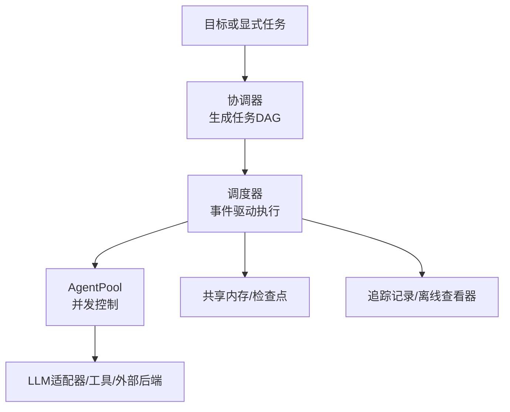
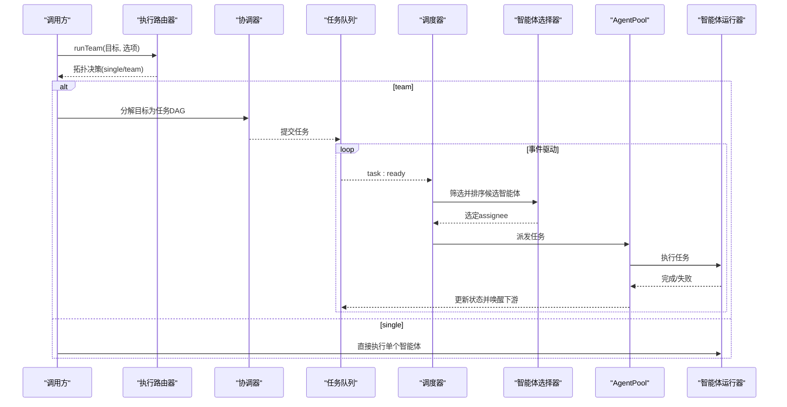
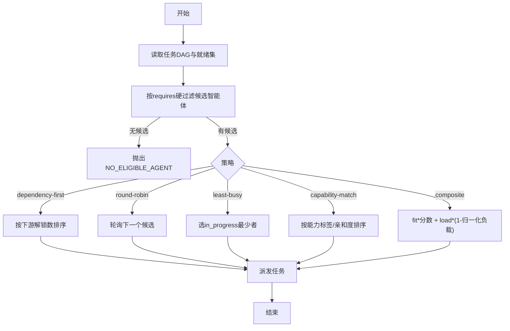
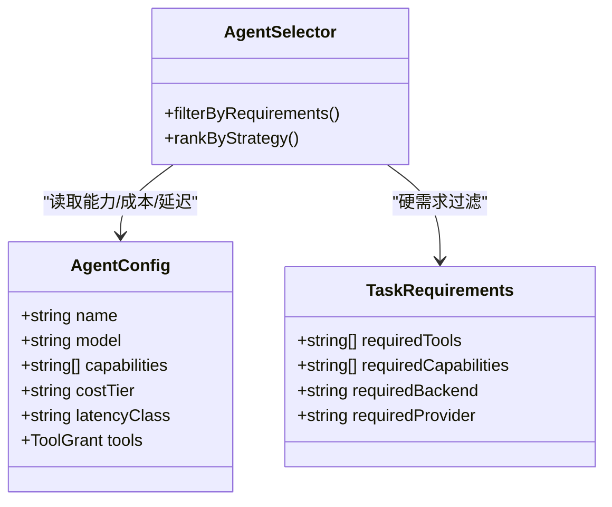
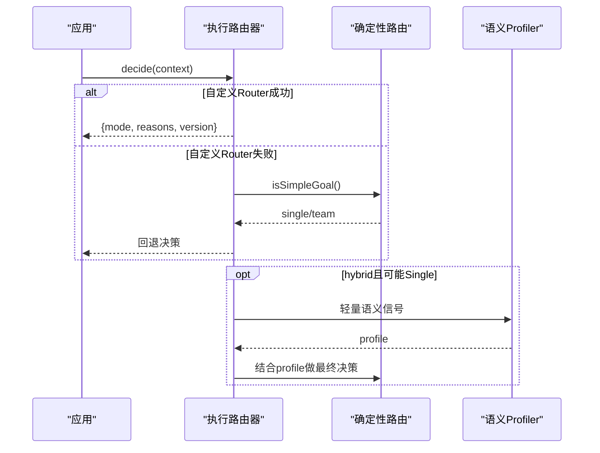
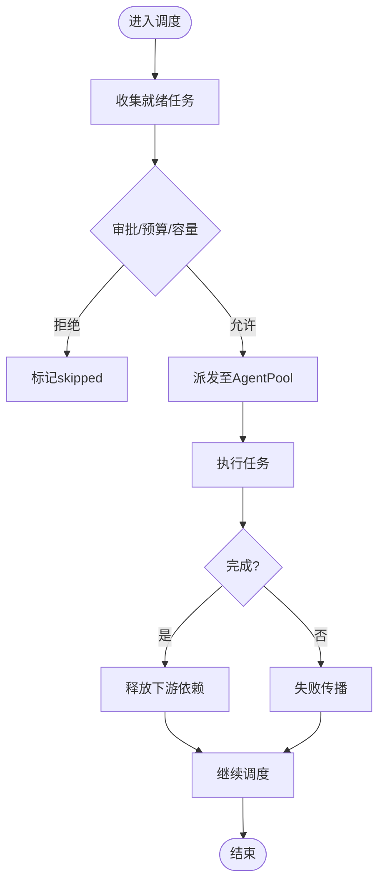
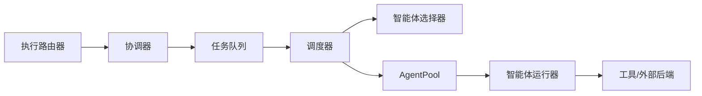

# 任务分配与智能体选择

<cite>
**本文引用的文件**
- [README.md](file://README.md)
- [packages/core/README.md](file://packages/core/README.md)
- [docs/task-scheduling.md](file://docs/task-scheduling.md)
- [docs/execution-routing.md](file://docs/execution-routing.md)
- [packages/core/src/types.ts](file://packages/core/src/types.ts)
- [packages/core/src/orchestrator/scheduler.ts](file://packages/core/src/orchestrator/scheduler.ts)
- [packages/core/src/orchestrator/agent-selector.ts](file://packages/core/src/orchestrator/agent-selector.ts)
- [packages/core/src/orchestrator/execution-router.ts](file://packages/core/src/orchestrator/execution-router.ts)
- [packages/core/src/orchestrator/coordinator.ts](file://packages/core/src/orchestrator/coordinator.ts)
- [packages/core/src/task/queue.ts](file://packages/core/src/task/queue.ts)
- [packages/core/src/agent/runner.ts](file://packages/core/src/agent/runner.ts)
- [packages/core/tests/dependency-payload.test.ts](file://packages/core/tests/dependency-payload.test.ts)
</cite>

## 目录
1. [简介](#简介)
2. [项目结构](#项目结构)
3. [核心组件](#核心组件)
4. [架构总览](#架构总览)
5. [详细组件分析](#详细组件分析)
6. [依赖关系分析](#依赖关系分析)
7. [性能考虑](#性能考虑)
8. [故障排查指南](#故障排查指南)
9. [结论](#结论)
10. [附录](#附录)

## 简介
本文件聚焦 Open Multi-Agent（OMA）的任务分配与智能体选择机制，系统性阐述：
- 任务分配策略：基于能力的匹配、负载均衡、优先级调度、依赖优先与复合评分。
- 智能体选择机制：角色匹配、工具可用性检查、能力标签与提供者约束。
- 执行路由器：拓扑选择（单智能体 vs 团队）、混合语义路由、失败回退与治理边界。
- 任务调度策略：事件驱动执行、FIFO/优先级队列、资源感知调度、预算与检查点。
- 实践建议：自定义分配策略、配置调度规则、处理冲突、监控执行情况与优化技巧。

## 项目结构
OMA 的核心编排位于 packages/core，围绕“协调器→任务图→调度器→AgentPool”的流水线组织；文档集中在 docs 与包内 README。

图表来源
- [packages/core/README.md:237-252](file://packages/core/README.md#L237-L252)
- [docs/task-scheduling.md:1-25](file://docs/task-scheduling.md#L1-L25)

章节来源
- [README.md:46-108](file://README.md#L46-L108)
- [packages/core/README.md:237-252](file://packages/core/README.md#L237-L252)

## 核心组件
- 调度器：维护就绪集合与进行中映射，事件驱动推进 DAG，负责将任务派发到 AgentPool。
- 智能体选择器：按硬需求过滤候选智能体，再按策略排序或轮询。
- 执行路由器：决定 Single/Team 拓扑，支持混合语义路由与确定性回退。
- 任务队列：管理任务状态、依赖、结构化依赖传递、检查点快照。
- 协调器：从目标生成任务图，或在治理意图下构建声明式拓扑。
- 智能体运行器：执行 LLM 调用、工具调用、循环检测与超时控制。

章节来源
- [docs/task-scheduling.md:1-25](file://docs/task-scheduling.md#L1-L25)
- [packages/core/src/types.ts:2131-2180](file://packages/core/src/types.ts#L2131-L2180)
- [docs/execution-routing.md:1-22](file://docs/execution-routing.md#L1-L22)
- [packages/core/src/task/queue.ts:1-200](file://packages/core/src/task/queue.ts#L1-L200)
- [packages/core/src/orchestrator/coordinator.ts:1-200](file://packages/core/src/orchestrator/coordinator.ts#L1-L200)
- [packages/core/src/agent/runner.ts:81-140](file://packages/core/src/agent/runner.ts#L81-L140)

## 架构总览
下图展示从目标到执行的端到端流程，包括路由、调度、选择与执行。

图表来源
- [docs/execution-routing.md:7-22](file://docs/execution-routing.md#L7-L22)
- [docs/task-scheduling.md:8-25](file://docs/task-scheduling.md#L8-L25)
- [packages/core/src/orchestrator/execution-router.ts:1-200](file://packages/core/src/orchestrator/execution-router.ts#L1-L200)
- [packages/core/src/orchestrator/scheduler.ts:1-200](file://packages/core/src/orchestrator/scheduler.ts#L1-L200)
- [packages/core/src/orchestrator/agent-selector.ts:1-200](file://packages/core/src/orchestrator/agent-selector.ts#L1-L200)

## 详细组件分析

### 任务分配策略
- 可用策略
  - dependency-first：优先安排能解锁最多下游的任务，适合强依赖图。
  - round-robin：在候选中轮询，适合可互换智能体。
  - least-busy：选择当前活动任务最少的智能体，适合时长差异大场景。
  - capability-match：先按硬需求过滤，再按能力标签与亲和度排序。
  - composite：综合依赖关键性、能力匹配与当前负载进行打分。
- 权重与负载
  - composite 使用 fit 与 load 权重（默认 0.7/0.3），负载以 in_progress 计数归一化。
- 硬需求校验
  - requiredTools/requiredCapabilities/requiredBackend/requiredProvider 在排序前硬过滤，不满足则失败。
- 显式 assignee
  - 显式指定必须满足要求；否则拒绝或回退（取决于 strictAssignees）。

图表来源
- [packages/core/src/types.ts:2131-2180](file://packages/core/src/types.ts#L2131-L2180)
- [docs/task-scheduling.md:98-133](file://docs/task-scheduling.md#L98-L133)

章节来源
- [packages/core/src/types.ts:2131-2180](file://packages/core/src/types.ts#L2131-L2180)
- [docs/task-scheduling.md:98-133](file://docs/task-scheduling.md#L98-L133)

### 智能体选择机制
- 角色匹配
  - 通过 AgentConfig.capabilities、description、costTier、latencyClass 等描述角色与成本/延迟特征。
  - 任务可通过 requires 声明必需工具、能力、后端与提供者。
- 工具可用性检查
  - 工具采用默认拒绝策略，需通过 allowlist/toolPreset 授予；未授予的工具调用会返回错误。
- 性能评估
  - costTier/latencyClass 作为应用级分层，配合 composite 的负载因子参与排序。
- 提供者与后端约束
  - requiredProvider/requiredBackend 在最终授予后校验，跨边界回退会被移除。

图表来源
- [packages/core/src/types.ts:906-935](file://packages/core/src/types.ts#L906-L935)
- [packages/core/src/types.ts:1360-1372](file://packages/core/src/types.ts#L1360-L1372)
- [packages/core/src/orchestrator/agent-selector.ts:1-200](file://packages/core/src/orchestrator/agent-selector.ts#L1-L200)

章节来源
- [packages/core/src/types.ts:906-935](file://packages/core/src/types.ts#L906-L935)
- [packages/core/src/types.ts:1360-1372](file://packages/core/src/types.ts#L1360-L1372)
- [packages/core/src/agent/runner.ts:1393-1429](file://packages/core/src/agent/runner.ts#L1393-L1429)

### 执行路由器：拓扑选择、故障转移与资源优化
- 优先级顺序
  - 显式 mode > 治理拓扑/降级策略 > per-call router > 内置 DeterministicRouter > hybrid 语义路由。
- 混合语义路由
  - 仅在确定性结果可能选择 Single 时，进行一次无工具的轻量 Profiler 调用，结合确定性策略升级/保持拓扑。
- 失败行为
  - 默认 fallback：自定义 Router/Profiler 失败回退到确定性路由；可配置 fail 终止。
- 治理边界
  - 路由不替代治理声明；需要独立审查/权限隔离的场景仍须显式治理。

图表来源
- [docs/execution-routing.md:7-22](file://docs/execution-routing.md#L7-L22)
- [docs/execution-routing.md:23-80](file://docs/execution-routing.md#L23-L80)
- [docs/execution-routing.md:120-181](file://docs/execution-routing.md#L120-L181)
- [docs/execution-routing.md:183-204](file://docs/execution-routing.md#L183-L204)

章节来源
- [docs/execution-routing.md:7-22](file://docs/execution-routing.md#L7-L22)
- [docs/execution-routing.md:23-80](file://docs/execution-routing.md#L23-L80)
- [docs/execution-routing.md:120-181](file://docs/execution-routing.md#L120-L181)
- [docs/execution-routing.md:183-204](file://docs/execution-routing.md#L183-L204)

### 任务调度策略与执行流
- 事件驱动执行
  - 任务就绪即触发调度，不等待同批无关任务；完成立即释放下游。
- 结果与依赖载荷
  - 支持 output/structured/both 三种依赖传递模式；structured 仅注入结构化 JSON，缺失或不可序列化会失败。
- 角色与元数据
  - role 表示业务角色，metadata 携带上下文键值（长度/格式限制，敏感信息脱敏）。
- 中断、预算与检查点
  - 统一 drain-then-skip 路径；预算检查在派发前与完成后进行；检查点持久化任务边界与结果。

图表来源
- [docs/task-scheduling.md:8-25](file://docs/task-scheduling.md#L8-L25)
- [docs/task-scheduling.md:27-64](file://docs/task-scheduling.md#L27-L64)
- [docs/task-scheduling.md:66-96](file://docs/task-scheduling.md#L66-L96)
- [docs/task-scheduling.md:166-184](file://docs/task-scheduling.md#L166-L184)

章节来源
- [docs/task-scheduling.md:8-25](file://docs/task-scheduling.md#L8-L25)
- [docs/task-scheduling.md:27-64](file://docs/task-scheduling.md#L27-L64)
- [docs/task-scheduling.md:66-96](file://docs/task-scheduling.md#L66-L96)
- [docs/task-scheduling.md:166-184](file://docs/task-scheduling.md#L166-L184)

### 代码级示例与用法指引
- 自定义分配策略
  - 参考 orchestrator 配置中的 schedulingStrategy 与 schedulingWeights，组合 capability-match/composite 实现领域定制。
  - 参考路径：[packages/core/src/types.ts:2131-2180](file://packages/core/src/types.ts#L2131-L2180)
- 配置调度规则
  - 设置 executionRouting.strategy 为 deterministic/hybrid，或通过 ExecutionRouter 提供 per-call 决策。
  - 参考路径：[docs/execution-routing.md:23-80](file://docs/execution-routing.md#L23-L80)
- 处理分配冲突
  - 当 requires 无法满足时，系统抛出 NO_ELIGIBLE_AGENT；显式 assignee 不满足要求时报 ASSIGNEE_REQUIREMENTS_MISMATCH。
  - 参考路径：[docs/task-scheduling.md:98-133](file://docs/task-scheduling.md#L98-L133)
- 监控任务执行
  - 使用 onProgress/onPlanReady/onTaskDispatch 等回调观察事件；结合离线 Run Viewer 回放。
  - 参考路径：[packages/core/src/types.ts:2282-2335](file://packages/core/src/types.ts#L2282-L2335)
  - 参考路径：[packages/core/README.md:288-316](file://packages/core/README.md#L288-L316)

章节来源
- [packages/core/src/types.ts:2131-2180](file://packages/core/src/types.ts#L2131-L2180)
- [docs/execution-routing.md:23-80](file://docs/execution-routing.md#L23-L80)
- [docs/task-scheduling.md:98-133](file://docs/task-scheduling.md#L98-L133)
- [packages/core/src/types.ts:2282-2335](file://packages/core/src/types.ts#L2282-L2335)
- [packages/core/README.md:288-316](file://packages/core/README.md#L288-L316)

## 依赖关系分析
- 耦合与内聚
  - 调度器与任务队列高内聚，通过事件解耦；智能体选择器与类型定义强耦合，便于扩展新策略。
  - 执行路由器与协调器相对独立，拓扑决策不影响模型路由。
- 外部依赖
  - LLM 适配器、工具执行器、外部后端（ACP/进程）通过 AgentPool 接入。
- 潜在循环
  - 通过 loopDetection 与最大轮次限制避免无限循环；任务失败/跳过及时传播，避免死锁。

图表来源
- [packages/core/src/task/queue.ts:1-200](file://packages/core/src/task/queue.ts#L1-L200)
- [packages/core/src/orchestrator/scheduler.ts:1-200](file://packages/core/src/orchestrator/scheduler.ts#L1-L200)
- [packages/core/src/orchestrator/agent-selector.ts:1-200](file://packages/core/src/orchestrator/agent-selector.ts#L1-L200)
- [packages/core/src/agent/runner.ts:81-140](file://packages/core/src/agent/runner.ts#L81-L140)
- [docs/execution-routing.md:1-22](file://docs/execution-routing.md#L1-L22)

章节来源
- [packages/core/src/task/queue.ts:1-200](file://packages/core/src/task/queue.ts#L1-L200)
- [packages/core/src/orchestrator/scheduler.ts:1-200](file://packages/core/src/orchestrator/scheduler.ts#L1-L200)
- [packages/core/src/orchestrator/agent-selector.ts:1-200](file://packages/core/src/orchestrator/agent-selector.ts#L1-L200)
- [packages/core/src/agent/runner.ts:81-140](file://packages/core/src/agent/runner.ts#L81-L140)
- [docs/execution-routing.md:1-22](file://docs/execution-routing.md#L1-L22)

## 性能考虑
- 事件驱动减少等待：下游任务在依赖满足后立即启动，提升吞吐。
- 负载感知：composite 与 least-busy 利用 in_progress 计数降低热点。
- 结构化依赖传递：structured 模式避免冗余文本，降低上下文大小与解析开销。
- 预算与检查点：预算检查在派发前后进行，检查点避免重复执行已完成任务。
- 工具默认拒绝：最小化副作用与不必要调用，提高安全性与可控性。

章节来源
- [docs/task-scheduling.md:8-25](file://docs/task-scheduling.md#L8-L25)
- [docs/task-scheduling.md:27-64](file://docs/task-scheduling.md#L27-L64)
- [docs/task-scheduling.md:166-184](file://docs/task-scheduling.md#L166-L184)
- [packages/core/src/agent/runner.ts:1393-1429](file://packages/core/src/agent/runner.ts#L1393-L1429)

## 故障排查指南
- 无法找到合格智能体
  - 现象：NO_ELIGIBLE_AGENT。
  - 排查：检查 requires 是否过严、capabilities 是否声明、工具授予是否正确。
  - 参考路径：[docs/task-scheduling.md:98-133](file://docs/task-scheduling.md#L98-L133)
- 显式 assignee 不满足要求
  - 现象：ASSIGNEE_REQUIREMENTS_MISMATCH。
  - 排查：修正 assignee 或放宽 requires；必要时关闭 strictAssignees 以保留旧行为。
  - 参考路径：[docs/task-scheduling.md:98-133](file://docs/task-scheduling.md#L98-L133)
- 结构化依赖传递失败
  - 现象：DEPENDENCY_STRUCTURED_SERIALIZATION_FAILED。
  - 排查：确保上游产出可序列化为 JSON；必要时改用 both/output。
  - 参考路径：[packages/core/tests/dependency-payload.test.ts:185-201](file://packages/core/tests/dependency-payload.test.ts#L185-L201)
- 工具调用被拒绝
  - 现象：工具未授予导致执行失败。
  - 排查：通过 tools/toolPreset 授予所需工具；确认 onToolCall 门控逻辑。
  - 参考路径：[packages/core/src/agent/runner.ts:1393-1429](file://packages/core/src/agent/runner.ts#L1393-L1429)
- 路由失败与回退
  - 现象：ROUTING_TIMEOUT/ROUTING_PROFILER_FAILED。
  - 排查：检查自定义 Router/Profiler 超时与返回值；必要时切换 failurePolicy。
  - 参考路径：[docs/execution-routing.md:120-181](file://docs/execution-routing.md#L120-L181)

章节来源
- [docs/task-scheduling.md:98-133](file://docs/task-scheduling.md#L98-L133)
- [packages/core/tests/dependency-payload.test.ts:185-201](file://packages/core/tests/dependency-payload.test.ts#L185-L201)
- [packages/core/src/agent/runner.ts:1393-1429](file://packages/core/src/agent/runner.ts#L1393-L1429)
- [docs/execution-routing.md:120-181](file://docs/execution-routing.md#L120-L181)

## 结论
OMA 通过“协调器+调度器+选择器+路由器”的分层设计，实现了灵活而可控的多智能体编排。其任务分配策略覆盖依赖优先、负载均衡与能力匹配，执行路由器支持混合语义与确定性回退，事件驱动调度保障高效执行。结合预算、检查点与观测能力，可在生产环境中稳定运行复杂多智能体工作流。

## 附录
- 快速上手与示例
  - 参考包内 README 的 Quick Start 与 Examples，定位与你场景匹配的示例。
  - 参考路径：[packages/core/README.md:57-111](file://packages/core/README.md#L57-L111)
- 生产清单
  - 预算、工具、恢复、观测、治理等生产要点。
  - 参考路径：[packages/core/README.md:288-316](file://packages/core/README.md#L288-L316)