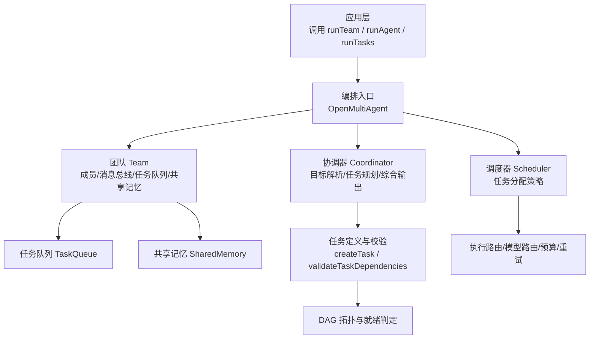
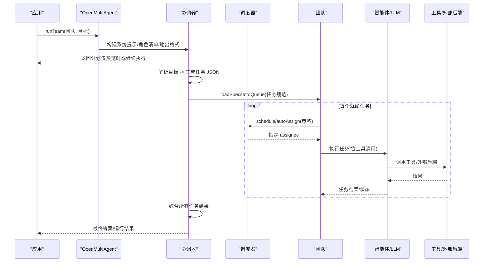
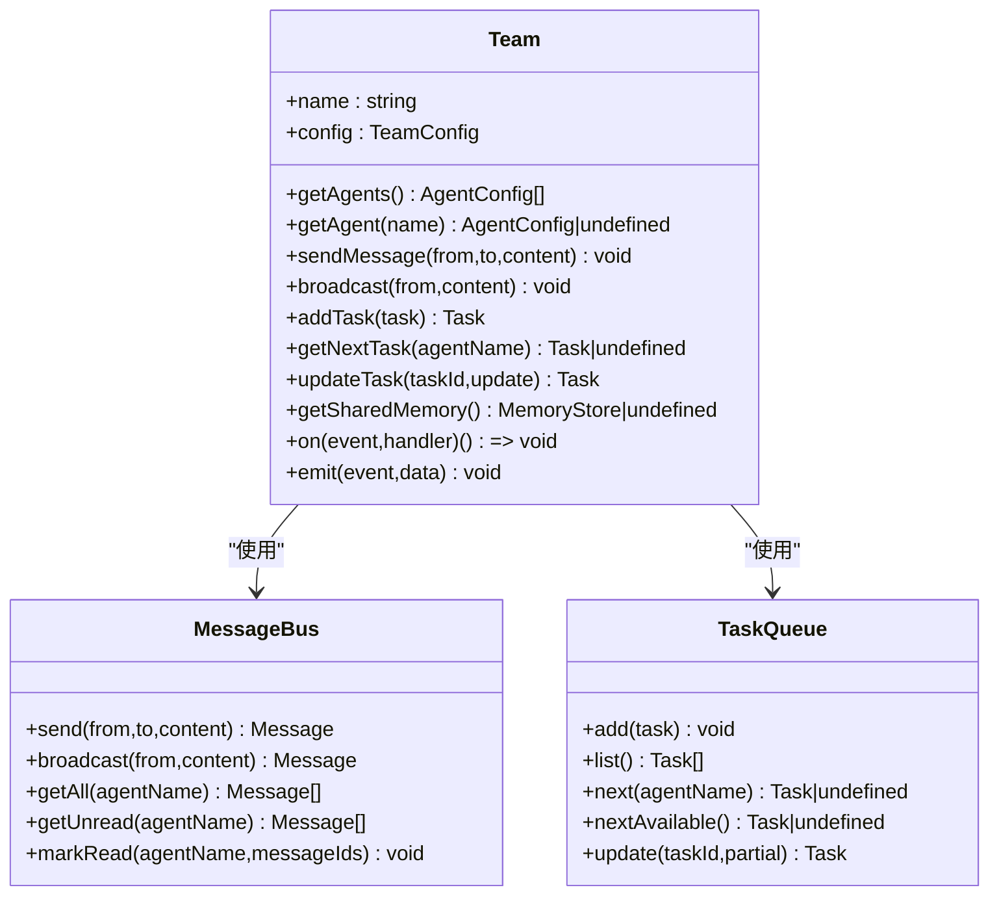
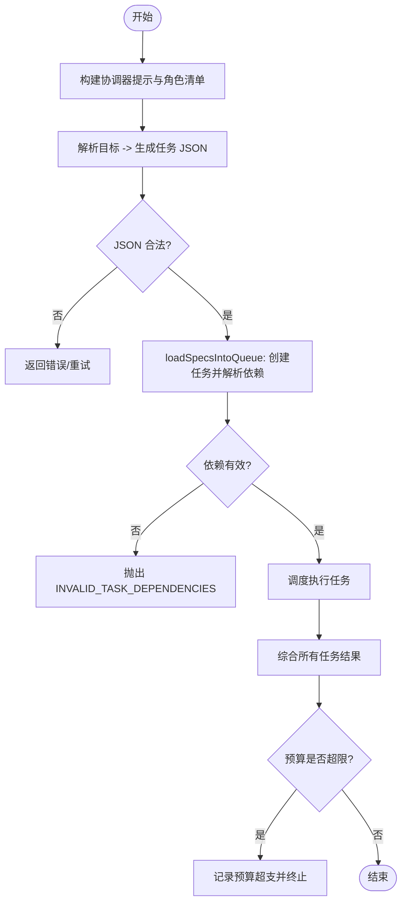
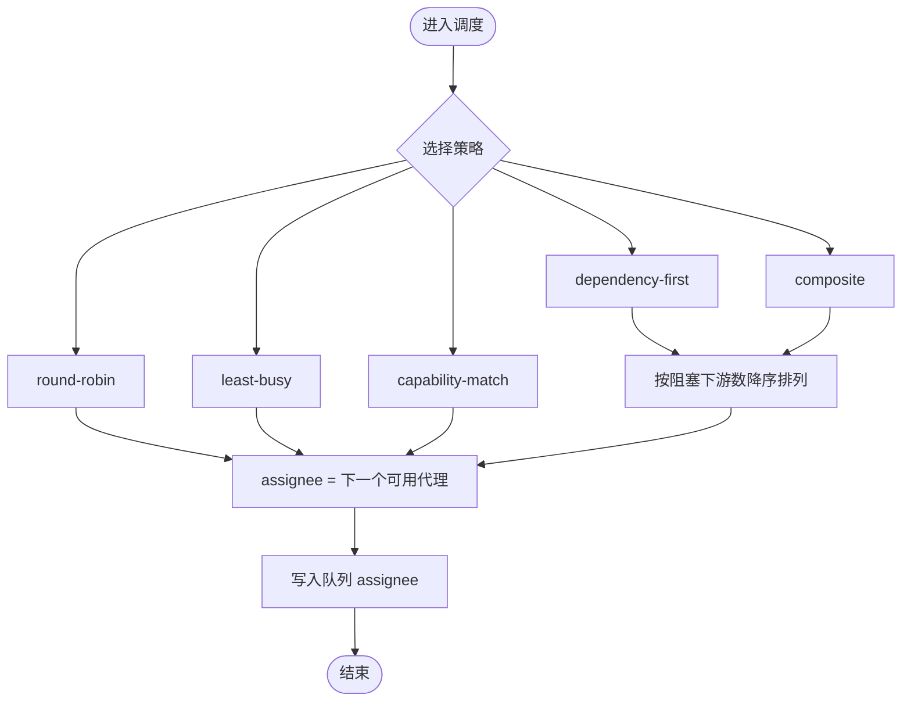
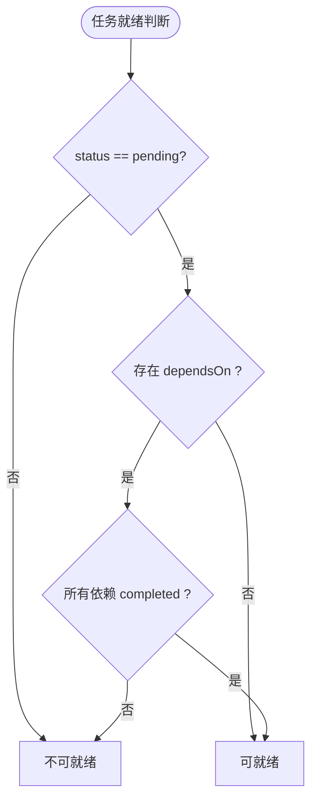
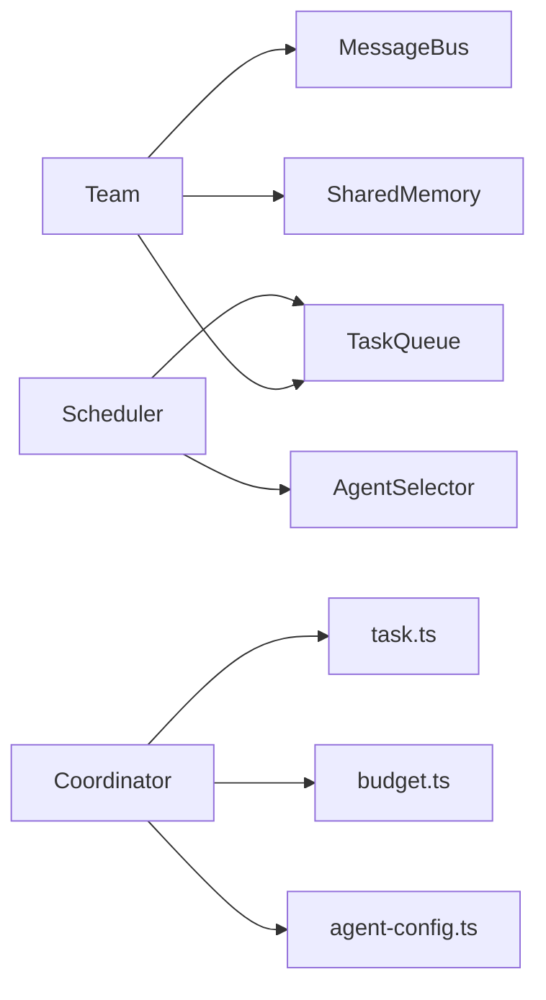

# 团队协作编排

<cite>
**本文引用的文件**
- [README_zh.md](file://README_zh.md)
- [packages/core/README.md](file://packages/core/README.md)
- [packages/core/src/team/team.ts](file://packages/core/src/team/team.ts)
- [packages/core/src/orchestrator/coordinator.ts](file://packages/core/src/orchestrator/coordinator.ts)
- [packages/core/src/orchestrator/scheduler.ts](file://packages/core/src/orchestrator/scheduler.ts)
- [packages/core/src/task/task.ts](file://packages/core/src/task/task.ts)
- [packages/core/src/types.ts](file://packages/core/src/types.ts)
</cite>

## 目录
1. [简介](#简介)
2. [项目结构](#项目结构)
3. [核心组件](#核心组件)
4. [架构总览](#架构总览)
5. [详细组件分析](#详细组件分析)
6. [依赖关系分析](#依赖关系分析)
7. [性能与调度特性](#性能与调度特性)
8. [故障排查指南](#故障排查指南)
9. [结论](#结论)
10. [附录：配置与示例路径](#附录：配置与示例路径)

## 简介
本文件面向希望在 TypeScript 后端中构建多智能体协作系统的团队，系统化阐述 Open Multi-Agent（OMA）的“团队协作编排”能力。内容覆盖：
- 团队（Team）概念、成员角色定义、职责分工与通信机制
- 工作流编排的核心原理：目标解析、任务依赖分析、执行顺序确定与资源分配策略
- 自动分解复杂任务为子任务并合理分配给不同智能体
- 同步与异步通信模式、数据共享机制与冲突解决策略
- 团队配置选项：成员角色、工具权限、预算限制等
- 具体代码示例路径，展示创建团队、定义角色、配置协作规则及异常处理

OMA 强调“只描述目标，不画任务图”，在运行时由协调器生成任务 DAG，并由确定性调度器分派到团队成员执行，整个过程可审查、可审批、可回放。

**章节来源**
- [README_zh.md:46-107](file://README_zh.md#L46-L107)
- [packages/core/README.md:49-51](file://packages/core/README.md#L49-L51)

## 项目结构
仓库采用多包组织，核心编排逻辑位于 packages/core，围绕 Team、Coordinator、Scheduler、Task 等模块展开；文档位于 docs，示例位于 examples。

**图示来源**
- [packages/core/src/orchestrator/coordinator.ts:1-800](file://packages/core/src/orchestrator/coordinator.ts#L1-L800)
- [packages/core/src/orchestrator/scheduler.ts:1-566](file://packages/core/src/orchestrator/scheduler.ts#L1-L566)
- [packages/core/src/team/team.ts:1-369](file://packages/core/src/team/team.ts#L1-L369)
- [packages/core/src/task/task.ts:1-262](file://packages/core/src/task/task.ts#L1-L262)

**章节来源**
- [packages/core/README.md:237-252](file://packages/core/README.md#L237-L252)

## 核心组件
- 团队（Team）：维护成员名册、点对点/广播消息、任务队列、可选共享记忆，以及事件总线，暴露 addTask/getNextTask 等接口。
- 协调器（Coordinator）：将高层目标解析为结构化任务清单（JSON），负责任务依赖、角色指派、验证选项注入，并在完成后进行结果综合。
- 调度器（Scheduler）：提供多种分配策略（轮询、最少忙碌、能力匹配、依赖优先、复合策略），决定未分配任务的执行顺序与归属。
- 任务（Task）：不可变工厂函数 createTask、就绪判定 isTaskReady、拓扑排序 getTaskDependencyOrder、依赖校验 validateTaskDependencies。
- 类型与配置（types.ts）：OrchestratorConfig、SchedulingStrategy、AgentConfig、TaskRequirements 等关键类型与默认行为说明。

**章节来源**
- [packages/core/src/team/team.ts:63-152](file://packages/core/src/team/team.ts#L63-L152)
- [packages/core/src/orchestrator/coordinator.ts:107-186](file://packages/core/src/orchestrator/coordinator.ts#L107-L186)
- [packages/core/src/orchestrator/scheduler.ts:18-82](file://packages/core/src/orchestrator/scheduler.ts#L18-L82)
- [packages/core/src/task/task.ts:23-75](file://packages/core/src/task/task.ts#L23-L75)
- [packages/core/src/types.ts:2131-2149](file://packages/core/src/types.ts#L2131-L2149)

## 架构总览
下图展示了从“目标”到“任务 DAG”再到“执行与汇总”的整体流程，涵盖协调器、调度器、团队、任务与外部 LLM/工具。

**图示来源**
- [packages/core/src/orchestrator/coordinator.ts:365-486](file://packages/core/src/orchestrator/coordinator.ts#L365-L486)
- [packages/core/src/orchestrator/coordinator.ts:696-800](file://packages/core/src/orchestrator/coordinator.ts#L696-L800)
- [packages/core/src/orchestrator/scheduler.ts:176-251](file://packages/core/src/orchestrator/scheduler.ts#L176-L251)
- [packages/core/src/team/team.ts:241-307](file://packages/core/src/team/team.ts#L241-L307)

## 详细组件分析

### 团队（Team）：角色、通信与任务管理
- 成员名册：通过 AgentConfig 注册，支持按名称查找与遍历。
- 通信机制：
  - 点对点消息 sendMessage(from,to,content)
  - 广播 broadcast(from,content)
  - 消息读取与已读标记 getMessages/getUnreadMessages/markMessagesRead
  - 事件总线 on/emit，桥接任务就绪/完成/失败/全部完成等事件
- 任务管理：
  - addTask 创建任务并加入队列，保留 dependsOn 与状态
  - getNextTask 优先取显式指派的任务，否则取任意可用待办
  - updateTask 更新状态/结果/负责人
- 共享记忆：可选启用，支持跨智能体上下文共享与摘要获取

**图示来源**
- [packages/core/src/team/team.ts:89-152](file://packages/core/src/team/team.ts#L89-L152)
- [packages/core/src/team/team.ts:176-235](file://packages/core/src/team/team.ts#L176-L235)
- [packages/core/src/team/team.ts:241-307](file://packages/core/src/team/team.ts#L241-L307)

**章节来源**
- [packages/core/src/team/team.ts:1-369](file://packages/core/src/team/team.ts#L1-L369)

### 协调器（Coordinator）：目标解析、任务规划与结果综合
- 角色清单与输出契约：构建受限的“团队名册”与严格的 JSON Schema，确保 assignee 来自名册、dependsOn 引用唯一且无环。
- 任务规范解析：parseTaskSpecs 提取结构化任务数组，支持 memoryScope、requires、verify 等字段。
- 依赖加载与校验：loadSpecsIntoQueue 先创建任务获得稳定 ID，再解析 title-based 依赖，最后统一校验并批量入队。
- 综合输出：runCoordinatorSynthesis 在所有任务完成后，结合任务结果与共享记忆摘要生成最终答案，同时考虑 token/成本预算。

**图示来源**
- [packages/core/src/orchestrator/coordinator.ts:107-186](file://packages/core/src/orchestrator/coordinator.ts#L107-L186)
- [packages/core/src/orchestrator/coordinator.ts:251-263](file://packages/core/src/orchestrator/coordinator.ts#L251-L263)
- [packages/core/src/orchestrator/coordinator.ts:696-800](file://packages/core/src/orchestrator/coordinator.ts#L696-L800)
- [packages/core/src/orchestrator/coordinator.ts:546-642](file://packages/core/src/orchestrator/coordinator.ts#L546-L642)

**章节来源**
- [packages/core/src/orchestrator/coordinator.ts:1-800](file://packages/core/src/orchestrator/coordinator.ts#L1-L800)

### 调度器（Scheduler）：任务分配策略与执行顺序
- 五种策略：
  - round-robin：按名册顺序轮询分配
  - least-busy：选择当前 in_progress 最少的智能体
  - capability-match：基于 requires/capabilities/关键词匹配打分
  - dependency-first：优先分配能解锁最多下游任务的关键路径任务
  - composite：综合关键性、能力匹配度与负载加权评分
- 事件驱动：orderReadyTasks 对依赖相关策略重排就绪集；scheduleTask 支持单任务即时分配；autoAssign 直接写入队列。
- 硬约束失败即报错：当任务要求无法满足时抛出 NO_ELIGIBLE_AGENT。

**图示来源**
- [packages/core/src/orchestrator/scheduler.ts:176-251](file://packages/core/src/orchestrator/scheduler.ts#L176-L251)
- [packages/core/src/orchestrator/scheduler.ts:298-508](file://packages/core/src/orchestrator/scheduler.ts#L298-L508)

**章节来源**
- [packages/core/src/orchestrator/scheduler.ts:1-566](file://packages/core/src/orchestrator/scheduler.ts#L1-L566)

### 任务（Task）：数据结构、就绪判定与拓扑排序
- createTask：生成唯一 ID、时间戳与默认 pending 状态，支持 role/priority/metadata/requires/verify 等扩展字段。
- isTaskReady：检查 status 与 dependsOn 是否全部 completed。
- getTaskDependencyOrder：Kahn 算法实现拓扑排序，保证依赖前置。
- validateTaskDependencies：检测未知引用、自依赖与环。

**图示来源**
- [packages/core/src/task/task.ts:81-114](file://packages/core/src/task/task.ts#L81-L114)
- [packages/core/src/task/task.ts:120-182](file://packages/core/src/task/task.ts#L120-L182)
- [packages/core/src/task/task.ts:188-261](file://packages/core/src/task/task.ts#L188-L261)

**章节来源**
- [packages/core/src/task/task.ts:1-262](file://packages/core/src/task/task.ts#L1-L262)

### 配置与治理：角色、工具权限与预算
- 团队配置：agents 列表、sharedMemory、maxConcurrency 等。
- 编排配置：schedulingStrategy、schedulingWeights、strictAssignees、governanceIntent/requiredRoles/requiredOrder。
- 工具与权限：默认拒绝内置工具，需显式授权；支持 toolPreset/disallowedTools 与 cwd 控制。
- 预算控制：maxTokenBudget、maxCostBudget + estimateCost，在 turn/task 边界检查，允许单次越界。
- 治理意图：required/preferred 强制拓扑与顺序，none/省略则保持自动分解。

**章节来源**
- [packages/core/README.md:169-186](file://packages/core/README.md#L169-L186)
- [packages/core/README.md:187-222](file://packages/core/README.md#L187-L222)
- [packages/core/README.md:288-308](file://packages/core/README.md#L288-L308)
- [packages/core/src/types.ts:2131-2149](file://packages/core/src/types.ts#L2131-L2149)

## 依赖关系分析
- Team 依赖 MessageBus、TaskQueue、SharedMemory，并通过 EventBus 暴露生命周期事件。
- Coordinator 依赖任务工厂与校验、预算与追踪、Agent 构建与模型路由。
- Scheduler 依赖 AgentSelector 与 TaskQueue，策略间复用 round-robin 游标与依赖关键路径计算。
- Task 模块提供纯函数，供上层编排与测试复用。

**图示来源**
- [packages/core/src/team/team.ts:1-369](file://packages/core/src/team/team.ts#L1-L369)
- [packages/core/src/orchestrator/coordinator.ts:1-800](file://packages/core/src/orchestrator/coordinator.ts#L1-L800)
- [packages/core/src/orchestrator/scheduler.ts:1-566](file://packages/core/src/orchestrator/scheduler.ts#L1-L566)
- [packages/core/src/task/task.ts:1-262](file://packages/core/src/task/task.ts#L1-L262)

**章节来源**
- [packages/core/src/team/team.ts:1-369](file://packages/core/src/team/team.ts#L1-L369)
- [packages/core/src/orchestrator/coordinator.ts:1-800](file://packages/core/src/orchestrator/coordinator.ts#L1-L800)
- [packages/core/src/orchestrator/scheduler.ts:1-566](file://packages/core/src/orchestrator/scheduler.ts#L1-L566)
- [packages/core/src/task/task.ts:1-262](file://packages/core/src/task/task.ts#L1-L262)

## 性能与调度特性
- 事件驱动 DAG：下游任务在依赖满足后立即启动，无需等待同批其他任务。
- 并行分支：独立任务可并发执行，受 maxConcurrency 与 agent 池限制。
- 调度策略选择：
  - 依赖密集场景推荐 dependency-first 或 composite
  - 角色同质化用 round-robin
  - 时长差异大用 least-busy
  - 角色差异化强用 capability-match
- 预算与超时：token/cost 双预算在 turn/task 边界检查；timeoutMs/callTimeoutMs 控制调用时限。
- 循环检测：依赖环在加载阶段即被拒绝，避免死锁。

**章节来源**
- [packages/core/README.md:187-222](file://packages/core/README.md#L187-L222)
- [packages/core/README.md:288-308](file://packages/core/README.md#L288-L308)
- [packages/core/src/task/task.ts:188-261](file://packages/core/src/task/task.ts#L188-L261)

## 故障排查指南
- 无效依赖/环：loadSpecsIntoQueue 会抛出 INVALID_TASK_DEPENDENCIES；validateTaskDependencies 用于提前发现环与未知引用。
- 无合格智能体：当任务 requires 无法被任何 agent 满足时，scheduler 抛出 NO_ELIGIBLE_AGENT。
- 预算超支：协调器综合阶段若超出 token/cost 预算，会标记 budgetExceeded 并停止后续步骤。
- 审批/恢复：可通过 checkpoint 与 durable approvals 中断后恢复；必要时启用自适应修复。

**章节来源**
- [packages/core/src/orchestrator/coordinator.ts:785-800](file://packages/core/src/orchestrator/coordinator.ts#L785-L800)
- [packages/core/src/orchestrator/scheduler.ts:546-557](file://packages/core/src/orchestrator/scheduler.ts#L546-L557)
- [packages/core/src/orchestrator/coordinator.ts:546-642](file://packages/core/src/orchestrator/coordinator.ts#L546-L642)

## 结论
OMA 以“目标驱动”的方式将复杂问题动态拆解为可执行的 DAG，并通过灵活的调度策略与严格的依赖校验，在多智能体之间高效协作。配合共享记忆、预算控制、可观测性与恢复机制，可在生产环境中稳定运行。建议根据业务特征选择合适的调度策略与治理意图，并结合示例逐步演进到更复杂的编排场景。

## 附录：配置与示例路径
- 快速开始与团队创建示例路径
  - 根级中文 README 中的示例片段：[README_zh.md:66-92](file://README_zh.md#L66-L92)
  - 核心包 README 中的 quick start 与执行模式表：[packages/core/README.md:57-111](file://packages/core/README.md#L57-L111)
- 治理与顺序声明示例路径
  - required/preferred 治理意图与顺序：[packages/core/README.md:169-186](file://packages/core/README.md#L169-L186)
- 调度策略与权重配置示例路径
  - schedulingStrategy 与 weights：[packages/core/README.md:187-222](file://packages/core/README.md#L187-L222)
- 生产配置与预算控制示例路径
  - 预算、工具、恢复与可观测性：[packages/core/README.md:288-308](file://packages/core/README.md#L288-L308)
- 团队与消息/任务 API 参考路径
  - Team 类方法与事件：[packages/core/src/team/team.ts:89-369](file://packages/core/src/team/team.ts#L89-L369)
- 协调器提示与任务规范路径
  - 角色清单/输出格式/综合提示：[packages/core/src/orchestrator/coordinator.ts:365-486](file://packages/core/src/orchestrator/coordinator.ts#L365-L486)
  - 任务规范解析与加载：[packages/core/src/orchestrator/coordinator.ts:251-263](file://packages/core/src/orchestrator/coordinator.ts#L251-L263), [packages/core/src/orchestrator/coordinator.ts:696-800](file://packages/core/src/orchestrator/coordinator.ts#L696-L800)
- 调度策略实现路径
  - 策略与排序：[packages/core/src/orchestrator/scheduler.ts:176-508](file://packages/core/src/orchestrator/scheduler.ts#L176-L508)
- 任务工具函数路径
  - 创建/就绪/拓扑/校验：[packages/core/src/task/task.ts:23-261](file://packages/core/src/task/task.ts#L23-L261)
- 编排配置类型参考路径
  - OrchestratorConfig 与调度策略枚举：[packages/core/src/types.ts:2131-2149](file://packages/core/src/types.ts#L2131-L2149)