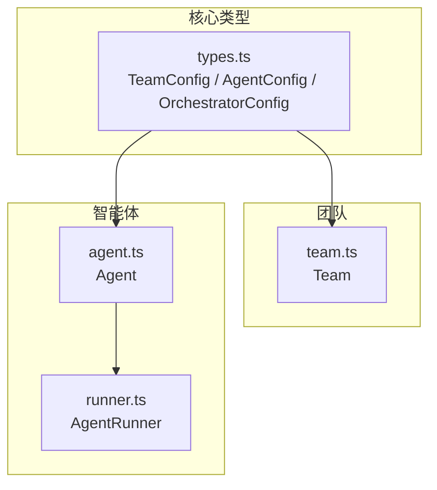
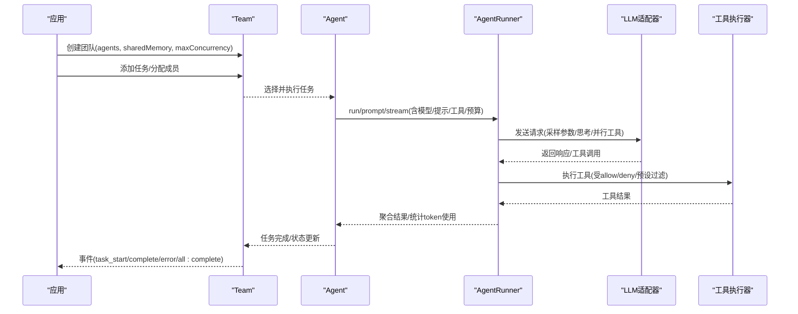
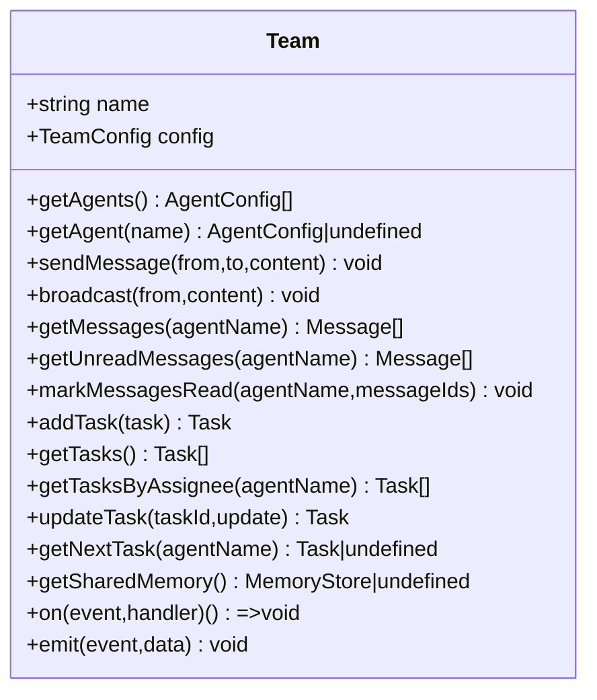
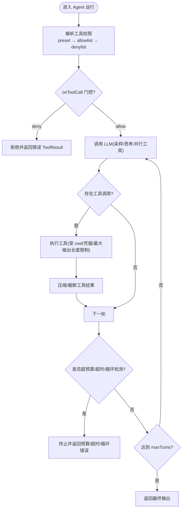
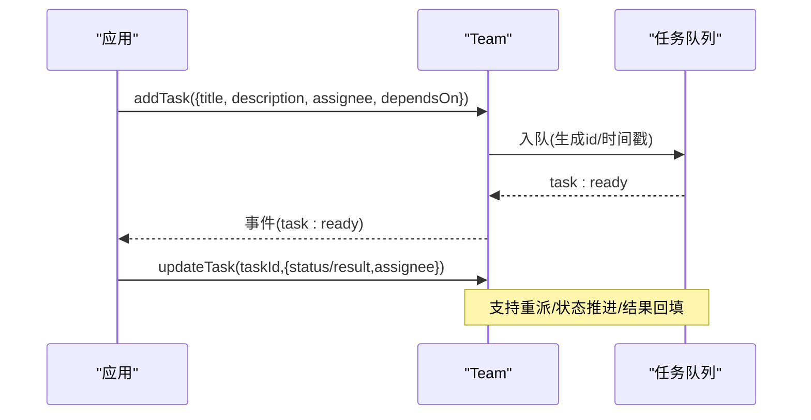
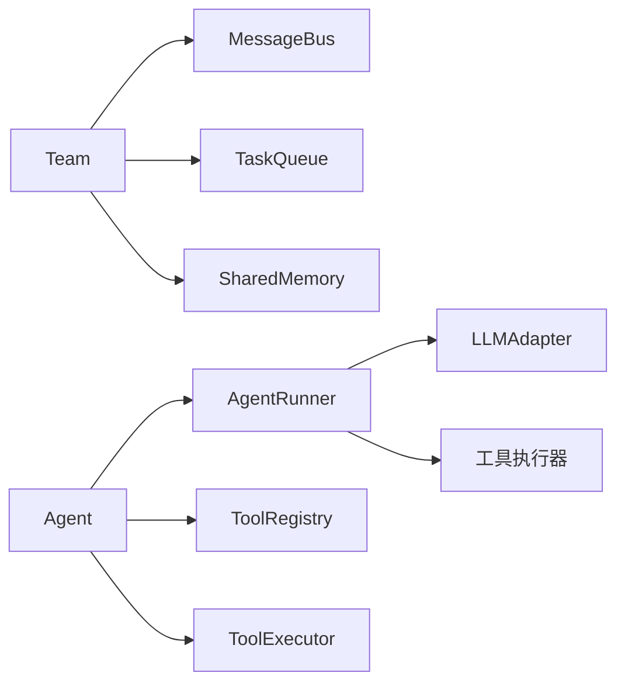

# 团队配置与成员管理

<cite>
**本文引用的文件**
- [types.ts](file://packages/core/src/types.ts)
- [team.ts](file://packages/core/src/team/team.ts)
- [agent.ts](file://packages/core/src/agent/agent.ts)
- [runner.ts](file://packages/core/src/agent/runner.ts)
- [dependency-payload.test.ts](file://packages/core/tests/dependency-payload.test.ts)
</cite>

## 目录
1. [简介](#简介)
2. [项目结构](#项目结构)
3. [核心组件](#核心组件)
4. [架构总览](#架构总览)
5. [详细组件分析](#详细组件分析)
6. [依赖关系分析](#依赖关系分析)
7. [性能考量](#性能考量)
8. [故障排查指南](#故障排查指南)
9. [结论](#结论)
10. [附录](#附录)

## 简介
本文件面向 Open Multi-Agent（OMA）的“团队配置与成员管理”主题，系统性阐述 Team 类、AgentConfig 接口、任务调度、工具权限、模型路由、预算控制、共享内存、事件总线以及动态成员管理等关键能力。文档以代码级事实为依据，提供可视化图示与最佳实践建议，帮助读者在复杂多智能体编排中构建可观测、可控、可扩展的团队。

## 项目结构
Open Multi-Agent 的核心类型定义集中在 types.ts；Team 负责成员注册、消息总线、任务队列与共享内存；Agent 封装 AgentRunner 并提供对话历史、流式输出、运行时工具注册等能力；runner.ts 实现 LLM 调用循环、工具执行、上下文压缩、超时与预算控制等。

**图表来源**
- [types.ts:1290-1310](file://packages/core/src/types.ts#L1290-L1310)
- [team.ts:89-152](file://packages/core/src/team/team.ts#L89-L152)
- [agent.ts:104-231](file://packages/core/src/agent/agent.ts#L104-L231)
- [runner.ts:85-166](file://packages/core/src/agent/runner.ts#L85-L166)

**章节来源**
- [types.ts:1290-1310](file://packages/core/src/types.ts#L1290-L1310)
- [team.ts:89-152](file://packages/core/src/team/team.ts#L89-L152)
- [agent.ts:104-231](file://packages/core/src/agent/agent.ts#L104-L231)
- [runner.ts:85-166](file://packages/core/src/agent/runner.ts#L85-L166)

## 核心组件
- Team：维护成员名册、消息总线、任务队列与可选共享内存，暴露事件总线用于生命周期监听。
- Agent：封装 AgentRunner，提供 run/prompt/stream、持久化历史、运行时工具增删、结构化输出校验、预算与超时控制。
- AgentRunner：LLM 调用循环、工具执行、上下文策略、并行工具调用、循环检测、压缩与预算限制。
- 类型体系：TeamConfig、AgentConfig、OrchestratorConfig、RunTasksOptions、RunTeamOptions、CoordinatorConfig 等构成配置与运行期选项。

**章节来源**
- [team.ts:89-369](file://packages/core/src/team/team.ts#L89-L369)
- [agent.ts:104-800](file://packages/core/src/agent/agent.ts#L104-L800)
- [runner.ts:85-166](file://packages/core/src/agent/runner.ts#L85-L166)
- [types.ts:1290-1489](file://packages/core/src/types.ts#L1290-L1489)

## 架构总览
下图展示从高层配置到具体执行的链路：应用通过 TeamConfig/AgentConfig/OrchestratorConfig 声明团队与成员；Team 组织任务与消息；Agent 驱动 Runner 完成 LLM 调用与工具执行；OrchestratorConfig 提供全局默认模型、并发、调度策略、预算与恢复策略。

**图表来源**
- [team.ts:154-369](file://packages/core/src/team/team.ts#L154-L369)
- [agent.ts:280-337](file://packages/core/src/agent/agent.ts#L280-L337)
- [runner.ts:960-993](file://packages/core/src/agent/runner.ts#L960-L993)
- [types.ts:2131-2236](file://packages/core/src/types.ts#L2131-L2236)

## 详细组件分析

### Team：团队、成员与任务编排
- 成员注册与发现：构造时按名称建立索引，支持 O(1) 查找；提供 getAgents/getAgent 获取成员清单与单个成员配置。
- 任务管理：addTask 创建任务并入队；getTasks/getTasksByAssignee 查询；updateTask 支持状态/结果/重新指派；getNextTask 优先取显式指派任务，否则取任意就绪任务。
- 消息系统：点对点 sendMessage、广播 broadcast、读取未读/全部消息、标记已读；支持快照与恢复。
- 共享内存：可通过 sharedMemoryStore 或 sharedMemory:true 启用；对外暴露 MemoryStore 接口。
- 事件总线：task:ready、task:complete、task:failed、all:complete、message、broadcast 等事件，便于上层监控与联动。

**图表来源**
- [team.ts:89-369](file://packages/core/src/team/team.ts#L89-L369)

**章节来源**
- [team.ts:89-369](file://packages/core/src/team/team.ts#L89-L369)

### AgentConfig：成员角色、模型、工具与权限
- 身份与角色：name、description、capabilities、costTier、latencyClass、permissionBoundary 用于声明能力、成本与时延等级及信任边界。
- 模型与提供者：model、provider、baseURL、apiKey、region、adapter；当在编排上下文中未设置 model 时可继承 OrchestratorConfig.defaultModel。
- 系统与指令：systemPrompt、instructions（协调器专用）、outputSchema（结构化输出）。
- 工具权限：tools（白名单）、disallowedTools（黑名单）、toolPreset（readonly/readwrite/full）、customTools（自定义工具绕过 preset 但仍受 disallowedTools 约束）、onToolCall（每次调用前门控）。
- 安全与沙箱：credentials（按 agent 隔离的凭据）、cwd（文件系统工具根目录，null 关闭沙箱）。
- 运行控制：maxTurns、maxTokens、maxTokenBudget、timeoutMs、callTimeoutMs、parallelToolCalls、thinking、contextStrategy、compressToolResults、preserveReasoningAsText、compressReasoningText、loopDetection。
- 外部后端：backend（acp/process），使成员作为独立进程或 ACP 客户端参与 DAG。

**图表来源**
- [runner.ts:85-166](file://packages/core/src/agent/runner.ts#L85-L166)
- [runner.ts:960-993](file://packages/core/src/agent/runner.ts#L960-L993)
- [types.ts:900-1200](file://packages/core/src/types.ts#L900-L1200)

**章节来源**
- [types.ts:900-1200](file://packages/core/src/types.ts#L900-L1200)
- [agent.ts:104-231](file://packages/core/src/agent/agent.ts#L104-L231)
- [runner.ts:85-166](file://packages/core/src/agent/runner.ts#L85-L166)

### OrchestratorConfig：团队级别配置
- 默认模型与提供者：defaultModel、defaultProvider、defaultBaseURL、defaultApiKey，供未显式设置的成员继承。
- 并发与调度：maxConcurrency、schedulingStrategy（round-robin/least-busy/capability-match/dependency-first/composite）、schedulingWeights、strictAssignees。
- 执行路由：executionRouter 决定 single/team 拓扑选择优先级。
- 预算与恢复：maxTokenBudget、maxCostBudget、estimateCost、checkpoint、recovery。
- 协调器配置：coordinator 的 model/systemPrompt/instructions/tools/toolPreset 等。

**章节来源**
- [types.ts:2131-2236](file://packages/core/src/types.ts#L2131-L2236)
- [types.ts:2600-2665](file://packages/core/src/types.ts#L2600-L2665)

### 动态成员与任务变化
- 成员发现与访问：Team.getAgents()/getAgent() 提供静态成员清单与按名检索。
- 任务动态性：addTask/updateTask 可在运行期间追加任务、修改状态/结果/重新指派；getNextTask 支持显式指派与自动兜底。
- 依赖与结构化传递：任务可声明 dependsOn 与 dependencyPayload（output/structured/both），确保下游仅接收经校验的结构化数据。
- 检查点与恢复：checkpoint/store/runId 支持中断后恢复；restore 可续跑 runTeam 流程。

**图表来源**
- [team.ts:241-307](file://packages/core/src/team/team.ts#L241-L307)
- [types.ts:1386-1415](file://packages/core/src/types.ts#L1386-L1415)

**章节来源**
- [team.ts:241-307](file://packages/core/src/team/team.ts#L241-L307)
- [dependency-payload.test.ts:51-82](file://packages/core/tests/dependency-payload.test.ts#L51-L82)
- [dependency-payload.test.ts:219-247](file://packages/core/tests/dependency-payload.test.ts#L219-L247)

### 工具权限与系统提示词
- 工具权限解析顺序：toolPreset → allowedTools → disallowedTools；customTools 绕过 preset 但仍受 disallowedTools 约束。
- 系统提示词：AgentConfig.systemPrompt 为成员级；CoordinatorConfig.systemPrompt 覆盖协调器默认引导；outputSchema 会注入结构化输出指令。
- 工具门控：onToolCall 在输入校验后、执行前拦截，可返回 deny 以向模型返回错误 ToolResult。

**章节来源**
- [types.ts:965-999](file://packages/core/src/types.ts#L965-L999)
- [types.ts:2600-2665](file://packages/core/src/types.ts#L2600-L2665)
- [runner.ts:139-149](file://packages/core/src/agent/runner.ts#L139-L149)

### 并发控制与资源分配
- 团队并发：TeamConfig.maxConcurrency 限制团队内并发度。
- 调度策略：OrchestratorConfig.schedulingStrategy 控制未指派任务的分配策略（轮询/最少忙/能力匹配/依赖优先/复合）。
- 预算与超时：maxTokenBudget、maxCostBudget、timeoutMs、callTimeoutMs 共同保障资源上限与稳定性。

**章节来源**
- [types.ts:1295-1310](file://packages/core/src/types.ts#L1295-L1310)
- [types.ts:2131-2236](file://packages/core/src/types.ts#L2131-L2236)

## 依赖关系分析
- Team 依赖 MessageBus、TaskQueue、SharedMemory，并通过内部 EventBus 统一事件。
- Agent 依赖 AgentRunner、ToolRegistry、ToolExecutor，并在首次运行时懒加载后端（LLM 或外部 ACP/进程）。
- Runner 依赖 LLMAdapter、工具执行器与上下文策略，实现主循环、工具调用、压缩与预算控制。

**图表来源**
- [team.ts:19-23](file://packages/core/src/team/team.ts#L19-L23)
- [agent.ts:67-81](file://packages/core/src/agent/agent.ts#L67-L81)
- [runner.ts:85-166](file://packages/core/src/agent/runner.ts#L85-L166)

**章节来源**
- [team.ts:19-23](file://packages/core/src/team/team.ts#L19-L23)
- [agent.ts:67-81](file://packages/core/src/agent/agent.ts#L67-L81)
- [runner.ts:85-166](file://packages/core/src/agent/runner.ts#L85-L166)

## 性能考量
- 合理设置并发与调度：根据任务时长分布选择 least-busy 或 capability-match；对强依赖图使用 dependency-first。
- 控制上下文增长：启用 compressToolResults 与 compressReasoningText，避免长上下文导致 token 膨胀。
- 限制工具输出：通过 maxToolOutputChars 与 per-tool 的 maxOutputChars 控制噪声。
- 预算与超时：设置 maxTokenBudget、timeoutMs、callTimeoutMs，防止长时间阻塞与成本失控。
- 并行工具调用：在支持的提供商上开启 parallelToolCalls 提升吞吐，但需考虑本地服务兼容性。

[本节为通用指导，不直接分析具体文件]

## 故障排查指南
- 预算超限：当累计 token 超过阈值时，Agent 返回 budgetExceeded 并携带 TokenBudgetExceededError 信息，可用于重试或降级策略。
- 超时与取消：timeoutMs 与 abortSignal 组合触发中止；区分调用方取消与超时错误。
- 结构化输出失败：outputSchema 校验失败会尝试一次带错误反馈的重试；若仍失败则返回验证错误。
- 工具被拒：onToolCall 返回 deny 将向模型返回错误 ToolResult，便于模型调整行为。
- 任务依赖与恢复：通过 checkpoint/store/runId 保存进度；restore 可续跑并重建协同结果。

**章节来源**
- [agent.ts:481-504](file://packages/core/src/agent/agent.ts#L481-L504)
- [agent.ts:527-596](file://packages/core/src/agent/agent.ts#L527-L596)
- [agent.ts:648-735](file://packages/core/src/agent/agent.ts#L648-L735)
- [types.ts:2349-2377](file://packages/core/src/types.ts#L2349-L2377)

## 结论
Open Multi-Agent 通过 Team/Agent/Runner 的分层设计，结合类型化的配置体系，提供了灵活而强大的多智能体编排能力。借助工具权限、预算控制、并发与调度策略、共享内存与事件机制，开发者可以构建高可靠、可观测、可扩展的团队。建议在真实场景中结合业务约束选择合适的调度策略与预算上限，并通过检查点与恢复增强鲁棒性。

[本节为总结，不直接分析具体文件]

## 附录
- 创建团队与成员示例路径：参考 TeamConfig 与 AgentConfig 字段定义，结合 Team.addTask 与 Agent.run/prompt/stream。
- 动态变更示例路径：使用 Team.updateTask 进行重派与状态推进；通过 dependencyPayload 传递结构化结果。
- 最佳实践清单：
  - 明确成员能力标签与信任边界，配合 schedulingStrategy 做精准匹配。
  - 为每个成员设定最小必要工具集与凭据，遵循最小权限原则。
  - 为长任务设置合理的 maxTurns、maxTokenBudget、timeoutMs。
  - 启用 compressToolResults/preserveReasoningAsText 控制上下文规模。
  - 使用 checkpoint 与 restore 保障长流程的可恢复性。

[本节为补充说明，不直接分析具体文件]