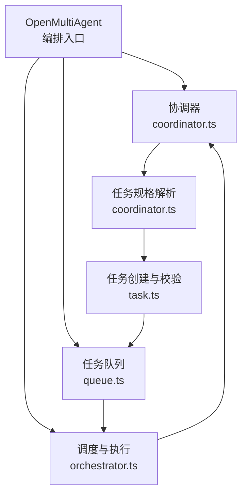
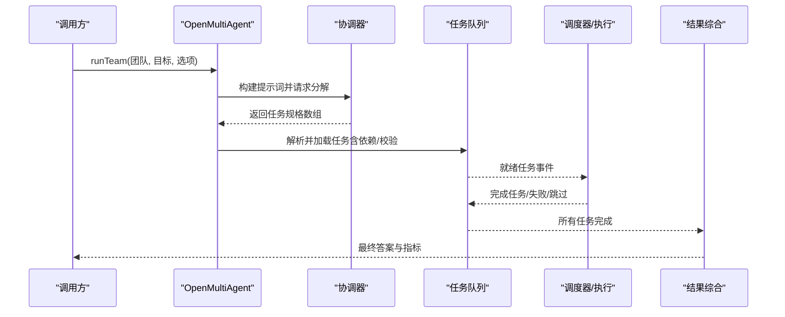
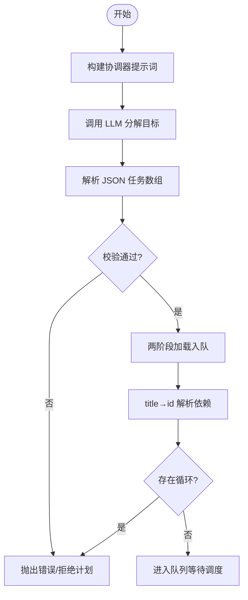
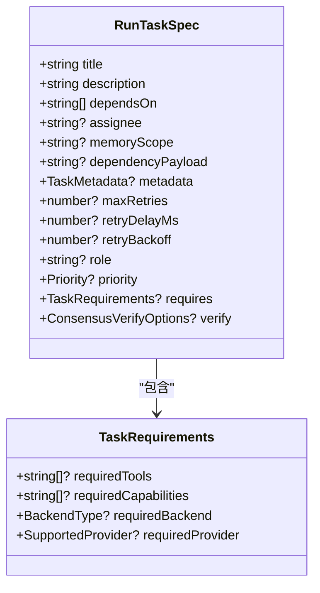
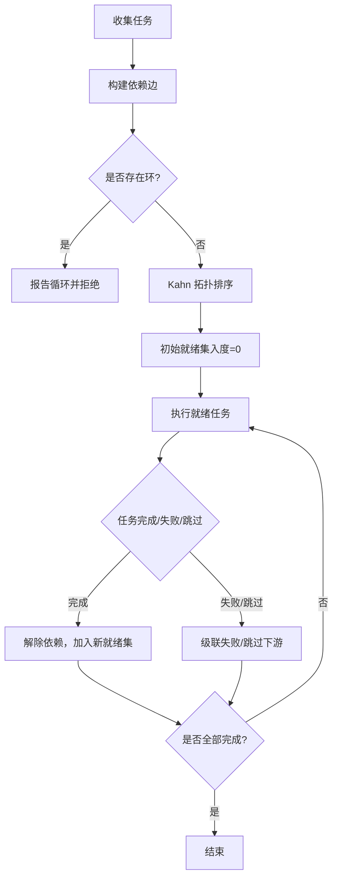
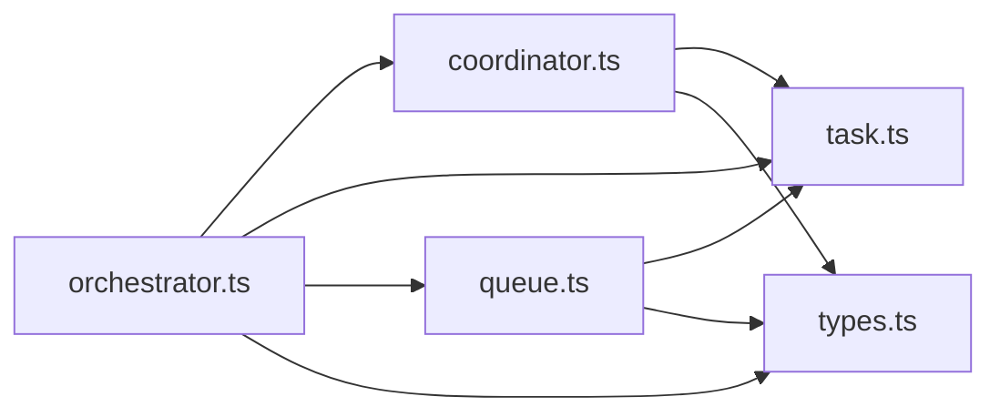

# 工作流分解与任务生成

<cite>
**本文引用的文件**
- [README.md](file://README.md)
- [AGENTS.md](file://AGENTS.md)
- [orchestrator.ts](file://packages/core/src/orchestrator/orchestrator.ts)
- [coordinator.ts](file://packages/core/src/orchestrator/coordinator.ts)
- [task.ts](file://packages/core/src/task/task.ts)
- [queue.ts](file://packages/core/src/task/queue.ts)
- [types.ts](file://packages/core/src/types.ts)
- [dependency-payload.test.ts](file://packages/core/tests/dependency-payload.test.ts)
</cite>

## 目录
1. [简介](#简介)
2. [项目结构](#项目结构)
3. [核心组件](#核心组件)
4. [架构总览](#架构总览)
5. [详细组件分析](#详细组件分析)
6. [依赖关系分析](#依赖关系分析)
7. [性能考虑](#性能考虑)
8. [故障排查指南](#故障排查指南)
9. [结论](#结论)
10. [附录](#附录)

## 简介
本文件聚焦 Open Multi-Agent 的“目标驱动”工作流：协调器将高层目标在运行时分解为任务有向无环图（DAG），调度器按依赖与策略分配给团队代理执行，最终由协调器汇总结果。文档深入解释：
- 协调器的工作原理：目标解析、任务分解、依赖校验与循环检测
- 任务规格 TaskSpec 的结构与验证机制
- 工作流图构建：依赖图生成、循环检测、执行顺序确定
- 任务要求解析：工具、能力、后端类型等硬约束
- 示例与最佳实践：复杂工作流定义、依赖处理、异常处理与设计优化

## 项目结构
仓库采用多工作区组织，核心编排逻辑位于 packages/core/src，关键子系统包括：
- orchestrator：编排入口、路由、预算、共识、恢复等
- coordinator：协调器提示词、任务规格解析与加载
- task：任务创建、就绪判断、拓扑排序、依赖校验
- queue：事件化任务队列、状态推进、计划修补与快照
- types：统一类型定义（Task、RunTaskSpec、TaskRequirements、OrchestratorConfig 等）

**图表来源**
- [orchestrator.ts:1-220](file://packages/core/src/orchestrator/orchestrator.ts#L1-L220)
- [coordinator.ts:1-120](file://packages/core/src/orchestrator/coordinator.ts#L1-L120)
- [task.ts:1-80](file://packages/core/src/task/task.ts#L1-L80)
- [queue.ts:1-120](file://packages/core/src/task/queue.ts#L1-L120)

**章节来源**
- [README.md:46-97](file://README.md#L46-L97)
- [AGENTS.md:64-70](file://AGENTS.md#L64-L70)

## 核心组件
- 协调器（Coordinator）：负责将目标分解为任务数组，构造系统提示与输出格式，解析并校验任务规格，必要时进行结果综合。
- 任务规格（TaskSpec/RunTaskSpec）：描述任务标题、描述、依赖、优先级、角色、元数据、重试策略、硬性要求与可选共识验证。
- 任务与队列（Task & TaskQueue）：任务生命周期管理、依赖就绪判定、拓扑排序、事件驱动推进、失败/跳过级联、计划修补与快照。
- 编排器（OpenMultiAgent）：组合协调器、队列、调度器、代理池、预算与可观测性，提供 runTeam/runTasks/runAgent 三种模式。

**章节来源**
- [orchestrator.ts:1-220](file://packages/core/src/orchestrator/orchestrator.ts#L1-L220)
- [coordinator.ts:1-120](file://packages/core/src/orchestrator/coordinator.ts#L1-L120)
- [task.ts:1-80](file://packages/core/src/task/task.ts#L1-L80)
- [queue.ts:1-120](file://packages/core/src/task/queue.ts#L1-L120)
- [types.ts:1386-1444](file://packages/core/src/types.ts#L1386-L1444)

## 架构总览
下图展示从目标到任务 DAG 的端到端流程：编排器调用协调器生成任务规格，解析并校验后入队；调度器按策略选择代理执行；完成后协调器综合结果。

**图表来源**
- [orchestrator.ts:140-220](file://packages/core/src/orchestrator/orchestrator.ts#L140-L220)
- [coordinator.ts:365-486](file://packages/core/src/orchestrator/coordinator.ts#L365-L486)
- [queue.ts:64-120](file://packages/core/src/task/queue.ts#L64-L120)

## 详细组件分析

### 协调器（目标解析与任务分解）
- 提示词构建：基于团队清单、输出格式与合成指导生成系统提示与分解提示，限制协调器仅输出 JSON 任务数组。
- 规格解析与校验：使用 Zod Schema 校验任务字段（标题、描述、依赖、优先级、角色、硬性要求、可选 verify），并进行：
  - 标题唯一性与依赖引用唯一性检查
  - 未知/歧义依赖报错
  - 循环依赖检测（DFS 着色）
- 需求解析：解析 requiredTools、requiredCapabilities、requiredBackend、requiredProvider 等硬约束，供后续选择代理时过滤。
- 负载入队：两阶段加载——先创建任务获取稳定 ID，再将 title-based dependsOn 解析为真实 ID，最后整体校验依赖有效性。

**图表来源**
- [coordinator.ts:75-186](file://packages/core/src/orchestrator/coordinator.ts#L75-L186)
- [coordinator.ts:251-300](file://packages/core/src/orchestrator/coordinator.ts#L251-L300)
- [coordinator.ts:696-800](file://packages/core/src/orchestrator/coordinator.ts#L696-L800)

**章节来源**
- [coordinator.ts:75-186](file://packages/core/src/orchestrator/coordinator.ts#L75-L186)
- [coordinator.ts:251-300](file://packages/core/src/orchestrator/coordinator.ts#L251-L300)
- [coordinator.ts:365-486](file://packages/core/src/orchestrator/coordinator.ts#L365-L486)
- [coordinator.ts:696-800](file://packages/core/src/orchestrator/coordinator.ts#L696-L800)

### 任务规格（TaskSpec/RunTaskSpec）结构与验证
- 基本字段
  - title/description：必填，用于标识与上下文注入
  - assignee：可选，显式指定代理名
  - dependsOn：依赖的任务 ID 或标题（会被解析为 ID）
  - memoryScope：依赖上下文注入范围（dependencies/all）
  - dependencyPayload：依赖结果注入形式（output/structured/both）
  - role/priority：模型路由与调度匹配信号
  - metadata：受控的业务引用，会在结果/追踪中脱敏
  - maxRetries/retryDelayMs/retryBackoff：重试策略
  - requires：硬性要求（工具、能力、后端、提供商）
  - verify：可选共识验证配置（需配合 verifyJudges）
- 校验要点
  - 标题唯一性、依赖唯一引用
  - 未知/歧义依赖报错
  - 循环依赖检测
  - 严格代理名校验（strictAssignees）

**图表来源**
- [types.ts:1386-1444](file://packages/core/src/types.ts#L1386-L1444)
- [types.ts:1360-1381](file://packages/core/src/types.ts#L1360-L1381)

**章节来源**
- [types.ts:1386-1444](file://packages/core/src/types.ts#L1386-L1444)
- [types.ts:1360-1381](file://packages/core/src/types.ts#L1360-L1381)

### 工作流图（DAG）构建与执行顺序
- 依赖图生成：从任务规格构建任务集合，建立 dependsOn 边
- 循环检测：DFS 着色法检测回边，报告具体环路
- 执行顺序：Kahn 算法计算拓扑序，保证每个任务在其依赖之后
- 就绪判定：任务处于 pending 且所有依赖 completed 即就绪
- 事件驱动推进：任务完成/失败/跳过触发下游解锁或级联失败/跳过

**图表来源**
- [task.ts:120-182](file://packages/core/src/task/task.ts#L120-L182)
- [task.ts:188-262](file://packages/core/src/task/task.ts#L188-L262)
- [queue.ts:424-545](file://packages/core/src/task/queue.ts#L424-L545)

**章节来源**
- [task.ts:81-114](file://packages/core/src/task/task.ts#L81-L114)
- [task.ts:120-182](file://packages/core/src/task/task.ts#L120-L182)
- [task.ts:188-262](file://packages/core/src/task/task.ts#L188-L262)
- [queue.ts:424-545](file://packages/core/src/task/queue.ts#L424-L545)

### 任务要求（TaskRequirements）解析与匹配
- 解析来源：协调器输出的 requires 字段或显式 RunTaskSpec.requires
- 字段含义
  - requiredTools：必须授予的工具列表
  - requiredCapabilities：代理声明的能力标签
  - requiredBackend：后端类型 llm/process/acp
  - requiredProvider：提供商名称
- 匹配策略：调度前对候选代理进行硬过滤，不满足则排除；若无可选代理则记录不可满足原因

**章节来源**
- [coordinator.ts:265-300](file://packages/core/src/orchestrator/coordinator.ts#L265-L300)
- [types.ts:1360-1381](file://packages/core/src/types.ts#L1360-L1381)

### 依赖载荷（dependencyPayload）与结构化传递
- output：注入上游任务的原始文本结果
- structured：仅注入经校验的结构化结果（如 JSON），缺失或序列化失败会标记错误
- both：同时注入原始与结构化结果，并标注来源
- 行为验证：测试覆盖结构化缺失时的错误码与恢复场景

**章节来源**
- [types.ts:1386-1415](file://packages/core/src/types.ts#L1386-L1415)
- [dependency-payload.test.ts:82-105](file://packages/core/tests/dependency-payload.test.ts#L82-L105)
- [dependency-payload.test.ts:185-201](file://packages/core/tests/dependency-payload.test.ts#L185-L201)
- [dependency-payload.test.ts:203-220](file://packages/core/tests/dependency-payload.test.ts#L203-L220)

### 编排器（OpenMultiAgent）控制流
- 入口方法：runTeam/runTasks/runAgent
- 协调器集成：构建提示词、运行分解与合成、预算与追踪
- 队列集成：加载任务、监听事件、推进状态
- 调度与执行：策略选择代理、并发控制、重试与超时
- 治理与共识：可选角色拓扑、共识验证、计划审批

**章节来源**
- [orchestrator.ts:1-220](file://packages/core/src/orchestrator/orchestrator.ts#L1-L220)
- [orchestrator.ts:339-446](file://packages/core/src/orchestrator/orchestrator.ts#L339-L446)

## 依赖关系分析
- 模块耦合
  - orchestrator 依赖 coordinator、task、queue、types
  - coordinator 依赖 task（创建与校验）、types（规格与要求）
  - queue 依赖 task（就绪与拓扑）、types（状态与快照）
- 外部依赖
  - 可观测性（追踪、度量）
  - 预算与成本估算
  - 共识与恢复
- 潜在风险
  - 循环依赖：通过 DFS 检测并在加载阶段拒绝
  - 未知依赖：在加载阶段报错或失败
  - 代理不匹配：硬性要求导致无候选代理时记录原因

**图表来源**
- [orchestrator.ts:1-220](file://packages/core/src/orchestrator/orchestrator.ts#L1-L220)
- [coordinator.ts:1-120](file://packages/core/src/orchestrator/coordinator.ts#L1-L120)
- [task.ts:1-80](file://packages/core/src/task/task.ts#L1-L80)
- [queue.ts:1-120](file://packages/core/src/task/queue.ts#L1-L120)
- [types.ts:1386-1444](file://packages/core/src/types.ts#L1386-L1444)

**章节来源**
- [orchestrator.ts:1-220](file://packages/core/src/orchestrator/orchestrator.ts#L1-L220)
- [coordinator.ts:1-120](file://packages/core/src/orchestrator/coordinator.ts#L1-L120)
- [task.ts:1-80](file://packages/core/src/task/task.ts#L1-L80)
- [queue.ts:1-120](file://packages/core/src/task/queue.ts#L1-L120)
- [types.ts:1386-1444](file://packages/core/src/types.ts#L1386-L1444)

## 性能考虑
- 并行执行：默认最大并发可控，独立任务尽可能并行
- 调度策略：支持 round-robin、least-busy、capability-match、dependency-first、composite，按场景选择
- 依赖粒度：避免过度依赖降低并行度；仅在确有必要时添加父任务
- 预算控制：token 与成本上限，超限提前终止
- 结构化依赖：优先使用 structured 减少下游解析开销与错误面
- 可观测性：追踪与度量帮助定位瓶颈

[本节为通用指导，无需特定文件来源]

## 故障排查指南
- 循环依赖
  - 现象：计划被拒绝，错误包含“循环依赖”
  - 处理：检查 dependsOn 是否形成环，调整依赖方向
- 未知/歧义依赖
  - 现象：加载阶段报错，指出未知或重复标题
  - 处理：确保依赖标题唯一且存在于任务列表中
- 结构化依赖序列化失败
  - 现象：下游任务因 structured 缺失而失败，错误码明确
  - 处理：上游产出结构化数据或改用 output/both
- 代理不满足硬性要求
  - 现象：无法找到候选代理，记录不可满足原因
  - 处理：调整 requires 或扩展代理能力/工具授权
- 审批拒绝
  - 现象：onPlanReady/onTaskDispatch 拒绝，剩余任务被跳过
  - 处理：修正计划或审批继续

**章节来源**
- [coordinator.ts:112-186](file://packages/core/src/orchestrator/coordinator.ts#L112-L186)
- [task.ts:188-262](file://packages/core/src/task/task.ts#L188-L262)
- [dependency-payload.test.ts:185-201](file://packages/core/tests/dependency-payload.test.ts#L185-L201)
- [queue.ts:424-545](file://packages/core/src/task/queue.ts#L424-L545)

## 结论
Open Multi-Agent 以“描述目标而非图”的方式实现动态编排：协调器在运行时将目标分解为可执行的 DAG，严格的依赖校验与拓扑排序保障执行正确性，灵活的调度与预算控制提升效率与可靠性。通过结构化依赖、硬性要求与共识验证，可在生产环境中获得可控、可观测、可恢复的多智能体工作流。

[本节为总结，无需特定文件来源]

## 附录

### 示例与最佳实践
- 定义复杂工作流
  - 使用 RunTaskSpec 显式声明依赖、优先级、角色与硬性要求
  - 通过 dependencyPayload 控制依赖注入形式，提高下游稳定性
- 处理任务依赖
  - 优先最小依赖集，避免不必要耦合
  - 使用 structured 依赖减少解析错误
- 配置任务要求
  - 明确 requiredTools/requiredCapabilities/requiredBackend/requiredProvider
  - 结合调度策略与权重优化代理选择
- 异常情况处理
  - 利用 onPlanReady/onTaskDispatch 进行审批与暂停
  - 借助计划修补（PlanPatch）追加/重定向/替代未执行分支
  - 使用 checkpoint 与恢复机制实现断点续跑

[本节为概念性内容，无需特定文件来源]