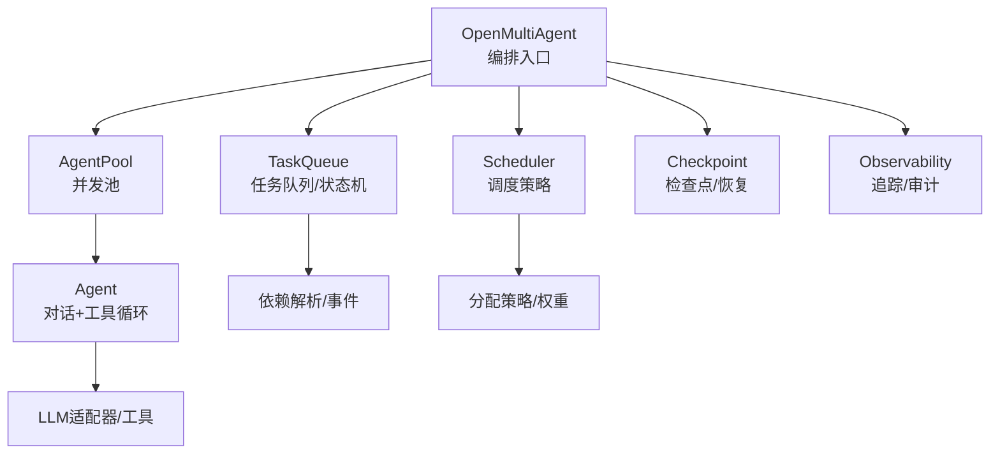
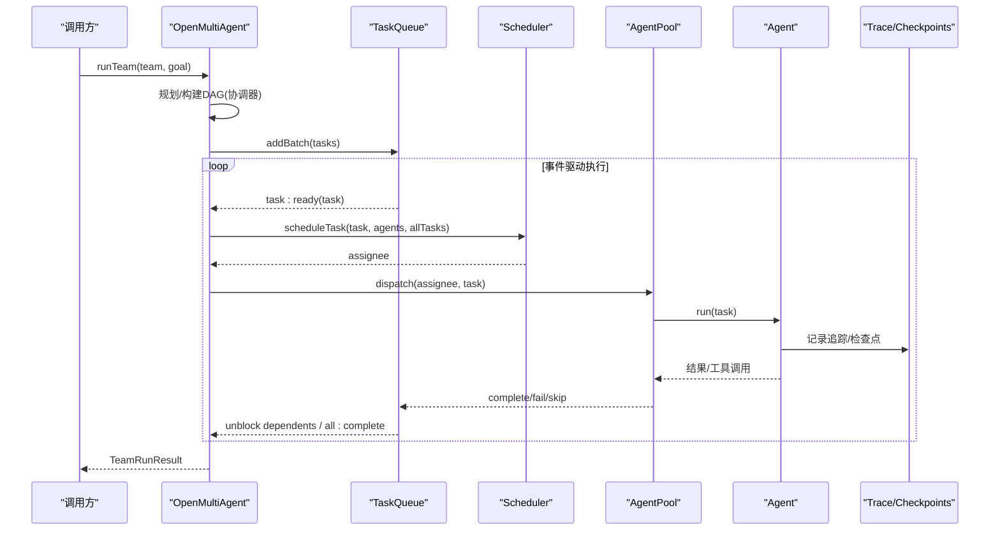
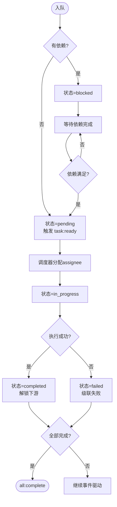
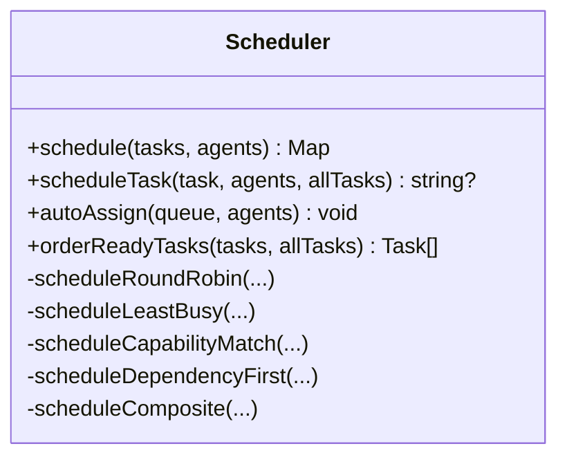
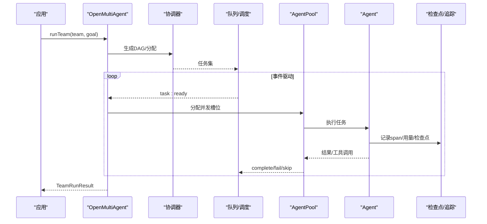
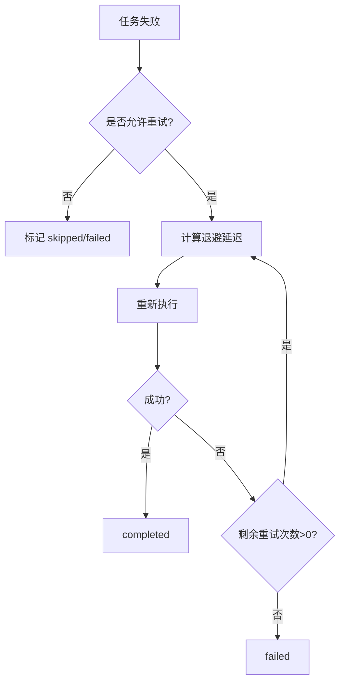
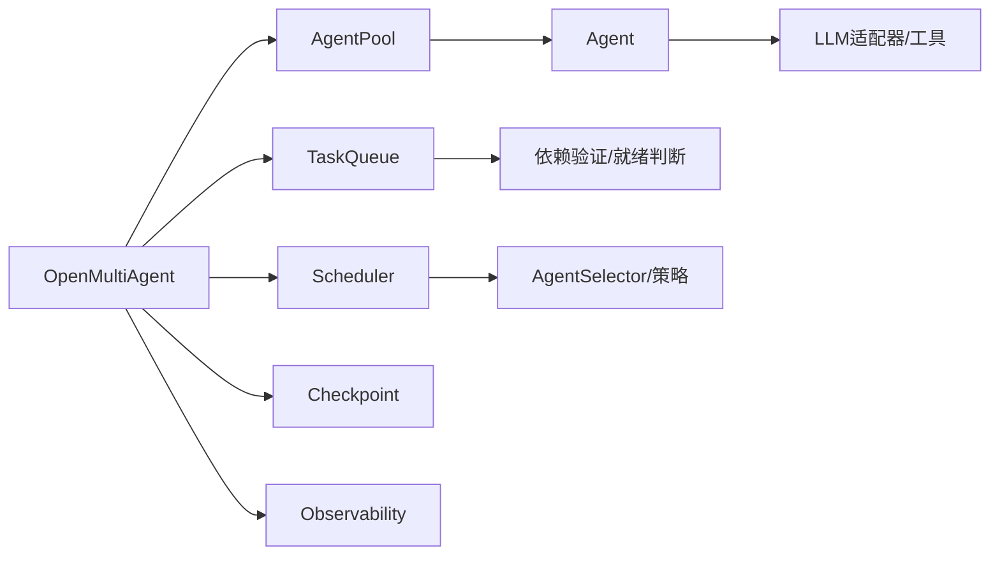

# 执行控制与状态管理

<cite>
**本文引用的文件**
- [README.md](file://README.md)
- [package.json](file://package.json)
- [packages/core/README.md](file://packages/core/README.md)
- [orchestrator.ts](file://packages/core/src/orchestrator/orchestrator.ts)
- [scheduler.ts](file://packages/core/src/orchestrator/scheduler.ts)
- [queue.ts](file://packages/core/src/task/queue.ts)
- [runner.ts](file://packages/core/src/agent/runner.ts)
- [types.ts](file://packages/core/src/types.ts)
- [task-scheduling.md](file://docs/task-scheduling.md)
- [checkpoint.md](file://docs/checkpoint.md)
</cite>

## 目录
1. [简介](#简介)
2. [项目结构](#项目结构)
3. [核心组件](#核心组件)
4. [架构总览](#架构总览)
5. [详细组件分析](#详细组件分析)
6. [依赖关系分析](#依赖关系分析)
7. [性能考量](#性能考量)
8. [故障排查指南](#故障排查指南)
9. [结论](#结论)
10. [附录](#附录)

## 简介
本文件面向 Open Multi-Agent（OMA）的执行控制与状态管理，聚焦以下目标：
- 任务生命周期管理、状态转换与进度跟踪
- 任务队列的入队、出队、优先级排序与重试机制
- 执行状态的监控与追踪、日志记录与异常处理
- 高级特性：暂停恢复、批量操作、并发控制
- 实践指南：状态设计模式、错误恢复策略、性能监控方法

OMA 的核心思想是“描述目标而非图”，由协调器在运行时生成任务 DAG，调度器驱动事件式执行，AgentPool 控制并发，Agent 负责单智能体的对话与工具调用循环。通过检查点、可恢复审批、预算控制与观测能力，实现从原型到生产的可控执行路径。

**章节来源**
- [README.md:46-108](file://README.md#L46-L108)
- [packages/core/README.md:49-55](file://packages/core/README.md#L49-L55)

## 项目结构
- 根仓库为 monorepo，发布包为 `@open-multi-agent/core`，位于 `packages/core`
- 顶层入口类 `OpenMultiAgent` 位于 `packages/core/src/orchestrator/orchestrator.ts`
- 任务队列与状态机位于 `packages/core/src/task/queue.ts`
- 调度策略位于 `packages/core/src/orchestrator/scheduler.ts`
- Agent 运行器与工具调用边界位于 `packages/core/src/agent/runner.ts`
- 类型定义集中在 `packages/core/src/types.ts`
- 文档包含任务调度、检查点等专题说明

**图表来源**
- [orchestrator.ts:1-42](file://packages/core/src/orchestrator/orchestrator.ts#L1-L42)
- [queue.ts:1-63](file://packages/core/src/task/queue.ts#L1-L63)
- [scheduler.ts:1-16](file://packages/core/src/orchestrator/scheduler.ts#L1-L16)
- [runner.ts:597-613](file://packages/core/src/agent/runner.ts#L597-L613)

**章节来源**
- [package.json:1-34](file://package.json#L1-L34)
- [packages/core/README.md:237-252](file://packages/core/README.md#L237-L252)

## 核心组件
- 编排器 OpenMultiAgent：统一入口，组合 Team、TaskQueue、Scheduler、AgentPool、Agent，提供 runTeam/runTasks/runAgent/restore 等 API，并集成预算、观测、恢复、审批等横切能力
- 任务队列 TaskQueue：维护任务状态机（pending/blocked/in_progress/completed/failed/skipped），事件驱动地推进 DAG，支持快照/恢复与计划修订
- 调度器 Scheduler：多种策略（round-robin、least-busy、capability-match、dependency-first、composite）将待执行任务映射到可用 Agent
- Agent 运行器：封装 LLM 调用、工具调用、轮次与 token 用量统计、中止信号、追踪埋点、检查点持久化与恢复
- 类型系统 types.ts：定义 OrchestratorEvent、Task、TaskQueueSnapshot、PlanRevision、TaskOutcome 等关键数据结构

**章节来源**
- [orchestrator.ts:339-446](file://packages/core/src/orchestrator/orchestrator.ts#L339-L446)
- [queue.ts:46-63](file://packages/core/src/task/queue.ts#L46-L63)
- [scheduler.ts:128-170](file://packages/core/src/orchestrator/scheduler.ts#L128-L170)
- [runner.ts:597-613](file://packages/core/src/agent/runner.ts#L597-L613)
- [types.ts:2105-2118](file://packages/core/src/types.ts#L2105-L2118)
- [types.ts:2445-2468](file://packages/core/src/types.ts#L2445-L2468)

## 架构总览
下图展示一次典型 runTeam 的执行流：协调器产出任务图，调度器按策略分配，队列事件驱动推进，AgentPool 控制并发，Agent 完成工作后回写结果并触发下游解锁。

**图表来源**
- [orchestrator.ts:1-42](file://packages/core/src/orchestrator/orchestrator.ts#L1-L42)
- [queue.ts:64-105](file://packages/core/src/task/queue.ts#L64-L105)
- [scheduler.ts:216-251](file://packages/core/src/orchestrator/scheduler.ts#L216-L251)
- [runner.ts:597-613](file://packages/core/src/agent/runner.ts#L597-L613)

## 详细组件分析

### 任务队列与状态机（TaskQueue）
- 状态集合：pending、blocked、in_progress、completed、failed、skipped
- 入队：add/addBatch，自动根据依赖判定初始状态；无依赖则立即 task:ready
- 出队：next/nextAvailable 供调度器消费
- 完成/失败/跳过：complete/fail/skip 会触发依赖解锁或级联失败/跳过
- 快照与恢复：snapshot/fromSnapshot 支持版本化快照与 in_progress 重置
- 计划修订：applyPlanPatch/publishPlanRevision 支持追加式修复（新增任务、重定向、覆盖）
- 进度查询：getProgress 返回各状态计数

**图表来源**
- [queue.ts:79-105](file://packages/core/src/task/queue.ts#L79-L105)
- [queue.ts:424-480](file://packages/core/src/task/queue.ts#L424-L480)
- [queue.ts:514-545](file://packages/core/src/task/queue.ts#L514-L545)
- [queue.ts:619-667](file://packages/core/src/task/queue.ts#L619-L667)

**章节来源**
- [queue.ts:64-105](file://packages/core/src/task/queue.ts#L64-L105)
- [queue.ts:111-160](file://packages/core/src/task/queue.ts#L111-L160)
- [queue.ts:172-396](file://packages/core/src/task/queue.ts#L172-L396)
- [queue.ts:402-505](file://packages/core/src/task/queue.ts#L402-L505)
- [queue.ts:547-667](file://packages/core/src/task/queue.ts#L547-L667)

### 调度策略与任务分配（Scheduler）
- 策略族：round-robin、least-busy、capability-match、dependency-first、composite
- 事件驱动场景：scheduleTask 对单个 ready 任务进行分配；orderReadyTasks 对 ready set 排序（依赖优先/复合策略）
- 负载与能力：least-busy 基于 in_progress 计数；capability-match 使用显式需求与能力打分；composite 综合 criticality、fit 与 load
- 失败策略：当无合格代理时抛出 NO_ELIGIBLE_AGENT，硬约束不降级

**图表来源**
- [scheduler.ts:128-170](file://packages/core/src/orchestrator/scheduler.ts#L128-L170)
- [scheduler.ts:176-251](file://packages/core/src/orchestrator/scheduler.ts#L176-L251)
- [scheduler.ts:298-508](file://packages/core/src/orchestrator/scheduler.ts#L298-L508)

**章节来源**
- [scheduler.ts:1-16](file://packages/core/src/orchestrator/scheduler.ts#L1-L16)
- [scheduler.ts:176-251](file://packages/core/src/orchestrator/scheduler.ts#L176-L251)
- [scheduler.ts:298-508](file://packages/core/src/orchestrator/scheduler.ts#L298-L508)

### 执行流程与控制（OpenMultiAgent）
- 入口：runTeam/runTasks/runAgent/restore
- 协调器：动态生成任务图，支持治理意图、模型路由、语义路由评估
- 预算控制：token/cost 预算在 turn 与 task 边界检查，超限提前终止新任务
- 观测：traceRuntime 记录 span、usage、阶段、任务 ID 等属性
- 恢复：restore 加载最新检查点，重建队列与共享内存，跳过已完成任务，必要时重新合成最终答案

**图表来源**
- [orchestrator.ts:339-446](file://packages/core/src/orchestrator/orchestrator.ts#L339-L446)
- [orchestrator.ts:528-718](file://packages/core/src/orchestrator/orchestrator.ts#L528-L718)
- [runner.ts:597-613](file://packages/core/src/agent/runner.ts#L597-L613)

**章节来源**
- [orchestrator.ts:339-446](file://packages/core/src/orchestrator/orchestrator.ts#L339-L446)
- [orchestrator.ts:528-718](file://packages/core/src/orchestrator/orchestrator.ts#L528-L718)

### 任务重试与恢复（含检查点）
- 任务级重试：Task 支持 maxRetries、retryDelayMs、retryBackoff，用于失败后的指数退避重试
- 检查点：在安全边界（turn/tool 边界、任务完成）写入快照；支持 FileStore/InMemoryStore/自定义 MemoryStore
- 恢复：restore 读取最新快照，重建队列与共享内存，跳过已完成任务，回放已提交工具结果，保守执行未提交调用
- 耐久审批：挂起审批请求与决策持久化，恢复时校验一致性

**图表来源**
- [types.ts:2082-2099](file://packages/core/src/types.ts#L2082-L2099)
- [checkpoint.md:109-157](file://docs/checkpoint.md#L109-L157)
- [checkpoint.md:206-249](file://docs/checkpoint.md#L206-L249)

**章节来源**
- [types.ts:2082-2099](file://packages/core/src/types.ts#L2082-L2099)
- [checkpoint.md:109-157](file://docs/checkpoint.md#L109-L157)
- [checkpoint.md:206-249](file://docs/checkpoint.md#L206-L249)

### 进度跟踪与监控
- 事件：OrchestratorEvent 包含 agent_start/complete、task_start/complete/skipped/retry 等
- 追踪：traceRuntime.startSpan 记录模型调用、阶段、任务 ID、用量、耗时等
- 指标：TeamRunResult 汇总 token 用量与指标；taskResults 保留每个任务的独立结果

**章节来源**
- [types.ts:2105-2118](file://packages/core/src/types.ts#L2105-L2118)
- [runner.ts:597-613](file://packages/core/src/agent/runner.ts#L597-L613)
- [task-scheduling.md:27-44](file://docs/task-scheduling.md#L27-L44)

### 高级特性：暂停恢复、批量操作、并发控制
- 暂停恢复：检查点保存 runner 中间态与工具调用提交；恢复时回放已提交结果，保守执行缺失调用
- 批量操作：addBatch 批量入队；onApproval 兼容批次语义；skipRemaining 批量跳过
- 并发控制：AgentPool 作为并发权威；调度门控检查取消、预算、审批与池容量；事件驱动避免无关任务阻塞

**章节来源**
- [checkpoint.md:109-157](file://docs/checkpoint.md#L109-L157)
- [task-scheduling.md:8-25](file://docs/task-scheduling.md#L8-L25)
- [task-scheduling.md:135-164](file://docs/task-scheduling.md#L135-L164)

## 依赖关系分析
- OpenMultiAgent 依赖 TaskQueue、Scheduler、AgentPool、Agent、Checkpoint、Observability
- TaskQueue 依赖任务创建与依赖验证工具；发出事件驱动下游解锁
- Scheduler 依赖 AgentSelector 与任务快照，输出 assignee
- Agent 依赖 LLM 适配器、工具、追踪与检查点

**图表来源**
- [orchestrator.ts:1-42](file://packages/core/src/orchestrator/orchestrator.ts#L1-L42)
- [queue.ts:1-20](file://packages/core/src/task/queue.ts#L1-L20)
- [scheduler.ts:18-24](file://packages/core/src/orchestrator/scheduler.ts#L18-L24)
- [runner.ts:597-613](file://packages/core/src/agent/runner.ts#L597-L613)

**章节来源**
- [orchestrator.ts:1-42](file://packages/core/src/orchestrator/orchestrator.ts#L1-L42)
- [scheduler.ts:18-24](file://packages/core/src/orchestrator/scheduler.ts#L18-L24)
- [queue.ts:1-20](file://packages/core/src/task/queue.ts#L1-L20)

## 性能考量
- 事件驱动执行：下游任务在依赖满足后立即启动，无需等待同批其他任务
- 调度策略选择：
  - dependency-first 适合强依赖 DAG
  - least-busy 适合时长差异大、需负载均衡
  - capability-match 适合角色/能力差异明显
  - composite 综合 criticality、fit、load
- 预算与超时：token/cost 预算在 turn/task 边界检查；语义路由可配置超时与失败策略
- 并发上限：maxConcurrency 限制并行度；AgentPool 为唯一并发权威
- 检查点粒度：在安全边界写入，避免频繁 IO；FileStore 原子写入降低损坏风险

**章节来源**
- [task-scheduling.md:8-25](file://docs/task-scheduling.md#L8-L25)
- [task-scheduling.md:98-133](file://docs/task-scheduling.md#L98-L133)
- [packages/core/README.md:288-316](file://packages/core/README.md#L288-L316)
- [checkpoint.md:49-73](file://docs/checkpoint.md#L49-L73)

## 故障排查指南
- 常见错误与定位
  - 无合格代理：NO_ELIGIBLE_AGENT，检查 requires/capabilities/provider 约束
  - 预算超限：TokenBudgetExceededError/CostBudgetExceededError，调整预算或 estimateCost
  - 路由失败：RoutingProfilerFailedError/RoutingTimeoutError，检查 profiler 配置与超时
  - 依赖失败：级联 failed/skipped，查看上游任务 result 与 dependsOn
- 检查点问题
  - 写入失败：onProgress error(kind='checkpoint_save_failed')，检查存储后端
  - 恢复不一致：确认 runId/key/store 一致；v1/v2/v3/v4 兼容性
- 工具调用重复
  - 外部副作用需幂等键 toolCallId，避免恢复时重复执行
- 审批挂起
  - 悬挂审批请求必须持久化后再上报；恢复时校验哈希一致性

**章节来源**
- [scheduler.ts:546-557](file://packages/core/src/orchestrator/scheduler.ts#L546-L557)
- [orchestrator.ts:321-337](file://packages/core/src/orchestrator/orchestrator.ts#L321-L337)
- [orchestrator.ts:528-718](file://packages/core/src/orchestrator/orchestrator.ts#L528-L718)
- [checkpoint.md:154-160](file://docs/checkpoint.md#L154-L160)
- [checkpoint.md:206-249](file://docs/checkpoint.md#L206-L249)

## 结论
OMA 通过“协调器+调度器+队列+AgentPool”的分层架构，实现了高内聚的执行控制与状态管理。任务队列的状态机与事件驱动机制确保 DAG 高效推进；多策略调度器适配不同业务场景；检查点与恢复保障长任务可靠性；观测与预算控制提供生产级治理能力。结合暂停恢复、批量操作与并发控制，OMA 能在复杂多智能体场景中提供稳定、可观测、可恢复的执行环境。

## 附录
- 快速开始与示例：参考 Core README 中的 quick start、execution modes、examples
- 生产清单：预算、工具、恢复、观测、审批等配置项
- 相关文档：任务调度、检查点、可观测性、执行路由、模型路由、共识等

**章节来源**
- [packages/core/README.md:57-111](file://packages/core/README.md#L57-L111)
- [packages/core/README.md:288-325](file://packages/core/README.md#L288-L325)