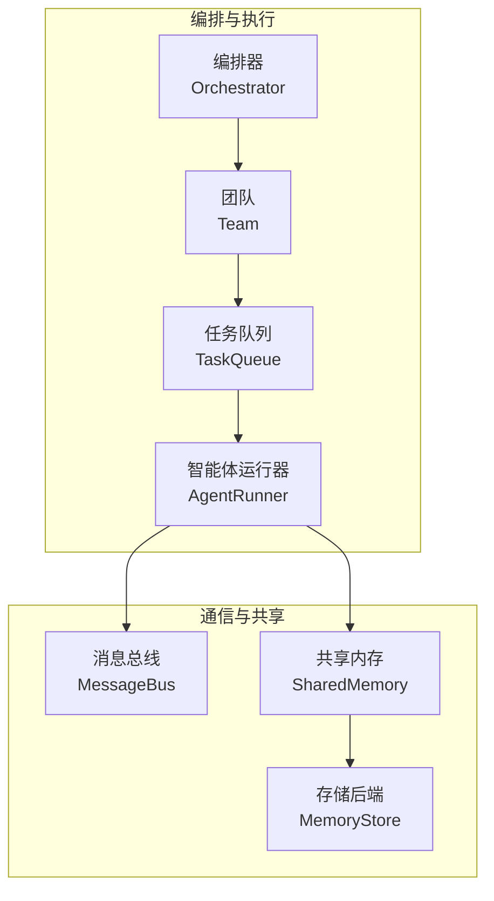
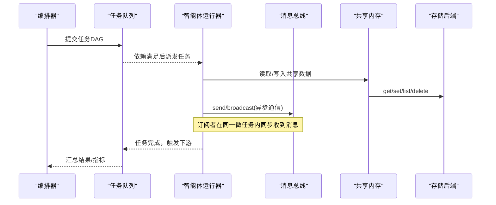
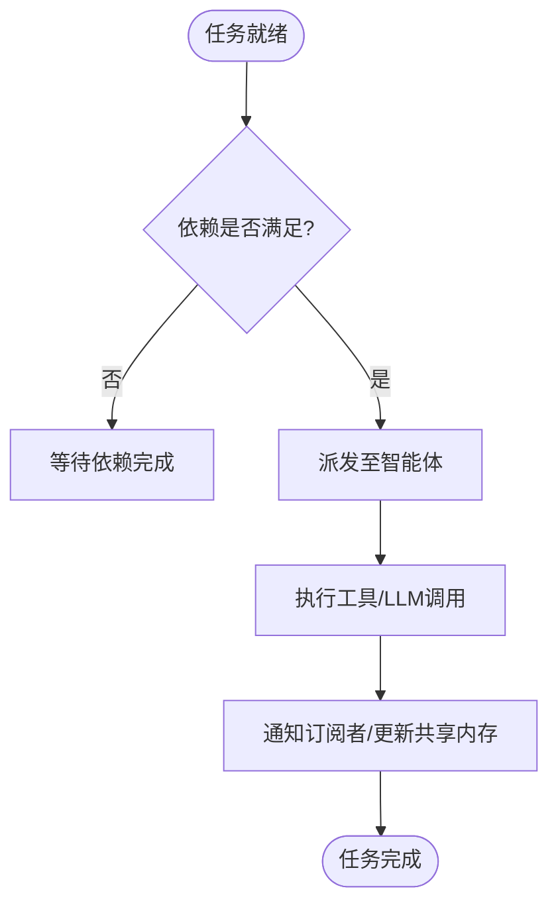
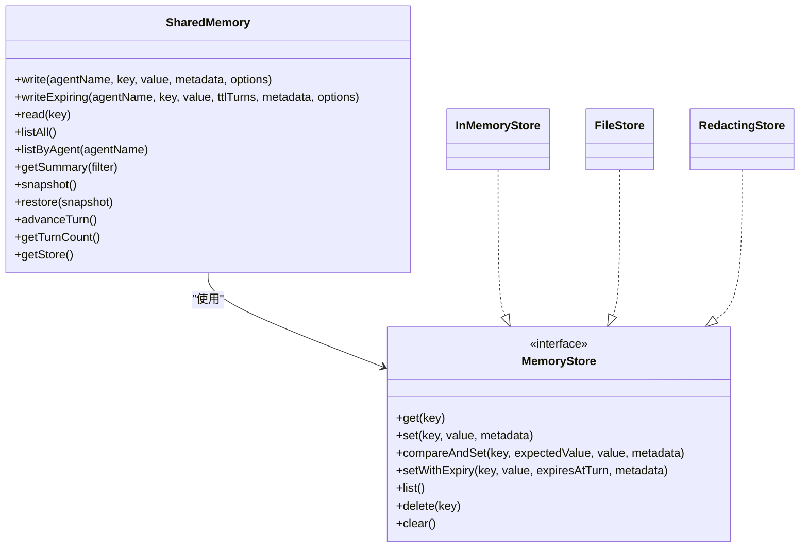
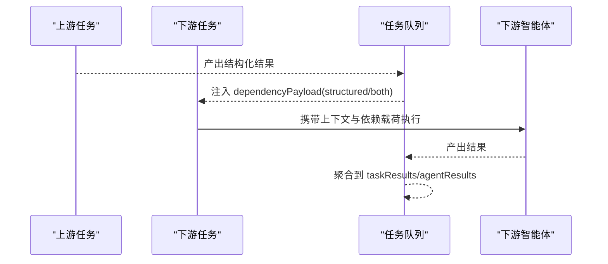
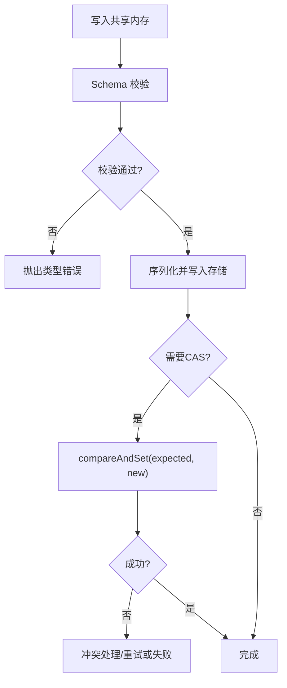
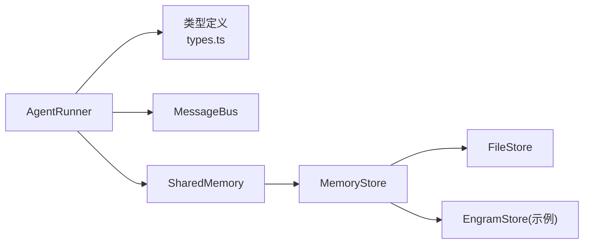

# 通信模式与数据共享

<cite>
**本文引用的文件**
- [README.md](file://README.md)
- [shared-memory.md](file://docs/shared-memory.md)
- [task-scheduling.md](file://docs/task-scheduling.md)
- [consensus.md](file://docs/consensus.md)
- [context-management.md](file://docs/context-management.md)
- [types.ts](file://packages/core/src/types.ts)
- [runner.ts](file://packages/core/src/agent/runner.ts)
- [messaging.ts](file://packages/core/src/team/messaging.ts)
- [shared.ts](file://packages/core/src/memory/shared.ts)
- [file-store.ts](file://packages/core/src/memory/file-store.ts)
- [engram-store.ts](file://packages/core/examples/integrations/with-engram/engram-store.ts)
</cite>

## 目录
1. [简介](#简介)
2. [项目结构](#项目结构)
3. [核心组件](#核心组件)
4. [架构总览](#架构总览)
5. [详细组件分析](#详细组件分析)
6. [依赖关系分析](#依赖关系分析)
7. [性能考虑](#性能考虑)
8. [故障排查指南](#故障排查指南)
9. [结论](#结论)
10. [附录](#附录)

## 简介
本文件聚焦 Open Multi-Agent（OMA）在“多智能体通信”和“数据共享”方面的设计与实现，覆盖以下主题：
- 智能体间通信机制：同步调用、异步消息传递、事件驱动通信
- 共享内存（SharedMemory）的使用与数据同步：读写、版本控制、过期与冲突处理
- 任务间数据传递：输入输出参数、上下文传递、结果聚合
- 一致性保障：事务性写入、比较并交换（CAS）、数据校验与验证
- 设计原则：解耦、错误处理、性能优化建议
- 实践示例路径：通过源码路径引用具体实现，避免直接粘贴代码

## 项目结构
OMA 的核心能力分布在 packages/core 中，围绕“编排器—团队—任务—智能体—工具—记忆—可观测性”分层组织。与通信和数据共享直接相关的模块包括：
- 团队消息总线：用于智能体间的点对点与广播式异步通信
- 共享内存层：提供命名空间化的键值存储、TTL 过期、摘要生成、快照/恢复
- 持久化存储：基于文件的原子写、可选的 RedactingStore 脱敏、外部 MemoryStore 扩展
- 任务调度与执行：事件驱动的 DAG 执行、依赖注入、结构化依赖载荷
- 共识验证：对任务或独立运行结果的提议-评判闭环，提升一致性
- 上下文管理：长对话压缩策略，减少上下文膨胀对通信效率的影响

图表来源
- [task-scheduling.md:1-203](file://docs/task-scheduling.md#L1-L203)
- [messaging.ts:1-285](file://packages/core/src/team/messaging.ts#L1-L285)
- [shared.ts:1-531](file://packages/core/src/memory/shared.ts#L1-L531)
- [types.ts:2806-2872](file://packages/core/src/types.ts#L2806-L2872)

章节来源
- [task-scheduling.md:1-203](file://docs/task-scheduling.md#L1-L203)
- [messaging.ts:1-285](file://packages/core/src/team/messaging.ts#L1-L285)
- [shared.ts:1-531](file://packages/core/src/memory/shared.ts#L1-L531)
- [types.ts:2806-2872](file://packages/core/src/types.ts#L2806-L2872)

## 核心组件
- 消息总线（MessageBus）：轻量级发布/订阅，支持点对点与广播；保留全部消息与读状态，支持快照/恢复；订阅回调同步触发，适合事件驱动协作。
- 共享内存（SharedMemory）：按 agentName 命名空间的键值存储；支持结构化值序列化/反序列化、写时校验、TTL 过期、摘要生成、快照/恢复；底层 MemoryStore 可替换为文件、Redis、Postgres 等。
- 任务调度与执行：事件驱动，下游任务在依赖满足后立即启动；支持结构化依赖载荷（structured/both），限制大小并严格校验；失败/跳过传播到依赖链。
- 共识（Consensus）：提议者+评判者的多轮验证，支持拒绝/修订/保持策略；可用于 runTasks 单个任务的 verify 钩子，统一计入预算。
- 上下文管理：滑动窗口、摘要、规则压缩等策略，配合工具结果压缩与推理文本降级，降低上下文成本，提高通信效率。

章节来源
- [messaging.ts:1-285](file://packages/core/src/team/messaging.ts#L1-L285)
- [shared.ts:1-531](file://packages/core/src/memory/shared.ts#L1-L531)
- [task-scheduling.md:1-203](file://docs/task-scheduling.md#L1-L203)
- [consensus.md:1-64](file://docs/consensus.md#L1-L64)
- [context-management.md:1-114](file://docs/context-management.md#L1-L114)

## 架构总览
下图展示了从编排到执行、再到通信与共享数据的整体流程：编排器根据目标动态生成任务图，事件驱动的任务队列将任务分派给智能体；智能体在执行过程中可通过消息总线进行异步通信，并通过共享内存共享结构化数据；必要时通过共识机制对关键结果进行验证。

图表来源
- [task-scheduling.md:1-203](file://docs/task-scheduling.md#L1-L203)
- [messaging.ts:1-285](file://packages/core/src/team/messaging.ts#L1-L285)
- [shared.ts:1-531](file://packages/core/src/memory/shared.ts#L1-L531)
- [types.ts:2806-2872](file://packages/core/src/types.ts#L2806-L2872)

## 详细组件分析

### 智能体间通信：同步调用、异步消息与事件驱动
- 同步调用：智能体通过 AgentRunner 与 LLM 适配器交互，内部以非流式方式调用模型，具备每调用超时保护，避免卡死。
- 异步消息：MessageBus 提供 send/broadcast，所有消息持久化于内存，支持按接收者过滤未读消息、会话回放、订阅/退订。
- 事件驱动：任务调度采用事件驱动，下游任务在依赖完成后立即启动，不等待同批就绪的其他无关任务；AgentPool 作为并发上限的唯一权威。

图表来源
- [task-scheduling.md:1-203](file://docs/task-scheduling.md#L1-L203)
- [messaging.ts:1-285](file://packages/core/src/team/messaging.ts#L1-L285)
- [runner.ts:1-635](file://packages/core/src/agent/runner.ts#L1-L635)

章节来源
- [runner.ts:1-635](file://packages/core/src/agent/runner.ts#L1-L635)
- [messaging.ts:1-285](file://packages/core/src/team/messaging.ts#L1-L285)
- [task-scheduling.md:1-203](file://docs/task-scheduling.md#L1-L203)

### 共享内存：读写、版本控制与冲突解决
- 命名空间隔离：写入键形如 `<agentName>/<key>`，避免跨智能体冲突，同时允许显式全限定键进行跨智能体读取。
- 结构化值与校验：写入时可传入 schema 进行写时校验；值会被序列化为字符串并附带编码元数据，读取时还原为结构化对象。
- TTL 过期：writeExpiring 支持按“回合数”过期；若后端不支持 setWithExpiry，则退化为永久存储。
- 快照/恢复：支持 snapshot/restore，便于检查点与重放；恢复时会清理非保留键并重建 turnCount。
- 摘要生成：getSummary 可按智能体分组生成人类可读摘要，便于注入系统提示或用户轮次。
- 存储后端：默认进程内存储；可替换为 FileStore（原子写、单进程安全）、RedactingStore（写时脱敏）或自定义 MemoryStore（如 Redis）。

图表来源
- [shared.ts:1-531](file://packages/core/src/memory/shared.ts#L1-L531)
- [types.ts:2806-2872](file://packages/core/src/types.ts#L2806-L2872)
- [file-store.ts:1-54](file://packages/core/src/memory/file-store.ts#L1-L54)

章节来源
- [shared.ts:1-531](file://packages/core/src/memory/shared.ts#L1-L531)
- [types.ts:2806-2872](file://packages/core/src/types.ts#L2806-L2872)
- [file-store.ts:1-54](file://packages/core/src/memory/file-store.ts#L1-L54)
- [shared-memory.md:1-47](file://docs/shared-memory.md#L1-L47)

### 任务间数据传递：输入输出、上下文与结果聚合
- 依赖注入：默认注入 raw output；可通过 dependencyPayload 选择 structured/both，仅注入结构化 JSON 或同时注入原始与结构化内容，缺失或非可序列化会失败，不会静默回退。
- 上下文传递：通过 SharedMemory.getSummary 将团队共享知识以人类可读形式注入智能体上下文；结合 contextStrategy 控制长对话压缩。
- 结果聚合：runTasks/runTeam 返回 taskResults 与 agentResults，前者按稳定任务 ID 索引每个任务的未合并结果，后者按智能体名聚合；token 用量与指标按运行级别计算一次。

图表来源
- [task-scheduling.md:1-203](file://docs/task-scheduling.md#L1-L203)
- [shared.ts:1-531](file://packages/core/src/memory/shared.ts#L1-L531)
- [context-management.md:1-114](file://docs/context-management.md#L1-L114)

章节来源
- [task-scheduling.md:1-203](file://docs/task-scheduling.md#L1-L203)
- [shared.ts:1-531](file://packages/core/src/memory/shared.ts#L1-L531)
- [context-management.md:1-114](file://docs/context-management.md#L1-L114)

### 一致性保障：事务、锁与验证
- 事务性与原子写：FileStore 通过临时文件 + fsync + rename 实现原子写，保证读端始终看到完整旧态或新态；适用于检查点与共享内存持久化。
- 比较并交换（CAS）：MemoryStore.compareAndSet 用于不可变决策（如持久化审批），无法实现 CAS 的后端将导致相关功能关闭。
- 数据校验：SharedMemory.write 支持 Zod schema 写时校验；任务依赖 payload 有大小限制且严格校验，失败即报错。
- 共识验证：runConsensus 或任务 verify 钩子可对关键结果进行多轮评判，支持修订/拒绝/保持策略，统一计入预算。

图表来源
- [shared.ts:1-531](file://packages/core/src/memory/shared.ts#L1-L531)
- [types.ts:2806-2872](file://packages/core/src/types.ts#L2806-L2872)
- [file-store.ts:1-54](file://packages/core/src/memory/file-store.ts#L1-L54)
- [consensus.md:1-64](file://docs/consensus.md#L1-L64)

章节来源
- [shared.ts:1-531](file://packages/core/src/memory/shared.ts#L1-L531)
- [types.ts:2806-2872](file://packages/core/src/types.ts#L2806-L2872)
- [file-store.ts:1-54](file://packages/core/src/memory/file-store.ts#L1-L54)
- [consensus.md:1-64](file://docs/consensus.md#L1-L64)

### 高效通信协议设计原则与实践
- 解耦设计：通过 MessageBus 与 SharedMemory 分离“通信通道”和“共享状态”，智能体无需相互感知。
- 最小上下文：优先使用结构化依赖载荷与共享内存摘要，避免大段文本进入对话上下文；结合 compressToolResults 与 contextStrategy。
- 事件驱动：利用任务就绪事件推进下游，减少轮询与阻塞。
- 容错与可观测：每步调用带超时与追踪；共享内存写时脱敏；检查点与快照支持恢复与审计。
- 可扩展存储：按需替换 MemoryStore，平衡性能与持久化需求（进程内 vs 文件 vs 分布式）。

章节来源
- [messaging.ts:1-285](file://packages/core/src/team/messaging.ts#L1-L285)
- [shared.ts:1-531](file://packages/core/src/memory/shared.ts#L1-L531)
- [context-management.md:1-114](file://docs/context-management.md#L1-L114)
- [task-scheduling.md:1-203](file://docs/task-scheduling.md#L1-L203)

## 依赖关系分析
- 编排器与调度：编排器负责计划与分发，任务队列维护就绪集合与进行中映射，AgentPool 控制并发。
- 智能体运行器：封装 LLM 调用、工具执行、循环检测、上下文压缩、追踪与超时。
- 消息总线：无外部依赖，内存驻留，支持快照/恢复，订阅同步触发。
- 共享内存：依赖 MemoryStore 抽象，默认进程内存储，可替换为文件存储或外部服务。
- 外部集成：示例提供 Engram 存储实现，展示如何对接 REST API 作为 MemoryStore。

图表来源
- [runner.ts:1-635](file://packages/core/src/agent/runner.ts#L1-L635)
- [types.ts:2806-2872](file://packages/core/src/types.ts#L2806-L2872)
- [messaging.ts:1-285](file://packages/core/src/team/messaging.ts#L1-L285)
- [shared.ts:1-531](file://packages/core/src/memory/shared.ts#L1-L531)
- [file-store.ts:1-54](file://packages/core/src/memory/file-store.ts#L1-L54)
- [engram-store.ts:1-40](file://packages/core/examples/integrations/with-engram/engram-store.ts#L1-L40)

章节来源
- [runner.ts:1-635](file://packages/core/src/agent/runner.ts#L1-L635)
- [types.ts:2806-2872](file://packages/core/src/types.ts#L2806-L2872)
- [messaging.ts:1-285](file://packages/core/src/team/messaging.ts#L1-L285)
- [shared.ts:1-531](file://packages/core/src/memory/shared.ts#L1-L531)
- [file-store.ts:1-54](file://packages/core/src/memory/file-store.ts#L1-L54)
- [engram-store.ts:1-40](file://packages/core/examples/integrations/with-engram/engram-store.ts#L1-L40)

## 性能考虑
- 上下文压缩：启用 compressToolResults 与合适的 contextStrategy，减少 LLM 调用开销与延迟。
- 事件驱动调度：依赖满足即派发，避免不必要的等待；合理设置 AgentPool 并发上限。
- 共享内存 TTL：对短期中间结果使用 writeExpiring，降低存储与读取压力。
- 存储后端选择：高频写入场景优先进程内存储；需持久化时使用 FileStore 或外部存储，权衡 I/O 成本。
- 超时与预算：为每次模型调用设置 callTimeoutMs，结合运行级超时与预算，防止资源耗尽。

[本节为通用指导，不直接分析具体文件]

## 故障排查指南
- 共享内存写入失败：检查 schema 校验与 JSON 可序列化约束；确认 store 方法齐全；注意 reserved 前缀键不会被覆盖。
- TTL 不生效：确认后端实现了 setWithExpiry；否则 writeExpiring 会退化为普通写入。
- 消息未送达：确认订阅已注册且 to 字段匹配；广播会排除发送者；检查 readState 是否误标记为已读。
- 任务依赖未推进：检查上游任务是否成功完成；失败/跳过会级联影响下游；关注 onTaskDispatch/onApproval 是否阻止派发。
- 共识未收敛：调整 quorum、maxRounds、onDissent 策略；观察 judge 反馈与 token 预算。

章节来源
- [shared.ts:1-531](file://packages/core/src/memory/shared.ts#L1-L531)
- [messaging.ts:1-285](file://packages/core/src/team/messaging.ts#L1-L285)
- [task-scheduling.md:1-203](file://docs/task-scheduling.md#L1-L203)
- [consensus.md:1-64](file://docs/consensus.md#L1-L64)

## 结论
OMA 通过“事件驱动的任务调度 + 轻量消息总线 + 可插拔共享内存”的组合，提供了高内聚、低耦合的多智能体通信与数据共享能力。借助结构化依赖载荷、写时校验、TTL 过期、原子写与共识验证，系统在可靠性、一致性与可观测性方面达到生产可用水平。实践中应遵循解耦、最小上下文、事件驱动与可恢复的设计原则，并根据场景选择合适的存储后端与上下文策略，以获得最佳性能与稳定性。

[本节为总结，不直接分析具体文件]

## 附录
- 快速开始与团队创建（含 sharedMemory 开关）：参考入口示例与说明
- 共享内存文档：启用、持久化、脱敏与自定义存储
- 任务调度与依赖载荷：事件驱动、结构化注入与结果聚合
- 共识机制：提议-评判闭环与任务级 verify 钩子
- 上下文管理：滑动窗口、摘要、压缩策略与工具结果压缩

章节来源
- [README.md:48-97](file://README.md#L48-L97)
- [shared-memory.md:1-47](file://docs/shared-memory.md#L1-L47)
- [task-scheduling.md:1-203](file://docs/task-scheduling.md#L1-L203)
- [consensus.md:1-64](file://docs/consensus.md#L1-L64)
- [context-management.md:1-114](file://docs/context-management.md#L1-L114)