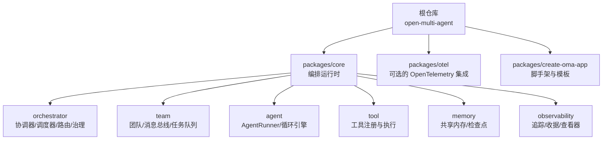
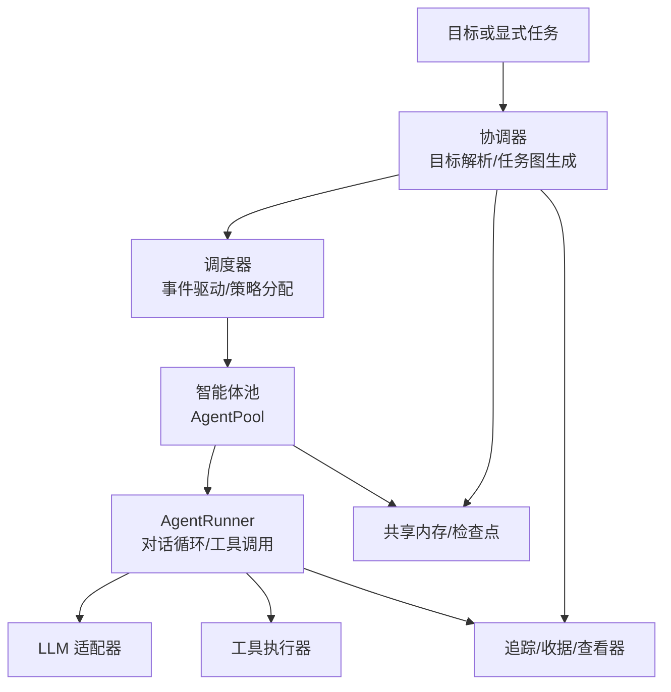
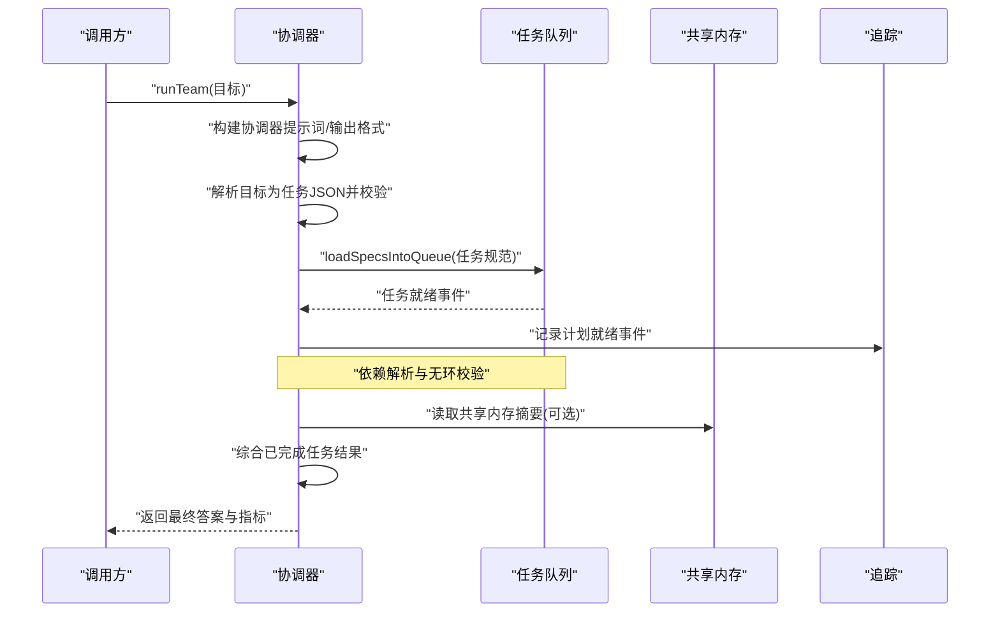
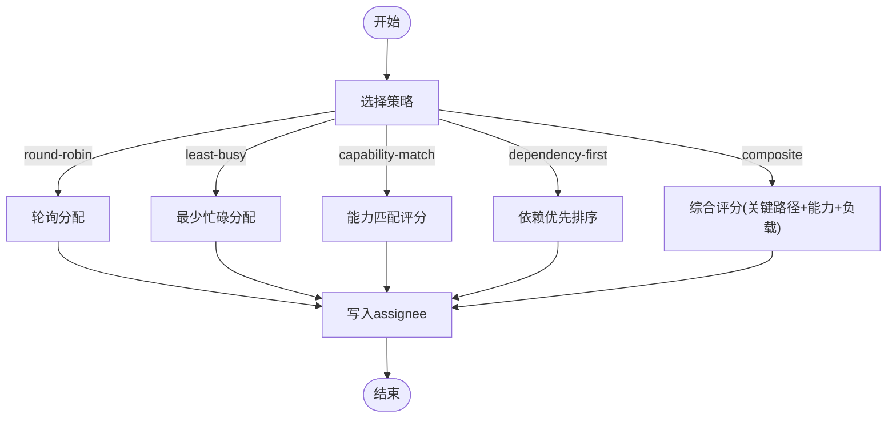
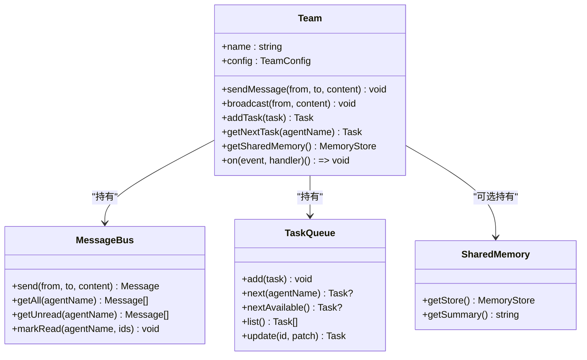
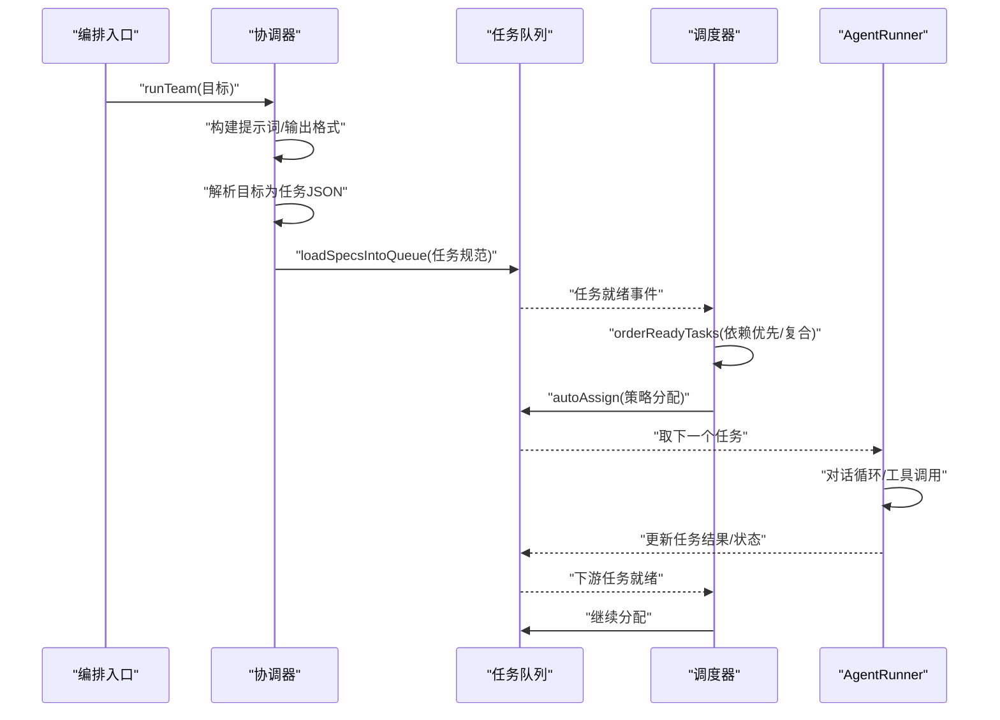
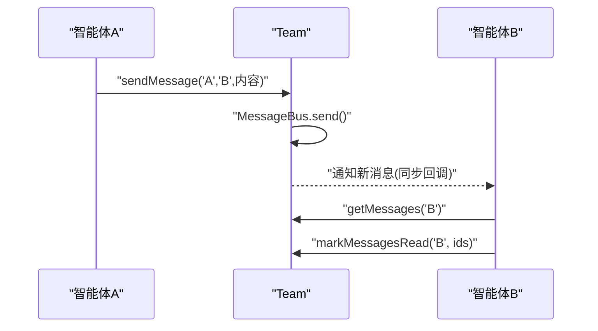
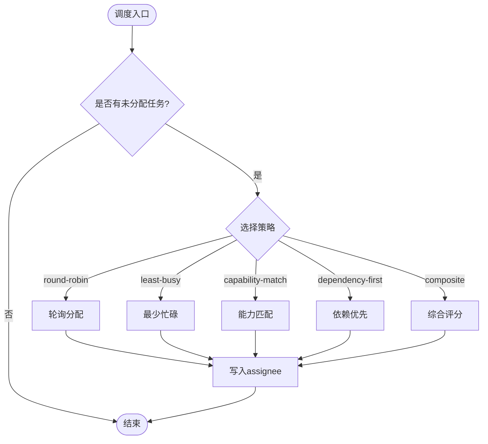
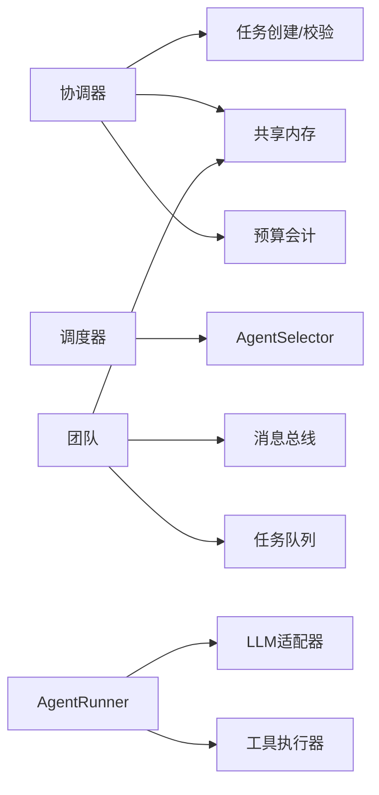

# 多智能体架构

<cite>
**本文引用的文件**
- [README.md](file://README.md)
- [package.json](file://package.json)
- [packages/core/README.md](file://packages/core/README.md)
- [packages/core/src/index.ts](file://packages/core/src/index.ts)
- [packages/core/src/types.ts](file://packages/core/src/types.ts)
- [packages/core/src/orchestrator/coordinator.ts](file://packages/core/src/orchestrator/coordinator.ts)
- [packages/core/src/orchestrator/scheduler.ts](file://packages/core/src/orchestrator/scheduler.ts)
- [packages/core/src/team/team.ts](file://packages/core/src/team/team.ts)
- [packages/core/src/agent/runner.ts](file://packages/core/src/agent/runner.ts)
</cite>

## 目录
1. [简介](#简介)
2. [项目结构](#项目结构)
3. [核心组件](#核心组件)
4. [架构总览](#架构总览)
5. [详细组件分析](#详细组件分析)
6. [依赖关系分析](#依赖关系分析)
7. [性能与可扩展性](#性能与可扩展性)
8. [故障排查指南](#故障排查指南)
9. [结论](#结论)
10. [附录：快速上手示例路径](#附录快速上手示例路径)

## 简介
Open Multi-Agent（OMA）是一个面向 TypeScript 后端的智能体编排框架。它支持“描述目标，而非手工绘制图”的动态工作流：协调器在运行时将目标解析为任务有向无环图（DAG），调度器按依赖事件驱动执行，团队共享上下文并产出可审计、可回放的结果。其内置离线运行查看器可回放真实运行的任务 DAG 与调用瀑布图。

该文档聚焦多智能体协作模式的设计原理：协调器的职责、智能体通信机制、任务分配策略；团队与智能体的生命周期；以及目标解析、任务图生成与执行调度的基本原理。文末提供架构图、流程图与代码级引用路径，帮助初学者理解概念，并为高级用户提供深入实现细节。

**章节来源**
- [README.md:13-46](file://README.md#L13-L46)
- [packages/core/README.md:47-55](file://packages/core/README.md#L47-L55)

## 项目结构
仓库采用 monorepo 组织，核心能力位于 packages/core，配套包包括 OTel 集成与脚手架工具。根 package.json 定义了工作区与脚本命令，便于统一构建、测试与示例验证。

**图表来源**
- [package.json:1-34](file://package.json#L1-L34)
- [packages/core/src/index.ts:53-160](file://packages/core/src/index.ts#L53-L160)

**章节来源**
- [package.json:1-34](file://package.json#L1-L34)
- [packages/core/src/index.ts:53-160](file://packages/core/src/index.ts#L53-L160)

## 核心组件
- 协调器（Coordinator）：负责目标分解、输出格式校验、任务规范加载与最终结果综合。
- 调度器（Scheduler）：将未分配任务映射到可用智能体，支持多种策略（轮询、最少忙碌、能力匹配、依赖优先、复合）。
- 团队（Team）：管理智能体名册、消息总线、任务队列与共享内存，暴露事件总线用于生命周期监听。
- 智能体（Agent）：通过 AgentRunner 维护对话循环、工具调用、令牌预算与循环检测。
- 任务（Task）：表示 DAG 中的节点，包含依赖、角色、优先级、重试与验证等元数据。
- 类型与配置（Types/Config）：定义 OrchestratorConfig、Task、AgentRunResult、TraceEvent 等核心契约。

**章节来源**
- [packages/core/src/orchestrator/coordinator.ts:1-105](file://packages/core/src/orchestrator/coordinator.ts#L1-L105)
- [packages/core/src/orchestrator/scheduler.ts:1-82](file://packages/core/src/orchestrator/scheduler.ts#L1-L82)
- [packages/core/src/team/team.ts:1-152](file://packages/core/src/team/team.ts#L1-L152)
- [packages/core/src/agent/runner.ts:1-47](file://packages/core/src/agent/runner.ts#L1-L47)
- [packages/core/src/types.ts:2052-2149](file://packages/core/src/types.ts#L2052-L2149)

## 架构总览
下图展示了从目标到任务图、再到执行与观测的整体流程。协调器负责计划，调度器负责执行顺序，AgentPool 与 LLM 适配器协同完成实际推理与工具调用，共享内存与检查点提供状态持久化，追踪系统记录全链路事件。

**图表来源**
- [packages/core/README.md:237-252](file://packages/core/README.md#L237-L252)
- [packages/core/src/orchestrator/coordinator.ts:546-642](file://packages/core/src/orchestrator/coordinator.ts#L546-L642)
- [packages/core/src/orchestrator/scheduler.ts:128-214](file://packages/core/src/orchestrator/scheduler.ts#L128-L214)
- [packages/core/src/agent/runner.ts:1-47](file://packages/core/src/agent/runner.ts#L1-L47)

## 详细组件分析

### 协调器（Coordinator）
协调器是动态编排的核心：它将高层目标拆解为结构化任务清单，严格校验 JSON 输出（标题唯一性、依赖存在性与无环）、将任务规范加载进任务队列，并在所有任务完成后进行结果综合。它还支持共识验证（verify）与模型路由（model routing）以增强可靠性与可控性。

- 目标解析与任务图生成：通过构建协调器提示词与输出格式约束，强制返回任务数组；使用 Zod 校验确保 assignee 属于团队名册、dependsOn 引用明确且无环。
- 任务规范加载：先创建任务获取稳定 ID，再将 title-based 依赖解析为真实 ID，最后验证依赖有效性并加入队列。
- 结果综合：收集已完成/失败/跳过任务结果与共享内存摘要，生成最终回答；同时处理令牌与成本预算超限。

**图表来源**
- [packages/core/src/orchestrator/coordinator.ts:107-186](file://packages/core/src/orchestrator/coordinator.ts#L107-L186)
- [packages/core/src/orchestrator/coordinator.ts:690-800](file://packages/core/src/orchestrator/coordinator.ts#L690-L800)
- [packages/core/src/orchestrator/coordinator.ts:546-642](file://packages/core/src/orchestrator/coordinator.ts#L546-L642)

**章节来源**
- [packages/core/src/orchestrator/coordinator.ts:107-186](file://packages/core/src/orchestrator/coordinator.ts#L107-L186)
- [packages/core/src/orchestrator/coordinator.ts:690-800](file://packages/core/src/orchestrator/coordinator.ts#L690-L800)
- [packages/core/src/orchestrator/coordinator.ts:546-642](file://packages/core/src/orchestrator/coordinator.ts#L546-L642)

### 调度器（Scheduler）与任务分配策略
调度器负责将待执行任务映射到可用智能体，支持五种策略：
- round-robin：按智能体索引轮询分配，适合可互换的智能体。
- least-busy：选择当前活跃任务最少的智能体，适合任务时长差异大。
- capability-match：基于声明的能力与关键词匹配评分，适合角色差异化。
- dependency-first：优先分配能解锁最多下游任务的“关键路径”任务，适合强依赖 DAG。
- composite：结合关键路径、能力匹配与当前负载的综合评分。

调度器还提供 ready 任务排序与单任务调度接口，以便事件驱动执行时保持依赖优先语义。

**图表来源**
- [packages/core/src/orchestrator/scheduler.ts:128-214](file://packages/core/src/orchestrator/scheduler.ts#L128-L214)
- [packages/core/src/orchestrator/scheduler.ts:298-508](file://packages/core/src/orchestrator/scheduler.ts#L298-L508)

**章节来源**
- [packages/core/src/orchestrator/scheduler.ts:128-214](file://packages/core/src/orchestrator/scheduler.ts#L128-L214)
- [packages/core/src/orchestrator/scheduler.ts:298-508](file://packages/core/src/orchestrator/scheduler.ts#L298-L508)

### 团队（Team）与智能体（Agent）生命周期
团队封装了智能体名册、消息总线、任务队列与共享内存，并提供事件总线用于订阅任务就绪、完成、失败与广播等事件。智能体通过 AgentRunner 维持对话循环：发送消息给 LLM 适配器、提取工具调用、并行执行工具、追加结果并循环直到 end_turn 或达到最大轮次。

**图表来源**
- [packages/core/src/team/team.ts:89-152](file://packages/core/src/team/team.ts#L89-L152)
- [packages/core/src/team/team.ts:172-235](file://packages/core/src/team/team.ts#L172-L235)
- [packages/core/src/team/team.ts:241-333](file://packages/core/src/team/team.ts#L241-L333)

**章节来源**
- [packages/core/src/team/team.ts:89-152](file://packages/core/src/team/team.ts#L89-L152)
- [packages/core/src/team/team.ts:172-235](file://packages/core/src/team/team.ts#L172-L235)
- [packages/core/src/team/team.ts:241-333](file://packages/core/src/team/team.ts#L241-L333)

### 工作流编排：目标解析、任务图生成与执行调度
- 目标解析：协调器根据团队名册与输出格式约束，将自然语言目标转换为结构化任务数组。Zod 校验确保 assignee 有效、依赖引用明确且无环。
- 任务图生成：先创建任务获得稳定 ID，再解析 dependsOn（支持 ID 与 title），最后验证依赖并加入队列。
- 执行调度：事件驱动，当依赖满足时下游任务立即启动；调度器按策略对就绪任务排序并分配智能体；AgentRunner 执行对话循环与工具调用。

**图表来源**
- [packages/core/src/orchestrator/coordinator.ts:690-800](file://packages/core/src/orchestrator/coordinator.ts#L690-L800)
- [packages/core/src/orchestrator/scheduler.ts:216-268](file://packages/core/src/orchestrator/scheduler.ts#L216-L268)
- [packages/core/src/agent/runner.ts:1-47](file://packages/core/src/agent/runner.ts#L1-L47)

**章节来源**
- [packages/core/src/orchestrator/coordinator.ts:690-800](file://packages/core/src/orchestrator/coordinator.ts#L690-L800)
- [packages/core/src/orchestrator/scheduler.ts:216-268](file://packages/core/src/orchestrator/scheduler.ts#L216-L268)
- [packages/core/src/agent/runner.ts:1-47](file://packages/core/src/agent/runner.ts#L1-L47)

### 智能体间通信机制
团队提供点对点消息与广播能力，消息总线持久化消息并可查询已读/未读状态。此外，任务结果可通过共享内存传递，协调器在综合阶段也会读取共享内存摘要作为上下文。

**图表来源**
- [packages/core/src/team/team.ts:172-235](file://packages/core/src/team/team.ts#L172-L235)

**章节来源**
- [packages/core/src/team/team.ts:172-235](file://packages/core/src/team/team.ts#L172-L235)

### 任务分配策略详解
- round-robin：维护滚动游标，依次分配给候选智能体。
- least-busy：统计 in_progress 任务数，选择负载最低的智能体。
- capability-match：使用 AgentSelector 硬过滤要求，再按能力/关键词评分；零分回退到轮询。
- dependency-first：计算每个任务阻塞的下游数量，优先分配“关键路径”。
- composite：按关键路径排序，再按 fit*权重 + (1 - normalizedLoad)*权重 评分选择智能体。

**图表来源**
- [packages/core/src/orchestrator/scheduler.ts:191-214](file://packages/core/src/orchestrator/scheduler.ts#L191-L214)
- [packages/core/src/orchestrator/scheduler.ts:305-508](file://packages/core/src/orchestrator/scheduler.ts#L305-L508)

**章节来源**
- [packages/core/src/orchestrator/scheduler.ts:191-214](file://packages/core/src/orchestrator/scheduler.ts#L191-L214)
- [packages/core/src/orchestrator/scheduler.ts:305-508](file://packages/core/src/orchestrator/scheduler.ts#L305-L508)

## 依赖关系分析
- 协调器依赖任务创建与依赖校验、共享内存摘要、模型路由与预算会计。
- 调度器依赖 AgentSelector 进行能力匹配与要求硬过滤，并维护滚动游标与负载统计。
- 团队依赖消息总线、任务队列与共享内存，并通过事件总线桥接队列事件。
- 智能体运行器依赖 LLM 适配器、工具执行器、循环检测与追踪。

**图表来源**
- [packages/core/src/orchestrator/coordinator.ts:546-642](file://packages/core/src/orchestrator/coordinator.ts#L546-L642)
- [packages/core/src/orchestrator/scheduler.ts:519-544](file://packages/core/src/orchestrator/scheduler.ts#L519-L544)
- [packages/core/src/team/team.ts:93-152](file://packages/core/src/team/team.ts#L93-L152)
- [packages/core/src/agent/runner.ts:1-47](file://packages/core/src/agent/runner.ts#L1-L47)

**章节来源**
- [packages/core/src/orchestrator/coordinator.ts:546-642](file://packages/core/src/orchestrator/coordinator.ts#L546-L642)
- [packages/core/src/orchestrator/scheduler.ts:519-544](file://packages/core/src/orchestrator/scheduler.ts#L519-L544)
- [packages/core/src/team/team.ts:93-152](file://packages/core/src/team/team.ts#L93-L152)
- [packages/core/src/agent/runner.ts:1-47](file://packages/core/src/agent/runner.ts#L1-L47)

## 性能与可扩展性
- 并发控制：通过 maxConcurrency 限制并行度，避免资源争用。
- 预算控制：令牌与成本预算在回合与任务边界检查，防止超支。
- 上下文压缩：contextStrategy 控制输入上下文大小，降低模型调用成本。
- 工具默认拒绝：减少不必要的外部调用风险，按需启用。
- 外部后端：ACP/Process 后端允许 CLI 参与同一 DAG，保持调度与预算一致。

[本节为通用指导，不直接分析具体文件]

## 故障排查指南
- 依赖解析失败：检查任务标题是否重复、dependsOn 引用是否存在且唯一。
- 无合格智能体：确认任务 requires 与智能体 capabilities/provider/backend 是否匹配。
- 预算超限：检查 maxTokenBudget/maxCostBudget 与 estimateCost 配置，关注 budget_exceeded 事件。
- 循环检测：若 loopDetected 为真，调整 maxTurns 或优化提示词以减少自循环。
- 工具调用失败：确认工具权限、沙箱目录与输出大小限制。

**章节来源**
- [packages/core/src/orchestrator/coordinator.ts:107-186](file://packages/core/src/orchestrator/coordinator.ts#L107-L186)
- [packages/core/src/orchestrator/scheduler.ts:546-557](file://packages/core/src/orchestrator/scheduler.ts#L546-L557)
- [packages/core/src/types.ts:2113-2149](file://packages/core/src/types.ts#L2113-L2149)

## 结论
OMA 通过协调器将目标动态转化为任务图，配合事件驱动的调度器与团队抽象，实现了可控、可观测、可恢复的多智能体编排。其丰富的分配策略、共享内存与检查点机制，以及完善的追踪与查看器，使复杂工作流既易于上手又具备生产级可靠性。对于需要强依赖与角色分工的场景，建议优先使用 dependency-first 或 composite 策略，并结合 governance 与 verify 提升结果可信度。

[本节为总结性内容，不直接分析具体文件]

## 附录：快速上手示例路径
- 单智能体：参见示例 basics/single-agent
- 团队协作（自动编排）：参见示例 basics/team-collaboration
- 显式任务图：参见示例 basics/task-pipeline
- 结构化输入：参见示例 basics/structured-input
- 合同审查 DAG：参见示例 cookbook/contract-review-dag
- 事件驱动 DAG：参见示例 patterns/event-driven-dag
- 结构化输出验证：参见示例 patterns/structured-output
- 智能体委派：参见示例 patterns/agent-handoff
- 计划回放：参见示例 patterns/plan-replay
- 持久化审批：参见示例 patterns/durable-approval
- 后端集成：参见示例 integrations/express-customer-support
- 离线查看器导出：参见示例 integrations/observability-v2/run-viewer

**章节来源**
- [packages/core/README.md:254-271](file://packages/core/README.md#L254-L271)