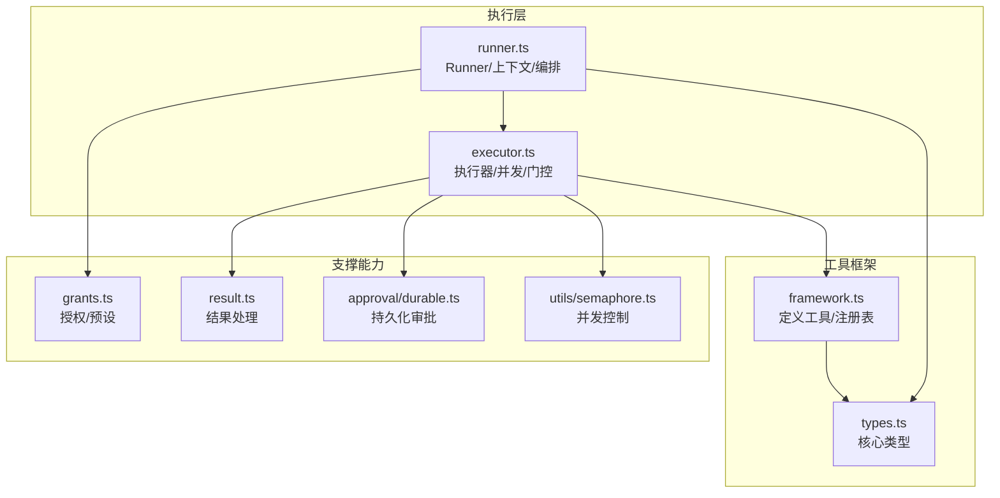
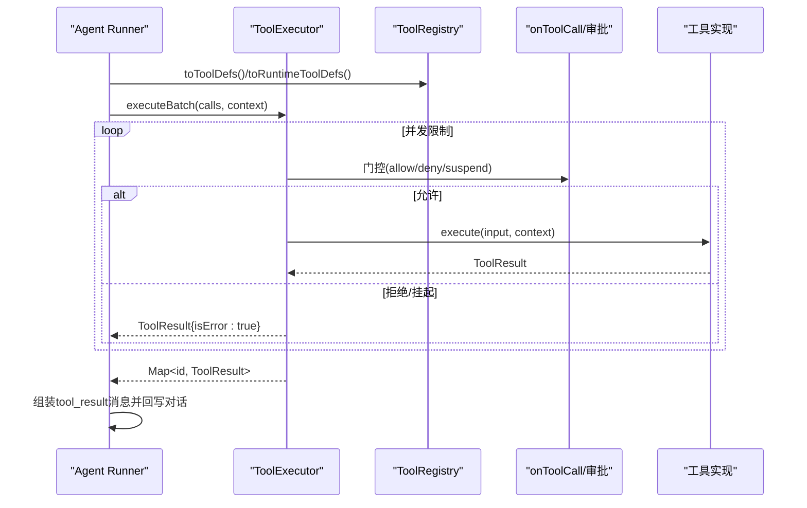
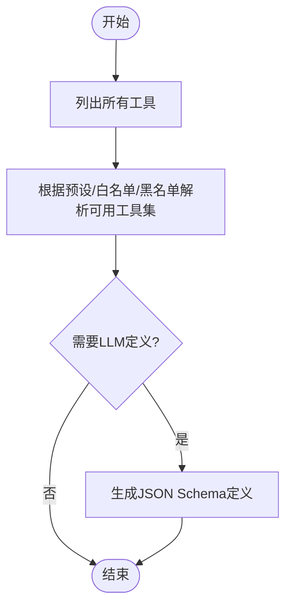
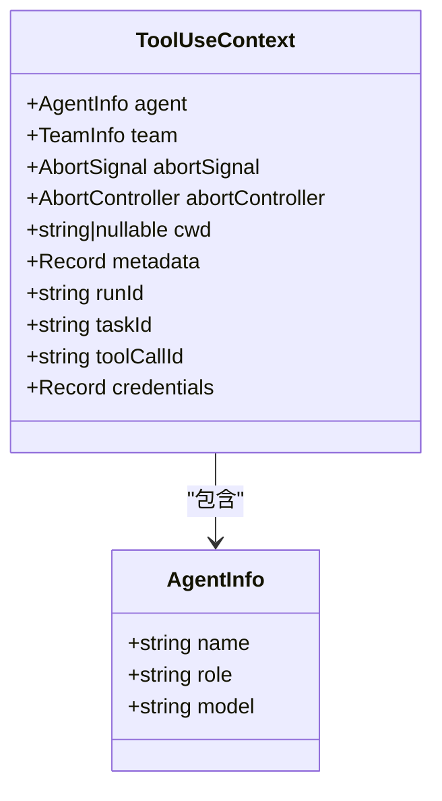
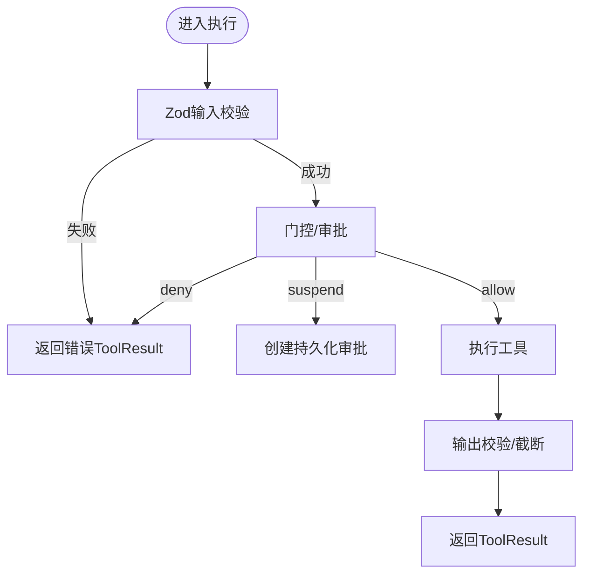
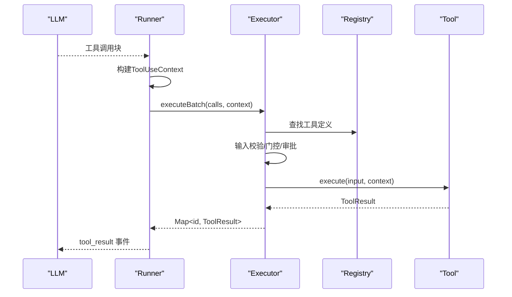
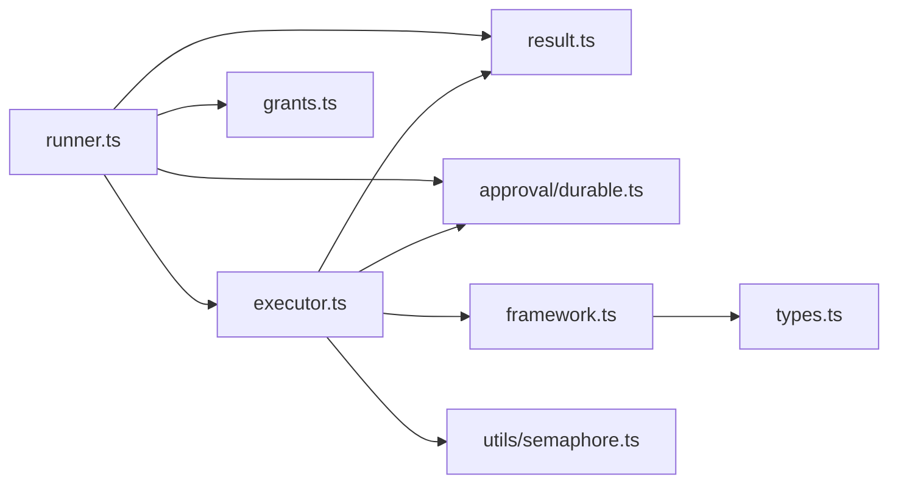

# 工具生命周期管理

<cite>
**本文引用的文件**
- [packages/core/src/tool/framework.ts](file://packages/core/src/tool/framework.ts)
- [packages/core/src/tool/executor.ts](file://packages/core/src/tool/executor.ts)
- [packages/core/src/agent/runner.ts](file://packages/core/src/agent/runner.ts)
- [packages/core/src/types.ts](file://packages/core/src/types.ts)
- [packages/core/src/tool/grants.ts](file://packages/core/src/tool/grants.ts)
- [packages/core/src/tool/result.ts](file://packages/core/src/tool/result.ts)
- [packages/core/src/approval/durable.ts](file://packages/core/src/approval/durable.ts)
- [packages/core/src/utils/semaphore.ts](file://packages/core/src/utils/semaphore.ts)
</cite>

## 目录
1. [简介](#简介)
2. [项目结构](#项目结构)
3. [核心组件](#核心组件)
4. [架构总览](#架构总览)
5. [详细组件分析](#详细组件分析)
6. [依赖关系分析](#依赖关系分析)
7. [性能考虑](#性能考虑)
8. [故障排查指南](#故障排查指南)
9. [结论](#结论)
10. [附录](#附录)

## 简介
本文件面向 Open Multi-Agent 的工具生命周期管理，聚焦以下目标：
- 动态工具注册与注销机制（addTool、removeTool、getTools）
- 工具注册器的作用与工作原理（发现、权限控制、版本管理）
- 工具执行上下文传递（ToolUseContext 的使用与数据共享）
- 沙箱执行环境与安全隔离
- 异步处理与错误传播
- 动态添加/移除工具的示例与场景
- 性能优化与资源管理策略

## 项目结构
围绕工具生命周期的关键代码分布在如下模块：
- 工具框架与注册表：定义工具、注册表、JSON Schema 转换等
- 工具执行器：并发控制、输入校验、输出校验、门控审批、错误封装
- Agent Runner：构建执行上下文、权限解析、调用编排、结果回传
- 类型定义：ToolUseContext、ToolDefinition、ToolResult 等核心类型
- 授权与预设：工具白名单/黑名单、默认预设、内置工具集合
- 结果处理：模型可见内容复制、媒体剥离、摘要等
- 持久化审批：可恢复的审批请求与决策
- 并发原语：信号量用于限流

**图表来源**
- [packages/core/src/tool/framework.ts:127-261](file://packages/core/src/tool/framework.ts#L127-L261)
- [packages/core/src/tool/executor.ts:85-164](file://packages/core/src/tool/executor.ts#L85-L164)
- [packages/core/src/agent/runner.ts:990-1107](file://packages/core/src/agent/runner.ts#L990-L1107)
- [packages/core/src/types.ts:518-583](file://packages/core/src/types.ts#L518-L583)
- [packages/core/src/tool/grants.ts:56-60](file://packages/core/src/tool/grants.ts#L56-L60)
- [packages/core/src/tool/result.ts:62-69](file://packages/core/src/tool/result.ts#L62-L69)
- [packages/core/src/approval/durable.ts:27-31](file://packages/core/src/approval/durable.ts#L27-L31)
- [packages/core/src/utils/semaphore.ts:1-200](file://packages/core/src/utils/semaphore.ts#L1-L200)

**章节来源**
- [packages/core/src/tool/framework.ts:127-261](file://packages/core/src/tool/framework.ts#L127-L261)
- [packages/core/src/tool/executor.ts:85-164](file://packages/core/src/tool/executor.ts#L85-L164)
- [packages/core/src/agent/runner.ts:990-1107](file://packages/core/src/agent/runner.ts#L990-L1107)
- [packages/core/src/types.ts:518-583](file://packages/core/src/types.ts#L518-L583)

## 核心组件
- 工具定义与注册表
  - defineTool：声明工具名称、描述、输入/输出 schema、是否具副作用、最大输出长度、执行函数
  - ToolRegistry：维护工具映射、运行时标记、列表/查询/删除、转换为 LLM 可用定义
- 工具执行器
  - 单条/批量执行、Zod 输入校验、可选输出校验、并发限制、门控审批、错误封装为 ToolResult
- Agent Runner
  - 构建 ToolUseContext、权限解析（预设/白名单/黑名单）、并行执行工具调用、结果回写对话、检查点与恢复
- 类型与上下文
  - ToolUseContext：注入 agent/team/abort/cwd/metadata/runId/taskId/toolCallId/credentials 等
  - ToolDefinition/ToolResult：工具契约与结果规范
- 授权与结果
  - grants：工具预设与允许/禁止清单
  - result：模型可见内容拷贝、媒体剥离、摘要、大小估算

**章节来源**
- [packages/core/src/tool/framework.ts:71-117](file://packages/core/src/tool/framework.ts#L71-L117)
- [packages/core/src/tool/framework.ts:127-261](file://packages/core/src/tool/framework.ts#L127-L261)
- [packages/core/src/tool/executor.ts:85-164](file://packages/core/src/tool/executor.ts#L85-L164)
- [packages/core/src/agent/runner.ts:990-1107](file://packages/core/src/agent/runner.ts#L990-L1107)
- [packages/core/src/types.ts:518-583](file://packages/core/src/types.ts#L518-L583)
- [packages/core/src/types.ts:704-734](file://packages/core/src/types.ts#L704-L734)
- [packages/core/src/tool/grants.ts:56-60](file://packages/core/src/tool/grants.ts#L56-L60)
- [packages/core/src/tool/result.ts:62-69](file://packages/core/src/tool/result.ts#L62-L69)

## 架构总览
下图展示了从 Runner 到 Executor 再到 Registry 的调用链，以及上下文与权限在其中的流转。

**图表来源**
- [packages/core/src/agent/runner.ts:990-1107](file://packages/core/src/agent/runner.ts#L990-L1107)
- [packages/core/src/tool/executor.ts:148-164](file://packages/core/src/tool/executor.ts#L148-L164)
- [packages/core/src/tool/framework.ts:204-222](file://packages/core/src/tool/framework.ts#L204-L222)

## 详细组件分析

### 工具注册器：发现、权限控制、版本管理
- 工具发现
  - 通过 ToolRegistry.list/getAll/toToolDefs 获取所有已注册工具及其 JSON Schema，供 LLM 调用
  - toRuntimeToolDefs 仅返回运行时动态添加的工具，便于区分静态与动态能力
- 权限控制
  - Runner 使用 resolveGrantedToolDefinitions 结合 toolPreset、allowedTools、disallowedTools 计算本次运行可用的工具名集合
  - 未授权的调用会被拒绝并返回错误结果
- 版本管理
  - 当前注册表以“名称唯一”约束，重复注册会抛错；如需替换，应先 unregister/deregister 再 register
  - 建议通过命名约定或前缀管理不同版本（如 v1_echo、v2_echo），避免覆盖冲突

**图表来源**
- [packages/core/src/tool/framework.ts:127-261](file://packages/core/src/tool/framework.ts#L127-L261)
- [packages/core/src/agent/runner.ts:56-60](file://packages/core/src/agent/runner.ts#L56-L60)

**章节来源**
- [packages/core/src/tool/framework.ts:127-261](file://packages/core/src/tool/framework.ts#L127-L261)
- [packages/core/src/agent/runner.ts:56-60](file://packages/core/src/agent/runner.ts#L56-L60)

### 动态工具注册与注销（addTool/removeTool/getTools）
- addTool
  - 对应 ToolRegistry.register(tool, { runtimeAdded?: boolean })
  - 若同名已存在则抛错；可通过 runtimeAdded=true 标记为“运行时新增”，以便 toRuntimeToolDefs 识别
- removeTool
  - 对应 ToolRegistry.unregister(name)/deregister(name)
  - 安全无操作：未注册时不报错
- getTools
  - 对应 ToolRegistry.list()/getAll()
  - 返回全部工具定义；配合 toToolDefs()/toLLMTools() 可得到 LLM 所需格式

注意：Agent 层面通常通过配置注入 customTools 与 tools/disallowedTools 完成“静态注册+权限过滤”。动态扩展更推荐在进程启动后直接操作 ToolRegistry。

**章节来源**
- [packages/core/src/tool/framework.ts:132-197](file://packages/core/src/tool/framework.ts#L132-L197)
- [packages/core/src/types.ts:966-974](file://packages/core/src/types.ts#L966-L974)

### 工具执行上下文传递（ToolUseContext）
- 上下文由 Runner 构建，包含：
  - agent/team：调用者身份与团队信息
  - abortSignal/abortController：取消支持
  - cwd：文件系统沙箱根目录（string/null/undefined 三种模式）
  - metadata/runId/taskId/toolCallId：追踪与幂等键
  - credentials：按 agent 隔离的密钥字典
- 上下文在批量执行中共享，确保同一批工具调用具备一致的运行边界与审计线索

**图表来源**
- [packages/core/src/types.ts:518-583](file://packages/core/src/types.ts#L518-L583)
- [packages/core/src/agent/runner.ts:1795-1811](file://packages/core/src/agent/runner.ts#L1795-L1811)

**章节来源**
- [packages/core/src/types.ts:518-583](file://packages/core/src/types.ts#L518-L583)
- [packages/core/src/agent/runner.ts:1795-1811](file://packages/core/src/agent/runner.ts#L1795-L1811)

### 沙箱执行环境与安全隔离
- 工作目录沙箱
  - cwd 为 string：内置文件系统工具强制绝对路径，且拒绝解析出该目录之外的路径（含符号链接）
  - cwd 为 null：显式禁用沙箱，接受任意路径
  - cwd 为 undefined：回退到进程工作目录下的 .agent-workspace 子目录（自动创建）
- 凭据隔离
  - credentials 按 agent 注入，工具读取时使用上下文中的值，避免跨 agent 泄露
- 默认工作目录
  - Runner 在未设置时通过 defaultWorkspaceDir() 提供默认沙箱根

**章节来源**
- [packages/core/src/types.ts:547-557](file://packages/core/src/types.ts#L547-L557)
- [packages/core/src/agent/runner.ts:1795-1811](file://packages/core/src/agent/runner.ts#L1795-L1811)

### 异步处理与错误传播
- 并发与限流
  - 使用 Semaphore 限制并发度（默认 4），executeBatch 保证每个调用都有结果
- 输入/输出校验
  - 输入：Zod schema 校验失败返回错误 ToolResult
  - 输出：可选 outputSchema 校验非错误结果；否则要求 modelOutput 明确序列化
- 门控与审批
  - onToolCall 可在执行前 allow/deny/suspend
  - suspend 触发持久化审批流程，Runner 负责挂起、持久化、恢复与继续
- 错误封装
  - 所有异常被捕获并转为 ToolResult{isError:true}，不会向上抛出，便于统一回传给 LLM

**图表来源**
- [packages/core/src/tool/executor.ts:181-338](file://packages/core/src/tool/executor.ts#L181-L338)
- [packages/core/src/approval/durable.ts:27-31](file://packages/core/src/approval/durable.ts#L27-L31)

**章节来源**
- [packages/core/src/tool/executor.ts:181-338](file://packages/core/src/tool/executor.ts#L181-L338)
- [packages/core/src/approval/durable.ts:27-31](file://packages/core/src/approval/durable.ts#L27-L31)

### 工具调用的完整序列（Runner → Executor → Registry）

**图表来源**
- [packages/core/src/agent/runner.ts:990-1107](file://packages/core/src/agent/runner.ts#L990-L1107)
- [packages/core/src/tool/executor.ts:148-164](file://packages/core/src/tool/executor.ts#L148-L164)
- [packages/core/src/tool/framework.ts:153-167](file://packages/core/src/tool/framework.ts#L153-L167)

## 依赖关系分析
- Runner 依赖
  - ToolRegistry：获取工具定义与运行时工具集合
  - ToolExecutor：执行工具调用、并发控制、错误封装
  - grants：解析可用工具集合（预设/白名单/黑名单）
  - approval/durable：持久化审批
  - result：结果处理（模型可见内容、媒体、摘要）
- Executor 依赖
  - ToolRegistry：按名称查找工具
  - utils/semaphore：并发限制
  - approval/durable：恢复时的审批一致性校验
  - result：模型输出拷贝与验证
- Framework 依赖
  - types：核心类型定义
  - zodToJsonSchema：将 Zod schema 转为 LLM 所需的 JSON Schema

**图表来源**
- [packages/core/src/agent/runner.ts:53-69](file://packages/core/src/agent/runner.ts#L53-L69)
- [packages/core/src/tool/executor.ts:23-32](file://packages/core/src/tool/executor.ts#L23-L32)
- [packages/core/src/tool/framework.ts:13-22](file://packages/core/src/tool/framework.ts#L13-L22)

**章节来源**
- [packages/core/src/agent/runner.ts:53-69](file://packages/core/src/agent/runner.ts#L53-L69)
- [packages/core/src/tool/executor.ts:23-32](file://packages/core/src/tool/executor.ts#L23-L32)
- [packages/core/src/tool/framework.ts:13-22](file://packages/core/src/tool/framework.ts#L13-L22)

## 性能考虑
- 并发控制
  - 通过 Semaphore 限制并发度，避免资源争用与下游服务过载
- 输出截断
  - 支持 per-tool 与 agent-level 的最大输出字符数，减少 LLM 上下文压力
- 结果裁剪
  - 对大结果进行媒体剥离与摘要，降低传输与解析成本
- 校验前置
  - 输入 Zod 校验尽早失败，避免昂贵执行
- 缓存与复用
  - 工具定义与 JSON Schema 转换可缓存（按需），减少重复开销

[本节为通用指导，无需具体文件引用]

## 故障排查指南
- 工具未注册
  - 现象：执行时报“工具未注册”
  - 排查：确认 ToolRegistry 是否已 register，名称是否一致
- 重复注册
  - 现象：register 抛错
  - 排查：先 unregister 再 register，或使用新名称
- 输入校验失败
  - 现象：返回错误 ToolResult，提示字段问题
  - 排查：核对 inputSchema 与实际传入参数
- 输出校验失败
  - 现象：非字符串 data 缺少 modelOutput，或 outputSchema 不匹配
  - 排查：补充 modelOutput 或修正 outputSchema
- 门控拒绝/挂起
  - 现象：onToolCall 返回 deny/suspend
  - 排查：检查权限策略与审批流程；suspend 需等待恢复
- 沙箱路径拒绝
  - 现象：文件系统工具拒绝访问路径
  - 排查：确认 cwd 设置与路径是否在沙箱内

**章节来源**
- [packages/core/src/tool/executor.ts:118-133](file://packages/core/src/tool/executor.ts#L118-L133)
- [packages/core/src/tool/executor.ts:188-197](file://packages/core/src/tool/executor.ts#L188-L197)
- [packages/core/src/tool/executor.ts:313-321](file://packages/core/src/tool/executor.ts#L313-L321)
- [packages/core/src/tool/executor.ts:250-295](file://packages/core/src/tool/executor.ts#L250-L295)
- [packages/core/src/types.ts:547-557](file://packages/core/src/types.ts#L547-L557)

## 结论
Open Multi-Agent 的工具生命周期管理以 ToolRegistry 为核心，结合 ToolExecutor 的并发与校验、Runner 的上下文与权限解析，形成“声明—注册—授权—执行—结果”的闭环。通过 ToolUseContext 实现安全的上下文传递与沙箱隔离，借助门控与持久化审批保障可控执行，并以统一的 ToolResult 承载错误与结果，便于上层观测与恢复。

## 附录

### 动态添加与移除工具（步骤说明）
- 动态添加
  - 使用 ToolRegistry.register 注册 defineTool 创建的工具
  - 如需在 LLM 侧可见，调用 toToolDefs()/toRuntimeToolDefs() 更新工具定义
- 动态移除
  - 使用 ToolRegistry.unregister/deregister 移除工具
- 获取工具列表
  - 使用 ToolRegistry.list()/getAll() 获取全部工具定义

参考路径
- [packages/core/src/tool/framework.ts:71-117](file://packages/core/src/tool/framework.ts#L71-L117)
- [packages/core/src/tool/framework.ts:132-197](file://packages/core/src/tool/framework.ts#L132-L197)
- [packages/core/src/tool/framework.ts:204-222](file://packages/core/src/tool/framework.ts#L204-L222)

### 典型执行场景
- 正常执行：输入合法、门控允许、输出校验通过
- 拒绝执行：门控 deny 或权限不足
- 挂起审批：门控 suspend，等待外部审批后恢复
- 超时/取消：abortSignal 触发，提前终止
- 大输出：按 maxOutputChars 截断，保留首尾片段

参考路径
- [packages/core/src/tool/executor.ts:181-338](file://packages/core/src/tool/executor.ts#L181-L338)
- [packages/core/src/tool/executor.ts:498-518](file://packages/core/src/tool/executor.ts#L498-L518)
- [packages/core/src/agent/runner.ts:990-1107](file://packages/core/src/agent/runner.ts#L990-L1107)