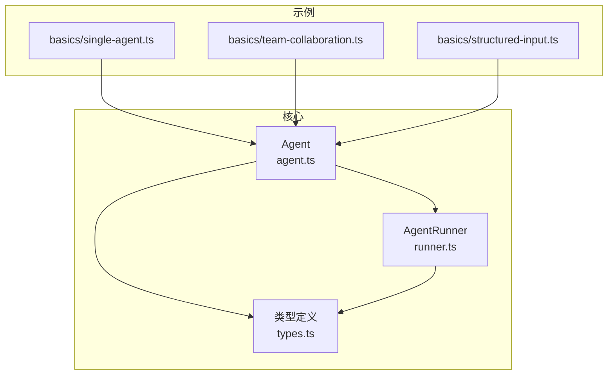
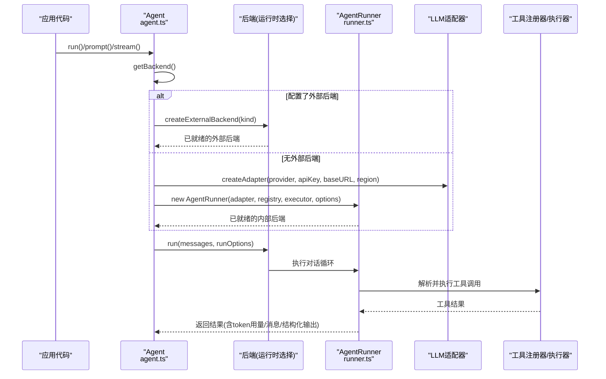
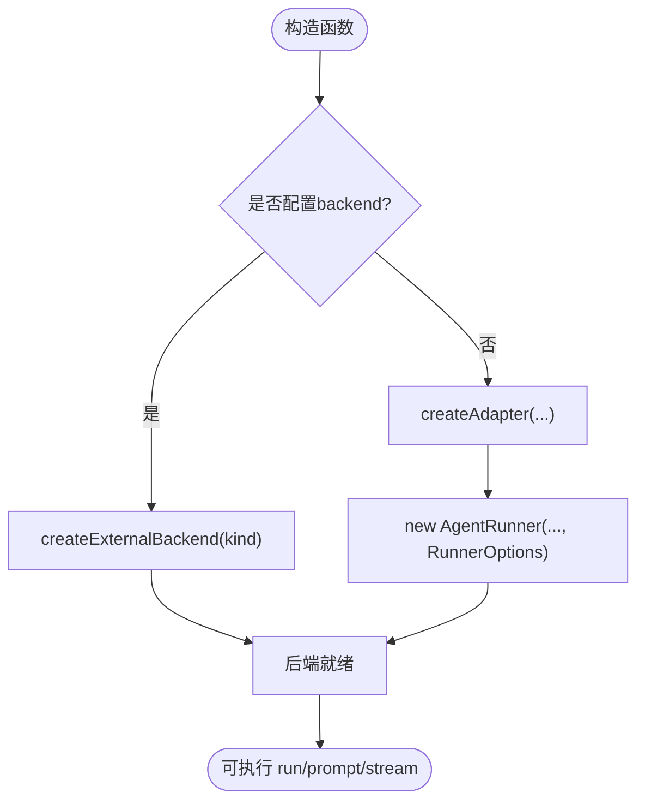
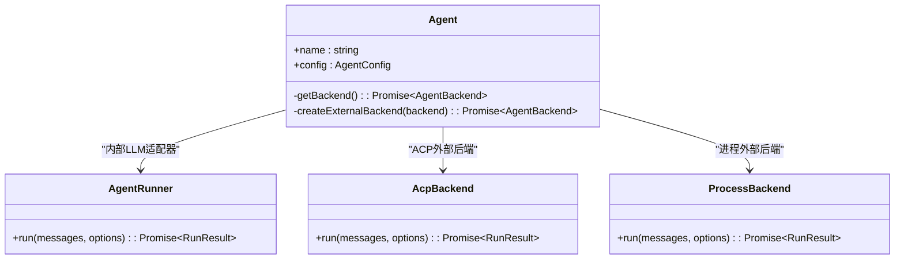
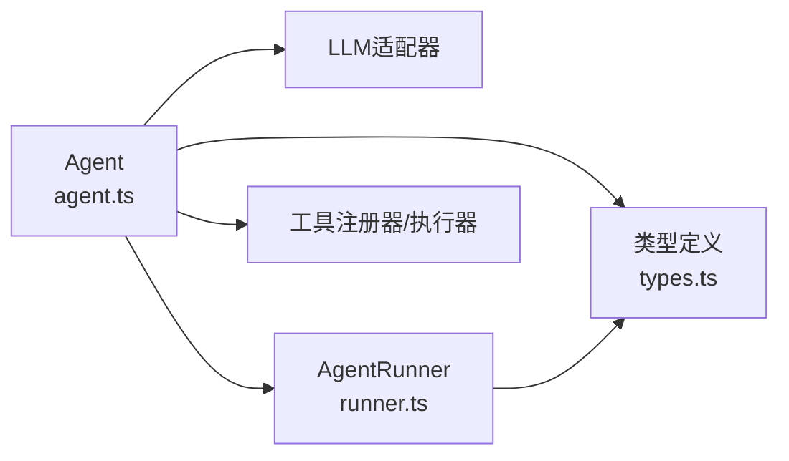

# 智能体创建与初始化

<cite>
**本文引用的文件**
- [agent.ts](file://packages/core/src/agent/agent.ts)
- [runner.ts](file://packages/core/src/agent/runner.ts)
- [types.ts](file://packages/core/src/types.ts)
- [README.md](file://packages/core/examples/README.md)
- [single-agent.ts](file://packages/core/examples/basics/single-agent.ts)
- [team-collaboration.ts](file://packages/core/examples/basics/team-collaboration.ts)
- [structured-input.ts](file://packages/core/examples/basics/structured-input.ts)
</cite>

## 目录
1. [简介](#简介)
2. [项目结构](#项目结构)
3. [核心组件](#核心组件)
4. [架构总览](#架构总览)
5. [详细组件分析](#详细组件分析)
6. [依赖关系分析](#依赖关系分析)
7. [性能考量](#性能考量)
8. [故障排查指南](#故障排查指南)
9. [结论](#结论)
10. [附录：示例与配置参考](#附录示例与配置参考)

## 简介
本文件聚焦 Open Multi-Agent（OMA）中“智能体创建与初始化”的完整流程，围绕 Agent 类的构造函数参数、AgentConfig 接口属性、后端选择机制（内部 LLM 适配器 vs 外部 ACP/Process 后端）、初始化时的资源分配与工具注册器注入、消息历史初始化等关键步骤进行系统化说明。同时提供基础智能体、带工具的智能体、外部后端智能体的使用路径指引，并总结配置验证规则与常见错误处理方法。

## 项目结构
- 核心实现位于 packages/core/src：
  - agent/agent.ts：对外暴露的高层 Agent 类，封装对话历史、状态机、工具生命周期与执行入口。
  - agent/runner.ts：AgentRunner 与 RunnerOptions，承载 LLM 调用循环与运行期选项。
  - types.ts：AgentConfig、ExternalAgentBackendConfig、ThinkingConfig、LoopDetectionConfig 等全部类型定义。
- 示例位于 packages/core/examples：
  - basics：单智能体、团队协作、结构化输入等入门示例。
  - providers/patterns/cookbook/integrations：按主题组织的更多用法。

**图表来源**
- [agent.ts:100-231](file://packages/core/src/agent/agent.ts#L100-L231)
- [runner.ts:81-141](file://packages/core/src/agent/runner.ts#L81-L141)
- [types.ts:900-1200](file://packages/core/src/types.ts#L900-L1200)

**章节来源**
- [agent.ts:100-231](file://packages/core/src/agent/agent.ts#L100-L231)
- [runner.ts:81-141](file://packages/core/src/agent/runner.ts#L81-L141)
- [types.ts:900-1200](file://packages/core/src/types.ts#L900-L1200)

## 核心组件
- Agent：高层 API，负责持久化对话历史、状态管理、动态工具注册、run/prompt/stream 入口、结构化输出校验、追踪与超时控制。
- AgentRunner：LLM 对话循环的执行器，接收 RunnerOptions，驱动模型调用与工具执行。
- AgentConfig：智能体的静态配置集合，包含模型、系统提示、工具白名单/预设、上下文策略、采样参数、预算与超时、结构化输出 schema、钩子等。
- ExternalAgentBackendConfig：外部后端配置，支持 ACP（Agent Client Protocol）与通用进程（process）两种模式。

**章节来源**
- [agent.ts:100-231](file://packages/core/src/agent/agent.ts#L100-L231)
- [runner.ts:81-141](file://packages/core/src/agent/runner.ts#L81-L141)
- [types.ts:900-1200](file://packages/core/src/types.ts#L900-L1200)
- [types.ts:825-900](file://packages/core/src/types.ts#L825-L900)

## 架构总览
Agent 在首次 run/prompt/stream 时惰性创建后端：
- 若配置了 backend，则根据 kind 动态加载 ACP 或 process 后端；
- 否则通过 createAdapter 构建 LLM 适配器，并将 AgentConfig 映射为 RunnerOptions 构造 AgentRunner。

**图表来源**
- [agent.ts:155-231](file://packages/core/src/agent/agent.ts#L155-L231)
- [runner.ts:81-141](file://packages/core/src/agent/runner.ts#L81-L141)
- [types.ts:900-1200](file://packages/core/src/types.ts#L900-L1200)

## 详细组件分析

### Agent 类与构造函数
- 构造函数参数
  - config: AgentConfig，声明模型、系统提示、工具、上下文策略、采样参数、预算与超时、结构化输出 schema、钩子等。
  - toolRegistry: ToolRegistry，用于集中管理与共享工具注册表。
  - toolExecutor: ToolExecutor，负责工具的实际调度与执行。
- 构造时关键行为
  - 校验 model 与 backend：若未设置 backend，且未提供 model，则抛出错误（独立实例必须显式指定模型）。
  - 复制并校验 history：若存在初始历史，会进行消息格式校验并深拷贝到持久历史。
  - 初始化状态：status='idle'，messages=[]，tokenUsage=ZERO_USAGE。
- 懒初始化后端
  - 首次 run/prompt/stream 时调用 getBackend()：
    - 若配置了 backend，则通过 createExternalBackend 动态导入并创建 ACP 或 process 后端。
    - 否则通过 createAdapter 创建 LLM 适配器，并将 AgentConfig 映射为 RunnerOptions，构造 AgentRunner。
- 工具管理
  - addTool/removeTool/getTools：运行时动态增删工具，无需重启。
- 执行流程
  - run：一次性对话，不修改持久历史。
  - prompt：追加用户消息到持久历史，并在完成后将助手消息写回历史。
  - stream：流式返回事件，不修改持久历史。
  - executeRun/executeStream：统一的状态转换、beforeRun/afterRun 钩子、结构化输出校验、预算/超时/取消处理、追踪埋点。

**图表来源**
- [agent.ts:122-149](file://packages/core/src/agent/agent.ts#L122-L149)
- [agent.ts:155-231](file://packages/core/src/agent/agent.ts#L155-L231)

**章节来源**
- [agent.ts:122-149](file://packages/core/src/agent/agent.ts#L122-L149)
- [agent.ts:155-231](file://packages/core/src/agent/agent.ts#L155-L231)
- [agent.ts:280-328](file://packages/core/src/agent/agent.ts#L280-L328)
- [agent.ts:387-597](file://packages/core/src/agent/agent.ts#L387-L597)

### AgentConfig 接口详解
- 身份与描述
  - name、description、capabilities、costTier、latencyClass、permissionBoundary：用于编排、路由与治理的元数据。
- 模型与提供者
  - model、adapter、provider、baseURL、apiKey、region：决定 LLM 调用目标；当设置 adapter 时跳过 createAdapter。
- 外部后端
  - backend：ExternalAgentBackendConfig，支持 'acp' 与 'process'；启用后忽略 LLM 相关字段（model/provider/adapter/sampling/contextStrategy），但仍参与任务图、共享内存、失败级联与 token 预算。
- 系统与提示
  - systemPrompt：系统提示；outputSchema：最终输出的 Zod schema，会在结束时解析 JSON 并校验，失败自动重试一次。
- 工具与权限
  - tools/disallowedTools/toolPreset/customTools/onToolCall/credentials/cwd：工具白名单/黑名单/预设/自定义工具/每调用门控/凭据作用域/文件系统沙箱根目录。
- 运行控制
  - maxTurns/maxTokens/maxTokenBudget/timeoutMs/callTimeoutMs/loopDetection/compressToolResults/preserveReasoningAsText/compressReasoningText：控制对话轮次、输出长度、累计 token 预算、整体与单次调用超时、循环检测、结果压缩与推理文本保留策略。
- 采样与扩展
  - temperature/topP/topK/minP/parallelToolCalls/frequencyPenalty/presencePenalty/extraBody/thinking：采样参数、并行工具调用、额外请求体、思考/推理能力开关与预算。
- 钩子
  - beforeRun/afterRun：运行前后钩子，可用于改写输入、审计、拦截或增强结果。

**章节来源**
- [types.ts:900-1200](file://packages/core/src/types.ts#L900-L1200)
- [types.ts:1186-1195](file://packages/core/src/types.ts#L1186-L1195)
- [types.ts:1084-1110](file://packages/core/src/types.ts#L1084-L1110)
- [types.ts:1111-1185](file://packages/core/src/types.ts#L1111-L1185)

### 后端选择机制：内部 LLM 适配器 vs 外部后端
- 内部 LLM 适配器
  - 默认路径：未配置 backend 时，使用 createAdapter(provider, apiKey, baseURL, region) 获取适配器，再构造 AgentRunner。
  - 适用场景：需要 OMA 内置的对话循环、工具执行、结构化输出校验、上下文压缩、循环检测、预算与超时控制等。
- 外部后端
  - ACP：kind='acp'，command/args/env/cwd/permission，适合集成 Claude Code/Gemini CLI/Codex 等具备自身 agentic loop 的本地进程。
  - Process：kind='process'，command/args/env/cwd/input，以标准输入/参数方式传递提示，stdout 作为输出，非零退出视为失败。
  - 注意：外部后端下 LLM 相关字段（model/provider/adapter/sampling/contextStrategy）不生效，但 agent 仍参与 DAG、共享内存、失败级联与 token 预算。
- 动态加载
  - createExternalBackend 通过动态 import 按需加载 acp-backend/process-backend，避免不必要的依赖开销。

**图表来源**
- [agent.ts:155-274](file://packages/core/src/agent/agent.ts#L155-L274)
- [types.ts:825-900](file://packages/core/src/types.ts#L825-L900)

**章节来源**
- [agent.ts:155-274](file://packages/core/src/agent/agent.ts#L155-L274)
- [types.ts:825-900](file://packages/core/src/types.ts#L825-L900)

### 初始化过程中的关键步骤
- 资源分配
  - 构造时校验并复制 history，初始化状态与 ZERO_USAGE。
  - 首次执行时惰性创建后端与适配器，避免启动开销。
- 工具注册器注入
  - 通过构造函数注入 ToolRegistry 与 ToolExecutor，支持多智能体共享同一注册表。
  - 运行时可通过 addTool/removeTool 动态调整可用工具集。
- 消息历史初始化
  - 若配置了 history，则在构造时进行有效性校验并复制到持久历史；prompt 会将新消息追加到历史，run/stream 不修改持久历史。
- 结构化输出与校验
  - 若配置 outputSchema，将在结束时解析 JSON 并校验；失败自动重试一次，附带错误反馈。
- 钩子与追踪
  - beforeRun 可在执行前改写输入；afterRun 可对结果进行后处理。
  - 统一生成 trace span，记录 agent 名称、轮次、工具调用次数、token 用量等。

**章节来源**
- [agent.ts:122-149](file://packages/core/src/agent/agent.ts#L122-L149)
- [agent.ts:280-328](file://packages/core/src/agent/agent.ts#L280-L328)
- [agent.ts:387-597](file://packages/core/src/agent/agent.ts#L387-L597)
- [agent.ts:644-735](file://packages/core/src/agent/agent.ts#L644-L735)

### 配置验证规则与常见错误处理
- 必填校验
  - 独立实例 new Agent(...) 必须设置 model 或 backend；否则抛出错误。
- 工具与权限
  - customTools 名称不得与内置工具冲突；tools/disallowedTools 控制可见性与禁用。
  - credentials 仅在当前 agent 作用域内对工具可见，不会跨 agent 继承。
- 预算与超时
  - maxTokenBudget：超过阈值会标记 budgetExceeded，并包装为 TokenBudgetExceededError。
  - timeoutMs/callTimeoutMs：分别控制整次运行与单次 LLM 调用的超时；合并 caller 的 abortSignal。
- 结构化输出
  - outputSchema：失败自动重试一次；仍失败则返回 structured=undefined 的错误结果。
- 外部后端
  - backend.kind 必须为 'acp' 或 'process'；未知 kind 会抛错。
  - ACP 需要可选 peer @agentclientprotocol/sdk；process 不需要额外依赖。

**章节来源**
- [agent.ts:122-149](file://packages/core/src/agent/agent.ts#L122-L149)
- [agent.ts:239-274](file://packages/core/src/agent/agent.ts#L239-L274)
- [agent.ts:481-505](file://packages/core/src/agent/agent.ts#L481-L505)
- [agent.ts:527-563](file://packages/core/src/agent/agent.ts#L527-L563)
- [types.ts:900-1200](file://packages/core/src/types.ts#L900-L1200)

## 依赖关系分析
- Agent 依赖：
  - LLM 适配器（通过 createAdapter）或外部后端（ACP/Process）。
  - 工具框架（ToolRegistry/ToolExecutor）。
  - 类型定义（AgentConfig、RunnerOptions、ExternalAgentBackendConfig 等）。
- AgentRunner 依赖：
  - 适配器与 RunnerOptions，驱动对话循环与工具执行。
- 类型模块：
  - 集中定义所有公共类型，保持依赖无环。

**图表来源**
- [agent.ts:100-231](file://packages/core/src/agent/agent.ts#L100-L231)
- [runner.ts:81-141](file://packages/core/src/agent/runner.ts#L81-L141)
- [types.ts:900-1200](file://packages/core/src/types.ts#L900-L1200)

**章节来源**
- [agent.ts:100-231](file://packages/core/src/agent/agent.ts#L100-L231)
- [runner.ts:81-141](file://packages/core/src/agent/runner.ts#L81-L141)
- [types.ts:900-1200](file://packages/core/src/types.ts#L900-L1200)

## 性能考量
- 惰性初始化：后端与适配器在首次调用时才创建，减少冷启动成本。
- 工具结果压缩：compressToolResults 可减少长工具输出对上下文的占用。
- 推理文本压缩：preserveReasoningAsText + compressReasoningText 可控制长推理内容的膨胀。
- 并行工具调用：parallelToolCalls 可提升吞吐，但需考虑后端兼容性。
- 预算与超时：maxTokenBudget、timeoutMs、callTimeoutMs 防止无限增长与长时间阻塞。
- 循环检测：loopDetection 提前发现重复调用/输出，降低无效消耗。

[本节为通用指导，不直接分析具体文件]

## 故障排查指南
- 缺少 model
  - 现象：独立实例 new Agent(...) 未设置 model 且未配置 backend 时抛出错误。
  - 处理：显式设置 model，或通过 OpenMultiAgent 编排继承 defaultModel，或配置 backend。
- 外部后端未知 kind
  - 现象：backend.kind 不为 'acp'/'process' 时报错。
  - 处理：修正为支持的 kind。
- 预算超限
  - 现象：result.budgetExceeded=true，伴随 TokenBudgetExceededError。
  - 处理：提高 maxTokenBudget 或优化 prompt/tools。
- 结构化输出校验失败
  - 现象：outputSchema 校验失败，自动重试一次；仍失败则 structured=undefined。
  - 处理：检查模型输出是否为合法 JSON 并符合 schema。
- 超时/取消
  - 现象：timeoutMs/callTimeoutMs 触发或 caller 传入 abortSignal 导致中止。
  - 处理：调整超时阈值或确保上游正确取消。

**章节来源**
- [agent.ts:122-149](file://packages/core/src/agent/agent.ts#L122-L149)
- [agent.ts:239-274](file://packages/core/src/agent/agent.ts#L239-L274)
- [agent.ts:481-505](file://packages/core/src/agent/agent.ts#L481-L505)
- [agent.ts:527-563](file://packages/core/src/agent/agent.ts#L527-L563)
- [agent.ts:644-735](file://packages/core/src/agent/agent.ts#L644-L735)

## 结论
Agent 提供了统一的智能体抽象：通过 AgentConfig 声明模型、工具、上下文策略与运行约束；通过懒初始化选择内部 LLM 适配器或外部 ACP/Process 后端；在初始化阶段完成资源分配、工具注册器注入与消息历史准备；在执行阶段提供结构化输出校验、预算与超时控制、循环检测与追踪埋点。结合示例与类型定义，可快速搭建从基础到高级的智能体工作流。

[本节为总结性内容，不直接分析具体文件]

## 附录：示例与配置参考
- 基础智能体
  - 参考：basics/single-agent.ts（单智能体 + bash/file 工具，以及流式调用）。
  - 路径：[single-agent.ts](file://packages/core/examples/basics/single-agent.ts)
- 团队协作（协调者模式）
  - 参考：basics/team-collaboration.ts（runTeam 协调者模式）。
  - 路径：[team-collaboration.ts](file://packages/core/examples/basics/team-collaboration.ts)
- 结构化输入
  - 参考：basics/structured-input.ts（调用方拥有的消息历史与图像块）。
  - 路径：[structured-input.ts](file://packages/core/examples/basics/structured-input.ts)
- 示例索引与分类
  - 参考：examples/README.md（示例目录、运行方式与环境变量要求）。
  - 路径：[README.md](file://packages/core/examples/README.md)

**章节来源**
- [README.md:15-25](file://packages/core/examples/README.md#L15-L25)
- [single-agent.ts](file://packages/core/examples/basics/single-agent.ts)
- [team-collaboration.ts](file://packages/core/examples/basics/team-collaboration.ts)
- [structured-input.ts](file://packages/core/examples/basics/structured-input.ts)