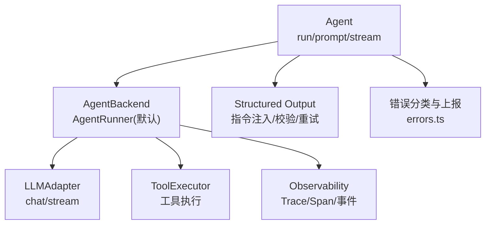
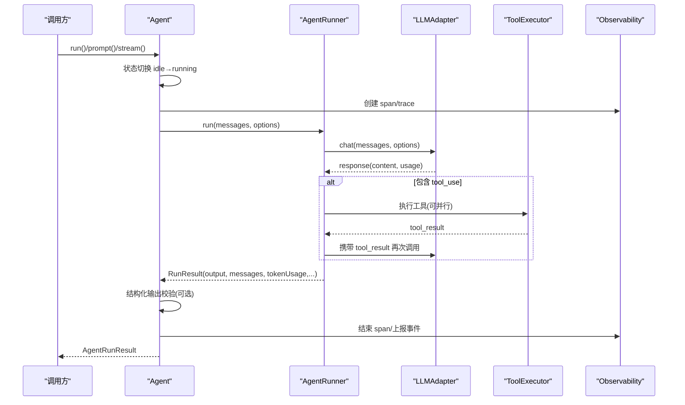
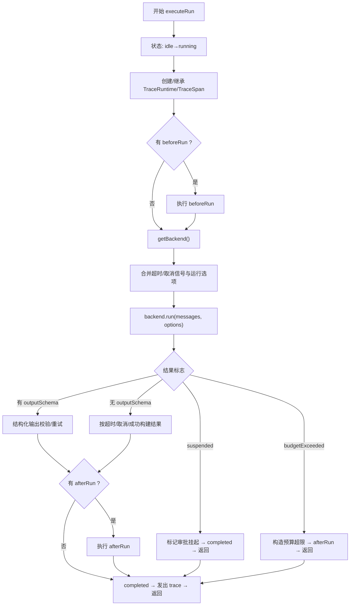
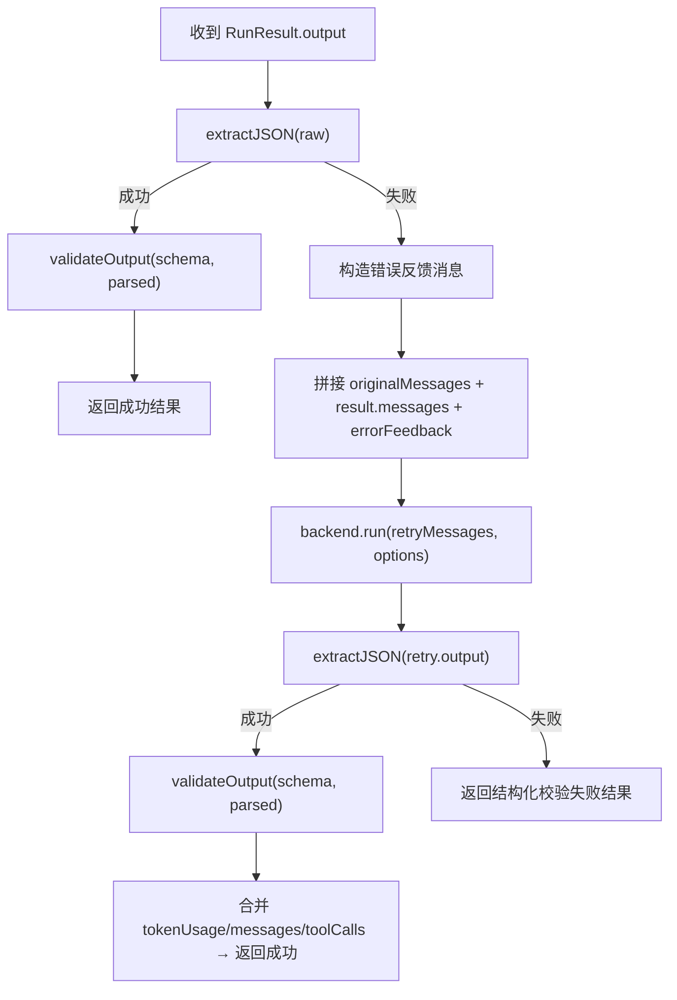
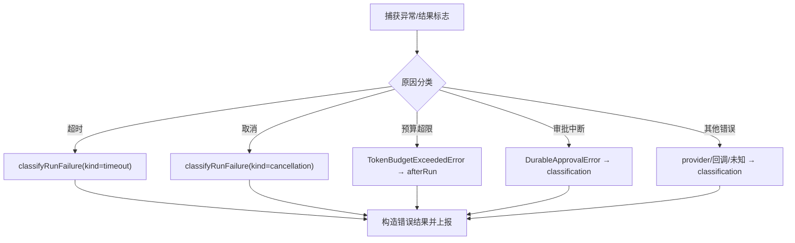
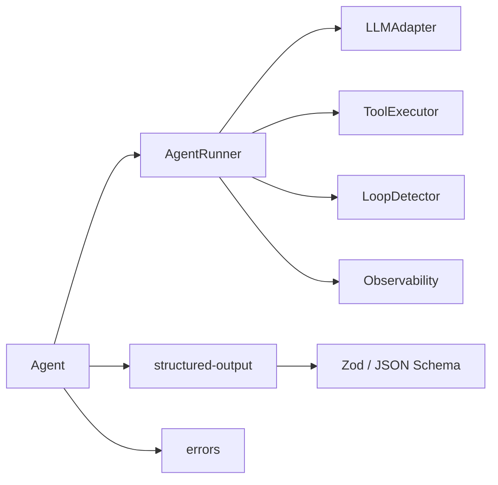

# 智能体执行流程

<cite>
**本文引用的文件**
- [packages/core/src/agent/agent.ts](file://packages/core/src/agent/agent.ts)
- [packages/core/src/agent/runner.ts](file://packages/core/src/agent/runner.ts)
- [packages/core/src/agent/structured-output.ts](file://packages/core/src/agent/structured-output.ts)
- [packages/core/src/errors.ts](file://packages/core/src/errors.ts)
- [packages/core/src/index.ts](file://packages/core/src/index.ts)
</cite>

## 目录
1. [简介](#简介)
2. [项目结构](#项目结构)
3. [核心组件](#核心组件)
4. [架构总览](#架构总览)
5. [详细组件分析](#详细组件分析)
6. [依赖关系分析](#依赖关系分析)
7. [性能考量](#性能考量)
8. [故障排查指南](#故障排查指南)
9. [结论](#结论)
10. [附录：使用示例与最佳实践](#附录使用示例与最佳实践)

## 简介
本文件聚焦 Open Multi-Agent 中智能体的执行流程，围绕 Agent.run()、Agent.prompt()、Agent.stream() 三种执行模式的区别与适用场景展开，并深入解析 executeRun() 的完整执行路径（状态转换、钩子函数、后端执行、结果处理）。同时说明错误处理机制（超时、取消、预算超限）、结构化输出验证与重试机制的实现原理，以及执行上下文管理与追踪信息收集过程。文末提供不同执行模式的用法指引与最佳实践建议。

## 项目结构
Open Multi-Agent 的核心执行逻辑集中在 agent 层：
- Agent：对外暴露 run/prompt/stream 等入口，管理会话历史、状态、工具生命周期，并委派给 AgentBackend 执行。
- AgentRunner：实现 LLM 对话循环，负责模型调用、工具调用、消息累积、token 统计、上下文压缩、循环检测等。
- structured-output：结构化输出指令注入、JSON 提取与 Zod 校验。
- errors：框架级错误类型与可重试判定。
- index：公共 API 导出，便于上层编排器或用户导入。

图表来源
- [packages/core/src/agent/agent.ts:290-328](file://packages/core/src/agent/agent.ts#L290-L328)
- [packages/core/src/agent/runner.ts:472-486](file://packages/core/src/agent/runner.ts#L472-L486)
- [packages/core/src/agent/structured-output.ts:21-34](file://packages/core/src/agent/structured-output.ts#L21-L34)
- [packages/core/src/errors.ts:221-238](file://packages/core/src/errors.ts#L221-L238)

章节来源
- [packages/core/src/index.ts:57-143](file://packages/core/src/index.ts#L57-L143)
- [packages/core/src/agent/agent.ts:104-149](file://packages/core/src/agent/agent.ts#L104-L149)

## 核心组件
- Agent：封装会话历史、状态机（idle → running → completed/error）、动态工具注册、beforeRun/afterRun 钩子、结构化输出配置。
- AgentRunner：对话循环引擎，维护最大轮次、上下文策略（滑动窗口/摘要/压缩）、工具调用并行执行、token 预算与循环检测、每调用超时控制、检查点与审批边界。
- Structured Output：将 Zod schema 转为 JSON Schema 指令注入系统提示；支持从文本中提取 JSON 并进行严格校验；失败时自动重试一次。
- Errors：定义 TokenBudgetExceededError、CostBudgetExceededError、LLMCallTimeoutError、InvalidMessageError 等，并提供 isRetryableError 判断是否可重试。

章节来源
- [packages/core/src/agent/agent.ts:104-149](file://packages/core/src/agent/agent.ts#L104-L149)
- [packages/core/src/agent/runner.ts:85-177](file://packages/core/src/agent/runner.ts#L85-L177)
- [packages/core/src/agent/structured-output.ts:21-34](file://packages/core/src/agent/structured-output.ts#L21-L34)
- [packages/core/src/errors.ts:27-81](file://packages/core/src/errors.ts#L27-L81)

## 架构总览
下图展示 Agent 到 Runner 再到 LLM 与工具的调用链，以及观察性（trace）与错误处理的交汇点。

图表来源
- [packages/core/src/agent/agent.ts:391-597](file://packages/core/src/agent/agent.ts#L391-L597)
- [packages/core/src/agent/runner.ts:561-681](file://packages/core/src/agent/runner.ts#L561-L681)
- [packages/core/src/agent/structured-output.ts:50-127](file://packages/core/src/agent/structured-output.ts#L50-L127)

## 详细组件分析

### 三种执行方法：run()、prompt()、stream()
- run(input, options?)
  - 语义：以“新会话”方式执行，不读取也不更新 Agent 的持久化历史。适合一次性问答。
  - 内部：prepareAgentRunInput → executeRun。
- prompt(input)
  - 语义：作为多轮对话中的一轮 user 输入，追加到持久化历史，并在后续 prompt() 中继续保留上下文。
  - 内部：prepareAgentPromptInput → 写入历史 → executeRun → 将本轮新增消息写回历史。
- stream(input, options?)
  - 语义：流式返回增量事件 StreamEvent，同样基于“新会话”，不修改持久化历史。
  - 内部：prepareAgentRunInput → executeStream。

差异总结
- 历史：run 与 stream 不改变持久化历史；prompt 会累积历史。
- 返回：run 返回聚合结果；prompt 返回聚合结果；stream 返回异步生成器，逐步产出事件。
- 适用场景：
  - run：一次性任务、批处理、无需记忆的场景。
  - prompt：多轮对话、需要保持上下文的交互。
  - stream：需要低延迟增量反馈的 UI 或长文本生成。

章节来源
- [packages/core/src/agent/agent.ts:290-328](file://packages/core/src/agent/agent.ts#L290-L328)

### executeRun() 完整执行路径
executeRun() 是 run 与 prompt 共享的执行核心，涵盖以下阶段：
1) 状态切换与追踪初始化
- 状态由 idle 切换到 running。
- 创建/继承 RunIdentity、TraceRuntime、TraceSpan，记录 agent name、phase、attempt、taskId 等属性。
2) beforeRun 钩子
- 若配置了 beforeRun 且非 resumeState 恢复，则先执行钩子。
3) 获取后端并准备选项
- getBackend() 懒加载 AgentRunner（或外部后端），组装 RunnerOptions（模型、采样参数、工具白名单/黑名单、上下文策略、预算等）。
- 合并 abortSignal 与 timeoutSignal（整跑超时 + 调用方取消）。
4) 后端执行
- 调用 backend.run(messages, runOptions)，得到 RunResult（含 output、messages、toolCalls、tokenUsage、budgetExceeded、suspended、aborted 等）。
5) 结果处理
- 累计 tokenUsage。
- 若 suspended：标记为“需持久化审批”，状态切到 completed 并返回。
- 若 budgetExceeded：构造 TokenBudgetExceededError，经 afterRun 钩子后返回。
- 若配置了 outputSchema：进入结构化输出校验与重试流程。
- 否则根据超时/取消/正常完成构建 AgentRunResult。
6) afterRun 钩子与收尾
- 执行 afterRun（如有），确保 outcome 字段正确，状态切到 completed，发出 trace 事件。
7) 异常分支
- catch 中统一转换为错误结果，按超时/取消/审批/回调失败分类，并上报 trace。

图表来源
- [packages/core/src/agent/agent.ts:391-597](file://packages/core/src/agent/agent.ts#L391-L597)

章节来源
- [packages/core/src/agent/agent.ts:391-597](file://packages/core/src/agent/agent.ts#L391-L597)

### 结构化输出验证与重试机制
- 指令注入：当配置 outputSchema 时，将 Zod schema 转成 JSON Schema，并以强约束指令追加到 systemPrompt，要求模型仅返回符合 schema 的 JSON。
- 首次尝试：extractJSON 从原始文本中稳健提取 JSON（支持直接解析、 fenced code block、裸对象/数组），再用 validateOutput 进行 Zod 校验。
- 重试策略：若首次失败，构造一条“错误反馈”消息（包含错误信息），连同原消息与本轮 assistant 消息一并重放给后端再执行一次；成功后合并 tokenUsage、messages、toolCalls 并返回；仍失败则返回带 validation 错误的结果。
- 注意：重试会增加一次 LLM 调用与 token 消耗，应结合 maxTurns、maxTokenBudget 与重试上限策略使用。

图表来源
- [packages/core/src/agent/agent.ts:648-735](file://packages/core/src/agent/agent.ts#L648-L735)
- [packages/core/src/agent/structured-output.ts:21-34](file://packages/core/src/agent/structured-output.ts#L21-L34)
- [packages/core/src/agent/structured-output.ts:50-127](file://packages/core/src/agent/structured-output.ts#L50-L127)

章节来源
- [packages/core/src/agent/agent.ts:648-735](file://packages/core/src/agent/agent.ts#L648-L735)
- [packages/core/src/agent/structured-output.ts:21-34](file://packages/core/src/agent/structured-output.ts#L21-L34)
- [packages/core/src/agent/structured-output.ts:50-127](file://packages/core/src/agent/structured-output.ts#L50-L127)

### 错误处理机制：超时、取消、预算超限
- 整跑超时：executeRun 在每次调用前根据 config.timeoutMs 创建 AbortSignal，并与 caller.abortSignal 合并；若触发，则归类为 timeout，构造错误结果并上报。
- 调用方取消：caller.abortSignal 触发时，归类为 cancellation，构造 AbortError 风格的结果。
- 单调用超时：AgentRunner.chatWithCallTimeout 对每次 adapter.chat() 设置 per-call 超时；若该超时触发且非调用方主动取消，则抛出 LLMCallTimeoutError。
- 预算超限：当 runner 返回 budgetExceeded=true，Agent 侧构造 TokenBudgetExceededError，经 afterRun 后返回；也可通过 maxTokenBudget 限制单次运行。
- 可重试判定：isRetryableError 对部分错误（如网络抖动、408/409/429、5xx）允许重试；对预算耗尽、非法输入、取消等视为不可重试。

图表来源
- [packages/core/src/agent/agent.ts:528-597](file://packages/core/src/agent/agent.ts#L528-L597)
- [packages/core/src/agent/runner.ts:561-582](file://packages/core/src/agent/runner.ts#L561-L582)
- [packages/core/src/errors.ts:221-238](file://packages/core/src/errors.ts#L221-L238)

章节来源
- [packages/core/src/agent/agent.ts:528-597](file://packages/core/src/agent/agent.ts#L528-L597)
- [packages/core/src/agent/runner.ts:561-582](file://packages/core/src/agent/runner.ts#L561-L582)
- [packages/core/src/errors.ts:221-238](file://packages/core/src/errors.ts#L221-L238)

### 执行上下文管理与追踪信息收集
- 上下文管理：
  - 会话历史：prompt 会持久化历史；run/stream 使用独立消息集合。
  - 上下文策略：Runner 支持 sliding-window、summarize、compact 等策略，避免超长上下文导致成本与性能问题。
  - 工具结果压缩与推理文本压缩：减少中间结果体积，降低 token 消耗。
- 追踪信息：
  - 每个 Agent 执行创建 TraceRuntime/TraceSpan，记录 agent name、phase、attempt、taskId 等属性。
  - LLM 调用、工具调用、结构化输出校验等关键节点均产生 span/event。
  - 支持 legacy onTrace 回调与新式 TraceRuntime 双通道上报。
  - 结束时关闭 span，必要时关闭 TraceRuntime。

章节来源
- [packages/core/src/agent/agent.ts:391-463](file://packages/core/src/agent/agent.ts#L391-L463)
- [packages/core/src/agent/agent.ts:599-642](file://packages/core/src/agent/agent.ts#L599-L642)
- [packages/core/src/agent/runner.ts:584-681](file://packages/core/src/agent/runner.ts#L584-L681)

## 依赖关系分析
- Agent 依赖：
  - AgentRunner（默认后端）、ToolRegistry、ToolExecutor、structured-output、observability、errors。
- AgentRunner 依赖：
  - LLMAdapter（具体厂商适配）、ToolExecutor、LoopDetector、utils（tokens/redaction/abort）、approval/durable（检查点/审批）。
- 结构化输出依赖：
  - zodToJsonSchema（来自 tool/framework）、Zod 校验。
- 错误体系：
  - 集中定义错误类与 isRetryableError，供上层编排与重试策略复用。

图表来源
- [packages/core/src/agent/agent.ts:104-149](file://packages/core/src/agent/agent.ts#L104-L149)
- [packages/core/src/agent/runner.ts:472-486](file://packages/core/src/agent/runner.ts#L472-L486)
- [packages/core/src/agent/structured-output.ts:21-34](file://packages/core/src/agent/structured-output.ts#L21-L34)
- [packages/core/src/errors.ts:221-238](file://packages/core/src/errors.ts#L221-L238)

章节来源
- [packages/core/src/index.ts:57-143](file://packages/core/src/index.ts#L57-L143)

## 性能考量
- 控制轮次与上下文长度：合理设置 maxTurns 与上下文策略（sliding-window/summarize/compact），避免无限循环与上下文膨胀。
- 工具结果压缩：开启 compressToolResults 可减少中间结果体积，降低 token 成本。
- 推理文本压缩：compressReasoningText 可降低思考过程的 token 占用。
- 调用级超时：callTimeoutMs 防止单个模型调用卡死；整跑超时 timeoutMs 保护整体 SLA。
- 预算控制：maxTokenBudget 限制单次运行的 token 总量，配合 isRetryableError 做可控重试。
- 并行工具调用：parallelToolCalls 可提升吞吐，但需评估模型能力与费用。

[本节为通用指导，不直接分析具体文件]

## 故障排查指南
- 症状：长时间无响应
  - 检查 callTimeoutMs 与 timeoutMs 是否过小/过大；确认是否触发了 LLMCallTimeoutError 或整跑超时。
- 症状：频繁被取消
  - 检查 caller.abortSignal 是否正确传递；确认业务层取消逻辑是否与 Agent 的超时信号冲突。
- 症状：结构化输出反复失败
  - 检查 outputSchema 是否过于严格；确认 extractJSON 是否能正确提取 JSON；关注重试后的错误反馈是否清晰。
- 症状：预算耗尽
  - 检查 maxTokenBudget 与模型 token 用量；考虑启用上下文压缩或缩短对话历史。
- 症状：工具调用被拒绝或报错
  - 检查 allowedTools/disallowedTools 与 toolPreset；确认 ToolExecutor 权限与沙箱路径。

章节来源
- [packages/core/src/agent/agent.ts:528-597](file://packages/core/src/agent/agent.ts#L528-L597)
- [packages/core/src/agent/runner.ts:561-582](file://packages/core/src/agent/runner.ts#L561-L582)
- [packages/core/src/errors.ts:221-238](file://packages/core/src/errors.ts#L221-L238)

## 结论
Agent 的 run/prompt/stream 提供了覆盖一次性任务、多轮对话与流式输出的完整执行范式。executeRun() 将状态机、钩子、后端执行、结果处理与追踪有机串联，并通过结构化输出校验与重试保障输出质量。错误处理覆盖超时、取消、预算超限等关键异常路径，结合上下文策略与预算控制，可在生产环境中稳定运行。

[本节为总结，不直接分析具体文件]

## 附录：使用示例与最佳实践
- 一次性任务（run）
  - 适用：不需要记忆的任务，如批量摘要、一次性查询。
  - 要点：设置合理的 timeoutMs 与 maxTokenBudget；如需结构化输出，配置 outputSchema。
- 多轮对话（prompt）
  - 适用：客服、访谈、持续协作等需要历史记忆的场景。
  - 要点：控制历史长度与上下文策略；谨慎使用大 history；结合 afterRun 做结果后处理。
- 流式输出（stream）
  - 适用：前端实时渲染、长文本生成、交互式体验。
  - 要点：监听 StreamEvent 增量；结合 cancel/timeout 保证用户体验；注意首字节延迟。
- 结构化输出
  - 使用 Zod 定义严格 schema；利用内置指令注入提高成功率；必要时开启一次重试。
- 错误与重试
  - 使用 isRetryableError 决定重试策略；对预算/取消/非法输入等不可重试错误快速失败。
- 追踪与观测
  - 通过 onTrace 或 TraceRuntime 采集 span 与事件；记录 agent name、phase、attempt、taskId 等维度。

[本节为概念性指导，不直接分析具体文件]