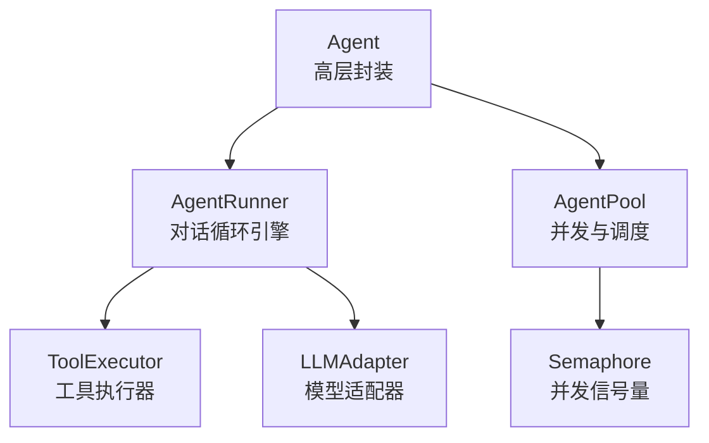
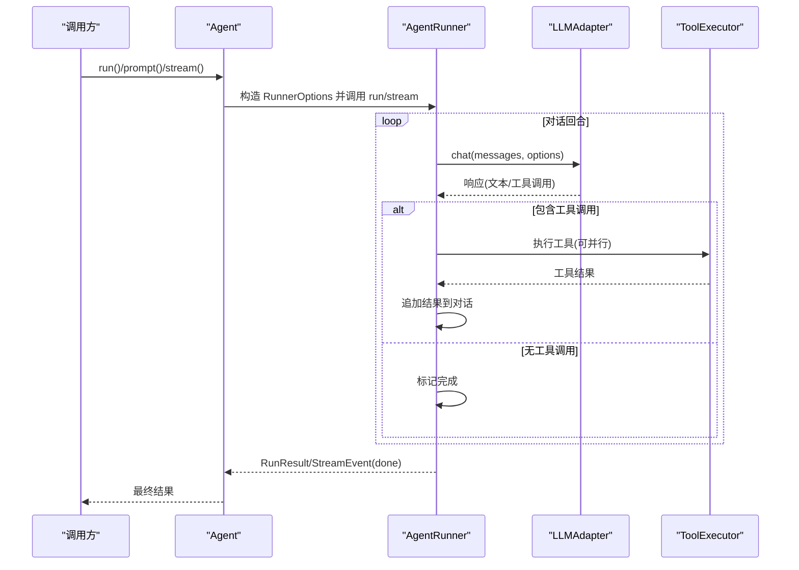
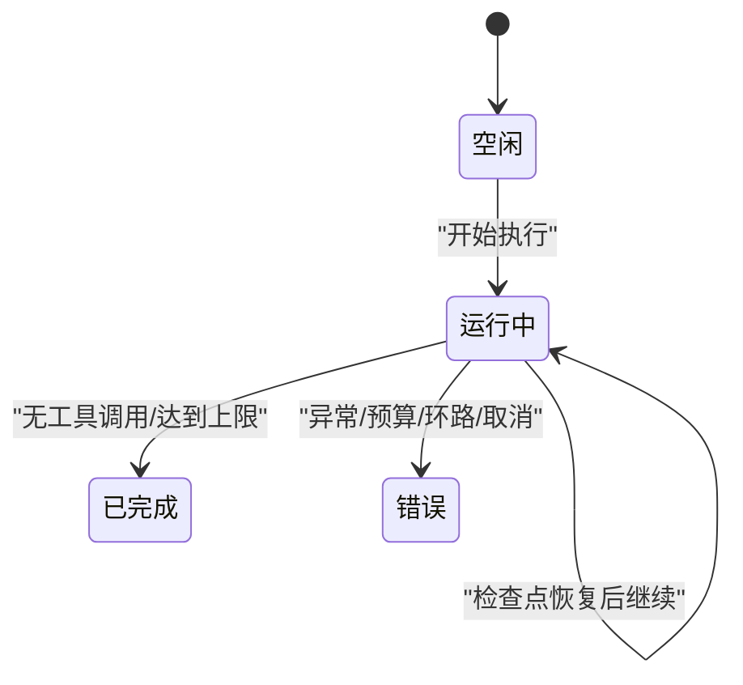
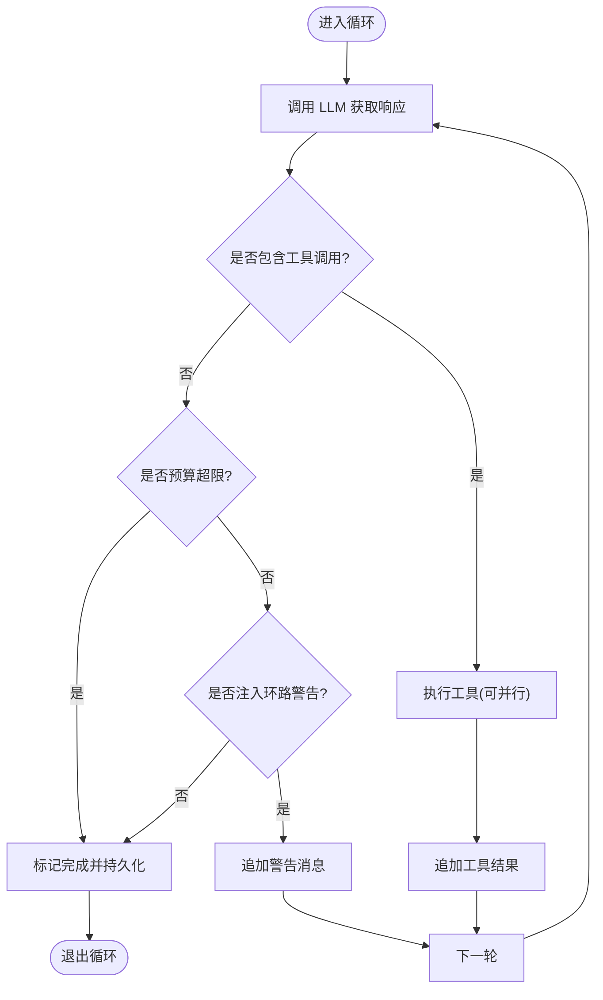
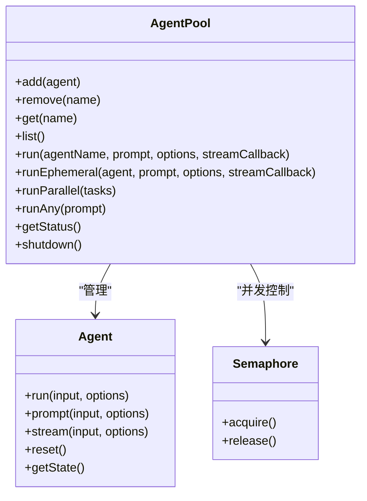
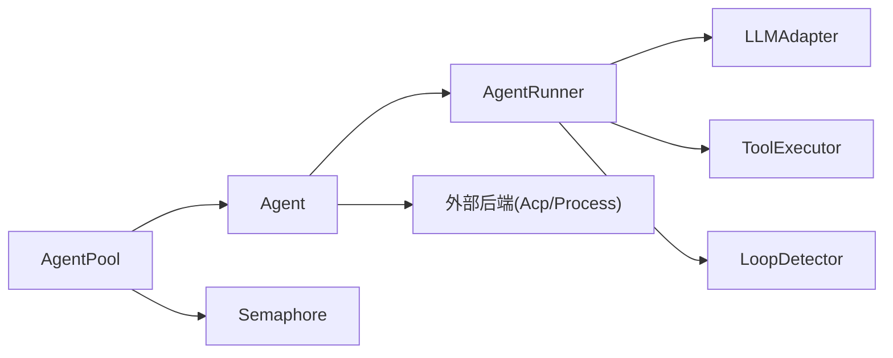

# 智能体生命周期管理

<cite>
**本文引用的文件**
- [packages/core/src/agent/agent.ts](file://packages/core/src/agent/agent.ts)
- [packages/core/src/agent/runner.ts](file://packages/core/src/agent/runner.ts)
- [packages/core/src/agent/pool.ts](file://packages/core/src/agent/pool.ts)
- [packages/core/src/types.ts](file://packages/core/src/types.ts)
- [packages/core/src/index.ts](file://packages/core/src/index.ts)
- [README.md](file://README.md)
</cite>

## 目录
1. [简介](#简介)
2. [项目结构](#项目结构)
3. [核心组件](#核心组件)
4. [架构总览](#架构总览)
5. [详细组件分析](#详细组件分析)
6. [依赖关系分析](#依赖关系分析)
7. [性能考量](#性能考量)
8. [故障排查指南](#故障排查指南)
9. [结论](#结论)
10. [附录：配置与使用示例路径](#附录配置与使用示例路径)

## 简介
本文件系统性阐述 Open Multi-Agent（OMA）中“智能体”的完整生命周期管理，包括创建、初始化、执行到销毁各阶段；状态管理机制（运行、错误、暂停/恢复）；执行循环（消息处理、工具调用、结果返回）；配置项（系统提示词、工具权限、上下文策略等）；以及智能体池的资源与并发控制。文档同时提供代码级流程图与时序图，帮助读者从概念到实现全面理解。

## 项目结构
Open Multi-Agent 的核心在 packages/core 中，围绕 Agent、AgentRunner、AgentPool 三大构件组织：
- Agent：对外暴露的高层接口，维护会话历史、状态转换、流式输出、动态工具注册等。
- AgentRunner：对话循环引擎，负责 LLM 调用、工具解析与执行、循环终止、检查点持久化、预算与环路检测。
- AgentPool：智能体池，统一管理多个 Agent 实例，提供并发限制、轮询调度、批量并行执行与健康快照。

图表来源
- [packages/core/src/agent/agent.ts:100-231](file://packages/core/src/agent/agent.ts#L100-L231)
- [packages/core/src/agent/runner.ts:459-486](file://packages/core/src/agent/runner.ts#L459-L486)
- [packages/core/src/agent/pool.ts:51-78](file://packages/core/src/agent/pool.ts#L51-L78)

章节来源
- [README.md:46-97](file://README.md#L46-L97)
- [packages/core/src/index.ts:132-143](file://packages/core/src/index.ts#L132-L143)

## 核心组件
- Agent：封装 AgentRunner，提供 run/prompt/stream 等入口，维护 AgentState（idle/running/completed/error），支持外部后端（ACP/进程）与内置 LLM 后端切换。
- AgentRunner：实现 AgentBackend 接口，驱动 while(true) 主循环，按 turn 推进，处理 tool_use/tool_result，支持检查点、预算、环路检测、上下文压缩等。
- AgentPool：注册/注销 Agent，通过 Semaphore 控制全局并发，提供 run/runAny/runParallel 等方法，并暴露 PoolStatus 健康快照。

章节来源
- [packages/core/src/agent/agent.ts:100-231](file://packages/core/src/agent/agent.ts#L100-L231)
- [packages/core/src/agent/runner.ts:459-486](file://packages/core/src/agent/runner.ts#L459-L486)
- [packages/core/src/agent/pool.ts:51-78](file://packages/core/src/agent/pool.ts#L51-L78)

## 架构总览
下图展示一次典型 Agent 运行的端到端流程：上层调用进入 Agent，按需懒加载后端（默认 AgentRunner），Runner 与 LLM 交互，解析工具调用并交由 ToolExecutor 执行，结果回写对话并继续循环，直至结束或触发异常/预算/环路保护。

图表来源
- [packages/core/src/agent/agent.ts:164-231](file://packages/core/src/agent/agent.ts#L164-L231)
- [packages/core/src/agent/runner.ts:902-931](file://packages/core/src/agent/runner.ts#L902-L931)
- [packages/core/src/agent/runner.ts:1265-1326](file://packages/core/src/agent/runner.ts#L1265-L1326)

## 详细组件分析

### 智能体生命周期与状态机
- 创建：new Agent(config, registry, executor)，校验 model/backend，复制初始 history。
- 初始化：首次 run/prompt/stream 时懒加载后端（LLM 或外部后端）。
- 执行：run 走一次性对话；prompt 追加到持久历史；stream 逐事件产出。
- 销毁：AgentPool.shutdown 会 reset 所有 Agent，清空历史并回到 idle。

状态转换（AgentState.status）：
- idle → running：开始执行前置准备（构建消息、选择后端）。
- running → completed：无更多工具调用且达到终止条件。
- running → error：异常、预算超限、环路终止、取消等。
- 暂停/恢复：通过检查点（checkpoint）在任务边界持久化中间态，后续 restore 可续跑。

图表来源
- [packages/core/src/types.ts:1247-1253](file://packages/core/src/types.ts#L1247-L1253)
- [packages/core/src/agent/pool.ts:349-362](file://packages/core/src/agent/pool.ts#L349-L362)

章节来源
- [packages/core/src/agent/agent.ts:100-149](file://packages/core/src/agent/agent.ts#L100-L149)
- [packages/core/src/agent/pool.ts:349-362](file://packages/core/src/agent/pool.ts#L349-L362)
- [packages/core/src/types.ts:1247-1253](file://packages/core/src/types.ts#L1247-L1253)

### 执行循环机制（消息处理、工具调用、结果返回）
- 主循环：while(true) 直到 end_turn 或 maxTurns 耗尽。
- 每轮：发送消息给 LLM → 解析 tool_use → 若存在则执行工具（可并行）→ 将结果追加为 tool_result → 继续下一轮。
- 终止条件：无工具调用、预算超限、环路检测触发、最大轮次、取消信号。
- 检查点：在每个关键阶段（awaiting_model/executing_tools/completed）持久化中间态，支持中断恢复。

图表来源
- [packages/core/src/agent/runner.ts:902-931](file://packages/core/src/agent/runner.ts#L902-L931)
- [packages/core/src/agent/runner.ts:1265-1326](file://packages/core/src/agent/runner.ts#L1265-L1326)

章节来源
- [packages/core/src/agent/runner.ts:902-931](file://packages/core/src/agent/runner.ts#L902-L931)
- [packages/core/src/agent/runner.ts:1265-1326](file://packages/core/src/agent/runner.ts#L1265-L1326)

### 配置选项详解
- 系统提示词：systemPrompt，可在 AgentConfig 中设置；当配置 outputSchema 时会自动附加结构化输出指令。
- 工具权限：toolPreset/allowedTools/disallowedTools/onToolCall，默认拒绝内置工具，需显式授权；支持白名单/黑名单/预设组合。
- 上下文策略：contextStrategy（滑动窗口/摘要/压缩），控制长对话输入增长。
- 其他关键参数：maxTurns、maxTokens、temperature/topP/topK/minP、parallelToolCalls、frequencyPenalty/presencePenalty、extraBody、thinking、callTimeoutMs、loopDetection、maxTokenBudget、compressToolResults、preserveReasoningAsText、compressReasoningText。
- 工作目录沙箱：cwd（string/null/undefined 三种模式）。

章节来源
- [packages/core/src/agent/agent.ts:181-221](file://packages/core/src/agent/agent.ts#L181-L221)
- [packages/core/src/agent/runner.ts:85-177](file://packages/core/src/agent/runner.ts#L85-L177)
- [packages/core/src/types.ts:191-206](file://packages/core/src/types.ts#L191-L206)
- [packages/core/src/types.ts:1007-1043](file://packages/core/src/types.ts#L1007-L1043)

### 智能体池与并发控制
- 注册/查询/移除：add/get/remove/list。
- 并发控制：全局 Semaphore(maxConcurrency) 限制整体并发；每个 Agent 实例持有独立 Semaphore(1) 防止同一实例并发冲突。
- 调度方式：
  - run：按名称查找 Agent，串行该实例内调用，受全局并发限制。
  - runAny：轮询选择下一个可用 Agent。
  - runParallel：批量并行提交，内部聚合结果，失败转为错误结果对象。
- 健康监控：getStatus 返回各状态计数（idle/running/completed/error）。
- 生命周期：shutdown 重置所有 Agent 的历史与状态。

图表来源
- [packages/core/src/agent/pool.ts:51-78](file://packages/core/src/agent/pool.ts#L51-L78)
- [packages/core/src/agent/pool.ts:99-140](file://packages/core/src/agent/pool.ts#L99-L140)
- [packages/core/src/agent/pool.ts:146-196](file://packages/core/src/agent/pool.ts#L146-L196)
- [packages/core/src/agent/pool.ts:244-318](file://packages/core/src/agent/pool.ts#L244-L318)
- [packages/core/src/agent/pool.ts:324-362](file://packages/core/src/agent/pool.ts#L324-L362)

章节来源
- [packages/core/src/agent/pool.ts:51-78](file://packages/core/src/agent/pool.ts#L51-L78)
- [packages/core/src/agent/pool.ts:146-196](file://packages/core/src/agent/pool.ts#L146-L196)
- [packages/core/src/agent/pool.ts:244-318](file://packages/core/src/agent/pool.ts#L244-L318)
- [packages/core/src/agent/pool.ts:324-362](file://packages/core/src/agent/pool.ts#L324-L362)

### 检查点与恢复（暂停/恢复）
- 检查点写入时机：awaiting_model、executing_tools、completed 等阶段均会持久化当前对话、消息、token 用量、工具调用记录及轮次。
- 恢复语义：restore 后可继续执行未完成的工具调用或从最近断点继续，保证幂等与一致性。
- 适用场景：长时间任务、网络抖动、人工审批挂起、计划修订等。

章节来源
- [packages/core/src/agent/runner.ts:916-931](file://packages/core/src/agent/runner.ts#L916-L931)
- [packages/core/src/types.ts:2510-2529](file://packages/core/src/types.ts#L2510-L2529)

### 错误与异常处理
- 常见错误类型：LLM 调用超时、令牌预算超限、无效消息、工具不支持、路由相关错误等。
- 处理策略：
  - 预算超限：在循环中检测到后立即终止并标记 budgetExceeded。
  - 环路检测：根据配置注入警告或直接终止，并在结果中标记 loopDetected。
  - 取消：通过 AbortSignal 中止 LLM 调用与循环。
  - 工具调用门控：onToolCall 可拒绝或挂起请求，必要时生成审批单。

章节来源
- [packages/core/src/agent/runner.ts:1265-1326](file://packages/core/src/agent/runner.ts#L1265-L1326)
- [packages/core/src/types.ts:1216-1245](file://packages/core/src/types.ts#L1216-L1245)
- [packages/core/src/index.ts:186-202](file://packages/core/src/index.ts#L186-L202)

## 依赖关系分析
- Agent 依赖 AgentRunner（默认后端）或外部后端（ACP/进程），并通过 ToolRegistry/ToolExecutor 管理工具。
- AgentRunner 依赖 LLMAdapter、LoopDetector、ToolExecutor、工具授权模块、结果处理与追踪工具。
- AgentPool 依赖 Agent 与 Semaphore，提供并发与调度能力。
- 类型定义集中在 types.ts，贯穿各模块。

图表来源
- [packages/core/src/agent/agent.ts:164-231](file://packages/core/src/agent/agent.ts#L164-L231)
- [packages/core/src/agent/runner.ts:459-486](file://packages/core/src/agent/runner.ts#L459-L486)
- [packages/core/src/agent/pool.ts:51-78](file://packages/core/src/agent/pool.ts#L51-L78)

章节来源
- [packages/core/src/agent/agent.ts:164-231](file://packages/core/src/agent/agent.ts#L164-L231)
- [packages/core/src/agent/runner.ts:459-486](file://packages/core/src/agent/runner.ts#L459-L486)
- [packages/core/src/agent/pool.ts:51-78](file://packages/core/src/agent/pool.ts#L51-L78)

## 性能考量
- 并发控制：通过 AgentPool 的全局 Semaphore 限制总体并发，避免资源争用与下游限流。
- 工具并行：Runner 支持在同一 turn 内并行执行多个工具调用，提升吞吐。
- 上下文压缩：contextStrategy 可选滑动窗口/摘要/压缩，降低长对话成本。
- 预算与超时：maxTokenBudget 与 callTimeoutMs 保障运行可控。
- 环路检测：自动识别重复行为，减少无效循环带来的开销。

[本节为通用指导，不直接分析具体文件]

## 故障排查指南
- 模型未配置：独立 Agent 必须声明 model 或使用外部 backend，否则会抛出错误。
- 工具未授权：默认拒绝内置工具，需在配置中显式授予或通过 onToolCall 门控。
- 预算超限：检查 maxTokenBudget 与模型 token 消耗，必要时启用上下文压缩。
- 环路告警：调整 loopDetection 策略，观察 onWarning 日志定位问题。
- 取消执行：确保传入 abortSignal，并在工具中检查以快速释放资源。
- 恢复失败：确认 checkpoint store 可用，恢复参数一致。

章节来源
- [packages/core/src/agent/agent.ts:127-137](file://packages/core/src/agent/agent.ts#L127-L137)
- [packages/core/src/agent/runner.ts:1291-1299](file://packages/core/src/agent/runner.ts#L1291-L1299)
- [packages/core/src/agent/runner.ts:1265-1278](file://packages/core/src/agent/runner.ts#L1265-L1278)

## 结论
Open Multi-Agent 通过 Agent、AgentRunner、AgentPool 的清晰分层，提供了完整的智能体生命周期管理能力：从创建、初始化、执行到销毁；具备健壮的状态机、检查点恢复、严格的工具权限控制与上下文策略；并通过池化与并发控制优化资源使用。结合丰富的配置项与可观测性能力，适合在生产环境中构建可靠的多智能体编排系统。

[本节为总结，不直接分析具体文件]

## 附录：配置与使用示例路径
- 快速开始与团队运行示例：见根仓库 README 中的示例片段。
- 公开 API 入口与导出：参见 index.ts 的导出清单。
- Agent 配置与后端选择：参考 agent.ts 中的 getBackend 与 RunnerOptions 组装逻辑。
- 执行循环与检查点：参考 runner.ts 的主循环与 persistCheckpoint。
- 池化与并发：参考 pool.ts 的 run/runAny/runParallel 与 getStatus。

章节来源
- [README.md:67-93](file://README.md#L67-L93)
- [packages/core/src/index.ts:57-143](file://packages/core/src/index.ts#L57-L143)
- [packages/core/src/agent/agent.ts:164-231](file://packages/core/src/agent/agent.ts#L164-L231)
- [packages/core/src/agent/runner.ts:902-931](file://packages/core/src/agent/runner.ts#L902-L931)
- [packages/core/src/agent/pool.ts:146-318](file://packages/core/src/agent/pool.ts#L146-L318)